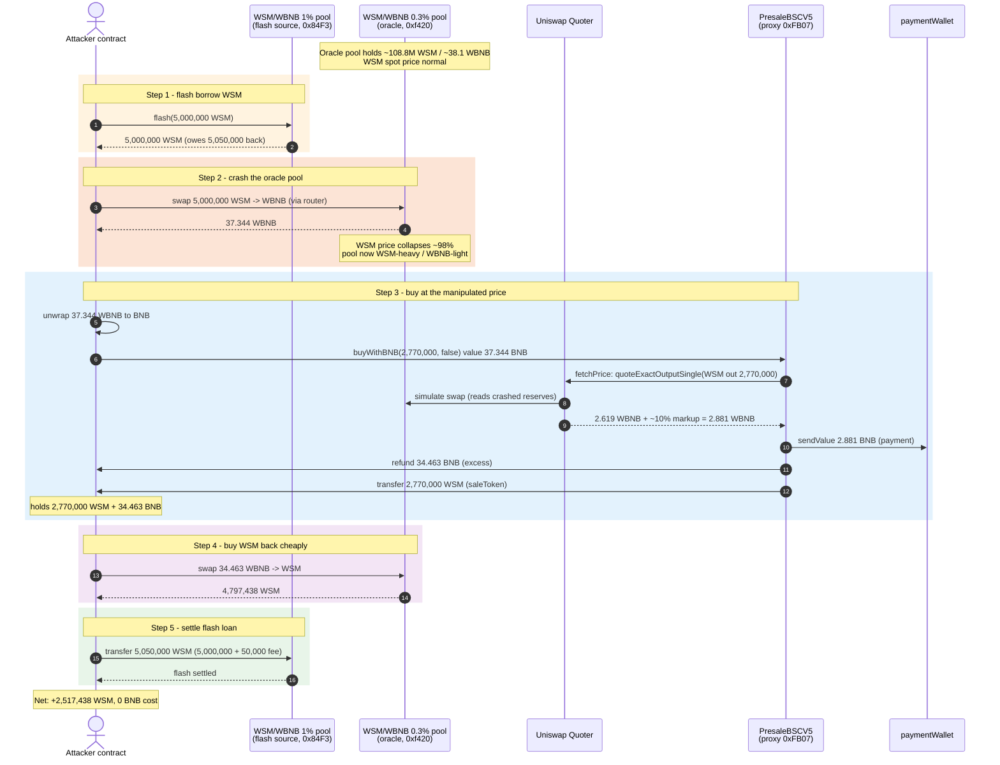
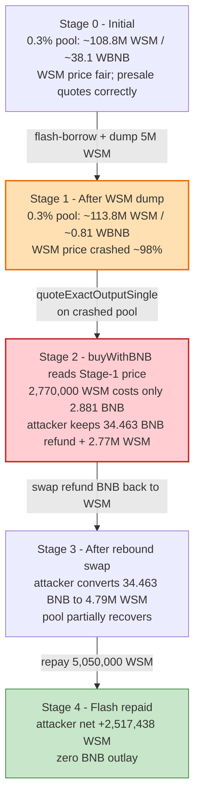
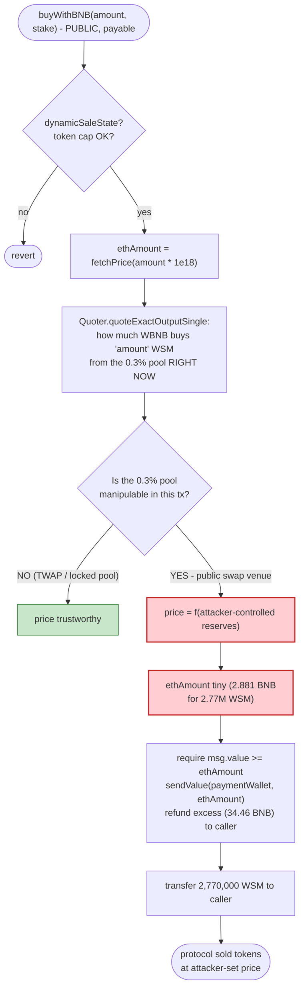

# WSM Presale Exploit — Spot-Oracle Price Manipulation in `buyWithBNB()` via Flash-Loan Pool Crash

> **Vulnerability classes:** vuln/oracle/spot-price · vuln/governance/flash-loan-attack

> **Reproduction:** the PoC compiles & runs in an isolated Foundry project at
> [this project folder](.). Full verbose trace: [output.txt](output.txt).
> Verified vulnerable source: [sources/PresaleBSCV5_c0afd0/PresaleBSCV5Flat.sol](sources/PresaleBSCV5_c0afd0/PresaleBSCV5Flat.sol).

---

## Key info

| | |
|---|---|
| **Loss** | ~**2,517,438 WSM** (≈ $18K at the time) — tokens minted/transferred from the presale contract at a manipulated, near-zero BNB price |
| **Vulnerable contract** | `PresaleBSCV5` — [`0xc0afd0E40Bb3DCAeBd9451aa5c319B745bF792B4`](https://bscscan.com/address/0xc0afd0e40bb3dcaebd9451aa5c319b745bf792b4#code) (implementation), behind `TransparentUpgradeableProxy` [`0xFB071837728455c581f370704b225ac9eABDfa4a`](https://bscscan.com/address/0xFB071837728455c581f370704b225ac9eABDfa4a) |
| **Victim pool (oracle)** | WSM/WBNB Uniswap V3 0.3% pool — `0xf420603317a0996A3fCe1b1A80993Eaef6f7AE1a` (the pool `fetchPrice()` reads) |
| **Flash-loan source pool** | WSM/WBNB Uniswap V3 1% pool — `0x84F3cA9B7a1579fF74059Bd0e8929424D3FA330E` |
| **Sale token** | `WallStreetMemesToken` (WSM) — `0x62694D43Ccb9B64e76e38385d15e325c7712A735` |
| **Attacker EOA** | [`0x3026C464d3Bd6Ef0CeD0D49e80f171b58176Ce32`](https://bscscan.com/address/0x3026C464d3Bd6Ef0CeD0D49e80f171b58176Ce32) |
| **Attacker contract** | [`0x014eE3c3dE6941cb0202Dd2b30C89309e874B114`](https://bscscan.com/address/0x014eE3c3dE6941cb0202Dd2b30C89309e874B114) |
| **Attack tx** | [`0x5a475a73343519f899527fdb9850f68f8fc73168073c72a3cff8c0c7b8a1e520`](https://bscscan.com/tx/0x5a475a73343519f899527fdb9850f68f8fc73168073c72a3cff8c0c7b8a1e520) |
| **Chain / block / date** | BSC / 37,569,860 / April 4, 2024 |
| **Compiler** | Solidity v0.8.9 (`commit.e5eed63a`), optimizer 0 runs (impl), 1 run (proxy/token) |
| **Bug class** | Manipulable spot-AMM oracle (price taken from a single Uniswap V3 pool the attacker can swap in the same tx) |

---

## TL;DR

`PresaleBSCV5.buyWithBNB()` prices the WSM it sells with `fetchPrice()`
([PresaleBSCV5Flat.sol:897-903](sources/PresaleBSCV5_c0afd0/PresaleBSCV5Flat.sol#L897-L903)),
which calls Uniswap V3's `Quoter.quoteExactOutputSingle()` **on the live WSM/WBNB
0.3% pool**. That quote is a *spot* price — it reflects the pool's reserves *right now*, and the
pool is a normal swap venue the attacker can trade in the same transaction.

So the attacker:

1. **Flash-borrows 5,000,000 WSM** from the deeper WSM/WBNB **1% pool** (`0x84F3`).
2. **Dumps all of it** into the **0.3% pool** (`0xf420`) — the exact pool `fetchPrice()` reads —
   crashing the WSM price ~98% and pulling out **37.344 WBNB**.
3. Calls **`buyWithBNB(2_770_000, false)`**. With WSM spot price destroyed, `fetchPrice()` reports
   that 2,770,000 WSM should cost only **~2.88 WBNB** (quote 2.619 WBNB + ~10% markup). The attacker
   sends 37.344 BNB, **~34.46 BNB is refunded as "excess"**, and **2,770,000 WSM** is transferred out
   of the presale.
4. **Swaps the refunded 34.46 WBNB back into WSM** on the now-cheap 0.3% pool, receiving
   **4,797,438 WSM**.
5. **Repays** the flash loan (5,000,000 + 0.5% fee = 5,050,000 WSM) and pockets the difference.

Net profit: **2,517,438 WSM** (2,770,000 from presale + 4,797,438 from the rebound swap − 5,050,000
repaid), at zero net BNB cost. The presale effectively gave away tokens at the attacker-controlled
price.

---

## Background — what the presale does

`PresaleBSCV5` is a "dynamic" token presale: instead of a fixed USD price, it sells WSM for BNB at a
price derived from the WSM/WBNB market. The relevant pieces:

- **`fetchPrice(amountOut)`** ([PresaleBSCV5Flat.sol:897-903](sources/PresaleBSCV5_c0afd0/PresaleBSCV5Flat.sol#L897-L903)) —
  the price oracle. It asks the Uniswap V3 `Quoter` (set by the owner, `0xF49D…c7F0`) how much WBNB
  (`tokenIn`) is needed to **buy** `amountOut` WSM from the **hard-coded 0.3% pool**, then adds an
  owner-configurable `percent` markup.
- **`buyWithBNB(amount, _stakeStatus)`** ([PresaleBSCV5Flat.sol:913-932](sources/PresaleBSCV5_c0afd0/PresaleBSCV5Flat.sol#L913-L932)) —
  the sale entry point. It computes `ethAmount = fetchPrice(amount * baseDecimals)`, requires
  `msg.value >= ethAmount`, forwards exactly `ethAmount` to `paymentWallet`, refunds the excess to
  the caller, and transfers `amount * baseDecimals` WSM from the presale's own balance to the buyer.

The fatal assumption is that `fetchPrice()` returns a *trustworthy* price. It does not — it returns
whatever the 0.3% pool's reserves say, and those reserves are moved by ordinary swaps.

### On-chain state at the fork block (block 37,569,860)

Read from the trace ([output.txt](output.txt)):

| Parameter | Value |
|---|---|
| WSM/WBNB 1% pool (`0x84F3`) reserves | 5,076,689 WSM / 81.756 WBNB (the flash-loan source) |
| WSM/WBNB 0.3% pool (`0xf420`) reserves | ~108,783,178 WSM / ~38.127 WBNB (the **oracle** pool) |
| `dynamicSaleState` | `true` (presale active) |
| `baseDecimals` | 1e18 (WSM is 18-decimal) |
| `percent` (markup) | ~10 (inferred: quote 2.619 → charged 2.881 WBNB) |
| `maxTokensToSell − directTotalTokensSold` | ≥ 2,770,000 (sale not exhausted) |
| Presale WSM balance | ≥ 2,770,000 (enough to fill the order) |

---

## The vulnerable code

### 1. The oracle — a single spot pool, hard-coded

```solidity
function fetchPrice(uint256 amountOut) public returns (uint256) {
    bytes memory data = abi.encodeWithSelector(
        quoter.quoteExactOutputSingle.selector,
        0xbb4CdB9CBd36B01bD1cBaEBF2De08d9173bc095c, // WBNB (tokenIn)
        0x62694D43Ccb9B64e76e38385d15e325c7712A735, // WSM   (tokenOut)  ← hard-coded
        3000,                                         // 0.3% fee          ← hard-coded
        amountOut,
        0
    );
    (bool success, bytes memory result) = address(quoter).call(data);
    require(success, 'Call to Quoter failed');
    uint256 amountIn = abi.decode(result, (uint256));
    return amountIn + ((amountIn * percent) / 100);   // + markup, still derived from the spot quote
}
```
Source: [PresaleBSCV5Flat.sol:897-903](sources/PresaleBSCV5_c0afd0/PresaleBSCV5Flat.sol#L897-L903)

`quoteExactOutputSingle` simulates a swap through pool `0xf420` to find the WBNB input that yields
`amountOut` WSM. Its answer is a function of that pool's *current* reserves. Anyone who swaps in
`0xf420` first moves those reserves, then reads a manipulated price.

### 2. The sale — trusts the oracle, refunds excess to the caller

```solidity
function buyWithBNB(uint256 amount, bool _stakeStaus) external payable whenNotPaused nonReentrant returns (bool) {
    require(dynamicSaleState, 'dynamic sale not active');
    require(amount <= maxTokensToSell - directTotalTokensSold, 'amount exceeds max tokens to be sold');
    directTotalTokensSold += amount;
    uint256 ethAmount = fetchPrice(amount * baseDecimals);   // ← manipulable spot price
    require(msg.value >= ethAmount, 'Less payment');
    uint256 excess = msg.value - ethAmount;
    sendValue(payable(paymentWallet), ethAmount);            // protocol gets the (tiny) price
    if (excess > 0) sendValue(payable(_msgSender()), excess); // ← attacker recovers almost everything
    if (!_stakeStaus) {
        bool success = IERC20Upgradeable(saleToken).transfer(_msgSender(), (amount * baseDecimals));
        require(success, 'Token transfer failed');
        ...
    }
    ...
}
```
Source: [PresaleBSCV5Flat.sol:913-932](sources/PresaleBSCV5_c0afd0/PresaleBSCV5Flat.sol#L913-L932)

Two compounding mistakes: the price is manipulable, and **any overpayment is refunded**, so the
attacker can dump a huge `msg.value`, pay only the manipulated-low `ethAmount`, and claw the rest
back in the same call.

---

## Root cause — why it was possible

The presale uses a **single, live, freely-tradable Uniswap V3 pool as its price source** and reads
it in the same atomic transaction in which the attacker trades that pool. Three design decisions
compose into the exploit:

1. **Spot oracle, no manipulation resistance.** `fetchPrice()` reads the instantaneous reserves of
   pool `0xf420`. There is no TWAP, no time-weighted aggregation, no sanity bound, no fallback.
   Whatever the pool says *now* is the price.
2. **The oracle pool is a public swap venue.** The same pool the protocol quotes from is the pool
   anyone can swap in. A flash-loaned dump in `0xf420` moves the quote before `buyWithBNB()` reads it.
3. **Excess-BNB refund inside the sale.** Because `buyWithBNB` returns `msg.value − ethAmount`, the
   attacker doesn't even need to predict the manipulated price precisely — they send a large
   overpayment, the contract charges the manipulated-low `ethAmount`, and hands the rest straight back.
   The attacker's only "real" cost is the cheap BNB price of the presale tokens.

The deeper 1% pool (`0x84F3`) exists as a flash-loan source because Uniswap V3's `flash()` lends the
borrower tokens cheaply (0.3% pool-fee-scaled, here effectively a 1% fee) for one transaction,
provided they are repaid with the fee. The attacker used it to borrow WSM without owning any, used
that WSM to distort the *separate* 0.3% oracle pool, and settled up at the end.

---

## Preconditions

- `dynamicSaleState == true` (presale active) — ✓ at block 37,569,860.
- The presale holds ≥ `amount` WSM to transfer to the buyer — ✓ (2,770,000 WSM available).
- `maxTokensToSell − directTotalTokensSold ≥ amount` — ✓.
- A WSM flash-loan source with sufficient depth (the 1% pool had 5.07M WSM) — ✓.
- No front-end KYC/whitelist on `buyWithBNB` — it only checks `dynamicSaleState` and the token-cap,
  so anyone can call it. ✓.

No privileged role is required. The attack is fully permissionless and atomic.

---

## Attack walkthrough (with on-chain numbers from the trace)

All figures are from [output.txt](output.txt). WSM and WBNB are both 18-decimal; amounts are shown in
whole tokens where convenient.

| # | Step | WSM bal (attacker) | WBNB/BNB bal (attacker) | Effect |
|---|------|-------------------:|------------------------:|--------|
| 0 | **Initial** | 0 | 0 | Attacker starts empty; fully flash-funded. |
| 1 | **Flash borrow** — `0x84F3.flash(…, 5,000,000 WSM, 0)` | +5,000,000 | 0 | Owes 5,000,000 + fee (5,050,000 total). |
| 2 | **Dump WSM→WBNB** on the **0.3% oracle pool** `0xf420` via router `exactInputSingle(5,000,000 WSM → WBNB)` | 0 | +37.344 WBNB | WSM price in `0xf420` crashes ~98% (pool now WSM-heavy, WBNB-light). |
| 3 | **Unwrap** WBNB→BNB (`WBNB.withdraw(37.344)`) | 0 | 37.344 BNB | Ready to send native BNB to `buyWithBNB`. |
| 4 | **`buyWithBNB(2_770_000, false)` with 37.344 BNB** | — | — | `fetchPrice` quotes via crashed pool: 2,770,000 WSM costs only **2.881 BNB** (quote 2.619 + ~10% markup). |
| 4a | &nbsp;&nbsp;→ `paymentWallet` (`0xb033…46A7`) receives 2.881 BNB | — | −2.881 | Protocol paid (the manipulated-low price). |
| 4b | &nbsp;&nbsp;→ attacker refunded **34.463 BNB** as excess | — | 34.463 | Overpayment clawed back. |
| 4c | &nbsp;&nbsp;→ presale transfers **2,770,000 WSM** to attacker | +2,770,000 | — | Tokens bought at ~0.000001 BNB each. |
| 5 | **Rebound swap** — swap refunded **34.463 WBNB → WSM** on the now-cheap 0.3% pool `0xf420` | +4,797,438 | −34.463 | Buys WSM back cheaply; pool partially recovers. |
| 6 | **Repay flash loan** — transfer 5,050,000 WSM (5,000,000 + 50,000 fee) to `0x84F3` | −5,050,000 | 0 | Flash settled; `Flash` event emitted, `paid0 = 50,000 WSM`. |
| 7 | **Final attacker balance** | **2,517,438 WSM** | **0 BNB** | Pure profit; zero net BNB outlay. |

### Key trace anchors

- Flash borrow & callback: [output.txt:38-49](output.txt#L38) — `flash(..., 5e24, 0, 0x)` then `uniswapV3FlashCallback(5e22, 0, …)` (fee0 = 50,000 WSM).
- WSM→WBNB dump on `0xf420`: [output.txt:54-86](output.txt#L54) — `swap(... 5e24 …)` returns `37,344,712,626,082,242,493` wei ≈ **37.344 WBNB** ([output.txt:56](output.txt#L56), [output.txt:86](output.txt#L86)).
- `buyWithBNB` quote via `Quoter.quoteExactOutputSingle` on `0xf420`: [output.txt:102-124](output.txt#L102) — internal `swap` reverts (quote-only), returns `2,619,269,777,880,106,176` wei ≈ **2.619 WBNB** ([output.txt:124](output.txt#L124)).
- BNB flows inside `buyWithBNB`: `paymentWallet` gets `2,881,196,755,668,116,793` wei ([output.txt:125](output.txt#L125)), attacker refunded `34,463,515,870,414,125,700` wei ≈ **34.463 WBNB** ([output.txt:127](output.txt#L127)). So `ethAmount` ≈ 2.881 WBNB (quote 2.619 + ~10% markup).
- Presale → attacker WSM transfer: `2,770,000 WSM` ([output.txt:129-130](output.txt#L129)).
- Rebound swap 34.463 WBNB → `4,797,438,179,912,631,607,253,979` wei ≈ **4,797,438 WSM** ([output.txt:150-184](output.txt#L150)).
- Flash repayment `5,050,000 WSM` ([output.txt:187-188](output.txt#L187)); `Flash` event `paid0 = 5e22` ([output.txt:198](output.txt#L198)).
- Final balance: `2,517,438,179,912,631,607,253,979` wei ≈ **2,517,438 WSM** ([output.txt:203-204](output.txt#L203)).

---

## Profit / loss accounting

### WSM (tokens)

| Direction | Amount (WSM) |
|---|---:|
| Received — presale `buyWithBNB` | +2,770,000 |
| Received — rebound swap (34.463 WBNB → WSM) | +4,797,438 |
| Spent — flash-loan principal repayment | −5,000,000 |
| Spent — flash-loan fee (1%) | −50,000 |
| **Net WSM profit** | **+2,517,438** |

### BNB (capital)

| Direction | Amount (BNB) |
|---|---:|
| Received — WSM dump (step 2) | +37.344 |
| Spent — `buyWithBNB` msg.value | −37.344 |
| Received — `buyWithBNB` excess refund | +34.463 |
| Spent — rebound swap (step 5) | −34.463 |
| **Net BNB** | **0** |

The attacker put in **no capital of their own**: every BNB used came from the flash-loan-enabled
WSM dump and was recycled within the same transaction. The ~18K USD value of the 2,517,438 WSM is
extracted purely from the presale's willingness to sell at the manipulated price. The 2.881 BNB that
reached `paymentWallet` is the protocol's "sale proceeds" at the crashed price — far below fair value.

---

## Diagrams

### Sequence of the attack



### Pool-state and oracle distortion



### Why `fetchPrice` is unsafe (control flow)



---

## Remediation

1. **Do not use a spot AMM pool as a price oracle.** This is the root cause. Replace `fetchPrice()`'s
   `quoteExactOutputSingle` with a manipulation-resistant source:
   - A **Uniswap V3 TWAP** (observe `observe(secondsAgo)` over a window such as 30 minutes), or
   - A **Chainlink / off-chain price feed** (the contract already imports a Chainlink-style
     `Aggregator` and uses it in `buyWithUSDT` via `getLatestPrice()` — reuse it for the BNB path), or
   - A **fixed admin-set USD price** (the non-dynamic rounds mechanism the contract already
     supports).
2. **Add a sanity bound on the quoted price.** Even with a TWAP, clamp `ethAmount` to
   `[minPrice, maxPrice]` per token so a residual manipulation can't move the price by >X% in one
   block. Reject the sale if the quote is outside the band.
3. **Don't refund arbitrary excess inside the sale.** Require `msg.value == ethAmount` (or cap the
   overpayment). The refund amplifies the oracle bug: the attacker can blindly overpay and recover
   everything but the manipulated-low charge. Removing the refund forces the attacker to predict the
   exact (still-wrong) price and doesn't fix the oracle, but it removes a free option.
4. **Decouple the oracle pool from a tradable pool.** If a pool must be read, read a pool the
   attacker *cannot* swap in the same tx (e.g., a dedicated, liquidity-locked "reference" pool) —
   though TWAP/oracle is strictly better.
5. **Add a per-block / per-tx reentrancy-style guard on `buyWithBNB` + swaps.** A
   `lastSwapBlock`-style check that rejects `buyWithBNB` if the oracle pool was swapped in the same
   block is a weak but cheap backstop.

The `nonReentrant` modifier on `buyWithBNB` is irrelevant here — this is not a reentrancy bug; the
attacker never re-enters. The manipulation happens entirely *before* the call.

---

## How to reproduce

The PoC was extracted into a standalone Foundry project under
`evm-hack-registry/2024-04-WSM_exp/` (the umbrella DeFiHackLabs repo does not whole-compile cleanly).

```bash
_shared/run_poc.sh 2024-04-WSM_exp --mt testExploit -vvvvv
```

- **RPC:** a **BSC archive** endpoint is required (fork block 37,569,860 is from April 2024 and is
  pruned on most public RPCs). `foundry.toml` uses `https://bsc-mainnet.public.blastapi.io`, which
  serves the historical state. Expect `header not found` / `missing trie node` on pruned endpoints.
- **Result:** `[PASS] testExploit()` (gas: ~608k), finishing in ~16s on a fork.

Expected tail (from [output.txt](output.txt)):

```
Logs:
  1. before attack wsh token balance of this =  0
  2. bnb_wsh_10000 pool wsh balance after flashloan =  5000000000000000000000000
  3. balance after exchanging wsh for bnb =  37344712626082242493
  4. [ ============= ATTACK START ============= ]
  5. wsh balance after attack function buyWithBNB() =  2770000000000000000000000
  6. [ ============= ATTACK END ============= ]
  7. repay flashloan for bnb_wsh_10000 pool
  8. after attack wsh token balance of this =  2517438179912631607253979

Suite result: ok. 1 passed; 0 failed; 0 skipped; finished in 15.77s (13.00s CPU time)
```

Final attacker balance: **2,517,438,179,912,631,607,253,979 WSM** (≈ 2.517M WSM), with zero net BNB
cost — matching the `@KeyInfo` total-lost figure in [test/WSM_exp.sol](test/WSM_exp.sol) (the PoC
header writes "WSM" for the token; the test variable is named `wshToken_` after its deployment symbol).

---

*Bug class: manipulable spot-AMM oracle. The presale priced token sales off a single live Uniswap V3
pool that the attacker crashed with a flash-loaned dump in the same transaction, then bought tokens at
the resulting near-zero price and recovered the overpayment via the in-function BNB refund.*
