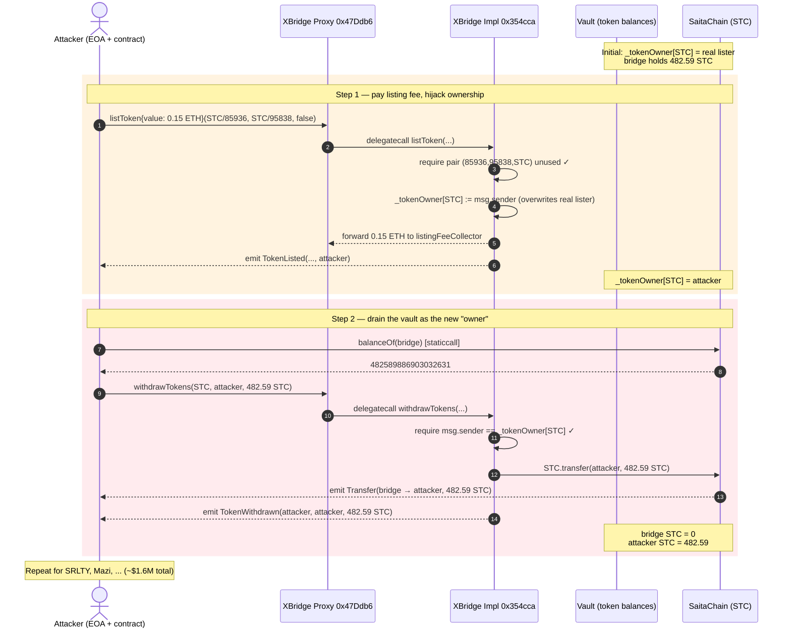
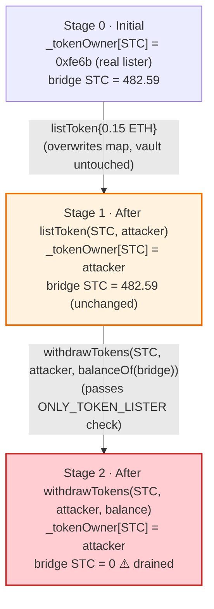
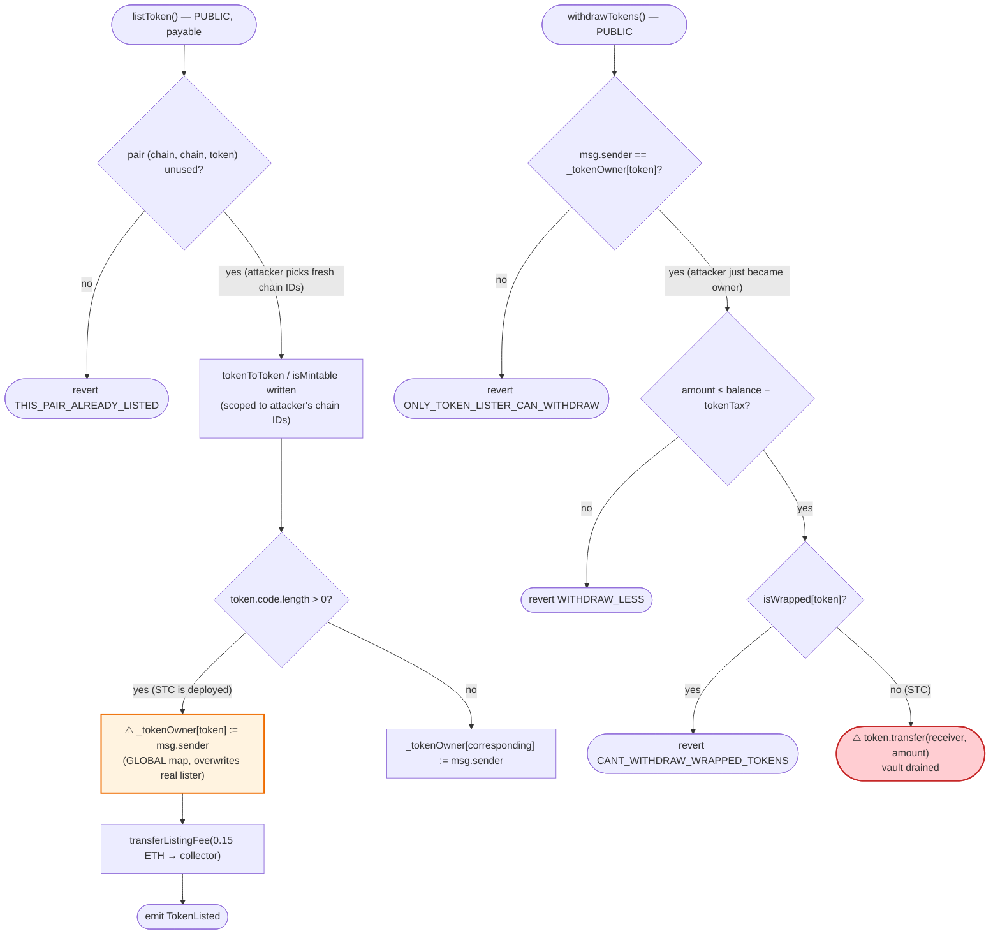
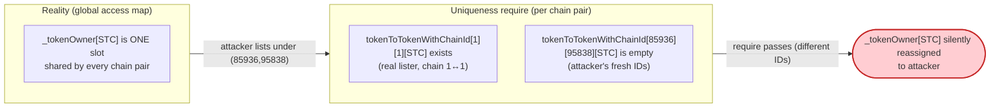

# XBridge Exploit — Permissionless `listToken()` Hijacks Token Ownership Then Drains Bridge Reserves

> **Vulnerability classes:** vuln/access-control/missing-auth · vuln/access-control/missing-owner-check

> **Reproduction:** the PoC compiles & runs in an isolated Foundry project at [this project folder](.).
> Full verbose trace: [output.txt](output.txt).
> Verified vulnerable implementation: [contracts_XBridge4.sol](sources/XBridge_354cca/contracts_XBridge4.sol)
> (behind proxy [OwnedUpgradeabilityProxyFactory.sol](sources/OwnedUpgradeabilityXBridgeProxy_47Ddb6/contracts_OwnedUpgradeabilityProxyFactory.sol)).

---

## Key info

| | |
|---|---|
| **Loss** | ~$1.6M total (ETH + STC + SRLTY + Mazi tokens held by the bridge) |
| **Vulnerable contract** | `XBridge` proxy `0x47Ddb6…68e31` → impl `0x354cca…3cb8c` — [impl on Etherscan](https://etherscan.io/address/0x354cca2f55dde182d36fe34d673430e226a3cb8c#code) |
| **Victim** | the bridge vault itself (tokens deposited by real listers) |
| **Attacker EOA** | [`0x0cfc28d16d07219249c6d6d6ae24e7132ee4caa7`](https://etherscan.io/address/0x0cfc28d16d07219249c6d6d6ae24e7132ee4caa7) |
| **Attack tx — step 1 (deposit/list)** | [`0xe09d350d8574ac1728ab5797e3aa46841f6c97239940db010943f23ad4acf7ae`](https://etherscan.io/tx/0xe09d350d8574ac1728ab5797e3aa46841f6c97239940db010943f23ad4acf7ae) |
| **Attack tx — step 2 (withdraw/drain)** | [`0x903d88a92cbc0165a7f662305ac1bff97430dbcccaa0fe71e101e18aa9109c92`](https://etherscan.io/tx/0x903d88a92cbc0165a7f662305ac1bff97430dbcccaa0fe71e101e18aa9109c92) |
| **Chain / block / date** | Ethereum mainnet / 19,723,700 / April 24, 2024 |
| **Compiler** | Implementation `v0.8.20+commit.a1b79de6`, optimizer 1, 200 runs; proxy `v0.8.18` |
| **Bug class** | Broken access control / ownership hijack — public listing function self-assigns token ownership, then `withdrawTokens` trusts that ownership |

---

## TL;DR

`XBridge` is an upgradeable cross-chain bridge whose vault holds tokens that legitimate *listers*
have deposited. The ownership of each token — i.e. who is allowed to call `withdrawTokens()` and pull
that token out of the bridge — is stored in the flat map `_tokenOwner[token]`
([contracts_XBridge4.sol:58](sources/XBridge_354cca/contracts_XBridge4.sol#L58)).

`listToken()` is **publicly callable by anyone** who pays the `listingFee`. As a side effect of
listing, it runs:

```solidity
if (_baseToken.code.length > 0) _tokenOwner[_baseToken] = msg.sender;
```
([:445](sources/XBridge_354cca/contracts_XBridge4.sol#L445))

…which means **the first external caller to "list" an already-deposited token becomes its owner**,
overwriting the real lister's entry. `withdrawTokens()` then only checks
`require(user == _tokenOwner[token], "ONLY_TOKEN_LISTER_CAN_WITHDRAW")`
([:635](sources/XBridge_354cca/contracts_XBridge4.sol#L635)) and a balance ceiling, so the freshly
self-appointed owner can withdraw **every token of that address the bridge holds** — including tokens
the original lister deposited.

The attacker paid 0.15 ETH (the listing fee, forwarded to `listingFeeCollector`) to register itself
as `_tokenOwner[STC]`, then immediately called `withdrawTokens(STC, attacker, balanceOf(bridge))` and
walked off with the bridge's **entire STC reserve of 482.59 STC** (482,589,886.903032631 STC at 9
decimals) in the same transaction. The same two-call recipe was repeated across the other tokens the
vault held, totalling ~$1.6M.

The PoC reproduces the attack against a mainnet fork at block 19,723,700 (one block before the live
step-2 tx) and shows the balance flip from `0` to `482589886.903032631 STC`.

---

## Background — what XBridge does

`XBridge` ([source](sources/XBridge_354cca/contracts_XBridge4.sol)) is an
`OwnableUpgradeable` + `ReentrancyGuardUpgradeable` bridge that locks tokens on a source chain and,
after a 3-of-N signer quorum signs an unlock payload, releases the corresponding token on the
destination chain. Two user-facing roles drive the vault:

- **Lister** — the party that calls `listToken()` (paying `listingFee` in ETH) to register a token
  pair between two chain IDs. The lister is expected to also be the one who funds the vault via
  `depositTokens()`.
- **Bridger** — end users who call `lock()` / `unlock()` with signed payloads.

Ownership of each token (the right to deposit/withdraw it from the vault) is tracked in two parallel
structures:

| Mapping | Granularity | Used by |
|---|---|---|
| `tokenOwnerWithChainId[src][dst][a][b]` | per token-pair, per chain-pair | (mostly unused in checks) |
| `_tokenOwner[token]` | flat, one owner per token address | `depositTokens` and `withdrawTokens` access checks |

The flat `_tokenOwner` map is the **only** check that gates withdrawals, and it is what `listToken`
overwrites. The on-chain state at the fork block (read straight from the trace):

| Parameter | Value |
|---|---|
| `listingFee` | 0.15 ETH (the `msg.value` the PoC sends) |
| `excludeFeeFromListing[attacker]` | false (attacker had to pay the fee) |
| STC held by the bridge (`balanceOf(0x47Ddb6…)`) | 482,589,886,903,032,631 raw = **482.589886 STC** (9 decimals) |
| `_tokenOwner[STC]` before attack | the *real* lister (`0xfe6b…2fcd`, visible in the storage-diff of the trace) |

The last row is the whole game: the bridge is holding someone else's STC, and that ownership record
is one `listToken` call away from being overwritten.

---

## The vulnerable code

### 1. `listToken()` — public, fee-gated, and it self-assigns `_tokenOwner`

```solidity
function listToken(tokenInfo memory baseToken, tokenInfo memory correspondingToken, bool _isMintable) external payable {
    address _baseToken = baseToken.token;
    address _correspondingToken = correspondingToken.token;
    require(_baseToken != address(0), "INVALID_ADDR");
    require(_correspondingToken != address(0), "INVALID_ADDR");
    require(tokenToTokenWithChainId[baseToken.chain][correspondingToken.chain][_baseToken] == address(0)
         && tokenToTokenWithChainId[baseToken.chain][correspondingToken.chain][_correspondingToken] == address(0),
            "THIS_PAIR_ALREADY_LISTED");
    // ... writes isMintable / tokenToToken / tokenOwner (chain-scoped) ...

    if (_baseToken == _correspondingToken) _tokenOwner[_baseToken] = msg.sender;
    else {
        if (_baseToken.code.length > 0) _tokenOwner[_baseToken] = msg.sender;   // ⚠️ overwrites real owner
        else _tokenOwner[_correspondingToken] = msg.sender;
    }

    if (!excludeFeeFromListing[msg.sender]) transferListingFee(listingFeeCollector, msg.sender, msg.value);
    emit TokenListed(...);
}
```
([contracts_XBridge4.sol:413-453](sources/XBridge_354cca/contracts_XBridge4.sol#L413-L453))

Key observations:

- The pair-uniqueness require on line 418 keys on **`(baseToken.chain, correspondingToken.chain)`**.
  The attacker simply passes two *unused* chain IDs (`85936` and `95838`) — the STC pair was never
  registered for those IDs, so the require passes even though STC is already deposited and owned by
  someone else under a different chain pair.
- Line 445 then unconditionally writes `_tokenOwner[STC] = msg.sender` because
  `_baseToken == STC` and `STC.code.length > 0`. There is **no check** that STC is unowned, no check
  against the existing `_tokenOwner[STC]`, and no check that `correspondingToken` even matches a real
  paired token. Any existing deposit under the same token address is now claimable by the caller.

### 2. `withdrawTokens()` — trusts `_tokenOwner` and the vault's actual balance

```solidity
function withdrawTokens(address token, address receiver, uint256 amount) external {
    require(token != address(0), "TOKEN_NOT_LISTED");
    require(amount > 0, "AMOUNT_CANT_BE_ZERO");
    address user = msg.sender;
    require(user == _tokenOwner[token], "ONLY_TOKEN_LISTER_CAN_WITHDRAW");     // ⚠️ sole access check

    if (token != native) {
        require(amount <= (IERC20(token).balanceOf(address(this)) - tokenTax[token]), "WITHDRAW_LESS");
        if (isWrapped[token]) revert("CANT_WITHDRAW_WRAPPED_TOKENS");
        IERC20(token).transfer(receiver, amount);
    }
    ...
}
```
([contracts_XBridge4.sol:629-652](sources/XBridge_354cca/contracts_XBridge4.sol#L629-L652))

The ceiling is the bridge's *actual* ERC-20 balance minus a small `tokenTax` accrual. STC is not
`isWrapped`, not native, and `tokenTax[STC] == 0`, so the full `482.59 STC` is withdrawable.

### 3. `depositTokens()` — same broken check, confirming the design intent

```solidity
function depositTokens(address token, uint256 amount) external payable {
    ...
    require(user == _tokenOwner[token], "ONLY_LISTER_CAN_DEPOSIT");     // same map
    ...
}
```
([contracts_XBridge4.sol:605-621](sources/XBridge_354cca/contracts_XBridge4.sol#L605-L621))

The map is intended to encode "the lister who funded this token." Both deposit and withdraw lean on
it, but `listToken` lets a stranger seize it.

---

## Root cause — why it was possible

`_tokenOwner[token]` is meant to bind a *real* lister to the tokens they deposited, but nothing in
`listToken()` enforces that binding. Three design decisions compose into a critical bug:

1. **The flat map has no "already owned" guard.** `listToken` writes
   `_tokenOwner[_baseToken] = msg.sender` without checking whether the slot already holds someone
   else. Ownership is silently overwritten. There is no concept of "this token is already listed;
   refuse."
2. **The uniqueness require is scoped the wrong way.** `THIS_PAIR_ALREADY_LISTED`
   ([:418](sources/XBridge_354cca/contracts_XBridge4.sol#L418)) only blocks re-listing the *exact
   same `(chain, chain, token)` triple*. A token already owned under chain pair `(1, 1)` is freely
   re-listable under `(85936, 95838)` — and that re-listing still mutates the global `_tokenOwner`.
   The access-control map is global; the uniqueness check is not.
3. **`withdrawTokens` authorizes against the (now-stolen) map and the vault's live balance.** Once
   the attacker owns the map entry, the only ceiling is how much of that token the bridge happens to
   hold. Every token a legitimate lister ever deposited under that address becomes loot.

Net effect: paying the 0.15 ETH listing fee is a one-time "become owner of any token address I can
name" primitive, after which `withdrawTokens` is a straight vault drain. The signature-gated
`unlock()` path — the legitimate way value is supposed to leave — is never touched; the attacker
bypasses the bridge's whole security model by exploiting the lister/owner bookkeeping.

---

## Preconditions

- A token `T` is held by the bridge (deposited by a real lister) and `T.code.length > 0` (i.e. `T` is
  a deployed ERC-20). For STC both hold: `balanceOf(bridge) = 482.59 STC` and STC is a deployed
  contract.
- `T` is **not** flagged `isWrapped[T]` (otherwise `withdrawTokens` reverts with
  `CANT_WITHDRAW_WRAPPED_TOKENS`). Non-mintable base tokens like STC satisfy this.
- `listingFee` of liquid ETH (0.15 ETH on mainnet) and `excludeFeeFromListing[attacker] == false`,
  so the fee is actually forwarded to `listingFeeCollector`. The attacker self-funded this.
- The `(chainId, chainId, T)` triple passed to `listToken` is unused. Trivially satisfiable: pick any
  two `uint256` values that are not a registered pair for `T`.

No signer keys, no governance action, no flash loan, and no price manipulation are required.

---

## Attack walkthrough (with on-chain numbers from the trace)

STC has 9 decimals; all raw values below are from the events/calls in [output.txt](output.txt). The
PoC runs both steps inside one `testExploit()` call against the fork at block 19,723,700.

| # | Step | Caller / Target | Effect | State after |
|---|------|-----------------|--------|-------------|
| 0 | **Initial** | bridge `0x47Ddb6…68e31` | honest vault | `_tokenOwner[STC] = 0xfe6b…2fcd` (real lister); bridge holds 482.59 STC |
| 1 | **`deal(this, 0.15 ether)`** | PoC setup | give attacker ETH for the listing fee | attacker has 0.15 ETH |
| 2 | **`listToken{value: 0.15 ether}(STC/85936, STC/95838, false)`** | attacker → proxy → impl (delegatecall) | pair `(85936,95838,STC)` is unused ⇒ passes `THIS_PAIR_ALREADY_LISTED`; `STC.code.length>0` ⇒ `_tokenOwner[STC] = attacker`; listing fee forwarded to `listingFeeCollector`; **`emit TokenListed(STC, 85936, STC, 95838, false, attacker)`** | `_tokenOwner[STC] = attacker`; bridge STC unchanged at 482.59 |
| 3 | **`balanceOf(bridge)`** | staticcall | read the ceiling | returns `482589886903032631` raw |
| 4 | **`withdrawTokens(STC, attacker, 482589886903032631)`** | attacker → proxy → impl (delegatecall) | `msg.sender == _tokenOwner[STC]` ✓; `amount ≤ balance − tokenTax` ✓; `isWrapped[STC] == false` ✓; **`STC.transfer(attacker, 482589886903032631)`**; `emit TokenWithdrawn(attacker, attacker, 482.59 STC)` | bridge STC = 0; attacker STC = **482.59** |

The trace's `TokenListed` event
([output.txt](output.txt)) confirms the hijack:

```
emit TokenListed(param0: SaitaChain [0x19Ae49…319A], param1: 85936,
                 param2: SaitaChain [0x19Ae49…319A], param3: 95838,
                 param4: false, param5: ContractTest [0x7FA9…1496])
```

and the storage diff of the delegatecall shows `_tokenOwner[STC]` flipping from the real lister
`0xfe6bb1654227fa21b8a65a6a89f6489fc3cc2fcd` to the attacker `0x7fa938…1496`:

```
@ 0x3266726d…c1a2f0550: 0x…fe6bb1654227fa21b8a65a6a89f6489fc3cc2fcd
                      → 0x…7fa9385be102ac3eac297483dd6233d62b3e1496
```

The closing `TokenWithdrawn` + `Transfer` events confirm the drain of all 482.59 STC:

```
emit Transfer(from: 0x47Ddb6…68e31, to: ContractTest, value: 482589886903032631)
emit TokenWithdrawn(token: ContractTest, depositor: ContractTest, amount: 482589886903032631)
```

PoC log lines:

```
Exploiter STC balance before attack: 0.000000000
Exploiter STC balance after attack:  482589886.903032631
```

On chain the attacker repeated steps 2–4 for every other token the vault held (SRLTY, Mazi, etc.),
each time paying only the listing fee to seize `_tokenOwner[T]` and then draining `balanceOf(bridge)`
— totalling ~$1.6M per the DeBank trace cited in the PoC header.

### Profit / loss accounting (STC leg, the one the PoC demonstrates)

| Direction | Amount |
|---|---:|
| Spent — listing fee (ETH, forwarded to collector) | 0.15 ETH |
| Received — drained STC | 482.59 STC |
| **Net (STC leg)** | **+482.59 STC − 0.15 ETH fee** |

Across all token legs the attacker paid a handful of 0.15 ETH listing fees and extracted ~$1.6M of
deposited tokens. The bridge vault was emptied token-by-token.

---

## Diagrams

### Sequence of the attack



### Owner-map state evolution



### The flaw inside `listToken` → `withdrawTokens`



### Why the uniqueness check does not save you



---

## Remediation

1. **Make `_tokenOwner` write-once per token.** In `listToken`, refuse to (re)assign
   `_tokenOwner[token]` if it is already set to a non-zero address. Alternatively, key all
   access-control checks on the chain-scoped `tokenOwnerWithChainId[…]` map and never maintain a
   second global owner map that can drift out of sync.
2. **Tie withdrawal authorization to the depositor, not the lister.** `withdrawTokens` should check
   against `tokenDeposited` / a per-depositor ledger (e.g.
   `require(amount <= tokenDeposited[token][msg.sender] - tokenWithdrawn[token][msg.sender], …)`),
   so a caller can only pull out what they actually put in. The current check trusts a single
   lister-level slot that anyone can seize.
3. **Gate `listToken` behind a real allow-list or admin approval.** Listing a token that the vault
   will custody should not be a public, fee-only action. Require admin co-signing (`onlyOwner` or a
   2-step request/approve) so a stranger cannot mint ownership entries over already-deposited tokens.
4. **Scope the uniqueness require to the token address, not the chain triple.** If `_tokenOwner[T]`
   is already non-zero, the token is "known to the vault" and must not be re-listable under new chain
   IDs that silently mutate the global owner slot.
5. **Add a reentrancy / two-step transfer guard on `withdrawTokens`.** Even with the above, prefer
   pulling funds via a per-depositor pull pattern and a `nonReentrant` modifier (the bridge already
   imports `ReentrancyGuardUpgradeable` but does not apply it here).

---

## How to reproduce

```bash
_shared/run_poc.sh 2024-04-XBridge_exp --match-test testExploit -vvvvv
```

Expected tail of the trace (the test passes; STC is 9-decimals):

```
Ran 1 test for test/XBridge_exp.sol:ContractTest
[PASS] testExploit() (gas: 263632)
Logs:
  Exploiter STC balance before attack: 0.000000000
  Exploiter STC balance after attack: 482589886.903032631
...
Suite result: ok. 1 passed; 0 failed; 0 skipped; finished in 9.85s (8.48s CPU time)
```

The fork is created at `19_723_701 - 1` (one block before the live step-2 withdrawal tx
`0x903d88…09c92`). The PoC only needs to (a) `deal` itself 0.15 ETH for the listing fee, then (b)
call `listToken` + `withdrawTokens` — the two transactions the attacker performed on chain are
collapsed into a single `testExploit()` for demonstration.
