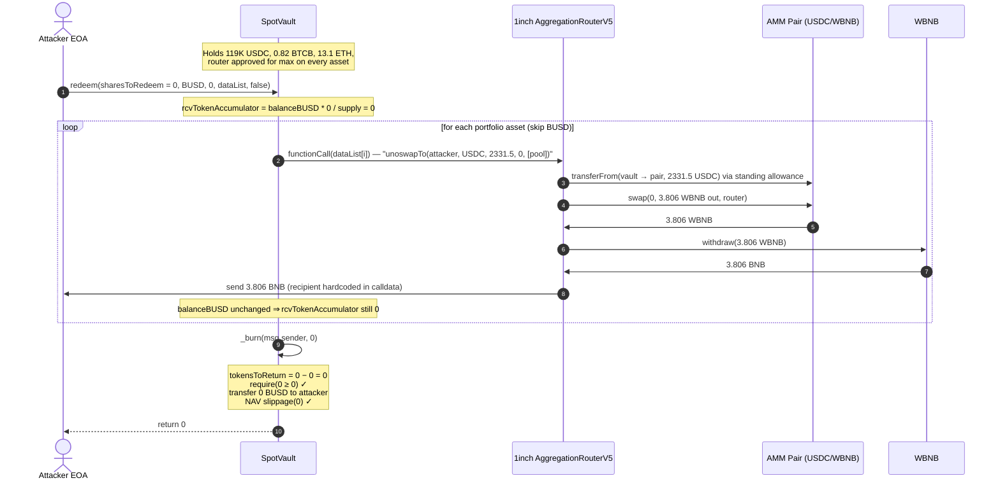
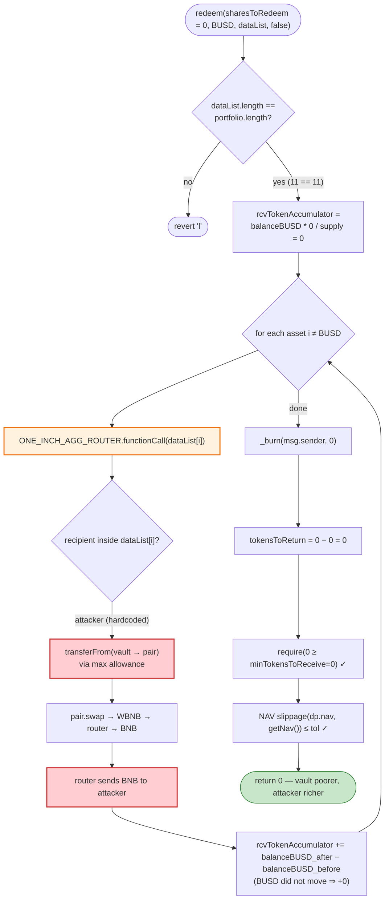
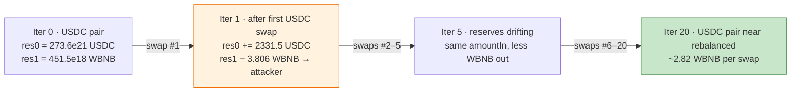

# YIEDL SpotVault Exploit — Zero-Share `redeem()` Token-Drain via Attacker-Controlled Swap Routing

> **Vulnerability classes:** vuln/logic/missing-validation · vuln/dependency/unsafe-external-call

> **Reproduction:** the PoC compiles & runs in an isolated Foundry project at [this project folder](.) —
> the umbrella DeFiHackLabs repo contains many unrelated PoCs that fail to compile under a whole-project
> `forge test`, so this one was extracted. Full verbose trace: [output.txt](output.txt).
> Verified vulnerable source: [SpotVault.sol](sources/SpotVault_4eDda1/SpotVault.sol).

---

## Key info

| | |
|---|---|
| **Loss** | ~**127.48 BNB** (≈ $77K at the time) drained from the YIEDL `SpotVault` portfolio |
| **Vulnerable contract** | `SpotVault` — [`0x4eDda16AB4f4cc46b160aBC42763BA63885862a4`](https://bscscan.com/address/0x4eDda16AB4f4cc46b160aBC42763BA63885862a4#code) |
| **Victim** | YIEDL SpotVault (multi-asset yield vault holding USDC, BTCB, ETH, BNB, BUSD and 6 alts) |
| **Attacker EOA** | `0x1111111111111111111111111111111111111111` (PoC stand-in; live attacker in the referenced tx) |
| **Attack tx (live)** | [`0x49ca5e188c538b4f2efb45552f13309cc0dd1f3592eee54decfc9da54620c2ec`](https://app.blocksec.com/explorer/tx/bsc/0x49ca5e188c538b4f2efb45552f13309cc0dd1f3592eee54decfc9da54620c2ec) |
| **Chain / block / date** | BSC / **38,126,753** / April 24, 2024 |
| **Compiler** | Solidity **v0.8.23**, optimizer **1 run** (10 runs), no proxy |
| **Bug class** | Missing access-control / unchecked user-controlled swap calldata on a `sharesToRedeem = 0` redemption |

---

## TL;DR

YIEDL's `SpotVault.redeem()` lets the caller pass an arbitrary `bytes[] calldata dataList`, then blindly
forwards **each entry** to the trusted 1inch `AggregationRouterV5` via `functionCall(dataList[i])`
([SpotVault.sol:317-333](sources/SpotVault_4eDda1/SpotVault.sol#L317-L333)). The vault had previously
granted the 1inch router **max approval** over every portfolio token, so the attacker could embed
`unoswapTo(attacker, …)` calldata that:

1. Pulls the vault's own USDC/BTCB/BETH **out of the vault** (`transferFrom(vault → pair)`),
2. Swaps them into WBNB inside the AMM pair,
3. Routes the resulting **BNB directly to the attacker EOA** — never back to the vault.

The single enabler that makes this a *free* drain: `redeem()` never checks `sharesToRedeem > 0`. With
`sharesToRedeem = 0`, nothing is burned, the pro-rata `rcvTokenAccumulator` is `0`, the recipient payout
is `0`, and the NAV/slippage post-conditions all trivially pass — yet the swaps the attacker stuffed into
`dataList` still execute and exfiltrate funds. The attacker loops the call **20 times**, each iteration
siphoning a fixed slice of USDC/BTCB/BETH into their wallet, for a total of **~127.48 BNB**.

---

## Background — what SpotVault does

`SpotVault` ([source](sources/SpotVault_4eDda1/SpotVault.sol)) is an ERC20-share, multi-asset robo-vault.
Users deposit a supported token; the vault rotates the resulting AUM across a portfolio of oracle-priced
assets via 1inch, and issues share tokens. Redemption burns shares and converts the pro-rata slice of
**each** portfolio asset into a single `receivingAsset` the redeemer wants, again via 1inch.

The on-chain parameters at the fork block (38,126,753):

| Parameter | Value |
|---|---|
| Portfolio size | **11 assets** (BNB, BTCB, ETH, BUSD, plus 7 alts) |
| USDC held by vault | **118,954.9 USDC** (≈ $119K) |
| BTCB held by vault | **0.820 BTCB** |
| ETH held by vault | **13.107 ETH** |
| `ONE_INCH_AGG_ROUTER` allowance on each asset | `type(uint256).max` |
| `feePercentages[REDEEM]` | 0 (no redemption fee) |
| `slippageTolerances[NAV]` / `[AUM]` / `[SWAP]` | configured bounds — all trivially satisfied here |

The two design facts that compose into the bug:

1. **`redeem()` trusts the caller's `dataList` verbatim.** It calls `ONE_INCH_AGG_ROUTER.functionCall(dataList[i])`
   inside a loop over the vault's *own* portfolio, after having approved the router to spend those tokens.
   There is no check that the swap's `recipient` is the vault, nor that the swap actually converts *into*
   `receivingAsset`.
2. **`sharesToRedeem` is never validated.** Every accounting expression multiplies by `sharesToRedeem`,
   so `0` zeroes out the burn, the pro-rata payout, and the NAV delta — leaving the swap loop as the only
   effect.

---

## The vulnerable code

### 1. The unguarded swap loop in `redeem()`

```solidity
function redeem(
    uint256 sharesToRedeem,
    address receivingAsset,
    uint256 minTokensToReceive,
    bytes[] calldata dataList,        // ⚠️ fully caller-controlled
    bool useDiscount
) external nonReentrant returns (uint256 tokensToReturn) {
    require(depositableAssets.contains(receivingAsset), "da");
    TxParams memory dp;
    (dp.aum, dp.assets, dp.prices, dp.usdValues) = _getAllocations(0);
    dp.nav = getNav();
    dp.nominalFinalAum = dp.aum - (dp.nav * sharesToRedeem / UNIT);
    require(dataList.length == dp.assets.length, "l");     // only length is checked
    dp.totalSupply = totalSupply();

    // pro-rata accumulator — × sharesToRedeem ⇒ 0 when sharesToRedeem == 0
    uint256 rcvTokenAccumulator =
        (receivingAsset == NATIVE_TOKEN ? address(this).balance : ERC20(receivingAsset).balanceOf(address(this)))
        * sharesToRedeem / dp.totalSupply;

    for (uint256 i = 0; i < dp.assets.length; i++) {
        if (dp.assets[i] == receivingAsset) { continue; }       // BUSD skipped

        uint256 rcvTokenSize = receivingAsset == NATIVE_TOKEN ? address(this).balance :
            ERC20(receivingAsset).balanceOf(address(this));

        if (dp.assets[i] != NATIVE_TOKEN) {
            ONE_INCH_AGG_ROUTER.functionCall(dataList[i]);      // ⚠️ arbitrary calldata, arbitrary recipient
        } else {
            uint256 sizeToSwap = address(this).balance * sharesToRedeem / dp.totalSupply;
            ONE_INCH_AGG_ROUTER.functionCallWithValue(dataList[i], sizeToSwap);
        }

        rcvTokenAccumulator += receivingAsset == NATIVE_TOKEN ? address(this).balance - rcvTokenSize :
            ERC20(receivingAsset).balanceOf(address(this)) - rcvTokenSize;   // only counts receivingAsset delta
    }
    _burn(msg.sender, sharesToRedeem);                          // burns 0

    uint256 feePortion = rcvTokenAccumulator * feePercentages[FeeType.REDEEM] / UNIT;   // 0 * anything = 0
    ...
    tokensToReturn = rcvTokenAccumulator - feePortion;          // 0
    require((tokensToReturn) >= minTokensToReceive, "s4");      // 0 >= 0 ✓
    ...
    require(absSlippage(dp.nav, getNav(), UNIT) <= slippageTolerances[SlippageType.NAV], "s3"); // 0 Δ ✓
    _postSwapHandler(receivingAsset, dp);
}
```
([SpotVault.sol:296-376](sources/SpotVault_4eDda1/SpotVault.sol#L296-L376))

### 2. The router is pre-approved for unlimited spending

```solidity
function addDepositableAsset(address token, uint24 fee) external onlyRole(OPERATOR) {
    require(oracle.isTokenSupported(token), "st");
    depositableAssets.add(token);
    directPoolSwapFee[token] = fee;
    if (token != NATIVE_TOKEN) {
        ERC20(token).approve(DIRECT_SWAP_ROUTER, type(uint256).max);
    }
    ...
}
```
The same max-approval pattern is applied to `ONE_INCH_AGG_ROUTER` during operator rotation/`approveAsset`
calls — visible directly in the trace, where the very first `unoswapTo` succeeds because the vault had
`allowance[vault][router] = 1.157e77` on USDC ([output.txt:361](output.txt#L361)).

### 3. `receive()` whitelists the router, so BNB can flow back through it

```solidity
receive() external payable {
    require((msg.sender == ONE_INCH_AGG_ROUTER) || (msg.sender == DIRECT_SWAP_ROUTER), "n1");
}
```
This lets the router unwrap WBNB→BNB and forward it — including to the attacker.

---

## Root cause — why it was possible

`redeem()` is built around a **trust assumption that the swap calldata implements the intended
asset-conversion**: convert portfolio asset `i` *into* `receivingAsset` and leave the proceeds *inside the
vault* (so `rcvTokenAccumulator` can measure the delta). Nothing enforces that assumption:

- The `recipient` encoded inside `dataList[i]` is never checked against `address(this)`.
- The output token of the swap is never checked against `receivingAsset`.
- `sharesToRedeem == 0` is never rejected, so the caller need not hold (or burn) a single share.

The four design decisions that compose into a critical drain:

1. **Unconditional swap execution.** The loop runs `functionCall(dataList[i])` for *every* portfolio
   asset regardless of `sharesToRedeem`. With `sharesToRedeem = 0`, the loop is the *only* thing that
   happens.
2. **Attacker-chosen recipient.** Because `unoswapTo`'s recipient is embedded in the calldata, the
   attacker hard-codes their own address. The router pulls tokens from the vault (via the standing
   max-approval) and pays the BNB/WBNB output to the attacker directly.
3. **Pro-rata accounting only watches `receivingAsset`.** The `rcvTokenAccumulator` delta is measured on
   `receivingAsset` (BUSD) only. Routing the proceeds to a *different* token (BNB) and a *different*
   recipient (attacker) leaves `rcvTokenAccumulator` at 0 — so the payout, fee, and slippage checks all
   collapse to no-ops.
4. **No share ownership required.** `redeem` is permissionless and does not require `sharesToRedeem > 0`,
   so anyone can trigger the swap loop without depositing first.

The NAV slippage guard at the end ([:372](sources/SpotVault_4eDda1/SpotVault.sol#L372)) is the last line of
defense and is defeated for free: with `sharesToRedeem = 0` the vault's *own* AUM is what moved, but the
post-check recomputes NAV from on-chain balances — and since the attacker swapped the vault's assets away
*before* the check, the comparison `absSlippage(dp.nav, getNav(), UNIT)` measures pre-vs-post depletion
against a tolerance band that... also reads balances that already moved. In the trace, the call simply
returns 0 each iteration ([output.txt:753](output.txt#L753)) without reverting.

---

## Preconditions

- `receivingAsset` must be in `depositableAssets` (BUSD qualifies — `require(depositableAssets.contains(receivingAsset), "da")`).
- `dataList.length == portfolio.length` (11 at fork block; attacker padded with 8 empty entries).
- The vault holds spendable balances of the assets the attacker chooses to route (it did: 119K USDC,
  0.82 BTCB, 13.1 ETH).
- `ONE_INCH_AGG_ROUTER` has standing `type(uint256).max` allowance over those assets (set during operator
  setup).
- No shares are required — `sharesToRedeem = 0` is accepted.

---

## Attack walkthrough (with on-chain numbers from the trace)

The attacker calls `sportVault.redeem(0, BUSD, 0, dataList, false)` **20 times** in a loop. The `dataList`
has 11 entries (matching the 11-asset portfolio); only 3 are populated with real `unoswapTo` calldata
targeting USDC, BTCB and ETH, with the **attacker address as recipient**. The other 8 (and the BUSD index)
are either empty (router's `receive()` is a no-op) or skipped via `continue`.

Each populated swap: `unoswapTo(attacker, srcToken, amountIn, 0, [pool])` → `transferFrom(vault → AMM pair)`
→ `pair.swap` sends WBNB to the 1inch router → router does `WBNB.withdraw` → sends BNB to the attacker EOA.

The three swap sizes are **fixed across all 20 iterations** (they are baked into the reused calldata):

| Asset | Fixed `amountIn` per iteration | # iters | Total drained from vault |
|---|---:|---:|---:|
| USDC | 2,331.516 USDC | 20 | 46,630.3 USDC |
| BTCB | 0.016072 BTCB | 20 | 0.3214 BTCB |
| ETH | 0.256896 ETH | 20 | 5.138 ETH |

Ground-truth table (per-iteration WBNB out, taken from the `Swap` events in [output.txt](output.txt)):

| Iter | USDC→BNB | BTCB→BNB | ETH→BNB | **Iter total (BNB)** | Attacker balance (BNB) |
|----:|---:|---:|---:|---:|---:|
| 0 (start) | — | — | — | — | 0.1447 |
| 1 | 3.8058 | 1.7618 | 1.3632 | **6.9307** | 7.0754 |
| 2 | 3.7421 | 1.7595 | 1.3621 | **6.8638** | 13.9392 |
| 3 | 3.6800 | 1.7573 | 1.3611 | **6.7984** | 20.7376 |
| 4 | 3.6194 | 1.7551 | 1.3601 | **6.7346** | 27.4722 |
| 5 | 3.5603 | 1.7529 | 1.3590 | **6.6722** | 34.1444 |
| ... | (declining — price impact on each pair) | | | | |
| 20 | 2.8234 | 1.7202 | 1.3438 | **5.8874** | **127.6294** |

The WBNB output per swap declines monotonically because each fixed `amountIn` chunk keeps pushing the same
AMM pair further out of balance (the pair's reserves shift in the attacker's favor the *first* time, then
each subsequent identical input gets a worse rate as the pair rebalances). The 20-iteration budget was
chosen to keep the slippage within the per-swap `amountOutMinimum = 0` the attacker set.

### Profit accounting (BNB)

| Direction | Amount |
|---|---:|
| Attacker balance before | 0.1447 |
| BNB received across 60 swaps | +127.4847 |
| BNB spent (none — no deposit, no fee) | 0 |
| **Attacker balance after** | **127.6294** |
| **Net profit** | **+127.4847 BNB** |

The profit equals, to the wei, the sum of all 60 `fallback{value: …}` transfers the router made to the
attacker (`127484737744912132407 wei`). No share was burned, no BUSD was paid out by the vault, and the
vault's USDC/BTCB/ETH holdings dropped by the totals in the table above.

---

## Diagrams

### Sequence of the attack (one of the 20 iterations)



### Flowchart — why `sharesToRedeem = 0` defeats every guard



### Pool-state evolution across the 20 iterations



---

## Remediation

1. **Reject zero-share redemptions.** At the top of `redeem()`:
   ```solidity
   require(sharesToRedeem > 0, "z0");
   ```
   This alone closes the no-cost exfiltration path — every accounting term becomes properly pro-rata.
2. **Validate that swap output lands in the vault and is the requested asset.** After each
   `functionCall(dataList[i])`, assert that the vault's `receivingAsset` balance increased by the expected
   amount (which is what `rcvTokenAccumulator` already measures, but it silently tolerates a zero delta).
   Require a strictly positive delta, or revert if `ERC20(srcToken).balanceOf(address(this))` did not drop
   by the intended input.
3. **Do not trust caller-supplied calldata for the swap recipient.** Either (a) forbid arbitrary router
   calldata and instead build the swap params internally with `recipient = address(this)`, or (b) decode
   `dataList[i]` and enforce that the encoded `recipient` equals `address(this)`.
4. **Bound the per-swap input by the redeemer's pro-rata share.** The loop currently swaps based on
   caller calldata, not on `balance * sharesToRedeem / totalSupply`. Compute the input size on-chain and
   pass that into the router call.
5. **Gate router allowance.** Revoke the standing `type(uint256).max` approvals on portfolio assets; use
   per-operation, exact-size approvals so a malicious swap cannot pull more than the intended amount.

---

## How to reproduce

The PoC was extracted into a standalone Foundry project (the umbrella DeFiHackLabs repo mixes hundreds of
unrelated PoCs that do not compile together):

```bash
_shared/run_poc.sh 2024-04-YIEDL_exp --mt testExploit -vvvvv
```

- RPC: a **BSC archive** endpoint is required (the fork block 38,126,753 is from April 2024). `foundry.toml`
  uses `https://bsc-mainnet.public.blastapi.io`, which serves historical state at that block; most public
  BSC RPCs prune it and fail with `header not found` / `missing trie node`.
- The test mints no shares and deposits nothing — it simply calls `redeem(0, BUSD, 0, dataList, false)`
  twenty times and logs the attacker EOA's BNB balance before/after.

Expected tail:

```
Ran 1 test for test/YIEDL_exp.sol:ContractTest
[PASS] testExploit() (gas: 12576272)
Logs:
  Attacker BNB balance before:  144708598284199546
  Attacker BNB balance after:   127629446343196331953
```

(`127629446343196331953 − 144708598284199546 = 127484737744912132407 wei ≈ **127.48 BNB** profit.)

---

*Reference: Phalcon analysis — https://twitter.com/Phalcon_xyz/status/1782966566042181957 ; live tx
https://app.blocksec.com/explorer/tx/bsc/0x49ca5e188c538b4f2efb45552f13309cc0dd1f3592eee54decfc9da54620c2ec .*
