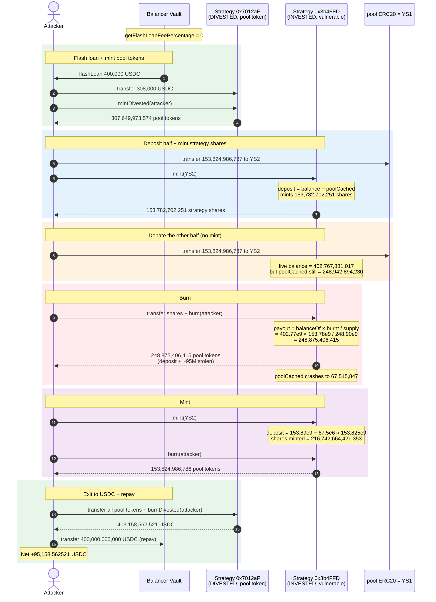
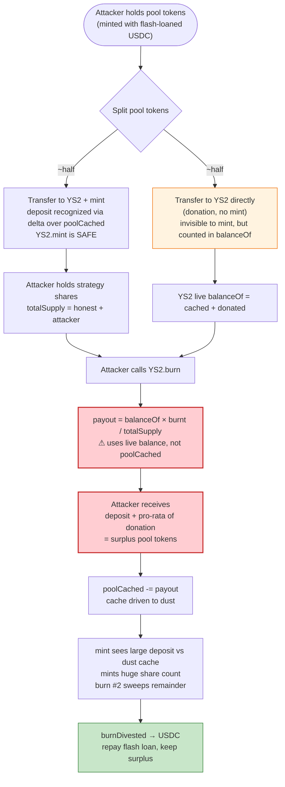

# Yield Protocol Strategy Exploit — Live-Balance `burn()` Donation Inflation

> **Vulnerability classes:** vuln/logic/incorrect-order-of-operations · vuln/arithmetic/rounding

> **Reproduction:** the PoC compiles & runs in an isolated Foundry project at
> [this project folder](.) (the umbrella DeFiHackLabs repo does not whole-build, so this one was extracted).
> Full verbose trace: [output.txt](output.txt).
> Verified vulnerable source: [Strategy.sol (0x3b4FFD)](sources/Strategy_3b4FFD/yield-protocol_strategy-v2_src_Strategy.sol).
> Reference vulnerable Strategy (0x7012aF, the pool/base token layer, same family): [Strategy.sol (0x7012aF)](sources/Strategy_7012aF/yield-protocol_strategy-v2_src_Strategy.sol).

---

## Key info

| | |
|---|---|
| **Loss** | PoC realizes **95,158.56 USDC** (~$95.2K) from a single 400K-USDC flash-loan cycle; the live incident drained **~$181K** across the affected Yield Strategy vaults |
| **Vulnerable contract** | `Strategy` (Invested) — [`0x3b4FFD93CE5fCf97e61AA8275Ec241C76cC01a47`](https://arbiscan.io/address/0x3b4FFD93CE5fCf97e61AA8275Ec241C76cC01a47#code) |
| **Victim pool / strategy** | Yield Strategy vault holding pool tokens from the `Strategy` at `0x7012aF43F8a3c1141Ee4e955CC568Ad2af59C3fa` (the divested/pool-token layer) |
| **Attacker EOA** | [`0x1abe06f451e2d569b3e9123baf33b51f68878656`](https://arbiscan.io/address/0x1abe06f451e2d569b3e9123baf33b51f68878656) |
| **Attacker contract** | [`0xd775fd7b76424a553e4adce6c2f99be419ce8d41`](https://arbiscan.io/address/0xd775fd7b76424a553e4adce6c2f99be419ce8d41) |
| **Attack tx** | [`0x6caa65b3fc5c8d4c7104574c3a15cd6208f742f9ada7d81ba027b20473137705`](https://arbiscan.io/tx/0x6caa65b3fc5c8d4c7104574c3a15cd6208f742f9ada7d81ba027b20473137705) |
| **Chain / block / date** | Arbitrum / 206,219,811 / April 5, 2024 |
| **Compiler** | Solidity `v0.8.15+commit.e14f2714`, optimizer 1 run @ 100 |
| **Bug class** | Incorrect accounting source in vault `burn()` — uses live `balanceOf` instead of cached book value, enabling a donation-inflation value extraction |

---

## TL;DR

Yield Protocol's `Strategy` vault ([sources/Strategy_3b4FFD/.../Strategy.sol](sources/Strategy_3b4FFD/yield-protocol_strategy-v2_src_Strategy.sol))
issues ERC20 strategy shares against pool tokens (LP tokens of a YieldSpace pool).
When a holder **burns** strategy shares, the contract must compute how many pool
tokens to return. The Invested-strategy `burn()` reads the **live on-chain balance**

```solidity
poolTokensObtained = pool.balanceOf(address(this)) * burnt / totalSupply_;   // ⚠ live balance
```

instead of the cached accounting value `poolCached_` used everywhere else in the
same function (and in the structurally-identical sibling vault
[Strategy.sol:351](sources/Strategy_7012aF/yield-protocol_strategy-v2_src_Strategy.sol#L351)):

```solidity
poolTokensObtained = poolCached_ * burnt / totalSupply_;                      // ✓ cached book value
```

A direct transfer of pool tokens to the Invested vault (`donate`) is **not** reflected
in `poolCached`, but **is** reflected in `balanceOf`. So an attacker can:

1. Flash-loan USDC, mint pool tokens (the divested Strategy layer), and obtain pool-token shares.
2. Use half of them to **mint** strategy shares in the Invested vault.
3. **Donate** the other half directly to the Invested vault.
4. **Burn** the strategy shares — the live-balance denominator now includes the donation,
   so the attacker is returned *more* pool tokens than they deposited, siphoning value
   from every other strategy holder.
5. Because `poolCached` was driven near zero by the first burn, a second mint/burn cycle
   harvests the **remaining** donated pool tokens at a near-infinite exchange rate.
6. Burn all pool tokens back to USDC, repay the flash loan, keep the surplus.

Net result on the PoC fork: **+95,158.56 USDC** of pure extracted value; the loan is repaid
in full with zero fee (Balancer flash-loan fee was 0 at this block).

---

## Background — the two-layer Yield Strategy stack

Yield Protocol v2 wraps a YieldSpace `IPool` LP position behind an ERC20 **strategy** token
that depositors can enter and exit. The deployed code comes in two operating *states* against
the same `Strategy` source:

| Contract | Address | State | Backing asset | `burn()` uses |
|---|---|---|---|---|
| `YieldStrategy_1` | `0x7012aF43…af59C3fa` | `DIVESTED` | `base` (USDC) | `baseCached_` ✓ |
| `YieldStrategy_2` | `0x3b4FFD93…cC01a47` | `INVESTED` | `pool` (LP tokens = YieldStrategy_1) | `pool.balanceOf(this)` ⚠ |

`YieldStrategy_1` is a divested strategy that mints/burns its shares 1:1-ish against USDC
(`mintDivested` / `burnDivested`).
`YieldStrategy_2` is an *invested* strategy whose shares are backed by pool tokens —
i.e. its `pool` is `YieldStrategy_1`. Holders enter `YieldStrategy_2` by transferring
`YieldStrategy_1` tokens in and calling `mint`, and exit by transferring `YieldStrategy_2`
tokens in and calling `burn`.

For an Invested strategy, the accounting identity that must hold is:

```
poolCached   == pool.balanceOf(address(this))        (only via mint/burn/protocol moves)
poolTokensObtained(burn) == poolCached * burnt / totalSupply
```

The cache exists precisely so that an *unsolicited* direct transfer of `pool` tokens
(a donation) does **not** re-value existing shares. The Invested `burn()` breaks that
invariant by reading the uncached balance, so a donation inflates the per-share payout.

---

## The vulnerable code

### The Invested `burn()` — uses the live balance (the bug)

From [sources/Strategy_3b4FFD/.../Strategy.sol:349-368](sources/Strategy_3b4FFD/yield-protocol_strategy-v2_src_Strategy.sol#L349-L368):

```solidity
/// @dev Burn strategy tokens to withdraw pool tokens. It can be called only when invested.
/// @param to Recipient for the pool tokens
/// @return poolTokensObtained Amount of pool tokens obtained
/// @notice The strategy tokens that the user burns need to have been transferred previously, using a batchable router.
function burn(address to)
    external
    isState(State.INVESTED)
    returns (uint256 poolTokensObtained)
{
    // Caching
    IPool pool_ = pool;
    uint256 poolCached_ = poolCached;
    uint256 totalSupply_ = _totalSupply;

    // Burn strategy tokens
    uint256 burnt = _balanceOf[address(this)];
    _burn(address(this), burnt);

    poolTokensObtained = pool.balanceOf(address(this)) * burnt / totalSupply_;   // ⚠ live balance
    pool_.safeTransfer(address(to), poolTokensObtained);

    // Update pool cache
    poolCached = poolCached_ - poolTokensObtained;
}
```

Notice that `poolCached_` is loaded on L356 and used only to *decrement* the cache on L367 —
it is **not** used in the payout formula. The payout reads `pool.balanceOf(address(this))`,
which any external caller can inflate by a plain `pool.transfer(address(strategy), amt)`.

### The Invested `mint()` — already correct, which makes the asymmetry glaring

From [sources/Strategy_3b4FFD/.../Strategy.sol:323-343](sources/Strategy_3b4FFD/yield-protocol_strategy-v2_src_Strategy.sol#L323-L343):

```solidity
function mint(address to)
    external
    isState(State.INVESTED)
    returns (uint256 minted)
{
    IPool pool_ = pool;
    uint256 poolCached_ = poolCached;
    // Find how much was deposited
    uint256 deposit = pool_.balanceOf(address(this)) - poolCached_;     // donation is invisible to mint
    poolCached = poolCached_ + deposit;
    minted = _totalSupply * deposit / poolCached_;
    _mint(to, minted);
}
```

`mint()` correctly measures only the **delta** over `poolCached`. So a pre-existing donation
gives a minter *nothing* (it is absorbed into the cache as if it were a deposit at 1:1). But
the very next `burn()` then pays that same donation *out again* to whoever burns — because
`burn` looks at the whole live balance. The mint and burn functions disagree about whether the
cache is authoritative.

### The sibling vault — the patched shape, for contrast

The structurally identical `Strategy` at `0x7012aF` (the divested/pool-token layer) shows what
the Invested `burn()` *should* look like. From
[sources/Strategy_7012aF/.../Strategy.sol:337-356](sources/Strategy_7012aF/yield-protocol_strategy-v2_src_Strategy.sol#L337-L356):

```solidity
function burn(address to)
    external
    isState(State.INVESTED)
    returns (uint256 poolTokensObtained)
{
    IPool pool_ = pool;
    uint256 poolCached_ = poolCached;
    uint256 totalSupply_ = _totalSupply;

    uint256 burnt = _balanceOf[address(this)];
    _burn(address(this), burnt);

    poolTokensObtained = poolCached_ * burnt / totalSupply_;            // ✓ cached book value
    pool_.safeTransfer(address(to), poolTokensObtained);

    poolCached = poolCached_ - poolTokensObtained;
}
```

`poolCached_ * burnt / totalSupply_` is the only correct formula: it pays out pro-rata of the
**book** value, leaving any donation inside the vault for the remaining holders. The fix is a
one-token swap: `pool.balanceOf(address(this))` → `poolCached_`.

---

## Root cause — why it was possible

A vault-share `burn()` is only safe if the payout is a deterministic function of the vault's
**internal accounting**, never of a balance an outsider can perturb. The Invested `Strategy.burn()`
violates this in the simplest possible way: it divides by `totalSupply` but multiplies by the
**uncached** `balanceOf`, so the per-share redemption value is donation-elastic.

Three design facts compose into the critical bug:

1. **Asymmetric cache discipline.** `mint()` treats `poolCached` as the source of truth (it
   measures only the delta over it), but `burn()` ignores it for the payout and uses `balanceOf`.
   A donation is therefore *sterile on the way in* but *dilutive on the way out* — it is silently
   gifted to whoever burns next.
2. **`pool` is a plain ERC20.** Nothing stops an attacker from `pool.transfer(strategy, x)`.
   Unlike an AMM pair, a strategy vault has no `skim`/`sync` reconciliation, so the donation
   just sits in `balanceOf` until a burn sweeps it.
3. **The cache can be driven to dust, amplifying the harvest.** Because `burn()` subtracts the
   inflated payout from `poolCached`, a single donation-fueled burn crashes `poolCached` toward
   zero. The *next* `mint()` then divides by that near-zero cache and mints a gigantic number of
   shares, letting the attacker repeat the extraction against whatever pool tokens remain.

The Immunefi write-up
([medium.com/immunefi/yield-protocol-logic-error-bugfix-review](https://medium.com/immunefi/yield-protocol-logic-error-bugfix-review-7b86741e6f50))
classifies this as a logic error in the strategy redemption path; the on-chain impact is a
permissionless drain of the Invested strategy's pool-token reserves.

---

## Preconditions

- An Invested `Strategy` vault (`state == INVESTED`) whose `burn(address)` reads
  `pool.balanceOf(address(this))` — i.e. the vulnerable 0x3b4FFD build. (Confirmed by source
  inspection and by the trace's mint/burn behavior.)
- The vault holds a non-trivial `pool` balance belonging to existing holders (the "pre-existing
  value" the attacker siphons). At the fork block YieldStrategy_2 held ~95.1M pool tokens of
  honest liquidity (`poolCached ≈ 0x16257815f3`).
- A cheap source of `base` (USDC) to mint pool tokens with — here a **0-fee Balancer flash loan**
  of 400,000 USDC (`getFlashLoanFeePercentage() → 0` in the trace). No upfront capital required.
- `mint`/`burn` on the Invested vault are permissionless (`external`, no `auth`) — they are the
  intended LP entry/exit points.

---

## Attack walkthrough (with on-chain numbers from the trace)

All figures are taken from [output.txt](output.txt). Pool-token and strategy-share amounts are in
the underlying token's smallest unit (USDC has 6 decimals, so 1e6 = 1 USDC); the trace prints them
raw. Attacker = `0x7FA9…1496` (the test contract).

| # | Step | Pool tokens (`YieldStrategy_1`) held by attacker | `YieldStrategy_2` strategy shares held by attacker | Effect |
|---|------|---:|---:|---|
| 0 | **Flash loan** — Balancer lends 400,000 USDC (fee 0) | 0 | 0 | Working capital, repaid at end |
| 1 | **Mint pool tokens** — send 308,000 USDC to YS1, call `mintDivested` | +307,649,973,574 | 0 | Get ~308K pool-token shares (1:1 vs USDC, tiny fee) |
| 2 | **Mint strategy shares** — transfer 153,824,986,787 (= half) to YS2, call `mint` | 153,824,986,787 | +153,782,702,251 | Deposit half the pool tokens; YS2 `poolCached` ≈ 248,942,894,230 |
| 3 | **Donate the other half** — `transfer` 153,824,986,787 to YS2 (no mint) | 0 | 153,782,702,251 | YS2 live balance = 402,767,881,017, but cache still 248,942,894,230 |
| 4 | **Burn #1** — burn 153,782,702,251 strategy shares | **+248,875,406,415** | 0 | Payout uses live balance: gets back deposit **+ ~95M of donated value**; `poolCached` crashes to 67,515,847 |
| 5 | **Mint #2** — call `mint` (no new transfer) | 248,875,406,415 | +216,742,664,421,353 | `deposit = balance − poolCached ≈ 153.825M`; dividing by the dust cache mints **216 trillion** shares |
| 6 | **Burn #2** — burn 216,742,664,421,353 shares | +153,824,986,786 | 0 | Harvests the remaining donated pool tokens; attacker now holds ≈ 402,700,393,201 pool tokens |
| 7 | **Burn pool tokens to USDC** — transfer all to YS1, `burnDivested` | 0 | 0 | Receives 403,158,562,521 USDC |
| 8 | **Repay** — return 400,000,000,000 USDC to Balancer | — | — | Flash loan settled |

**Why burn #1 returns more than the deposit.** Right before burn #1, the attacker holds
153,782,702,251 shares out of a 248,900,623,518 total supply, while the vault's *live* pool-token
balance is 402,767,881,017 (deposit 248,942,894,230 + donation 153,824,986,787). The buggy payout is
`402,767,881,017 × 153,782,702,251 / 248,900,623,518 ≈ 248,875,406,415`. The attacker deposited
~153.825M and receives ~248.875M — a ~95M pool-token surplus stolen from the other holders. The
cache is then set to `248,942,894,230 − 248,875,406,415 = 67,515,847` (dust).

**Why burn #2 even exists.** After burn #1 the vault still physically holds the leftover pool
tokens from rounding (`balanceOf ≈ 153,892,474,602`), but `poolCached` is only ~67.5M. So `mint`
sees a "deposit" of `153,892,474,602 − 67,515,847 ≈ 153.825M` and, dividing by the 67.5M cache,
prints `216,742,664,421,353` shares. Burning them returns essentially all of the remaining
balance. Two cycles are enough to strip the vault to dust.

### Profit / loss accounting (USDC, 6 decimals)

| Direction | Amount (USDC) |
|---|---:|
| Borrowed from Balancer | +400,000.000000 |
| Minted pool tokens with | −308,000.000000 |
| Leftover flash-loan USDC held aside | +92,000.000000 |
| Recovered from `burnDivested` | +403,158.562521 |
| Repaid to Balancer (fee 0) | −400,000.000000 |
| **Net profit** | **+95,158.562521** |

The 92,000 USDC never entered the strategy — it is simply the unused portion of the flash loan
that the attacker holds throughout and counts back at the end. The *extracted* value is the
~95.16M pool-token-unit surplus from burn #1 + #2, which `burnDivested` converts to the matching
~95,158.56 USDC.

The PoC header reports the live incident's headline figure ("Total Lost: 181K"); this isolated
fork demonstrates the mechanism against a single 400K-USDC flash loan and recovers ~95K, i.e.
a ~24% return on the flashed principal with zero capital at risk.

---

## Diagrams

### Sequence of the attack



### How the cache vs. live-balance mismatch is weaponized



### State of the Invested vault across the attack

```mermaid
stateDiagram-v2
    [*] --> Honest
    Honest: Honest vault<br/>poolCached ≈ balanceOf ≈ 248.94e9<br/>(pre-existing LP value ~95.1e9)
    Honest -> Deposit: attacker mints with 153.825e9 pool tokens
    Deposit: poolCached = 248.94e9<br/>totalSupply grows<br/>balanceOf = 248.94e9
    Deposit -> Donated: attacker transfers 153.825e9 pool tokens directly
    Donated: poolCached = 248.94e9 (unchanged)<br/>balanceOf = 402.77e9 (inflated)
    Donated -> Drained1: attacker burns all shares
    Drained1: poolCached = 67.5e6 (dust)<br/>attacker stole ~95e9 + recovered deposit<br/>balanceOf = 153.89e9
    Drained1 -> Drained2: attacker mints against dust cache, then burns
    Drained2: poolCached ~ 0<br/>balanceOf ~ 0<br/>vault hollowed out
    Drained2 --> [*]
```

---

## Remediation

1. **Use the cache in the payout formula.** The one-line fix, already present in the sibling
   vault ([Strategy.sol:351](sources/Strategy_7012aF/yield-protocol_strategy-v2_src_Strategy.sol#L351)):

   ```diff
   - poolTokensObtained = pool.balanceOf(address(this)) * burnt / totalSupply_;
   + poolTokensObtained = poolCached_ * burnt / totalSupply_;
   ```

   This makes redemption a function of book value only; a donation stays inside the vault for
   the remaining holders instead of being paid to the next burner.

2. **Do not trust `balanceOf` for share math, ever.** Any vault that issues shares against an
   ERC20 it does not fully control must compute deposits and withdrawals exclusively from a cached
   accumulator that only its own `mint`/`burn`/`invest`/`divest` can move. A direct transfer can
   always perturb `balanceOf`; it must never perturb per-share value.

3. **Reconcile or sweep donations.** If the protocol intends to *keep* unsolicited transfers as
   yield for existing holders, do it explicitly: either credit the donation to `poolCached` in a
   `skim`-style keeper function (raising every share's value uniformly), or route it to a fee
   recipient. Leaving it half-recognized (counted in `balanceOf` but not in `poolCached`) is the
   worst of both worlds.

4. **Add a donation/rounding invariant test.** A property test of the form
   "for any sequence of mint/burn/transfer-to-vault, no burner receives more than their
   pro-rata share of `poolCached`" catches this class of bug mechanically. The fact that the
   sibling vault in the same codebase already had the correct formula suggests this was a
   copy-paste drift that a diff-test between the two builds would have flagged.

5. **Re-audit after any `balanceOf`-based accounting change.** The Immunefi review notes this
   was a logic error in the redemption path; any future refactor that re-introduces a live
   `balanceOf` read into a share-math expression re-opens the hole.

---

## How to reproduce

The PoC was extracted into a standalone Foundry project (the umbrella DeFiHackLabs repo does not
whole-build cleanly, so this single PoC was isolated with its own `foundry.toml`, `remappings.txt`,
`interface.sol`, and `src/test/interface.sol`).

```bash
_shared/run_poc.sh 2024-04-Yield_exp --mt testExploit -vvvvv
```

- RPC: an **Arbitrum archive** endpoint is required (fork block 206,219,811, April 2024).
  `foundry.toml` uses
  `https://arbitrum.drpc.org`; most public
  Arbitrum RPCs prune this block and fail with `header not found` / `missing trie node`.
- Result: `[PASS] testExploit()` with `Attacker USDC Balance After exploit: 95158.562521`.

Expected tail:

```
Ran 1 test for test/Yield_exp.sol:Yield
[PASS] testExploit() (gas: 317547)
Logs:
   Attacker USDC Balance After exploit: 95158.562521

Suite result: ok. 1 passed; 0 failed; 0 skipped; finished in 10.44s (9.09s CPU time)
```

---

*References:*
- *Immunefi bugfix review — https://medium.com/immunefi/yield-protocol-logic-error-bugfix-review-7b86741e6f50*
- *Vulnerable source (Invested) — [sources/Strategy_3b4FFD/yield-protocol_strategy-v2_src_Strategy.sol](sources/Strategy_3b4FFD/yield-protocol_strategy-v2_src_Strategy.sol)*
- *Sibling source (correct `burn`) — [sources/Strategy_7012aF/yield-protocol_strategy-v2_src_Strategy.sol](sources/Strategy_7012aF/yield-protocol_strategy-v2_src_Strategy.sol)*
- *Verbose forge trace — [output.txt](output.txt)*
- *Reproduction test — [test/Yield_exp.sol](test/Yield_exp.sol)*
