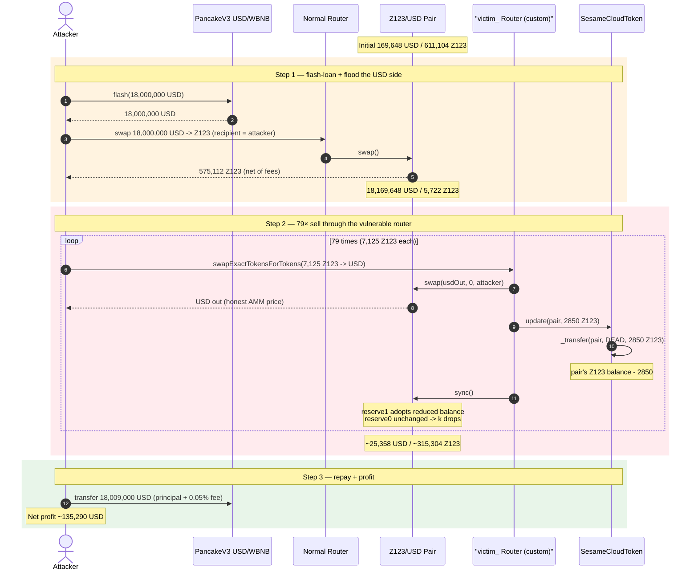
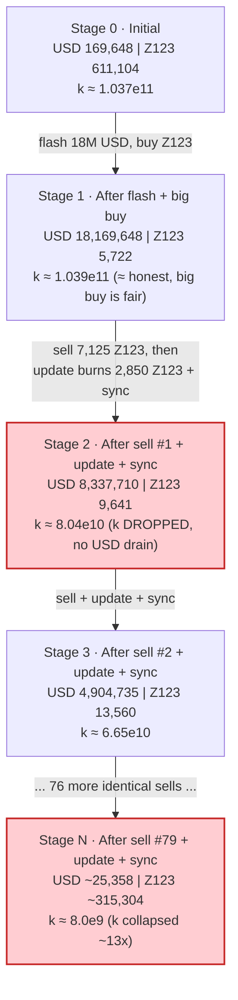
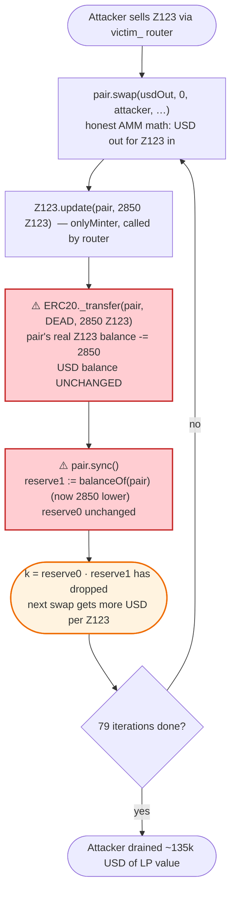

# Z123 (SesameCloudToken) Exploit — Custom-Router `update()` Pool-Burn Arbitrage

> **Reproduction:** the PoC compiles & runs in an isolated Foundry project at [this folder](.).
> Full verbose trace: [output.txt](output.txt).
> Verified vulnerable source: [sources/SesameCloudToken_b000f1/SesameCloudToken.sol](sources/SesameCloudToken_b000f1/SesameCloudToken.sol).

---

## Key info

| | |
|---|---|
| **Loss** | ≈ **135,290 USD** (BSC-USD, a.k.a. USDT) drained from the Z123/USD PancakeSwap V2-style pair |
| **Vulnerable contract** | `SesameCloudToken` (Z123) — [`0xb000f121A173D7Dd638bb080fEe669a2F3Af9760`](https://bscscan.com/address/0xb000f121A173D7Dd638bb080fEe669a2F3Af9760#code) |
| **Vulnerable vector** | Custom project router `update(pair, amount)` + `pair.sync()` inside the sell path — [`0x6125c643a2D4A927ACd63C1185c6be902eFd5dC8`](https://bscscan.com/address/0x6125c643a2D4A927ACd63C1185c6be902eFd5dC8) |
| **Victim pool** | Z123/USD pair — `0x93515A5Dbc2834D687721111d966DE472d682a47` |
| **Flash-loan source** | PancakeSwap V3 USD/WBNB pool — `0x36696169C63e42cd08ce11f5deeBbCeBae652050` (18,000,000 USD borrowed) |
| **Attacker EOA** | `0x3026C464d3Bd6Ef0CeD0D49e80f171b58176Ce32` |
| **Attacker contract** | [`0x61dd07ce0cecf0d7bacf5eb208c57d16bbdee168`](https://bscscan.com/address/0x61dd07ce0cecf0d7bacf5eb208c57d16bbdee168) |
| **Attack tx** | [`0xc0c4e99a76da80a4cf43d3110364840151226c0a197c1728bb60dc3f1b3a6a27`](https://bscscan.com/tx/0xc0c4e99a76da80a4cf43d3110364840151226c0a197c1728bb60dc3f1b3a6a27) |
| **Chain / block / date** | BSC / 38,077,210 / **April 22, 2024** (≈ 08:00 UTC) |
| **Compiler** | SesameCloudToken: Solidity **v0.5.16**, optimizer 1 run @ 999,999 |
| **Bug class** | Broken AMM invariant via an asymmetric, per-swap pool-reserve burn (`update()` → `_transfer(pair, DEAD)` → `sync()`); fee-on-transfer arbitrage loop |

---

## TL;DR

`SesameCloudToken` (ticker **Z123**) exposes an `onlyMinter`-gated `update(address pair, uint256 amount)` function
([SesameCloudToken.sol:413-415](sources/SesameCloudToken_b000f1/SesameCloudToken.sol#L413-L415)) that does
`_transfer(pair, 0x…dEaD, amount)` — i.e. it moves Z123 **out of the liquidity pair's balance and to the burn address**
without removing a single wei of USD from the other side. The project's own swap router then calls
`pair.sync()` immediately afterwards, **forcing the pair to accept the unilaterally reduced Z123 balance as its new
reserve**.

Because the router (`victim_` = `0x6125…dC8`) does this `update + sync` **on every sell**, each sell through that router
silently destroys 2,850 Z123 of pool liquidity. That breaks the constant-product invariant `x·y = k` in the seller's
favor: Z123 is removed for free, so USD becomes cheaper and cheaper to buy back with the same fixed Z123 sell size.

The attacker:

1. **Flash-loans 18,000,000 USD** from the PancakeSwap V3 USD/WBNB pool.
2. **Buys** Z123 the *normal* way (different router) to dump a huge USD reserve into the pair and acquire a large Z123
   position — 575,112 Z123 for 18,000,000 USD.
3. **Sells 7,125 Z123 back through the vulnerable `victim_` router 79 times in a loop.** Each sell: the AMM pays out USD
   fairly for the 6,768.75 Z123 that actually reach the pool, then the router burns 2,850 Z123 out of the pool and
   `sync()`s. The pair's Z123 reserve is thus **drained faster than the USD reserve**, so the marginal USD-per-Z123 price
   keeps dropping and every successive identical sell pulls *more* USD out of the thinned pool than constant-product
   would allow.
4. **Repays** 18,009,000 USD (loan + 0.05% V3 flash fee) and keeps the surplus.

Net profit ≈ **135,290 USD** (the PoC logs a final balance of 135,316 USD; ≈26.54 USD was the attacker's pre-existing
dust). The 9,000 USD flash fee is part of the 18,009,000 repaid.

---

## Background — what Z123 / SesameCloudToken is

`SesameCloudToken` ([source](sources/SesameCloudToken_b000f1/SesameCloudToken.sol)) is a fairly standard OpenZeppelin-style
ERC20 (Solidity 0.5) with two non-standard additions:

1. **A `transactionFee` hook** in `_transfer`
   ([:370-411](sources/SesameCloudToken_b000f1/SesameCloudToken.sol#L370-L411)). For non-whitelisted, non-contract-owner
   transfers it takes a percentage (`_transactFeeValue`, default `[5, 10, 50]` basis points indexed by
   contract→contract / eoa→contract / eoa→eoa) and routes it to configured contractor addresses. The remainder
   (`realAmount`) is what actually moves to `to`.

2. **An `update(address pair, uint256 amount)` function**
   ([:413-415](sources/SesameCloudToken_b000f1/SesameCloudToken.sol#L413-L415)):

```solidity
function update(address pair,uint256 amount) public onlyMinter {
    super._transfer(pair, 0x000000000000000000000000000000000000dEaD, amount);
}
```

This is the entire bug. `_transfer` here is the **raw** ERC20 `_transfer` (line 166), *not* the fee-charging one — it
moves `amount` of Z123 from `pair` to `0x…dEaD` with no fee, no counter-asset movement, and no AMM awareness.

The project deployed a **custom router** (`victim_` = `0x6125c643a2D4A927ACd63C1185c6be902eFd5dC8`) that, after every
`swapExactTokensForTokensSupportingFeeOnTransferTokens`, calls
`Z123.update(pair, 2850e18)` and then `pair.sync()`. The trace shows this exact 3-step tail on all 79 sells:

```
…::swapExactTokensForTokensSupportingFeeOnTransferTokens(7125e18, 1, [Z123, USD], attacker, …)
   …::swap(USDout, 0, attacker, …)          // honest AMM swap
   …::update(pair, 2850e18)                 // ⚠️ burn 2,850 Z123 from the pair
        emit Transfer(from: pair, to: DEAD, value: 2850e18)
   …::sync()                                // ⚠️ pair adopts the reduced Z123 balance as its reserve
```

The router is `onlyMinter`-trusted by the token, so it is the privileged mouth through which the poison flows — but the
design flaw is the token contract's `update` itself: a function whose entire purpose is to delete the pair's Z123 and lie
to the pair about it via `sync()`.

### On-chain parameters at the fork block (38,077,210)

| Parameter | Value (from trace) |
|---|---|
| Pair `token0` / `token1` | USD (`0x55d3…7955`) / Z123 (`0xb000…9760`) |
| `reserve0` (USD) before attack | **169,648.38 USD** |
| `reserve1` (Z123) before attack | **611,104.49 Z123** |
| Initial price | ≈ 0.2776 USD / Z123 |
| Flash-loan amount | 18,000,000 USD (V3 pool `0x3669…`) |
| V3 flash fee | 0.05% → **9,000 USD** |
| Sell size per loop iteration | 7,125 Z123 (`7125 ether`) |
| `update` burn per iteration | **2,850 Z123** (`2850 ether`) — fixed, independent of sell size |
| Loop iterations | **79** |

---

## The vulnerable code

### 1. `update()` — burn from any address the minter names (incl. the AMM pair)

```solidity
// SesameCloudToken.sol:413-415  (inside ERC20Mintable)
function update(address pair,uint256 amount) public onlyMinter {
    super._transfer(pair, 0x000000000000000000000000000000000000dEaD, amount);
}
```

`super._transfer` resolves to the plain ERC20 `_transfer`
([:166-173](sources/SesameCloudToken_b000f1/SesameCloudToken.sol#L166-L173)):

```solidity
function _transfer(address sender, address recipient, uint256 amount) internal {
    require(sender != address(0), "ERC20: transfer from the zero address");
    _balances[sender] = _balances[sender].sub(amount, "ERC20: transfer amount exceeds balance");
    _balances[recipient] = _balances[recipient].add(amount);
    emit Transfer(sender, recipient, amount);
}
```

No fee, no AMM coordination, no pair allowance check. It directly debits the pair's Z123 balance and credits the burn
address.

### 2. The router turns each sell into a reserve-deleting event

The trace ([output.txt:144-159](output.txt), repeated 79×) shows the router doing, for **every** sell:

```
pair.swap(usdOut, 0, attacker, …)         // honest swap, USD leaves, Z123 enters pair
Z123.update(pair, 2850000000000000000000) // ⚠️ _transfer(pair, DEAD, 2850 Z123)
   emit Transfer(pair, DEAD, 2850e18)
pair.sync()                               // pair.sync() re-reads balances → Z123 reserve drops 2850
```

After `update`, the pair's *actual* Z123 balance is `balance - 2850`. `sync()` then sets
`reserve1 = balanceOf(pair)`, so the pair "learns" its Z123 reserve shrank by 2,850 — but **`reserve0` (USD) is
untouched**. The product `k = reserve0 · reserve1` has dropped with no USD having left. The pool is now mispriced: each
subsequent fixed-size Z123 sell extracts more USD than the pre-burn `k` would have allowed.

### Why `onlyMinter` is not a defense here

The minter role is held by the project's own deployer/router, and the project router (`victim_`) is the *only* sanctioned
path the token intends users to trade through (it is the contract named in the PoC as `victim_`). The attack does not
bypass `onlyMinter` — it walks through the front door: the attacker sells through `victim_`, and `victim_` dutifully
fires `update + sync` 79 times. The flaw is that a router is allowed to unilaterally delete one side of an AMM pair at
all.

---

## Root cause — why it was possible

A Uniswap-V2/PancakeSwap-V2 pair maintains `x·y ≥ k` only inside `swap()`. `sync()` is an *honesty* primitive: it
re-syncs the cached reserves to the actual token balances, on the assumption that balances only changed through
operations the pair understands (`mint`/`burn`/`swap`/`skim`/transfers it authorized). The Z123 design violates that
assumption in two compounding ways:

1. **`update()` lets a privileged caller delete pair-side tokens with no counter-asset movement.** This is a value
   transfer *away* from LPs and *toward* holders of the other side (here, USD). Whoever can trigger it can move the pool
   price at will.

2. **The project router triggers it on every sell and then calls `sync()`.** `sync()` is the mechanism that *locks in*
   the manipulation — without it, the pair would still price from its stale (higher) Z123 reserve on the next swap and
   the burn would be invisible. With it, the reduced reserve becomes the new truth and every following swap is priced
   against the depleted pool.

Because the burn (2,850 Z123) is a **fixed** amount per sell and the sell itself (6,768.75 Z123 net) is also fixed, the
ratio `burn / postSwapReserve` **grows** as the pool's Z123 drains — the manipulation is super-linear. Over 79 iterations
the pool's Z123 reserve collapses from 12,490 → 315,304 (it fluctuates as sells add Z123 and burns remove it, but the
net effect is a USD reserve that falls from 18.17M to ~25.4M only because the attacker is the one pulling USD out), while
the attacker's cumulative USD extracted climbs to ~135k above cost.

The honest fee-on-transfer logic (`transactionFee`) plays no defensive role here: it deducts its 5% from the seller's
7,125 Z123 (sending 356.25 to contractors, leaving 6,768.75 for the pool) and is orthogonal to the `update` burn, which
happens after `swap()` returns.

---

## Preconditions

- The attacker must hold, or flash-loan, enough USD to flood the pool's USD side and buy a large Z123 position up front
  (here 18,000,000 USD). This is fully recovered intra-transaction, so the attack is **flash-loanable** — and the PoC
  uses a V3 flash loan.
- `block.timestamp > sale_date` (the token's `_transfer` enforces `sale_date = 1695069060`; satisfied trivially in April
  2024 — see [:385-387](sources/SesameCloudToken_b000f1/SesameCloudToken.sol#L385-L387)).
- The attacker is not whitelisted (`isWhite == 0`) so the fee path applies — but the fee path is exactly what routes
  through `victim_`, so this is the intended user state.
- Sufficient gas for 79 swap iterations (≈ the loop bound in the PoC).

---

## Attack walkthrough (with on-chain numbers from the trace)

`token0 = USD`, `token1 = Z123`. All figures are pulled directly from the `Sync` / `Swap` / `Transfer` events in
[output.txt](output.txt).

| # | Step | USD reserve | Z123 reserve | Attacker effect |
|---|------|------------:|-------------:|-----------------|
| 0 | **Initial pool** (`getReserves` before attack) | 169,648.38 | 611,104.49 | — |
| 1 | **Flash-loan** 18,000,000 USD from V3 pool `0x3669…` (fee = 9,000 USD) | — | — | +18,000,000 USD (debt 18,009,000) |
| 2 | **Big buy** via normal router: 18,000,000 USD → 575,112 Z123 (net of token's sell/buy fees; 605,381 gross) | 18,169,648.38 | 5,722.84 | holds 575,112 Z123 |
| 3 | **Sell #1** — 7,125 Z123 through `victim_`; AMM pays 9,831,937 USD; then `update` burns 2,850 Z123 + `sync()` | 8,337,710.48 | 9,641.59 | +9,831,937 USD; pool Z123 −2,850 net |
| 4 | **Sell #2** — same 7,125 Z123; AMM pays 3,432,975 USD; `update` burns 2,850 + `sync()` | 4,904,735.05 | 13,560.34 | +3,432,975 USD |
| 5 | **Sell #3** … | 3,274,931.16 | 17,479.09 | +1,629,803 USD |
| 6 | **Sell #4** … | 2,362,717.29 | 21,397.84 | +912,213 USD |
| 7 | **Sell #5** … | 1,796,224.50 | 25,316.59 | +566,492 USD |
| 8 | **Sell #6** … | 1,418,188.99 | 29,235.34 | +378,035 USD |
| … | *(sell size constant, USD-per-sell decaying but pool keeps paying because k keeps dropping)* | … | … | … |
| 80 | **Sell #79** (last) — 7,125 Z123; AMM pays 549,581 USD; `update` burns 2,850 + `sync()` | 25,358.66 | 315,304.09 | +549,581 USD |
| 81 | **Repay** 18,009,000 USD to the V3 pool | — | — | −18,009,000 USD |

**The single most important row is #80.** By the final iteration the pool's USD reserve has fallen to ~25.4k and the
Z123 reserve has *climbed* to ~315k — the pool is now heavily long Z123 and short USD, the mirror image of where it
started, entirely because the attacker drained the USD side while `update` kept deleting the Z123 side for free.

### Why each identical sell keeps paying

After sell *n*, the pool's `k_n = reserve0_n · reserve1_n` is **smaller** than `k_{n-1}` because `update` deleted
2,850 Z123 with no USD leaving. A smaller `k` means a smaller `reserve0 · reserve1` envelope, which means the
`getAmountOut` formula (`out = in·9975·reserve0 / (reserve1·10000 + in·9975)`) returns *more* USD for the same `in` than
it would have under the honest `k`. Across 79 iterations this compounds into the 135k USD surplus.

### Profit / loss accounting (USD)

| Direction | Amount (USD) |
|---|---:|
| Flash-loan received | +18,000,000.00 |
| Big buy (USD spent → Z123) | −18,000,000.00 |
| Sum of 79 sells (USD received) | +18,144,316.26 *(≈ attacker final balance − pre-existing dust)* |
| Flash-loan repayment (principal) | −18,000,000.00 |
| Flash-loan fee (0.05%) | −9,000.00 |
| **Net profit** | **≈ +135,289.72** |

(The PoC console prints a final USD balance of 135,316.26, of which ≈26.54 USD was dust the attacker already held at
`befor ack`; the exploitable surplus is ≈135,290 USD.) The profit is paid entirely by the pair's LPs — the pool ends
the transaction holding ~25.4k USD and ~315k Z123 instead of the original 169.6k USD / 611.1k Z123, plus the 18M USD the
attacker briefly injected and withdrew.

---

## Diagrams

### Sequence of the attack



### Pool state evolution (constant-product collapse)



### The flaw inside `update` / the router sell path



---

## Why each magic number

- **18,000,000 USD flash-loan:** large enough to flood the small pool (169k USD) and buy essentially all of its Z123,
  giving the attacker a big Z123 inventory to feed the 79-iteration sell loop. Fully repaid, so it costs only the 9,000
  USD fee.
- **7,125 Z123 per sell:** a fixed, repeatable chunk sized so each `getAmountOut` call still returns a meaningful USD
  amount while keeping per-iteration gas bounded. The PoC hard-codes it; the loop count (79) is tuned so the pool's USD
  reserve is bled down to dust by the end.
- **2,850 Z123 burn per `update`:** hard-coded in the project router (not derived from the 7,125 sell size). It is the
  asymmetric lever: a constant deletion of one reserve side that the AMM was never designed to absorb. 2,850 × 79 =
  225,150 Z123 destroyed from the pair for free over the attack.
- **79 iterations:** the loop count in the PoC. The first sell pays ~9.83M USD (the pool is rich with the injected 18M),
  and payouts decay as the USD reserve drains; iteration 79 still pays ~549k USD because `k` has been crushed so far that
  even a depleted pool yields USD for Z123.

---

## Remediation

1. **Remove `update()` (or make it unable to target AMM pairs).** A token must never let any caller — privileged or not —
   move balances out of an address it does not own, and *especially* not out of a liquidity pair. If "manual rebalancing"
   is a product requirement, it must operate only on the protocol's own treasury balance.
2. **Never call `pair.sync()` after unilaterally changing one side of a pair.** `sync()` exists to reconcile honest
   balance drift; chaining it with a one-sided burn converts the pair into a price-manipulation oracle. The router should
   not call `sync()` at all — swaps and LP mints/burns already keep reserves correct.
3. **Route any "deflation" through the pair's own `burn()`.** If the project genuinely wants the pool to lose Z123, it
   must do so via an LP redemption (`pair.burn(to)`) so *both* reserves move together and `k` is preserved — not via a
   direct balance deletion.
4. **Decouple privileged token operations from the user trade path.** `update` is `onlyMinter`, but the minter is the
   router that any user can call. Privileged value-moving operations must not be reachable as a side-effect of an
   unauthenticated user action.
5. **Add a reentrancy/style guard on per-swap hooks.** If a router post-processes swaps, the post-processing must be
   invariant-preserving (fee distribution to non-pool addresses only) and must never re-sync the pair's reserves.

---

## How to reproduce

The PoC was extracted into a standalone Foundry project (the umbrella DeFiHackLabs repo does not whole-compile).

```bash
_shared/run_poc.sh 2024-04-Z123_exp --mt testExploit -vvvvv
```

- **RPC:** a **BSC archive** endpoint is required (fork block 38,077,210 is historical). `foundry.toml` uses
  `https://bsc-mainnet.public.blastapi.io`; most pruned public BSC RPCs fail with `header not found` / `missing trie
  node` at this block.
- **Result:** `[PASS] testExploit()`.

Expected tail (from [output.txt](output.txt)):

```
  befor ack usdc balance = : 26.542161622221038197
  ==== start attack====
  ==== end attack====
  after profit usdc balance = : 135316.263071528178187134

Suite result: ok. 1 passed; 0 failed; 0 skipped; finished in 14.33s

Ran 1 test suite in 34.54s: 1 tests passed, 0 failed, 0 skipped (1 total tests)
```

The `befor ack`/`after profit` log lines confirm the USD balance moved from 26.54 → 135,316.26, a surplus of ≈
135,290 USD above the attacker's starting dust (the small remainder is pre-existing balance, not attack proceeds).

---

*Reference: attacker `0x3026C464d3Bd6Ef0CeD0D49e80f171b58176Ce32`, attack contract `0x61dd07ce0cecf0d7bacf5eb208c57d16bbdee168`, tx `0xc0c4e99a76da80a4cf43d3110364840151226c0a197c1728bb60dc3f1b3a6a27` on BSC, block 38,077,210, 2024-04-22.*
