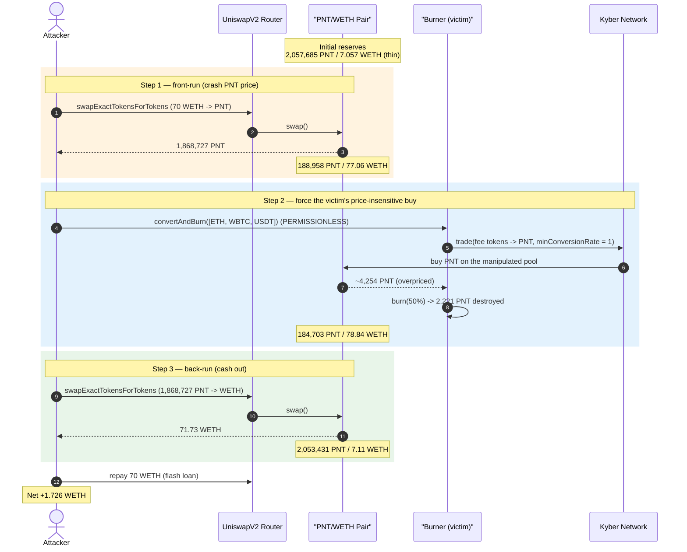
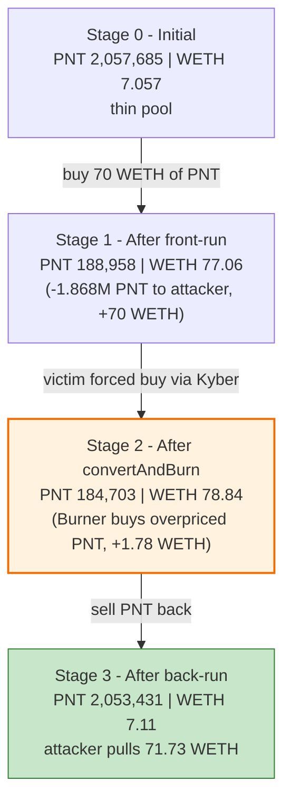
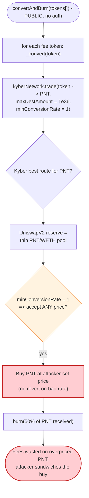
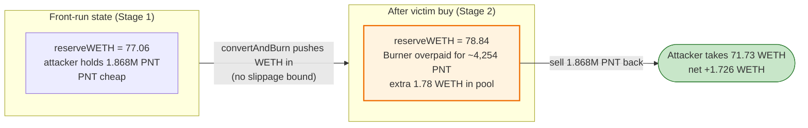

# pNetwork `Burner` Exploit — Permissionless `convertAndBurn()` + Slippage-Free Kyber Trade → Sandwich

> One-line: anyone could call pNetwork's `Burner.convertAndBurn()`, which trades the contract's
> accumulated fees into PNT through Kyber with `minConversionRate = 1` (zero slippage protection);
> Kyber routes that buy through the thin PNT/WETH Uniswap-V2 pool, so an attacker simply sandwiched
> the forced buy to steal ~1.73 ETH.

> **Reproduction:** the PoC compiles & runs in an isolated Foundry project at
> [this project folder](.). Full verbose trace: [output.txt](output.txt).
> Verified vulnerable source: [sources/Burner_4d4d05/Burner.sol](sources/Burner_4d4d05/Burner.sol).

---

## Key info

| | |
|---|---|
| **Loss** | **~1.726 WETH** (≈ $5–6K at the time) extracted from the `Burner` contract's fees + PNT/WETH pool |
| **Vulnerable contract** | `Burner` — [`0x4d4d05e1205e3A412ae1469C99e0d954113aa76F`](https://etherscan.io/address/0x4d4d05e1205e3A412ae1469C99e0d954113aa76F#code) |
| **Victim pool / token** | PNT/WETH UniswapV2 pair `0x77bbC2B409C2c75E4999e8E3eb8309EFff37cf2D`; PNT token [`0x89Ab32156e46F46D02ade3FEcbe5Fc4243B9AAeD`](https://etherscan.io/address/0x89Ab32156e46F46D02ade3FEcbe5Fc4243B9AAeD) |
| **Routing layer** | Kyber Network proxy/reserves (UniswapV2 reserve `0x10908C875D865C66f271F5d3949848971c9595C9`) |
| **Attack tx** | [`0x3bba4fb6de00dd38df3ad68e51c19fe575a95a296e0632028f101c5199b6f714`](https://etherscan.io/tx/0x3bba4fb6de00dd38df3ad68e51c19fe575a95a296e0632028f101c5199b6f714) |
| **Chain / block / date** | Ethereum mainnet / fork **19,917,290** / May 2024 |
| **Compiler** | `Burner`: Solidity **v0.5.17**, optimizer 200 runs (PoC harness: 0.8.x) |
| **Bug class** | Permissionless privileged action + missing slippage bound → AMM price-manipulation sandwich |

---

## TL;DR

`Burner` is pNetwork's fee-burning helper: it accumulates protocol fees in various tokens (ETH, WBTC,
USDT, …), and its `convertAndBurn(tokens[])` swaps each of those into the protocol token **PNT** via
Kyber Network, then burns 50% of the resulting PNT.

Two fatal design choices combine:

1. **`convertAndBurn()` is permissionless** — no `onlyOwner`, no keeper restriction
   ([Burner.sol:1333-1338](sources/Burner_4d4d05/Burner.sol#L1333-L1338)). Anyone chooses *when* the
   forced PNT buy happens.
2. **The internal Kyber trade uses `minConversionRate = 1`** — i.e. effectively **zero slippage
   protection** ([Burner.sol:1340-1356](sources/Burner_4d4d05/Burner.sol#L1340-L1356)). The contract
   will accept *any* price for its tokens.

PNT's liquidity at the time lived almost entirely in a **thin** PNT/WETH UniswapV2 pool
(7.06 WETH deep), and that pool was the venue Kyber routed PNT buys through. So the attacker:

1. **Front-runs**: buys PNT from the pool with 70 WETH, crashing PNT's price and inflating the pool's
   WETH reserve from 7.06 → 77.06 WETH.
2. **Triggers the victim**: calls `convertAndBurn([ETH, WBTC, USDT])`. The `Burner` dutifully converts
   its ~1.55 ETH + 0.0072 WBTC + 331 USDT of fees into PNT **at the now-terrible price** (it buys
   overpriced PNT, which actually pushes a *little more* WETH into the pool), then burns half of it.
3. **Back-runs**: sells the PNT it bought in step 1 back into the pool, pulling **71.73 WETH** out of a
   pool that now holds 78.84 WETH.

Net: the attacker put in 70 WETH and took out 71.73 WETH — a clean **+1.726 WETH** sandwich, funded by
the `Burner`'s wasted fee conversion (and the pool's own liquidity churn).

---

## Background — what `Burner` does

`Burner` (verified source: [sources/Burner_4d4d05/Burner.sol](sources/Burner_4d4d05/Burner.sol)) is a
pNetwork utility contract. Protocol fees in assorted tokens land on this contract; periodically the
fees are converted into the native **PNT** (an ERC777) and partially burned (deflationary mechanic).
The relevant state:

```solidity
ERC777 token;                 // = PNT
IKyberNetwork kyberNetwork;   // Kyber proxy used for conversions
address public kyberFeeWallet;
uint256 public percentageToBurn;   // = 50 (burn half, send half to unburnedDestination)
```

Conversions are done through Kyber Network, which at that block aggregated multiple "reserves" for the
PNT pair — and the live one was a **UniswapV2 reserve** (`0x10908C…95C9`) sitting on the PNT/WETH pool.
That is the crucial link: a "Kyber trade into PNT" is, in practice, a market buy on the thin PNT/WETH
Uniswap pool.

On-chain facts at the fork block (from the trace):

| Item | Value |
|---|---|
| PNT/WETH pool reserves | **2,057,685 PNT / 7.0569 WETH** (`token0=PNT, token1=WETH`) |
| `Burner` ETH fees | ~1.5532 ETH |
| `Burner` WBTC fees | 716,800 (0.007168 WBTC) |
| `Burner` USDT fees | 331.717 USDT |
| `percentageToBurn` | 50% |

The pool is only ~7 WETH deep — small enough that a 70-WETH order moves the price by an order of
magnitude, and there is no other meaningful PNT liquidity for Kyber to route through.

---

## The vulnerable code

### 1. `convertAndBurn()` is public — anyone can trigger the conversion

```solidity
function convertAndBurn(address [] calldata tokens) external {   // ⚠️ no onlyOwner / keeper guard
    for (uint i = 0; i < tokens.length; i++) {
        _convert(tokens[i]);
    }
    burn();
}
```
([Burner.sol:1333-1338](sources/Burner_4d4d05/Burner.sol#L1333-L1338))

### 2. `_convert()` trades through Kyber with `minConversionRate = 1`

```solidity
function _convert(address srcToken) internal {
    uint srcAmount;
    uint converted;
    if (srcToken == ETHER || srcToken == address(0)) {
        srcAmount = address(this).balance;
        converted = kyberNetwork.trade
            .value(srcAmount)(ETHER, srcAmount, address(token),
                              address(uint160(address(this))), BIG_LIMIT, 1, kyberFeeWallet);
            //                                                  ↑ maxDestAmount = 1e36 (no cap)
            //                                                      ↑ minConversionRate = 1  ⚠️
    } else {
        srcAmount = IERC20(srcToken).balanceOf(address(this));
        if (IERC20(srcToken).allowance(address(this), address(kyberNetwork)) > 0) {
            IERC20(srcToken).safeApprove(address(kyberNetwork), 0);
        }
        IERC20(srcToken).safeApprove(address(kyberNetwork), srcAmount);
        converted = kyberNetwork.trade(srcToken, srcAmount, address(token),
                              address(uint160(address(this))), BIG_LIMIT, 1, kyberFeeWallet);
            //                                                            ↑ minConversionRate = 1 ⚠️
    }
    emit TokenTrade(srcToken, srcAmount, converted);
}
```
([Burner.sol:1340-1356](sources/Burner_4d4d05/Burner.sol#L1340-L1356))

The hard-coded `minConversionRate = 1` means: *"convert at any rate, however bad."* There is no
on-chain check that the price Kyber gives is fair, no TWAP, no caller-supplied minimum.

### 3. `burn()` destroys 50% of the PNT it just bought

```solidity
function burn() public {
    require(!paused, 'cannot burn when paused');
    uint total = token.balanceOf(address(this));
    uint toBurn = total.mul(percentageToBurn).div(100);   // 50%
    token.burn(toBurn, '');                                // permanently destroyed
    uint notBurned = token.balanceOf(address(this));
    require(token.transfer(unburnedDestination, notBurned), 'cannot transfer unburned tokens');
    emit Burn(toBurn, notBurned);
}
```
([Burner.sol:1322-1331](sources/Burner_4d4d05/Burner.sol#L1322-L1331))

---

## Root cause — why it was possible

The bug is the classic **"someone-else-triggers-my-swap, and my swap has no slippage bound"**
combination, on top of a thin pool:

1. **Permissionless trigger.** Because `convertAndBurn()` carries no access control, the attacker
   controls the *timing* of the `Burner`'s market buy. A privileged/keeper-gated routine would still
   need a slippage bound, but the attacker would not be able to schedule it inside their own sandwich.

2. **No slippage protection (`minConversionRate = 1`).** The conversion accepts any price. The
   `Burner`'s fees are therefore spent at whatever rate the pool happens to show — including a rate the
   attacker just manufactured by front-running. The contract effectively guarantees it will be the worst
   counterparty in the block.

3. **Thin, single-venue PNT liquidity.** Kyber's only live PNT route was the 7-WETH-deep PNT/WETH
   Uniswap pool. A 70-WETH front-run moves that pool's price ~10×, so the manipulation is cheap and
   the `Burner`'s buy lands at a wildly skewed rate.

These compose into a standard sandwich: front-run → force the victim's price-insensitive buy →
back-run. The attacker's profit is the value the pool/`Burner` lose to the manipulated price. The 50%
burn is incidental — it just permanently destroys part of the PNT the `Burner` overpaid for, deepening
the protocol's loss.

> Worth stressing: a slippage bound on the Kyber trade (a sane `minConversionRate`) would have made the
> `_convert` revert when the pool price was off, neutralizing the attack even with the public trigger.

---

## Preconditions

- `Burner` holds a non-trivial fee balance in at least one token (ETH/WBTC/USDT here) — true on-chain.
- The PNT route used by Kyber is a thin AMM pool whose price can be moved cheaply within one tx — the
  ~7-WETH PNT/WETH Uniswap pool qualifies.
- `paused == false` so `burn()` (and thus `convertAndBurn`) does not revert — true.
- Working capital in WETH to front-run the pool. Peak outlay was **70 WETH**, fully recovered
  intra-transaction, hence **flash-loanable** (the PoC `deal`s 70 WETH and treats it as a simulated
  flash loan, repaying it at the end).

---

## Attack walkthrough (with on-chain numbers from the trace)

The pair's `token0 = PNT`, `token1 = WETH` → `reserve0 = PNT`, `reserve1 = WETH`. All figures are read
directly from the `Sync`/`getReserves` events in [output.txt](output.txt).

| # | Step | PNT reserve | WETH reserve | Effect |
|---|------|------------:|-------------:|--------|
| 0 | **Initial** ([:1606](output.txt#L1606)) | 2,057,685 | 7.0569 | Honest, thin pool. |
| 1 | **Front-run**: swap **70 WETH → 1,868,727 PNT** to attacker ([:1625-1626](output.txt#L1625)) | 188,957.6 | 77.0569 | PNT price crashed ~10×; attacker now holds 1.868M PNT. |
| 2 | **`convertAndBurn([ETH, WBTC, USDT])`** — `Burner` converts fees → PNT via Kyber (routed into the pool) and burns 50% ([:1637-2330](output.txt#L1637)) | 184,703.5 | 78.8370 | `Burner` overpays for ~4,254 PNT; pool gains ~1.78 WETH net from its buys; 2,221 PNT burned. |
| 3 | **Back-run**: sell **1,868,727 PNT → 71.7263 WETH** ([:2366-2367](output.txt#L2366)) | 2,053,431 | 7.1107 | Attacker pulls 71.73 WETH out of the 78.84-WETH pool. |
| 4 | **Repay** 70 WETH (simulated flash loan) ([:2374](output.txt#L2374)) | — | — | Leftover = profit. |

### Inside step 2 — what the `Burner` actually did

The `Burner` had three fee balances; `convertAndBurn` converted each into PNT via Kyber, which routed
the buys through the same (manipulated) PNT/WETH pool:

| Src token | Amount converted | PNT received |
|---|---:|---:|
| ETH | 1.5532 ETH | 3,718.85 PNT |
| WBTC | 716,800 (0.007168) | 324.15 PNT |
| USDT | 331.717 USDT | 211.08 PNT |
| **Total** | — | **4,254.09 PNT** (`Burner` balance 4,441.97 incl. dust) |

Then `burn()` destroyed 50% = **2,220.99 PNT** ([:2307-2315](output.txt#L2307)) and sent the rest to
`unburnedDestination`. The `Burner`'s fees were spent buying a few thousand PNT at a price the attacker
had wrecked — value that ends up captured by the attacker's back-run. Note the `Burner`'s PNT purchases
*added* WETH to the pool (77.06 → 78.84), which is precisely the extra WETH the attacker walks away with
beyond their own 70.

### Profit accounting (WETH)

| Direction | Amount |
|---|---:|
| Spent — front-run buy | 70.0000 |
| Received — back-run sell | 71.7263 |
| **Net profit** | **+1.7263** |

```
profit weth = : 1.726288535749184549     ([output.txt:2382](output.txt#L2382))
```

The ~1.73 WETH gain comes from: (a) the WETH the `Burner` pumped into the pool while overpaying for PNT,
plus (b) a slice of the pool's pre-existing liquidity disturbed by the round-trip.

---

## Diagrams

### Sequence of the attack



### Pool state evolution



### The flaw inside `convertAndBurn` / `_convert`



### Why it is theft: the sandwich around the forced buy



---

## Why each magic number

- **70 WETH (front-run):** large relative to the 7-WETH pool, so PNT's price collapses ~10×. This both
  (a) makes the attacker's PNT cheap and (b) sets the bad rate the `Burner` will buy at. It is fully
  recovered in the back-run, so any size that meaningfully moves the thin pool works; 70 is just the
  amount the live attacker used.
- **`tokens = [ETH(0x0), WBTC, USDT]`:** the three assets the `Burner` actually held fees in. Each is
  converted into PNT through Kyber — every one of those buys lands on the manipulated pool, adding WETH
  the attacker later extracts.
- **`minConversionRate = 1` (in the contract, not chosen by attacker):** the root enabler — it lets the
  `Burner` buy PNT at the manipulated rate without reverting.

---

## Remediation

1. **Add slippage protection to the conversion.** Never trade with `minConversionRate = 1`. Compute an
   acceptable minimum from a manipulation-resistant reference (Chainlink/TWAP oracle) and pass it to
   `kyberNetwork.trade`, reverting if the route price deviates beyond a small tolerance. This alone
   defeats the attack even with a public trigger.
2. **Gate `convertAndBurn()` / `_convert()`.** Restrict the conversion to a trusted keeper/role, or to
   a private/MEV-protected execution path, so an attacker cannot schedule the `Burner`'s buy inside
   their own sandwich.
3. **Do not market-buy through thin single-venue liquidity.** Split conversions, use an aggregator with
   price-impact limits, or convert via a venue with a robust oracle; never route a price-insensitive buy
   through a pool an attacker can move for cheap.
4. **Bound `maxDestAmount` / size per call.** Cap how much value any single `convertAndBurn` call can
   move so that even a mispriced route limits the blast radius.
5. **Consider buy-and-burn from protocol-owned value only**, executed atomically with a fair-price
   check, rather than converting accumulated fees on demand at an externally-triggerable moment.

---

## How to reproduce

The PoC was extracted into a standalone Foundry project (the umbrella DeFiHackLabs repo has several
unrelated PoCs that fail to compile under `forge test`'s whole-project build):

```bash
_shared/run_poc.sh 2024-05-Burner_exp -vvvvv
```

- RPC: a **mainnet archive** endpoint is required (fork block 19,917,290). `foundry.toml` is
  pre-configured with an Infura archive endpoint; most pruning public RPCs fail with
  `header not found` / `missing trie node` at this depth.
- Result: `[PASS] testExploit()` with `profit weth = : 1.726288535749184549`.

Expected tail:

```
Ran 1 test for test/Burner_exp.sol:ContractTest
[PASS] testExploit() (gas: 2126956)
Logs:
  === ACK START ===
  === ACK END ===
  profit weth = : 1.726288535749184549

Suite result: ok. 1 passed; 0 failed; 0 skipped
```

---

*Reference: DeFiHackLabs (pNetwork `Burner`, Ethereum, ~1.7 ETH). PoC header tx:
`0x3bba4fb6de00dd38df3ad68e51c19fe575a95a296e0632028f101c5199b6f714`.*
