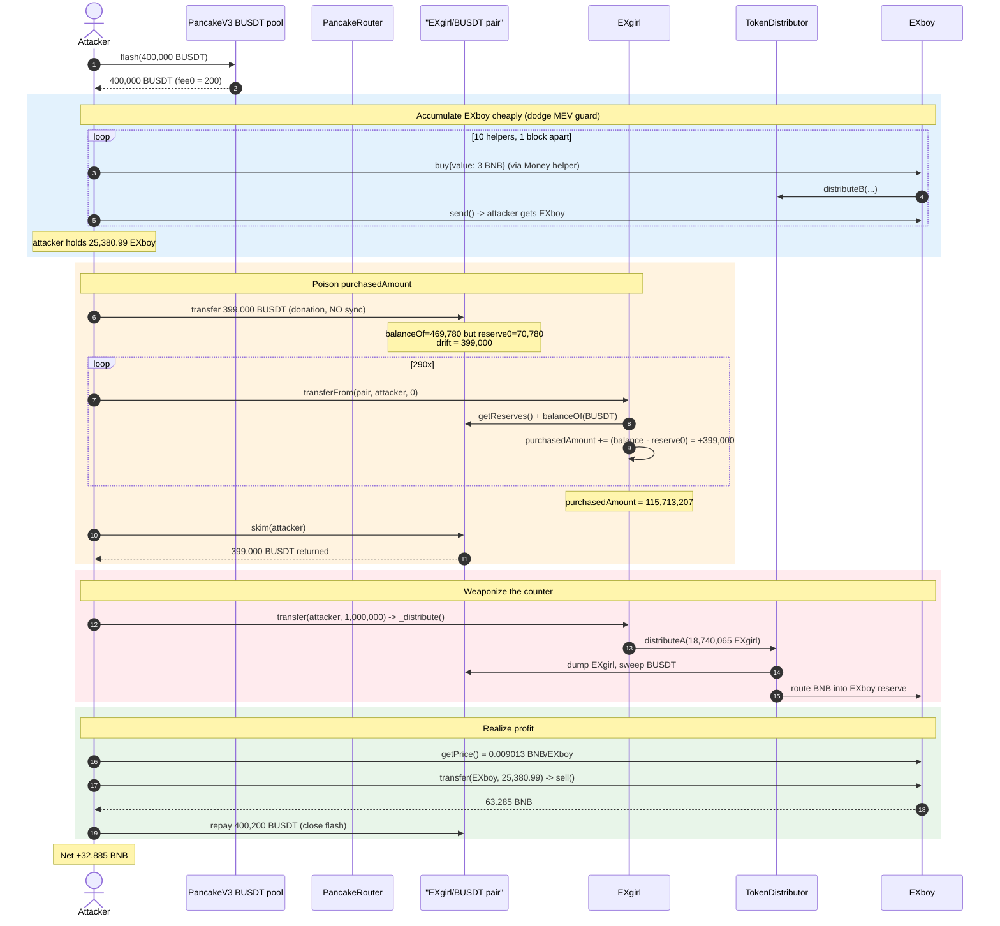
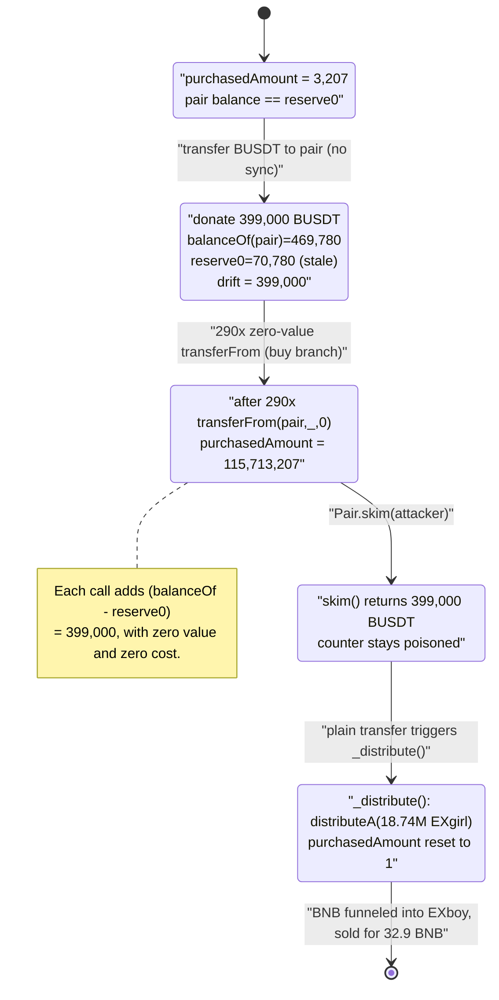
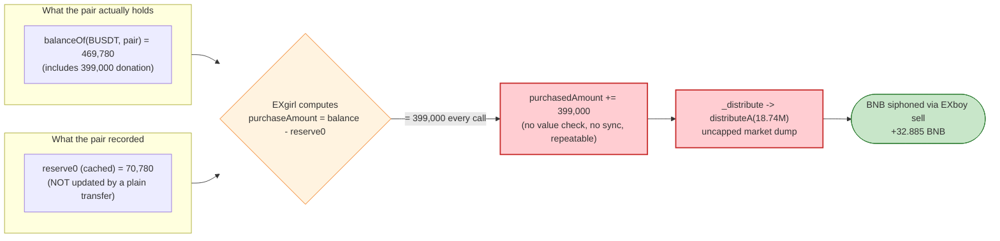

# EXcommunity (EXboy / EXgirl) Exploit — `purchasedAmount` Inflation via Zero-Value `transferFrom` + Pool Donation

> **Vulnerability classes:** vuln/logic/state-update · vuln/defi/slippage

> One-line summary: a "rebalancing" token (`EXgirl`) credits **pool token-balance vs. recorded-reserve drift as user "purchases"** on every pair-side transfer — including zero-value ones — so an attacker donates BUSDT to the pair, hammers `transferFrom(pair, …, 0)` 290× to balloon `purchasedAmount` to 115.7M, then triggers a 18.7M-token auto-dump whose BNB proceeds are funneled into the sister `EXboy` token, which the attacker drains by selling overpriced `EXboy` for **~32.9 BNB**.

> **Reproduction:** the PoC compiles & runs in an isolated Foundry project at [this project folder](.) (the umbrella DeFiHackLabs repo does not whole-compile, so this PoC was extracted). Full verbose trace: [EXcommunity_exp.output.txt](EXcommunity_exp.output.txt). Verified vulnerable sources: [EXgirl](sources/EXgirl_b1de93/contracts_EXgirl.sol), [EXboy](sources/EXboy_df4895/contracts_EXboy.sol).

---

## Key info

| | |
|---|---|
| **Loss** | **~32.89 BNB** (~$18–20K at the time) net profit to the attacker |
| **Vulnerable contract** | `EXgirl` — [`0xb1de93DAe1CDdF429eEc9DB30b78759d17495758`](https://bscscan.com/address/0xb1de93DAe1CDdF429eEc9DB30b78759d17495758#code) (root cause); proceeds extracted through `EXboy` — [`0xdf4895Cd8247284Ae3a7b3E28cf6c03113fADa5f`](https://bscscan.com/address/0xdf4895Cd8247284Ae3a7b3E28cf6c03113fADa5f#code) |
| **Victim pool** | `EXgirl`/BUSDT PancakeSwap-V2 pair — [`0x74f5FE81F67FA30A679d3547f7F9B97a2dd46BA5`](https://bscscan.com/address/0x74f5FE81F67FA30A679d3547f7F9B97a2dd46BA5) (token0 = BUSDT, token1 = EXgirl) |
| **Flash-loan source** | PancakeSwap-V3 BUSDT pool — `0x36696169C63e42cd08ce11f5deeBbCeBae652050` (400,000 BUSDT, fee0 = 200 BUSDT) |
| **Shared TokenDistributor** | `0x012F69cE7CDc6cFa72eF99bF3C4fbC0658c8F321` (proxy; impl `0xB1afBEF9AF5e803AE2D86174a4fcDe67C6D9c8b4` — unverified) |
| **Attack tx** | [`0x5446bf2b57749abdab01813a50ce36246177f3437599f3a56bc1554f596b2c3a`](https://app.blocksec.com/explorer/tx/bsc/0x5446bf2b57749abdab01813a50ce36246177f3437599f3a56bc1554f596b2c3a) |
| **Chain / block / date** | BSC / 39,123,756 / ~May 28, 2024 |
| **Compiler** | `EXgirl`/`EXboy` Solidity v0.8.22, optimizer 200 runs; pair v0.5.16 |
| **Bug class** | Business-logic flaw — corruptible internal accounting (`purchasedAmount`) driven by externally-manipulable pool balance, plus unguarded zero-value transfer accounting |

Reported by: [SlowMist](https://x.com/SlowMist_Team/status/1795648617530995130). PoC header reason: *"Business Logic Flaw."*

---

## TL;DR

`EXgirl` is a "smart rebalancing" ERC20 paired with BUSDT. Whenever tokens move **from the pair** (i.e. someone buys EXgirl), its `_update` hook tries to measure how much BUSDT just entered the pool:

```solidity
(uint256 reserve0, , ) = IUniswapV2Pair(pair).getReserves();
uint256 tokenBal      = IERC20(token0).balanceOf(pair);   // token0 = BUSDT
uint256 purchaseAmount = tokenBal - reserve0;              // ⚠️ trusts (balance − reserve)
purchasedAmount += purchaseAmount;                         // ⚠️ accumulates forever
```
([EXgirl:198-201](sources/EXgirl_b1de93/contracts_EXgirl.sol#L198-L201))

Three fatal properties combine:

1. **`balanceOf(pair) − reserve0` is attacker-controlled.** Anyone can `transfer` BUSDT straight to the pair without calling `sync()`. The pair's recorded `reserve0` stays stale, so the drift `tokenBal − reserve0` equals exactly the donated amount.
2. **The "buy" branch fires on *any* pair-side transfer, including zero-value ones.** `transferFrom(pair, attacker, 0)` enters `from == pair && !isRemoveLiquidity()` and credits the *full* drift to `purchasedAmount` — no swap, no value, no cost. Calling it 290× adds `290 × 399,000 = 115.7M` to `purchasedAmount`.
3. **`purchasedAmount` later drives an uncapped market dump.** A subsequent ordinary transfer hits `_distribute()`, which sells `purchasedAmount × rebalanceRatio (30%)` worth of EXgirl via the shared `TokenDistributor.distributeA()`. With a poisoned `purchasedAmount`, this dumps **18.74M EXgirl** into the pool, sweeping out its BUSDT and routing BNB into the sister `EXboy` token's internal reserve.

The attacker then sells cheaply-acquired `EXboy` (the `EERC314`-style token prices off its own `balance/_balances[this]`, which the distribute step inflated) for **63.3 BNB**, repays the 400,000-BUSDT flash loan + 200 BUSDT fee, and walks away with **+32.89 BNB**.

---

## Background — what the protocol does

The "EXcommunity" project ships two coupled tokens that both delegate their rebalancing logic to one shared `TokenDistributor` proxy:

- **`EXgirl`** ([source](sources/EXgirl_b1de93/contracts_EXgirl.sol)) — an OpenZeppelin ERC20 paired with **BUSDT** on PancakeSwap-V2. Its overridden `_update` ([EXgirl:145-216](sources/EXgirl_b1de93/contracts_EXgirl.sol#L145-L216)) classifies every transfer as *add-liquidity / remove-liquidity / buy / sell / plain transfer* by comparing the pair's live `balanceOf` against its recorded reserves. On "buys" it accrues `purchasedAmount`; on plain transfers it calls `_distribute()` to market-sell a fraction of that accrued amount (a "buy pressure → sell pressure" rebalancer).
- **`EXboy`** ([source](sources/EXboy_df4895/contracts_EXboy.sol)) — an `EERC314`-style token that holds **BNB and its own tokens internally** and prices itself purely from `getReserves() = (address(this).balance, _balances[address(this)])` ([EXboy:254-256](sources/EXboy_df4895/contracts_EXboy.sol#L254-L256), [getPrice EXboy:501-504](sources/EXboy_df4895/contracts_EXboy.sol#L501-L504)). `buy()`/`sell()` ([EXboy:363-422](sources/EXboy_df4895/contracts_EXboy.sol#L363-L422)) trade against that internal reserve. Its `buy()` also calls `tokenDistributor.distributeB(...)` ([EXboy:380-383](sources/EXboy_df4895/contracts_EXboy.sol#L380-L383)).

The two tokens share `TokenDistributor` (`distributeA` for EXgirl, `distributeB` for EXboy), which routes swap proceeds and BNB **between** the EXgirl/BUSDT pool and the EXboy internal reserve. That cross-token plumbing is what turns an EXgirl accounting bug into BNB sitting in EXboy that the attacker can pull out.

On-chain state at fork block 39,123,756 (from the trace):

| Parameter | Value |
|---|---|
| EXgirl/BUSDT pair reserves | reserve0 (BUSDT) ≈ **68,482**, reserve1 (EXgirl) ≈ **39,489** |
| EXgirl `rebalanceRatio` | **0.3** (30%) — backed out from the dump math |
| EXgirl `purchasedAmount` (pre-attack) | ≈ **3,207** |
| EXboy `getPrice` just before the kill sell | **0.009013 BNB / EXboy** |
| MEV guard (EXboy) | `lastTransaction[from] == block.number` reverts; `lastTxTimes[user] + 60 >= block.timestamp` reverts |

---

## The vulnerable code

### 1. `purchasedAmount` trusts `balanceOf(pair) − reserve0` (EXgirl)

```solidity
// EXgirl._update(), "buy" branch
} else if (from == pair && !isRemoveLiquidity()) {
    if (block.timestamp < timeManagement.whitelistTime && !tokenDistributor.isWhitelist(to)) {
        revert NotStarted();
    }
    if (block.timestamp < timeManagement.quotaTime) {
        if (value > advantageInfo.quotaAmount) { revert ExceededAmount(); }
    }
    (uint256 reserve0, , ) = IUniswapV2Pair(pair).getReserves();
    uint256 tokenBal       = IERC20(token0).balanceOf(pair); // token0 = BUSDT
    uint256 purchaseAmount = tokenBal - reserve0;            // ⚠️ donation-controlled drift
    purchasedAmount       += purchaseAmount;                 // ⚠️ unbounded, repeatable
}
```
([EXgirl:189-204](sources/EXgirl_b1de93/contracts_EXgirl.sol#L189-L204))

`reserve0` is the pair's *cached* reserve (only refreshed by `swap`/`mint`/`burn`/`sync`). `IERC20(token0).balanceOf(pair)` is the *real* balance. Anyone can inflate the latter with a plain `transfer` and never call `sync`, so `purchaseAmount` is dictated by the attacker — and there is no check that `value > 0`, so a **zero-value** transfer counts the entire drift.

### 2. The buy/sell branch is selected purely by reserve-vs-balance comparison (EXgirl)

```solidity
function isRemoveLiquidity() internal view returns (bool) {
    (uint256 reserve0, , ) = IUniswapV2Pair(pair).getReserves();
    uint256 tokenBal = IERC20(token0).balanceOf(pair);
    if (tokenBal < reserve0) { return true; }   // balance < reserve ⇒ "remove"
    return false;
}
```
([EXgirl:240-256](sources/EXgirl_b1de93/contracts_EXgirl.sol#L240-L256))

After the attacker donates 399,000 BUSDT, `tokenBal (469,780) > reserve0 (70,780)`, so `isRemoveLiquidity()` is `false` and every `transferFrom(pair, …, 0)` is treated as a **buy**, accruing `purchasedAmount`.

### 3. `_distribute()` market-sells a fraction of `purchasedAmount`, uncapped (EXgirl)

```solidity
function _distribute() internal {
    if (purchasedAmount <= 1) { return; }
    uint256 price = getPrice();
    uint256 pendingSaleAmount = purchasedAmount * advantageInfo.rebalanceRatio / PRECISION - 1;
    purchasedAmount = 1;
    uint256 amountIn = pendingSaleAmount * PRECISION / price;
    tokenDistributor.distributeA(amountIn);  // ⚠️ dumps amountIn EXgirl into the pool
}
```
([EXgirl:228-238](sources/EXgirl_b1de93/contracts_EXgirl.sol#L228-L238)), reached from the plain-transfer branch ([EXgirl:205-213](sources/EXgirl_b1de93/contracts_EXgirl.sol#L205-L213)).

With `purchasedAmount = 115.7M`, `rebalanceRatio = 0.3`, `price = 1.852 BUSDT/EXgirl`:
`pendingSaleAmount = 115.7M × 0.3 ≈ 34.71M`, `amountIn = 34.71M / 1.852 ≈ 18.74M EXgirl` — exactly the `distributeA(18,740,065e18)` observed in the trace.

### 4. EXboy prices off its own balance and is sold for BNB (EXboy)

```solidity
function getReserves() public view returns (uint256, uint256) {
    return (address(this).balance, _balances[address(this)]);
}
function sell(uint256 sellAmount) internal virtual {
    ...
    uint256 ethAmount = (sellAmount * address(this).balance)
                        / (_balances[address(this)] + sellAmount);
    _transfer(msg.sender, address(this), sellAmount);
    payable(msg.sender).transfer(ethAmount);   // ⚠️ pays out inflated BNB reserve
}
```
([EXboy:254-256](sources/EXboy_df4895/contracts_EXboy.sol#L254-L256), [EXboy:389-422](sources/EXboy_df4895/contracts_EXboy.sol#L389-L422))

Because the EXgirl dump funnels BNB into EXboy's `address(this).balance` (via the shared distributor), EXboy's internal price/reserve becomes favorable for the attacker, who sells the EXboy he accumulated cheaply (via 10× `buy()`/`send()`) back for 63.3 BNB.

---

## Root cause — why it was possible

The protocol tries to infer real economic activity ("how much BUSDT did users spend buying EXgirl?") from **a single subtraction of two pair fields it does not control**: `balanceOf(pair) − reserve0`. That quantity is trivially forgeable:

1. **Donation → reserve drift.** A direct `transfer` to a Uniswap-V2 pair changes `balanceOf` but not the cached `reserve`. The pair only reconciles on `swap`/`mint`/`burn`/`sync`. So `tokenBal − reserve0` reflects *whatever the attacker last donated*, not genuine purchases.
2. **No zero-value / re-entry guard on the accounting.** The "buy" branch runs on every pair-sourced transfer regardless of `value`, and re-reads the (still-stale) drift each time, so the same donated BUSDT is **counted 290 times** into `purchasedAmount`. There is no `value > 0` check, no per-tx idempotency, and no `sync` before measuring.
3. **`purchasedAmount` feeds an uncapped, permissionless market dump.** `_distribute()` converts the poisoned counter directly into `distributeA(amountIn)` — an EXgirl sell of arbitrary size — with no sanity bound relative to pool depth or real volume.
4. **Cross-token BNB plumbing converts the EXgirl dump into withdrawable BNB.** The shared `TokenDistributor` routes proceeds into `EXboy`'s internal BNB reserve; `EXboy`'s self-referential `getReserves()` then lets the attacker realize that BNB by selling EXboy.

In short: **internal accounting (`purchasedAmount`) is derived from externally-manipulable state (pair balance), trusted as ground truth, multiplied by repeatable zero-cost calls, and then used to authorize an unbounded value transfer.**

---

## Preconditions

- The EXgirl/BUSDT pair must be live and `timeManagement.startTime` set (so the buy branch is reachable). True at the fork block.
- Working capital in BUSDT to (a) donate 399,000 to the pair and (b) provide buy liquidity — fully covered by a flash loan, hence the attack is **flash-loanable and capital-free** (PoC borrows 400,000 BUSDT from a Pancake-V3 pool).
- The attacker must be past the EXgirl whitelist/quota windows (or whitelisted). True at block 39,123,756.
- To accumulate EXboy cheaply, the attacker needs to bypass EXboy's MEV guard (`lastTransaction[from] == block.number` and the 60-second `lastTxTimes` cooldown). Done by spreading buys across **10 distinct helper contracts** and `vm.roll`-ing one block between each.

---

## Attack walkthrough (with on-chain numbers from the trace)

Pair token ordering: **token0 = BUSDT, token1 = EXgirl** ⇒ `reserve0 = BUSDT`, `reserve1 = EXgirl`.
The driver is [`testExploit()`](test/EXcommunity_exp.sol#L33-L39) → [`pancakeV3FlashCallback()`](test/EXcommunity_exp.sol#L41-L69).

| # | Step (PoC line) | Concrete numbers (from trace) | Effect |
|---|---|---|---|
| 0 | **Flash-borrow** 400,000 BUSDT from Pancake-V3 ([:35](test/EXcommunity_exp.sol#L35)) | borrow 400,000 BUSDT, fee0 = 200 BUSDT | Capital for the attack, repayable in-tx. |
| 1 | Seed: swap **1 BUSDT → 0.575 EXgirl** ([:42](test/EXcommunity_exp.sol#L42)) | pair after: BUSDT 68,482 / EXgirl 39,489 | Gives the attacker a tiny EXgirl balance to transfer later. |
| 2 | Deploy 10 `Money` helpers via `create2` ([:43-50](test/EXcommunity_exp.sol#L43-L50)) | salts 0..9 | Distinct `from` addresses to dodge EXboy's MEV/cooldown guard. |
| 3 | **10× EXboy buy/send across blocks** ([:51-55](test/EXcommunity_exp.sol#L51-L55)) | each `buy{value: 3 BNB}` + `vm.roll(+1)` + `send()`; attacker receives **25,380.99 EXboy** total | Accumulate EXboy cheaply; each `buy()` also pokes `distributeB`, feeding the cross-token plumbing. |
| 4 | **Donate 399,000 BUSDT to the pair** (no `sync`) ([:56](test/EXcommunity_exp.sol#L56)) | pair BUSDT balance → **469,780** while `reserve0` stays **70,780** | Creates the forgeable drift `tokenBal − reserve0 = 399,000`. |
| 5 | **`Girl.transferFrom(pair, this, 0)` × 290** ([:57-61](test/EXcommunity_exp.sol#L57-L61)) | `purchasedAmount`: 3,207 → **115,713,207** (each call `+399,000`) | The core bug: 290 zero-value, zero-cost calls inflate the counter ~36,000×. |
| 6 | **`Pair.skim(this)`** ([:62](test/EXcommunity_exp.sol#L62)) | returns the **399,000 BUSDT** donation to the attacker | Recovers the donation now that the counter is poisoned. |
| 7 | **`Girl.transfer(this, 1,000,000)`** triggers `_distribute()` ([:63](test/EXcommunity_exp.sol#L63)) | `distributeA(18,740,065 EXgirl)` dumped into the pool → sweeps the pool's BUSDT, routes BNB into EXboy | Converts the poisoned counter into a massive EXgirl sell. |
| 8 | Read `boy.getPrice()` ([:64](test/EXcommunity_exp.sol#L64)) | **0.009013 BNB / EXboy** | EXboy internal reserve now favorable (BNB inflated). |
| 9 | **`boy.transfer(boy, 25,380.99)` ⇒ `sell()`** ([:65](test/EXcommunity_exp.sol#L65)) | net 23,858 EXboy sold → **63.285 BNB** received | Realize the inflated BNB out of EXboy. |
| 10 | Repay flash: WBNB deposit 0.4 → swap to BUSDT, then `BUSDT.transfer(pool, 400,000 + 200)` ([:66-68](test/EXcommunity_exp.sol#L66-L68)) | repaid 400,200 BUSDT | Close the flash loan. |
| — | **End** | BNB +**32.885**, residual 238.58 EXboy + 66.77 BUSDT | Net profit. |

### Profit / loss accounting

| Item | Amount |
|---|---:|
| Flash loan borrowed | 400,000 BUSDT |
| Flash loan repaid (incl. 200 fee) | 400,200 BUSDT |
| BNB spent on 10× EXboy `buy()` | 30 BNB (recovered + amplified in the kill sell) |
| BNB received from final EXboy `sell()` | 63.285 BNB |
| **Net BNB delta (start → end)** | **+32.885 BNB** |
| Residual EXboy held | 238.58 |
| Residual BUSDT held | 66.77 |

Attacker BNB balance: `79228162514264337593543950335` → `79228162547149414149592867313` wei ⇒ **+32,885,076,556,048,916,978 wei = +32.885 BNB**, matching the PoC header's "~33 bnb."

---

## Diagrams

### Sequence of the attack



### `purchasedAmount` corruption (state machine of the EXgirl counter)



### Why the accounting is forgeable (balance vs. reserve)



---

## Remediation

1. **Never derive accounting from `balanceOf(pair) − reserve`.** This drift is donation-manipulable for any Uniswap-V2-style pair. If the protocol needs to know purchase volume, read it from the swap it actually performs (its own router call) or from `swap()`-emitted amounts it can attribute, not from a balance subtraction it does not control.
2. **Call `sync()` (or use `getReserves` *and* require balance == reserve) before measuring**, and reject the measurement if there is unexplained drift. At minimum, snapshot reserves before/after a known operation rather than comparing live balance to a stale cache.
3. **Guard the "buy" accounting against zero-value and repeated calls.** Require `value > 0`, and make per-transaction purchase attribution idempotent (e.g., reconcile once per block / once per real swap), so 290 zero-value transfers cannot each credit the full drift.
4. **Bound `_distribute()` / `distributeA()` relative to real pool depth.** An auto-rebalance sell that can reach 18.74M tokens (orders of magnitude beyond genuine flow) should be capped to a small fraction of pool reserves and/or rate-limited, so a corrupted counter cannot authorize an unbounded dump.
5. **Decouple the two tokens' value plumbing.** The cross-token `TokenDistributor` that funnels EXgirl-pool proceeds into EXboy's internal BNB reserve turns an EXgirl accounting bug into withdrawable BNB. Treasury/reserve movements between independently-priced tokens should not be triggerable as a side effect of ordinary transfers.
6. **Do not price a token off its own mutable `address(this).balance`** without an invariant tying balance changes to token supply changes (the `EERC314` `getReserves`/`getPrice` pattern in EXboy lets external BNB injections silently move the price).

---

## How to reproduce

The PoC was extracted into a standalone Foundry project (the umbrella DeFiHackLabs repo has many unrelated PoCs that fail under a whole-project `forge build`):

```bash
_shared/run_poc.sh 2024-05-EXcommunity_exp -vvvvv
```

- RPC: a **BSC archive** endpoint is required (fork block 39,123,756). `foundry.toml` uses `https://bsc-mainnet.public.blastapi.io`, which serves historical state at that block; most pruned public RPCs fail with `header not found` / `missing trie node`.
- Result: `[PASS] testExploit()`. The trace prints the attacker BNB balance before/after (delta ≈ **+32.885 BNB**) and `price 9013329055823434`.

Expected tail:

```
  price 9013329055823434
  [End] Attacker bnb before exploit: 79228162514.264337593543950335
  [End] Attacker bnb after exploit: 79228162547.149414149592867313
  [End] Attacker BUSDT after exploit: 66.765992990922583349
  [End] Attacker boy  after exploit: 238.581325639986644462

Suite result: ok. 1 passed; 0 failed; 0 skipped; finished in 46.62s
Ran 1 test suite: 1 tests passed, 0 failed, 0 skipped (1 total tests)
```

---

*References: SlowMist — https://x.com/SlowMist_Team/status/1795648617530995130 ; attack tx https://app.blocksec.com/explorer/tx/bsc/0x5446bf2b57749abdab01813a50ce36246177f3437599f3a56bc1554f596b2c3a*
