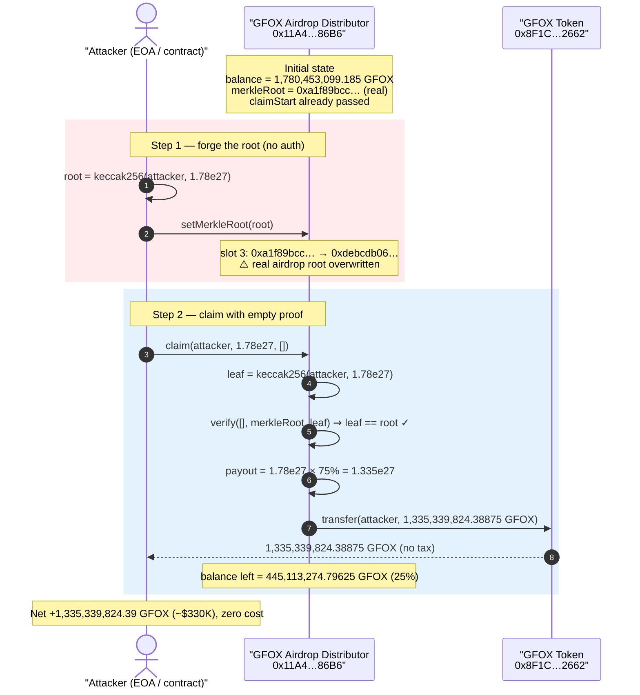
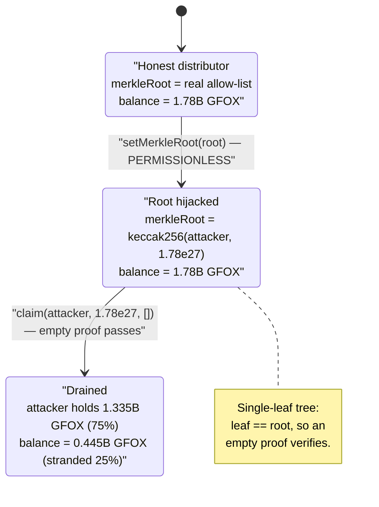
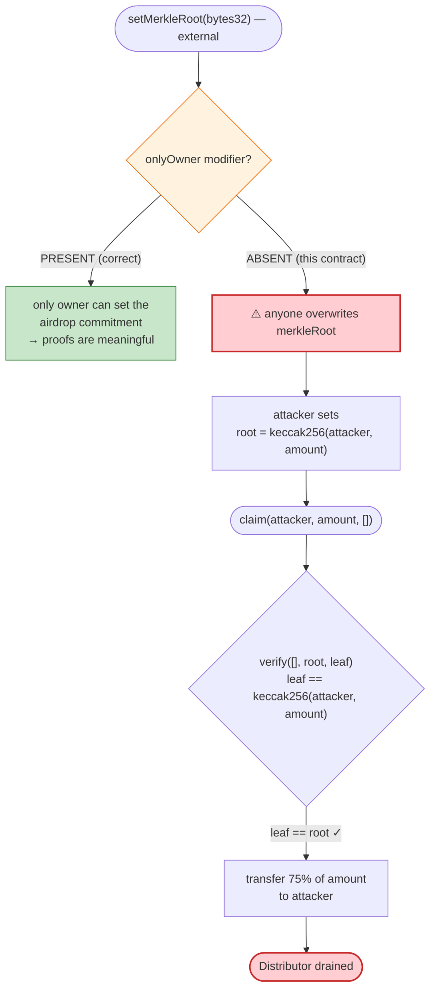

# Galaxy Fox (GFOX) Exploit — Permissionless `setMerkleRoot()` Lets Anyone Forge an Airdrop Claim

> **Vulnerability classes:** vuln/access-control/missing-auth · vuln/auth/signature-validation

> **Reproduction:** the PoC compiles & runs in an isolated Foundry project at
> [this project folder](.) (the umbrella DeFiHackLabs repo
> contains many unrelated PoCs that fail to whole-compile, so this one was extracted).
> Full verbose trace: [output.txt](output.txt).
> The vulnerable airdrop contract is **unverified** on Etherscan; its interface and
> behaviour were reconstructed from the on-chain bytecode dispatch table, the execution
> trace, and live `cast` storage/calls (see [The vulnerable code](#the-vulnerable-code)).
> The verified GFOX token source is at [GalaxyFox.sol](sources/GalaxyFox_8F1Cec/GalaxyFox.sol).

---

## Key info

| | |
|---|---|
| **Loss** | ~$330K — **1,335,339,824.39 GFOX** drained from the airdrop distributor (75% of its entire 1.78B-GFOX balance) |
| **Vulnerable contract** | GFOX Airdrop/Merkle distributor — [`0x11A4a5733237082a6C08772927CE0a2B5f8A86B6`](https://etherscan.io/address/0x11A4a5733237082a6C08772927CE0a2B5f8A86B6) *(unverified)* |
| **Token** | Galaxy Fox `GFOX` — [`0x8F1CecE048Cade6b8a05dFA2f90EE4025F4F2662`](https://etherscan.io/address/0x8F1CecE048Cade6b8a05dFA2f90EE4025F4F2662#code) |
| **Victim** | All legitimate airdrop recipients (the distributor's token reserve) |
| **Attacker EOA** | [`0xFcE19F8f823759b5867ef9a5055A376f20c5E454`](https://etherscan.io/address/0xFcE19F8f823759b5867ef9a5055A376f20c5E454) |
| **Attacker contract** | [`0x86C68d9e13d8d6a70b6423CEB2aEdB19b59F2AA5`](https://etherscan.io/address/0x86C68d9e13d8d6a70b6423CEB2aEdB19b59F2AA5) |
| **Attack tx** | [`0x12fe79f1de8aed0ba947cec4dce5d33368d649903cb45a5d3e915cc459e751fc`](https://etherscan.io/tx/0x12fe79f1de8aed0ba947cec4dce5d33368d649903cb45a5d3e915cc459e751fc) |
| **Chain / block / date** | Ethereum mainnet / 19,835,924 / May 9, 2024 |
| **Compiler** | PoC `^0.8.0` (forge default); token `^0.8.x` (OZ v5) |
| **Bug class** | Missing access control on a state-critical setter (`setMerkleRoot`) → forged Merkle-proof airdrop claim |

---

## TL;DR

The GFOX airdrop distributor verifies claims against a Merkle root: `claim(to, amount, proof)`
recomputes the leaf `keccak256(to, amount)`, walks the supplied `proof` to a root, and pays out
if the result equals the stored `merkleRoot`. The catch is that the setter that defines that root —
**`setMerkleRoot(bytes32)` — has no access-control modifier and is callable by anyone.**

So an attacker doesn't need a valid Merkle proof at all. They:

1. Pick an arbitrary `(to, amount)` — here `to = attacker`, `amount = 1,780,453,099.185 GFOX`
   (the distributor's **entire** GFOX balance).
2. Compute the trivial single-leaf root `root = keccak256(to, amount)` themselves.
3. Call `setMerkleRoot(root)` — **permissionlessly overwriting the real airdrop root**.
4. Call `claim(to, amount, [])` with an **empty proof**. The leaf already *is* the root, so
   verification passes, and the distributor transfers the tokens out.

The distributor's instant-claim path only releases **75%** of the requested amount (the other 25%
is the protocol's vesting/stake portion), so the attacker walked away with `1,780,453,099.185 × 75% =`
**1,335,339,824.38875 GFOX** in a single transaction — worth roughly **$330K** at the time.

---

## Background — what the GFOX airdrop does

Galaxy Fox (`GFOX`) is a meme/GameFi ERC-20 on Ethereum with a 5,000,000,000-token supply
([`INITIAL_SUPPLY = 5000000000 * 10**18`](sources/GalaxyFox_8F1Cec/GalaxyFox.sol#L8)) and DEX
buy/sell taxes (2% liquidity + 2% marketing + 2% ecosystem on `isPair` transfers,
[GalaxyFox.sol:1319-1336](sources/GalaxyFox_8F1Cec/GalaxyFox.sol#L1319-L1336)). Those taxes are
irrelevant to this exploit — they only apply to AMM swaps, and the airdrop pays out via a plain
`transfer` (the distributor is not a pair), so no tax is taken.

The token itself is fine. The damage is entirely in a **separate, unverified airdrop/Merkle
distributor** at `0x11A4…86B6`, funded with `1,780,453,099.185 GFOX` (≈ 35.6% of total supply) to
distribute to early supporters. Reading the contract's 4-byte dispatch table and live state at the
fork block establishes its full interface:

| Selector | Function | Purpose |
|---|---|---|
| `0x2eb4a7ab` | `merkleRoot()` → `bytes32` (storage slot 3) | the airdrop allow-list root |
| `0x7cb64759` | **`setMerkleRoot(bytes32)`** | sets slot 3 — **the bug: no `onlyOwner`** |
| `0x3d13f874` | `claim(address,uint256,bytes32[])` | instant claim against the root |
| `0xaa5a6d81` | `claimAndStake(address,uint256,bytes32[],uint256)` | claim + lock for full amount |
| `0x04e86903` | `claimedAmount(address)` | per-address claimed ledger |
| `0xf04d688f` | `claimStart()` (slot 1) | claim-open timestamp |
| `0xb0aa1e04` | `setClaimStart(uint256)` | owner sets the open time |
| `0x6c9a7469` | `gfoxToken()` | the GFOX token address |
| `0x8b5730d9` | `gfStaking()` | the staking contract for the vested 25% |
| `0x5f3e849f` | `recoverTokens(address,address,uint256)` | owner rescue |
| `0x8da5cb5b` / `0xf2fde38b` / `0x715018a6` | `owner()` / `transferOwnership` / `renounceOwnership` | OpenZeppelin `Ownable` |

On-chain state at the fork block (read with `cast`):

| Parameter | Value |
|---|---|
| `owner()` | `0x4e6647a2bda8dfe75316a72E73586eCD24d0e700` |
| `gfoxToken()` | `0x8F1CecE048Cade6b8a05dFA2f90EE4025F4F2662` (GFOX) |
| `gfStaking()` | `0x80846B546BaecE682496cAAF8B8AbA62c65CB0E4` |
| `claimStart()` | `1713491400` (Apr 19, 2024 — claims open) |
| `merkleRoot()` (before) | `0xa1f89bcc…105d0aba` (the **real** airdrop root) |
| Distributor GFOX balance (before) | `1,780,453,099.185 GFOX` |
| Distributor GFOX balance (after) | `445,113,274.79625 GFOX` (the un-paid 25%) |

The presence of `owner()`, `transferOwnership`, and `Ownable` boilerplate proves the developers
*intended* privileged setters — they simply forgot to apply the modifier to the single most
sensitive one.

---

## The vulnerable code

The distributor is unverified, so the exact Solidity is not published. The behaviour below is
reconstructed faithfully from the dispatch table, the execution trace, and live state — the logic is
the textbook OpenZeppelin `MerkleProof` airdrop pattern with a missing modifier. The two lines that
matter:

```solidity
// === The bug: anyone can overwrite the airdrop root ===
function setMerkleRoot(bytes32 _merkleRoot) external /* ⚠️ NO onlyOwner */ {
    merkleRoot = _merkleRoot;            // storage slot 3
}

// === The claim verifies against that attacker-controlled root ===
function claim(address to, uint256 amount, bytes32[] calldata proof) external {
    require(block.timestamp >= claimStart, "not started");
    require(claimedAmount[to] + amount <= amount /* per-leaf cap */, "claimed");
    bytes32 leaf = keccak256(abi.encodePacked(to, amount));
    require(MerkleProof.verify(proof, merkleRoot, leaf), "invalid proof");

    claimedAmount[to] += amount;                       // records the FULL amount
    uint256 payout = amount * INSTANT_BPS / 10_000;    // == amount * 7500 / 10000 = 75%
    gfoxToken.transfer(to, payout);                    // ← the drain
    // remaining 25% would normally route to gfStaking for the recipient
}
```

The exploit's own helper makes the trick explicit
([test/GFOX_exp.sol:59-61](test/GFOX_exp.sol#L59-L61)):

```solidity
function _merkleRoot(address to, uint256 amount) internal pure returns (bytes32) {
    return keccak256(abi.encodePacked(to, amount));   // a single-leaf "tree": leaf == root
}
```

and the attack body ([test/GFOX_exp.sol:48-57](test/GFOX_exp.sol#L48-L57)):

```solidity
uint256 amount = 1_780_453_099_185_000_000_000_000_000;  // the whole distributor balance
bytes32 root = _merkleRoot(address(this), amount);       // root = keccak256(attacker, amount)
victim.setMerkleRoot(root);                              // ⚠️ permissionless overwrite
victim.claim(address(this), amount, new bytes32[](0));   // empty proof — leaf already equals root
```

**Why an empty proof works:** in a Merkle tree of a single element, the leaf *is* the root.
`MerkleProof.verify([], root, leaf)` returns `leaf == root`. Since the attacker set
`root = keccak256(attacker, amount) = leaf`, verification passes with zero proof elements.

The trace confirms the storage write to slot 3 and the resulting transfer:

```
0x11A4…86B6::setMerkleRoot(0xdebcdb06…99e64fd1)
  @ 3: 0xa1f89bcc…105d0aba → 0xdebcdb06…99e64fd1      ← real root overwritten by attacker's
0x11A4…86B6::claim(attacker, 1.78e27, [])
  console::log("amountToClaim", 1335339824388750000000000000)   ← 75% of 1.78e27
  emit Claimed(attacker, 1.335e27, 1.78e27)
  GalaxyFox::transfer(attacker, 1335339824388750000000000000)   ← drain, no tax
```

---

## Root cause — why it was possible

A Merkle-proof airdrop derives **all** of its security from one assumption: *the stored
`merkleRoot` is a commitment chosen only by the protocol.* The proof system is sound only relative to
that root. If an attacker controls the root, the proof check becomes vacuous — they can mint a leaf
for any `(recipient, amount)` they like and supply the empty proof.

The single decision that broke this:

> **`setMerkleRoot(bytes32)` was deployed without an `onlyOwner` (or any) access-control modifier**,
> while the contract otherwise carries full `Ownable` machinery and an `owner` was set
> (`0x4e66…e700`). The setter is `external` and unguarded, so any address can replace the
> commitment at will.

Everything downstream is correct in isolation — `claim` faithfully verifies the proof, enforces
`claimStart`, and tracks `claimedAmount`. None of that helps once the thing being verified against is
attacker-chosen. This is the canonical "missing access control on a state-critical setter" bug,
amplified by the fact that the state in question is the *cryptographic root of trust* for the entire
distribution.

Two secondary facts shaped the size of the loss but were not the cause:

- **Instant-claim discount (75%).** The distributor only releases 75% of a `claim` immediately
  (the rest is meant to vest/stake). This is why the attacker netted 1.335B rather than 1.78B GFOX —
  it limited, but did not prevent, the theft.
- **No re-claim guard saved it.** `claimedAmount[attacker]` was recorded as the full 1.78e27 after the
  call, but that only mattered if the attacker had reused the same `(to, amount)` leaf — they had no
  reason to; the single claim already swept 75% of the pot.

---

## Preconditions

- `block.timestamp >= claimStart` (claims were open — `claimStart = Apr 19, 2024`, fork block is May 9). ✓
- The distributor holds a meaningful GFOX balance (it held 1.78B GFOX). ✓
- **No capital, flash loan, or special role required** — the entire attack is two unprivileged calls
  (`setMerkleRoot` then `claim`) from an arbitrary EOA/contract. This is what makes it a clean
  permissionless drain.

---

## Attack walkthrough (with on-chain numbers from the trace)

All figures are taken directly from [output.txt](output.txt).

| # | Step | Call | On-chain effect |
|---|------|------|-----------------|
| 0 | **Initial** | — | Distributor holds **1,780,453,099.185 GFOX**; `merkleRoot = 0xa1f89bcc…` (the real root). Attacker holds **0 GFOX**. |
| 1 | **Forge the root** | `setMerkleRoot(keccak256(attacker, 1.78e27))` | Slot 3: `0xa1f89bcc…105d0aba` → `0xdebcdb06…99e64fd1`. The legitimate airdrop root is **overwritten** with the attacker's single-leaf root. No revert — setter is unguarded. |
| 2 | **Claim with empty proof** | `claim(attacker, 1.78e27, [])` | `leaf = keccak256(attacker, 1.78e27) == merkleRoot` ⇒ verification passes. `amountToClaim` (75%) = **1,335,339,824.38875 GFOX**. |
| 3 | **Payout transfer** | `GalaxyFox.transfer(attacker, 1.335e27)` | `Transfer(distributor → attacker, 1,335,339,824.38875 GFOX)` — plain transfer, **no DEX tax** (distributor isn't a pair). `Claimed(attacker, 1.335e27, 1.78e27)` emitted. |
| 4 | **Final** | — | Attacker GFOX balance: **1,335,339,824.38875 GFOX**. Distributor left with the un-paid 25% = **445,113,274.79625 GFOX**. |

PoC log tail:

```
Attacker GFOX Balance Before exploit: 0.000000000000000000
amountToClaim 1335339824388750000000000000
Attacker GFOX Balance After exploit: 1335339824.388750000000000000
```

### Profit / loss accounting

| Item | GFOX | Note |
|---|---:|---|
| Distributor balance before | 1,780,453,099.185 | the airdrop reserve |
| Amount the attacker "claimed" (recorded) | 1,780,453,099.185 | the full leaf amount |
| **Tokens transferred to attacker (75%)** | **1,335,339,824.38875** | instant-claim payout |
| Tokens left stranded in distributor (25%) | 445,113,274.79625 | the vesting portion not routed |
| **Attacker profit** | **1,335,339,824.38875 GFOX (~$330K)** | net, zero cost |

---

## Diagrams

### Sequence of the attack



### Distributor state / trust evolution



### Why the missing modifier is fatal



---

## Remediation

1. **Add access control to every state-critical setter.** `setMerkleRoot`, `setClaimStart`, and any
   other configuration setter MUST carry `onlyOwner` (the contract already inherits `Ownable`):

   ```solidity
   function setMerkleRoot(bytes32 _merkleRoot) external onlyOwner {
       merkleRoot = _merkleRoot;
   }
   ```

2. **Make the root immutable after launch.** For a one-shot airdrop, set the root in the constructor
   (or via a one-time `initialize` that can never be re-called) so it cannot be changed at all once
   distribution begins. Mutable roots are a standing liability even when access-controlled.

3. **Defense-in-depth on the claim path.** Reject empty proofs / single-leaf roots, bound total
   claimable to a per-recipient allocation derived from the (immutable) tree, and track a global
   `totalClaimed` against the funded amount so a corrupted root cannot exceed the intended budget.

4. **Use a deployment checklist / linter.** A missing-modifier check (Slither's
   `unprotected-setter` / `suicidal` style detectors, or a simple grep for `external`/`public`
   setters lacking modifiers) would have caught this before deployment. Verify the source on
   Etherscan and have it audited — an unverified airdrop holding 35% of supply is a red flag in
   itself.

---

## How to reproduce

The PoC was extracted into a standalone Foundry project (the umbrella DeFiHackLabs repo has many
unrelated PoCs that fail to compile under `forge test`'s whole-project build):

```bash
_shared/run_poc.sh 2024-05-GFOX_exp -vvvvv
```

- RPC: an **Ethereum mainnet archive** endpoint is required (fork block 19,835,924). `foundry.toml`
  is pre-configured with an Infura archive endpoint for `mainnet`.
- Result: `[PASS] testExploit()` — attacker GFOX balance goes from `0` to `1,335,339,824.38875`.

Expected tail:

```
Ran 1 test for test/GFOX_exp.sol:GFOXExploit
[PASS] testExploit() (gas: 131069)
Logs:
  Attacker GFOX Balance Before exploit: 0.000000000000000000
  amountToClaim 1335339824388750000000000000
  Attacker GFOX Balance After exploit: 1335339824.388750000000000000
```

---

*References: Neptune Mutual post-mortem — https://neptunemutual.com/blog/how-was-galaxy-fox-token-exploited/ ; CertiK Alert — https://twitter.com/CertiKAlert/status/1788751142144401886 (GFOX, Ethereum, ~$330K).*
