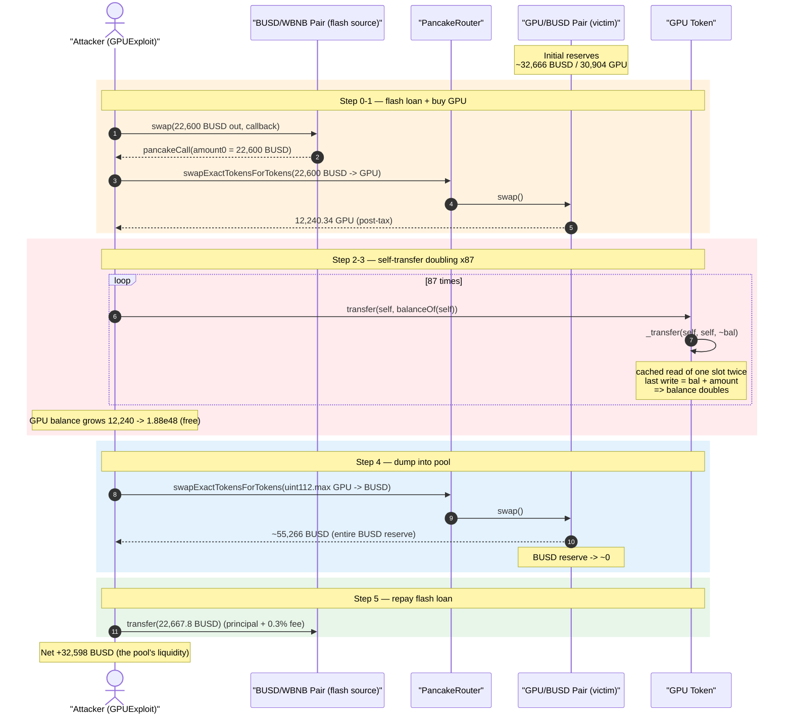
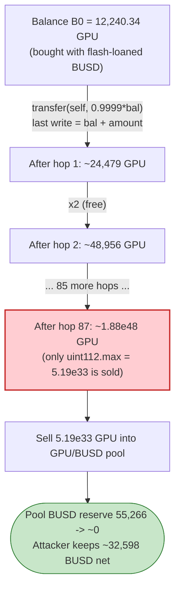
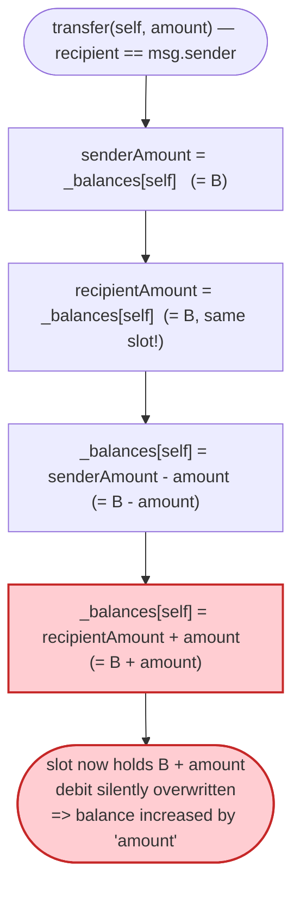

# GPU Token Exploit — Self-Transfer Balance Doubling

> One-liner: GPU's ERC20 `_transfer` caches both the sender's and recipient's balance **before** writing them back, so a transfer to **yourself** writes `balance + amount` last and overwrites the `balance - amount` decrement — turning every self-transfer into a free `balance *= 2`.

> **Reproduction:** the PoC compiles & runs in an isolated Foundry project at
> [this project folder](.) (the umbrella DeFiHackLabs repo does not whole-compile, so this
> PoC was extracted standalone).
> Full verbose trace: [output.txt](output.txt).
> Verified vulnerable source: [sources/GPU_f51CBf/GPU.sol](sources/GPU_f51CBf/GPU.sol).

---

## Key info

| | |
|---|---|
| **Loss** | ~$32K — attacker BUSD balance grew from **26.54 BUSD → 32,624.62 BUSD** (≈ **+32,598 BUSD** net) |
| **Vulnerable contract** | `GPU` token — [`0xf51CBf9F8E089Ca48e454EB79731037a405972ce`](https://bscscan.com/address/0xf51CBf9F8E089Ca48e454EB79731037a405972ce#code) |
| **Victim / drained pool** | GPU/BUSD PancakePair — [`0x61373083F4dEef88ba449AD82218059781962D76`](https://bscscan.com/address/0x61373083F4dEef88ba449AD82218059781962D76) (initial reserves ≈ **32,666 BUSD / 30,904 GPU**) |
| **Flash-loan source** | BUSD/WBNB PancakePair — [`0x16b9a82891338f9bA80E2D6970FddA79D1eb0daE`](https://bscscan.com/address/0x16b9a82891338f9bA80E2D6970FddA79D1eb0daE) (22,600 BUSD flash-swapped) |
| **Attacker contract** | `GPUExploit` (PoC `address(this)`, on-chain `0x7FA9385bE102ac3EAc297483Dd6233D62b3e1496` in the fork) |
| **Attack tx** | [`0x2c0ada695a507d7a03f4f308f545c7db4847b2b2c82de79e702d655d8c95dadb`](https://app.blocksec.com/explorer/tx/bsc/0x2c0ada695a507d7a03f4f308f545c7db4847b2b2c82de79e702d655d8c95dadb) |
| **Chain / block / date** | BSC / 38,539,572 / May 8, 2024 |
| **Compiler** | Solidity **v0.8.18**, optimizer enabled, **200 runs** |
| **Bug class** | ERC20 self-transfer balance inflation (stale cached-balance write-order bug) |
| **Credit** | [PeckShieldAlert](https://twitter.com/PeckShieldAlert/status/1788153869987611113) |

---

## TL;DR

`GPU` is a fee-on-transfer "DeFi" token. Buried under its tax/auto-liquidity machinery, every plain
transfer that is *not* to/from the AMM pair eventually calls the inherited base
`ERC20._transfer(from, to, amount)` ([GPU.sol:481-494](sources/GPU_f51CBf/GPU.sol#L481-L494)):

```solidity
uint256 senderAmount    = _balances[sender];      // cached
uint256 recipientAmount = _balances[recipient];   // cached
_balances[sender]    = senderAmount.sub(amount);  // write A:  balance - amount
_balances[recipient] = recipientAmount.add(amount); // write B:  balance + amount  ← overwrites A
```

When `sender == recipient`, `senderAmount` and `recipientAmount` are **two copies of the same slot**.
Write A debits the balance, but write B (executed *last*) recomputes from the **stale cached value**
and stores `balance + amount`, silently discarding the debit. With `amount ≈ full balance`, the
account balance **doubles**.

The attacker:

1. Flash-borrows **22,600 BUSD** from the BUSD/WBNB pair via `swap(...)` + `pancakeCall` callback.
2. Buys GPU with the borrowed BUSD → receives **12,240.34 GPU** (post-tax) from the GPU/BUSD pool.
3. Calls `gpuToken.transfer(address(this), balance)` **87 times** — each call ~doubles the GPU
   balance for free (12,240 → 24,479 → 48,956 → … exponential).
4. Sells `type(uint112).max` (**5,192,296,858,534,827,628,530,496,329,220,095** wei ≈ 5.19e33) GPU back
   into the GPU/BUSD pool, draining essentially all of the pool's BUSD.
5. Repays the 22,600 BUSD flash loan + 0.3% fee and keeps the difference: **~32,598 BUSD** profit.

---

## Background — what GPU does

`GPU` ([source](sources/GPU_f51CBf/GPU.sol)) is a BSC fee-on-transfer ERC20 (name/symbol `"GPU"`,
18 decimals, total supply `10**24` = 1,000,000 GPU minted to the owner —
[GPU.sol:914-938](sources/GPU_f51CBf/GPU.sol#L914-L938)). Its base token is **BUSD-T (USDT on BSC)**
`0x55d3...7955`, and it auto-creates a GPU/USDT PancakeSwap pair in the constructor.

It overrides `_transfer` ([GPU.sol:982-1039](sources/GPU_f51CBf/GPU.sol#L982-L1039)) with:

- **Buy/sell taxes** when `from` or `to` is the registered pair (`_isPairs`) — a 2% burn + 1% to the
  contract during the first 18 months, then 0.5%/0.5% thereafter.
- **Auto liquify** (`swapAndLiquify`) when the contract's GPU balance exceeds `pool/2000` and a sell
  is happening.
- A "dust" rule: for non-pair transfers where `amount == balanceOf(from)`, the amount is trimmed to
  `99.99%` ([GPU.sol:1035](sources/GPU_f51CBf/GPU.sol#L1035)) — then `super._transfer` is called.

A **plain transfer to a non-pair address** (the attacker → attacker) falls into the final
`else` branch ([GPU.sol:1034-1036](sources/GPU_f51CBf/GPU.sol#L1034-L1036)), trims the amount to
99.99% of the balance, and then calls `super._transfer(from, to, amount)`. With `from == to`, that
hits the broken base function below.

---

## The vulnerable code

### 1. The inherited base `_transfer` — caches both balances, writes recipient last

[sources/GPU_f51CBf/GPU.sol:481-494](sources/GPU_f51CBf/GPU.sol#L481-L494):

```solidity
function _transfer(
    address sender,
    address recipient,
    uint256 amount
) internal virtual {
    require(sender != address(0), "ERC20: transfer from the zero address");
    require(recipient != address(0), "ERC20: transfer to the zero address");
    uint256 senderAmount    = _balances[sender];     // ← read slot S into memory
    uint256 recipientAmount = _balances[recipient];  // ← read SAME slot S into memory (self-transfer)
    require(senderAmount >= amount, "ERC20: transfer amount exceeds balance");
    _balances[sender]    = senderAmount.sub(amount);    // write S = bal - amount
    _balances[recipient] = recipientAmount.add(amount); // write S = bal + amount  ← clobbers the line above
    emit Transfer(sender, recipient, amount);
}
```

The canonical OpenZeppelin pattern uses `_balances[from] -= amount; _balances[to] += amount;`
with **live re-reads**, which is self-transfer-safe (`-amount` then `+amount` nets to zero). This
contract instead snapshots both balances **up front** into `senderAmount` / `recipientAmount`, so on
a self-transfer the final `recipientAmount.add(amount)` write reconstructs the balance from a stale
pre-debit value. The debit is lost; the net effect is `_balances[self] += amount`.

### 2. The GPU override routes a self-transfer into the broken base function

[sources/GPU_f51CBf/GPU.sol:1010-1038](sources/GPU_f51CBf/GPU.sol#L1010-L1038):

```solidity
if (_isExcludedFromFees[from] || _isExcludedFromFees[to]) {} else {
    if(_isPairs[from]){ ... }
    else if(_isPairs[to]){ ... }
    else{
        if(amount == super.balanceOf(from)){ amount = amount.div(10000).mul(9999); } // trim to 99.99%
    }
}
super._transfer(from, to, amount);   // from == to == attacker  ⇒  doubling bug fires
```

Because attacker→attacker is neither `_isPairs[from]` nor `_isPairs[to]`, no buy/sell tax applies.
The amount is merely trimmed to 99.99% of the balance, then `super._transfer` runs with
`from == to`, doubling the balance (minus a negligible 0.01% rounding loss per hop).

### 3. The public entry point

[sources/GPU_f51CBf/GPU.sol:342-350](sources/GPU_f51CBf/GPU.sol#L342-L350):

```solidity
function transfer(address recipient, uint256 amount) public virtual override returns (bool) {
    _transfer(_msgSender(), recipient, amount);   // recipient can be msg.sender itself
    return true;
}
```

Nothing prevents `recipient == msg.sender`. (The `_transferFrom` path at
[GPU.sol:1049](sources/GPU_f51CBf/GPU.sol#L1049) *does* `require(to != from)`, but the direct
`transfer()` path does not — and the attack only needs `transfer`.)

---

## Root cause — why it was possible

The bug is a classic **stale read-modify-write ordering** flaw, specific to the self-transfer
(aliasing) case:

> `_transfer` loads `_balances[sender]` and `_balances[recipient]` into **two local variables before
> any write**. When sender and recipient are the same address, both locals hold the same value `B`.
> The function then writes `B - amount`, immediately followed by `B + amount` to the same slot. The
> last write wins, so the slot ends at `B + amount` instead of `B`. Calling `transfer(self, ~B)`
> therefore mints `≈ B` tokens out of thin air.

Two design choices compose into a critical exploit:

1. **Self-transfer is not blocked on the `transfer()` path.** The contract knew this was dangerous —
   it guards `_transferFrom` with `require(to != from)` — but left the plain `transfer()` path open.
2. **The base ERC20 caches both balances instead of reading them live.** Solidity 0.8 checked
   arithmetic (and SafeMath here) prevents *overflow*, but does nothing against the
   logical write-order bug; the slot is simply overwritten with the larger value.

Once an attacker holds any GPU, they can repeatedly self-transfer to grow the balance exponentially
for ~free gas, then dump the inflated balance into the AMM pool to extract the pool's BUSD.

---

## Preconditions

- Attacker holds **some** GPU to start the doubling (obtained here by buying with a 22,600 BUSD
  flash loan — fully repaid intra-transaction, so the attack needs **zero starting capital**).
- A GPU/BUSD pool with meaningful BUSD reserves to dump into (≈ **32,666 BUSD** at the fork block).
- The self-transfer must avoid the pair-tax branches — trivially satisfied because attacker→attacker
  is a non-pair transfer (final `else`).
- Enough doubling hops to overshoot the pool — 87 hops produce far more GPU than the
  `type(uint112).max` cap used for the final sell, so the pool's entire BUSD side is taken.

---

## Attack walkthrough (on-chain numbers from the trace)

The GPU/BUSD pair's `token0 = BUSD`, `token1 = GPU`, so `reserve0 = BUSD`, `reserve1 = GPU`.
All figures below are from [output.txt](output.txt) (BUSD/GPU shown in whole tokens, 18 decimals).

| # | Step (trace ref) | BUSD moved | GPU balance after | Notes |
|---|------------------|-----------:|------------------:|-------|
| 0 | **Flash-swap** 22,600 BUSD from BUSD/WBNB pair → `pancakeCall` ([output.txt L35-L45](output.txt)) | +22,600 borrowed | 0 | Loan to repay = 22,600 + 0.3% fee = **22,667.8 BUSD**. |
| 1 | **Buy GPU** with 22,600 BUSD via router ([Swap L64](output.txt)) | −22,600 | **12,240.34 GPU** | Pool gives `12,618.90 GPU`, GPU sell-tax trims to attacker `12,240.34`. Pool reserves now ≈ 55,266 BUSD / 18,285 GPU. |
| 2 | **Self-transfer #1** `transfer(self, 12,240.34)` ([L75-L78](output.txt)) | — | **24,479.45 GPU** | Balance ~doubled (12,240 → 24,479). |
| 3 | **Self-transfer #2** ([L82](output.txt)) | — | **48,956.45 GPU** | Doubled again. |
| … | **Self-transfers #3 … #87** (geometric, [L82-L680](output.txt)) | — | up to ~**1.88e48 GPU** | Each hop `bal → bal + 0.9999·bal ≈ 2·bal`. |
| 4 | **Sell** `type(uint112).max` GPU = 5.19e33 into the pool ([swapExactTokens L682](output.txt)) | +55,265.88 BUSD out | — | Pool BUSD reserve drained from ≈55,266 → **202,533 wei (≈ 0)**; pool GPU reserve = 5.03e33. Attacker BUSD = **55,292.42**. |
| 5 | **Repay flash loan** transfer 22,667.8 BUSD back to BUSD/WBNB pair ([L812](output.txt)) | −22,667.8 | — | Loan + 0.3% fee. |
| 6 | **End** ([log "After exploit"](output.txt)) | — | — | Attacker BUSD = **32,624.62**. |

Doubling check (matches trace to rounding): start 12,240.337 GPU; transferred amount on hop #1 =
`bal·9999/10000 = 12,239.113 GPU`; new balance = `12,240.337 + 12,239.113 = 24,479.45 GPU` — exactly
the L78 balance.

### Profit accounting (BUSD)

| Direction | Amount (BUSD) |
|---|---:|
| Starting attacker balance | 26.54 |
| Flash-loaned in | +22,600.00 |
| Spent buying GPU | −22,600.00 |
| Received from selling inflated GPU | +55,265.88 |
| Flash-loan repayment (principal + 0.3% fee) | −22,667.80 |
| **Ending attacker balance** | **32,624.62** |
| **Net profit (end − start)** | **+32,598.08** |

The profit (~$32.6K) is essentially the **entire BUSD side** of the GPU/BUSD pool, transferred to the
attacker in exchange for GPU that cost nothing to create.

---

## Diagrams

### Sequence of the attack



### GPU balance evolution under self-transfer



### The flaw inside base `_transfer`



---

## Remediation

1. **Read balances live, write incrementally.** Use the canonical pattern
   `_balances[from] = _balances[from] - amount; _balances[to] = _balances[to] + amount;`
   (no pre-cached copies). With live re-reads, a self-transfer nets to zero. This single change fixes
   the root cause.
2. **Block self-transfers explicitly.** Add `require(sender != recipient, "self transfer")` to
   `_transfer` (the contract already does this in `_transferFrom`; apply it everywhere). This is a
   defensive backstop even if the arithmetic pattern were correct.
3. **Don't hand-roll ERC20 balance bookkeeping.** Inherit OpenZeppelin's audited `ERC20`; its
   `_update`/`_transfer` are aliasing-safe. Custom tax tokens should layer fees *on top of* a correct
   base, not reimplement the core ledger.
4. **Add invariant tests.** A property test asserting "no operation increases an account's balance
   without a matching decrease elsewhere (or a mint)" would have caught this immediately, as would a
   unit test on `transfer(self, balance)`.

---

## How to reproduce

The PoC was extracted into a standalone Foundry project (the umbrella DeFiHackLabs repo does not
whole-compile under `forge test`):

```bash
_shared/run_poc.sh 2024-05-GPU_exp -vvvvv
```

- RPC: a **BSC archive** endpoint is required (fork block 38,539,572). `foundry.toml` uses
  `https://bsc-mainnet.public.blastapi.io`, which serves historical state at that block; the
  pre-configured OnFinality public endpoint was rate-limited (HTTP 429) at run time, so it was
  swapped per the runner's fallback list.
- Result: `[PASS] testExploit()` — attacker BUSD goes from `26.54` to `32,624.62`.

Expected tail:

```
Ran 1 test for test/GPU_exp.sol:GPUExploit
[PASS] testExploit() (gas: 1361056)
  Attacker BUSD Balance Before exploit: 26.542161622221038197
  Attacker BUSD Balance After exploit: 32624.621653691010246187
Suite result: ok. 1 passed; 0 failed; 0 skipped
```

---

*Reference: PeckShieldAlert — https://twitter.com/PeckShieldAlert/status/1788153869987611113 (GPU, BSC, ~$32K).*
