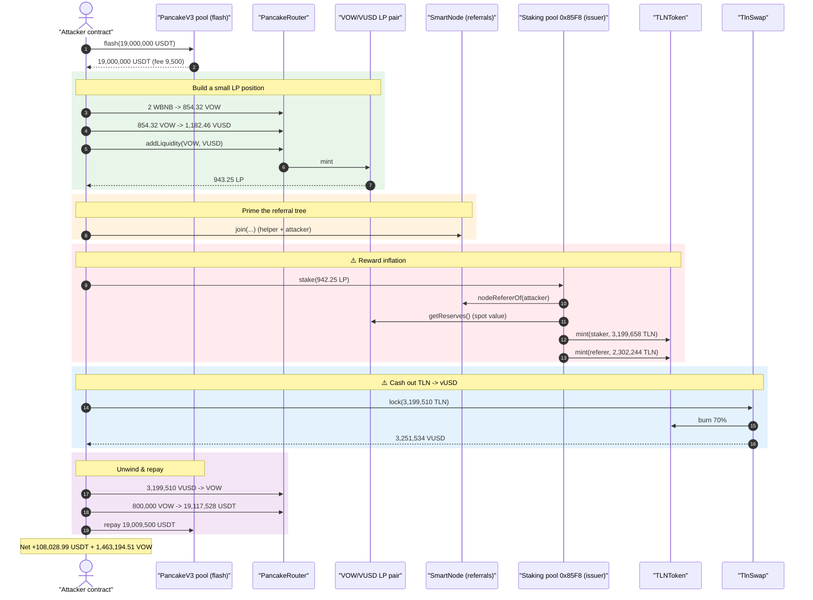
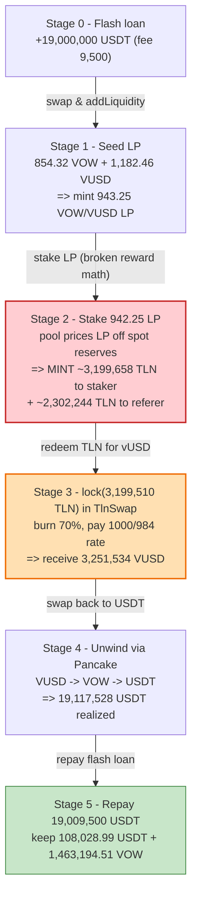
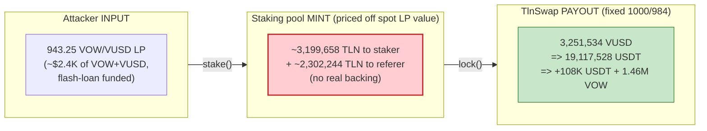

# Liquidity Tokens (TLN / VOW / VUSD) Exploit — LP-Stake Reward Inflation & 1:1 TLN→vUSD Redemption

> **Vulnerability classes:** vuln/logic/reward-calculation · vuln/access-control/missing-auth

> **Reproduction:** the PoC compiles & runs in an isolated Foundry project at
> [this project folder](.) (the umbrella DeFiHackLabs repo contains many unrelated
> PoCs that do not compile under a whole-repo build, so this one was extracted).
> Full verbose trace: [output.txt](output.txt).
> Verified sources downloaded under [sources/](sources/) — note that the **core
> vulnerable staking contract** (`0x85F8…A5f8`) and its config helper
> (`0x9a9E…9191`) are **unverified on BscScan**, so their logic below is
> reconstructed precisely from the execution trace; the redemption sink
> (`TlnSwap`), the reward token (`TLNToken`) and the referral registry
> (`SmartNode`) are verified and quoted directly.

---

## Key info

| | |
|---|---|
| **Loss** | ~$200K — attacker netted **108,028.99 BUSD (USDT)** + **1,463,194.51 VOW** after repaying a 19M-USDT flash loan |
| **Vulnerable contract** | TLN **staking pool** (mints TLN as reward) — [`0x85F82230883693f1Bbff65be1f7663EE5F0AA5f8`](https://bscscan.com/address/0x85F82230883693f1Bbff65be1f7663EE5F0AA5f8) *(unverified)*, plus the **`TlnSwap`** redemption sink — [`0x19B3F588BdC9a6f9ecb8255919B02F9ADF053363`](https://bscscan.com/address/0x19B3F588BdC9a6f9ecb8255919B02F9ADF053363#code) |
| **Reward token** | `TLNToken` — [`0xf7d142a354322C7560250CaA0e2a06c89649e4C2`](https://bscscan.com/address/0xf7d142a354322C7560250CaA0e2a06c89649e4C2#code) |
| **Victim pools** | VOW/USDT pair `0xC6585bc1…1F9FB`; VOW/VUSD LP pair `0x72dCf845AE36401e82e681B0E063d0703bAC0Bba` (staked & drained); `TlnSwap` vUSD reserves |
| **Referral registry** | `SmartNode` — [`0x028c911C10c9E346158206991E02D09Bd0A8A35b`](https://bscscan.com/address/0x028c911C10c9E346158206991E02D09Bd0A8A35b#code) |
| **Attacker EOA** | [`0x6951eb8a4a1dab360f2230fb654551335d560ec0`](https://bscscan.com/address/0x6951eb8a4a1dab360f2230fb654551335d560ec0) |
| **Attack contract** | [`0xbdfbb387fbf20379c016998ac609871c3357d749`](https://bscscan.com/address/0xbdfbb387fbf20379c016998ac609871c3357d749) |
| **Attack tx** | [`0x1350cc72865420ba5d3c27234fd4665ad25c021b0a75ba03bc8340a1b1f98a45`](https://app.blocksec.com/explorer/tx/bsc/0x1350cc72865420ba5d3c27234fd4665ad25c021b0a75ba03bc8340a1b1f98a45) |
| **Chain / block / date** | BSC / 39,198,657 / May 2024 |
| **Compiler** | PoC `^0.8.10`; `TlnSwap`/`TLNToken` Solidity 0.8.x |
| **Bug class** | Reward-minting accounting flaw (stake reward priced off attacker-supplied LP) + fixed-rate `TLN→vUSD` redemption with no peg / supply backing |

---

## TL;DR

The protocol lets a user **stake VOW/VUSD LP tokens** into a staking pool
(`0x85F8…A5f8`). The pool mints fresh **TLN** as a staking reward, and the reward
size is computed from the *underlying USD value* of the staked LP — derived live
from the VOW/USDT and VOW/VUSD pool reserves. Separately, the verified `TlnSwap`
contract lets anyone **`lock(amount)` TLN and instantly receive
`amount * 1000 / 984` vUSD** ([contracts_TlnSwap.sol:74-98](sources/TlnSwap_19B3F5/contracts_TlnSwap.sol#L74-L98)),
burning 70% of the deposited TLN but paying out vUSD from its pool **regardless of
how the TLN was minted**.

The two pieces compose into a money printer:

1. Flash-loan **19,000,000 USDT** and use part of it to **mint a small VOW/VUSD LP
   position** (943.25 LP, worth only a couple thousand dollars).
2. **Stake** that LP into the pool. Because the reward is priced off the staked
   LP's *claimed* USD value, the pool **mints ≈3,199,658 TLN** — orders of
   magnitude more value than the LP is worth (≈3,396× the LP token count).
3. Forward the minted TLN to the attacker and **`lock()` 3,199,510 TLN into
   `TlnSwap`**, redeeming it for **≈3,251,534 vUSD** at the fixed `1000/984` rate.
4. Swap the vUSD → VOW → USDT through Pancake and **repay the 19,000,000 + 9,500
   USDT** flash loan, keeping the surplus.

Net: the attacker walks away with **108,028.99 BUSD/USDT + 1,463,194.51 VOW**
(~$200K), funded entirely by freshly-minted TLN that had no real backing.

---

## Background — what the protocol does

The "Liquidity Tokens" system is a small DeFi stack on BSC built around three
ERC20s and a referral tree:

- **VOW** ([`0xF585…397b`](sources/VOWToken_F585B5)) and **VUSD**
  ([`0xc0D8…4160`](sources/VusdToken_c0D8Da)) — the protocol's value tokens, with
  a VOW/USDT market pair (`0xC6585bc1…1F9FB`) and a VOW/VUSD pair
  (`0x72dCf845…0Bba`, also the LP token).
- **TLN** ([`TLNToken`](sources/TLNToken_f7d142/contracts_TLNToken.sol)) — a reward
  token. Only addresses flagged as *issuers* can `mint` it
  ([contracts_TLNToken.sol:59-62](sources/TLNToken_f7d142/contracts_TLNToken.sol#L59-L62)).
  The **staking pool `0x85F8…A5f8` is an issuer**, which is why every `stake()`
  call in the trace is followed by `TLNToken::mint(...)`.
- **`SmartNode`** ([contracts_SmartNode.sol](sources/SmartNode_028c91/contracts_SmartNode.sol)) —
  a referral registry. `join(referer)` enrolls `msg.sender` under an existing
  referer ([contracts_SmartNode.sol:33-43](sources/SmartNode_028c91/contracts_SmartNode.sol#L33-L43));
  the staking pool reads `nodeRefererOf()` to split rewards up the referral chain.
- **`TlnSwap`** ([contracts_TlnSwap.sol](sources/TlnSwap_19B3F5/contracts_TlnSwap.sol)) —
  a "lock TLN, borrow vUSD" facility that gives out vUSD at a fixed conversion.

The attack abuses two of these: the **un-backed reward minting** in the staking
pool, and the **fixed-rate vUSD payout** in `TlnSwap`.

---

## The vulnerable code

### 1. `TlnSwap.lock()` — pays out vUSD 1:1.016 for *any* TLN, no questions asked

```solidity
function lock(uint256 amount) external {
    require(amount > 0, "TlnSwap: Zero lock amount");

    _tlnToken.safeTransferFrom(_msgSender(), address(this), amount);
    _tlnToken.burn((amount * BURN_PERCENTAGE) / 100);          // 70% burned
    _tlnToken.safeTransfer(_exchange, (amount * EXCHANGE_PERCENTAGE) / 100); // 10% to exchange

    uint256 lockedVow = _vowToLock(amount);
    _vowToken.safeTransferFrom(_msgSender(), address(this), lockedVow);
    ...
    uint256 borrowAmount = (amount * 1000) / 984;              // ⚠️ fixed payout rate
    _vusdToken.safeTransfer(_msgSender(), borrowAmount);       // ⚠️ pays vUSD from pool
    _depositPool -= borrowAmount;
    _totalBorrowed += borrowAmount;
    emit Lock(_msgSender(), _loanId.current(), amount, lockedVow);
}
```
[contracts_TlnSwap.sol:74-98](sources/TlnSwap_19B3F5/contracts_TlnSwap.sol#L74-L98)

The payout `borrowAmount = amount * 1000 / 984 ≈ 1.0163 × amount` is purely a
function of the TLN amount deposited. `TlnSwap` has **no way to know whether the
TLN was earned legitimately or freshly conjured** — it simply transfers vUSD out
of its reserves. The TLN's `mint` access control is delegated entirely to the
"issuer" staking pool, so once that pool over-mints, `TlnSwap` becomes a faucet.

### 2. The staking pool over-mints TLN priced off attacker-supplied LP

The staking pool (`0x85F8…A5f8`) is unverified, but the trace fully reveals its
behavior. `stake(lpAmount)` does the following each time:

- pulls `lpAmount` of the **VOW/VUSD LP token** (`0x72dCf845…`) from the staker;
- reads `nodeRefererOf(staker)` from `SmartNode` and live reserves from the
  **VOW/USDT** pair (`0xC6585bc1…`) and the **VOW/VUSD** pair (`0x72dCf845…`);
- computes a reward from the *USD value* implied by those reserves and the staked
  LP, then **mints TLN** to the staker and up the referral chain.

In the decisive call the attacker stakes **942.25 LP** and the pool mints:

```
TLNToken::mint(Money,  2,949,658.717… TLN)   // base reward to staker
TLNToken::mint(Money,    250,000      TLN)   // bonus
TLNToken::mint(Referer, 2,212,244.037… TLN)  // referral rewards
TLNToken::mint(Referer,    90,000     TLN)
emit Stake(staker, 942.25 LP, 14,748,293.586 …)   // param2 = credited "value"
```
[output.txt:404-436](output.txt)

So **942.25 LP tokens → 3,199,658 TLN minted to the staker** (the `Money` helper),
which is `~3,396×` the LP token count and represents roughly **$3.2M of TLN value
for a position the attacker minted with a couple thousand dollars of VOW + VUSD.**

### 3. TLN minting is gated only by the "issuer" flag

```solidity
function mint(address _account, uint256 _amount) public onlyIssuer returns (bool) {
    _mint(_account, _amount);
    return true;
}
```
[contracts_TLNToken.sol:59-62](sources/TLNToken_f7d142/contracts_TLNToken.sol#L59-L62)

The staking pool is a trusted issuer, so the broken reward math directly becomes
unbounded TLN supply with no economic backing.

---

## Root cause — why it was possible

Two independent design errors that compose into a critical, fully on-chain,
flash-loanable exploit:

1. **Reward is priced off attacker-controlled, freshly-minted LP.** The staking
   pool credits TLN based on the *current* USD value of the deposited VOW/VUSD LP,
   computed from spot reserves. An attacker can create that LP on demand with
   flash-loaned capital, stake it, harvest a reward worth far more than the
   deposit, and then **unwind the LP** — the pool never verifies that the staked
   value is durable or that the reward is bounded by real protocol revenue. The
   reward-to-deposit ratio (~3,396×) is the entire profit lever.

2. **`TlnSwap` redeems TLN for vUSD at a fixed rate with no supply/peg check.**
   `lock()` pays `amount * 1000 / 984` vUSD for any TLN, draining `_depositPool`
   ([contracts_TlnSwap.sol:93-96](sources/TlnSwap_19B3F5/contracts_TlnSwap.sol#L93-L96)).
   It assumes TLN is scarce and honestly earned. Combined with (1), an attacker
   mints TLN for almost nothing and immediately cashes it out for real vUSD, which
   is then routed back to USDT/VOW via Pancake.

The referral tree (`SmartNode.join`) is permissionless
([contracts_SmartNode.sol:33-43](sources/SmartNode_028c91/contracts_SmartNode.sol#L33-L43)),
so the attacker simply enrolled its own helper contract under a referer it
controls to satisfy the pool's `nodeRefererOf` reads and even collect the referral
share of the inflated rewards.

---

## Preconditions

- An open `SmartNode` referral slot — the attacker's `Money` helper joins under
  referer `0xEB1Df3…334E68` ([output.txt:245](output.txt)) and the attack contract
  joins under `Money` ([output.txt:266](output.txt)); both are permissionless.
- The staking pool holds the *issuer* role on `TLNToken` (it does) so its rewards
  mint real TLN.
- `TlnSwap` holds enough vUSD in `_depositPool` to satisfy the `lock()` payout.
- Working capital to (a) seed the VOW/VUSD LP and (b) push token prices around —
  fully supplied intra-transaction by a **19,000,000 USDT PancakeV3 flash loan**
  (fee 9,500 USDT), hence the whole thing is flash-loanable.

---

## Attack walkthrough (with on-chain numbers from the trace)

All numbers are pulled directly from the events/calls in [output.txt](output.txt).
USDT on BSC is referred to as "BUSD" in the PoC (the constant `BUSD` is in fact
USDT `0x55d3…7955`).

| # | Step | Concrete numbers (from trace) | Effect |
|---|------|-------------------------------|--------|
| 0 | **Flash loan** 19,000,000 USDT from PancakeV3 pool `0x3669…2050` | borrow 19,000,000 USDT; fee 9,500 USDT ([output.txt:75,86](output.txt)) | Working capital acquired. |
| 1 | Swap 2 WBNB → … → VOW | 2 WBNB → **854.32 VOW** ([output.txt:92](output.txt)) | Seed VOW. |
| 2 | Swap 854.32 VOW → VUSD | → **1,182.46 VUSD** ([output.txt:152](output.txt)) | Seed the other LP leg. |
| 3 | `addLiquidity(VOW, VUSD, 854.32, 1182.46)` | mints **943.25 LP** of pair `0x72dCf845…` ([output.txt:200,232](output.txt)) | Attacker now holds the stakeable LP. |
| 4 | `SmartNode.join` chain set up (`Money`, then attacker) | helper `Money` registered, attacker registered under it ([output.txt:245,266](output.txt)) | Referral tree primed for reward. |
| 5 | Swap **19,000,000 USDT → VOW** | → **240,491.92 VOW** ([output.txt:279](output.txt)) | Pump VOW inventory for later redemption legs. |
| 6 | `Money.stakes()` — stake **1 LP** via helper | mints 3,130.43 TLN to referer; `Stake` param2 = **15,652.15** ([output.txt:325,358](output.txt)) | Warm-up stake. |
| 7 | **`stake(942.25 LP)`** by attacker | mints **2,949,658.72 + 250,000 TLN** to `Money`; **2,212,244.04 + 90,000 TLN** to referer; `Stake` param2 = **14,748,293.59** ([output.txt:379-436](output.txt)) | ⚠️ **Reward inflation**: 942 LP → ~3.2M TLN. |
| 8 | `Money.Send()` forwards TLN to attacker | transfers **3,199,658.72 TLN** to attacker ([output.txt:537-543](output.txt)) | Attacker holds the minted TLN. |
| 9 | **`TlnSwap.lock(3,199,510.34 TLN)`** | burns 70% (2,239,657 TLN), 10% to exchange, pays out **3,251,534.90 VUSD** ([output.txt:473-508](output.txt)) | ⚠️ **TLN → vUSD cash-out**. |
| 10 | Swap **3,199,510 VUSD → VOW** | drains VOW/VUSD pair ([output.txt:526](output.txt)) | Convert vUSD to VOW. |
| 11 | Swap **800,000 VOW → USDT** | → **19,117,528.99 USDT** ([output.txt:567,586](output.txt)) | Convert VOW to USDT to repay. |
| 12 | Repay flash loan | transfer **19,009,500 USDT** back to pool `0x3669…2050` ([output.txt:601](output.txt)) | Loan + fee settled. |
| 13 | **Settle** | attacker left with **108,028.99 USDT** + **1,463,194.51 VOW** ([output.txt:608-end](output.txt)) | Profit realized. |

### Profit / loss accounting

USDT (USDT side) — fully closed within the transaction:

| Direction | Amount (USDT) |
|---|---:|
| Flash-loan principal repaid | 19,000,000.00 |
| Flash-loan fee paid | 9,500.00 |
| **Total repaid** | **19,009,500.00** |
| USDT received from 800,000 VOW → USDT swap | 19,117,528.99 |
| **Net USDT kept** | **+108,028.99** |

Plus a residual VOW position the attacker did not sell inside the tx:

| Asset | Amount kept |
|---|---:|
| VOW | 1,463,194.51 |

The value extracted (USDT + VOW) is funded entirely by the ~3.2M TLN minted for
free in step 7 and cashed out for vUSD in step 9 — i.e., the loss is borne by the
`TlnSwap` vUSD reserves and the VOW/VUSD & VOW/USDT pools. SlowMist / EXVUL report
the total loss at **~$200K**.

---

## Diagrams

### Sequence of the attack



### Pool / state evolution



### The flaw: value in vs. value out



---

## Remediation

1. **Do not price staking rewards off spot LP/pool value.** Rewards must be a
   function of *durable* committed capital and a bounded, protocol-funded emission
   schedule — not the instantaneous USD value of attacker-mintable LP. Use a
   manipulation-resistant oracle (TWAP) at minimum, and require a meaningful
   minimum lock duration so a flash-loan-built LP cannot be staked and unwound in
   one transaction.
2. **Cap and back reward minting.** TLN minted as rewards should be bounded by a
   per-block/per-call emission cap and by real protocol revenue. Unbounded minting
   delegated to a single "issuer" contract turns any reward bug into an unbounded
   supply bug.
3. **Make `TlnSwap` redemption peg-aware.** `lock()` should not pay a fixed
   `1000/984` vUSD for arbitrary TLN. Tie the payout to TLN's real backing /
   circulating value, enforce per-tx and global redemption caps, and pause when
   TLN supply grows abnormally fast.
4. **Constrain the referral tree's economic power.** `SmartNode.join` being
   permissionless lets an attacker self-refer and collect the referral share of
   inflated rewards. Referral payouts must inherit the same bounding/oracle checks
   as the base reward.
5. **Add flash-loan / same-block guards.** Disallow stake → reward → redeem in a
   single transaction (e.g., reward accrual only after N blocks), which removes the
   atomicity the exploit relies on.

---

## How to reproduce

The PoC was extracted into a standalone Foundry project (the umbrella DeFiHackLabs
repo has many unrelated PoCs that fail a whole-repo `forge build`):

```bash
_shared/run_poc.sh 2024-05-Liquiditytokens_exp -vvvvv
```

- RPC: a **BSC archive** endpoint is required (fork block 39,198,657). `foundry.toml`
  uses `https://bsc-mainnet.public.blastapi.io`, which serves historical state at
  that block; the default `bnb.api.onfinality.io/public` endpoint was rate-limited
  (HTTP 429) during this run and was swapped out.
- Result: `[PASS] testExploit()`.

Expected tail:

```
[Begin] Attacker BUSD before exploit: 0.000000000000000000
[End] Attacker BUSD after exploit: 108028.987081179442645147
[End] Attacker Vow after exploit: 1463194.509849036306480361
[PASS] testExploit() (gas: 3518312)
Suite result: ok. 1 passed; 0 failed; 0 skipped
```

---

*Reference: EXVUL Security — https://x.com/EXVULSEC/status/1796499069583724638 (Liquidity Tokens, BSC, ~$200K).*
