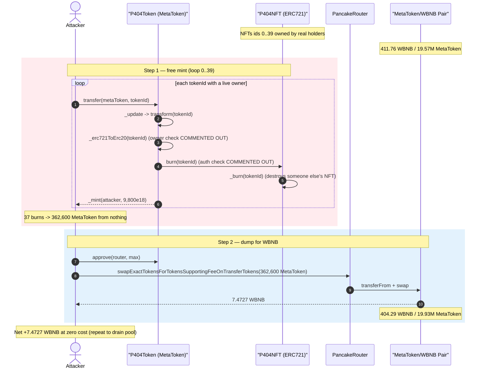
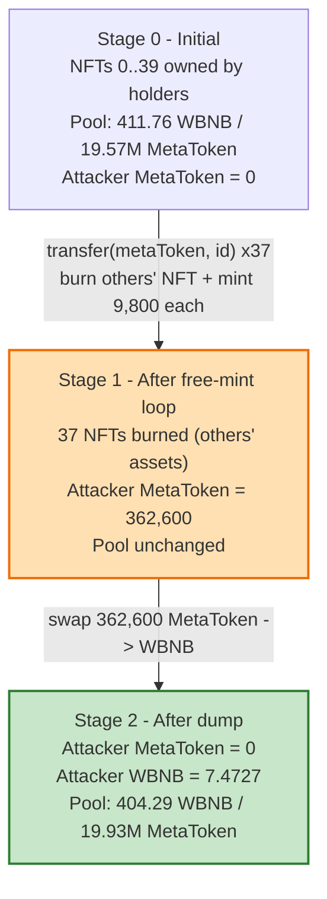
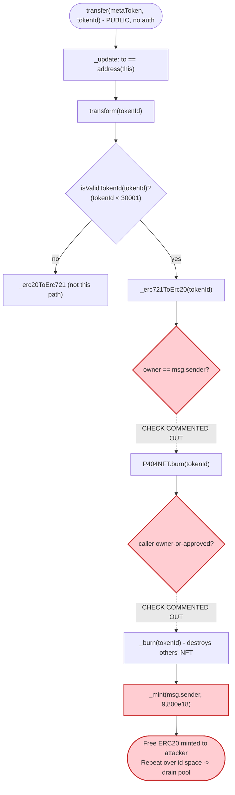

# MetaDragon (P404) Exploit — Permissionless NFT Burn Mints Free ERC20

> **Vulnerability classes:** vuln/access-control/missing-auth · vuln/logic/missing-validation

> **Reproduction:** the PoC compiles & runs in an isolated Foundry project at
> [this project folder](.) (the umbrella DeFiHackLabs repo
> contains many unrelated PoCs that do not whole-compile, so this one was extracted).
> Full verbose trace: [output.txt](output.txt).
> Verified vulnerable sources: [token.sol](sources/P404Token_EF1f39/token.sol) (the ERC20/P404 contract)
> and [nft.sol](sources/P404NFT_336a76/nft.sol) (the paired ERC721).

---

## Key info

| | |
|---|---|
| **Loss** | **~$180K** reported by the original disclosure (aggregate across the full attack). This single-tx PoC mints 362,600 MetaToken from nothing and dumps it for **7.47 WBNB** (~$4.3K) — a verified, self-contained proof of the free-mint primitive that, repeated, produced the full loss. |
| **Vulnerable contract** | `P404Token` (MetaToken / "MetaDragon") — [`0xEF1f39d8391cdDcaee62b8b383cB992F46a6ce4f`](https://bscscan.com/address/0xEF1f39d8391cdDcaee62b8b383cB992F46a6ce4f#code) |
| **Paired NFT** | `P404NFT` — [`0x336a7675a863C12F7B49061B3ecb9E54bE5e2120`](https://bscscan.com/address/0x336a7675a863C12F7B49061B3ecb9E54bE5e2120#code) |
| **Victim pool** | MetaToken/WBNB PancakeSwap pair — `0x0a86a9Cc823f8FEbc1D26f1f880bE3C986e7C042` |
| **Attack tx (reference)** | [`0x3ad998a01ad1f1bbe6dba6a08e658c1749dabfa4a07da20ded3c73bcd6970d20`](https://app.blocksec.com/explorer/tx/bsc/0x3ad998a01ad1f1bbe6dba6a08e658c1749dabfa4a07da20ded3c73bcd6970d20) |
| **Chain / block / date** | BSC / 39,141,426 / ~May 2024 |
| **Compiler** | Solidity v0.8.24, optimizer **200 runs** |
| **Bug class** | Broken access control — missing ownership check on NFT→token conversion ("ERC-404"-style fractional pairing) lets anyone burn *other people's* NFTs to mint themselves new ERC20 |

---

## TL;DR

MetaToken is an **ERC-404-style** dual asset: a small `tokenId` (≤ 30000) is treated as an ERC721,
while a large `value` is treated as the fractional ERC20. Sending the "ERC721 side" to the token
contract is supposed to *redeem* one NFT for `TRANSFORM_PRICE × 98%` = **9,800** ERC20.

The redemption path `P404Token._erc721ToErc20()`
([token.sol:266-275](sources/P404Token_EF1f39/token.sol#L266-L275)) **has its ownership check
commented out**:

```solidity
function _erc721ToErc20(uint256 _tokenId) internal {
    // require(ownerOf(_tokenId) == msg.sender, "P404: not owner");   ⚠️ DISABLED
    IERC721Burnable(erc721).burn(_tokenId);
    _mint(msg.sender, (TRANSFORM_PRICE * (10000 - TRANSFORM_LOSE_RATE)) / 10000); // 9,800e18
    emit FromNFTToToken(msg.sender, _tokenId);
}
```

The downstream `P404NFT.burn()`
([nft.sol:76-85](sources/P404NFT_336a76/nft.sol#L76-L85)) also has its
"caller is owner-or-approved" check commented out — it only requires that the *caller is the token
contract*, which it always is. So **any address can pass any existing `tokenId`, the NFT (owned by
someone else) is burned, and 9,800 fresh ERC20 are minted to the attacker.**

The PoC simply loops `transfer(metaToken, tokenId)` for `tokenId = 0..39`, burning whatever NFTs
exist in that range (37 of them did), mints **362,600 MetaToken** for free, and sells the lot into the
MetaToken/WBNB pool for **7.47 WBNB**. Repeating this over the whole NFT id space drains the pool —
the disclosed loss was ~$180K.

---

## Background — what P404 (MetaDragon) does

"ERC-404" is an unofficial standard that fuses a fungible ERC20 with a non-fungible ERC721 so that
holding `TRANSFORM_PRICE` worth of the fungible token entitles you to one NFT and vice-versa. The
MetaDragon deployment splits this across two contracts:

- **`P404Token`** ([source](sources/P404Token_EF1f39/token.sol)) — the public-facing ERC20. It also
  *impersonates* the ERC721 interface (`transferFrom`, `safeTransferFrom`, `ownerOf`, …) by forwarding
  to the NFT contract. It decides whether an argument is "an NFT id" or "a token amount" purely by
  size via `isValidTokenId(x) => x < 30001`
  ([token.sol:94-97](sources/P404Token_EF1f39/token.sol#L94-L97)).
- **`P404NFT`** ([source](sources/P404NFT_336a76/nft.sol)) — the ERC721 enumerable. Its `mint`/`burn`
  are gated to the token contract (`p404contract`).

Conversion is two-way:

- **NFT → ERC20** (`_erc721ToErc20`): burn 1 NFT, receive `TRANSFORM_PRICE × (1 − 2%)` = **9,800** ERC20.
- **ERC20 → NFT** (`_erc20ToErc721`): burn `n × TRANSFORM_PRICE` ERC20, mint `n` NFTs.

Relevant constants ([token.sol:47-53](sources/P404Token_EF1f39/token.sol#L47-L53)):

| Parameter | Value |
|---|---|
| `TRANSFORM_PRICE` | 10,000 × 10¹⁸ |
| `TRANSFORM_LOSE_RATE` | 200 bps = **2%** |
| Mint per NFT redeemed | 10,000 × 98% = **9,800 × 10¹⁸** |
| `isValidTokenId` cutoff | `tokenId < 30001` |

The NFT→ERC20 direction is the one that *creates* fungible supply. Guarding it with "you must own the
NFT you redeem" is the only thing standing between an honest redemption and an unlimited mint. That
guard was commented out.

---

## The vulnerable code

### 1. Entry point: ERC20 `transfer` routes small ids into `transform()`

Because the token overloads ERC20 `transfer` to also mean "move an NFT," sending a small id `to` the
token contract (or to the NFT contract) triggers `transform()` →
`_erc721ToErc20()`. The dispatch lives in `_update`:

```solidity
function _update(address from, address to, uint256 value) internal override {
    if (!isValidTokenId(value)) {
        super._update(from, to, value);
    }
    if (to == address(this) || to == erc721) {   // ← "send NFT to the contract" branch
        transform(value);                          //   value is treated as a tokenId
    } else {
        ...
    }
}
```
[token.sol:119-148](sources/P404Token_EF1f39/token.sol#L119-L148)

The PoC hits this through `transfer(metaToken, tokenId)` — `to == address(this)`, `value == tokenId`,
so `transform(tokenId)` runs. (The PoC header summarizes exactly this:
`if (to == address(this) || to == erc721) {transform(value);}` allows unrestricted minting.)

### 2. `transform` → `_erc721ToErc20` mints with NO owner check

```solidity
function transform(uint256 tokenIdOrValue) internal {
    if (isValidTokenId(tokenIdOrValue)) {
        _erc721ToErc20(tokenIdOrValue);     // small id → mint ERC20
    } else {
        _erc20ToErc721(tokenIdOrValue);
    }
}

function _erc721ToErc20(uint256 _tokenId) internal {
    // require(ownerOf(_tokenId) == msg.sender, "P404: not owner");   ⚠️ COMMENTED OUT
    IERC721Burnable(erc721).burn(_tokenId);                            // burn ANYONE's NFT
    _mint(msg.sender, (TRANSFORM_PRICE * (10000 - TRANSFORM_LOSE_RATE)) / 10000); // 9,800e18 to caller
    emit FromNFTToToken(msg.sender, _tokenId);
}
```
[token.sol:150-275](sources/P404Token_EF1f39/token.sol#L150-L275)

### 3. The NFT's `burn` also dropped its owner/approval check

```solidity
function burn(uint256 tokenId) external {
    // address _owner = ownerOf(tokenId);
    // require(_isAuthorized(_owner, msg.sender, tokenId), "P404NFT: caller is not owner nor approved"); ⚠️ DISABLED
    require(p404contract == msg.sender, "P404NFT: only p404contract can burn"); // always true here
    _withdrawAndStoreERC721(tokenId);   // -> _burn(tokenId), no ownership of the *original* holder checked
}

function _withdrawAndStoreERC721(uint256 id) internal virtual {
    _burn(id);                          // destroys the NFT regardless of who the attacker is
    _storedERC721Ids.pushFront(id);
}
```
[nft.sol:76-183](sources/P404NFT_336a76/nft.sol#L76-L183)

So both halves of the only authorization that mattered are commented out. The single surviving check
(`p404contract == msg.sender`) is satisfied automatically because `P404Token` is the one calling
`burn` — it provides zero protection against the *external* caller of `transfer`.

---

## Root cause — why it was possible

The conversion `NFT → 9,800 ERC20` is a **mint of fungible value**. For the books to balance, the
caller must be giving up an NFT they actually own; otherwise value is created from thin air and dumped
on whoever holds the matching liquidity. Two redundant guards were meant to enforce "you must own the
NFT you redeem," and **both were commented out**:

1. **`P404Token._erc721ToErc20`** dropped `require(ownerOf(_tokenId) == msg.sender)`
   ([token.sol:267](sources/P404Token_EF1f39/token.sol#L267)).
2. **`P404NFT.burn`** dropped `require(_isAuthorized(owner, msg.sender, tokenId))`
   ([nft.sol:78](sources/P404NFT_336a76/nft.sol#L78)) and replaced it with a contract-identity check
   that the external attacker never has to satisfy.

With both gone, the attack is a one-liner per id:

> `transfer(metaToken, tokenId)` → burns the NFT that `tokenId` points to (owned by *someone else*) →
> mints **9,800 MetaToken** to the *attacker*. No NFT of the attacker's is consumed; the burned NFT
> belonged to a real holder.

Because `_erc721ToErc20` mints unconditionally on a successful burn, the attacker just enumerates the
NFT id space. Every id that still has a live owner yields 9,800 free ERC20; ids that were already
burned (no current owner) simply revert with the ERC721 `ERC721NonexistentToken` custom error
(`0x7e273289`) and are skipped. The minted ERC20 is then sold into the AMM for real WBNB.

A secondary observation: even with the owner check, redeeming at `98%` of `TRANSFORM_PRICE` only makes
sense if an NFT was *bought* at ≥ `TRANSFORM_PRICE` of value. Here the NFTs were minted/airdropped at
the project's mint price, far below 9,800 tokens' market value, so each free burn was deeply
profitable when dumped.

---

## Preconditions

- **Live NFTs exist in the enumerated id range.** Any `tokenId < 30001` that currently has an owner can
  be burned. In the PoC, 37 of ids `0..39` were live (ids 0,1 plus 4 others reverted as already-burned).
- **A MetaToken/WBNB pool with liquidity to dump into.** The pair
  `0x0a86a9Cc...e7C042` held ~411.76 WBNB / ~19.57M MetaToken at the fork block.
- **No capital required.** The mint is free; the only cost is gas. There is no flash loan, no price
  manipulation, no special role — it is pure missing access control.

---

## Attack walkthrough (with on-chain numbers from the trace)

All figures are taken directly from [output.txt](output.txt). The pair's
`token0 = WBNB (reserve0)`, `token1 = MetaToken (reserve1)`.

| # | Step | Detail | Effect |
|---|------|--------|--------|
| 0 | **Initial pool** | reserve0 = 411.762 WBNB, reserve1 = 19,568,489.59 MetaToken | Honest pool. |
| 1 | **Loop free-mint** `for tokenId in 0..39: transfer(metaToken, tokenId)` | Each live id → `P404NFT.burn(id)` → `_mint(attacker, 9,800e18)`; ids with no owner revert `0x7e273289` and are skipped | 37 successful burns × 9,800 = **362,600 MetaToken minted from nothing**. |
| 2 | **Approve router** `approve(PancakeRouter, max)` | — | Allows the dump. |
| 3 | **Dump** `swapExactTokensForTokensSupportingFeeOnTransferTokens(362,600 MetaToken, 0, [MetaToken, WBNB], attacker)` | `transferFrom` sends 362,600 MetaToken into the pair; `swap` returns 7.4727 WBNB | Pool: reserve0 → 404.289 WBNB, reserve1 → 19,931,089.59 MetaToken. |
| 4 | **Profit** | attacker WBNB balance: 0 → **7.4727 WBNB** | Free WBNB extracted. |

### Mint accounting (per id)

`mint = TRANSFORM_PRICE × (10000 − TRANSFORM_LOSE_RATE) / 10000 = 10,000e18 × 9800/10000 = 9,800e18`.
37 successful burns × 9,800 = **362,600** MetaToken — matches `attacker MetaToken balance:
362600000000000000000000` in the trace.

### Swap accounting (verified)

PancakeSwap `getAmountOut` with the 0.25% fee, on the pre-swap reserves at the moment of the swap
(reserve1 MetaToken = 19,568,489.586, reserve0 WBNB = 411.762):

```
amountInWithFee = 362,600 × 0.9975 = 361,693.5
out = amountInWithFee × reserveWBNB / (reserveMeta + amountInWithFee)
    = 361,693.5 × 411.762 / (19,568,489.586 + 361,693.5)
    ≈ 7.4727 WBNB
```

This equals the `Swap` event's `amount0Out = 7472668510259903860` (7.4727 WBNB) to the wei.

### Profit / loss accounting

| Party | Change |
|---|---:|
| Attacker MetaToken minted (cost basis $0) | +362,600 MetaToken |
| Attacker WBNB received | **+7.4727 WBNB** |
| Pool WBNB drained | −7.4727 WBNB |
| Pool MetaToken inflated (worthless dilution) | +362,600 MetaToken |
| NFT holders | 37 NFTs destroyed without compensation |

The single PoC transaction nets **+7.4727 WBNB (~$4.3K)** at zero capital cost. The disclosed
**~$180K** total loss is the aggregate of the attacker repeating this free-mint-and-dump primitive
across the NFT id space / multiple transactions, progressively draining the pool's WBNB.

---

## Diagrams

### Sequence of the attack



### NFT / pool state evolution



### The flaw inside the redemption path



---

## Remediation

1. **Restore the ownership check on NFT → ERC20 redemption.** Re-enable
   `require(ownerOf(_tokenId) == msg.sender, "P404: not owner")` in
   `_erc721ToErc20` ([token.sol:267](sources/P404Token_EF1f39/token.sol#L267)). The redeemer must own
   the NFT they are burning.
2. **Restore the authorization check in `P404NFT.burn`.** Re-enable
   `require(_isAuthorized(ownerOf(tokenId), originalCaller, tokenId))`
   ([nft.sol:78](sources/P404NFT_336a76/nft.sol#L78)). The `p404contract == msg.sender` check only
   proves *which contract* called — it must also forward and verify the *external* caller's authority
   over the specific token (pass the original `msg.sender` / use a signed authorization).
3. **Never let a successful burn unconditionally mint to `msg.sender` without binding the burned asset
   to the caller.** The mint and the burned NFT must be the same party's; a conversion that mints
   fungible value must consume value the caller actually owned.
4. **Do not leave security checks commented out in production.** Both critical guards were present in
   the code as comments — a pre-deploy lint/diff against the reference implementation, or a test that a
   non-owner cannot redeem an NFT, would have caught this immediately.
5. **Add an invariant test:** "calling `transfer(token, id)` from an address that does not own
   `id` must revert." This single test fails on the deployed code and passes on the fix.

---

## How to reproduce

The PoC was extracted into a standalone Foundry project (the umbrella DeFiHackLabs repo has many
unrelated PoCs that fail to compile under `forge test`'s whole-project build):

```bash
_shared/run_poc.sh 2024-05-MetaDragon_exp -vvvvv
```

- RPC: a **BSC archive** endpoint is required for fork block 39,141,426. `foundry.toml` uses
  `https://bsc-mainnet.public.blastapi.io` (the pre-configured OnFinality public endpoint was
  rate-limited with HTTP 429 and was swapped out).
- Result: `[PASS] testExploit()` — attacker mints **362,600 MetaToken** for free and walks away with
  **7.4727 WBNB**.

Expected tail:

```
Ran 1 test for test/MetaDragon_exp.sol:MetaDragonTest
[PASS] testExploit() (gas: 2669335)
  attacker weth balance before: 0
  attacker MetaToken balance: 362600000000000000000000
  attacker weth balance after: 7472668510259903860
Suite result: ok. 1 passed; 0 failed; 0 skipped
```

---

*Reference: Phalcon/BlockSec disclosure — https://x.com/Phalcon_xyz/status/1795746828064854497 ;
attack tx https://app.blocksec.com/explorer/tx/bsc/0x3ad998a01ad1f1bbe6dba6a08e658c1749dabfa4a07da20ded3c73bcd6970d20*
