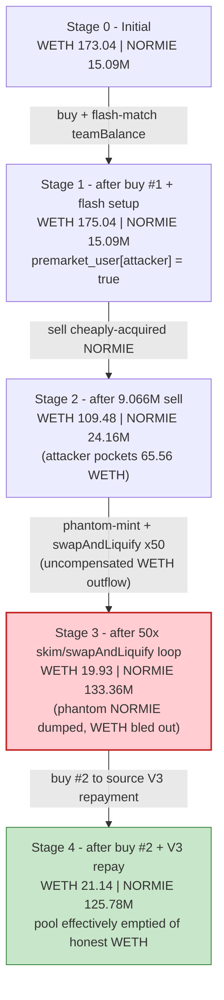
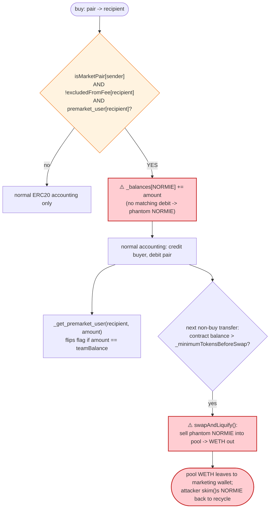

# NORMIE Exploit — Phantom Self-Mint via the `premarket_user` Flag + `skim()` Recycling

> **Vulnerability classes:** vuln/logic/state-update · vuln/arithmetic/overflow

> One-liner: A booby-trapped line in NORMIE's `_transfer` credits the token contract's own balance with `+amount` on every buy made by a "premarket user", a flag an attacker can flip onto themselves for free by matching the team wallet's exact balance — letting them mint phantom NORMIE that the contract's `swapAndLiquify` dumps for real WETH out of its own liquidity pool.

> **Reproduction:** the PoC compiles & runs in an isolated Foundry project at
> [this project folder](.) (the umbrella DeFiHackLabs repo does not whole-compile, so this PoC was extracted).
> Full verbose trace: [output.txt](output.txt).
> Verified vulnerable source: [sources/NORMIE_7F12d1/NORMIE.sol](sources/NORMIE_7F12d1/NORMIE.sol).

---

## Key info

| | |
|---|---|
| **Loss** | ~$490K — the WETH/NORMIE pool's WETH reserve drained from **173.04 → 21.14 WETH** (≈ **151.9 WETH**); attacker net profit **≈ 64 WETH**, the rest bled to the project's marketing wallet |
| **Vulnerable contract** | `NORMIE` — [`0x7F12d13B34F5F4f0a9449c16Bcd42f0da47AF200`](https://basescan.org/address/0x7F12d13B34F5F4f0a9449c16Bcd42f0da47AF200#code) |
| **Victim pool** | SushiSwap V2 `NORMIE/WETH` pair (SLP) — [`0x24605E0bb933f6EC96E6bBbCEa0be8cC880F6E6f`](https://basescan.org/address/0x24605E0bb933f6EC96E6bBbCEa0be8cC880F6E6f) |
| **Attacker EOA / message tx** | [`0x587f14b7…752f81eb`](https://basescan.org/tx/0x587f14b7ffb30b5013ab0db02e9bc94183817ef34c24a9595f33277e752f81eb) (exploiter's on-chain message to the deployer) |
| **Attack tx** | [`0xa618933a0e0ffd0b9f4f0835cc94e523d0941032821692c01aa96cd6f80fc3fd`](https://app.blocksec.com/explorer/tx/base/0xa618933a0e0ffd0b9f4f0835cc94e523d0941032821692c01aa96cd6f80fc3fd) |
| **Chain / block / date** | Base / fork at 14,952,782 (`14_952_783 - 1`) / May 28, 2024 |
| **Compiler** | Solidity v0.8.17, optimizer 200 runs |
| **Bug class** | Logic flaw — unaccounted balance inflation ("phantom mint") gated by an attacker-controllable flag; fee-on-transfer token that swaps WETH out of its own pool; `skim()` reserve-recycling |

---

## TL;DR

`NORMIE` is a meme token with an auto-liquidity / fee-distribution tax engine. Buried inside its
`_transfer` is this branch ([NORMIE.sol:906-912](sources/NORMIE_7F12d1/NORMIE.sol#L906-L912)):

```solidity
if (isMarketPair[sender] && !isExcludedFromFee[recipient] && premarket_user[recipient]) {
    _balances[address(this)] = _balances[address(this)].add(amount);   // ⚠️ adds tokens out of nowhere
}
```

When a *premarket user* buys NORMIE (a transfer **from** the pair to them), the contract silently
**adds `amount` NORMIE to its own balance** — without subtracting from anyone. Those tokens are
**conjured from nothing** (`totalSupply` is unchanged, but the sum of balances no longer matches it).

Becoming a `premarket_user` is supposed to be reserved for the team/dev wallets, but the helper that
sets it ([NORMIE.sol:771-775](sources/NORMIE_7F12d1/NORMIE.sol#L771-L775)) flips the flag for **anyone
who receives an amount equal to the team wallet's current balance**:

```solidity
function _get_premarket_user(address _address, uint256 amount) internal {
    premarket_user[_address] = !premarket_user[_address]
        ? (amount == balanceOf(teamWalletAddress))   // ⚠️ attacker-controllable condition
        : premarket_user[_address];
}
```

The team wallet held **exactly 5,000,000 NORMIE** at the attack block. The attacker simply
flash-borrowed **exactly 5,000,000 NORMIE** from SushiSwap so the pair would `transfer` it that amount,
matching the condition and flipping `premarket_user[attacker] = true`.

From there the attacker repeatedly:

1. **Buys** NORMIE from the pair (each buy phantom-mints `amount` NORMIE into the token contract).
2. Once the contract's phantom balance crosses `_minimumTokensBeforeSwap`, the next non-buy transfer
   triggers **`swapAndLiquify`**, which **sells those phantom tokens into the pair and pulls real WETH
   out** ([NORMIE.sol:955-988](sources/NORMIE_7F12d1/NORMIE.sol#L955-L988)).
3. Uses the pair's **`skim()`** to recover the NORMIE it had parked in the pool, recycling the same
   tokens through 50 loop iterations to keep the phantom-mint / WETH-drain engine running.

Net result: the pool's 173 WETH of honest liquidity is drained; the attacker walks off with ≈64 WETH
(~$211K at the time) and the remaining ≈91 WETH is force-fed to the project's own marketing wallet by
`swapAndLiquify`. Reported total loss ≈ **$490K**.

---

## Background — what NORMIE does

`NORMIE` ([source](sources/NORMIE_7F12d1/NORMIE.sol)) is a standard "tax token" with an auto-liquify
engine layered on top of OpenZeppelin-style ERC20 internals:

- **Tax engine.** `takeFee` ([:990-1011](sources/NORMIE_7F12d1/NORMIE.sol#L990-L1011)) can route a
  cut of each buy/sell to the contract. At the attack block both `_buyTotalFees` and `_sellTotalFees`
  were **0** ([:606-607](sources/NORMIE_7F12d1/NORMIE.sol#L606-L607)), so this path was dormant — the
  phantom balance came **only** from the `premarket_user` branch, not from fees.
- **Auto-liquify.** Whenever the contract's NORMIE balance exceeds `_minimumTokensBeforeSwap`
  (`= totalSupply * 5 / 1000 = 5,000,000` NORMIE, [:617](sources/NORMIE_7F12d1/NORMIE.sol#L617)),
  any non-buy transfer triggers `swapAndLiquify` ([:955-988](sources/NORMIE_7F12d1/NORMIE.sol#L955-L988)),
  which **swaps the contract's tokens for WETH on the very pool those tokens trade against** and forwards
  the WETH to the team/marketing wallets (`_marketingShare = 1000`, all of it,
  [:609-612](sources/NORMIE_7F12d1/NORMIE.sol#L609-L612)).
- **"Premarket" allow-list.** A `premarket_user` mapping
  ([:621](sources/NORMIE_7F12d1/NORMIE.sol#L621)) is initialised to the team & dev wallets
  ([:689-690](sources/NORMIE_7F12d1/NORMIE.sol#L689-L690)) and is meant to grant those wallets a
  special "balance is doubled into the contract" behavior at launch.

On-chain parameters at the fork block (read via `cast`):

| Parameter | Value |
|---|---|
| `totalSupply` | 1,000,000,000 NORMIE (9 decimals → `1e18` base units) |
| `_minimumTokensBeforeSwap` | 5,000,000 NORMIE (`5e15` base units) |
| `_buyTotalFees` / `_sellTotalFees` | **0 / 0** |
| `_marketingShare` / `_totalDistributionShares` | 1000 / 1000 (100% to marketing) |
| `teamWalletAddress` == `devWalletAddress` | `0xd8056B0F8AA2126a8DB6f0B3109Fe9127617bEb2` |
| **team wallet NORMIE balance** | **5,000,000 NORMIE (`5e15`)** ← the trigger value |
| `enableTrading` | true |
| Pool reserves (`token0 = WETH`, `token1 = NORMIE`) | **173.04 WETH / 15,094,052 NORMIE** |

That single coincidence — the team wallet holding exactly the round number `5,000,000` NORMIE, and
that number being trivially reproducible via a flash loan — is what turns a launch convenience into a
$490K hole.

---

## The vulnerable code

### 1. The phantom mint — `_transfer`

```solidity
function _transfer(address sender, address recipient, uint256 amount) private returns (bool) {
    ...
    } else {
        ...
        // ⚠️ BUG: on a buy (sender == pair) by a premarket_user, ADD `amount` to the contract balance.
        if (
            isMarketPair[sender] &&
            !isExcludedFromFee[recipient] &&
            premarket_user[recipient]
        ) {
            _balances[address(this)] = _balances[address(this)].add(amount);   // tokens from nowhere
        }
        if (
            overMinimumTokenBalance &&
            !inSwapAndLiquify &&
            !isMarketPair[sender] &&        // not a buy
            swapAndLiquifyEnabled &&
            !isExcludedFromFee[sender]
        ) {
            if (swapAndLiquifyByLimitOnly) contractTokenBalance = tokensToSwap;
            swapAndLiquify(contractTokenBalance);   // dumps the phantom balance for WETH
        }
        ...
        _get_premarket_user(recipient, amount);     // ⚠️ how the attacker becomes "premarket"
        ...
    }
}
```
[NORMIE.sol:871-939](sources/NORMIE_7F12d1/NORMIE.sol#L871-L939)

The `_balances[address(this)] += amount` line has **no matching debit anywhere**. The transferred
`amount` is still subtracted from the pair and credited to the buyer in the normal accounting below it
([:924-934](sources/NORMIE_7F12d1/NORMIE.sol#L924-L934)); this extra add is pure inflation of the
contract's balance.

### 2. The attacker-controllable flag — `_get_premarket_user`

```solidity
function _get_premarket_user(address _address, uint256 amount) internal {
    premarket_user[_address] = !premarket_user[_address]
        ? (amount == balanceOf(teamWalletAddress))    // first time only: set true if amount matches
        : premarket_user[_address];
}
```
[NORMIE.sol:771-775](sources/NORMIE_7F12d1/NORMIE.sol#L771-L775)

Any address that receives a transfer whose `amount` equals the team wallet's current balance is
silently promoted to `premarket_user`. The team wallet held `5e15`; the attacker flash-loaned `5e15`
of NORMIE so the pair's `transfer` to it carried `amount == 5e15`, flipping the flag.

### 3. The drain — `swapAndLiquify` sells against its own pool

```solidity
function swapAndLiquify(uint256 tAmount) private lockTheSwap {
    uint256 tokensForLP   = tAmount.mul(_liquidityShare).div(_totalDistributionShares).div(2); // 0
    uint256 tokensForSwap = tAmount.sub(tokensForLP);     // ~= full phantom balance
    swapTokensForEth(tokensForSwap);                      // ⚠️ sells into the NORMIE/WETH pair
    uint256 amountReceived = address(this).balance;       // real WETH, pulled out of the pool
    ...
    transferToAddressETH(teamWalletAddress, amountBNBMarketing);  // all of it -> marketing wallet
}
```
[NORMIE.sol:955-988](sources/NORMIE_7F12d1/NORMIE.sol#L955-L988) ·
`swapTokensForEth` routes through the same SushiSwap pair: [:1013-1030](sources/NORMIE_7F12d1/NORMIE.sol#L1013-L1030)

Each `swapAndLiquify` therefore **removes WETH from the very pool that backs NORMIE's price** in
exchange for phantom NORMIE that cost nothing to create.

---

## Root cause — why it was possible

The exploit is a composition of three independent design errors:

1. **Unaccounted balance inflation (the core bug).** `_balances[address(this)] += amount` with no
   offsetting debit breaks the ERC20 invariant `Σ balances == totalSupply`. It manufactures NORMIE in
   the contract's balance on each qualifying buy. This was almost certainly intended as a one-off
   launch mechanic for the team wallet, but it is reachable by any flagged address.

2. **The "premarket" flag is set by attacker-controlled data.** `_get_premarket_user` promotes a buyer
   to `premarket_user` purely by comparing `amount` to a *public, manipulable* value
   (`balanceOf(teamWalletAddress)`). The attacker reads that value, flash-loans exactly that many
   tokens, and the pair's transfer flips the flag — no auth, no allow-listing, no cost.

3. **The token swaps WETH out of its own liquidity pool.** Auto-liquify tokens that
   `swapTokensForEth` against their own market pair are dangerous: any source of "free" contract
   balance becomes a pump that converts conjured tokens into the pool's real WETH. The phantom mint is
   exactly such a source.

`skim()` ties them together: by parking NORMIE in the pair and then `skim()`ing it back, the attacker
recycles the *same* tokens to repeatedly satisfy the buy → phantom-mint → `swapAndLiquify` cycle
without needing fresh capital, looping 50 times to bleed the pool dry.

---

## Preconditions

- `enableTrading == true` (the pool was live).
- The team/dev wallet holds a known, reproducible amount of NORMIE (here `5e15`) so the attacker can
  match it to flip `premarket_user`.
- The token's `swapAndLiquify` is enabled and routes through the attackable pool (true; `_marketingShare = 1000`).
- Flash-loanable NORMIE liquidity (SushiSwap V2 pair + a Uniswap V3 NORMIE pool) to source the working
  capital — both are repaid in the same transaction, so the attack is **self-funded / flash-loanable**.

---

## Attack walkthrough (with on-chain numbers from the trace)

The SushiSwap pair has `token0 = WETH` (18 dec), `token1 = NORMIE` (9 dec), so `reserve0 = WETH` and
`reserve1 = NORMIE`. All reserve figures below are from `Sync` events in
[output.txt](output.txt).

| # | Step (PoC) | Action | WETH reserve | NORMIE reserve |
|---|------------|--------|-------------:|---------------:|
| 0 | initial | honest pool | 173.04 | 15,094,052 |
| 1 | `setUp` + buy #1 | swap **2 ETH → 0.172M NORMIE** to attacker | 175.04 | 14,922,096 |
| 2 | SushiV2 flash | `swap(0, 5e15, …, 0x01)` borrows **5,000,000 NORMIE**; on receipt `_get_premarket_user(attacker, 5e15)` sees `5e15 == teamBalance` → **`premarket_user[attacker] = true`**; flashloan repaid inside `uniswapV2Call` | 175.04 | 15,094,052 |
| 3 | (inside cb) | attacker transfers its 5.17M NORMIE back to the pair (flashloan repay) | 175.04 | 15,094,052 |
| 4 | UniV3 flash | `flash(…, 11,333,142 NORMIE, …)` borrows from the UniV3 NORMIE pool | — | — |
| 5 | step 6 — **the cash-out** | sell **9.066M NORMIE → 65.561 WETH** to attacker (a fair `xy=k` swap of cheaply-acquired tokens) | 109.48 | 24,160,565 |
| 6 | step 8 — **drain loop** (×50) | each iter: transfer ~2.27M NORMIE → pair, `skim()` back; each buy phantom-mints NORMIE into the contract, then `swapAndLiquify` sells it → WETH out to marketing wallet; NORMIE reserve climbs ~4.55M/iter, WETH reserve falls | 109.48 → **19.93** | 24.16M → **133.36M** |
| 7 | step 10 — buy #2 | swap **2 ETH → 12.13M NORMIE** (to source the V3 repayment) | 21.93 | 121,231,824 |
| 8 | step 11 — repay | transfer **11.446M NORMIE** to the UniV3 pool (principal + fee); a final `swapAndLiquify` nudges reserves | 21.14 | 125,781,824 |

The big `65.561 WETH` cash-out (step 5) is itself an ordinary swap — it is profitable only because the
attacker acquired those 9M NORMIE almost for free (flash-loaned + phantom-minted via the loop) and is
selling them against still-deep liquidity. The 50-iteration loop is what conjures and launders the
NORMIE that makes the whole sequence net-positive while collapsing the pool.

### Console output (from the trace)

```
ETH Balance before this attack:  3
NORMIE amount after swapping 171955
NORMIE amount after FlashLoan From SushiV2 5171955
NORMIE amount after swap From SushiV2 2266628
ETH Profit after this attack:  64
```

### Profit / loss accounting (WETH)

| Item | Amount (WETH) |
|---|---:|
| Attacker spent — buy #1 | 2.000 |
| Attacker spent — buy #2 | 2.000 |
| **Attacker total spend** | **4.000** |
| Attacker received — step-6 sell (the only `receive()`) | 65.561 |
| **Attacker net profit (logged)** | **≈ 64** |
| Force-fed to NORMIE marketing wallet by `swapAndLiquify` (×25) | ≈ 91.4 |
| **Pool WETH reserve drained (LP loss)** | **173.04 → 21.14 = ≈ 151.9** |

At ~$3,300/ETH (May 28, 2024) the attacker's ≈64 WETH ≈ **$211K**; the full LP drain of ≈152 WETH
≈ **$500K**, consistent with the reported **~$490K** headline loss. The marketing-wallet portion is
collateral damage — value the bug shoveled to the project's own wallet rather than the attacker.

---

## Diagrams

### Sequence of the attack

```mermaid
sequenceDiagram
    autonumber
    actor A as Attacker
    participant S as SushiV2 Pair (NORMIE/WETH)
    participant V3 as UniV3 NORMIE pool
    participant N as NORMIE token
    participant M as Marketing wallet

    Note over S: Initial 173.04 WETH / 15.09M NORMIE<br/>team wallet holds exactly 5,000,000 NORMIE

    rect rgb(255,243,224)
    Note over A,N: Step 1-2 — become a premarket_user for free
    A->>S: buy 2 ETH -> 0.172M NORMIE
    A->>S: flash-borrow EXACTLY 5,000,000 NORMIE (swap 0x01)
    S->>N: transfer(pair -> attacker, 5e15)
    N->>N: _get_premarket_user(attacker, 5e15): 5e15 == teamBalance -> premarket_user = true
    A->>S: repay flash inside uniswapV2Call
    end

    rect rgb(227,242,253)
    Note over A,N: Step 4-6 — cash out cheaply-acquired NORMIE
    A->>V3: flash-borrow 11.33M NORMIE
    A->>S: sell 9.066M NORMIE -> 65.561 WETH (fair swap)
    Note over S: 109.48 WETH / 24.16M NORMIE
    end

    rect rgb(255,235,238)
    Note over A,N: Step 8 — the drain engine (x50)
    loop 50 times
        A->>S: transfer ~2.27M NORMIE to pair
        A->>S: skim() -> NORMIE returned to attacker
        Note over N: each buy: _balances[NORMIE] += amount (phantom mint)
        N->>S: swapAndLiquify: sell phantom NORMIE -> WETH out
        N->>M: forward WETH to marketing wallet
    end
    Note over S: 19.93 WETH / 133.36M NORMIE
    end

    rect rgb(243,229,245)
    Note over A,N: Step 10-11 — fund & repay V3
    A->>S: buy 2 ETH -> 12.13M NORMIE
    A->>V3: repay 11.446M NORMIE
    end

    Note over A: Net +~64 WETH (~$211K); pool drained 173 -> 21 WETH
```

### Pool state evolution



### The flaw inside `_transfer`



---

## Why each magic number

- **`5_000_000_000_000_000` (5e15) SushiV2 flash loan:** chosen to equal `balanceOf(teamWalletAddress)`
  at the attack block, so the pair's transfer to the attacker satisfies `amount == teamBalance` and
  flips `premarket_user[attacker] = true` for free.
- **`9_066_513_201_026_875` step-6 sell:** the attacker's NORMIE inventory at that moment (flash-borrowed
  + bought + phantom), dumped for `65.561 WETH` while the pool still held ~109 WETH.
- **`2_266_628_300_256_719` per-loop transfer:** the residual NORMIE the attacker recycles through the
  pair 50 times via `skim()`; each loop phantom-mints into the contract and triggers a `swapAndLiquify`.
- **`11_446_472_916_296_430` V3 repayment:** the UniV3 flash principal (`11_333_141_501_283_594`) plus
  fee; sourced from the step-10 2-ETH buy.

---

## Remediation

1. **Delete the unaccounted balance inflation.** `_balances[address(this)] += amount` with no matching
   debit is never a correct accounting operation and breaks `Σ balances == totalSupply`. Remove the
   `premarket_user` branch entirely, or, if a launch mechanic is truly needed, implement it as a real
   transfer from a funded treasury (`_basicTransfer(treasury, address(this), amount)`), not as a mint.
2. **Never set trust flags from attacker-controlled data.** `_get_premarket_user` keys off
   `balanceOf(teamWalletAddress)`, a public number any attacker can match via a flash loan. Premarket /
   allow-list membership must be an explicit, owner-set mapping, never inferred from transfer amounts.
3. **Do not let a token swap against its own liquidity pool from inside `_transfer`.** Auto-liquify
   that calls `swapExactTokensForETHSupportingFeeOnTransferTokens` on the token's own market pair turns
   any "free balance" bug into a pool drain. Accumulate fees off-pool, or guard `swapAndLiquify` so it
   can only fire from a trusted, non-reentrant, rate-limited keeper path.
4. **Make pool balances non-recyclable by `skim()` for the token's own logic.** Token mechanics should
   not rely on, or be exploitable through, a pair's `skim()`/`sync()`; treat pool reserves as
   adversarially controllable.
5. **Add an ERC20 supply invariant test.** A simple property test (`sum of all balances == totalSupply`
   after arbitrary transfer sequences) would have caught the phantom mint before deployment.

---

## How to reproduce

The PoC was extracted into a standalone Foundry project (the umbrella DeFiHackLabs repo does not
whole-compile under `forge test`):

```bash
_shared/run_poc.sh 2024-05-NORMIE_exp -vvvvv
```

- RPC: a **Base archive** endpoint is required (fork block 14,952,782 is ~2 years old). Infura's free
  tier prunes that depth (`error 4444: pruned history unavailable`); `foundry.toml` uses
  `https://mainnet.base.org`, which serves historical state at that block. Throttling
  (`--compute-units-per-second 50`) avoids intermittent free-tier `state is pruned` errors under
  forge's concurrent prefetch.
- Result: `[PASS] testExploit()` with `ETH Profit after this attack:  64`.

Expected tail:

```
Ran 1 test for test/NORMIE_exp.sol:ContractTest
[PASS] testExploit() (gas: 4817037)
Suite result: ok. 1 passed; 0 failed; 0 skipped
```

---

*References: WuBlockchain — https://x.com/WuBlockchain/status/1794619680428282138 · Lookonchain —
https://x.com/lookonchain/status/1794680612399542672 · DexScreener —
https://dexscreener.com/base/0x24605e0bb933f6ec96e6bbbcea0be8cc880f6e6f (NORMIE, Base, ~$490K).*
