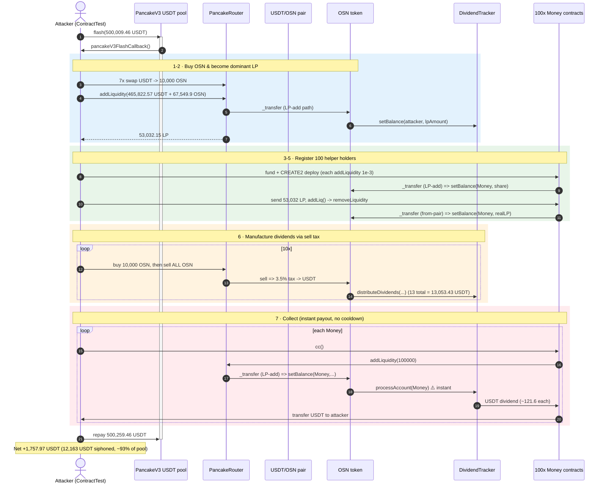
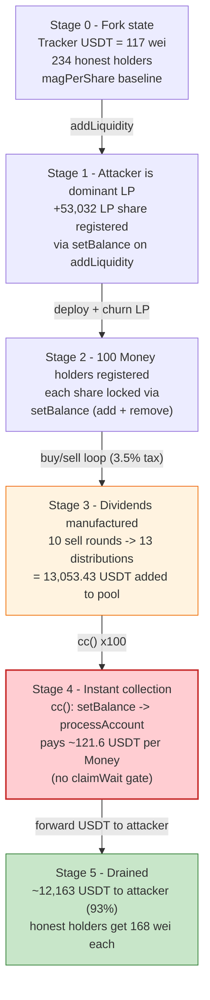
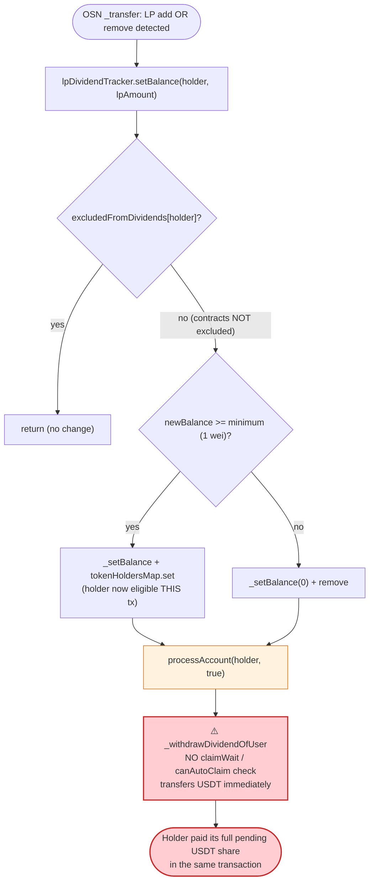

# OSN Exploit — LP-Dividend Farming via Instant `setBalance`→`processAccount` Reward Payout

> **Vulnerability classes:** vuln/logic/reward-calculation · vuln/logic/missing-check

> **Reproduction:** the PoC compiles & runs in an isolated Foundry project at
> [this project folder](.) (the umbrella DeFiHackLabs repo contains many unrelated PoCs
> that do not compile together, so this one was extracted).
> Full verbose trace: [output.txt](output.txt).
> Verified vulnerable source: [sources/OSN_810f4C/OSN.sol](sources/OSN_810f4C/OSN.sol).

---

## Key info

| | |
|---|---|
| **Loss (this tx)** | **+1,757.97 USDT** net to the attacker; **~12,163 USDT** of sell-tax dividends siphoned into attacker-controlled contracts in a single transaction. Total campaign loss across all txs ≈ **$109K** (per SlowMist). |
| **Vulnerable contract** | `OSN` token — [`0x810f4C6AE97BCC66DA5Ae6383CC31BD3670f6d13`](https://bscscan.com/address/0x810f4C6AE97BCC66DA5Ae6383CC31BD3670f6d13#code) (and its `DividendTracker` at `0x8E474Bc29fb9a884b1fc297B0b4BBC465700a571`) |
| **Victim pool / dividend source** | USDT/OSN PancakeSwap-V2 pair `0x4EEDdCc7C8714A684311F8b01154B5686A0f612f`; sell-tax USDT routed to the `DividendTracker` |
| **Flash-loan source** | PancakeSwap-V3 USDT pool `0x46Cf1cF8c69595804ba91dFdd8d6b960c9B0a7C4` (`flash()`) |
| **Attacker EOA** | `0x835b45d38cbdccf99e609436ff38e31ac05bc502` |
| **Attacker contract (this PoC)** | the test contract `ContractTest` + 100 CREATE2 `Money` helper contracts |
| **Attack tx** | [`0xc7927a68464ebab1c0b1af58a5466da88f09ba9b30e6c255b46b1bc2e7d1bf09`](https://app.blocksec.com/explorer/tx/bsc/0xc7927a68464ebab1c0b1af58a5466da88f09ba9b30e6c255b46b1bc2e7d1bf09) (one of three; setup txs are `0xbf22eabb…`, `0x69c64b22…`) |
| **Chain / block / date** | BSC / 38,474,365 / May 5, 2024 |
| **Compiler** | OSN: Solidity v0.8.19, optimizer 200 runs |
| **Bug class** | Reward-distribution accounting flaw — dividend eligibility granted instantly on LP-add with no hold-time / EOA-only / cooldown check, paid out immediately |

---

## TL;DR

`OSN` is a "reflection / dividend" token: a **3.5% sell tax** is swapped to USDT and distributed pro-rata to
liquidity providers through a `DividendTracker`. A holder's dividend entitlement is updated by the token's
`_transfer` whenever liquidity is added or removed — by calling
`lpDividendTracker.setBalance(holder, lpAmount)`
([OSN.sol:1626-1631](sources/OSN_810f4C/OSN.sol#L1626-L1631),
[:1642-1644](sources/OSN_810f4C/OSN.sol#L1642-L1644)).

The flaw: `DividendTracker.setBalance()` updates the holder's share **and then calls
`processAccount()` immediately** ([OSN.sol:2087-2102](sources/OSN_810f4C/OSN.sol#L2087-L2102)). That direct
payout path is **not gated by `claimWait`/`canAutoClaim`** (only the iterating `process()` loop is), the
tracker **does not exclude contracts**, and there is **no minimum LP hold time**. So any address — including a
freshly-created contract — can:

1. add liquidity (or remove liquidity) to register itself as a dividend holder,
2. become eligible **in the same transaction**, and
3. collect its proportional share of all pending USDT dividends **instantly**.

The attacker flash-borrowed **500,009.46 USDT**, became the dominant LP holder, **manufactured the dividends
itself** by churning buy→sell→buy through the 3.5% sell tax, and spread the LP across **100 helper contracts**
so each registered as a holder and collected its slice. The 100 contracts captured **~12,163 of the ~13,053 USDT
(≈93%)** that the attacker's own sells generated, then forwarded it to the attacker. After repaying the flash
loan (+250 USDT fee) and absorbing swap costs, the net for this single tx was **+1,757.97 USDT**.

---

## Background — what OSN does

`OSN` ([source](sources/OSN_810f4C/OSN.sol)) is a fee-on-transfer ERC20 with an LP-reward ("dividend") system,
modeled on the common SafeMoon/BABYTOKEN reflection pattern:

- **Buy / sell tax.** `_transfer` charges `buyFees`/`sellFees` = **35 / 1000 = 3.5%** on AMM trades
  ([OSN.sol:1493-1494](sources/OSN_810f4C/OSN.sol#L1493-L1494),
  [:1681-1701](sources/OSN_810f4C/OSN.sol#L1681-L1701)). On sells, a time-tiered extra `sellAmount`
  (12%/4%/6%/8% of the trade depending on age) is also swapped.
- **Dividend funding.** Accumulated tax tokens are swapped to **USDT** and pushed to the `DividendTracker`,
  which calls `distributeDividends()` to bump `magnifiedDividendPerShare`
  ([OSN.sol:1853-1874](sources/OSN_810f4C/OSN.sol#L1853-L1874),
  [:1282-1293](sources/OSN_810f4C/OSN.sol#L1282-L1293)).
- **Dividend tracking.** The `DividendTracker` is a non-transferable share token. Each LP's "share" equals the
  LP amount the OSN token reports for it via `setBalance`. `accumulativeDividendOf = magnifiedDividendPerShare *
  share / magnitude` ([OSN.sol:1357-1366](sources/OSN_810f4C/OSN.sol#L1357-L1366)). Dividends are paid in USDT
  by `_withdrawDividendOfUser` ([OSN.sol:1303-1325](sources/OSN_810f4C/OSN.sol#L1303-L1325)).

On-chain state at the fork block (read via `cast`):

| Parameter | Value |
|---|---|
| USDT/OSN pair (`0x4EEDdCc7…`) `token0 / token1` | USDT / OSN |
| Pair reserves (USDT / OSN) | **324,960.06 USDT / 737,117.99 OSN** |
| `DividendTracker` | `0x8E474Bc29fb9a884b1fc297B0b4BBC465700a571` |
| Tracker USDT balance (pending dividends) | **117 wei** (≈ 0 — dividends are made *during* the attack) |
| Tracker `totalSupply` (dividend-eligible shares) | 388,040.23 |
| Tracker holders | 234 |
| `minimumTokenBalanceForDividends` | **1 wei** (a 1-wei LP position registers as a holder) |
| `claimWait` | 3600 s |
| `sellFees` | 35 / 1000 = **3.5%** |

Two facts make the whole thing exploitable: dividends are paid **in USDT, instantly on `setBalance`**, and the
minimum holder threshold is **1 wei**. The attacker does not need to wait for anyone else's sells — it can
generate the dividend pool itself and then immediately scoop its own (dominant) share.

---

## The vulnerable code

### 1. LP add/remove instantly grants dividend eligibility (no hold time, contracts allowed)

In OSN `_transfer`, adding liquidity through the router sets the provider's tracker balance to its `lpAmount`,
and removing liquidity resets `to`'s balance to its real pair balance — both call `setBalance` with no checks
on *who* the provider is or *how long* it has held:

```solidity
// add liquidity → register/raise dividend share
if (to == uniswapV2Pair && address(uniswapV2Router) == msg.sender) {
    addLPLiquidity = _isAddLiquidity(amount);
    if (addLPLiquidity > 0) {
        isAddLP = true;
        userInfo = _userInfo[from];
        userInfo.lpAmount += addLPLiquidity;
        try lpDividendTracker.setBalance(payable(from), userInfo.lpAmount) {} catch {} // ← no EOA/hold-time gate
    }
}
// remove liquidity → reset dividend share to current LP balance
if (from == uniswapV2Pair) {
    removeLPLiquidity = _strictCheckBuy(amount);
    if (removeLPLiquidity > 0) {
        ...
        uint256 blp = IUniswapV2Pair(uniswapV2Pair).balanceOf(to);
        _userInfo[to].lpAmount = blp;
        try lpDividendTracker.setBalance(payable(to), blp) {} catch {}               // ← same
    }
}
```
([OSN.sol:1620-1646](sources/OSN_810f4C/OSN.sol#L1620-L1646))

### 2. `setBalance` pays out the dividend **immediately**, bypassing `claimWait`

```solidity
function setBalance(address payable account, uint256 newBalance) external onlyOwner {
    if (excludedFromDividends[account]) { return; }
    if (newBalance >= minimumTokenBalanceForDividends) {   // minimum = 1 wei
        _setBalance(account, newBalance);
        tokenHoldersMap.set(account, newBalance);
    } else {
        _setBalance(account, 0);
        tokenHoldersMap.remove(account);
    }
    processAccount(account, true);   // ⚠️ unconditional instant payout — NOT gated by canAutoClaim/claimWait
}
```
([OSN.sol:2087-2102](sources/OSN_810f4C/OSN.sol#L2087-L2102))

Contrast with the iterating `process()` loop, which *does* respect the cooldown
([OSN.sol:2104-2149](sources/OSN_810f4C/OSN.sol#L2104-L2149)) via
`canAutoClaim` ([OSN.sol:2079-2085](sources/OSN_810f4C/OSN.sol#L2079-L2085)). The direct `setBalance → processAccount`
path skips that check entirely, and `processAccount` simply pays `_withdrawDividendOfUser` and stamps
`lastClaimTimes` ([OSN.sol:2151-2165](sources/OSN_810f4C/OSN.sol#L2151-L2165)).

### 3. The dividend is paid in real USDT

```solidity
function _withdrawDividendOfUser(address payable user) internal returns (uint256) {
    uint256 _withdrawableDividend = withdrawableDividendOf(user);
    if (_withdrawableDividend > 0) {
        withdrawnDividends[user] = withdrawnDividends[user].add(_withdrawableDividend);
        bool success = IERC20(USDT).transfer(user, _withdrawableDividend);   // ← USDT out
        ...
    }
}
```
([OSN.sol:1303-1325](sources/OSN_810f4C/OSN.sol#L1303-L1325))

---

## Root cause — why it was possible

A dividend/reflection token is only safe if reward eligibility tracks **genuine, sustained** liquidity
provision. OSN's tracker violated that in three compounding ways:

1. **Instant eligibility + instant payout.** `setBalance` (called on every LP add/remove) updates the share and
   *immediately* `processAccount`s the dividend, **without** the `claimWait`/`canAutoClaim` cooldown that gates
   the auto-`process()` loop. An address can add liquidity and collect a proportional cut of the pending
   dividend pool in the same call.
2. **No "hold time" and no contract exclusion.** Nothing requires the LP to be held for any period, and the
   tracker never excludes contracts (`excludedFromDividends` is admin-only and was not set for the attacker).
   The PoC's `Money` contracts each become eligible the instant they touch liquidity. This is exactly the
   header's note: *"Distribution contract did not check the LP hold time or whether the receiver is a contract
   or not."*
3. **The reward pool is attacker-fundable and the threshold is 1 wei.** Because dividends come from the **sell
   tax**, the attacker can *manufacture* them by churning trades, and because `minimumTokenBalanceForDividends`
   is **1 wei**, the attacker can register an arbitrary number of holder accounts (100 `Money` contracts) to
   maximize its slice of `magnifiedDividendPerShare`. Splitting across 100 contracts also dodges the per-holder
   `claimWait` that would otherwise block a single account from re-claiming on every distribution round.

The result: the attacker is effectively the LP that owns ~93% of the tracker's shares during the attack, so ~93%
of every sell-tax USDT distribution flows straight back to it — while the cost of generating those dividends is
only the AMM swap slippage and the small fraction leaking to the 234 honest holders (168 wei each) and the
market wallet.

---

## Preconditions

- A funded dividend system that pays in a liquid asset (USDT) and grants/settles eligibility on LP
  add/remove (`setBalance → processAccount`) with no cooldown on that path. ✓
- `minimumTokenBalanceForDividends` small enough that cheap, throwaway LP positions register as holders (1 wei). ✓
- The reward pool is fundable by the attacker's own activity (sell tax) so it doesn't depend on third-party
  volume. ✓
- Working capital to dominate the LP share and to push enough sells through the tax. Supplied here by a
  **PancakeSwap-V3 flash loan of 500,009.46 USDT** (fee 250.00 USDT), fully repaid intra-transaction — hence
  the attack is essentially capital-free.

---

## Attack walkthrough (with on-chain numbers from the trace)

All figures are taken from [output.txt](output.txt). The attack body runs inside
`pancakeV3FlashCallback` ([test/OSN_exp.sol:50-110](test/OSN_exp.sol#L50)).

| # | Step | Concrete numbers (from trace) |
|---|------|-------------------------------|
| 0 | **Flash-borrow USDT** from PancakeV3 pool `0x46Cf1cF8` ([:46](test/OSN_exp.sol#L46)) | borrow **500,009.46 USDT**, fee **250.00 USDT** ([output.txt:16,24](output.txt#L16)) |
| 1 | **Buy OSN** — 7× `swapTokensForExactTokens(10,000 OSN)` ([:55-61](test/OSN_exp.sol#L55)) | acquire 70,000 OSN; USDT left = **465,822.57** |
| 2 | **Add liquidity** USDT+OSN → become the dominant LP holder ([:65-67](test/OSN_exp.sol#L65)) | add **465,822.57 USDT + 67,549.9 OSN** → receive **53,032.15 LP**; OSN's `_transfer` LP-add path `setBalance`s the attacker ([output.txt:7-8](output.txt#L7)) |
| 3 | **Seed 100 helpers** — transfer 1e-3 USDT + 1e-3 OSN to 100 precomputed CREATE2 addresses ([:73-78](test/OSN_exp.sol#L73)) | 100 `Money` addresses funded with dust |
| 4 | **Deploy 100 `Money` contracts** — each constructor `addLiquidity(100000,100000)` registers it as a tracker holder ([:81](test/OSN_exp.sol#L81), [Money:167-173](test/OSN_exp.sol#L167)) | 100 fresh contracts now hold tiny LP and are dividend-eligible |
| 5 | **Move the big LP into helpers** — for each: transfer 53,032 LP, call `addLiq()` which `removeLiquidity(35,524)` then returns the LP ([:85-90](test/OSN_exp.sol#L85), [Money:175-180](test/OSN_exp.sol#L175)) | each `removeLiquidity` triggers OSN's from-pair `setBalance(Money, realLPbalance)` → Money's share is locked in |
| 6 | **Manufacture dividends** — 10× (buy 10,000 OSN, then sell **all** OSN back) ([:94-100](test/OSN_exp.sol#L94)) | each sell pays the **3.5% sell tax** → swapped to USDT → `distributeDividends`. **13 distributions, total 13,053.43 USDT** ([output.txt:12227-13541](output.txt#L12227)) |
| 7 | **Collect** — for each `Money`, call `cc()` → `addLiquidity(100000)` triggers `setBalance → processAccount` paying the Money its dividend; Money forwards USDT to attacker ([:101-107](test/OSN_exp.sol#L101), [Money:182-185](test/OSN_exp.sol#L182)) | each Money collects ~**116.89 USDT** (addLiq-triggered) + ~**4.74 USDT** (cc) ≈ **121.6 USDT**; **100 contracts → ~12,163.42 USDT** captured ([output.txt:13977+](output.txt#L13977)) |
| 8 | **Repay flash** — `USDT.transfer(pool, borrow + fee)` ([:109](test/OSN_exp.sol#L109)) | repay **500,259.46 USDT** |

Honest holders received only **168 wei each** per distribution via the auto-`process()` loop, and the
market wallet took its 4/7 cut of the add-liquidity tax — those, plus AMM slippage and the flash fee, are the
attacker's only costs.

### Why split across 100 contracts?

- **Cooldown evasion.** A single holder is throttled by `claimWait = 3600 s` in the iterating `process()` loop.
  By distributing the LP over 100 *separate* holder accounts and collecting each via its own
  `setBalance → processAccount` (the un-cooled path) plus a fresh `cc()`, the attacker re-claims on every
  distribution round without ever tripping a per-account cooldown.
- **Share maximization.** 100 eligible holders, all attacker-owned, push the attacker's combined slice of
  `magnifiedDividendPerShare` to ~93% of the pool while honest holders are diluted to 168-wei dust.

### Profit accounting (USDT)

| Item | Amount |
|---|---:|
| Flash-borrowed | 500,009.46 |
| Flash fee paid | −250.00 |
| Gross sell-tax dividends generated by attacker's churn | 13,053.43 |
| — captured by the 100 attacker `Money` contracts (≈93%) | 12,163.42 |
| — leaked to 234 honest holders + market wallet | ≈ 890.01 |
| Net swap slippage / tax cost absorbed by attacker | (implicit) |
| **Net attacker USDT after repaying the flash loan** | **+1,757.97** |

Attacker USDT: **0 → 1,757.97** in a single transaction. The disclosed campaign total across all txs was ≈ $109K.

---

## Diagrams

### Sequence of the attack



### State evolution of the dividend tracker



### The flaw inside `setBalance`



---

## Why each magic number

- **`borrow_amount = 500,009.458 USDT`** (`pool.flash`, [:45-46](test/OSN_exp.sol#L45)): sized to dominate the
  USDT side of the pool (reserve ≈ 324,960 USDT) so the attacker becomes by far the largest LP and thus the
  largest dividend-share holder.
- **7× `swapTokensForExactTokens(10,000 OSN)`** ([:55-61](test/OSN_exp.sol#L55)): buy exactly the OSN needed to
  pair against the borrowed USDT for the liquidity add.
- **100 `Money` contracts** ([`helpContractAmount = 100`](test/OSN_exp.sol#L70)): the multiplier that both
  evades the per-account `claimWait` cooldown and maximizes the attacker's slice of `magnifiedDividendPerShare`.
- **`addLiquidity(100000,100000)` in `Money` / `removeLiquidity(35524)` in `addLiq()`**
  ([Money:172,178](test/OSN_exp.sol#L172)): the smallest LP touches that (a) register each `Money` as a holder
  (`minimum = 1 wei`) and (b) re-trigger `setBalance → processAccount` so the dividend is paid out.
- **10 buy/sell rounds** ([:94-100](test/OSN_exp.sol#L94)): the engine that pushes OSN through the **3.5% sell
  tax** to mint the 13,053.43 USDT dividend pool the attacker then reclaims.

---

## Remediation

1. **Decouple `setBalance` from payout.** `setBalance` should only update shares; it must **not** call
   `processAccount`. Settle dividends only through the cooldown-respecting `process()` loop, or require the
   holder to explicitly `claim()` after the cooldown. The instant `setBalance → processAccount` path is the core
   bug.
2. **Enforce a minimum hold time.** Record `firstLpProvideTime` per holder and pay dividends only after a
   minimum holding period (and/or weight rewards by time-held). A position created and dismantled in one
   transaction must earn nothing.
3. **Exclude contracts from dividends by default** (or require an allow-list/EOA check), as the header itself
   notes. Reward farming via throwaway CREATE2 contracts becomes impossible.
4. **Raise `minimumTokenBalanceForDividends`** to a meaningful floor so 1-wei dust positions cannot register as
   holders, defeating the "100 holder accounts" amplification.
5. **Make the reward pool not attacker-fundable in the same tx.** Buffer sell-tax USDT and distribute on a delay
   (e.g., next block / epoch) so an attacker cannot generate *and* immediately reclaim its own dividends within
   one transaction (which also neutralizes the flash-loan vector).
6. **Snapshot shares at distribution time.** Compute each holder's entitlement from a share snapshot taken when
   `distributeDividends` runs, not from the live `balanceOf`, so adding liquidity *after* the tax is collected
   cannot retroactively claim that distribution.

---

## How to reproduce

The PoC was extracted into a standalone Foundry project (the umbrella DeFiHackLabs repo has many unrelated PoCs
that fail to compile under a single `forge build`):

```bash
_shared/run_poc.sh 2024-05-OSN_exp --mt testExploit -vvvvv
```

- RPC: a **BSC archive** endpoint is required (fork block 38,474,365). `foundry.toml` uses
  `https://bsc-mainnet.public.blastapi.io`, which serves historical state at that block. The default public
  OnFinality endpoint rate-limited (HTTP 429) and was swapped out.
- Result: `[PASS] testExploit()` with attacker USDT going from 0 to **1,757.97**.

Expected tail:

```
Ran 1 test for test/OSN_exp.sol:ContractTest
[PASS] testExploit() (gas: 280162338)
Logs:
  [Begin] Attacker USDT before exploit: 0.000000000000000000
  465822571215194760376243 67549900000000000000000
  53032149968871952596029
  [End] Attacker USDT after exploit: 1757.965321175890383526
Suite result: ok. 1 passed; 0 failed; 0 skipped
```

---

*References: SlowMist tweet — https://twitter.com/SlowMist_Team/status/1787330586857861564 ;
BlockSec explorer — attack tx `0xc7927a68…`. Bug class: reward-distribution accounting (no hold-time / no
contract exclusion / instant payout on LP-add).*
