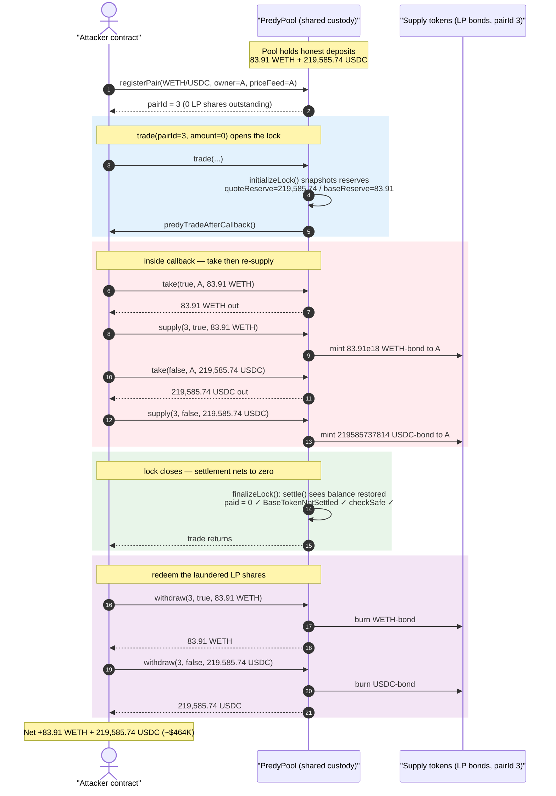
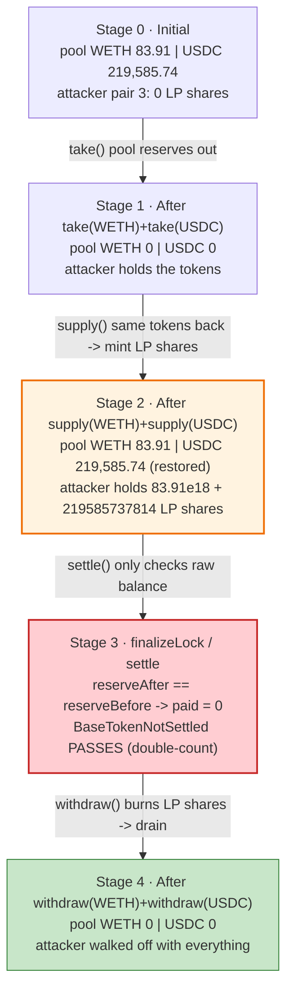
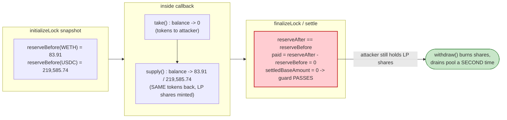

# Predy Finance Exploit — Permissionless Pair Registration + Lock-Settlement Bypass Drains the Shared Pool

> **Reproduction:** the PoC compiles & runs in an isolated Foundry project at
> [this project folder](.) (the umbrella DeFiHackLabs repo contains many unrelated
> PoCs that do not whole-compile under `forge test`, so this one was extracted).
> Full verbose trace: [output.txt](output.txt).
> Verified vulnerable source: [src_PredyPool.sol](sources/PredyPool_7b8b94/src_PredyPool.sol),
> [src_types_GlobalData.sol](sources/PredyPool_7b8b94/src_types_GlobalData.sol).

---

## Key info

| | |
|---|---|
| **Loss** | **~$464K** — 83.91 WETH + 219,585.74 USDC drained from the shared PredyPool |
| **Vulnerable contract** | `PredyPool` (impl) — [`0x7b8b944AB2f24C829504a7a6D70fce5298f2147c`](https://arbiscan.io/address/0x7b8b944ab2f24c829504a7a6d70fce5298f2147c#code) |
| **Pool (proxy / victim)** | `PredyPool` (EIP-173 proxy) — [`0x9215748657319B17fecb2b5D086A3147BFBC8613`](https://arbiscan.io/address/0x9215748657319B17fecb2b5D086A3147BFBC8613) |
| **Attacker EOA** | [`0x76b02ab483482740248e2ab38b5a879a31c6d008`](https://arbiscan.io/address/0x76b02ab483482740248e2ab38b5a879a31c6d008) |
| **Attacker contract** | [`0xb79714634895f52a4f6a75eceb58c96246370149`](https://arbiscan.io/address/0xb79714634895f52a4f6a75eceb58c96246370149) |
| **Attack tx** | [`0xbe163f651d23f0c9e4d4a443c0cc163134a31a1c2761b60188adcfd33178f50f`](https://arbiscan.io/tx/0xbe163f651d23f0c9e4d4a443c0cc163134a31a1c2761b60188adcfd33178f50f) |
| **Chain / fork block / date** | Arbitrum One / 211,107,441 / May 14, 2024 |
| **Compiler** | Solidity v0.8.19, optimizer 200 runs |
| **Bug class** | Broken settlement accounting (take-then-redeposit netting bypass) + permissionless pair registration |

Stolen tokens (from the trace):

- **WETH:** `83910994929830029848` wei = **83.910994929830029848 WETH**
- **USDC:** `219585737814` = **219,585.737814 USDC**

---

## TL;DR

`PredyPool` is a single monolithic contract that custodies **all** assets for **all** trading pairs.
Two design flaws compose into a free, single-transaction drain of the entire pool:

1. **`registerPair()` is permissionless** ([src_PredyPool.sol:109-111](sources/PredyPool_7b8b94/src_PredyPool.sol#L109-L111)).
   Anyone can add a new pair for **any token they like** — including WETH/USDC, the very tokens that
   legitimate depositors already hold inside the shared pool. The new pair starts with an empty
   supply-token ledger (0 LP shares outstanding), but the pool's *real* ERC-20 balance still contains
   everyone else's deposits.

2. **The lock/settlement accounting nets a "take" against a re-deposit instead of against the trade.**
   During a `trade()`, the caller becomes the *locker* and a callback (`predyTradeAfterCallback`) is
   invoked ([src_libraries_logic_TradeLogic.sol:68-86](sources/PredyPool_7b8b94/src_libraries_logic_TradeLogic.sol#L68-L86)).
   Inside that callback the locker may call `take()` to pull tokens out
   ([src_PredyPool.sol:309-311](sources/PredyPool_7b8b94/src_PredyPool.sol#L309-L311)). When the lock
   is finalized, `settle()` only checks the **raw ERC-20 balance of the pool** before vs. after
   ([src_types_GlobalData.sol:88-112](sources/PredyPool_7b8b94/src_types_GlobalData.sol#L88-L112)).
   It does **not** distinguish "tokens still owned by the protocol" from "tokens the locker just took."

The attacker exploits the gap: inside the callback they `take()` the pool's **entire** WETH and USDC
balance, then immediately `supply()` those same tokens back into *their own* freshly-registered pair —
which **mints LP shares to them** for the redeposit and **restores the pool's ERC-20 balance to the
snapshot value**, so `settle()` returns `0` ("nothing was paid out") and `finalizeLock()`'s
`BaseTokenNotSettled` guard is satisfied. After the trade returns, the attacker simply `withdraw()`s
those LP shares, walking off with all the WETH and USDC that belonged to honest users.

---

## Background — what Predy Finance does

Predy V6 is a perpetual / squared-perpetual (Gamma) trading protocol on Arbitrum. The core
`PredyPool` contract ([src_PredyPool.sol](sources/PredyPool_7b8b94/src_PredyPool.sol)):

- Holds a `GlobalData` struct with all pairs, all vaults, and a single `lockData`
  ([src_types_GlobalData.sol:16-24](sources/PredyPool_7b8b94/src_types_GlobalData.sol#L16-L24)).
- Lets liquidity providers `supply()` quote/base tokens to a pair and receive ERC-20 **supply tokens**
  (LP "bonds"); they later `withdraw()` by burning those bonds
  ([src_libraries_logic_SupplyLogic.sol](sources/PredyPool_7b8b94/src_libraries_logic_SupplyLogic.sol)).
- Implements trades through a **flash-accounting lock pattern** (à la Uniswap V4): `trade()` opens a
  lock, calls back into the trader so it can settle margin, then verifies the net token movement and
  the vault's safety before closing the lock.

Because the **same** `PredyPool` instance custodies every pair's tokens in one shared balance, the
integrity of the system rests entirely on the settlement math being correct and on pair registration
being trustworthy. Both assumptions are false.

---

## The vulnerable code

### 1. Pair registration is permissionless and accepts attacker-chosen parameters

```solidity
// src_PredyPool.sol:109
function registerPair(AddPairLogic.AddPairParams memory addPairParam) external returns (uint256) {
    return AddPairLogic.addPair(globalData, allowedUniswapPools, addPairParam);
}
```

`addPair` ([src_libraries_logic_AddPairLogic.sol:53-94](sources/PredyPool_7b8b94/src_libraries_logic_AddPairLogic.sol#L53-L94))
only validates that the supplied `uniswapPool` is a real Uniswap-V3 pool containing the chosen
`marginId` token. It does **not** restrict *who* may register, nor does it prevent registering a pair
whose tokens (WETH/USDC) are already held by the pool on behalf of other pairs. The attacker becomes
`poolOwner` and sets `priceFeed` to their own contract — full control over the new pair.

The only numeric constraint that matters here is `validateRiskParams`
([src_libraries_logic_AddPairLogic.sol:213-218](sources/PredyPool_7b8b94/src_libraries_logic_AddPairLogic.sol#L213-L218)):

```solidity
function validateRiskParams(Perp.AssetRiskParams memory _assetRiskParams) internal pure {
    require(1e8 < _assetRiskParams.riskRatio && _assetRiskParams.riskRatio <= 10 * 1e8, "C0");
    require(_assetRiskParams.rangeSize > 0 && _assetRiskParams.rebalanceThreshold > 0, "C0");
}
```

— which is why the PoC passes `riskRatio: 100_000_001` (the minimum value `> 1e8`).

### 2. The trade lock hands the caller `take()` access, then trusts a raw-balance settlement

```solidity
// src_libraries_logic_TradeLogic.sol:68
function callTradeAfterCallback(...) internal {
    globalData.initializeLock(tradeParams.pairId);            // snapshots pool balances, sets locker = caller

    IHooks(msg.sender).predyTradeAfterCallback(tradeParams, tradeResult);  // ⚠️ attacker code runs here

    (int256 marginAmountUpdate, int256 settledBaseAmount) = globalData.finalizeLock();

    if (settledBaseAmount != 0) {                              // ← the ONLY net-flow check
        revert IPredyPool.BaseTokenNotSettled();
    }
    ...
}
```

```solidity
// src_PredyPool.sol:309
function take(bool isQuoteAsset, address to, uint256 amount) external onlyByLocker {
    globalData.take(isQuoteAsset, to, amount);                // ⚠️ locker can send ANY amount of pool tokens anywhere
}
```

### 3. `initializeLock` / `settle` measure only the pool's raw ERC-20 balance

```solidity
// src_types_GlobalData.sol:35
function initializeLock(GlobalDataLibrary.GlobalData storage globalData, uint256 pairId) internal {
    if (globalData.lockData.locker != address(0)) revert IPredyPool.LockedBy(globalData.lockData.locker);
    globalData.lockData.quoteReserve = ERC20(globalData.pairs[pairId].quotePool.token).balanceOf(address(this));
    globalData.lockData.baseReserve  = ERC20(globalData.pairs[pairId].basePool.token).balanceOf(address(this));
    globalData.lockData.locker = msg.sender;
    globalData.lockData.pairId = pairId;
}

// src_types_GlobalData.sol:88
function settle(GlobalDataLibrary.GlobalData storage globalData, bool isQuoteAsset) internal returns (int256 paid) {
    ...
    uint256 reserveAfter = ERC20(currency).balanceOf(address(this));   // ⚠️ raw balance, not protocol-owned balance
    ...
    paid = reserveAfter.toInt256() - reservesBefore.toInt256();        // 0 if taken-out == supplied-back
}
```

### 4. `supply()` mints LP shares for the redeposit — the laundering step

```solidity
// src_libraries_logic_SupplyLogic.sol:46
function receiveTokenAndMintBond(Perp.AssetPoolStatus storage _pool, uint256 _amount)
    internal returns (uint256 mintAmount)
{
    mintAmount = _pool.tokenStatus.addAsset(_amount);
    ERC20(_pool.token).safeTransferFrom(msg.sender, address(this), _amount);  // tokens flow BACK in
    ISupplyToken(_pool.supplyTokenAddress).mint(msg.sender, mintAmount);      // ⚠️ attacker gets LP shares
}
```

Because the attacker's pair is brand-new (0 shares outstanding), `addAsset` mints 1:1 — they receive
`83.91e18` WETH-bond and `219585737814` USDC-bond, redeemable later via `withdraw()`.

---

## Root cause — why it was possible

The lock-settlement design assumes that any tokens leaving the pool via `take()` are paid back **by the
trader from the trader's own funds** (settling margin), so that the before/after balance delta reflects
a real economic settlement. The implementation conflates two semantically different inflows:

> **Tokens supplied as new LP liquidity are credited the same as tokens repaid to settle a lock.**

`settle()` looks only at `balanceOf(pool)`. It cannot tell the difference between:

- "the trader brought outside money in to settle the trade" (legitimate), and
- "the locker took the pool's money and put the **same pool money** back as an LP deposit" (theft).

In the second case the raw balance is restored, `paid == 0`, the `BaseTokenNotSettled` guard passes —
and yet the attacker now also holds **freshly minted LP shares** entitling them to withdraw the same
tokens again. The pool double-counts: it thinks it was made whole *and* it owes the attacker LP value.

Four concrete decisions compose into the critical bug:

1. **Single shared custody.** All pairs' tokens live in one balance, so a *new* pair the attacker
   controls can `take()` and re-`supply()` tokens that belong to *other* pairs' depositors.
2. **Permissionless `registerPair`.** The attacker can create a pair whose tokens are exactly the ones
   already sitting in the pool, with themselves as `poolOwner` and a self-controlled `priceFeed`.
3. **`take()` is unbounded for the locker.** It transfers any amount of any pool token to any address,
   with no per-trade or per-vault accounting cap.
4. **Settlement is balance-based, not provenance-based.** `supply()` (which mints LP shares) restores
   the balance that `take()` reduced, netting the theft to zero in the settlement check.

The vault safety check (`PositionCalculator.checkSafe`,
[src_libraries_PositionCalculator.sol:47-72](sources/PredyPool_7b8b94/src_libraries_PositionCalculator.sol#L47-L72))
is irrelevant here: the attacker's vault has no open position (`tradeAmount = 0`), so
`minMargin = 0`, `vault.margin = 0`, and `isSafe` is trivially `true`. The PoC comments about
"bypassing checkSafe" really describe satisfying these trivial guards while the real value leaves
through `take` → `supply` → `withdraw`.

---

## Preconditions

- The pool holds non-trivial WETH/USDC balances from legitimate pairs/depositors (at the fork block:
  ≥ 83.91 WETH and ≥ 219,585.74 USDC — these were the realized loot).
- `registerPair` accepts the WETH/USDC Uniswap-V3 pool (`0xC6962004f452bE9203591991D15f6b388e09E8D0`,
  the canonical WETH/USDC 0.05% pool) — it does, since it is a valid factory pool.
- No capital is required from the attacker. The "supplied" tokens are the very tokens just `take()`-n
  from the pool; the operation is self-funding within a single transaction (no flash loan needed).

---

## Attack walkthrough (with on-chain numbers from the trace)

All figures are taken directly from the calls/events in [output.txt](output.txt). The pool snapshot
(`initializeLock`) read **83.910994929830029848 WETH** and **219,585.737814 USDC** as the pool's
balances; those are exactly the amounts subsequently drained.

| # | Step (entry point) | What happens | WETH moved | USDC moved |
|---|--------------------|--------------|-----------:|-----------:|
| 0 | **`registerPair(WETH/USDC pair)`** | Attacker registers **pairId 3** for WETH(base)/USDC(quote), `poolOwner = attacker`, `priceFeed = attacker`, `riskRatio = 1e8+1`. New pair has 0 LP shares. | — | — |
| 1 | **`trade(pairId=3, vaultId=0, amount=0)`** | Creates vault 185, opens the lock (`initializeLock` snapshots pool reserves), then calls back into the attacker. | — | — |
| 2 | callback → **`take(true, attacker, 83.91 WETH)`** | Locker pulls the pool's entire WETH balance out to the attacker contract. | −83.910994… (out) | — |
| 3 | callback → **`supply(3, true, 83.91 WETH)`** | Attacker re-deposits the **same** WETH into their pair; pool balance restored; LP token `0x3Dd6…aba2` mints `83.91e18` shares to attacker. | +83.910994… (in) | — |
| 4 | callback → **`take(false, attacker, 219,585.74 USDC)`** | Locker pulls the pool's entire USDC balance out. | — | −219,585.737814 (out) |
| 5 | callback → **`supply(3, false, 219,585.74 USDC)`** | Re-deposit; pool balance restored; LP token `0x0b9F…599F` mints `219585737814` shares. | — | +219,585.737814 (in) |
| 6 | `finalizeLock()` | `settle(quote)` and `settle(base)` both see `reserveAfter == reserveBefore` → `paid = 0`, `settledBaseAmount = 0` → **`BaseTokenNotSettled` guard passes.** `checkSafe` passes (empty vault). Trade returns. | net 0 | net 0 |
| 7 | **`withdraw(3, true, 83.91 WETH)`** | Burns the WETH LP shares, transfers `83.910994… WETH` to attacker. | −83.910994… (to attacker) | — |
| 8 | **`withdraw(3, false, 219,585.74 USDC)`** | Burns the USDC LP shares, transfers `219,585.737814 USDC` to attacker. | — | −219,585.737814 (to attacker) |

After step 8 the pool's WETH and USDC reserves for these tokens are **0** and the attacker holds all of
it. The PoC's `balanceLog` records the USDC leg:

```
Attacker Before exploit USDC Balance: 0.000000
Attacker After  exploit USDC Balance: 219585.737814
```

### Profit / loss accounting

| Asset | Pool before | Pool after | Attacker gain |
|---|---:|---:|---:|
| WETH | 83.910994929830029848 | 0 | **+83.910994929830029848 WETH** |
| USDC | 219,585.737814 | 0 | **+219,585.737814 USDC** |
| **USD value** | | | **≈ $464K** (per the disclosed loss) |

The attacker contributed **no external capital**: every token "supplied" in steps 3 and 5 was first
`take()`-n from the pool in steps 2 and 4. The net cost is gas only.

---

## Diagrams

### Sequence of the attack



### Pool / settlement state evolution



### Why settlement nets the theft to zero



---

## Remediation

1. **Track protocol-owned balances, not raw ERC-20 balances, in settlement.** `settle()` must compare
   the *protocol's accounting of owed/owned tokens* before and after the lock, not `balanceOf(this)`.
   With provenance tracking, a `take()` that is "repaid" by minting the locker new LP shares would not
   net to zero — the LP mint should *not* count as settlement.
2. **Forbid `supply()`/`withdraw()` while a lock is active** (or while `msg.sender == locker`). The
   laundering step requires re-depositing inside the trade callback; blocking liquidity operations
   during a lock removes the netting trick entirely. Apply a `whenNotLocked` modifier to `supply`,
   `withdraw`, and `take`'s sibling flows that should not interleave with settlement.
3. **Gate `registerPair()`.** Pair creation that grants `take()`-reachable custody over shared pool
   assets must be permissioned (operator/governance), or new pairs must use **segregated** token
   custody so a new pair can never `take()` tokens belonging to existing pairs.
4. **Segregate custody per pair.** A pair should only be able to move tokens that were supplied *to
   that pair*. A monolithic shared balance means any single broken pair can drain all others.
5. **Bound `take()` by the locker's actual obligations.** The amount a locker may `take()` should be
   capped by the vault's/trade's computed entitlement, not left as an arbitrary transfer of any pool
   token to any recipient.

---

## How to reproduce

The PoC was extracted into a standalone Foundry project (the umbrella DeFiHackLabs repo has many
unrelated PoCs that fail to compile under `forge test`'s whole-project build):

```bash
_shared/run_poc.sh 2024-05-PredyFinance_exp -vvvvv
```

- RPC: an **Arbitrum archive** endpoint is required (fork block 211,107,441). `foundry.toml` uses an
  Infura Arbitrum archive endpoint, which serves historical state at that block.
- Result: `[PASS] testExploit()` with the attacker's post-exploit USDC balance = **219,585.737814**.

Expected tail:

```
  Attacker Before exploit USDC Balance: 0.000000
  Attacker After exploit USDC Balance: 219585.737814

Suite result: ok. 1 passed; 0 failed; 0 skipped
Ran 1 test suite ... 1 tests passed, 0 failed, 0 skipped (1 total tests)
```

---

*Reference: Predy Finance, Arbitrum, May 14 2024, ~$464K. PoC header: see [test/PredyFinance_exp.sol](test/PredyFinance_exp.sol).*
