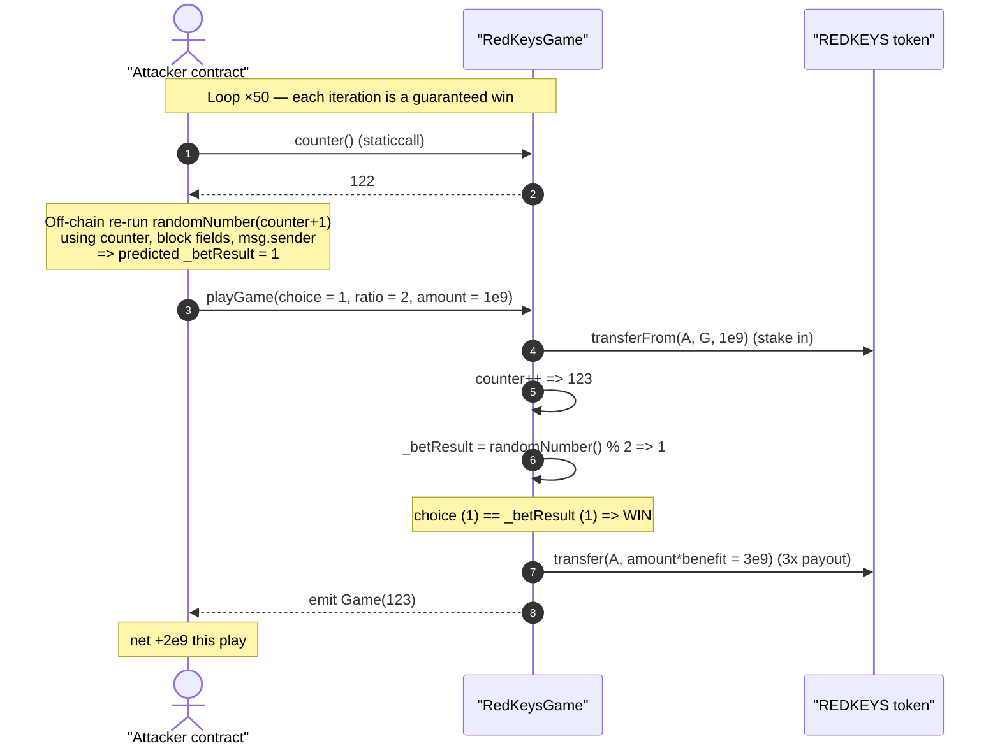
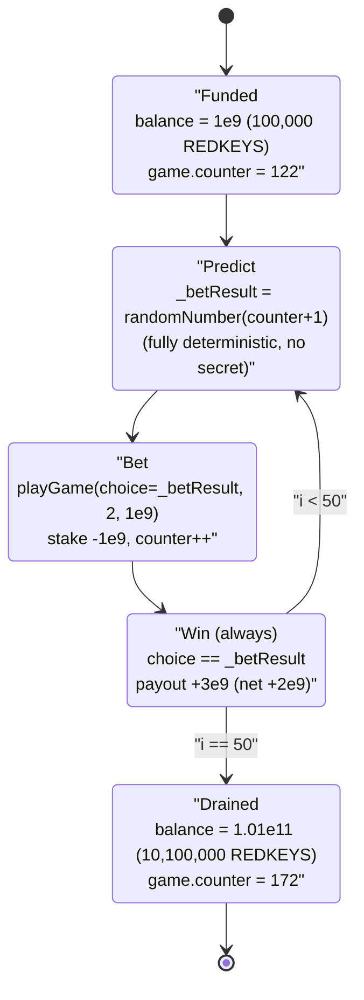
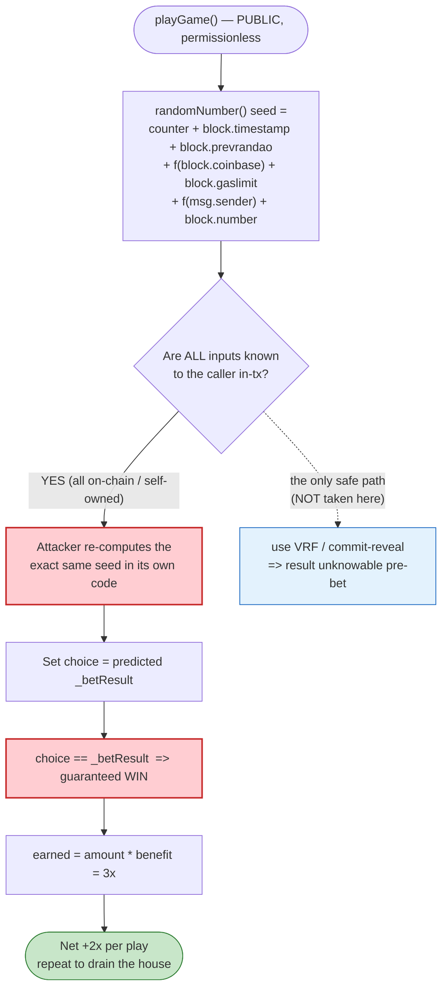

# RedKeys Game Exploit — Predictable On-Chain "Randomness" Lets the Player Always Win

> **Reproduction:** the PoC compiles & runs in an isolated Foundry project at
> [this project folder](.) (the umbrella DeFiHackLabs repo contains many
> unrelated PoCs that do not whole-compile, so this one was extracted).
> Full verbose trace: [output.txt](output.txt).
> Verified vulnerable source: [RedKeysGame.sol](sources/RedKeysGame_71e305/RedKeysGame.sol).

---

## Key info

| | |
|---|---|
| **Loss** | ~$12K — house bankroll of the `RedKeysGame` contract drained in REDKEYS |
| **Vulnerable contract** | `RedKeysGame` — [`0x71e3056aa4985de9f5441f079E6C74454A3C95f0`](https://bscscan.com/address/0x71e3056aa4985de9f5441f079E6C74454A3C95f0#code) |
| **House / victim** | `RedKeysGame` itself (holds the betting pool of REDKEYS) |
| **Game token** | `REDKEYS` — [`0x00e62b6CCf1fe3e5E01CE07F6232d7F378518b6b`](https://bscscan.com/address/0x00e62b6CCf1fe3e5E01CE07F6232d7F378518b6b#code) (4 decimals) |
| **Attacker EOA** | [`0x36a6135672035507b772279d99a9f7445f2d1601`](https://bscscan.com/address/0x36a6135672035507b772279d99a9f7445f2d1601) |
| **Attacker contract** | [`0x471038827c05c87c23e9dba5331c753337fd918b`](https://bscscan.com/address/0x471038827c05c87c23e9dba5331c753337fd918b) |
| **Attack tx** | [`0x8d5fb97b35b830f8addcf31c8e0c6135f15bbc2163d891a3701ada0ad654d427`](https://bscscan.com/tx/0x8d5fb97b35b830f8addcf31c8e0c6135f15bbc2163d891a3701ada0ad654d427) |
| **Chain / block / date** | BSC / 39,079,951 / May 27, 2024 |
| **Compiler** | Solidity v0.8.19, optimizer **1 run** |
| **Bug class** | Weak / predictable PRNG (insecure on-chain randomness) |

---

## TL;DR

`RedKeysGame` is an on-chain coin-flip casino. You call
[`playGame(choice, ratio, amount)`](sources/RedKeysGame_71e305/RedKeysGame.sol#L165-L208),
stake some REDKEYS, and if your `choice` matches the game's "random" `_betResult` you get paid
`amount * benefit` (for `ratio = 2`, `benefit = 3`, i.e. a 3× payout).

The catch: the "random" result is produced by
[`randomNumber()`](sources/RedKeysGame_71e305/RedKeysGame.sol#L210-L229), which derives its seed
**entirely from on-chain values that are known (or controllable) at call time** —
`counter`, `block.timestamp`, `block.prevrandao`, `block.coinbase`, `block.gaslimit`, `msg.sender`,
and `block.number`. There is no oracle, no commit-reveal, no VRF.

A contract calling `playGame` in the **same transaction** can simply re-execute the identical seed
formula off-chain (inside its own bytecode) to compute `_betResult` *before* it bets, then pass that
exact value as `choice`. The result is a casino where the attacker wins **100% of the time**.

The PoC does exactly this in a loop of 50 winning bets, turning a 1e9-raw (100,000 REDKEYS) bankroll
into 1.01e11 raw (10,100,000 REDKEYS) — a net **+10,000,000 REDKEYS** profit, all extracted from the
game contract's house funds.

```
Attacker Before exploit REDKEYS Balance: 100000.0000
Attacker After  exploit REDKEYS Balance: 10100000.0000
```

---

## Background — what RedKeysGame does

`RedKeysGame` ([source](sources/RedKeysGame_71e305/RedKeysGame.sol)) is a simple PvH ("player vs.
house") gambling contract for the `REDKEYS` token:

- The constructor pre-loads a table of payout ratios via
  [`setRatio`](sources/RedKeysGame_71e305/RedKeysGame.sol#L130-L143):
  `setRatio(2, 3)`, `setRatio(3, 5)`, `setRatio(5, 7)`, … So betting at `ratio = 2` (a coin flip,
  result space `{0, 1}`) pays `benefit = 3`.
- A player calls `playGame(choice, ratio, amount)`:
  - Bet bounds are enforced: `amount ∈ [MIN_AMOUNT = 10**5, MAX_AMOUNT = 10**9]`
    ([:101-102](sources/RedKeysGame_71e305/RedKeysGame.sol#L101-L102),
    [:175](sources/RedKeysGame_71e305/RedKeysGame.sol#L175)).
  - `choice < 2` is required ([:173](sources/RedKeysGame_71e305/RedKeysGame.sol#L173)).
  - The stake is pulled in with `transferFrom`
    ([:177](sources/RedKeysGame_71e305/RedKeysGame.sol#L177)).
  - `counter` is incremented, a 1% marketing fee is accrued, and the "random" result is computed
    ([:179-182](sources/RedKeysGame_71e305/RedKeysGame.sol#L179-L182)).
  - **Win** (`choice == _betResult`): the contract pays `earned = amount * benefit`
    ([:195-201](sources/RedKeysGame_71e305/RedKeysGame.sol#L195-L201)).
  - **Loss**: the contract burns `amount / ratio`
    ([:202-204](sources/RedKeysGame_71e305/RedKeysGame.sol#L202-L204)).

The house edge is supposed to come from the fact that a fair coin flip wins only ~50% of the time
while paying 3×… but only if the flip is actually fair. It is not.

On-chain facts at the fork block (read from the trace):

| Fact | Value |
|---|---|
| REDKEYS decimals | **4** |
| `counter` at start of attack | **122** (the PoC ran 50 plays, ending at 172) |
| `ratios[2]` (benefit for a coin flip) | **3** ⇒ 3× payout |
| Attacker starting bankroll | **1e9 raw = 100,000 REDKEYS** (= `MAX_AMOUNT`) |
| Burn (loss) path hit | **0 times** — every single bet won |

---

## The vulnerable code

### 1. The "random" result is a pure function of known on-chain inputs

```solidity
function randomNumber() internal view returns (uint256) {
    uint256 seed = uint256(
        keccak256(
            abi.encodePacked(
                counter +
                    block.timestamp +
                    block.prevrandao +
                    ((uint256(keccak256(abi.encodePacked(block.coinbase)))) / (block.timestamp)) +
                    block.gaslimit +
                    ((uint256(keccak256(abi.encodePacked(msg.sender)))) / (block.timestamp)) +
                    block.number
            )
        )
    );
    return (seed - ((seed / 1000) * 1000)); // seed % 1000
}
```
[RedKeysGame.sol:210-229](sources/RedKeysGame_71e305/RedKeysGame.sol#L210-L229)

Every term in this seed is a value an attacking contract can read **inside the same transaction**:

| Seed input | Why it's known/controllable to the caller |
|---|---|
| `counter` | A public state variable: `game.counter()` ([:106](sources/RedKeysGame_71e305/RedKeysGame.sol#L106)). |
| `block.timestamp`, `block.number`, `block.prevrandao`, `block.gaslimit`, `block.coinbase` | Block context — identical for every call in the same block/tx; readable from the attacker's own code. |
| `msg.sender` | The attacker's own contract address — a known constant. |

Because nothing here is secret or external, the function is **deterministic and locally
re-computable**. There is no VRF, no Chainlink oracle, no future-block commit-reveal.

### 2. The result is consumed immediately, in the same call

```solidity
function playGame(uint16 choice, uint16 ratio, uint256 amount) external nonReentrant {
    uint16 benefit = ratios[ratio];
    require(choice < 2, "Wrong Choice");
    require(benefit > 0, "Wrong Ratio");
    require(amount >= MIN_AMOUNT && amount <= MAX_AMOUNT, "Not in Range");

    redKeysToken.transferFrom(msg.sender, address(this), amount);

    counter++;                                              // ← counter is bumped FIRST
    marketingFeeTotal += (amount * marketingFeeRatio) / DIVIDER;

    uint16 _betResult = uint16(randomNumber()) % ratio;    // ← then randomness is drawn

    bets[counter] = Bet(...);

    if (choice == _betResult) {
        uint256 earned = amount * benefit;                 // ratio 2 ⇒ benefit 3 ⇒ 3× payout
        redKeysToken.transfer(msg.sender, earned);
        earnings[msg.sender] += earned;
        totalEarnings += earned;
    } else {
        redKeysToken.burn(amount / ratio);
    }
    ...
}
```
[RedKeysGame.sol:165-208](sources/RedKeysGame_71e305/RedKeysGame.sol#L165-L208)

Note the ordering: `counter++` runs at [:179](sources/RedKeysGame_71e305/RedKeysGame.sol#L179)
**before** `randomNumber()` reads `counter` at
[:182](sources/RedKeysGame_71e305/RedKeysGame.sol#L182). So a caller that observes
`game.counter() == N` must compute the seed using `counter = N + 1`. The PoC handles this exactly:
it reads `counter` and predicts with `randomNumber(counter + 1)`
([RedKeysCoin_exp.sol:49-52](test/RedKeysCoin_exp.sol#L49-L52)).

---

## Root cause — why it was possible

The single root cause is **using predictable on-chain data as a randomness source for a gambling
payout**.

A secure randomness scheme for a casino must make the result *impossible for the player to know
before they commit their bet*. This contract does the opposite: the result is a deterministic
function of inputs the player can read in the very same transaction. Concretely:

1. **No external entropy.** All seed inputs (`counter`, block fields, `msg.sender`) are on-chain and
   read-accessible. There is no oracle/VRF and no information the contract has that the caller does
   not also have.
2. **Same-transaction draw-and-settle.** The randomness is drawn and the bet is settled in one atomic
   `playGame` call. An attacking contract can therefore compute `_betResult` first and pass it as
   `choice`, guaranteeing `choice == _betResult`.
3. **3× payout on a 2-outcome game.** With a guaranteed win, each `ratio = 2` bet returns `3 × amount`
   for a `1 × amount` stake — a **net +2× profit every play**. Repeating drains the house.
4. **`msg.sender` in the seed is irrelevant as a defense.** Including `msg.sender` does not add
   secrecy — the attacker knows its own address, so it just plugs it into the same formula. (The PoC
   uses `address(this)`, which *is* the `msg.sender` seen by `playGame` because the test contract
   calls the game directly.)

The `nonReentrant` guard, `Ownable`, and bet-bound checks are all irrelevant here — the exploit is a
straightforward "I can compute the dice before I roll them."

---

## Preconditions

- The game contract holds enough REDKEYS to pay out winnings (it was the house and held the betting
  pool).
- `ratios[2] > 0` so a coin-flip bet is accepted (true — set to 3 in the constructor).
- The attacker can call `playGame` from a contract (so it can compute the seed in the same tx) — no
  special permission needed; the function is fully permissionless.
- Working REDKEYS capital of at least one stake (the PoC starts with `1e9 = MAX_AMOUNT` and lets
  winnings compound the bankroll). In the live attack the attacker recycled its own winnings the same
  way.

No flash loan or price manipulation is required — the entire edge is the predictable RNG.

---

## Attack walkthrough (with on-chain numbers from the trace)

Each loop iteration is identical: read the counter, predict the flip, bet the prediction, win 3×.
The numbers below come directly from [output.txt](output.txt).

| # | Step | On-chain detail |
|---|------|-----------------|
| 0 | **Setup** | Attacker funded with `1e9` REDKEYS (100,000); approves `RedKeysGame` for `type(uint256).max`. |
| 1 | **Read counter** | `game.counter()` ⇒ `122` (first iteration). |
| 2 | **Predict result** | Off-chain re-compute `randomNumber(122 + 1)` ⇒ predicted `_betResult` (here `1`). |
| 3 | **Bet the prediction** | `playGame(choice = 1, ratio = 2, amount = 1e9)`: pulls in `1e9` via `transferFrom`. |
| 4 | **Win paid** | `counter++` → 123; `_betResult` computed on-chain matches `choice` ⇒ `earned = 1e9 * 3 = 3e9` transferred back to attacker. `emit Game(123)`. Net for this play: `+2e9`. |
| 5 | **Repeat ×50** | Counter walks `122 → 172`; every iteration the predicted `choice` equals the on-chain `_betResult`, so the loss/`burn` branch is **never** taken (0 burn calls in the trace). |
| 6 | **Cash out** | After 50 wins the attacker holds `1.01e11` raw = **10,100,000 REDKEYS**. |

**Per-play economics** (`ratio = 2`, `benefit = 3`):

```
stake in : 1e9
payout   : amount * benefit = 1e9 * 3 = 3e9
net      : 3e9 - 1e9 = +2e9 per winning play
```

Because every play wins, 50 plays yield `50 × 2e9 = 1e11` raw profit.

### Profit / loss accounting (REDKEYS, 4 decimals)

| Item | Raw (uint) | REDKEYS |
|---|---:|---:|
| Starting bankroll | 1e9 | 100,000 |
| 50 stakes paid in | −50e9 | −5,000,000 |
| 50 winnings received (3e9 each) | +150e9 | +15,000,000 |
| **Ending balance** | **1.01e11** | **10,100,000** |
| **Net profit (extracted from house)** | **1e11** | **10,000,000** |

The reported USD loss is ~$12K, drained from the `RedKeysGame` house bankroll.

---

## Diagrams

### Sequence of one (always-winning) bet



### Bankroll / state evolution over the 50-bet loop



### Why the casino is rigged in the player's favor



---

## Remediation

1. **Never derive randomness from on-chain/block data for value-bearing outcomes.** `block.timestamp`,
   `block.prevrandao`, `block.number`, `block.coinbase`, `block.gaslimit`, `counter`, and `msg.sender`
   are all knowable (or miner-influenceable) and must not seed a gambling result.
2. **Use a verifiable external randomness source** such as Chainlink VRF. The random word must be
   delivered in a *later* transaction the bettor cannot front-run with knowledge of the outcome.
3. **Split bet and settlement across transactions (commit-reveal).** The player commits a bet in tx 1;
   the result is resolved in tx 2 using entropy that did not exist when the bet was placed (e.g., a
   future block's `prevrandao` plus a sealed server seed), so the outcome cannot be precomputed.
4. **Do not draw and pay out in the same atomic call.** Same-transaction draw-and-settle is precisely
   what lets an attacking contract compute the result before committing.
5. **Add an economic circuit breaker.** Cap per-block/per-address payouts and total house exposure so
   that even an unexpected edge cannot drain the bankroll in a single transaction.

---

## How to reproduce

The PoC was extracted into a standalone Foundry project (the umbrella DeFiHackLabs repo has many
unrelated PoCs that fail to compile under a whole-project `forge build`):

```bash
_shared/run_poc.sh 2024-05-RedKeysCoin_exp -vvvvv
```

- RPC: a **BSC archive** endpoint is required (fork block 39,079,951 is from May 2024). `foundry.toml`
  uses `https://bsc-mainnet.public.blastapi.io`, which serves historical state at that block; most
  pruned public BSC RPCs fail with `header not found` / `missing trie node`.
- Result: `[PASS] testExploit()` — attacker bankroll grows from 100,000 to 10,100,000 REDKEYS.

Expected tail:

```
  Attacker Before exploit REDKEYS Balance: 100000.0000
  Attacker After exploit REDKEYS Balance: 10100000.0000

Suite result: ok. 1 passed; 0 failed; 0 skipped
Ran 1 test suite: 1 tests passed, 0 failed, 0 skipped (1 total tests)
```

---

*Reference: SlowMist post-mortem — https://x.com/SlowMist_Team/status/1794975336192438494 (RedKeys, BSC, ~$12K).*
