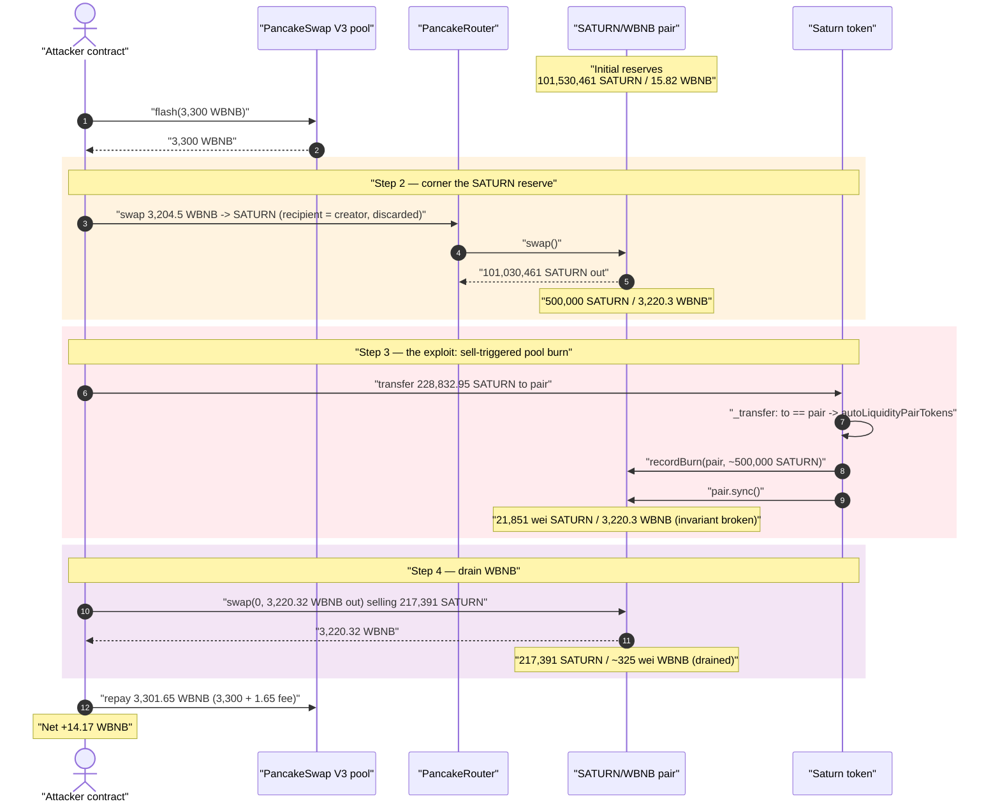
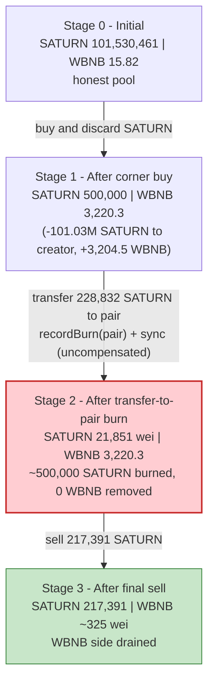
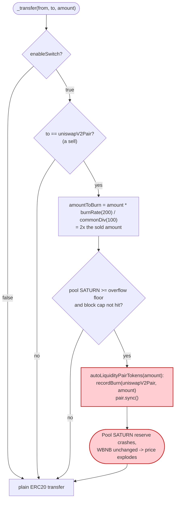
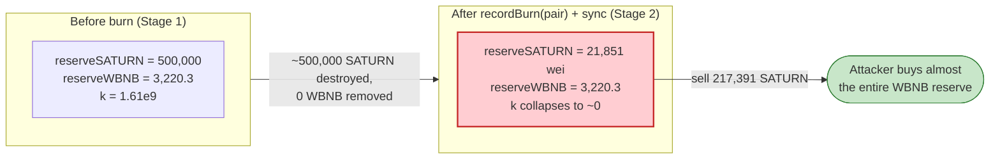

# SATURN Token Exploit — `AutoNukeLP` Burns the Pool's Reserve on Every Sell

> **Reproduction:** the PoC compiles & runs in an isolated Foundry project at
> [this project folder](.) (the umbrella DeFiHackLabs repo contains many
> unrelated PoCs that do not whole-compile, so this one was extracted).
> Full verbose trace: [output.txt](output.txt).
> Verified vulnerable source: [contracts_Saturn.sol](sources/Saturn_9BDF25/contracts_Saturn.sol).

---

## Key info

| | |
|---|---|
| **Loss** | ~15 BNB — net **14.17 WBNB** drained from the SATURN/WBNB PancakeSwap pair |
| **Vulnerable contract** | `Saturn` — [`0x9BDF251435cBC6774c7796632e9C80B233055b93`](https://bscscan.com/address/0x9BDF251435cBC6774c7796632e9C80B233055b93#code) |
| **Victim pool** | SATURN/WBNB pair — `0x49BA6c20D3e95374fc1b19D537884b5595AA6124` |
| **Flash-loan source** | PancakeSwap V3 pool — `0x36696169C63e42cd08ce11f5deeBbCeBae652050` |
| **Attacker EOA** | `0xc468D9A3a5557BfF457586438c130E3AFbeC2ff9` |
| **Attacker contract** | `0xfcECDBC62DEe7233E1c831D06653b5bEa7845FcC` |
| **Token owner (creator)** | `0xc8Ce1ecDfb7be4c5a661DEb6C1664Ab98df3Cd62` |
| **Attack tx** | [`0x948132f219c0a1adbffbee5d9dc63bec676dd69341a6eca23790632cb9475312`](https://bscscan.com/tx/0x948132f219c0a1adbffbee5d9dc63bec676dd69341a6eca23790632cb9475312) |
| **Chain / block / date** | BSC / 38,488,209 / May 2024 |
| **Compiler** | Solidity `^0.8.19` |
| **Bug class** | Broken AMM invariant via an un-compensated reserve burn on `transfer`-to-pair |

---

## TL;DR

`Saturn` is a "deflationary" token that, on **any transfer into its own liquidity pair**, burns SATURN
tokens **directly out of the pair's balance** and then calls `pair.sync()`
([contracts_Saturn.sol:267-281](sources/Saturn_9BDF25/contracts_Saturn.sol#L267-L281) →
[`autoLiquidityPairTokens`:321-328](sources/Saturn_9BDF25/contracts_Saturn.sol#L321-L328)).
This is an *un-compensated* removal of one side of the pool's reserves — it deletes SATURN from the
pair without any matching WBNB outflow, then forces the pair to accept the shrunk balance as its new
reserve. That single operation **breaks the constant-product invariant `x·y = k`** in the seller's favor.

The attacker turns this self-destructive token mechanic into a pool drain:

1. **Corners** the pool's SATURN: buys ~101.03M of the pool's ~101.53M SATURN (sending the bought
   tokens to the creator address, i.e. throwing them away), thinning the pool's SATURN reserve down to
   exactly the `everyTimeSellLimitAmount` (500,000 SATURN) and pushing 3,204.5 WBNB into the pool.
2. **Transfers 228,832.95 SATURN into the pair.** Because the destination is the AMM pair, the token's
   `_transfer` fires `autoLiquidityPairTokens`, which **burns the pool's entire ~500,000-SATURN reserve
   down to 21,851 wei** and `sync()`s it. The pool now holds essentially **0 SATURN / 3,220.3 WBNB**.
3. **Sells the 217,391.3 SATURN** (the just-deposited amount, net of the 5% sell tax) into the now
   degenerate pool and pulls out **3,220.32 WBNB** — virtually the whole WBNB side.
4. **Repays** the 3,300 WBNB flash loan (+1.65 WBNB fee).

Net result: the attacker walks off with the pool's WBNB liquidity. **Profit = +14.17 WBNB.**
The entire round-trip is funded by a single PancakeSwap-V3 `flash()` of 3,300 WBNB, so the attack
needs **zero up-front capital**.

---

## Background — what Saturn does

`Saturn` ([source](sources/Saturn_9BDF25/contracts_Saturn.sol)) is an `ERC20Burnable` token with a bundle
of bespoke "tokenomics" bolted onto `_transfer`:

- **Buy/sell taxes** — 10% on buys, 5% on sells, routed to a `tokenReciever` helper
  ([:245-264](sources/Saturn_9BDF25/contracts_Saturn.sol#L245-L264)).
- **Per-tx limits** — `everyTimeBuyLimitAmount` / `everyTimeSellLimitAmount` cap each swap
  ([:60-61](sources/Saturn_9BDF25/contracts_Saturn.sol#L60-L61)).
- **"AutoNukeLP" deflation** — on **every sell** (transfer to the pair), the contract burns
  `amount × burnRate` worth of SATURN **from the pair's own balance** and re-syncs the reserves
  ([:267-281](sources/Saturn_9BDF25/contracts_Saturn.sol#L267-L281)).
- **`enableSwitch`** — an owner flag that turns the entire tokenomics block (taxes + the burn) on/off
  ([:77](sources/Saturn_9BDF25/contracts_Saturn.sol#L77),
  [:226](sources/Saturn_9BDF25/contracts_Saturn.sol#L226)).

The relevant on-chain parameters at the fork block:

| Parameter | Value | Source |
|---|---|---|
| `burnRate` | **200** (= 2× the sold amount) | [:64](sources/Saturn_9BDF25/contracts_Saturn.sol#L64) |
| `commonDiv` | 100 | [:38](sources/Saturn_9BDF25/contracts_Saturn.sol#L38) |
| `blockBurnLpOfRate` | 90 | [:63](sources/Saturn_9BDF25/contracts_Saturn.sol#L63) |
| `blockCalcAmount` | 300,000 SATURN | [:55](sources/Saturn_9BDF25/contracts_Saturn.sol#L55) |
| `sellFee` | 5% | [:33](sources/Saturn_9BDF25/contracts_Saturn.sol#L33) |
| `everyTimeSellLimitAmount` | **500,000 SATURN** (raised on-chain from the 50k default) | [:61](sources/Saturn_9BDF25/contracts_Saturn.sol#L61) |
| `enableSwitch` | `true` (default) | [:77](sources/Saturn_9BDF25/contracts_Saturn.sol#L77) |
| Pool SATURN reserve (initial) | 101,530,461.16 SATURN | trace [L81](output.txt#L81) |
| Pool WBNB reserve (initial) | **15.82 WBNB** | trace [L81](output.txt#L81) |

The decisive fact: the burn target is the **pair's balance**, not the protocol's own balance, and the
amount burned is proportional to the *seller's* transfer — so a seller can force the pool to destroy
arbitrarily large chunks of its own SATURN reserve.

---

## The vulnerable code

### 1. Every transfer-to-pair triggers a pool burn

```solidity
function _transfer(address from, address to, uint256 amount) internal virtual override {
    if (enableSwitch) {
        ...
        if (to == uniswapV2Pair) {
            // record disabled block overflow number
            _processBlockOverflow();

            uint256 lpb = balanceOf(uniswapV2Pair);
            if (lpb >= _overFlowBurnAmount()) {
                uint256 amountToBurn = amount.mul(burnRate).div(commonDiv);   // amount × 200 / 100 = 2× amount
                uint256 _burnAmount  = lpb > amountToBurn ? amountToBurn : 0;  // times burn
                uint256 _blockAmount = _blockRemaindBurnAmount(_burnAmount);
                if (_blockAmount > 0 && !swapIng && automatedMarketMakerPairs[to]) {
                    autoLiquidityPairTokens(_blockAmount);                     // ⚠️ burn from the pool
                    blockBurnSwitch[block.number] += _blockAmount;
                }
            }
        }
    }
    super._transfer(from, to, amount);
}
```

([contracts_Saturn.sol:267-281](sources/Saturn_9BDF25/contracts_Saturn.sol#L267-L281))

### 2. The burn deletes the pair's SATURN and re-`sync()`s

```solidity
function autoLiquidityPairTokens(uint256 amountToBurn) private lockTheSwap {
    // pull tokens from pancakePair liquidity and move to dead address permanently
    recordBurn(uniswapV2Pair, amountToBurn);   // ⚠️ _burn(pair, amountToBurn) — deletes pool SATURN
    //sync price since this is not in a swap transaction!
    IUniswapV2Pair pair = IUniswapV2Pair(uniswapV2Pair);
    pair.sync();                                // ⚠️ force the shrunk balance to be the new reserve
    emit AutoNukeLP();
}
```

([contracts_Saturn.sol:321-328](sources/Saturn_9BDF25/contracts_Saturn.sol#L321-L328))

`recordBurn` is just `super._burn(uniswapV2Pair, amount)` plus a `totalDestroy` counter
([:183-186](sources/Saturn_9BDF25/contracts_Saturn.sol#L183-L186)). The comment *"pull tokens from
pancakePair liquidity and move to dead address permanently"* says it plainly: the routine intentionally
takes SATURN out of the pool. PancakeSwap's `sync()` then trusts the new (smaller) balance as the reserve.

---

## Root cause — why it was possible

A Uniswap-V2/PancakeSwap pair prices assets purely from its reserves and only enforces `x·y ≥ k`
*inside `swap()`*. `sync()` exists to let the pair reconcile its reserve bookkeeping with its actual
token balances — it implicitly trusts that those balances change only through `mint`/`burn` (of LP
tokens) / `swap` / transfers it can reason about.

`Saturn._transfer` violates that trust in the worst possible way:

> On a sell, it **destroys** SATURN held by the pair (`recordBurn(uniswapV2Pair, …)`) and then calls
> `pair.sync()`, telling the pair "your SATURN reserve is now this much smaller." **No WBNB leaves the
> pair.** The product `k` collapses, the marginal price of SATURN explodes, and whoever next sells a
> small amount of SATURN buys nearly the entire WBNB side.

The design decisions that compose into a critical bug:

1. **Burning from the pool is a value transfer to SATURN holders.** Removing SATURN from the pair
   without removing WBNB shifts the WBNB side toward anyone still holding SATURN. The attacker makes
   sure they are essentially the only seller into the corrupted pool.
2. **The burn scales with the seller's `amount` (`burnRate = 200`, i.e. 2× the sold amount)** and is
   `sync()`'d immediately. A single 228,832-SATURN transfer is enough to wipe the pool's entire
   ~500,000-SATURN reserve (the burn caps against `lpb` and `blockCalcAmount`, but with a thinned pool
   the cap is irrelevant — the whole reserve goes).
3. **The pool's SATURN reserve is attacker-controllable.** A flash-loan-funded "corner buy" shrinks the
   pool's SATURN reserve and front-loads it with WBNB, so when the burn fires the small remaining
   reserve becomes ~0 and the WBNB side is large.
4. **`enableSwitch` does not help** — at the fork block it was `true`, so the burn path was live.
   (The PoC toggles it off only to move SATURN tax-free during setup, then turns it back on.)

This is the same class of bug as the BYToken hack: an un-compensated `_burn(pool, …) + sync()` reachable
by an attacker, which the AMM faithfully turns into a free price manipulation.

---

## Preconditions

- The token's `enableSwitch` is `true` so the AutoNukeLP burn path executes on transfers to the pair
  ([:226](sources/Saturn_9BDF25/contracts_Saturn.sol#L226),
  [:267](sources/Saturn_9BDF25/contracts_Saturn.sol#L267)). It was on at the fork block.
- The attacker is not fee-excluded (so its sell goes through the burn branch) — true for any arbitrary
  EOA/contract.
- Working capital in WBNB to corner the pool. Here it is a **3,300-WBNB PancakeSwap-V3 flash loan**,
  fully repaid intra-transaction, so the attack is effectively **uncapitalized**.

> **PoC note on `setEnableSwitch` / token seeding.** The PoC pranks the token owner to flip
> `enableSwitch` and pranks a SATURN holder (`0xfcEC…5FcC`) to move SATURN to the attacker contract
> ([SATURN_exp.sol:61-67](test/SATURN_exp.sol#L61-L67)). These `vm.prank` calls reproduce the
> attacker's pre-positioned SATURN inventory used to seed the final sell. The **core vulnerability** —
> the pool-reserve burn on transfer-to-pair — does not require owner cooperation; it fires for any
> seller while `enableSwitch` is on (its real on-chain state).

---

## Attack walkthrough (with on-chain numbers from the trace)

The pair's `token0 = SATURN`, `token1 = WBNB`, so `getReserves()` returns `(SATURN, WBNB, ts)`
([trace L81](output.txt#L81)). All figures below come directly from the `Sync`/`Transfer`/`Swap`
events and `balanceOf` reads in [output.txt](output.txt).

| # | Step | Pool SATURN | Pool WBNB | Effect |
|---|------|------------:|----------:|--------|
| 0 | **Initial** ([L81](output.txt#L81)) | 101,530,461.16 | 15.82 | Honest pool. |
| 1 | **Flash-borrow** 3,300 WBNB from V3 pool ([L63](output.txt#L63)) | 101,530,461.16 | 15.82 | Working capital, repaid later. |
| 2 | **Corner buy** — swap 3,204.50 WBNB → 101,030,461.16 SATURN, recipient = creator (discarded) ([L83](output.txt#L83), [L93](output.txt#L93)) | **500,000.00** | 3,220.32 | Pool SATURN thinned to exactly `everyTimeSellLimitAmount`; WBNB front-loaded. |
| 3 | **Transfer 228,832.95 SATURN to the pair** → 5% sell-tax (11,441.65) skimmed, then `autoLiquidityPairTokens` burns the pool reserve & `sync()`s ([L113-L126](output.txt#L113-L126)) | **21,851 wei** | 3,220.32 | **Invariant broken**: ~500,000 SATURN burned from the pool ([L116](output.txt#L116)), 0 WBNB removed. Pair receives net 217,391.30 SATURN ([L127](output.txt#L127)). |
| 4 | **Sell 217,391.30 SATURN** into the degenerate pool → 3,220.32 WBNB out ([L141-L160](output.txt#L141-L160)) | 217,391.30 | **~325 wei** | Attacker buys essentially the entire WBNB reserve with the just-deposited SATURN. |
| 5 | **Repay** 3,301.65 WBNB (3,300 + 1.65 fee) to V3 pool ([L161](output.txt#L161)) | — | — | Flash loan closed. |

**Why step 4 drains the WBNB side:** after the burn, the pool's SATURN reserve is 21,851 wei against
3,220.32 WBNB. PancakeSwap's `getAmountOut` is
`out = (in·9975·reserveOut)/(reserveIn·10000 + in·9975)`. With `reserveIn ≈ 21,851 wei` and an `in` of
217,391 × 10¹⁸, the input dwarfs the reserve, so `out → reserveOut` — the seller takes nearly all of
the 3,220.32 WBNB.

### Profit accounting (WBNB)

| Direction | Amount (WBNB) | Source |
|---|---:|---|
| Borrowed (flash) | 3,300.00 | [L63](output.txt#L63) |
| Spent — corner buy | 3,204.50 | [L83](output.txt#L83) |
| Received — final SATURN sell | 3,220.32 | [L146](output.txt#L146) |
| Repaid — flash + fee | 3,301.65 | [L161](output.txt#L161) |
| **Net profit** | **+14.17** | balance before 0 → after 14.169 ([L177-L179](output.txt#L177-L179)) |

Attacker WBNB balance: **0 before → 14.169439777820443969 after**
([L28](output.txt#L28), [L179](output.txt#L179)). The ~14.17 WBNB profit is essentially the pool's
liquidity (the attacker recovers its 3,204.5-WBNB buy via the 3,220.3-WBNB sell, plus skims the residual
pool value against the burned reserve).

---

## Diagrams

### Sequence of the attack



### Pool state evolution



### The flaw inside `_transfer` / `autoLiquidityPairTokens`



### Why the burn is theft: constant-product before vs. after



---

## Remediation

1. **Never burn from the liquidity pool.** A deflationary burn must only ever destroy tokens the
   protocol *owns* (its own balance / a treasury). Removing `recordBurn(uniswapV2Pair, …)` +
   `pair.sync()` from `autoLiquidityPairTokens` eliminates the bug entirely. If reaching the pool is a
   product requirement, implement it as the protocol buying & burning from its own funds, not as a
   side-channel deletion of the pair's reserve.
2. **Do not make burn size scale with a user-controlled `amount` and apply it to pool reserves.**
   `burnRate = 200` (2× the sold amount) directly weaponizes any large sell into a reserve nuke.
3. **If pool balances must be adjusted, route through the pair's own `burn()` (LP redemption)** so both
   reserves move together and `k` is preserved — never `_burn(pair)` + `sync()`, which moves one side
   only.
4. **Cap single-operation reserve impact.** Any operation that can move a pool reserve by more than a
   small percentage should revert; here a single transfer wiped ~100% of a thinned pool's SATURN.
5. **Don't price/trigger logic off instantaneous, manipulable pool reserves.** The corner buy that sets
   up the burn relies on the pool reserve being cheaply movable within one transaction.

---

## How to reproduce

The PoC was extracted into a standalone Foundry project (the umbrella DeFiHackLabs repo has many
unrelated PoCs that fail to compile under `forge test`'s whole-project build):

```bash
_shared/run_poc.sh 2024-05-SATURN_exp -vvvvv
```

- RPC: a **BSC archive** endpoint is required (fork block 38,488,208). `foundry.toml` uses
  `https://bsc-mainnet.public.blastapi.io`, which serves historical state at that block. The default
  `https://bnb.api.onfinality.io/public` was rate-limited (HTTP 429) and was swapped out.
- Result: `[PASS] testExploit()` with `Attacker WBNB Balance After exploit: 14.169439777820443969`.

Expected tail:

```
Ran 1 test for test/SATURN_exp.sol:ContractTest
[PASS] testExploit() (gas: 445300)
  Attacker WBNB Balance Before exploit: 0.000000000000000000
  Attacker WBNB Balance After exploit: 14.169439777820443969
Suite result: ok. 1 passed; 0 failed; 0 skipped
```

---

*Reference: DeFiHackLabs — SATURN, BSC, ~15 BNB. Same vulnerability class as the BYToken pool-reserve
burn hack ([2026-06-BYToken_exp](../2026-06-BYToken_exp/BYToken_exp.md)).*
