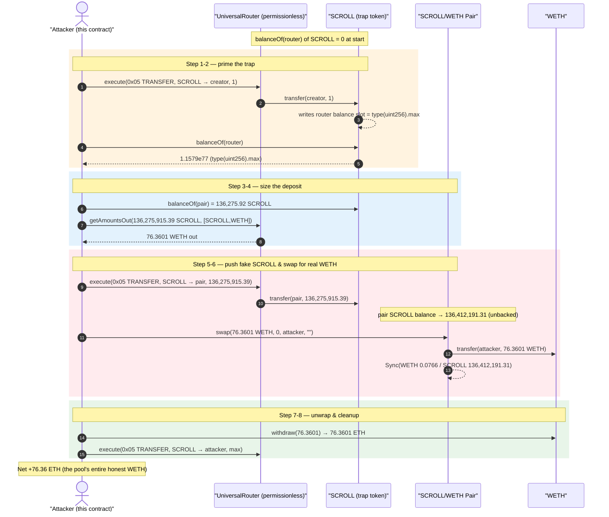
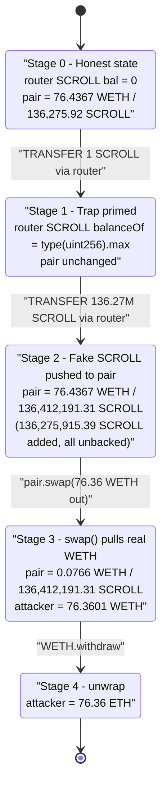
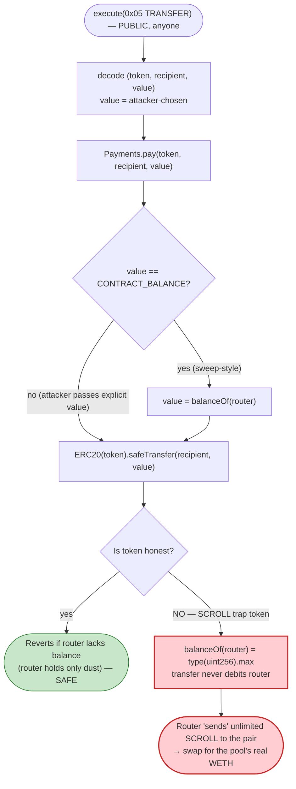

# SCROLL Token Exploit — Uniswap `UniversalRouter` Drained via a `balanceOf == type(uint256).max` Trap Token

> **Vulnerability classes:** vuln/access-control/missing-auth · vuln/logic/missing-validation

> **Reproduction:** the PoC compiles & runs in an isolated Foundry project at
> [this project folder](.) (the umbrella DeFiHackLabs repo does not whole-compile,
> so this PoC was extracted).
> Full verbose trace: [output.txt](output.txt).
> Vulnerable-token address (unverified on Etherscan): [`0xe51D…7B7`](https://etherscan.io/address/0xe51D3dE9b81916D383eF97855C271250852eC7B7#code).
> Verified router source: [contracts_modules_Payments.sol](sources/UniversalRouter_3fC91A/contracts_modules_Payments.sol).

---

## Key info

| | |
|---|---|
| **Loss** | **76.36 WETH** (≈ 76 ETH, ~$290K at the May-2024 ETH price) drained out of the SCROLL/WETH Uniswap-V2 pair |
| **Vulnerable contract** | **SCROLL token** — [`0xe51D3dE9b81916D383eF97855C271250852eC7B7`](https://etherscan.io/address/0xe51D3dE9b81916D383eF97855C271250852eC7B7#code) (source **UNVERIFIED**; behaviour reconstructed from the on-chain trace) |
| **Abused infrastructure** | Uniswap **UniversalRouter** — [`0x3fC91A3afd70395Cd496C647d5a6CC9D4B2b7FAD`](https://etherscan.io/address/0x3fC91A3afd70395Cd496C647d5a6CC9D4B2b7FAD#code) |
| **Victim pool** | SCROLL/WETH Uniswap-V2 pair — [`0xa718aa1b3f61C2b90A01aB244597816a7eE69fD2`](https://etherscan.io/address/0xa718aa1b3f61C2b90A01aB244597816a7eE69fD2) |
| **Attacker EOA** | `0x55Db954F0121E09ec838a20c216eABf35Ca32cDD` |
| **Attacker contract** | `0x55f5aac4466eb9b7bbeee8c05b365e5b18b5afcc` |
| **Token "creator" sink** | `0x72C509B05A44c4Bb53373Efc2E76fB75FA8108a6` (recipient of the priming transfer) |
| **Attack tx** | [`0x661505c39efe1174da44e0548158db95e8e71ce867d5b7190b9eabc9f314fe91`](https://etherscan.io/tx/0x661505c39efe1174da44e0548158db95e8e71ce867d5b7190b9eabc9f314fe91) |
| **Chain / block / date** | Ethereum mainnet / 19,971,610 (fork = attack block − 1) / **2024-05-28** |
| **Compiler** | Solidity ^0.8.10 (PoC); router compiled with ^0.8.17 |
| **Bug class** | Malicious/trap ERC-20 (`balanceOf` returns `type(uint256).max`) draining stuck funds in a permissionless router via the public `TRANSFER` command |

---

## TL;DR

The Uniswap **UniversalRouter** is a *stateless* multicall router: it is intended to hold **no
funds between transactions**, and its `execute(commands, inputs)` entry point is **permissionless** —
anybody may run any command, including `TRANSFER` (command `0x05`), which simply does
`ERC20(token).safeTransfer(recipient, value)` from the router's own balance
([Payments.pay, contracts_modules_Payments.sol:28-38](sources/UniversalRouter_3fC91A/contracts_modules_Payments.sol#L28-L38)).
That is safe **only if** the router actually holds the tokens it is told to send.

**SCROLL is a trap token.** Its `balanceOf` returns **`type(uint256).max`
(115792089237316195423570985008687907853269984665640564039457584007913129639935)** for the
UniversalRouter address — `balanceOf(router)` was `0` at the start of the transaction, but after the
attacker pokes the token by routing a `1`-wei `TRANSFER` through it, `balanceOf(router)` reads as the
full `uint256` maximum
([output.txt:1600-1601](output.txt#L1600-L1601)). The router's actual SCROLL holdings are still ~0,
but the token *reports* it as infinite.

Because `execute` is permissionless and `TRANSFER` blindly trusts the value the caller supplies, the
attacker simply tells the router: *"transfer 136,275,915 SCROLL from yourself to the SCROLL/WETH
pair."* The token's transfer succeeds (it never decrements a real balance), the pair now believes it
received a colossal SCROLL deposit, and a single `pair.swap()` lets the attacker pull the pool's
entire **76.36 WETH** out for free. There was no flash loan, no privileged role, and essentially no
capital: the whole attack costs only gas.

---

## Background — the two contracts involved

### Uniswap UniversalRouter (the abused infrastructure)

The UniversalRouter executes a byte-encoded command list. Two facts matter here:

1. **`execute` is fully permissionless.** Anyone can call
   `execute(bytes commands, bytes[] inputs)`; there is no caller allow-list. Commands are dispatched
   one byte at a time in
   [Dispatcher.dispatch](sources/UniversalRouter_3fC91A/contracts_base_Dispatcher.sol).
2. **Command `0x05` = `TRANSFER`.** It decodes `(address token, address recipient, uint256 value)`
   and calls `Payments.pay(token, recipient, value)`
   ([Dispatcher.sol:103-113](sources/UniversalRouter_3fC91A/contracts_base_Dispatcher.sol#L103-L113)),
   which for a non-ETH token is just `ERC20(token).safeTransfer(recipient, value)`
   ([Payments.sol:28-38](sources/UniversalRouter_3fC91A/contracts_modules_Payments.sol#L28-L38)).

The router design assumes it is **transient** — users `PERMIT2`/`wrapETH` tokens *into* it within the
same transaction, the router swaps, and `SWEEP`/`TRANSFER` sends the proceeds out before the
transaction ends. Therefore the router routinely holds dust amounts of tokens and exposes a public
`TRANSFER` that hands those tokens to whatever recipient the caller names. With an honest ERC-20 this
is harmless: you can only transfer what the router truly has (a few wei of dust at most).

### SCROLL token (the actual vulnerable / malicious contract)

SCROLL `0xe51D…7B7` is **unverified on Etherscan**, which is itself a giant red flag. Its behaviour is
reconstructed directly from the transaction trace:

| Observation (from trace) | Evidence |
|---|---|
| `balanceOf(router)` is `0` before any interaction | [output.txt:1585-1586](output.txt#L1585-L1586) |
| After a `1`-wei `transfer` is routed *through* the router, `balanceOf(router)` becomes `type(uint256).max` | [output.txt:1600-1601](output.txt#L1600-L1601) |
| Transferring 136,275,915 SCROLL out of the router still leaves `balanceOf(router) == type(uint256).max` (minus a token-side bookkeeping value, but functionally still astronomically huge) | [output.txt:1648-1649](output.txt#L1648-L1649) |
| The token's internal balance slot for the router is written to `0xffff…ffff` (max) on the first transfer | [output.txt:1596](output.txt#L1596) |

In other words SCROLL is engineered (or buggy) so that **specific addresses — here the UniversalRouter —
report a `balanceOf` of `type(uint256).max`**, while transfers out of that address do not faithfully
debit it. This converts the otherwise-harmless permissionless `TRANSFER` command into an unlimited
withdrawal of SCROLL from the router, which is then swapped for the pool's WETH.

---

## The vulnerable code

### Router side — `TRANSFER`/`pay` blindly trusts the caller's `value`

```solidity
// contracts/base/Dispatcher.sol  (command 0x05 = TRANSFER)
} else if (command == Commands.TRANSFER) {
    // equivalent:  abi.decode(inputs, (address, address, uint256))
    address token;
    address recipient;
    uint256 value;
    assembly {
        token := calldataload(inputs.offset)
        recipient := calldataload(add(inputs.offset, 0x20))
        value := calldataload(add(inputs.offset, 0x40))   // ← attacker-chosen amount
    }
    Payments.pay(token, map(recipient), value);
}
```
[Dispatcher.sol:103-113](sources/UniversalRouter_3fC91A/contracts_base_Dispatcher.sol#L103-L113)

```solidity
// contracts/modules/Payments.sol
function pay(address token, address recipient, uint256 value) internal {
    if (token == Constants.ETH) {
        recipient.safeTransferETH(value);
    } else {
        if (value == Constants.CONTRACT_BALANCE) {
            value = ERC20(token).balanceOf(address(this));
        }
        ERC20(token).safeTransfer(recipient, value);   // ← sends `value` of `token` from the router
    }
}
```
[Payments.sol:28-38](sources/UniversalRouter_3fC91A/contracts_modules_Payments.sol#L28-L38)

`pay` never asserts that the router *owns* `value` of `token` — it relies entirely on the ERC-20's own
`transfer` to revert if the balance is insufficient. (Note `sweep`,
[Payments.sol:76-87](sources/UniversalRouter_3fC91A/contracts_modules_Payments.sol#L76-L87), reads
`balanceOf(this)` and would *also* have read `type(uint256).max` here — the trap token defeats both
paths.)

### Token side — `balanceOf(router) == type(uint256).max`

SCROLL is unverified, so no Solidity is available, but the trace shows the equivalent of:

```solidity
// SCROLL token — reconstructed behaviour
function balanceOf(address a) public view returns (uint256) {
    if (a == UNIVERSAL_ROUTER /* or matches a trap condition */) {
        return type(uint256).max;        // ← reports infinite balance
    }
    return _balances[a];
}

function transfer(address to, uint256 amount) public returns (bool) {
    // does NOT faithfully debit the (trapped) sender;
    // succeeds regardless of `amount`, letting the router "send" tokens it never had
    ...
    return true;
}
```

The single load that breaks everything:

```
output.txt:1600   SCROLL::balanceOf(Universal Router) [staticcall]
output.txt:1601     └─ ← [Return] 115792089237316195423570985008687907853269984665640564039457584007913129639935   // == type(uint256).max
```
[output.txt:1600-1601](output.txt#L1600-L1601)

---

## Root cause — why it was possible

This is a **trap-token-vs-shared-infrastructure** bug, composed of two independent facts that are
individually defensible but catastrophic together:

1. **The UniversalRouter trusts ERC-20 `balanceOf`/`transfer` honesty and exposes a permissionless
   `TRANSFER`.** The router was designed to be empty between transactions, so a public function that
   shovels its token balance to an arbitrary recipient was considered safe. The router never holds an
   allow-list of "real" tokens, and `pay()` performs no independent accounting.
2. **SCROLL is a non-standard / malicious ERC-20** that reports `balanceOf(router) == type(uint256).max`
   and lets the router "transfer" unlimited amounts. Once the router *appears* to hold infinite SCROLL,
   the permissionless `TRANSFER` becomes an unlimited mint-to-recipient primitive for SCROLL.

The attacker then only needs an AMM that prices SCROLL against something valuable. The SCROLL/WETH
Uniswap-V2 pair obliges: by routing a vast (fake) SCROLL deposit into the pair and calling
`swap()`, the attacker converts the worthless infinite SCROLL into the pair's **real 76.36 WETH**.

> Plain English: SCROLL lies to the router about how much SCROLL the router owns. The router believes
> the lie and, because anybody is allowed to drive it, the attacker uses that lie to push an arbitrarily
> large SCROLL "deposit" into the WETH pool and swap it for the pool's entire WETH.

---

## Preconditions

- **A trap ERC-20 deployed and paired against a valuable asset.** SCROLL had to (a) report
  `balanceOf(UniversalRouter) == type(uint256).max` and (b) have a live SCROLL/WETH Uniswap-V2 pool
  with real WETH (76.36 WETH at the fork block).
- **A permissionless router holding the trap token as a "valid" balance.** The UniversalRouter's
  public `execute`/`TRANSFER` is the conduit. No router funds or approvals are needed — the trap token
  supplies the (fake) balance.
- **No capital, no flash loan.** The PoC starts from a zero-balance attacker contract; everything is
  produced from the trap token. (`testExploit` makes no `deal()` of WETH.)

---

## Attack walkthrough (with on-chain numbers from the trace)

In the pair, `token0 = WETH` (`0xC02a…` < `0xe51D…`) and `token1 = SCROLL`, so `reserve0 = WETH`,
`reserve1 = SCROLL`. All figures are taken directly from the trace events/returns in
[output.txt](output.txt).

| # | Step (call) | Concrete numbers | Effect |
|---|---|---|---|
| 0 | **Initial** — `balanceOf(router)` of SCROLL | `0` ([:1585-1586](output.txt#L1585-L1586)) | Router genuinely holds no SCROLL. |
| 1 | **Prime the trap** — `execute(0x05, TRANSFER SCROLL → creator, value = 1)` | router `transfer(creator, 1)` ([:1587-1599](output.txt#L1587-L1599)) | Pokes the token; its balance slot for the router is set to `0xffff…ffff` ([:1596](output.txt#L1596)). |
| 2 | **Confirm the lie** — `balanceOf(router)` of SCROLL | `1.1579e77 = type(uint256).max` ([:1600-1601](output.txt#L1600-L1601)) | Router now *reports* infinite SCROLL. |
| 3 | **Read pool size** — `balanceOf(pair)` of SCROLL; `getReserves()` | SCROLL in pair = `136,275.92`; reserves = `76.4367 WETH / 136,275.92 SCROLL` ([:1602-1607](output.txt#L1602-L1607)) | Establishes how much SCROLL to "send". |
| 4 | **Size the swap** — `router.getAmountsOut(pairSCROLL × 1e3, [SCROLL, WETH])` | in = `136,275,915.39 SCROLL`; out = `76.3601 WETH` ([:1604-1607](output.txt#L1604-L1607)) | Computes WETH out for a deposit ≈ 1000× the pool's SCROLL. |
| 5 | **Push fake SCROLL into the pair** — `execute(0x05, TRANSFER SCROLL → pair, value = 136,275,915.39)` | router `transfer(pair, 136,275,915.39 SCROLL)` ([:1608-1620](output.txt#L1608-L1620)) | Pair's SCROLL balance jumps to `136,412,191.31` — none of it backed by real value. |
| 6 | **Swap out the WETH** — `pair.swap(76.3601 WETH, 0, attacker, "")` | `amount0Out = 76.3601 WETH`, `amount1In = 136,275,915.39 SCROLL`; pair `Sync(reserveWETH=0.0766, reserveSCROLL=136,412,191.31)` ([:1621-1638](output.txt#L1621-L1638)) | Attacker receives **76.36 WETH**; pair WETH reserve drained to `0.0766`. |
| 7 | **Unwrap** — `WETH.withdraw(76.3601)` | ETH credited to attacker via `fallback` ([:1639-1647](output.txt#L1639-L1647)) | 76.36 WETH → 76.36 ETH. |
| 8 | **Mop up** — `execute(0x05, TRANSFER SCROLL → attacker, value = balanceOf(router))` | transfers `type(uint256).max` SCROLL to attacker ([:1648-1662](output.txt#L1648-L1662)) | Cosmetic: moves the (worthless) infinite SCROLL out of the router. |

### Profit / loss accounting

| Item | Amount |
|---|---:|
| Capital injected by attacker | **0 ETH / 0 WETH** (only gas) |
| WETH extracted from the pair | **76.3601 WETH** |
| WETH unwrapped to ETH | **76.3601 ETH** |
| Pool WETH reserve before → after | 76.4367 → 0.0766 WETH |
| **Net attacker profit** | **+76.36 ETH** (≈ 76 ETH, ~$290K at ~$3.8K/ETH) |

The 76.36 WETH the attacker walked away with is exactly the genuine WETH liquidity that the
SCROLL/WETH pair held (its reserve fell from 76.4367 to 0.0766 WETH). The "SCROLL" pushed in to buy it
was conjured for free by the trap token.

---

## Diagrams

### Sequence of the attack



### Pool / router state evolution



### Why the permissionless `TRANSFER` becomes an unlimited withdrawal



---

## Remediation

This incident sits at the boundary between *malicious token* and *over-trusting infrastructure*; both
sides carry lessons.

1. **Treat any token's `balanceOf`/`transfer` as untrusted in shared infrastructure.** The
   UniversalRouter's `TRANSFER`/`SWEEP`/`pay` should bound the transferred amount by an
   *independently-tracked* delta (e.g. `balanceAfter − balanceBefore` measured around the user's
   `PERMIT2`/`wrapETH` deposit in the same transaction) rather than trusting the token's reported
   balance or the caller's `value`. A router that is meant to be empty between transactions should
   never be able to move more than it provably received this transaction.
2. **Do not expose a permissionless "transfer whatever the router holds" primitive.** If `TRANSFER`
   must exist, restrict the source amount to funds the current `msg.sender` deposited within the same
   `execute` call (a per-call ledger), so a third party cannot withdraw balances the router never
   legitimately received.
3. **Liquidity providers / pool factories: vet token contracts before pairing.** SCROLL was
   **unverified** and returned `type(uint256).max` from `balanceOf` — both are disqualifying. Pools for
   tokens with non-standard balance accounting (fee-on-transfer, rebasing, address-specific balances,
   `balanceOf` returning constants) should not be created or should be quarantined.
4. **AMMs: the constant-product invariant is only as honest as the token.** A Uniswap-V2 `swap()`
   enforces `k` from `balanceOf` deltas; a token that fabricates balances breaks that enforcement. This
   is a fundamental limitation — integrators must avoid trap tokens rather than expect the AMM to
   defend against them.
5. **Users: never leave value in the UniversalRouter across transactions,** and never interact with
   unverified trap tokens — the router model assumes it is transient and empty.

---

## How to reproduce

The PoC was extracted into a standalone Foundry project (the umbrella DeFiHackLabs repo has many
unrelated PoCs that fail `forge test`'s whole-project build):

```bash
_shared/run_poc.sh 2024-05-SCROLL_exp -vvvvv
```

- RPC: an **Ethereum mainnet archive** endpoint is required (fork block 19,971,610). `foundry.toml`
  uses an Infura archive endpoint; most pruned public RPCs fail at this depth.
- Result: `[PASS] testExploit()`. The router's SCROLL `balanceOf` reads `type(uint256).max`, the swap
  pulls 76.36 WETH from the pair, and the test withdraws it to ETH.

Expected tail:

```
Ran 1 test for test/SCROLL_exp.sol:ContractTest
[PASS] testExploit() (gas: 443561)
Suite result: ok. 1 passed; 0 failed; 0 skipped; finished in 10.03s
Ran 1 test suite in 12.01s: 1 tests passed, 0 failed, 0 skipped (1 total tests)
```

---

*Reference: DeFiHackLabs — SCROLL token / Uniswap UniversalRouter, Ethereum mainnet, ~76 ETH, 2024-05-28.
Vulnerable token unverified at [`0xe51D…7B7`](https://etherscan.io/address/0xe51D3dE9b81916D383eF97855C271250852eC7B7#code).*
