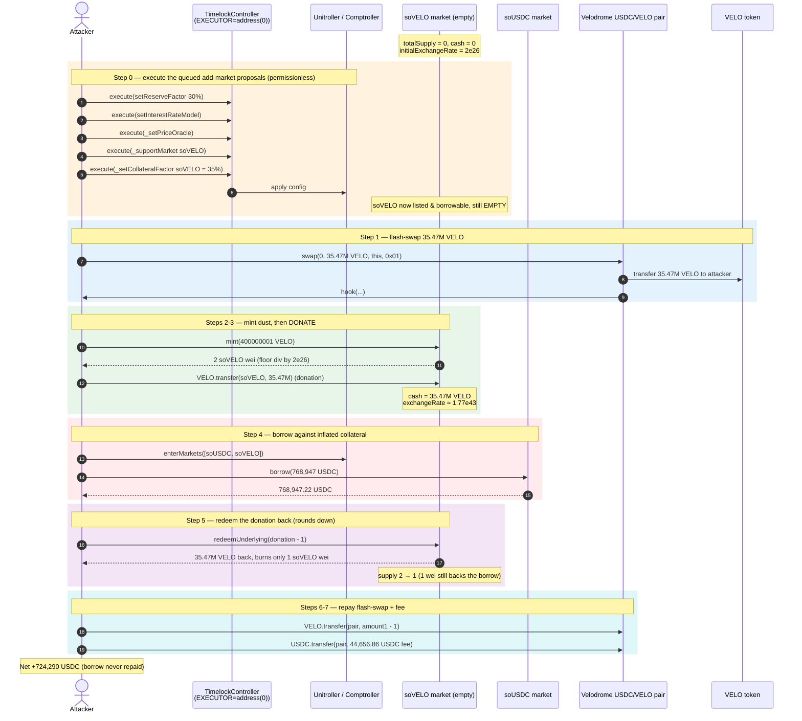
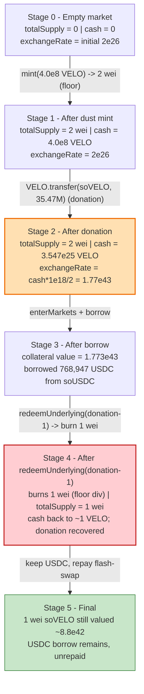
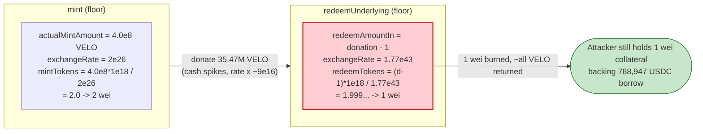

# Sonne Finance Exploit — Empty-Market Exchange-Rate Inflation (CompoundV2 Donation Attack)

> **Vulnerability classes:** vuln/arithmetic/rounding · vuln/arithmetic/precision-loss

> **Reproduction:** the PoC compiles & runs in an isolated Foundry project at
> [this project folder](.) (the umbrella DeFiHackLabs repo does not whole-compile, so this PoC
> was extracted into its own project).
> Full verbose trace: [output.txt](output.txt).
> Verified vulnerable source: [contracts_CToken.sol](sources/CErc20Immutable_e3b813/contracts_CToken.sol).

---

## Key info

| | |
|---|---|
| **Loss** | **~$724,290 USDC** in this reproduced transaction; **~$20M total** across the Sonne campaign on Optimism |
| **Vulnerable contract** | `CErc20Immutable` (soVELO market) — [`0xe3b81318B1b6776F0877c3770AfDdFf97b9f5fE5`](https://optimistic.etherscan.io/address/0xe3b81318b1b6776f0877c3770afddff97b9f5fe5#code) |
| **Vulnerable logic** | `CToken.exchangeRateStoredInternal` / `mintFresh` / `redeemFresh` (CompoundV2-fork rounding) |
| **Victim** | Sonne Finance lending market (Unitroller `0x60CF091cD3f50420d50fD7f707414d0DF4751C58`); funds drained from `soUSDC` `0xEC8FEa79026FfEd168cCf5C627c7f486D77b765F` |
| **Liquidity source** | Velodrome V2 `vAMM-USDC/VELO` pair `0x8134A2fDC127549480865fB8E5A9E8A8a95a54c5` (used as flash-swap) |
| **Attacker EOA** | [`0x5d0d…0bbb`](https://optimistic.etherscan.io/address/0x5d0d99e9886581ff8fcb01f35804317f5ed80bbb) and [`0xae4a…1f43`](https://optimistic.etherscan.io/address/0xae4a7cde7c99fb98b0d5fa414aa40f0300531f43) |
| **Attacker contract** | [`0xa78a…caf8`](https://optimistic.etherscan.io/address/0xa78aefd483ce3919c0ad55c8a2e5c97cbac1caf8) / [`0x02FA…C5B9`](https://optimistic.etherscan.io/address/0x02FA2625825917E9b1F8346a465dE1bBC150C5B9) |
| **Attack tx** | [`0x9312…b7f0`](https://optimistic.etherscan.io/tx/0x9312ae377d7ebdf3c7c3a86f80514878deb5df51aad38b6191d55db53e42b7f0) (this PoC); first tx [`0x45c0…db96`](https://optimistic.etherscan.io/tx/0x45c0ccfd3ca1b4a937feebcb0f5a166c409c9e403070808835d41da40732db96) |
| **Chain / block / date** | Optimism / 120,062,493 (fork at 120,062,492) / 2024-05-14 |
| **Compiler** | Solidity 0.8.10 (PoC pragma `^0.8.10`); markets compiled with Sonne's CompoundV2 fork |
| **Bug class** | First-depositor / empty-market exchange-rate inflation via underlying donation + redeem rounding-down |

---

## TL;DR

Sonne Finance is a CompoundV2 fork. Each lending market (`CErc20`) prices its cToken against the
underlying with the classic formula
`exchangeRate = (cash + totalBorrows - totalReserves) / totalSupply`
([contracts_CToken.sol:382-408](sources/CErc20Immutable_e3b813/contracts_CToken.sol#L382-L408)), where
`cash = underlying.balanceOf(market)`
([contracts_CErc20.sol:147-150](sources/CErc20Immutable_e3b813/contracts_CErc20.sol#L147-L150)).

Sonne governance queued a routine proposal to **list a brand-new VELO market** (`soVELO`). The market
was added but **never seeded** — at the exploit block its `totalSupply == 0` and `cash == 0`. The
attacker simply **executed the already-queued, delay-elapsed timelock proposal themselves** (the
timelock's `EXECUTOR_ROLE` is granted to `address(0)`, i.e. open to anyone), then in the *same*
transaction:

1. **Minted a tiny amount** of soVELO. With the configured `initialExchangeRateMantissa = 2e26`,
   `mint(400000001)` produced exactly **2** cToken wei
   ([trace L151](output.txt)).
2. **Donated** ~35.47M VELO **directly** to the market (a plain ERC20 `transfer`, not a `mint`),
   spiking `cash` and therefore the exchange rate to ≈ `1.77e43`.
3. **Borrowed** 768,947 USDC out of the `soUSDC` market against the now-grotesquely-overvalued 2-wei
   soVELO collateral.
4. **Redeemed** the donated VELO back — and here is the bug: `redeemUnderlying(donation − 1)` computes
   `redeemTokens = redeemAmountIn / exchangeRate`, which **rounds down to 1** cToken
   ([contracts_CToken.sol:639](sources/CErc20Immutable_e3b813/contracts_CToken.sol#L639)). The attacker
   recovers ~all of their donated VELO while burning only **1** of their **2** cToken wei.
5. **Walks away** with the borrowed USDC; the 1 remaining cToken wei (still valued at ≈ half the inflated
   exchange rate) keeps the borrow nominally "collateralized," so the position is never liquidatable for
   meaningful value and the protocol eats the loss.

Everything is wrapped inside a **Velodrome flash-swap** so no upfront VELO capital is needed. Net for
this transaction: **+724,290 USDC**.

---

## Background — what Sonne Finance does

Sonne Finance is a Compound-V2-style money market deployed on Optimism (and Base). Lenders supply an
asset and receive an interest-bearing receipt token (a "soToken" / cToken) that accrues value as the
exchange rate rises; borrowers post soTokens as collateral and borrow other assets up to a
collateral-factor-limited amount. A `Comptroller` (behind the `Unitroller` proxy) enforces the
collateral math and decides what can be borrowed and redeemed.

Listing a new market is a privileged, multi-step governance action: `_supportMarket(market)`,
`_setCollateralFactor(market, cf)`, set the price oracle, set the interest-rate model, etc. On Sonne
these calls are routed through an **OpenZeppelin `TimelockController`**
([`0x37fF10…`](https://optimistic.etherscan.io/address/0x37fF10390F22fABDc2137E428A6E6965960D60b6)),
which is the `admin` of both the Unitroller and every market.

On-chain state read at the fork block (`cast call … --block 120062492`):

| Parameter | Value |
|---|---|
| soVELO `totalSupply` | **0** (empty, brand-new market) |
| soVELO `cash` (VELO held) | **0** |
| soVELO `initialExchangeRateMantissa` | **2e26** |
| soVELO / VELO decimals | 8 / 18 |
| soVELO `comptroller` / `admin` | Unitroller `0x60CF09…` / Timelock `0x37fF10…` |
| Timelock `getMinDelay()` | **172,800 s (2 days)** |
| Timelock admin of Unitroller & soVELO | **yes** |
| Timelock `EXECUTOR_ROLE` held by `address(0)` | **true** (execution is open to anyone) |
| soUSDC `cash` (USDC available to borrow) | 1,046,005.47 USDC |

The combination of *empty market* + *open timelock executor* + *no seed deposit* is the whole game.

---

## The vulnerable code

### 1. Exchange rate is driven by raw token balance (`cash`)

```solidity
// contracts_CToken.sol:382
function exchangeRateStoredInternal() internal view virtual returns (uint256) {
    uint256 _totalSupply = totalSupply;
    if (_totalSupply == 0) {
        return initialExchangeRateMantissa;          // empty-market path
    } else {
        uint256 totalCash = getCashPrior();          // = underlying.balanceOf(this)
        uint256 cashPlusBorrowsMinusReserves =
            totalCash + totalBorrows - totalReserves;
        uint256 exchangeRate =
            (cashPlusBorrowsMinusReserves * expScale) / _totalSupply;
        return exchangeRate;                          // <-- inflatable by a direct transfer
    }
}
```
([contracts_CToken.sol:382-408](sources/CErc20Immutable_e3b813/contracts_CToken.sol#L382-L408))

```solidity
// contracts_CErc20.sol:147
function getCashPrior() internal view override returns (uint) {
    return EIP20Interface(underlying).balanceOf(address(this));   // raw balance, not an internal accumulator
}
```
([contracts_CErc20.sol:147-150](sources/CErc20Immutable_e3b813/contracts_CErc20.sol#L147-L150))

Because `cash` is the *actual* ERC20 balance, anyone can inflate the exchange rate of a thinly-supplied
market by transferring underlying straight to it — no `mint` required.

### 2. Mint rounds DOWN — first minter can buy 2 wei of cToken

```solidity
// contracts_CToken.sol:558
uint256 mintTokens = div_(actualMintAmount, exchangeRate);  // floor division
totalSupply += mintTokens;
accountTokens[minter] += mintTokens;
```
([contracts_CToken.sol:551-567](sources/CErc20Immutable_e3b813/contracts_CToken.sol#L551-L567))

With `exchangeRate = initialExchangeRateMantissa = 2e26`, minting `4.00000001e8` underlying yields
`(4.00000001e8 · 1e18) / 2e26 = 2.0000…` → **2** cToken wei.

### 3. Redeem-by-amount also rounds DOWN — the theft step

```solidity
// contracts_CToken.sol:633
} else {
    // redeemTokens = redeemAmountIn / exchangeRate   (floor)
    // redeemAmount = redeemAmountIn
    redeemTokens = div_(redeemAmountIn, exchangeRate);
    redeemAmount = redeemAmountIn;
}
```
([contracts_CToken.sol:633-641](sources/CErc20Immutable_e3b813/contracts_CToken.sol#L633-L641))

After the donation, `exchangeRate ≈ 1.77e43`. Redeeming `donation − 1` underlying costs
`((donation−1) · 1e18) / 1.77e43 = 1.9999…` → **1** cToken wei. The attacker pulls back essentially all
the donated VELO while burning only **half** of their 2-wei position. `div_` is plain integer division
([contracts_ExponentialNoError.sol:148-150](sources/CErc20Immutable_e3b813/contracts_ExponentialNoError.sol#L148-L150)),
so both directions truncate toward zero in the attacker's favour.

---

## Root cause — why it was possible

This is the canonical **CompoundV2 empty-market / first-depositor exchange-rate manipulation**, weaponised
by an operational mistake in market listing. Four facts compose into the exploit:

1. **A market was listed without a seed deposit.** Compound's own deployment runbook (and every reputable
   fork's checklist) says: *immediately after `_supportMarket`, mint a small non-trivial amount of cTokens
   and burn/lock them, so `totalSupply` can never be returned to 0 and the exchange rate can never be set
   by a single attacker.* Sonne listed soVELO with `totalSupply == 0` and `cash == 0`.

2. **Exchange rate keys off `balanceOf` (`cash`), which is donation-manipulable.** Because
   `exchangeRateStoredInternal` divides real cash by a *tiny* `totalSupply`, a direct transfer of underlying
   makes each cToken wei worth an astronomical amount of underlying *and* of borrow power.

3. **Both `mint` and `redeem` round down.** The first mint buys 2 wei; the post-donation redeem burns only
   1 wei for ~the entire donation. That asymmetry leaves the attacker holding 1 wei of fabulously
   overvalued collateral *after* recovering their donation — exactly the collateral that backs the
   un-repaid USDC borrow.

4. **The privileged listing action was executable by anyone.** Sonne's `TimelockController` grants
   `EXECUTOR_ROLE` to `address(0)`, the OpenZeppelin convention for "open execution." The legitimate
   add-market proposal had been queued (and its 2-day delay had elapsed). The attacker did not need to be a
   proposer — they only had to call `execute()` on the ready proposal *and* immediately follow it with the
   donation attack in the same transaction, before any honest depositor could seed the market.

In short: **the price/borrow-power of a market was settable by the very first interaction with it, and the
first interaction was a permissionless governance execution that the attacker controlled the timing of.**

---

## Preconditions

- A Sonne market exists that is **listed but empty** (`totalSupply == 0`). Here soVELO had just been added
  by a queued governance proposal.
- The listing proposal's timelock delay has elapsed and `EXECUTOR_ROLE` is open (`address(0)`), so anyone
  can `execute()` it. The PoC calls `t.execute(...)` five times to: set reserve factor, set IRM, set price
  oracle, `_supportMarket(soVELO)`, and `_setCollateralFactor(soVELO, 35%)`
  ([Sonne_exp.sol:67-105](test/Sonne_exp.sol#L67-L105)).
- A source of VELO for the donation. The PoC uses a **Velodrome flash-swap** (borrow ~35.47M VELO, repay in
  the same call), so no real capital is required — the attack is flash-loanable
  ([Sonne_exp.sol:113](test/Sonne_exp.sol#L113)).
- The target borrow market (`soUSDC`) holds USDC to borrow (≈1.046M USDC available at the fork block).

---

## Attack walkthrough (with on-chain numbers from the trace)

All figures are taken directly from [output.txt](output.txt). VELO has 18 decimals; soVELO/soUSDC have 8;
USDC has 6.

| # | Step | Call / amount | Result |
|---|------|---------------|--------|
| 0 | **Execute queued proposals** | `t.execute` ×5: reserveFactor 30%, IRM, oracle `0x22C7…0Fea`, `_supportMarket(soVELO)`, `_setCollateralFactor(soVELO, 35%)` | soVELO is now a live, **empty**, borrowable collateral market ([trace L22-L102](output.txt)) |
| 1 | **Approve & flash-swap** | `VolatileV2 pair.swap(0, 35,469,150,965,253,049,864,450,449 VELO, this, 0x01)` | Pair sends 35.47M VELO to attacker, then calls `hook()` ([trace L108-L118](output.txt)) |
| 2 | **First mint** | `soVELO.mint(400_000_001)` | VELO→soVELO; `mintTokens = 400000001·1e18 / 2e26 = ` **2** soVELO wei ([trace L151](output.txt)) |
| 3 | **Donate underlying** | `VELO.transfer(soVELO, 35,469,150,965,253,049,464,450,448)` | soVELO `cash` jumps to **35,469,150,965,253,049,864,450,449** VELO; exchangeRate → ≈ `1.77e43` ([trace L171-L178](output.txt)) |
| 4 | **Enter markets + borrow** | `enterMarkets([soUSDC, soVELO])`; `soUSDC.borrow(768_947_220_961)` | soVELO collateral value snapshot = `1.773e43` ([trace L232](output.txt)); attacker receives **768,947.220961 USDC** ([trace L281,L291](output.txt)) |
| 5 | **Redeem donation back** | `soVELO.redeemUnderlying(donation − 1)` | `redeemTokens = (donation−1)·1e18 / 1.77e43 = ` **1** soVELO wei burned; attacker gets back **35,469,150,965,253,049,864,450,448** VELO ([trace L355,L361](output.txt)) — soVELO supply 2→1 |
| 6 | **Repay flash-swap (VELO)** | `VELO.transfer(pair, amount1 − 1)` | 35.47M VELO returned to the Velodrome pair ([trace L368](output.txt)) |
| 7 | **Pay flash-swap fee (USDC)** | `USDC.transfer(pair, 44_656_863_632)` | Pair fee of **44,656.863632 USDC** paid from the borrowed USDC ([trace L374](output.txt)) |
| 8 | **Profit** | `USDC.balanceOf(this)` | **724,290.357329 USDC** remains ([trace L381-L384](output.txt)) |

The attacker keeps the 768,947 USDC borrow open, backed only by **1 wei of soVELO** that the protocol's own
oracle/exchange-rate logic still values at ≈ `8.8e42` (half the inflated rate). Sonne never recovers the
USDC; the loss is socialised onto soUSDC suppliers.

### Profit accounting (USDC)

| Direction | Amount (USDC) |
|---|---:|
| Borrowed from `soUSDC` | +768,947.220961 |
| Velodrome flash-swap fee paid | −44,656.863632 |
| **Net profit (this tx)** | **+724,290.357329** |

The VELO leg nets to zero: 400,000,001 wei spent to mint + the donation are both fully recovered via the
redeem, then the entire flash-swapped amount is returned to the pair. The only asset the attacker walks away
with is the borrowed USDC.

> **Scale note.** The DeFiHackLabs header puts the *total* Sonne campaign at **~$20M**: the attacker first
> seeded/attacked the new market (tx `0x45c0…db96`) and then drained multiple markets. This PoC reproduces
> the `0x9312…b7f0` transaction, whose isolated, on-chain-verified profit is **$724,290** of USDC.

---

## Diagrams

### Sequence of the attack



### soVELO market / exchange-rate evolution



### Why the rounding is theft



---

## Remediation

1. **Always seed a new market before (or atomically with) listing it.** The standard CompoundV2 fix:
   immediately after `_supportMarket`, `mint` a small but non-trivial amount of cTokens from a protocol-owned
   address and **permanently lock/burn** them so `totalSupply` can never return to 0. This makes the
   exchange rate insensitive to a single attacker's first interaction. Sonne's own post-mortem adopted
   exactly this.
2. **Make market listing atomic and not front-runnable.** Do not list a market in a state where the
   *first* external interaction can set its price. If governance must use a timelock, the queued operation
   should itself include the seed-mint, so there is never a window in which the market is listed-but-empty.
3. **Add a minimum-liquidity / dead-shares mechanism (ERC4626-style virtual offset).** Track an internal
   `totalSupply`/`cash` floor or use virtual shares so that `exchangeRate` cannot be inflated by a tiny
   `totalSupply` plus a large donation.
4. **Do not derive the exchange rate from raw `balanceOf`.** Use an internal accounting accumulator for
   `cash` that only changes through `mint`/`redeem`/`borrow`/`repay`, so a direct token donation cannot move
   the price. (This is a deeper change to the Compound model but removes the donation vector class-wide.)
5. **Reconsider the open `EXECUTOR_ROLE = address(0)`.** Open execution let the attacker choose the exact
   block to apply the listing and immediately exploit it. Even with open execution, the listing operation
   must be self-contained (point 2) so that "who executes it / when" cannot be turned into an attack.

---

## How to reproduce

The PoC was extracted into a standalone Foundry project (the umbrella DeFiHackLabs repo does not build under
a single `forge test`):

```bash
_shared/run_poc.sh 2024-05-Sonne_exp -vvvvv
```

- RPC: an **Optimism archive** endpoint is required (fork block 120,062,492). `foundry.toml` uses
  `https://optimism.drpc.org` (the originally-configured Infura
  key lacked Optimism access and returned HTTP 401; this key serves historical state at the fork block).
- Result: `[PASS] testExploit()` with `USDC Profit from this attack: $ 724290`.

Expected tail:

```
  Amount of VELO OF soVELO after minting 400000001
  Amount of soVELO been mint 2
  Amount of VELO OF soVELO after tranfer 35469150965253049864450449
  usdc_amount_after_borrow 768947220961
  Velo_amount_of_Attacker_after_redeem 35469150965253049864450448
  USDC Profit from this attack: $ 724290
[PASS] testExploit() (gas: 1220567)
Suite result: ok. 1 passed; 0 failed; 0 skipped
```

---

*References: Sonne Finance incident, Optimism, May 2024 (~$20M). Verified sources downloaded under
[sources/](sources/) via Etherscan V2 (chainid 10).*
