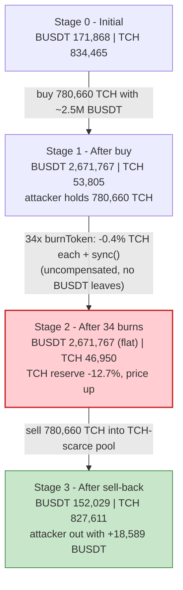
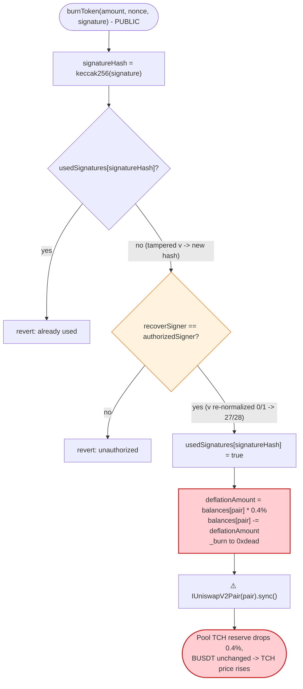
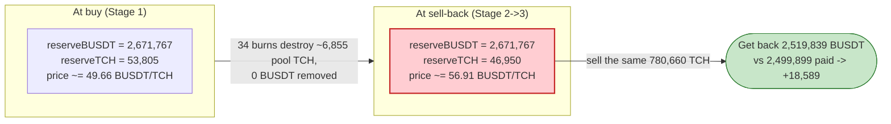

# TCH Exploit — Signature-Replay Loophole + Pool-Reserve `_burn`/`sync()` Price Manipulation

> **Reproduction:** the PoC compiles & runs in an isolated Foundry project at
> [this project folder](.) (the umbrella DeFiHackLabs repo contains many
> unrelated PoCs that do not whole-compile, so this one was extracted).
> Full verbose trace: [output.txt](output.txt).
> Verified vulnerable source: [tch.sol](sources/TCHtoken_5d78CF/tch.sol).

---

## Key info

| | |
|---|---|
| **Loss** | **~$18,589** — 18,589.29 BUSDT skimmed from the BUSDT/TCH PancakeSwap pair |
| **Vulnerable contract** | `TCHtoken` — [`0x5d78CFc8732fd328015C9B73699dE9556EF06E8E`](https://bscscan.com/address/0x5d78CFc8732fd328015C9B73699dE9556EF06E8E#code) |
| **Victim pool** | BUSDT/TCH pair — `0xb7F1FFf722e68A6Fc44980f5D48d6d3Dbc1fe9cF` (token0 = BUSDT, token1 = TCH) |
| **Flash-loan source** | BUSDT/USDC PancakeSwap-V3 pool — `0x4f31Fa980a675570939B737Ebdde0471a4Be40Eb` |
| **Attacker EOA** | [`0xb9596d6e53d81981b9f06ca2ca6d3e422232d575`](https://bscscan.com/address/0xb9596d6e53d81981b9f06ca2ca6d3e422232d575) |
| **Attacker contract** | [`0x258850ec735f6532fe34fe24ef9628992a9b7e84`](https://bscscan.com/address/0x258850ec735f6532fe34fe24ef9628992a9b7e84) |
| **Attack tx** | [`0xa94338d8aa312ed4b97b2a4dcb27f632b1ade6f3abec667e3bf9f002a75dabe0`](https://bscscan.com/tx/0xa94338d8aa312ed4b97b2a4dcb27f632b1ade6f3abec667e3bf9f002a75dabe0) |
| **Chain / block / date** | BSC / 38,776,239 / May 16, 2024 |
| **Compiler** | Solidity v0.8.18, optimizer **off** (`runs: 200`) |
| **Bug class** | ECDSA signature-replay (malleable `keccak256(signature)` nonce) → repeated permissionless pool-reserve burn breaking the AMM constant-product invariant |
| **Authorized signer recovered** | `0x8b3d602fc36b40010693BC4f676f38297b49c547` |

---

## TL;DR

`TCHtoken.burnToken()` lets anyone present an off-chain ECDSA signature from an `authorizedSigner` to
trigger a "deflation": it removes `0.4%` of the pool's TCH balance and calls `pair.sync()`
([tch.sol:1605-1615](sources/TCHtoken_5d78CF/tch.sol#L1605-L1615)). The replay guard keys uniqueness
on **`keccak256(signature)`** — the raw signature bytes — *not* on the `nonce`.

The signature scheme is **malleable**: `splitSignature()` runs `if (v < 27) v += 27`
([tch.sol:1632](sources/TCHtoken_5d78CF/tch.sol#L1632)). So for any previously-used legitimate
signature ending in `v = 0x1b` (27) or `v = 0x1c` (28), the attacker simply rewrites the last byte to
`0x00` or `0x01`. The recovered signer is **identical** (the contract normalizes `v` back to 27/28),
but `keccak256(tamperedSig)` is **different**, so `usedSignatures[...]` sees it as fresh.

The attacker harvested 34 real `burnToken` signatures from historical TCH transactions, tampered each
one's `v` byte, and replayed all 34 in a single transaction. Combined with a flash-loaned BUSDT swap:

1. **Flash-loan** 2,500,000 BUSDT from the BUSDT/USDC V3 pool.
2. **Buy TCH** with ~2.5M BUSDT, pushing the BUSDT/TCH pool to `2,671,767 BUSDT / 53,805 TCH` and
   leaving the attacker holding **780,660 TCH**.
3. **Replay 34 tampered burns** — each `burnToken()` deletes `0.4%` of the pool's TCH reserve and
   `sync()`s it, dragging the pool's TCH reserve from `53,805 → 46,950` while the BUSDT side stays
   flat. The pool now prices TCH far higher than at the moment of purchase.
4. **Sell the 780,660 TCH back** into the over-priced pool for `2,519,839 BUSDT`.
5. **Repay** the flash loan (2,500,000 + 1,250 fee) and keep the difference: **+18,589.29 BUSDT**.

The burn is *uncompensated* (TCH leaves the pair, no BUSDT does), so each `sync()` shifts value from
the pool's real liquidity toward whoever holds TCH — and the attacker made sure they were that holder.

---

## Background — what TCHtoken does

`TCHtoken` ([source](sources/TCHtoken_5d78CF/tch.sol)) is a BEP-20 with `100,000,000` supply and a
bespoke transfer/fee/"deflation" layer (it overrides `transfer`/`transferFrom`/`balanceOf` with its
own `balances` mapping, [tch.sol:1442-1476](sources/TCHtoken_5d78CF/tch.sol#L1442-L1476)).

The relevant feature is an off-chain-authorized **burn**:

- An `authorizedSigner` ([tch.sol:1457](sources/TCHtoken_5d78CF/tch.sol#L1457)) signs messages of the
  form `keccak256(abi.encodePacked(address(this), amount, nonce))`.
- Anyone holding such a signature calls
  `burnToken(amount, nonce, signature)` ([tch.sol:1605](sources/TCHtoken_5d78CF/tch.sol#L1605)).
- The function ignores `amount` entirely for the burn quantity. It always burns
  `deflationFee = 40 bps = 0.4%` of the **pool's** current TCH balance
  ([tch.sol:1610-1614](sources/TCHtoken_5d78CF/tch.sol#L1610-L1614)) and then `sync()`s the pair.

On-chain parameters at the fork block:

| Parameter | Value |
|---|---|
| `totalSupply` | 100,000,000 TCH |
| `deflationFee` | 40 bps = **0.4% of pool TCH per call** |
| `uniswapV2Pair` | `0xb7F1…e9cF` (BUSDT/TCH) |
| `authorizedSigner` | `0x8b3d…c547` |
| Pool reserves (pre-attack) | **171,868.33 BUSDT / 834,465.51 TCH** |

---

## The vulnerable code

### 1. `burnToken` — replay guard on the raw signature, fixed-rate pool burn + `sync()`

```solidity
function burnToken(uint256 amount, uint256 nonce, bytes memory signature) external {
    bytes32 signatureHash = keccak256(signature);                       // ⚠️ uniqueness keyed on raw bytes
    require(!usedSignatures[signatureHash], "Signature has already been used");
    require(isAuthorizedSigner(amount, nonce, signature), "Invalid or unauthorized signature");
    usedSignatures[signatureHash] = true;
    uint256 deflationAmount = balances[uniswapV2Pair] * deflationFee / 10000;  // 0.4% of POOL balance
    balances[uniswapV2Pair] -= deflationAmount;                          // ⚠️ removes TCH from the pair
    balances[address(0xdead)] += deflationAmount;
    emit Transfer(uniswapV2Pair, address(0xdead), deflationAmount);
    IUniswapV2Pair(uniswapV2Pair).sync();                               // ⚠️ forces the reduced balance as new reserve
}
```
([tch.sol:1605-1615](sources/TCHtoken_5d78CF/tch.sol#L1605-L1615))

### 2. `splitSignature` — `v`-normalization that creates malleability

```solidity
function isAuthorizedSigner(uint256 amount, uint256 nonce, bytes memory signature) internal view returns (bool) {
    bytes32 message          = keccak256(abi.encodePacked(address(this), amount, nonce));
    bytes32 ethSignedMessage = keccak256(abi.encodePacked("\x19Ethereum Signed Message:\n32", message));
    return recoverSigner(ethSignedMessage, signature) == authorizedSigner;
}

function splitSignature(bytes memory sig) internal pure returns (bytes32 r, bytes32 s, uint8 v) {
    require(sig.length == 65, "Invalid signature length");
    assembly {
        r := mload(add(sig, 32))
        s := mload(add(sig, 64))
        v := byte(0, mload(add(sig, 96)))
    }
    if (v < 27) v += 27;        // ⚠️ v=0 and v=1 are accepted and remapped to 27/28
    return (r, s, v);
}
```
([tch.sol:1616-1634](sources/TCHtoken_5d78CF/tch.sol#L1616-L1634))

Because `v` is normalized *after* it is read, a signature with the canonical `v = 28` (`0x1c`) and the
*same* signature with `v = 1` (`0x01`) **recover to the same signer**, yet hash to different values.

---

## Root cause — why it was possible

There are two cooperating flaws; either alone would be far less severe.

**Flaw A — the replay nonce is the malleable signature, not the message nonce.**
The whole point of the `nonce` parameter is to make each authorized burn one-shot. But
`burnToken` never tracks `nonce`; it tracks `keccak256(signature)`
([tch.sol:1606-1609](sources/TCHtoken_5d78CF/tch.sol#L1606-L1609)). Since ECDSA signatures are
malleable across the `v` byte (and, more generally, across `s` via the curve-order symmetry), one
authorized message yields **at least two** distinct byte-strings that pass `require(isAuthorizedSigner(...))`
but produce two different `signatureHash` values. The contract therefore treats `(150, sig_v=28)` and
`(150, sig_v=1)` as two independent, valid burns.

In the live attack the attacker didn't even need to forge anything: they pulled 34 **real, already-broadcast**
`burnToken` signatures (nonces 133–166) from historic TCH transactions, flipped each one's trailing
`0x1c → 0x01` / `0x1b → 0x00`, and got 34 "new" burns for free. The trace confirms each tampered sig
recovers the legit signer `0x8b3d…c547`
([output.txt:202-203](output.txt#L202-L203)).

**Flaw B — the burn drains a *third party's* reserve and `sync()`s it.**
`burnToken` removes TCH from `balances[uniswapV2Pair]` and immediately calls `pair.sync()`. This is an
**uncompensated** removal of one side of an AMM pool: TCH disappears, no BUSDT leaves, and `sync()`
forces the pair to adopt the shrunken TCH reserve as truth. A Uniswap-V2/PancakeSwap pair enforces
`x·y ≥ k` only inside `swap()`; `sync()` blindly trusts the contract's reported balances. Each burn
therefore moves the marginal price of TCH up — for free — and that surplus accrues to whoever holds TCH.

Composing the two: the attacker buys a large TCH position, then weaponizes Flaw A to fire Flaw B 34
times in one transaction, ratcheting the price up by `(1 - 0.004)^34 ≈ 87.3%` of the original TCH
reserve remaining (i.e. a ~12.7% reserve reduction), then sells the position back at the inflated price.

`deflationFee` being a fixed `0.4%` of the *pool* (not of the contract's own balance, which the design
should have used) is what makes the burn a value transfer rather than a harmless supply reduction.

---

## Preconditions

- **Knowledge of ≥1 valid `authorizedSigner` signature.** Trivially satisfied: every prior legitimate
  `burnToken` call publishes one on-chain. The attacker harvested 34.
- **The signature scheme is malleable.** Guaranteed here by the `if (v < 27) v += 27` normalization,
  which makes `v ∈ {0,1,27,28}` all valid for the same `(r,s)`.
- **`deflationFee > 0` and the pool holds TCH.** Both true.
- **Working capital to buy a TCH position** so the burn-induced price move lands in the attacker's
  favor. Fully flash-loanable: the PoC borrows 2,500,000 BUSDT from the BUSDT/USDC V3 pool and repays
  it in the same callback ([TCH_exp.sol:57](test/TCH_exp.sol#L57), [:64-76](test/TCH_exp.sol#L64-L76)).

---

## Attack walkthrough (with on-chain numbers from the trace)

The pair is token0 = BUSDT, token1 = TCH, so `reserve0 = BUSDT`, `reserve1 = TCH`.
All figures are taken directly from the `Sync` / `Swap` events in
[output.txt](output.txt). Amounts shown in whole tokens (÷1e18).

| # | Step | Pool BUSDT | Pool TCH | Effect |
|---|------|-----------:|---------:|--------|
| 0 | **Initial** ([:165](output.txt#L165)) | 171,868.33 | 834,465.51 | Honest pool. |
| 1 | **Flash-loan** 2,500,000 BUSDT from BUSDT/USDC V3 pool ([:125](output.txt#L125)) | — | — | Working capital; fee = 1,250 BUSDT. |
| 2 | **Buy TCH**: send 2,499,899 BUSDT → pool, swap out 780,660.50 TCH to attacker ([:191-192](output.txt#L191-L192)) | 2,671,767.33 | 53,805.01 | Attacker now holds the TCH position; price already pushed up by the buy. |
| 3 | **34× `burnToken` (tampered sigs, nonces 133–166)** — each burns 0.4% of pool TCH + `sync()` ([:201-804](output.txt#L201-L804)) | 2,671,767.33 (flat) | 53,805.01 → **46,950.50** | TCH reserve shrunk ~12.7% with **zero** BUSDT outflow → TCH repriced up. |
| 4 | **Sell 780,660.50 TCH** back into the repriced pool → 2,519,839.29 BUSDT out ([:863-875](output.txt#L863-L875)) | 152,029.04 | 827,611.00 | Attacker exits the position at the inflated price. |
| 5 | **Repay flash loan** 2,500,000 + 1,250 = 2,501,250 BUSDT ([:75 of callback](test/TCH_exp.sol#L75)) | — | — | Loan closed. |

Each of the 34 burns shows the TCH reserve (reserve1) stepping down by 0.4% while the BUSDT reserve
(reserve0 = `2,671,767…`) never changes — e.g. `53,805.01 → 53,589.79 → 53,375.43 → …`
([output.txt:191](output.txt#L191), [:210](output.txt#L210), [:228](output.txt#L228), …,
[:804](output.txt#L804)).

> **Why the buy-then-burn-then-sell nets a profit:** the attacker buys at the pre-burn price
> (`~2.67M BUSDT / 53.8K TCH`), then the 34 uncompensated burns lift the pool's BUSDT-per-TCH price by
> reducing TCH reserve ~12.7% while BUSDT stays fixed. Selling the *same* TCH amount back into the now
> TCH-scarcer pool returns more BUSDT than was paid for it. The +18,589 BUSDT is exactly the value the
> burns transferred out of the pool's honest BUSDT liquidity.

### Profit accounting (BUSDT)

| Direction | Amount (BUSDT) |
|---|---:|
| Borrowed (flash loan) | 2,500,000.00 |
| Spent buying TCH (into pool) | 2,499,899.00 |
| Received selling TCH back | 2,519,839.29 |
| Flash-loan repayment (principal + 0.05% fee) | 2,501,250.00 |
| **Net profit** | **+18,589.29** |

Confirmed by the test logs:
`Exploiter BUSDT balance before attack: 0` → `after attack: 18589.290285045719885772`
([output.txt:75-76](output.txt#L75-L76)).

---

## Diagrams

### Sequence of the attack

```mermaid
sequenceDiagram
    autonumber
    actor A as Attacker contract
    participant V3 as "BUSDT/USDC V3 pool (flash)"
    participant R as PancakeRouter
    participant P as "BUSDT/TCH pair"
    participant T as TCHtoken

    Note over P: Initial reserves<br/>171,868 BUSDT / 834,465 TCH

    A->>V3: flash(2,500,000 BUSDT)
    V3-->>A: 2,500,000 BUSDT (fee 1,250)

    rect rgb(227,242,253)
    Note over A,T: Step 1 — buy a TCH position
    A->>R: swapExactTokensForTokens (2,499,899 BUSDT to TCH)
    R->>P: swap()
    P-->>A: 780,660 TCH
    Note over P: 2,671,767 BUSDT / 53,805 TCH
    end

    rect rgb(255,235,238)
    Note over A,T: Step 2 — replay 34 tampered burns
    loop 34x (nonces 133-166, v byte flipped)
        A->>T: burnToken(amount, nonce, tamperedSig)
        T->>T: keccak256(sig) unseen -> guard passes
        T->>T: recover signer == authorizedSigner (v re-normalized)
        T->>P: balances[pair] -= 0.4%; _burn to 0xdead
        T->>P: sync()
    end
    Note over P: 2,671,767 BUSDT / 46,950 TCH (TCH -12.7%)
    end

    rect rgb(232,245,233)
    Note over A,T: Step 3 — sell back at the inflated price
    A->>R: swapExactTokensForTokens (780,660 TCH to BUSDT)
    R->>P: swap()
    P-->>A: 2,519,839 BUSDT
    end

    A->>V3: repay 2,501,250 BUSDT
    Note over A: Net +18,589 BUSDT
```

### Pool state evolution



### The malleability loophole in `burnToken`



### Why the burn is theft: same TCH, two prices



---

## Remediation

1. **Track the message nonce, not the signature bytes.** Replace
   `usedSignatures[keccak256(signature)]` with `usedNonces[nonce]` (or `usedNonces[signer][nonce]`).
   The nonce is the canonical replay key; the raw signature is malleable and must never be the
   uniqueness primitive.
2. **Enforce signature canonicality.** Reject non-canonical signatures: require
   `v ∈ {27, 28}` (do not silently remap `0/1`), and require
   `s <= secp256k1n/2` to block the `s`-malleability variant. Better still, use
   OpenZeppelin's `ECDSA.recover`, which already rejects malleable `s` and bad `v`, and reverts on the
   zero-address recovery that `ecrecover` returns on failure.
3. **Bind the signature to the action it authorizes.** The signed message commits to `amount` and
   `nonce`, but `burnToken` ignores `amount` and burns a pool-relative `0.4%` instead. Make the burn
   use the signed `amount`, include `block.chainid`, the caller, and a `deadline` in the signed
   payload, and follow EIP-712 so each signature authorizes exactly one concrete burn.
4. **Never burn from the liquidity pool.** A deflationary burn must only destroy tokens the protocol
   *owns* (its own balance / treasury), never `balances[uniswapV2Pair]` followed by `pair.sync()`.
   Removing TCH from the pair without removing BUSDT is an uncompensated reserve deletion that hands
   value to TCH holders and breaks `x·y = k`.
5. **Gate or rate-limit reserve-affecting burns.** If pool deflation is a true product requirement,
   restrict the trigger to a trusted keeper, cap the cumulative reserve impact per block, and make it
   reentrancy/swap-safe so it cannot be batched against a freshly-bought position in one transaction.

---

## How to reproduce

The PoC was extracted into a standalone Foundry project (the umbrella DeFiHackLabs repo has many
unrelated PoCs that fail to compile under a single `forge build`):

```bash
_shared/run_poc.sh 2024-05-TCH_exp -vvvvv
```

- RPC: a **BSC archive** endpoint is required (fork block 38,776,239). `foundry.toml` uses
  `https://bsc-mainnet.public.blastapi.io`, which serves historical state at that block; most public
  BSC RPCs prune it and fail with `header not found` / `missing trie node`.
- Result: `[PASS] testExploit()`.

Expected tail:

```
Ran 1 test for test/TCH_exp.sol:ContractTest
[PASS] testExploit() (gas: 1963022)
Logs:
  Exploiter BUSDT balance before attack: 0.000000000000000000
  Exploiter BUSDT balance after attack: 18589.290285045719885772

Suite result: ok. 1 passed; 0 failed; 0 skipped
```

---

*Reference: Decurity post-mortem — https://x.com/DecurityHQ/status/1791180322882629713 (TCH, BSC, ~$18K).*
