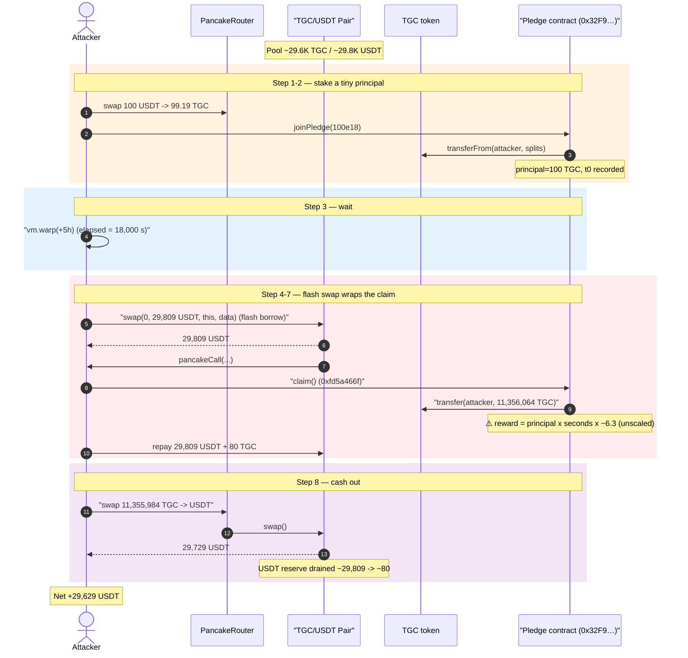
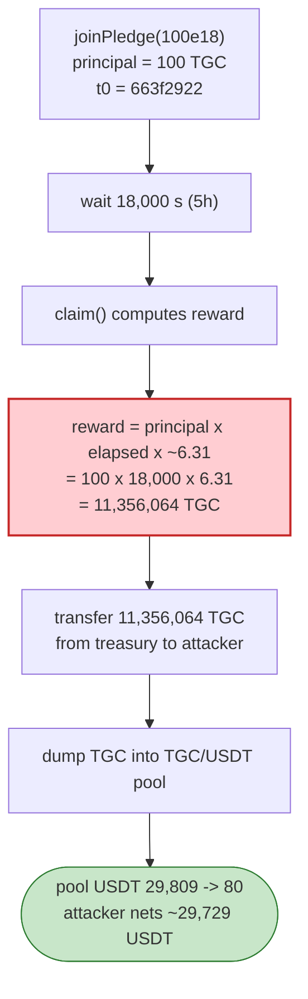
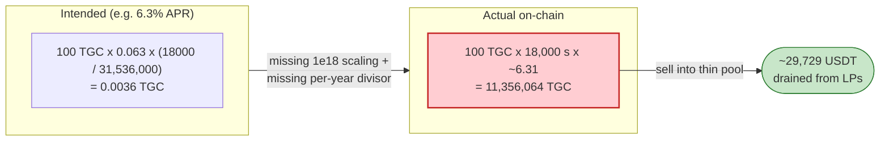

# TGC Exploit — Broken Pledge-Reward Math Mints 113,000× the Stake

> **Reproduction:** the PoC compiles & runs in an isolated Foundry project at
> [this project folder](.) (the umbrella DeFiHackLabs repo contains many unrelated
> PoCs that do not compile together, so this one was extracted).
> Full verbose trace: [output.txt](output.txt).
> The vulnerable pledge contract `0x32F9188d…` is **unverified** on BscScan, so its
> source is reconstructed below from the decoded trace, the emitted events, and the
> raw storage diffs. The TGC token source is verified:
> [contracts_TGC_TGC.sol](sources/ERC20TGC_523aA2/contracts_TGC_TGC.sol).

---

## Key info

| | |
|---|---|
| **Loss** | ~$29.6K (PoC, this block) / ~$32K reported — **≈29,729 USDT** drained from the TGC/USDT PancakeSwap pair |
| **Vulnerable contract** | TGC "Pledge/Staking" contract (unverified) — [`0x32F9188d6D86Bf88dbAc3ceEe5958aDf1aa609df`](https://bscscan.com/address/0x32F9188d6D86Bf88dbAc3ceEe5958aDf1aa609df) |
| **Token** | `TGC` (verified ERC20) — [`0x523aA213FE806778Ffa597b6409382fFfcc12De2`](https://bscscan.com/address/0x523aA213FE806778Ffa597b6409382fFfcc12De2#code) |
| **Victim pool** | TGC/USDT PancakeSwap pair — `0xBb33668bAe76A6394683DeEf645487e333b8fC45` |
| **Attacker EOA** | `0x36fb87c3e65ec608d37e38bd556fb6ebdb3d8a39` |
| **Attack contract** | `0x3E1c5Ddd39801C1e72e5aB7E19c614fd398747f8` |
| **Attack tx** | `0x12e8c24dec36a29fdd9b9d7a8b587b3abd2519089b6438c194e6e5eb357b68d8` |
| **Chain / block / date** | BSC / 38,623,654 / May 11, 2024 |
| **Compiler** | Pledge contract: unverified. TGC token: Solidity v0.8.6, optimizer 200 runs |
| **Bug class** | Broken reward accounting — unscaled time-based interest mints reward ≫ principal |

---

## TL;DR

The TGC "pledge" contract lets a user stake TGC (`joinPledge(amount)`, selector `0x836aefb0`)
and later claim accrued rewards (`claim()`, selector `0xfd5a466f`). The reward formula is
**catastrophically mis-scaled**: it accrues roughly `principal × elapsedSeconds × ~6.3` TGC,
with no `1e18` / per-year normalization. After staking just **100 TGC** and waiting **5 hours**
(18,000 s), the claim minted **11,356,064 TGC** to the attacker — a **114,585×** return on
principal, equal to **~1.1% of TGC's entire 1.024B supply**, paid in a single call.

The attacker:

1. Buys ~99 TGC from the TGC/USDT pool with 100 USDT.
2. Calls `joinPledge(100e18)` — recorded principal = 100 TGC, timestamp = `t0`.
3. `vm.warp(+5 hours)`.
4. Inside a PancakeSwap **flash swap** (used purely to source/repay liquidity atomically),
   calls `claim()` → the contract transfers **11.356M TGC** of its held balance to the attacker.
5. Dumps the 11.356M TGC into the tiny (~29.7K-TGC) pool, draining **≈29,729 USDT**.

Net profit ≈ **29,629 USDT** from a 200-USDT starting balance.

---

## Background — what the protocol does

**TGC** ([source](sources/ERC20TGC_523aA2/contracts_TGC_TGC.sol)) is a plain OpenZeppelin ERC20
with a small sell-side fee. On a *sell* (transfer to the pair), it burns 1% to dead and routes 2%
to a "trad" address ([contracts_TGC_TGC.sol:94-100](sources/ERC20TGC_523aA2/contracts_TGC_TGC.sol#L94-L100)):

```solidity
function _transfer(address from, address to, uint256 amount) internal override {
    ...
    bool takeFee;
    if (isBai(from) || isBai(to)) takeFee = true;   // whitelisted addresses pay no fee
    if (!takeFee) {
        if (isPair(to)) {                            // sell
            uint256 _dead_amt = calcFmt(amount, 1);  // 1% -> dead
            uint256 _trad_amt = calcFmt(amount, 2);  // 2% -> tradAddr
            super._transfer(from, deadAddr, _dead_amt);
            super._transfer(from, tradAddr, _trad_amt);
            amount = amount.sub(_dead_amt).sub(_trad_amt);
        }
    }
    super._transfer(from, to, amount);
}
```

Total supply is minted once in the constructor: `_mint(_owner, 10_2400_0000 * 1e18)` =
**1,024,000,000 TGC** ([:61](sources/ERC20TGC_523aA2/contracts_TGC_TGC.sol#L61)). The token itself
is **not** the bug — it is an unwitting source of value.

The **pledge contract** `0x32F9188d…` is a separate, unverified staking program that holds a large
TGC treasury (it had **>11.3M TGC** on hand) and pays time-based rewards to pledgers. Its two
relevant entry points, recovered from the trace:

- `joinPledge(uint256 amount)` — selector **`0x836aefb0`**: pulls `amount` TGC from the caller
  (split via the token's sell-tax into 39.6% to the contract, 9.9% to a partner, 49.5% burned),
  records the **gross** `amount` (100 TGC) as the pledge principal in storage slot
  `0xf9ce…41d3` and the join timestamp in slot `0x1610…4440`, and emits a "Pledged" event
  (topic `0xae5a6755…`).
- `claim()` — selector **`0xfd5a466f`**: reads the recorded principal and elapsed time, computes a
  reward, **transfers that reward in TGC from the contract's own treasury to the caller**, then
  zeroes the principal/timestamp slots and emits a "Claimed" event (topic `0x213164b3…`).

---

## The vulnerable code

The pledge contract is unverified, so there is no Solidity to quote. The behaviour is fully
determined by the trace and the emitted-event payloads below. The bug lives entirely in the
reward computation inside `claim()` (`0xfd5a466f`).

### What `joinPledge(100e18)` recorded — [output.txt:92-123](output.txt#L92)

```text
0x32F9188d…::joinPledge(100000000000000000000)            # principal arg = 100 TGC
  TGC.transferFrom(attacker -> 0x32F9188d…, 39.642 TGC)    # 39.6% kept (post sell-tax split)
  TGC.transferFrom(attacker -> 0xc31Cc…,    9.910 TGC)     #  9.9% to partner
  TGC.transferFrom(attacker -> dead,       49.552 TGC)     # 49.5% burned
  emit 0xae5a6755…(attacker, 100e18, 99.106e18, ts=0x663f2922)
  storage:
    @ 0xf9ce…41d3 : 0 -> 100e18      # ← pledge PRINCIPAL = 100 TGC (gross arg, not net received)
    @ 0x1610…4440 : 0 -> 0x663f2922  # ← join timestamp t0
    @ 0x5f21…fec1 : 0 -> 1           # ← "has active pledge" flag
```

The principal stored is the **full 100 TGC argument**, even though the contract only actually
received 39.6 TGC after the token's sell-tax. (Already generous, but irrelevant next to the real
flaw.)

### What `claim()` (`0xfd5a466f`) paid out — [output.txt:134-150](output.txt#L134)

```text
0x32F9188d…::fd5a466f()                                    # claim, 5 hours after join
  TGC.transfer(0x32F9188d… -> attacker, 11_356_064.111 TGC) # ← REWARD paid from treasury
  emit 0x213164b3…(attacker, 100.6e18, 11_356_064.11e18, ts=0x663f6f72)
  storage:
    @ 0xf9ce…41d3 : 100e18    -> 0    # principal cleared
    @ 0x1610…4440 : 0x663f2922 -> 0   # timestamp cleared
```

Decoding the "Claimed" event payload:

| Field | Raw | Decoded |
|---|---|---|
| pledger | `0x7FA9385bE…1496` | attacker |
| principal-ish | `0x05741afeff944c0000` | **100.6 TGC** |
| **reward** | `0x0964bd78108e68fb98632a` | **11,356,064.11 TGC** |
| claim ts | `0x663f6f72` | 1,715,433,330 (= t0 + 18,000 s) |

### Reconstructing the formula

With `principal = 100 TGC`, `elapsed = 18,000 s`, `reward = 11,356,064.11 TGC`:

```
reward / (principal × elapsed) = 11,356,064.11 / (100 × 18,000) ≈ 6.31
```

i.e. the contract pays roughly **`principal × elapsedSeconds × 6.31` TGC** — a per-second rate of
~6.3 *times the principal*, with **no division by `1e18`, no per-year denominator, and no cap**.
A correctly-scaled APR (say 6.3% / year) would have paid `100 × 0.063 × (18000/31_536_000) ≈ 0.0036`
TGC. The contract instead paid **11.36 million TGC** — off by roughly **3.1 billion×**. This is the
classic "reward rate stored/applied without fixed-point scaling and without normalizing by a time
period" mistake.

---

## Root cause — why it was possible

1. **Unscaled, unbounded time-based reward.** The claim formula multiplies principal by raw elapsed
   *seconds* and a large unscaled coefficient, with no `1e18` fixed-point divisor and no per-period
   normalization. Over any non-trivial wait, the reward explodes far beyond the principal — and far
   beyond anything the staker actually deposited.

2. **Reward paid from a pre-funded treasury, not from real yield.** The contract simply
   `transfer`s TGC it already holds. There is no source of genuine yield backing the payout, so the
   only limit is the contract's TGC balance (it held >11.3M TGC). The formula happily authorised
   ~1.1% of total supply for a 100-TGC, 5-hour position.

3. **Principal is attacker-chosen and trivially small.** Because the multiplier is so large, even a
   tiny principal (100 TGC, bought for 100 USDT) produces a payout worth tens of thousands of
   dollars. There is no minimum-time lock that would make the absurd rate obvious, and no per-user
   or global cap on rewards.

4. **The payout token is liquid against USDT.** A pre-existing PancakeSwap TGC/USDT pool let the
   attacker convert the freshly-minted reward straight into USDT. The pool was *small* (~29.7K TGC /
   ~29.7K USDT), so 11.3M TGC dumped into it drained essentially the entire USDT reserve — the pool
   size, not the bug, is what capped the realised profit at ~$30K.

The flash swap in the PoC is **not** part of the vulnerability; it is an atomic plumbing trick to
borrow/repay USDT around the claim+dump so the whole thing settles in one transaction (see the
walkthrough). The vulnerability is purely the broken reward math in `claim()`.

---

## Preconditions

- An **active pledge** exists: the attacker first calls `joinPledge(100e18)` and approves the
  contract to pull TGC (`TGC.approve(0x32F9188d…, type(uint256).max)`,
  [TGC_exp.sol:61-63](test/TGC_exp.sol#L61-L63)).
- **Elapsed time** since the pledge: the larger, the bigger the reward. The PoC uses
  `vm.warp(block.timestamp + 5 hours)` ([TGC_exp.sol:41](test/TGC_exp.sol#L41)); the live attack
  waited the real interval.
- The pledge contract holds enough TGC to satisfy the inflated reward (it held >11.3M TGC).
- A liquid TGC/USDT pool to cash out (PancakeSwap pair `0xBb33…fC45`).
- Tiny working capital: the attacker started with 200 USDT, used 100 to buy the 100-TGC stake.

---

## Attack walkthrough (with on-chain numbers from the trace)

The pair's `token0 = TGC`, `token1 = USDT` (the final dump shows `amount0In = 11.3M TGC`).
Reserves from `getReserves()`/`Sync` in [output.txt](output.txt).

| # | Step | Trace | TGC moved | USDT moved | Notes |
|---|------|-------|----------:|-----------:|-------|
| 0 | **Start** | [:43](output.txt#L43) | — | 200 in wallet | `deal`ed 200 USDT. |
| 1 | **Buy seed TGC** — swap 100 USDT → 99.19 TGC | [:51-86](output.txt#L51) | +99.19 to attacker | −100 | Acquire stake. |
| 2 | **Approve + `joinPledge(100e18)`** | [:87-123](output.txt#L87) | −99.10 (39.6→contract, 9.9→partner, 49.5→burned) | — | Principal=100 TGC, t0=`663f2922`. |
| 3 | **`vm.warp(+5h)`** | [:124](output.txt#L124) | — | — | elapsed = 18,000 s. |
| 4 | **Flash-borrow 29,809 USDT** via `Pair.swap(0, 29809e18, this, data)` | [:126-128](output.txt#L126) | — | +29,809 (loan) | Triggers `pancakeCall`. |
| 5 | inside `pancakeCall`: **`claim()`** (`0xfd5a466f`) | [:134-150](output.txt#L134) | **+11,356,064 TGC** to attacker | — | ⚠️ broken reward paid from treasury. |
| 6 | repay pair: transfer 29,809 USDT back | [:151-156](output.txt#L151) | — | −29,809 (repay) | Flash loan made whole. |
| 7 | repay pair: transfer 80 TGC (+ sell-tax) | [:157-166](output.txt#L157) | −80 | — | Satisfies pair K on the borrow. |
| 8 | **Dump 11,355,984 TGC → USDT** via router | [:181-223](output.txt#L181) | −11.36M (10% sell-tax to dead+trad, rest to pool) | +29,729 to attacker | Drains pool's USDT reserve. |
| 9 | **End** | [:224-226](output.txt#L224) | — | **29,829 in wallet** | Profit booked. |

After step 8 the pool's USDT reserve (`token1`) collapses from ~29,809 to ~80 USDT
([Sync at :216](output.txt#L216): `reserve0=11,044,924 TGC, reserve1=80 USDT`) — the attacker
extracted essentially the entire USDT side of the pool with worthless inflated TGC.

### Profit accounting (USDT)

| Item | Amount (USDT) |
|---|---:|
| Starting balance (`deal`) | 200.00 |
| Spent buying seed TGC | −100.00 |
| Flash-loan USDT borrowed | +29,809.00 |
| Flash-loan USDT repaid | −29,809.00 |
| USDT received from dumping 11.36M TGC | +29,729.12 |
| **Ending balance** | **29,829.12** |
| **Net profit** | **+29,629.12** |

The reported ~$32K differs slightly from the PoC's ~$29.6K because the exact pool reserves and TGC
price vary with the chosen fork block; the mechanism and order of magnitude match.

---

## Diagrams

### Sequence of the attack



### Pledge state and reward blow-up



### Why the reward is broken — scale comparison



---

## Remediation

1. **Fix the reward scaling.** Reward must be computed with explicit fixed-point math and a real
   time base, e.g. `reward = principal * ratePerYearWad * elapsed / (SECONDS_PER_YEAR * 1e18)`.
   Unit-test the formula at boundary inputs (1 second, 1 year) and assert `reward ≤ principal` for
   any reasonable APR over the lock period.
2. **Cap rewards.** Enforce a hard ceiling per claim (e.g. `reward ≤ principal` for sane APRs over
   the max lock) and revert if the computed reward exceeds the contract's funded reward budget or a
   global maximum. A reward worth 1.1% of total token supply for a 100-token, 5-hour position should
   be impossible by construction.
3. **Back rewards with a funded, accounted budget.** Don't pay rewards out of an unbounded treasury
   balance; track an explicit `rewardsRemaining` that is decremented and can never authorise more
   than was provisioned.
4. **Record net, not gross, principal.** Store the amount actually received (post fee-on-transfer),
   not the function argument, so a fee-on-transfer token cannot be used to over-credit principal.
5. **Audit reward math separately from the token.** The token here was fine; the loss came entirely
   from the staking program. Reward/interest formulas deserve dedicated fixed-point review and
   invariant fuzzing (`reward` monotonic, bounded, and dimensionally correct).

---

## How to reproduce

The PoC was extracted into a standalone Foundry project (the umbrella DeFiHackLabs repo has many
unrelated PoCs that fail to compile together under one `forge test`):

```bash
_shared/run_poc.sh 2024-05-TGC_exp -vvvvv
```

- RPC: a **BSC archive** endpoint is required (fork block 38,623,654, May 2024). `foundry.toml`
  uses `https://bsc-mainnet.public.blastapi.io`, which serves historical state at that block; the
  default public OnFinality endpoint hits a 429 rate-limit and must be swapped out.
- Result: `[PASS] testExploit()`. The attacker's USDT goes from **200** to **≈29,829**
  (~**+29,629 USDT** profit).

Expected tail:

```
Ran 1 test for test/TGC_exp.sol:ContractTest
[PASS] testExploit() (gas: 353802)
  [Begin] Attacker USDT before exploit: 200.000000000000000000
  [End] Attacker USDT after exploit: 29829.119514728633925548
Suite result: ok. 1 passed; 0 failed; 0 skipped
```

---

*Reference: ChainAegis — https://x.com/ChainAegis/status/1789490986588205529 (TGC, BSC, ~$32K).*
