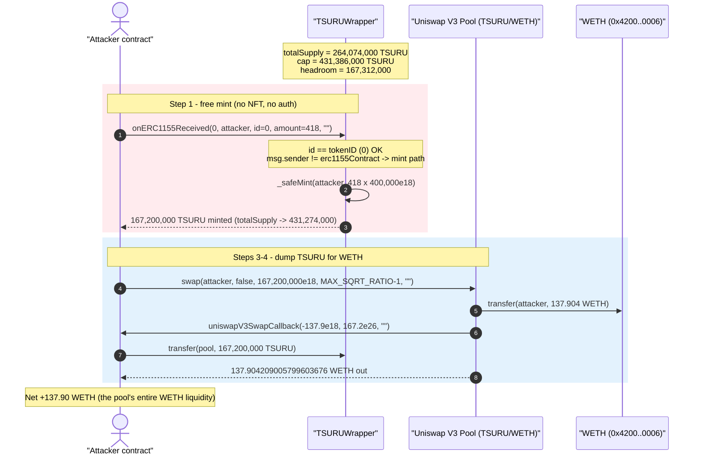
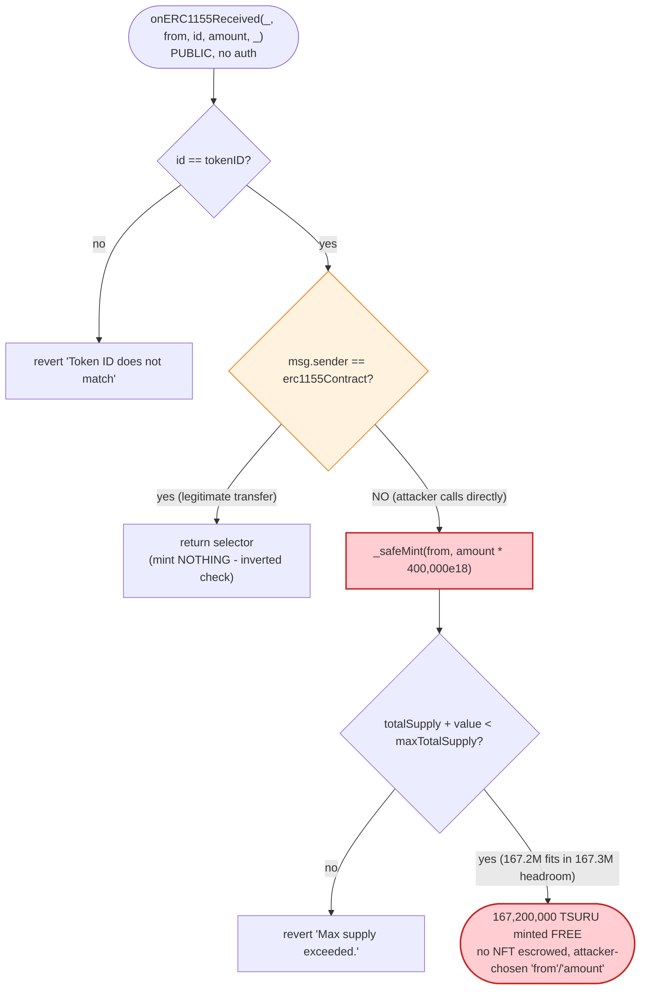
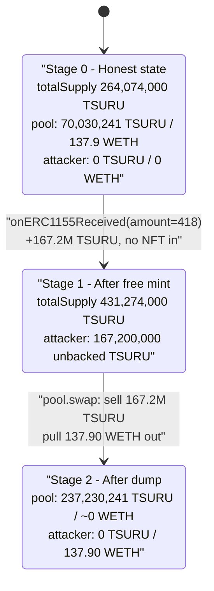

# TSURU Wrapper Exploit — Unprotected `onERC1155Received` Free-Mint Drains the LP

> **Vulnerability classes:** vuln/access-control/missing-auth · vuln/access-control/missing-modifier

> **Reproduction:** the PoC compiles & runs in an isolated Foundry project at
> [this project folder](.) (the umbrella DeFiHackLabs repo does not whole-compile,
> so this PoC was extracted). Full verbose trace:
> [output.txt](output.txt). Verified vulnerable source:
> [TSURUWrapper.sol](sources/TSURUWrapper_75Ac62/TSURUWrapper.sol).

---

## Key info

| | |
|---|---|
| **Loss** | ~$140K — **137.904209005799603676 WETH** drained from the TSURU/WETH Uniswap V3 pool |
| **Vulnerable contract** | `TSURUWrapper` — [`0x75Ac62EA5D058A7F88f0C3a5F8f73195277c93dA`](https://basescan.org/address/0x75Ac62EA5D058A7F88f0C3a5F8f73195277c93dA#code) |
| **Victim pool** | TSURU/WETH Uniswap V3 pool — [`0x913b1658dd001dFF93D3AF2A657523F1eed53917`](https://basescan.org/address/0x913b1658dd001dFF93D3AF2A657523F1eed53917) |
| **Attacker EOA** | [`0x7A5Eb99C993f4C075c222F9327AbC7426cFaE386`](https://basescan.org/address/0x7A5Eb99C993f4C075c222F9327AbC7426cFaE386) |
| **Attacker contract** | [`0xa2209b48506c4e7f3a879ec1c1c2c4ee16c2c017`](https://basescan.org/address/0xa2209b48506c4e7f3a879ec1c1c2c4ee16c2c017) |
| **Attack tx** | [`0xe63a8df8759f41937432cd34c590d85af61b3343cf438796c6ed2c8f5b906f62`](https://basescan.org/tx/0xe63a8df8759f41937432cd34c590d85af61b3343cf438796c6ed2c8f5b906f62) |
| **Chain / block / date** | Base / 14,279,784 / May 9, 2024 |
| **Compiler** | Solidity v0.8.25, optimizer **off** (200 runs nominal) |
| **Bug class** | Missing access control / spoofable ERC-1155 receiver hook → unlimited free token mint |

---

## TL;DR

`TSURUWrapper` is an ERC-20 "wrapper" that is supposed to mint TSURU only when someone *actually
transfers in* a backing ERC-1155 (or ERC-721) NFT. The minting logic lives entirely inside the
ERC-1155 receiver callback `onERC1155Received(...)`
([TSURUWrapper.sol:1844-1859](sources/TSURUWrapper_75Ac62/TSURUWrapper.sol#L1844-L1859)).

That callback is a **plain `external` function with no access control**. It blindly mints
`amount * ERC1155_RATIO` ERC-20 tokens to the `from` argument it is handed. It only:

1. checks `id == tokenID`, and
2. *short-circuits without minting* if `msg.sender == erc1155Contract`.

Both checks are trivially satisfiable by an attacker calling the hook **directly** from their own
contract (so `msg.sender != erc1155Contract`) with `id == tokenID` (which is `0` here). No NFT is
ever escrowed; the `amount` parameter is fully attacker-controlled. The function mints free TSURU
out of thin air to the caller.

`ERC1155_RATIO = 400_000 * 1e18`, so one call with `amount = 418` mints
`418 × 400,000 = 167,200,000` TSURU. The attacker chose **418** specifically to push `totalSupply`
right up against the `_maxTotalSupply` cap (`431,386,000`) — the maximum mint that still passes the
supply check. They then dumped the entire 167.2M TSURU into the TSURU/WETH Uniswap V3 pool and
walked away with **137.90 WETH** (~$140K).

---

## Background — what TSURUWrapper does

`TSURUWrapper` ([source](sources/TSURUWrapper_75Ac62/TSURUWrapper.sol)) is an ERC-20 token meant to
be a fungible "wrapper" around a specific ERC-1155 / ERC-721 collectible:

- **Wrapping (the intended flow).** A holder `safeTransferFrom`s their backing NFT into the wrapper.
  The standard ERC-1155/721 safe-transfer machinery then fires the wrapper's receiver hook, which is
  *supposed* to mint the corresponding ERC-20 amount to the depositor. Conversion ratios:
  `1 ERC-721 = 400 TSURU` (`ERC721_RATIO`) and
  `1 ERC-1155 = 400,000 TSURU` (`ERC1155_RATIO`)
  ([TSURUWrapper.sol:1777-1779](sources/TSURUWrapper_75Ac62/TSURUWrapper.sol#L1777-L1779)).
- **Unwrapping.** `unwrap()` burns ERC-20 and returns the underlying ERC-1155
  ([TSURUWrapper.sol:1871-1890](sources/TSURUWrapper_75Ac62/TSURUWrapper.sol#L1871-L1890)).
- **Supply cap.** `_safeMint` enforces a hard ceiling `_maxTotalSupply = 431,386,000 * 1e18`
  ([TSURUWrapper.sol:1922-1931](sources/TSURUWrapper_75Ac62/TSURUWrapper.sol#L1922-L1931)).
- **Seed mint.** The constructor pre-mints `258,831,600` TSURU to eight project addresses
  ([TSURUWrapper.sol:1822-1829](sources/TSURUWrapper_75Ac62/TSURUWrapper.sol#L1822-L1829)).

State at the fork block (read from the trace):

| Parameter | Value |
|---|---|
| `ERC1155_RATIO` | **400,000 × 1e18** TSURU per 1 ERC-1155 |
| `tokenID` | **0** (so the attacker passes `id = 0`) |
| `_maxTotalSupply` | 431,386,000 TSURU |
| `totalSupply` (before exploit) | **264,074,000** TSURU |
| Headroom to cap | 431,386,000 − 264,074,000 = **167,312,000** TSURU |
| TSURU held by the V3 pool (before dump) | 70,030,241.19 TSURU |
| WETH held by the V3 pool (the prize) | **~137.9 WETH** |

The headroom (167.31M) is the only constraint on the attack. `amount = 418` mints
167.20M ≤ 167.31M, which fits — `amount = 419` would mint 167.60M and revert on the cap. The attacker
maximized the free mint within that ceiling.

---

## The vulnerable code

### 1. The mint hook has no access control and never escrows an NFT

```solidity
// TSURUWrapper.sol:1844-1859
function onERC1155Received(
    address,
    address from,
    uint256 id,
    uint256 amount,
    bytes calldata
) external override nonReentrant returns (bytes4) {
    require(id == tokenID, "Token ID does not match");

    if (msg.sender == address(erc1155Contract)) {
        return this.onERC1155Received.selector;
    }

    _safeMint(from, amount * ERC1155_RATIO); // Adjust minting based on the ERC1155_RATIO
    return this.onERC1155Received.selector;
}
```

This is the entire bug. The function:

- is **callable by anyone** — it is `external` with no `onlyOwner`/role gate, no caller whitelist;
- **trusts the `from` and `amount` arguments** the caller passes in;
- mints `amount * ERC1155_RATIO` ERC-20 to `from` **without ever verifying that a real ERC-1155 token
  was transferred to the wrapper** (no balance delta check, no escrow accounting);
- has its caller-check **inverted**: when `msg.sender == erc1155Contract` (the *legitimate*
  transfer path) it returns the selector and mints **nothing**; only when the caller is *not* the
  real ERC-1155 contract does it mint. An attacker calling directly from their own contract is, by
  construction, "not the ERC-1155 contract," so they fall straight into the `_safeMint` branch.

### 2. The only guard that fires is the supply cap

```solidity
// TSURUWrapper.sol:1922-1931
function _safeMint(address account, uint256 value) internal {
    require(_maxTotalSupply > totalSupply() + value, "Max supply exceeded.");
    _mint(account, value);
    if (_balancesOfOwner[account] == 0) {
        ++_holders;
    }
    _balancesOfOwner[account] = _balancesOfOwner[account] + value;
}
```

`_safeMint` only checks the hard supply cap. It does **not** verify backing collateral, caller
identity, or that any deposit occurred. So the cap is the sole bound on how much the attacker can
print in one shot — hence the deliberate choice of `amount = 418`.

For comparison, the ERC-721 hook ([TSURUWrapper.sol:1832-1842](sources/TSURUWrapper_75Ac62/TSURUWrapper.sol#L1832-L1842))
*does* require `msg.sender == address(erc721Contract)` and `_opened`, so it cannot be spoofed the same
way. The ERC-1155 hook is missing exactly that `msg.sender` check (its check is inverted into a no-op
short-circuit instead).

---

## Root cause — why it was possible

ERC-1155 / ERC-721 receiver hooks (`onERC1155Received`, `onERC721Received`) are **callbacks invoked
by the token contract during a `safeTransferFrom`**. They are *not* deposit functions and must never
be trusted as a source of funds, because **anyone can call them directly** with arbitrary arguments.
The secure pattern is:

> The receiver hook must verify `msg.sender == <the expected token contract>` and may only credit the
> *escrowed* asset. The actual minting/credit must be derived from a measured balance delta or from
> escrow accounting that `safeTransferFrom` actually performed — never from the `amount`/`from`
> arguments alone.

`TSURUWrapper.onERC1155Received` does the opposite of every part of that pattern:

1. **No caller authentication.** The function should require `msg.sender == address(erc1155Contract)`.
   Instead it inverts the check: it treats the real ERC-1155 caller as a no-op and mints for
   *everyone else*. An attacker simply calls it from their own EOA-controlled contract.
2. **No backing escrow.** The function mints `amount * ERC1155_RATIO` purely from the `amount`
   argument, with no check that the wrapper's ERC-1155 balance actually increased by `amount`. There
   is no `balanceBefore/balanceAfter` reconciliation. The "wrapper" never actually wraps anything.
3. **Attacker-chosen `from`.** Because `from` is a parameter, the attacker mints directly to their own
   address.
4. **The supply cap is the only limit, and it is huge.** With 167.3M tokens of headroom, a single call
   prints enough supply to swamp the on-chain liquidity several times over.

The net effect: the wrapper's ERC-20 is supposed to be 1:1 backed by escrowed NFTs, but the attacker
minted 167.2M unbacked tokens for free and converted that fake supply into real WETH liquidity sitting
in the AMM pool.

---

## Preconditions

- `totalSupply() + amount*ERC1155_RATIO < _maxTotalSupply`. The attacker reads the current supply and
  picks the largest `amount` that fits under the cap (`amount = 418` → 167.20M ≤ 167.31M headroom).
- `id == tokenID` (here `tokenID = 0`, so the attacker passes `id = 0`).
- The caller is **not** the real ERC-1155 contract — automatically true for any attacker contract.
- A liquid TSURU market exists to sell the minted tokens into. Here a TSURU/WETH Uniswap V3 pool held
  ~137.9 WETH of real liquidity, which becomes the realized loss.
- **No capital required.** The mint is free; the only "cost" is gas. The attack is fully atomic and
  needs no flash loan.

---

## Attack walkthrough (with on-chain numbers from the trace)

All figures are taken directly from [output.txt](output.txt). The PoC reproduces the live attack with
two calls: the free mint, then a single V3 swap. The Uniswap V3 pool has
`token0 = WETH (0x4200…0006)`, `token1 = TSURU`.

| # | Step | Call | Result |
|---|------|------|--------|
| 0 | **Initial** | — | Wrapper `totalSupply = 264,074,000` TSURU; pool holds 70,030,241.19 TSURU / ~137.9 WETH. Attacker holds 0. |
| 1 | **Free mint** | `wrapper.onERC1155Received(0, attacker, 0, 418, "")` | `_safeMint(attacker, 418 × 400,000e18)` → **167,200,000 TSURU** minted to attacker. `totalSupply` 264,074,000 → **431,274,000** (just under the 431,386,000 cap). No NFT transferred. |
| 2 | **Verify mint** | `wrapper.balanceOf(attacker)` | `167,200,000e18` ✓ |
| 3 | **Dump into V3 pool** | `pool.swap(attacker, false, 167,200,000e18, MAX_SQRT_RATIO-1, "")` | One-for-zero swap (TSURU in, WETH out). Pool sends out **137.904209005799603676 WETH**. |
| 4 | **Swap callback** | `uniswapV3SwapCallback(-137.9e18, 167.2e26, "")` | Attacker pays the pool the owed **167,200,000 TSURU**. Pool TSURU balance 70,030,241.19 → **237,230,241.19**. |
| 5 | **Final** | `WETH.balanceOf(attacker)` | **137.904209005799603676 WETH** (~$140K). |

The mint in step 1 is verifiable directly in the storage diff: the wrapper's `totalSupply` slot (`@2`)
moves from `0x…da6fd8398f904062400000` (264,074,000e18) to `0x…164bdd2630701da56400000`
(431,274,000e18) — a delta of exactly **167,200,000e18** — and an internal counter slot (`@8`)
increments `280 → 281` (`_holders`). No ERC-1155 `TransferSingle` appears anywhere in the trace,
confirming no NFT was ever moved.

### Profit / loss accounting

| Item | Amount |
|---|---:|
| Capital in (gas only) | ~0 |
| TSURU minted for free | 167,200,000 TSURU |
| TSURU sold into the V3 pool | 167,200,000 TSURU |
| **WETH extracted (attacker profit)** | **+137.904209005799603676 WETH** |
| Pool WETH reserve before | ~137.9 WETH |
| Pool WETH reserve after | ~0 (drained) |
| **Victim LP loss** | **−137.90 WETH (~$140K)** |

The attacker's profit equals essentially the entire WETH side of the pool — the real liquidity that
honest LPs had supplied was bought up with worthless, freshly-minted, unbacked TSURU.

---

## Diagrams

### Sequence of the attack



### Mint-hook control flow (the flaw)



### Wrapper supply & pool state evolution



---

## Why `amount = 418`

The free mint is bounded only by the supply cap:

```
_maxTotalSupply  = 431,386,000 TSURU
totalSupply      = 264,074,000 TSURU   (at fork block)
headroom         = 167,312,000 TSURU

mint(amount)     = amount × ERC1155_RATIO = amount × 400,000 TSURU
amount = 418     → 167,200,000 TSURU  ≤ 167,312,000  ✓ (mints, leaves 112,000 slack)
amount = 419     → 167,600,000 TSURU  >  167,312,000  ✗ (reverts on 'Max supply exceeded.')
```

So `418` is the largest single-call mint the cap allows. The attacker prints the maximum and dumps it,
extracting as much WETH as the pool will give for 167.2M TSURU (≈ the pool's full WETH reserve).

---

## Remediation

1. **Authenticate the receiver hook.** `onERC1155Received` must require
   `msg.sender == address(erc1155Contract)` (and `onERC1155BatchReceived` likewise). The current check
   is inverted — it mints for *everyone except* the real token contract. Fix:
   ```solidity
   require(msg.sender == address(erc1155Contract), "Unauthorized token");
   ```
   exactly as the ERC-721 hook already does
   ([TSURUWrapper.sol:1839](sources/TSURUWrapper_75Ac62/TSURUWrapper.sol#L1839)).
2. **Never trust the hook's `amount`/`from` arguments for accounting.** Mint based on the *actual*
   escrowed balance. Measure the wrapper's ERC-1155 balance before and after, or maintain explicit
   escrow accounting, and mint only against the verified delta. A receiver hook is a notification, not
   a deposit primitive.
3. **Gate minting behind an explicit deposit function.** Rather than minting inside a callback, expose
   a `wrap(uint256 amount)` that pulls the NFT via `safeTransferFrom` from `msg.sender`, confirms
   receipt, and then mints. The receiver hook should only acknowledge receipt (return the selector),
   never mint.
4. **Do not rely on the supply cap as a security control.** The cap merely limited the *size* of this
   exploit; it did not prevent it. With a smaller cap the attacker would simply repeat the call across
   transactions (subject to unwrap/burn cycling) or target the full available headroom.

---

## How to reproduce

The PoC was extracted into a standalone Foundry project (the umbrella DeFiHackLabs repo has many
unrelated PoCs that fail under a whole-project `forge build`):

```bash
_shared/run_poc.sh 2024-05-TSURU_exp -vvvvv
```

- RPC: a **Base archive** endpoint is required (fork block 14,279,784 is from May 2024 and is pruned
  by most public/Infura free-tier nodes — they return `error code 4444: pruned history unavailable`).
  `foundry.toml` uses `https://base.drpc.org`, which serves historical state at that block. Other
  working archives observed: `https://base-mainnet.public.blastapi.io`, `https://mainnet.base.org`.
- Note: the contemporary `basetest.sol` exposed a `getFundingBal()` helper that has since been removed
  from the shared base test in the main repo. The extracted project restores it in
  [basetest.sol](basetest.sol) so the PoC's `assertEq(getFundingBal(), expectedETH)` resolves.

Expected tail:

```
Ran 1 test for test/TSURU_exp.sol:TsuruExploit
[PASS] testExploit() (gas: 191196)
  Attacker Before exploit WETH Balance: 0.000000000000000000
  Attacker After exploit WETH Balance: 137.904209005799603676
Suite result: ok. 1 passed; 0 failed; 0 skipped
```

---

*References:*
- *Post-mortem: https://base.tsuru.wtf/usdtsuru-exploit-incident-report*
- *SlowMist: https://x.com/SlowMist_Team/status/1788936928634834958*
- *Analysis thread: https://x.com/shoucccc/status/1788941548929110416*
