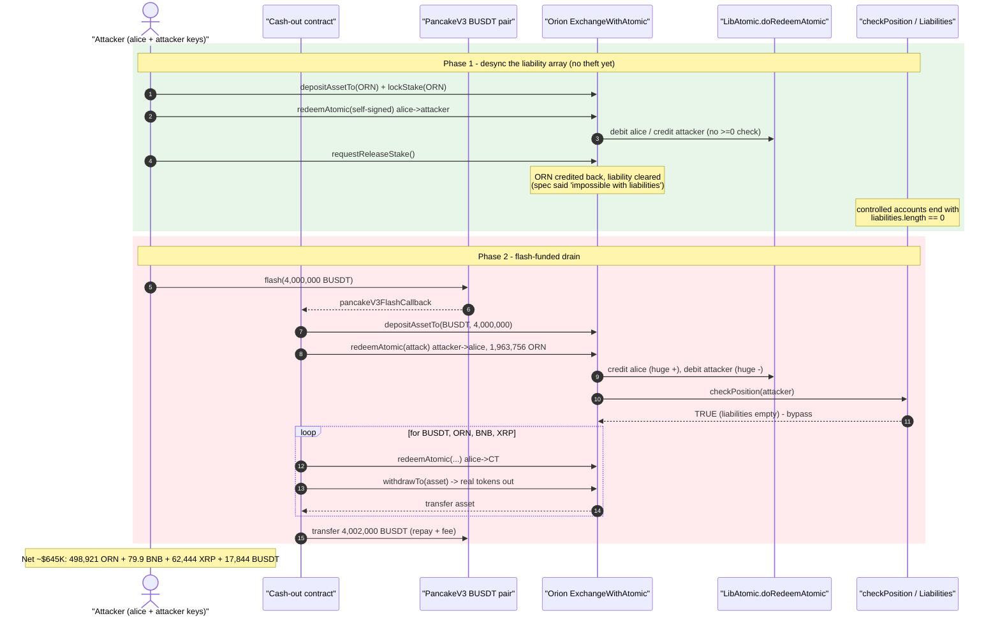
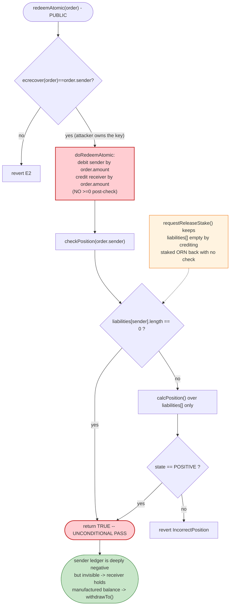
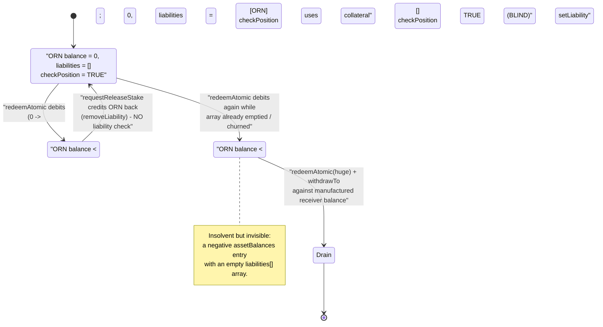

# Trade On Orion (Orion Protocol BSC) Exploit — `redeemAtomic` Missing Position Check + Liability-Free `requestReleaseStake`

> **Vulnerability classes:** vuln/logic/missing-check · vuln/logic/incorrect-state-transition

> **Reproduction:** the PoC compiles & runs in an isolated Foundry project at
> [this project folder](.) (the umbrella DeFiHackLabs repo does not whole-compile,
> so this PoC was extracted).
> Full verbose trace: [output.txt](output.txt).
> Verified vulnerable sources: [LibAtomic](sources/LibAtomic_956036/contracts_libs_LibAtomic.sol),
> [ExchangeWithAtomic](sources/ExchangeWithGenericSwap_C662ce/contracts_ExchangeWithAtomic.sol),
> [OrionVault](sources/ExchangeWithGenericSwap_C662ce/contracts_OrionVault.sol),
> [MarginalFunctionality](sources/MarginalFunctionality_C619Cd/contracts_libs_MarginalFunctionality.sol).

---

## Key info

| | |
|---|---|
| **Loss** | **~$645K** — drained from the Orion Exchange vault as **498,921.92 ORN + 79.90 BNB + 62,444.73 XRP + 17,844.69 BUSDT** |
| **Vulnerable contract** | Orion `ExchangeWithAtomic` (proxy) — [`0xe9d1D2a27458378Dd6C6F0b2c390807AEd2217Ca`](https://bscscan.com/address/0xe9d1D2a27458378Dd6C6F0b2c390807AEd2217Ca#code) |
| **Vulnerable logic** | `LibAtomic.doRedeemAtomic` — [`0x9560364B11512b52B5550444b8f9f552b4D8959B`](https://bscscan.com/address/0x9560364B11512b52B5550444b8f9f552b4D8959B#code) + `OrionVault.requestReleaseStake` (impl [`0xC662cea3D8d6660CA97Fb9Ff98122DA69A199CD8`](https://bscscan.com/address/0xC662cea3D8d6660CA97Fb9Ff98122DA69A199CD8#code)) |
| **Victim** | Orion Exchange vault (pooled user deposits); flash liquidity from PancakeV3 `BUSDT` pair `0x36696169C63e42cd08ce11f5deeBbCeBae652050` |
| **Attacker EOA** | [`0x51177db1ff3b450007958447946a2eee388288d2`](https://bscscan.com/address/0x51177db1ff3b450007958447946a2eee388288d2) |
| **Attacker contract** | [`0xf8bfac82bdd7ac82d3aeec98b9e1e73579509db6`](https://bscscan.com/address/0xf8bfac82bdd7ac82d3aeec98b9e1e73579509db6) |
| **Attack tx** | [`0x660837a1640dd9cc0561ab7ff6c85325edebfa17d8b11a3bb94457ba6dcae18c`](https://app.blocksec.com/explorer/tx/bsc/0x660837a1640dd9cc0561ab7ff6c85325edebfa17d8b11a3bb94457ba6dcae18c) |
| **Chain / block / date** | BSC / 39,104,878 / May 28, 2024 |
| **Compiler** | Solidity 0.8.15 (Orion contracts) |
| **Bug class** | Missing solvency/position check on a balance-moving primitive (un-collateralized "minting" of internal balances) |

---

## TL;DR

Orion's Exchange keeps an internal ledger of user balances as **signed** integers
(`mapping(address => mapping(address => int192)) assetBalances`). A negative balance is
*allowed* — it is treated as a margin **liability** that must be covered by collateral, and
solvency is enforced through `checkPosition()`.

`redeemAtomic()` is a cross-chain HTLC-style settlement primitive: it moves `amount` of an
asset from a signature-authorized `sender` to a `receiver`. The internal library function
that does the actual ledger movement, [`LibAtomic.doRedeemAtomic`](sources/LibAtomic_956036/contracts_libs_LibAtomic.sol#L82-L98),
**debits `sender` and credits `receiver` with no bound on the amount and no solvency check of
its own.** The only guard is `checkPosition(order.sender)` back in the wrapper
([ExchangeWithAtomic.sol:42-47](sources/ExchangeWithGenericSwap_C662ce/contracts_ExchangeWithAtomic.sol#L42-L47)).

Two facts turn that guard into a no-op:

1. **`checkPosition` returns `true` whenever the user has *no liabilities*** — `if
   (liabilities[user].length == 0) return true;`
   ([Exchange.sol:394-397](sources/ExchangeWithGenericSwap_C662ce/contracts_Exchange.sol#L394-L397)).
2. **`requestReleaseStake()` un-stakes ORN back to the user's balance *without any liability
   check*** — directly contradicting its own doc-comment "*both unlock and withdraw is
   impossible if user has liabilities*"
   ([OrionVault.sol:36-49](sources/ExchangeWithGenericSwap_C662ce/contracts_OrionVault.sol#L36-L49)).

The attacker chains these into a self-signed `redeemAtomic` loop that drives the ledger
negative while never carrying a *tracked* liability at the moment `checkPosition` runs, then
withdraws real tokens against the manufactured positive balances. A `4,000,000 BUSDT`
PancakeV3 flash loan supplies enough working capital to satisfy the per-asset
`assetBalances >= 0` check inside `withdrawTo` and is repaid in the same transaction.

Net theft: **498,921.92 ORN, 79.90 BNB, 62,444.73 XRP, 17,844.69 BUSDT (~$645K)**.

---

## Background — what Orion Exchange does

Orion is a hybrid (matcher-coordinated, on-chain-settled) exchange. The on-chain
`Exchange`/`ExchangeWithAtomic` contract is a **shared vault**: users `depositAssetTo` real
tokens, the contract credits an internal `int192` balance, and trades/withdrawals net against
that ledger. Key building blocks present in the verified sources:

- **Signed-integer ledger with margin.** `assetBalances[user][asset]` is `int192`. Negative =
  the user owes that asset (a **Liability**, tracked in `liabilities[user]`). Collateral health
  is computed by [`MarginalFunctionality.calcPosition`](sources/MarginalFunctionality_C619Cd/contracts_libs_MarginalFunctionality.sol#L154-L197)
  using ORN-denominated oracle prices.
- **Staking as collateral.** `lockStake(amount)` moves ORN from the user's ledger balance into
  a separate `stakingData[user].amount`; `requestReleaseStake()` moves it back
  ([OrionVault.sol](sources/ExchangeWithGenericSwap_C662ce/contracts_OrionVault.sol)).
- **Atomic (HTLC) swaps.** `lockAtomic` / `redeemAtomic` / `claimAtomic` / `refundAtomic`
  implement hash-time-locked cross-chain settlement, all routed through the external
  `LibAtomic` library ([ExchangeWithAtomic.sol](sources/ExchangeWithGenericSwap_C662ce/contracts_ExchangeWithAtomic.sol)).
- **`redeemAtomic` is permissionless** — anyone can submit a `RedeemOrder` as long as it carries
  a valid `sender` signature, and the *caller* freely picks `sender`, `receiver`, `asset`,
  `amount`.

On-chain oracle prices at the fork block (ORN-denominated, `1e8`-scaled, read from
`PriceOracle.assetPrices` in the trace):

| Asset | Price (ORN) |
|---|---:|
| ORN | 1.00000000 |
| BUSDT | 0.69938238 |
| XRP | 0.36822682 |
| BNB | 422.50591320 |

---

## The vulnerable code

### 1. `doRedeemAtomic` moves balances with no solvency guard

[`sources/LibAtomic_956036/contracts_libs_LibAtomic.sol:82-98`](sources/LibAtomic_956036/contracts_libs_LibAtomic.sol#L82-L98):

```solidity
function doRedeemAtomic(
    LibAtomic.RedeemOrder calldata order,
    bytes calldata secret,
    mapping(bytes32 => bool) storage secrets,
    mapping(address => mapping(address => int192)) storage assetBalances,
    mapping(address => MarginalFunctionality.Liability[]) storage liabilities
) public {
    require(!secrets[order.secretHash], "E17R");
    require(getEthSignedAtomicOrderHash(order).recover(order.signature) == order.sender, "E2");
    require(order.expiration / 1000 >= block.timestamp, "E4A");
    require(order.secretHash == keccak256(secret), "E17");
    secrets[order.secretHash] = true;

    LibExchange._updateBalance(order.sender,   order.asset, -1 * int(uint(order.amount)), assetBalances, liabilities);
    LibExchange._updateBalance(order.receiver, order.asset,       int(uint(order.amount)), assetBalances, liabilities);
}
```

Contrast this with the **lock** path, [`doLockAtomic`](sources/LibAtomic_956036/contracts_libs_LibAtomic.sol#L45-L80),
which *does* enforce a non-negative post-condition right after debiting:

```solidity
if (remaining > 0) {
    LibExchange._updateBalance(account, swap.asset, -1 * remaining, assetBalances, liabilities);
    require(assetBalances[account][swap.asset] >= 0, "E1A");   // ← redeem has no equivalent
}
```

`doRedeemAtomic` debits an attacker-chosen `order.amount` (a `uint64` — up to ~1.8e19 base
units) out of `order.sender` and credits `order.receiver`, **with no upper bound and no
`>= 0` post-check.** All inter-account "value" is created out of thin air on the ledger.

### 2. `_updateBalance` converts a deficit into a (sometimes untracked) liability

[`sources/LibAtomic_956036/contracts_libs_LibExchange.sol:43-82`](sources/LibAtomic_956036/contracts_libs_LibExchange.sol#L43-L82):

```solidity
} else if (beforeBalance >= 0 && afterBalance < 0) {
    if (asset != address(0)) {
        afterBalance += int(_tryDeposit(asset, uint(-1 * afterBalance), user)); // try to pull real tokens
    }
    if (afterBalance < 0) {
        setLiability(user, asset, int192(afterBalance), liabilities);           // record a debt
    }
}
```

A balance going negative only becomes a *tracked* liability when it crosses **from ≥0 to <0**.
If the balance is *already* negative (e.g. it was just credited then immediately re-debited in
the loop), `_updateBalance` takes the `amount > 0 && beforeBalance < 0` branch and calls
`updateLiability`, which can **remove the liability entry** once the debt is nominally
"covered" ([MarginalFunctionality.sol:220-243](sources/MarginalFunctionality_C619Cd/contracts_libs_MarginalFunctionality.sol#L220-L243)).
This is what lets the attacker oscillate the liability array length so that, at the instant
`checkPosition` runs, the controlled accounts carry **zero tracked liabilities**.

### 3. `checkPosition` is a no-op when `liabilities.length == 0`

[`sources/ExchangeWithGenericSwap_C662ce/contracts_Exchange.sol:394-397`](sources/ExchangeWithGenericSwap_C662ce/contracts_Exchange.sol#L394-L397):

```solidity
function checkPosition(address user) public view returns (bool) {
    if (liabilities[user].length == 0) return true;     // ← unconditional pass
    return calcPosition(user).state == MarginalFunctionality.PositionState.POSITIVE;
}
```

`calcLiabilities` only ever sums `liabilities[user]` entries
([MarginalFunctionality.sol:121-148](sources/MarginalFunctionality_C619Cd/contracts_libs_MarginalFunctionality.sol#L121-L148)).
A genuinely negative `assetBalances[user][asset]` that is **not present in the liabilities
array** is invisible to the solvency check.

### 4. `requestReleaseStake` ignores liabilities (spec ≠ code)

[`sources/ExchangeWithGenericSwap_C662ce/contracts_OrionVault.sol:36-49`](sources/ExchangeWithGenericSwap_C662ce/contracts_OrionVault.sol#L36-L49):

```solidity
/**
 * @dev Note, both unlock and withdraw is impossible if user has liabilities   // ← documented invariant
 */
function requestReleaseStake() public {
    address user = _msgSender();
    Stake storage stake = stakingData[user];
    assetBalances[user][address(_orionToken)] += int192(uint192(stake.amount)); // credits ORN back...
    emit LibExchange.BalanceChange(user, address(_orionToken), int192(uint192(stake.amount)));
    stake.amount = 0;
    stake.phase = StakePhase.NOTSTAKED;                                          // ...with NO liability check
}
```

The documented invariant is **not implemented**. `requestReleaseStake` blindly credits the
staked ORN back to the ledger, which the attacker uses to neutralise a negative ORN balance and
keep the liability array empty — preserving the `checkPosition` bypass.

### 5. `withdrawTo` is the cash-out, and it *is* strict

[`sources/ExchangeWithGenericSwap_C662ce/contracts_Exchange.sol:203-220`](sources/ExchangeWithGenericSwap_C662ce/contracts_Exchange.sol#L203-L220):

```solidity
assetBalances[msg.sender][assetAddress] -= int192(uint192(safeAmountDecimal));
if (assetBalances[msg.sender][assetAddress] < 0) revert NotEnoughBalance();   // receiver must be solvent
if (!checkPosition(msg.sender)) revert IncorrectPosition();
IERC20(assetAddress).safeTransfer(to, amount);                                // real tokens leave the vault
```

This is why the fraud is concentrated on the *sender* leg of `redeemAtomic` (no check there) and
the loot is parked on the *receiver* leg (a clean positive balance that withdraws normally).

---

## Root cause — why it was possible

The protocol's safety model is: *"a negative internal balance is fine as long as the user's
collateralized position stays POSITIVE, enforced by `checkPosition` everywhere a balance can
go down."* Three independent defects break that model:

1. **`doRedeemAtomic` has no internal solvency post-condition** (the `lock` path has one; the
   `redeem` path does not), and the wrapper's single `checkPosition(order.sender)` runs *after*
   both balance moves, not per-move.
2. **`checkPosition` trusts the `liabilities[]` array as the source of truth for "is this user
   negative anywhere?"** — but a negative `assetBalances` entry can exist with an empty
   `liabilities[]` array, because `updateLiability`/`removeLiability` and the
   `beforeBalance < 0` branch of `_updateBalance` can desynchronise the two. `checkPosition`'s
   `liabilities.length == 0 ⇒ return true` shortcut therefore green-lights an insolvent account.
3. **`requestReleaseStake` does not enforce the documented "no unlock with liabilities"
   invariant.** It is a free, liability-check-free credit of ORN to the ledger that the attacker
   uses to keep step (2)'s precondition true.

Composed, they let an attacker **manufacture arbitrary internal balances via self-signed
`RedeemOrder`s** (the signature only proves the *caller controls the sender key* — and the
attacker controls every key in the dance), then withdraw real pooled tokens against them. There
is no economic cost: the manufactured ORN debt is never collateralized and never liquidated
because it is never recorded as a liability when it matters.

---

## Preconditions

- The Orion `ExchangeWithAtomic` vault holds withdrawable balances of ORN / BNB / XRP / BUSDT
  (it did — pooled user deposits).
- `redeemAtomic` is callable with a caller-supplied, self-signed `RedeemOrder` — true (no allow-
  list on `sender`; signature is over caller-chosen fields).
- Working capital to satisfy the per-asset `assetBalances[receiver] >= 0` check inside
  `withdrawTo` for the BUSDT leg. Supplied by a **4,000,000 BUSDT PancakeV3 flash loan**
  (fee 2,000 BUSDT), repaid in the same tx ⇒ effectively zero capital.
- A tiny amount of seed ORN/BUSDT/WBNB for the helper `alice` account
  (the PoC `deal`s 0.1 ORN, 1 BUSDT, 0.005 WBNB).

---

## Attack walkthrough (with on-chain numbers from the trace)

The PoC uses two attacker-controlled accounts: **`alice`** (`0x3288…dac6`) and **`attacker`**
(`0xBff5…fd8b`, key `123456`), plus the **`ContractTest`** flash-callback contract
(`0x7FA9…1496`). All five `redeemAtomic` signatures are forged by the attacker because the
attacker owns every signing key. Internal ORN units are 8-decimal; BUSDT/XRP/BNB are 18-decimal
on withdrawal.

| # | Step (trace ref) | Ledger effect |
|---|------------------|---------------|
| 0 | Seed `alice`: deposit 1 BUSDT + 0.1 ORN, `lockStake(0.1 ORN)` ([:169-235](output.txt)) | alice ledger: 1 BUSDT, 0 ORN; 0.1 ORN staked |
| 1 | `redeemAtomic(test)` alice→attacker, 0.1 ORN ([:238-269](output.txt)) | alice ORN → **−0.1 (liability #1 created)**, attacker ORN +0.1 |
| 2 | `requestReleaseStake()` ([:270-277](output.txt)) | staked 0.1 ORN credited back ⇒ alice ORN = 0, **liability cleared** |
| 3 | `redeemAtomic(test_1)` alice→attacker, 0.1 ORN ([:278-311](output.txt)) | alice ORN → −0.1 again; liability array churns |
| 4 | Deposit 0.2 ORN, `lockStake(0.1 ORN)` ([:312-...](output.txt)) | rebuild staked collateral while balance is negative |
| 5 | `redeemAtomic(test_2)` + `requestReleaseStake()` + `redeemAtomic(test_3)` ([:...-449](output.txt)) | repeats the oscillation; at exit the controlled accounts carry **0 tracked liabilities** despite a negative ORN ledger |
| 6 | **Flash loan 4,000,000 BUSDT** from PancakeV3 pair, enter `pancakeV3FlashCallback` ([:452-463](output.txt)) | working capital in hand |
| 7 | `depositAssetTo(BUSDT, 4,000,000, attacker)` ([:469-490](output.txt)) | attacker BUSDT ledger = 4,000,000 (satisfies later `>=0` checks) |
| 8 | `redeemAtomic(attack)` attacker→alice, **1,963,756.01599999 ORN** (1.96e14 units) ([:491-525](output.txt)) | manufactures a huge **positive** ORN balance on alice; attacker ORN goes negative — **but `checkPosition(attacker)` passes** (liabilities empty) |
| 9 | `redeemAtomic(attack-2)` alice→ContractTest, **4,019,844.68607796 BUSDT** (4.01e14 units) ([:526-555](output.txt)) | parks BUSDT on the cash-out contract |
| 10 | `withdrawTo(BUSDT, 4,019,844.68 BUSDT)` ([:556-571](output.txt)) | **4,019,844.68 BUSDT real tokens leave the vault** |
| 11 | `redeemAtomic(attack-3)` alice→ContractTest, **498,921.92920826 ORN** ([:572-594](output.txt)); `withdrawTo(ORN)` ([:595-614](output.txt)) | **498,921.92 ORN drained** |
| 12 | `redeemAtomic(attack-4)` alice→ContractTest, **79.89615974 BNB** ([:620-647](output.txt)); `withdrawTo(BNB)` ([:648-657](output.txt)) | **79.90 BNB drained** |
| 13 | `redeemAtomic(attack-5)` alice→ContractTest, **62,444.730331 XRP** ([:659-692](output.txt)); `withdrawTo(XRP)` ([:693-708](output.txt)) | **62,444.73 XRP drained** |
| 14 | `BUSDT.transfer(pair, 4,002,000)` — repay flash loan + fee ([:709-714](output.txt)) | flash loan settled |

The signature check on each order is satisfied (`ecrecover` returns the attacker-chosen
`sender` every time — e.g. [:494-495](output.txt) returns `0xBff5…fd8b`), because the attacker
generated all signatures with keys it controls. The `secrets[secretHash]` replay guard is
side-stepped by simply using a fresh `secret` string per order (`"test"`, `"attack"`, … each a
distinct hash).

### Profit / loss accounting

| Asset | Withdrawn from vault | ORN-value (oracle) | Note |
|---|---:|---:|---|
| ORN | 498,921.92920826 | 498,921.93 | dominant component |
| BNB | 79.89615974 | 33,756.4 | 79.896 × 422.506 |
| XRP | 62,444.730331 | 22,994.0 | 62,444.73 × 0.36823 |
| BUSDT (kept) | 17,844.68607796 | 12,480.0 | 4,019,844.69 withdrawn − 4,002,000 repaid |
| **Total** | — | **≈ 568,152 ORN** | ≈ **$645K** at the time |

| Flash-loan leg | BUSDT |
|---|---:|
| Borrowed (PancakeV3) | 4,000,000 |
| Withdrawn from Orion (BUSDT leg) | 4,019,844.69 |
| Repaid (principal + 2,000 fee, attacker sent 4,002,000) | 4,002,000 |
| **BUSDT retained by attacker** | **17,844.69** |

Begin/End balances confirmed in the trace ([output.txt:6-14](output.txt)): attacker ORN
0 → 498,921.92920826, BNB +79.896, XRP 0 → 62,444.73, BUSDT 0 → 17,844.69.

---

## Diagrams

### Sequence of the attack



### Why the position check fails to stop the drain



### Ledger vs. liability-array desynchronisation



---

## Remediation

1. **Add a solvency post-condition inside `doRedeemAtomic`**, mirroring `doLockAtomic`: after
   debiting `order.sender`, `require(checkPosition(order.sender))` *and/or*
   `require(assetBalances[order.sender][order.asset] >= 0)` — do not rely solely on the wrapper's
   single trailing check.
2. **Make `checkPosition` authoritative over balances, not just the liabilities array.** Either
   keep `liabilities[]` perfectly in sync with every negative `assetBalances` entry, or have
   `checkPosition` scan actual balances for any negative position before short-circuiting on
   `liabilities.length == 0`. The `length == 0 ⇒ return true` shortcut is unsafe given the
   desync paths in `_updateBalance`/`updateLiability`.
3. **Implement the documented `requestReleaseStake` invariant.** Add
   `require(liabilities[user].length == 0, ...)` (and a position check) before crediting staked
   ORN back to the ledger — the code must match the comment "unlock is impossible with
   liabilities."
4. **Bound `redeemAtomic` to genuinely locked value.** A redeem should only release value that
   was previously `lockAtomic`-locked for that `secretHash`/`sender`, not let an arbitrary
   caller move an unbounded `amount` from any signature-authorized account. Tie the redeemed
   amount to a recorded lock.
5. **Treat all three checks as a single invariant** — "no operation may leave any account with a
   negative balance that is not fully collateralized" — and unit-test it across the
   atomic-swap and staking surfaces, including multi-call sequences.

---

## How to reproduce

```bash
_shared/run_poc.sh 2024-05-Tradeonorion_exp -vvvvv
```

- RPC: a **BSC archive** endpoint is required (fork block 39,104,878). `foundry.toml` uses
  `https://bsc-mainnet.public.blastapi.io`, which serves historical state at that block; the
  default public endpoint (`bnb.api.onfinality.io`) rate-limits (HTTP 429) and must be swapped
  out.
- Result: `[PASS] testExploit()`.

Expected tail:

```
  [End] Attacker ORN balance after exploit: 498921.92920826
  [End] Attacker BNB balance after exploit: 79228162594.160497333543950335
  [End] Attacker XRP balance after exploit: 62444.730331000000000000
  [End] Attacker BUSDT balance after exploit: 17844.686077960000000000

Ran 1 test for test/Tradeonorion_exp.sol:ContractTest
[PASS] testExploit() (gas: 2324156)
Suite result: ok. 1 passed; 0 failed; 0 skipped
```

(The BNB "balance" shown is the Foundry test EOA's pre-funded balance plus the 79.896 BNB drained;
the delta over the `[Begin]` line is the stolen ~79.90 BNB.)

---

*Reference: MetaSec_xyz disclosure — https://x.com/MetaSec_xyz/status/1796008961302258001 (Orion Protocol / "Trade On Orion", BSC, ~$645K).*
