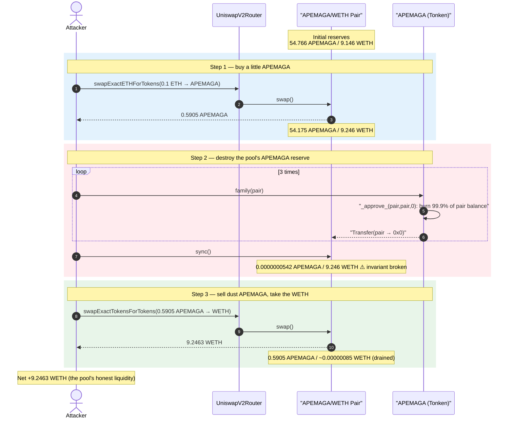
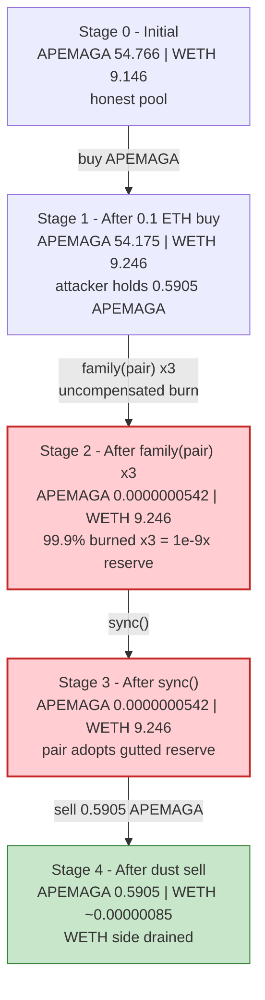
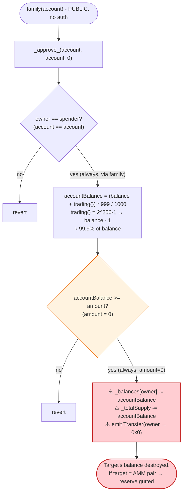
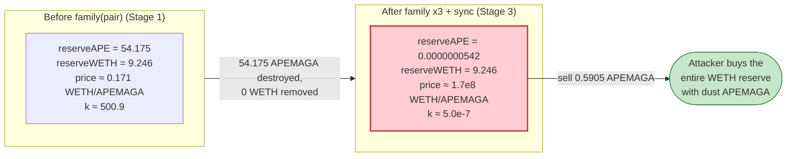

# APEMAGA Exploit — Public `family()` Backdoor Burns 99.9% of the Pool's Token Reserve

> **Reproduction:** the PoC compiles & runs in an isolated Foundry project at
> [this project folder](.) (the umbrella DeFiHackLabs repo does not whole-compile,
> so this PoC was extracted).
> Full verbose trace: [output.txt](output.txt).
> Verified vulnerable source: [Tonken.sol](sources/Tonken_56FF4A/Tonken.sol).

---

## Key info

| | |
|---|---|
| **Loss** | **~9.25 WETH (~$34k at the time)** — the entire WETH side of the APEMAGA/WETH pool |
| **Vulnerable contract** | `APEMAGA` (verified name `Tonken`) — [`0x56FF4AfD909AA66a1530fe69BF94c74e6D44500C`](https://etherscan.io/address/0x56ff4afd909aa66a1530fe69bf94c74e6d44500c) |
| **Victim pool** | APEMAGA/WETH Uniswap-V2 pair — [`0x85705829c2f71EE3c40A7C28f6903e7c797c9433`](https://etherscan.io/address/0x85705829c2f71EE3c40A7C28f6903e7c797c9433) |
| **Attacker EOA** | [`0xb297735e9fb3e695ccce3963bfe042f318901ea0`](https://etherscan.io/address/0xb297735e9fb3e695ccce3963bfe042f318901ea0) |
| **Attacker contract** | [`0x8de6314058c0b7eea809881d73e69b425c01f0b5`](https://etherscan.io/address/0x8de6314058c0b7eea809881d73e69b425c01f0b5) |
| **Attack tx** | [`0x6beb21b53f5b205c088570333ec875b720e333b49657f7026b01ed72b026851e`](https://app.blocksec.com/explorer/tx/eth/0x6beb21b53f5b205c088570333ec875b720e333b49657f7026b01ed72b026851e) |
| **Chain / block / date** | Ethereum mainnet / 20,175,261 / June 2024 |
| **Compiler** | Solidity v0.8.26, optimizer enabled (1 run / 200 runs) |
| **Bug class** | Public token-destroying backdoor (`family()`) → broken AMM `x·y=k` invariant via uncompensated reserve burn |

---

## TL;DR

`APEMAGA` (verified contract name `Tonken`) ships a public, unauthenticated function
[`family(address)`](sources/Tonken_56FF4A/Tonken.sol#L249) that forwards to an internal
[`_approve_`](sources/Tonken_56FF4A/Tonken.sol#L221-L235). Despite the innocuous name, `_approve_`
does **not** set an allowance — it **burns ~99.9% of the target account's token balance**:

```solidity
function family(address account) external { super._approve_(account, account, 0); }
```
```solidity
function _approve_(address owner, address spender, uint256 amount) internal virtual {
    require(owner == spender, "...");                                  // family() passes owner==owner
    uint256 accountBalance = (_balances[owner] + trading()) * 999 / 1000; // ≈ balance * 999/1000
    require(accountBalance >= amount, "...");                          // amount = 0 → always passes
    _balances[owner] -= accountBalance;                               // burn from ANY account
    _totalSupply     -= accountBalance;
    emit Transfer(owner, address(0), accountBalance);
}
```

Because `family()` takes an arbitrary `account` and has **no access control**, anyone can point it at
the **Uniswap-V2 pair** and obliterate the pair's APEMAGA balance. The attacker then calls
`pair.sync()` so the pair adopts the slashed balance as its new reserve. This deletes one side of the
pool's reserves with **no matching WETH outflow** — breaking the constant-product invariant and making
APEMAGA's price collapse to (almost) zero against WETH.

The attacker:

1. **Buys** a small amount of APEMAGA (0.1 ETH → 0.5905 APEMAGA) so they hold the only meaningful balance outside the pool.
2. **Calls `family(pair)` three times** — each call burns 99.9% of the pool's APEMAGA, cutting the pool's APEMAGA reserve from **54.175 → 0.0000000542 APEMAGA** (a 10⁹× reduction).
3. **Calls `pair.sync()`** so the pair records the gutted balance as its reserve.
4. **Sells** its 0.5905 APEMAGA back into the now-degenerate pool and walks away with **9.2463 WETH** — essentially the pool's entire WETH reserve.

Net profit ≈ **9.25 WETH** (~9 ETH per the PoC header).

---

## Background — what APEMAGA / `Tonken` is

`Tonken` is a tiny ERC20 memecoin ("APEMAGA") built on a stripped-down OpenZeppelin-style `ERC20` base
([Tonken.sol](sources/Tonken_56FF4A/Tonken.sol)). It has 18 decimals and a small total supply. On top of
a standard ERC20 it adds two non-standard pieces:

- A pair of obfuscation helpers — `trading()`
  ([:98-101](sources/Tonken_56FF4A/Tonken.sol#L98-L101)) computes a "magic" constant from the deployer
  address, and `_approve_` ([:221-235](sources/Tonken_56FF4A/Tonken.sol#L221-L235)) is a hidden burn
  routine masquerading as an allowance setter.
- A one-line public wrapper `family(address)`
  ([:249](sources/Tonken_56FF4A/Tonken.sol#L249)) that exposes `_approve_` to the world.

On-chain state at the fork block (read from the trace's `getReserves`/`balanceOf` calls):

| Parameter | Value |
|---|---|
| Token decimals | 18 |
| APEMAGA held by the pair (pool reserve) | **54.7656 APEMAGA** (`5.4766e19` wei) |
| WETH held by the pair (pool reserve) | **9.1463 WETH** (`9.1463e18` wei) ← the prize |
| `trading()` evaluated | **`2²⁵⁶ − 1`** (so `balance + trading()` wraps to `balance − 1`) |

The pool is the only place real value lives (9.15 WETH of honest liquidity), and a single public call can
destroy the pool's APEMAGA reserve — that is the entire exploit.

---

## The vulnerable code

### 1. `family()` — public, unauthenticated entry point

```solidity
// Tonken.sol:248-250
receive() external payable {}
function family(address account) external { super._approve_(account, account, 0); }
```

[`family`](sources/Tonken_56FF4A/Tonken.sol#L249) takes **any** `account`, has **no `onlyOwner`/role
guard**, and hard-codes `owner == spender == account` and `amount == 0` when calling `_approve_`.

### 2. `_approve_` — a burn disguised as an allowance setter

```solidity
// Tonken.sol:221-235
function _approve_(address owner, address spender, uint256 amount) internal virtual {
    require(owner != address(0), "ERC20: burn from the zero address");
    require(owner == spender, "ERC20: burn to the owner address");        // ← family() satisfies this
    uint256 accountBalance = (_balances[owner] + trading()) * 999 / 1000; // ← ≈ 99.9% of balance
    _beforeTokenTransfer(owner, address(0), accountBalance);
    require(accountBalance >= amount, "ERC20: burn amount exceeds balance"); // amount=0 → no-op check
    _balances[owner] -= accountBalance;                                   // ← burn from ARBITRARY owner
    _totalSupply     -= accountBalance;
    emit Transfer(owner, address(0), accountBalance);
    _afterTokenTransfer(owner, address(0), accountBalance);
}
```

Two things are deeply wrong here:

- The function name and the `require` strings claim this is about *allowances* ("approve"), yet the body
  **destroys tokens** (`_balances[owner] -= …`, `_totalSupply -= …`, `Transfer(owner, 0, …)`).
- The "amount exceeds balance" guard compares `accountBalance` (the amount to burn) against `amount`
  (the caller-supplied argument), which `family()` fixes at **0**. The check therefore *always passes*
  regardless of the real balance, and the function burns `accountBalance` — not `amount`.

### 3. `trading()` — the obfuscation constant

```solidity
// Tonken.sol:98-101
function trading() internal view virtual returns (uint256) {
    uint256 trading_ = type(uint16).max + _trading - 1185958656035124356519927726436860515883364764252;
    return trading_;
}
```

`_trading` is set to `uint160(deployer)` in the constructor
([:71](sources/Tonken_56FF4A/Tonken.sol#L71)). With the actual deployer address, this expression
evaluates (mod 2²⁵⁶) to **`2²⁵⁶ − 1`**, so `(_balances[owner] + trading())` wraps to `_balances[owner] − 1`.
Net effect: `accountBalance = (balance − 1) * 999 / 1000 ≈ 99.9%` of whatever the target holds. (Verified
from the trace burn amounts — see walkthrough.) The constant is a deliberate red herring that makes the
burn fraction look like noise to a casual reader while actually being almost the entire balance.

---

## Root cause — why it was possible

This is a **malicious / backdoored token**, not an accidental bug. The combination of:

1. **A public, unauthenticated function that burns from an arbitrary account.** `family(account)` lets
   anyone destroy ~99.9% of *any* address's APEMAGA — including the AMM pair's reserve. There is no
   `onlyOwner`, no allowlist, no caller==account check.
2. **Burning from the pool is an uncompensated value transfer.** A Uniswap-V2 pair prices assets purely
   from its reserves and only enforces `x·y ≥ k` *inside `swap()`*. `sync()` exists so the pair can adopt
   its real token balances. When APEMAGA is burned out of the pair and `sync()` is called, the pair's
   APEMAGA reserve collapses while its WETH reserve is untouched → `k` craters and the price of APEMAGA
   vs WETH explodes. Whoever still holds APEMAGA can now buy the pool's entire WETH side for almost
   nothing.
3. **Deceptive naming.** `family` / `_approve_` / `trading` are all chosen to read like benign ERC20
   plumbing. A holder or LP scanning the contract sees an "approve helper" and a "trading flag," not a
   one-call rug switch.

The vulnerability is therefore self-contained in the token: no oracle, no flash loan, and no reentrancy
is needed. The only external dependency is the public `sync()` on the standard Uniswap-V2 pair.

---

## Preconditions

- The token contract exposes `family(address)` publicly (it does — no access control).
- There exists an AMM pair holding APEMAGA + WETH liquidity (the APEMAGA/WETH Uni-V2 pair, 9.15 WETH).
- The attacker holds (or buys) a small amount of APEMAGA so that, after the pool is gutted, they are the
  party that can sell APEMAGA into the broken pool. The PoC buys 0.5905 APEMAGA for 0.1 ETH.
- No flash loan required: peak outlay is the 0.1 ETH starter buy; everything else is the pool's own WETH.

---

## Attack walkthrough (with on-chain numbers from the trace)

For this pair `token0 = APEMAGA`, `token1 = WETH`, so `reserve0 = APEMAGA`, `reserve1 = WETH`. All
figures are taken directly from the `Sync` / `Transfer` events and `getReserves` reads in
[output.txt](output.txt). APEMAGA amounts shown in token units (÷1e18).

| # | Step | Pool APEMAGA | Pool WETH | Effect |
|---|------|-------------:|----------:|--------|
| 0 | **Initial** (`getReserves`) | 54.76557 | 9.14631 | Honest pool, `k ≈ 5.01e2` (in token²). |
| 1 | **Buy** — `swapExactETHForTokens` 0.1 ETH → **0.59054 APEMAGA** to attacker | 54.17503 | 9.24631 | Attacker now holds the only meaningful off-pool APEMAGA. |
| 2 | **`family(pair)` #1** — `_burn(pair, (bal−1)·999/1000)` = 54.12086 APEMAGA destroyed | 0.05417 | 9.24631 | Pool APEMAGA cut to ~0.1%; **WETH untouched**. |
| 3 | **`family(pair)` #2** — burns 99.9% again (0.05412 APEMAGA) | 0.0000542 | 9.24631 | Pool APEMAGA now `5.4175e13` wei. |
| 4 | **`family(pair)` #3** — burns 99.9% again (5.412e13 wei) | 0.0000000542 | 9.24631 | Pool APEMAGA now **`5.4175e10` wei** (≈ 0). |
| 5 | **`pair.sync()`** — pair adopts gutted balance as reserve | 0.0000000542 | 9.24631 | **Invariant broken**: APEMAGA reserve annihilated, WETH reserve intact. |
| 6 | **Sell** — `swapExactTokensForTokens` 0.59054 APEMAGA → **9.24631 WETH** | 0.59054 | ~0.00000085 | Attacker buys essentially the entire WETH reserve with its dust APEMAGA. |

**Exact burn amounts (trace `Transfer(pair → 0x0, value)`):**

| `family` call | Pool APEMAGA before (wei) | Burned (wei) | Pool APEMAGA after (wei) |
|---|---:|---:|---:|
| #1 | 54,175,033,266,338,654,035 | 54,120,858,233,072,315,380 | 54,175,033,266,338,655 |
| #2 | 54,175,033,266,338,655 | 54,120,858,233,072,316 | 54,175,033,266,339 |
| #3 | 54,175,033,266,339 | 54,120,858,233,072 | **54,175,033,267** |

Each call burns `(balance − 1) × 999 / 1000`, i.e. **99.9%** of the remaining balance. Three calls
shrink the pool's APEMAGA reserve by a factor of ~10⁹ (`0.001³ = 1e-9`), from `5.42e19` to `5.42e10` wei.

**Why the final sell drains ~all the WETH:** with the pool at `reserveAPE = 5.4175e10`,
`reserveWETH = 9.2463e18`, selling `amountIn = 5.905e17` APEMAGA gives
`out = (amountIn·997·reserveWETH) / (reserveAPE·1000 + amountIn·997)`. Because `amountIn·997`
(`5.887e20`) dwarfs `reserveAPE·1000` (`5.4175e13`) by ~7 orders of magnitude, `out ≈ reserveWETH` —
the attacker captures essentially the whole WETH side. Computed `out = 9,246,306,107,867,500,219` wei,
matching the trace to the wei.

### Profit accounting (WETH)

| Direction | Amount (WETH) |
|---|---:|
| Starting WETH balance (PoC `deal`) | 9.000000 |
| Spent — 0.1 ETH starter buy (paid in native ETH, not from WETH balance) | 0.0 from WETH |
| Received — final APEMAGA → WETH sell | +9.246306 |
| **Ending WETH balance** | **18.246306** |
| **Net WETH gain** | **+9.246306** |

> The PoC begins with 9 WETH (dealt as headroom; only ~0.1 ETH of native value is actually consumed by
> the starter buy via `swapExactETHForTokens`). It ends with 18.2463 WETH. The **net profit is the
> +9.2463 WETH** pulled out of the pool — i.e. the entire honest WETH liquidity. The PoC header rounds
> this to "~9 ETH".

---

## Diagrams

### Sequence of the attack



### Pool state evolution



### The flaw inside `family()` / `_approve_`



### Why the burn is theft: constant-product before vs. after



---

## Remediation

This is a **malicious token** — the only true "fix" for users is to never trust it. For developers, the
generalizable lessons are:

1. **A token must never let an arbitrary caller burn from an arbitrary account.** Burns may only ever
   destroy tokens the caller owns (and via a properly named, audited path). `family()`/`_approve_`
   allowing `_burn(anyAddress)` with no auth is the core defect.
2. **Function names and `require` strings must match behavior.** A function called `_approve_` that
   subtracts from `_balances`/`_totalSupply` and emits `Transfer(_, 0x0, _)` is intentionally
   deceptive. Reviewers and indexers should flag any "approve"-named function that mutates balances.
3. **Never compute a burn amount from `_balances[x]` and then ignore the `amount` argument.** The
   `require(accountBalance >= amount)` check here is vacuous (`amount == 0`) and the actual destroyed
   quantity is uncontrollable by the (victim) account.
4. **Treat any token whose code can unilaterally shrink an AMM pair's balance as un-listable.** Pools
   should be created only for tokens that cannot externally mutate the pair's balance, because
   `_burn(pair) + pair.sync()` (or equivalent) is a one-call drain of every LP.
5. **Auditors/scanners: hunt for obfuscation constants** like the `trading()` magic number derived from
   the deployer address — they exist to hide a backdoor's true effect (here, "burn 99.9%").

---

## How to reproduce

The PoC was extracted into a standalone Foundry project (the umbrella DeFiHackLabs repo has several
unrelated PoCs that fail to compile under `forge test`'s whole-project build):

```bash
_shared/run_poc.sh 2024-06-APEMAGA_exp -vvvvv
```

- RPC: an **Ethereum mainnet archive** endpoint is required (fork block 20,175,261). `foundry.toml` is
  pre-configured with Infura archive endpoints; most non-archive public RPCs prune that state and fail
  with `header not found` / `missing trie node`.
- Result: `[PASS] testExploit()` — attacker WETH goes from **9.0 → 18.2463** (net **+9.2463 WETH**).

Expected tail:

```
  [Begin] Attacker WETH before exploit: 9.000000000000000000
  [End] Attacker WETH after exploit: 18.246306107867500219

Suite result: ok. 1 passed; 0 failed; 0 skipped
```

---

*Reference: ChainAegis — https://x.com/ChainAegis/status/1806297556852601282 (APEMAGA, Ethereum, ~9 ETH).*
