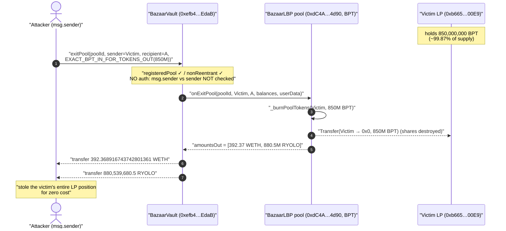
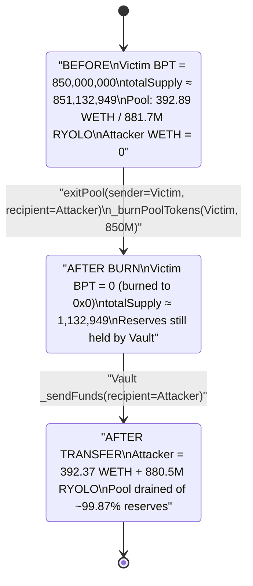
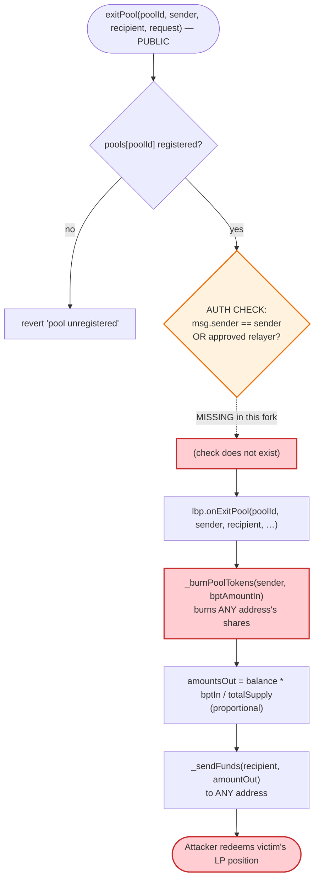

# Bazaar (Ryolo LBP) Exploit — Missing `exitPool` Authorization Burns a Victim's Pool Shares to the Attacker

> **Reproduction:** the PoC compiles & runs in an isolated Foundry project at
> [this project folder](.) (the umbrella DeFiHackLabs repo contains many unrelated
> PoCs that do not whole-compile, so this one was extracted).
> Full verbose trace: [output.txt](output.txt).
> Verified vulnerable source: [src_lbp_BazaarVault.sol](sources/BazaarVaultBlast_efb4e3/src_lbp_BazaarVault.sol).

---

## Key info

| | |
|---|---|
| **Loss** | ~$1.4M total. PoC asserts the WETH leg: **392.368916743742801361 WETH** drained, plus **880,539,680.5 RYOLO** transferred to the attacker |
| **Vulnerable contract** | `BazaarVaultBlast` — [`0xefb4e3Cc438eF2854727A7Df0d0baf844484EdaB`](https://blastscan.io/address/0xefb4e3Cc438eF2854727A7Df0d0baf844484EdaB#code) |
| **Victim / drained pool** | WETH/RYOLO Bazaar LBP — pool `0xdC4A9779D6084C1ab3e815B67eD5e6780cCF4d90`, poolId `0xdc4a9779…00000001` |
| **Victim shareholder (BPT holder, `sender`)** | [`0xb66585C4E460D49154D50325CE60aDC44bc900E9`](https://blastscan.io/address/0xb66585C4E460D49154D50325CE60aDC44bc900E9) |
| **Attacker EOA** | [`0x3cf5B87726Af770c94494E886d2A69c42A203884`](https://blastscan.io/address/0x3cf5B87726Af770c94494E886d2A69c42A203884) |
| **Attacker contract** | [`0xd31c7a22f4e6f928f1d4adabbc08c7bf88a3e402`](https://blastscan.io/address/0xd31c7a22f4e6f928f1d4adabbc08c7bf88a3e402) |
| **Attack tx** | [`0x7fdd140f7631f62d62f7256ee4a38af51a4723ad5d66adc9b9685bf78f750f2d`](https://blastscan.io/tx/0x7fdd140f7631f62d62f7256ee4a38af51a4723ad5d66adc9b9685bf78f750f2d) |
| **Chain / block / date** | Blast (chainid 81457) / forked at **4,619,716** / June 2024 |
| **Compiler** | Vault: Solidity v0.7.6, optimizer **200 runs**; pool: Balancer LBP fork |
| **Bug class** | Missing access control / broken authorization — `exitPool` redeems another address's pool shares without their consent |

---

## TL;DR

`BazaarVault` is a **minimal re-implementation** of the Balancer V2 `IVault` interface that backs the
project's LBP (Liquidity Bootstrapping Pool) tokens. Its
[`exitPool(poolId, sender, recipient, request)`](sources/BazaarVaultBlast_efb4e3/src_lbp_BazaarVault.sol#L186-L209)
takes a **`sender`** (whose pool shares / BPT are burned) and a **`recipient`** (who receives the
redeemed underlying tokens) — and applies **no authorization check at all** linking `sender` to
`msg.sender`.

In genuine Balancer V2 the Vault gates `exitPool` with `_authenticateFor(sender)`, which requires
`msg.sender == sender` **or** an explicitly approved relayer. This fork dropped that guard, and the
contract contains **no relayer / approval / authorizer mechanism whatsoever**.

So the attacker simply called, from their own contract:

```solidity
vault.exitPool(
    poolId,
    0xb665…00E9,         // sender  = a victim LP, whose 850M BPT gets burned
    payable(attacker),   // recipient = attacker, who receives the underlying
    EXACT_BPT_IN_FOR_TOKENS_OUT(850_000_000e18)
);
```

The pool's `onExitPool` hook burned **850,000,000 BPT** out of the victim's balance (~99.87% of the
pool's `totalSupply()` of ≈851,132,949 BPT) and computed the proportional redemption. The Vault then
transferred **392.37 WETH** and **880.5M RYOLO** straight to the attacker — the victim's entire LP
position, stolen in a single call.

---

## Background — what Bazaar / the LBP does

Bazaar is a Blast launchpad that deploys **Liquidity Bootstrapping Pools** modeled on Balancer V2.
Each LBP is a two-token weighted pool (here WETH ↔ RYOLO). The architecture mirrors Balancer:

- A **Vault** (`BazaarVault` /`BazaarVaultBlast`) custodies the pool's underlying token reserves in
  `poolBalances[poolId][token]` and exposes `joinPool` / `exitPool` / `swap`
  ([source](sources/BazaarVaultBlast_efb4e3/src_lbp_BazaarVault.sol)).
- A **Pool** contract (`BazaarLBP`, a fork of Balancer's
  `LiquidityBootstrappingPool`) is the ERC20 **BPT** (pool share token). It implements the
  `onJoinPool` / `onExitPool` hooks and the weighted-math accounting. Its hooks are themselves guarded
  by `onlyVault`
  ([LegacyBasePool.sol:191-192](sources/BazaarLBPBlast_dC4A97/lib_balancer-lbp-patch_node_modules_@balancer-labs_v2-pool-utils_contracts_LegacyBasePool.sol#L191-L192)),
  so the pool **trusts the Vault** to have already verified the caller.

The intended flow: an LP calls `vault.joinPool(...)`, deposits WETH/RYOLO, and is **minted BPT**.
Later they call `vault.exitPool(...)` to burn **their own** BPT and reclaim the underlying. The whole
security model rests on the Vault enforcing that an exit can only burn the shares of the caller (or a
relayer the caller approved). That single enforcement is what's missing.

On-chain state at the fork block (decoded from the trace):

| Parameter | Value |
|---|---|
| Pool BPT `totalSupply()` | ≈ **851,132,949 BPT** (derived from the proportional math) |
| Victim (`sender`) BPT balance | **850,000,000 BPT** (≈ 99.87% of supply) |
| Pool WETH reserve (upscaled) | 392.891898170893798600 WETH |
| Pool RYOLO reserve (upscaled) | 881,713,335.901352162952662931 RYOLO |
| Attacker WETH balance before | 0 |

---

## The vulnerable code

### 1. `exitPool` — no authorization on `sender`

[`src_lbp_BazaarVault.sol:186-209`](sources/BazaarVaultBlast_efb4e3/src_lbp_BazaarVault.sol#L186-L209):

```solidity
function exitPool(bytes32 poolId, address sender, address payable recipient, ExitPoolRequest memory request)
    external
    override
    nonReentrant
    registeredPool(poolId)          // ← only checks the pool is registered
{                                   // ← NO check that msg.sender == sender or an approved relayer
    (address[] memory tokens, uint256[] memory balances,) = getPoolTokens(poolId);
    require(tokens.length == TOKENS_LENGTH && tokens.length == request.tokens.length, "mismatch tokens length");

    IBazaarLBP lbp = IBazaarLBP(_getPoolAddress(poolId));
    // burns BPT from `sender`, returns proportional amountsOut for `recipient`
    (uint256[] memory amountsOut,) = lbp.onExitPool(poolId, sender, recipient, balances, 0, 0, request.userData);

    for (uint256 i = 0; i < tokens.length; i++) {
        uint256 amountOut = amountsOut[i];
        require(amountOut >= request.minAmountsOut[i], "limit not reached");
        require(tokens[i] == _translateToErc20(request.tokens[i]), "token mismatch");

        address token = tokens[i];
        poolBalances[poolId][token] = poolBalances[poolId][token].sub(amountOut);
        _sendFunds(request.tokens[i], recipient, amountOut);   // ← underlying goes to attacker-chosen recipient
    }
}
```

The function decorations are `nonReentrant` and `registeredPool(poolId)` — **neither relates the
caller to `sender`.** `sender` and `recipient` are independent, fully attacker-controlled arguments.

### 2. The pool burns `sender`'s BPT, trusting the Vault

[`LegacyBasePool.sol:254-286`](sources/BazaarLBPBlast_dC4A97/lib_balancer-lbp-patch_node_modules_@balancer-labs_v2-pool-utils_contracts_LegacyBasePool.sol#L254-L286):

```solidity
function onExitPool(bytes32 poolId, address sender, address recipient, ...)
    public virtual override onlyVault(poolId)        // ← trusts the Vault to have authorized `sender`
    returns (uint256[] memory, uint256[] memory)
{
    ...
    (uint256 bptAmountIn, uint256[] memory amountsOut, ...) = _onExitPool(poolId, sender, recipient, ...);
    _burnPoolTokens(sender, bptAmountIn);            // ← burns from the (attacker-supplied) sender
    ...
}
```

### 3. The redemption math — proportional, so taking the BPT == taking the reserves

`userData = abi.encode(1, 850_000_000e18)` selects `ExitKind.EXACT_BPT_IN_FOR_TOKENS_OUT`
([BaseWeightedPool.sol:401-402](sources/BazaarLBPBlast_dC4A97/lib_balancer-lbp-patch_node_modules_@balancer-labs_v2-pool-weighted_contracts_BaseWeightedPool.sol#L401-L402)),
which routes to
[`_exitExactBPTInForTokensOut`](sources/BazaarLBPBlast_dC4A97/lib_balancer-lbp-patch_node_modules_@balancer-labs_v2-pool-weighted_contracts_BaseWeightedPool.sol#L442-L457)
→ `WeightedMath._calcTokensOutGivenExactBptIn`:

```
amountOut[i] = balance[i] * (bptAmountIn / totalBPT)
```

This is the *unrestricted* emergency-exit path (it works even when the pool is paused), so no extra
gating stands in the way. Burning 850M of ≈851.1M BPT redeems ≈99.87% of every reserve.

---

## Root cause — why it was possible

The Vault is described in its own header as *"A sub-implementation of the Balancer `IVault`
interface … This solely enables Join/Exit/Swap functionality"*
([BazaarVault.sol:18-21](sources/BazaarVaultBlast_efb4e3/src_lbp_BazaarVault.sol#L18-L21)). In writing a
trimmed-down clone of Balancer's Vault, the authors **kept Balancer's `(sender, recipient)` calling
convention but omitted Balancer's authorization layer.**

In canonical Balancer V2, `Vault.exitPool` calls `_authenticateFor(sender)`, which enforces
`msg.sender == sender` unless `sender` has approved `msg.sender` as a relayer via
`setRelayerApproval`. The `(sender, recipient)` split exists precisely *because* relayers/aggregators
need to act on a user's behalf — but only after explicit approval.

This fork:

1. **Dropped `_authenticateFor(sender)` entirely** — `exitPool` has no caller↔`sender` relationship
   check.
2. **Implemented no relayer/approval/authorizer system** — there is no `setRelayerApproval`, no
   allowance check, nothing a victim could even use to grant or revoke consent. The `(sender,
   recipient)` parameters became a pure "burn anyone's shares, send the proceeds anywhere" primitive.
3. **Kept the pool hook `onlyVault`-trusting** — the pool assumes the Vault already validated the
   caller, so the missing check is never re-introduced downstream. `_burnPoolTokens(sender, …)` fires
   unconditionally.

The result is a textbook *missing-access-control* bug: any address can redeem any LP's pool position,
because the function that should prove "you own these shares" was never written.

---

## Preconditions

- A registered Bazaar LBP with a victim address holding a large BPT balance (here 850M BPT, ≈99.87%
  of supply). The bigger the victim's share, the more of the pool the attacker walks off with.
- The attacker passes `userData = (EXACT_BPT_IN_FOR_TOKENS_OUT, bptAmountIn)` with `bptAmountIn ≤`
  the victim's BPT balance. (The PoC uses 850,000,000e18, matching the victim's holding exactly; the
  burn `Transfer(from: victim, to: 0x0, value: 8.5e26)` confirms it.)
- No capital, no flash loan, no oracle manipulation, no specific timing. **A single unprivileged
  `exitPool` call.** `minAmountsOut` are set to 0 so there is no slippage guard to satisfy.

---

## Attack walkthrough (with on-chain numbers from the trace)

All figures are taken directly from
[output.txt](output.txt) (events / return data of the single `exitPool` call, lines 1587-1615).

| # | Step | Concrete value | Effect |
|---|------|----------------|--------|
| 0 | **Initial** — attacker WETH balance | 0 WETH | Clean start. |
| 1 | Attacker contract calls `vault.exitPool(poolId, victim=0xb665…00E9, recipient=attacker, EXACT_BPT_IN_FOR_TOKENS_OUT(850e6 e18))` | — | No auth check; proceeds. |
| 2 | Vault calls `pool.onExitPool(...)` with upscaled balances `[392.8919e18 WETH, 881,713,335.9e18 RYOLO]` | bptAmountIn = **850,000,000 BPT** | Proportional exit selected. |
| 3 | Pool **burns 850M BPT from the victim** | `Transfer(0xb665…00E9 → 0x0, 8.5e26)` | Victim's shares destroyed (~99.87% of supply). |
| 4 | Pool returns `amountsOut = [392.368916743742801361 WETH, 880,539,680.499205933573618837 RYOLO]` | ratio ≈ 850e6 / 851,132,949 ≈ 0.99867 | Proportional redemption computed. |
| 5 | Vault transfers WETH to attacker | `Transfer(vault → attacker, 392.368916743742801361 WETH)` | WETH leg drained. |
| 6 | Vault transfers RYOLO to attacker | `Transfer(vault → attacker, 880,539,680.499205933573618837 RYOLO)` | RYOLO leg drained. |
| 7 | **Final** — attacker WETH balance | **392.368916743742801361 WETH** | Asserted by the PoC ✓. |

**Sanity check of the proportional math** (both legs agree on totalSupply):

```
totalSupply ≈ reserveWETH  × bptIn / outWETH  = 392.8919e18  × 850e6 / 392.3689e18  ≈ 851,132,949
totalSupply ≈ reserveRYOLO × bptIn / outRYOLO = 881,713,335.9 × 850e6 / 880,539,680.5 ≈ 851,132,949
victim share = 850,000,000 / 851,132,949 ≈ 99.867%
```

### Profit / loss accounting

| Party | Token | Δ |
|---|---|---:|
| **Attacker (recipient)** | WETH | **+392.368916743742801361** |
| **Attacker (recipient)** | RYOLO | **+880,539,680.499205933573618837** |
| **Victim (`sender`)** | BPT (pool shares) | **−850,000,000** (burned to zero address) |
| **Pool reserves (Vault)** | WETH | **−392.37** |
| **Pool reserves (Vault)** | RYOLO | **−880.5M** |

The attacker spent **nothing** (no capital injected; attacker WETH went 0 → 392.37). The victim lost
their entire LP position; the WETH leg alone is what the PoC asserts (392.37 WETH). Combined with the
RYOLO value, the public post-mortem pegs the loss at ~$1.4M.

---

## Diagrams

### Sequence of the attack



### Pool / share-ownership state evolution



### The flaw inside `exitPool`



---

## Remediation

1. **Authorize `sender` against `msg.sender`.** Re-introduce Balancer's check at the top of
   `exitPool` (and `joinPool`/`swap` for symmetry):
   ```solidity
   require(msg.sender == sender || relayerApproval[sender][msg.sender], "BAL#403 SENDER_NOT_ALLOWED");
   ```
   The same fix applies to any function that takes a `sender` whose balance/shares it mutates.
2. **Implement (or remove) the relayer model deliberately.** If the `(sender, recipient)` split is
   needed for aggregators, add an explicit `setRelayerApproval(relayer, approved)` + Authorizer so
   users can grant and revoke consent. If it is *not* needed, drop the `sender` parameter entirely and
   always burn `msg.sender`'s BPT.
3. **Do not trust the Vault implicitly in the pool.** Defense in depth: even with `onlyVault`, the
   pool could verify the burn is consented (e.g., the Vault forwards the authorized caller). The pool
   burning arbitrary `sender` shares on the Vault's say-so is the second half of the trust chain.
4. **Fork audits must re-derive removed invariants.** When trimming a battle-tested codebase
   (Balancer V2), every guard removed from the original (`_authenticateFor`, relayer approval,
   `temporarilyPaused` gating) must be explicitly justified. Here the *single most important* Vault
   invariant — "you can only exit your own position" — was silently lost.

---

## How to reproduce

The PoC was extracted into a standalone Foundry project (the umbrella DeFiHackLabs repo has many
unrelated PoCs that fail to compile under `forge test`'s whole-project build). The shared
`basetest.sol` in this snapshot of the repo lacks the `getFundingBal()` helper the PoC was written
against, so a one-line equivalent helper (returns the funding-token balance of `address(this)`) was
added to the project-local [basetest.sol](basetest.sol) — it does not affect exploit behavior.

```bash
_shared/run_poc.sh 2024-06-Bazaar_exp -vvvvv
```

- RPC: a **Blast archive** endpoint is required (fork block 4,619,716). `foundry.toml` uses an Infura
  Blast archive endpoint; pruned public RPCs fail with `header not found` / `missing trie node`.
- Result: `[PASS] testExploit()`, attacker WETH balance goes `0 → 392.368916743742801361`.

Expected tail:

```
[PASS] testExploit() (gas: 263567)
  Attacker Before exploit WETH Balance: 0.000000000000000000
  Attacker After exploit WETH Balance: 392.368916743742801361
Suite result: ok. 1 passed; 0 failed; 0 skipped
```

---

*Reference: post-mortem thread — https://x.com/shoucccc/status/1800353122159833195 (Bazaar / Ryolo LBP, Blast, ~$1.4M).*
