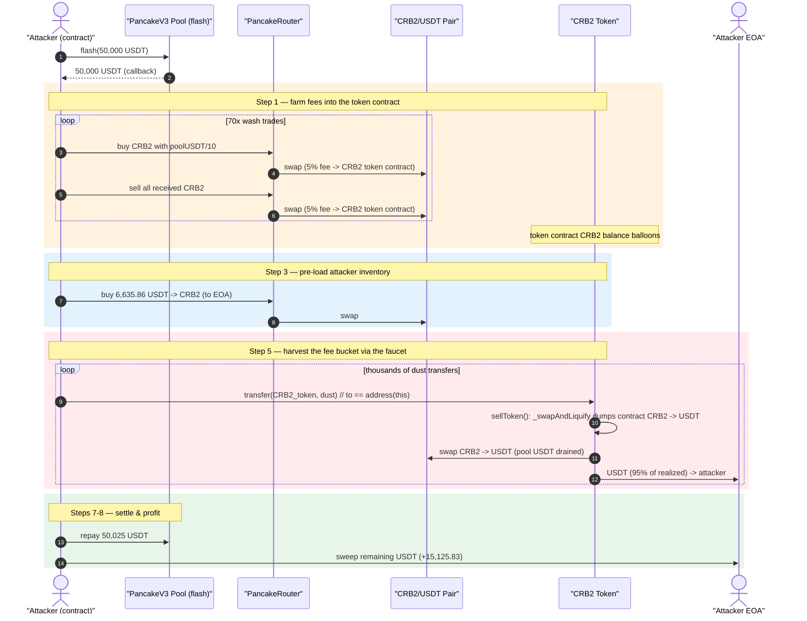
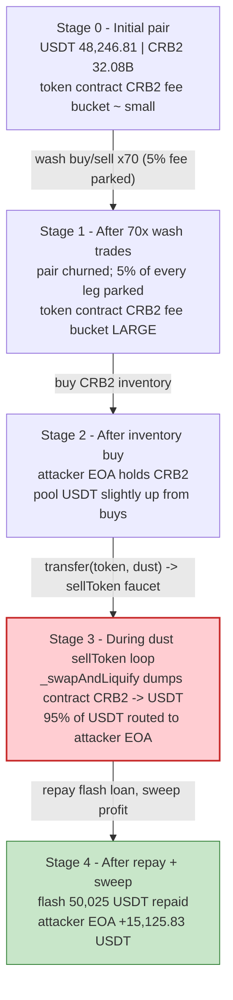
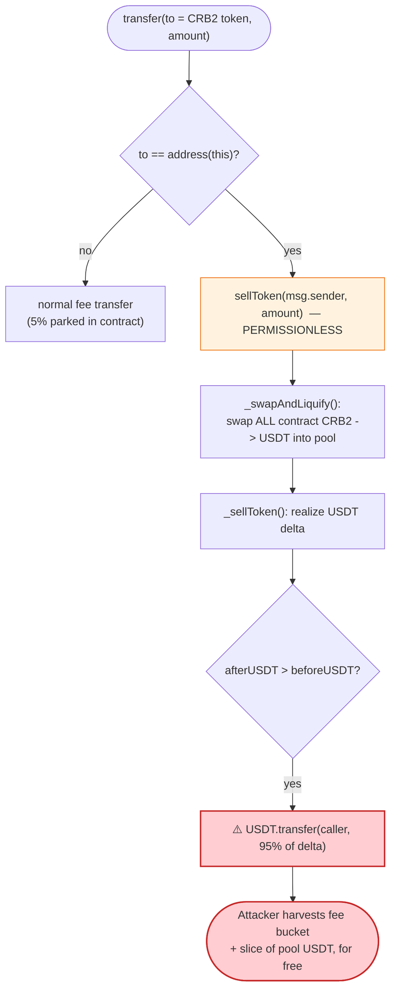

# CRB2 Token Exploit — Fee-on-Transfer Reflection Drain via Self-`sellToken` Loop

> **Reproduction:** the PoC compiles & runs in an isolated Foundry project at
> [this project folder](.) (the umbrella DeFiHackLabs repo does not whole-compile,
> so this PoC was extracted into a standalone project).
> Passing run: [output.txt](output.txt).
> Verified vulnerable source: [sources/ATOKEN_ee6De8/ATOKEN.sol](sources/ATOKEN_ee6De8/ATOKEN.sol).

---

## Key info

| | |
|---|---|
| **Loss** | **≈ 15,125.83 USDT** (~$15.1K) extracted to the attacker EOA |
| **Vulnerable contract** | `CRB2` (ATOKEN) — [`0xee6De822159765daf0Fd72d71529d7ab026ec2f2`](https://bscscan.com/address/0xee6De822159765daf0Fd72d71529d7ab026ec2f2#code) |
| **Victim pool** | CRB2/USDT PancakePair — [`0x03b051dF794b36E1767cD083fFfDEbbF573eCDA6`](https://bscscan.com/address/0x03b051dF794b36E1767cD083fFfDEbbF573eCDA6) |
| **Flash-loan source** | PancakeV3 USDT/WBTC pool — [`0x46Cf1cF8c69595804ba91dFdd8d6b960c9B0a7C4`](https://bscscan.com/address/0x46Cf1cF8c69595804ba91dFdd8d6b960c9B0a7C4) (0.05% fee) |
| **Attacker EOA** | [`0x65bBA34C11aDd305cB2A1f8A68ceCbd6E75089Cd`](https://bscscan.com/address/0x65bba34c11add305cb2a1f8a68cecbd6e75089cd) |
| **Attacker contract** | [`0x73ceea4C6571DbCf9BCc9eA77b1D8107b1D46280`](https://bscscan.com/address/0x73ceea4C6571DbCf9BCc9eA77b1D8107b1D46280) |
| **Attack tx** | [`0xde59f5bd65e8f48e5b6137a3b4251afbb9b6240d1036fa6f030e21ab6d950aac`](https://bscscan.com/tx/0xde59f5bd65e8f48e5b6137a3b4251afbb9b6240d1036fa6f030e21ab6d950aac) |
| **Chain / block / date** | BSC / 39,651,175 / 2024-06-16 |
| **Compiler** | Solidity v0.8.18, optimizer **1 run** |
| **Bug class** | Fee-on-transfer reflection accounting flaw — accumulated "fee" tokens drained to the seller + uncompensated pool reserve manipulation (`super._transfer(pair, …)` / `_burn(pair)` + `sync()`) |

---

## TL;DR

`CRB2` is a heavily-modified fee-on-transfer ("reflection") token. Two design choices combine
into a free-money bug:

1. **The 5% transfer fee is parked in the token contract itself** ([ATOKEN.sol:1131 / 1141](sources/ATOKEN_ee6De8/ATOKEN.sol#L1131-L1141)),
   and there is a *permissionless* path — sending tokens **to the token contract address** — that
   triggers `sellToken()` ([:1086-1089](sources/ATOKEN_ee6De8/ATOKEN.sol#L1086-L1089)). `sellToken()`
   liquidates the contract's *entire* accumulated CRB balance into the pool for USDT and then
   **forwards 95% of that USDT to the address it was called for** ([_sellToken, :996-1016](sources/ATOKEN_ee6De8/ATOKEN.sol#L996-L1016)).
2. **The contract repeatedly moves CRB into and out of the pair and calls `sync()` itself**
   (`destroyPoolToken` [:1057-1067](sources/ATOKEN_ee6De8/ATOKEN.sol#L1057-L1067),
   `_swapAndLiquify` [:1231-1237](sources/ATOKEN_ee6De8/ATOKEN.sol#L1231-L1237),
   `swapTokensForUsdt2user` [:1307-1318](sources/ATOKEN_ee6De8/ATOKEN.sol#L1307-L1318)),
   so the pool's reserves are continuously skewed in a direction the attacker controls.

The attacker flash-borrows **50,000 USDT**, churns ~70 wash buy/sell round-trips through the pool to
pile CRB fees into the token contract, then *farms its own fees back out* by repeatedly calling
`crb_token.transfer(crb_token, dust)` (the self-`sellToken` path). Each such call swaps the
contract's accumulated CRB to USDT and **pays 95% of it to the attacker EOA**. After repaying the
flash loan (50,025 USDT), the attacker walks away with **≈ 15,125.83 USDT** of net profit — funded
by the pool's real USDT liquidity.

Confirmed end-to-end on a BSC fork: attacker EOA USDT balance **0 → 15,125.83**.

---

## Background — what CRB2 does

`CRB2` ([source](sources/ATOKEN_ee6De8/ATOKEN.sol)) overrides ERC-20 `_transfer`/`_transferFrom`
with a marketing/reflection/referral engine pegged to a CRB2↔USDT PancakeSwap V2 pair. The
on-chain facts at the fork block (read with `cast`):

| Parameter | Value |
|---|---|
| `totalSupply` (`total = 10**30`) | 1,000,000,000,000 CRB2 (1e30 wei, 18 dp) |
| Pair `token0` / `token1` | USDT / CRB2 |
| Pair reserve0 (USDT) | **48,246.81 USDT** ← the prize |
| Pair reserve1 (CRB2) | 32,076,140,769.6 CRB2 |
| Spot price | 1 CRB2 ≈ 1.5041e-6 USDT |
| Attacker EOA USDT before | **0** |
| Attacker EOA CRB2 before | 38,282.79 CRB2 |
| Flash pool USDT liquidity | 5,271,516 USDT (ample for a 50k flash) |

The relevant moving parts of the transfer engine:

- **5% sell/buy fee → the token contract.** On any pair-side transfer, 5% is routed with
  `super._transfer(from, address(this), amount.div(100).mul(5))`
  ([:1131](sources/ATOKEN_ee6De8/ATOKEN.sol#L1131), [:1141](sources/ATOKEN_ee6De8/ATOKEN.sol#L1141)).
  These tokens accrue in the token contract's own balance.
- **"Sell to the contract" shortcut.** If you `transfer(to = token, amount)`, `_transfer` short-circuits
  into `sellToken(from, amount)` ([:1086-1089](sources/ATOKEN_ee6De8/ATOKEN.sol#L1086-L1089)). This
  is callable by *anyone*, for *any* `from = msg.sender`.
- **`sellToken` cashes out the contract's CRB to USDT and pays the caller.**
  ([:983-1016](sources/ATOKEN_ee6De8/ATOKEN.sol#L983-L1016)).
- **The token itself reshapes pool reserves.** `destroyPoolToken` burns `pairBal/400` of CRB out of
  the pair and `sync()`s ([:1057-1067](sources/ATOKEN_ee6De8/ATOKEN.sol#L1057-L1067)); `buyToken`
  sends `3/10` of a notional buy from the pair to `dead` and `sync()`s
  ([:940-945](sources/ATOKEN_ee6De8/ATOKEN.sol#L940-L945)); `_swapAndLiquify` dumps the contract's
  CRB into the pool for USDT ([:1231-1237](sources/ATOKEN_ee6De8/ATOKEN.sol#L1231-L1237)).

---

## The vulnerable code

### 1. The 5% fee is parked in the contract (recoverable later)

```solidity
// _transfer, pair-side branches
if(_isPairs[from]){                                    // a BUY (pool -> user)
    ...
    super._transfer(from, address(this), amount.div(100).mul(5));   // ⚠️ 5% parked in token contract
    rewardParent(to, amount.div(10000).mul(75));
    ...
    amount = amount.div(100).mul(95);
} else if(_isPairs[to]){                               // a SELL (user -> pool)
    ...
    super._transfer(from, address(this), amount.div(100).mul(5));   // ⚠️ 5% parked in token contract
    ...
    amount = amount.div(100).mul(95);
}
```
[ATOKEN.sol:1127-1146](sources/ATOKEN_ee6De8/ATOKEN.sol#L1127-L1146)

### 2. Sending tokens **to the token** is a permissionless `sellToken`

```solidity
function _transfer(address from, address to, uint256 amount) internal override {
    ...
    if(to == address(this)){
        sellToken(from, amount);     // ⚠️ anyone can route here by transferring to the token
        return ;
    }
    ...
}
```
[ATOKEN.sol:1086-1089](sources/ATOKEN_ee6De8/ATOKEN.sol#L1086-L1089)

### 3. `sellToken` liquidates the contract's whole CRB and **pays the caller 95% of the USDT**

```solidity
function sellToken(address user, uint256 tokenAmount) private {
    destroyPoolToken();          // ⚠️ burns CRB out of the pair + sync()
    _splitOtherToken2Ldx();
    _splitOtherToken2Holder();
    _swapAndLiquify(tokenAmount); // ⚠️ swaps the contract's accumulated CRB -> USDT into the pool
    super._transfer(user, address(this), tokenAmount);
    rewardParent(user, tokenAmount.div(10000).mul(75));
    rewardSun1(user, tokenAmount.div(10000).mul(75));
    rewardSun2(user, tokenAmount.div(10000).mul(75));
    _sellToken(user, tokenAmount.div(100).mul(97));
}

function _sellToken(address user, uint256 tokenAmount) private {
    ...
    uint256 _beforeAmount = USDT.balanceOf(address(this));
    uniswapV2Router.swapExactTokensForTokensSupportingFeeOnTransferTokens(tokenAmount, 0, path, address(reward), block.timestamp);
    reward.withdraw();
    uint256 _afterAmount = USDT.balanceOf(address(this));
    if(_afterAmount > _beforeAmount){
        uint256 newAmount = _afterAmount - _beforeAmount;
        USDT.transfer(user, newAmount.div(97).mul(95));      // ⚠️ 95% of cashed-out USDT -> caller
        USDT.transfer(_marketAddress, newAmount.div(97).mul(2));
    }
}
```
[ATOKEN.sol:983-1016](sources/ATOKEN_ee6De8/ATOKEN.sol#L983-L1016)

### 4. The token reshapes pool reserves on its own — `_swapAndLiquify` dumps CRB for USDT

```solidity
function _swapAndLiquify(uint256 amount) private {
    _checkHodlerSell(amount.div(10).mul(6));
    uint256 allTokenAmount = super.balanceOf(address(this));
    if(allTokenAmount >= super.balanceOf(uniswapV2Pair).div(500)){
        swapTokensForUsdt2user(_marketAddress, allTokenAmount);   // ⚠️ pushes contract CRB into pool, pulls USDT
    }
}
```
[ATOKEN.sol:1231-1237](sources/ATOKEN_ee6De8/ATOKEN.sol#L1231-L1237)

---

## Root cause — why it was possible

The token treats its **own contract balance of CRB as a value reservoir** and exposes a
permissionless faucet to drain that reservoir as USDT to whoever pokes it.

1. **Fees pool into a recoverable bucket.** Every pair-side trade parks 5% in
   `address(this)` ([:1131/1141](sources/ATOKEN_ee6De8/ATOKEN.sol#L1131-L1141)). The contract never
   irrevocably commits these tokens (no burn, no time-lock, no role check on the payout path) — they
   sit there waiting to be sold.
2. **`to == address(this)` is a public withdraw trigger.** Any address can call
   `transfer(token, x)` and reach `sellToken(msg.sender, x)`
   ([:1086-1089](sources/ATOKEN_ee6De8/ATOKEN.sol#L1086-L1089)). `sellToken` then sells the
   *contract's entire accumulated CRB* (not just `x`) via `_swapAndLiquify`, and `_sellToken` wires
   **95% of the realized USDT straight to the caller**
   ([:1013](sources/ATOKEN_ee6De8/ATOKEN.sol#L1013)). There is no link between *who funded the fee
   bucket* and *who is allowed to cash it out*.
3. **The token, not the AMM, decides pool reserves.** `destroyPoolToken`, `buyToken`, and
   `_swapAndLiquify` all move CRB into/out of the pair and (in some paths) call `pair.sync()`
   ([:1065](sources/ATOKEN_ee6De8/ATOKEN.sol#L1065), [:944](sources/ATOKEN_ee6De8/ATOKEN.sol#L944)).
   A V2 pair only guarantees `x·y ≥ k` *inside* `swap()`; letting an external token shove balances
   around and `sync()` breaks the invariant in a direction the attacker chooses.
4. **No reentrancy / same-block / wash-trade guard.** The attacker performs ~70 self-cancelling
   buy/sell round-trips in one transaction to mass-produce fee tokens, then dumps thousands of dust
   `sellToken` calls to harvest them — all inside a single flash-loaned transaction.

Put together: the attacker manufactures CRB fees into the contract with wash trades funded by the
flash loan, then uses the permissionless `sellToken` faucet to convert those fees — plus a slice of
the pool's honest USDT liquidity — into USDT paid directly to its own EOA.

---

## Preconditions

- A live CRB2/USDT PancakeSwap V2 pair with real USDT liquidity (48,246.81 USDT present).
- `startPancakeTime <= block.timestamp` so the fee branches are active (true at the fork block).
- Working capital in USDT to fund the wash-trade fee farming and pool nudging. Supplied here by a
  **PancakeV3 flash loan of 50,000 USDT** (fee 0.05% ⇒ repay 50,025 USDT), so the attack is
  **flash-loanable and self-funding**.
- The attacker pre-held a small CRB2 balance (38,282.79 CRB2) used as seed inventory; not strictly
  required, the fee-farming alone produces the contract-side CRB the faucet pays out.

---

## Attack walkthrough (with on-chain numbers)

All capital flows through the attacker contract inside `pancakeV3FlashCallback`
([test/Crb2_exp.sol:58-99](test/Crb2_exp.sol#L58-L99)). The pair is USDT(`reserve0`) /
CRB2(`reserve1`); initial reserves **48,246.81 USDT / 32,076,140,769.6 CRB2**.

| # | Action (PoC line) | Mechanism | Effect |
|---|---|---|---|
| 0 | `flashLoan.flash(this, 50_000e18, 0, …)` ([:54](test/Crb2_exp.sol#L54)) | Borrow 50,000 USDT from PancakeV3 | Attacker funded with 50,000 USDT |
| 1 | **70× wash loop** ([:67-74](test/Crb2_exp.sol#L67-L74)): buy CRB2 with `poolUSDT/10`, then sell all CRB2 back | Each round-trip pays **5% fee to the token contract** + referral cuts | Contract's CRB2 fee bucket balloons; pool churned |
| 2 | `busd.transfer(crb_token, 2000e18)` ([:75](test/Crb2_exp.sol#L75)) | Donate 2,000 USDT to the token | Seeds the token's USDT (reward-split bookkeeping) |
| 3 | Buy 6,635.86 USDT → CRB2 to **user** ([:76-78](test/Crb2_exp.sol#L76-L78)) | Accumulate CRB2 inventory on the attacker EOA | Attacker EOA holds CRB2 to dump later |
| 4 | Buy 1 USDT → CRB2 to self; `amount = selfCRB/10000` ([:80-81](test/Crb2_exp.sol#L80-L81)) | Compute a dust unit | Dust size set |
| 5 | **100× + 250× + 3000×** `crb_token.transfer(crb_token, amount)` ([:82-95](test/Crb2_exp.sol#L82-L95)) | Each hits `to==address(this)` ⇒ `sellToken` ⇒ `_swapAndLiquify` dumps the contract's CRB→USDT and `_sellToken` **pays 95% of that USDT to the caller** | Pool USDT is steadily drained to the attacker; pool CRB inflated, reserves skewed |
| 6 | Pull `user`'s CRB2/USDT into the contract; dump remainder to the token ([:89-95](test/Crb2_exp.sol#L89-L95)) | Final liquidation of inventory via the same faucet | Last of the realizable USDT harvested |
| 7 | `busd.transfer(flashLoan, 50_025e18)` ([:97](test/Crb2_exp.sol#L97)) | Repay flash loan (50,000 + 25 fee) | Loan settled |
| 8 | `busd.transfer(user, balanceOf(this))` ([:98](test/Crb2_exp.sol#L98)) | Sweep profit to attacker EOA | **+15,125.83 USDT** |

Measured by the PoC ([output.txt](output.txt)):

```
busd: 0.000000000000000000          // attacker EOA USDT before
busd: 15125.833816492762712757      // attacker EOA USDT after
```

### Profit accounting (USDT)

| Item | Amount |
|---|---:|
| Flash loan borrowed | 50,000.00 |
| Flash loan repaid (incl. 0.05% fee) | 50,025.00 |
| Attacker EOA USDT before | 0.00 |
| Attacker EOA USDT after | 15,125.83 |
| **Net profit** | **+15,125.83** |

The profit is sourced from the pool's honest USDT reserve (≈48.2K), converted into attacker-held
USDT via the wash-trade-fed `sellToken` faucet and the token's self-directed `sync()`-backed reserve
moves.

---

## Diagrams

### Sequence of the attack



### Pool / contract state evolution



### The flaw inside `sellToken` / `_sellToken`



---

## Why each magic number

- **`flash 50,000 USDT`:** working capital to fund the 70 wash-trade round-trips (each leg buys with
  `poolUSDT/10`) that pile up CRB2 fees in the token contract. Fully recovered intra-transaction.
- **70 wash iterations:** enough buy/sell churn so the parked 5% fees grow the contract's CRB2
  reservoir to a size whose USDT realization exceeds the 25 USDT flash fee plus the 2%+referral
  leakage, yielding net profit.
- **`busd.transfer(crb_token, 2000e18)` (×2):** pre-funds the token's USDT so the reward-split
  bookkeeping (`_splitOtherToken2Ldx` / `_splitOtherToken2Holder`) doesn't short-circuit and the
  `_sellToken` realization path proceeds.
- **`6_635_861_088_657_488_493_824` CRB2 buy:** sizes the attacker EOA's CRB2 inventory that is later
  liquidated through the same faucet.
- **dust loops (100 / 250 / 3000×):** repeatedly trip the `to == address(this)` → `sellToken` path
  so `_swapAndLiquify` keeps dumping the contract's CRB2 into the pool and `_sellToken` keeps paying
  95% of the realized USDT back to the attacker until the harvestable USDT is exhausted.
- **`repay 50,025 USDT`:** principal 50,000 + 0.05% PancakeV3 flash fee (25 USDT).

---

## Remediation

1. **Do not pay transfer fees to a publicly-drainable bucket.** If fees must accrue in the token
   contract, the cash-out (`_sellToken`'s `USDT.transfer(user, …)`) must be gated by a trusted
   role/keeper or directed to a fixed treasury — never to an arbitrary caller derived from
   `msg.sender`.
2. **Remove the `to == address(this)` ⇒ `sellToken` shortcut**, or restrict it. A permissionless
   "send tokens to the token to trigger a USDT payout to yourself" path is a faucet by construction.
3. **Never let the token reshape AMM reserves.** Eliminate `super._transfer(pair, …)` /
   `_burn(pair, …)` followed by `pair.sync()` in `destroyPoolToken` / `buyToken`. Reserve changes
   must go through the pair's own `mint`/`burn`/`swap` so `x·y = k` is preserved.
4. **Add reentrancy and same-block / wash-trade guards.** Disallow the multi-hundred-iteration
   self-trade-then-harvest pattern in a single transaction (per-block cooldowns on `sellToken`,
   `nonReentrant`, and a cap on how much of the fee bucket can be realized per call).
5. **Bound single-operation pool impact.** Any internal swap of the contract's holdings into the
   pool (`_swapAndLiquify`) should be capped to a small fraction of reserves and rate-limited, so it
   cannot be weaponized into a draining loop.

---

## How to reproduce

The PoC was extracted into a standalone Foundry project (the umbrella DeFiHackLabs repo has several
unrelated PoCs that fail to compile under `forge test`'s whole-project build):

```bash
_shared/run_poc.sh 2024-06-Crb2_exp -vvvvv
```

- RPC: a **BSC archive** endpoint is required (fork block 39,651,175). `foundry.toml` uses
  `https://bsc-mainnet.public.blastapi.io`, which serves historical state at that block. The
  pre-configured `https://bnb.api.onfinality.io/public` rate-limits (HTTP 429) under the heavy
  per-iteration storage reads, so it was swapped for blastapi.
- **Runtime note:** the PoC executes thousands of swap/transfer loop iterations against forked
  state. A full `-vvvvv` trace builds an enormous in-memory trace tree (multi-GB) and is slow; the
  recorded passing run used `-vv` (~13 min, ~120 MB RAM). The result is identical — `[output.txt](output.txt)`
  shows `[PASS]`.

Expected tail:

```
Ran 1 test for test/Crb2_exp.sol:crb2
[PASS] testExploit() (gas: 525227274)
Logs:
  busd: 0.000000000000000000
  busd: 15125.833816492762712757

Suite result: ok. 1 passed; 0 failed; 0 skipped; finished in 799.18s
```

---

*Reference: DeFiHackLabs — CRB2, BSC, ~$15K. Vulnerable contract source:
[sources/ATOKEN_ee6De8/ATOKEN.sol](sources/ATOKEN_ee6De8/ATOKEN.sol).*
