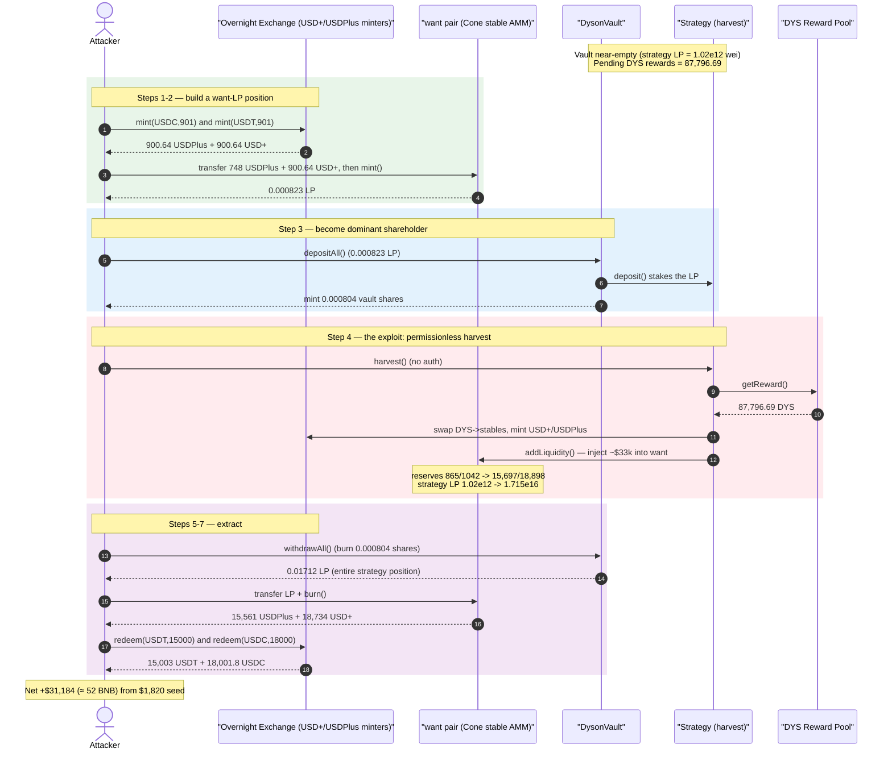
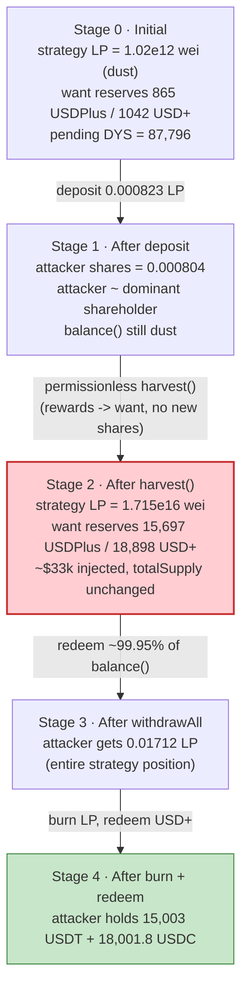
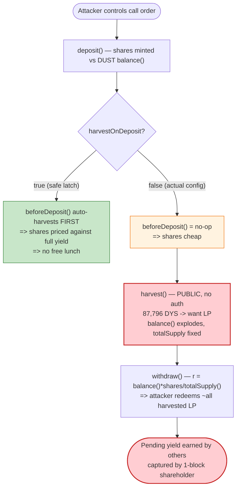

# Dyson.money Exploit — Permissionless `harvest()` Sandwich Steals Pending Yield from a Near-Empty Vault

> **Vulnerability classes:** vuln/defi/sandwich-attack · vuln/access-control/missing-auth

> **Reproduction:** the PoC compiles & runs in an isolated Foundry project at
> [this project folder](.) (the umbrella DeFiHackLabs repo does not whole-compile,
> so this PoC was extracted into a standalone project).
> Full verbose trace: [output.txt](output.txt).
> Verified vulnerable source: [StrategyCommonSolidlyHybridPoolLP.sol](sources/StrategyCommonSolidlyHybridPoolLPOvernight_aFF18b/contracts_strategies_bnbchain_StrategyCommonSolidlyHybridPoolLP.sol) and [DysonVault.sol](sources/DysonVault_6e6680/contracts_vaults_DysonVault.sol).

---

## Key info

| | |
|---|---|
| **Loss** | ~52 BNB — attacker turned **910 USDT + 910 USDC** (≈ $1,820) into **15,003 USDT + 18,001.8 USDC** (≈ $33,004), netting ≈ **$31,184** |
| **Vulnerable contract** | `StrategyCommonSolidlyHybridPoolLPOvernight` (impl) — [`0xaFF18b43Dfb44d9b56C2B88e8569b3B0880C2a56`](https://bscscan.com/address/0xaFF18b43Dfb44d9b56C2B88e8569b3B0880C2a56#code), proxied at [`0x2b9BDa587ee04fe51C5431709afbafB295F94bB4`](https://bscscan.com/address/0x2b9BDa587ee04fe51C5431709afbafB295F94bB4) |
| **Vault** | `DysonVault` (impl) — [`0x6e668080FF8Fa5F606cDC200229d054Aa5B8Fb13`](https://bscscan.com/address/0x6e668080FF8Fa5F606cDC200229d054Aa5B8Fb13#code), proxied at [`0x2836B64a39d5B73d8f534c9fd6c6ABD81df2beB7`](https://bscscan.com/address/0x2836B64a39d5B73d8f534c9fd6c6ABD81df2beB7) |
| **Victim pool (`want`)** | Solidly/Cone stable AMM `USDPlus/USD+` pair — [`0x1561D9618dB2Dcfe954f5D51f4381fa99C8E5689`](https://bscscan.com/address/0x1561D9618dB2Dcfe954f5D51f4381fa99C8E5689#code) |
| **USD+ Exchange / minters** | `Exchange` impl [`0x3f2FeD6FB49Ddc76e4C5CE5738C86704567C4D87`](https://bscscan.com/address/0x3f2FeD6FB49Ddc76e4C5CE5738C86704567C4D87#code); USDC→USD+ minter `0x5A8E…DB821`, USDT→USDPlus minter `0xd3F8…Cb708` |
| **Attacker EOA** | [`0x4ced363484dfebd0fab1b33c3eca0edca44a346c`](https://bscscan.com/address/0x4ced363484dfebd0fab1b33c3eca0edca44a346c) |
| **Attacker contract** | [`0x00db72390c1843de815ef635ee58ac19b54af4ef`](https://bscscan.com/address/0x00db72390c1843de815ef635ee58ac19b54af4ef) |
| **Attack tx** | [`0xbac614f4d103939a9611ca35f4ec9451e1e98512d573c822fbff70fafdbbb5a0`](https://app.blocksec.com/explorer/tx/bsc/0xbac614f4d103939a9611ca35f4ec9451e1e98512d573c822fbff70fafdbbb5a0) |
| **Chain / block / date** | BSC / 39,684,702 / June 2024 |
| **Compiler** | Strategy v0.8.17 (optimizer 1 run); vault v0.8.x |
| **Bug class** | Permissionless reward harvest into a vault with no harvest-front-running protection (yield-share inflation / "harvest sandwich") |

---

## TL;DR

`DysonVault` is a Beefy-style auto-compounding yield vault. It mints share tokens against
`balance()` — the amount of `want` LP held by the vault's strategy — and lets anyone redeem
shares for a proportional slice of that LP ([DysonVault.sol:116-132](sources/DysonVault_6e6680/contracts_vaults_DysonVault.sol#L116-L132)).

The strategy's `harvest()` is **fully permissionless** ([StrategyCommonSolidlyHybridPoolLP.sol:133-135](sources/StrategyCommonSolidlyHybridPoolLPOvernight_aFF18b/contracts_strategies_bnbchain_StrategyCommonSolidlyHybridPoolLP.sol#L133-L135)).
It claims the strategy's accumulated reward tokens (87,796 DYS — worth tens of thousands of dollars),
converts them into `usdPlus`/`usdtPlus`, and **adds them as fresh liquidity directly into `want`**
([StrategyCommonSolidlyHybridPoolLPOvernight.sol:99-113](sources/StrategyCommonSolidlyHybridPoolLPOvernight_aFF18b/contracts_strategies_bnbchain_StrategyCommonSolidlyHybridPoolLPOvernight.sol#L99-L113)).
The whole harvested value lands in the strategy's `want` position in a single transaction, while the
vault's share `totalSupply()` is unchanged.

Because the vault held almost nothing at the attack block (its strategy held just **1.02e12 wei of LP**,
worth a fraction of a cent), the attacker simply:

1. **Becomes the dominant shareholder** by depositing **0.000823 LP** and minting **0.000804 vault shares**.
2. **Calls the permissionless `harvest()`**, dumping ~$33k of pending DYS rewards into `want`. The
   strategy's LP position explodes from `1.02e12` to `1.715e16` wei.
3. **Withdraws all shares**, redeeming **0.01712 LP** — essentially the *entire* strategy position,
   including all the freshly-harvested reward value, because the attacker owns ~99.95% of the
   (proportionally-redeemed) `balance()`.
4. **Unwinds**: burns the LP for `usdPlus`/`usdtPlus`, then `redeem()`s those for **15,003 USDT + 18,001.8 USDC**.

Net profit ≈ **$31,184** (≈ 52 BNB). The attacker started with $1,820 of seed capital and walked away
with the protocol's entire pending yield.

---

## Background — what Dyson.money does

Dyson.money is an auto-compounding yield aggregator (a Beefy fork) on BSC. The pieces relevant to
this attack:

- **`DysonVault`** ([source](sources/DysonVault_6e6680/contracts_vaults_DysonVault.sol)) — an
  ERC20 share token. `deposit()` pulls `want` LP from the user and mints shares proportional to
  `_amount / pool`; `withdraw()` burns shares and returns `balance() * shares / totalSupply()` of LP.
  `balance()` = LP held by the vault + LP reported by the strategy ([:49-51](sources/DysonVault_6e6680/contracts_vaults_DysonVault.sol#L49-L51)).
- **`StrategyCommonSolidlyHybridPoolLPOvernight`** ([base](sources/StrategyCommonSolidlyHybridPoolLPOvernight_aFF18b/contracts_strategies_bnbchain_StrategyCommonSolidlyHybridPoolLP.sol),
  [override](sources/StrategyCommonSolidlyHybridPoolLPOvernight_aFF18b/contracts_strategies_bnbchain_StrategyCommonSolidlyHybridPoolLPOvernight.sol)) —
  stakes the `want` LP (a Solidly/Cone stable pair of Overnight's `USD+` and `USDPlus` stablecoins)
  in a reward pool that pays out `DYS`. `harvest()` claims those rewards, swaps them, mints new
  `USD+`/`USDPlus`, and re-adds them as `want` liquidity (auto-compounding).
- **Overnight `Exchange`** ([source](sources/Exchange_3f2FeD/contracts_Exchange.sol)) — the rebasing
  stablecoin engine. `mint(asset, amount)` deposits USDC/USDT into Venus-backed strategies and mints
  `USD+`/`USDPlus` 1:1; `redeem()` does the inverse. The attacker uses it only to wrap/unwrap stables.

The `want` token is the Cone stable AMM pair `0x1561…5689`, whose two sides are `USDPlus` (`0x5335…0C8C`)
and `USD+` (`0xe807…CA65`).

On-chain state at the fork block (from the trace):

| State | Value |
|---|---|
| Vault strategy `balanceOf()` (LP staked) **before attack** | **1,020,386,490,758 wei** (≈ 1.02e12, dust) |
| `want` pair reserves before attack | reserve0 = 865.73 USDPlus, reserve1 = 1,042.29 USD+ (6-dec) |
| DYS rewards pending in the reward pool | **87,796.69 DYS** |
| Attacker seed | 910 USDT + 910 USDC (via `deal`) |

The vault was essentially empty (LP worth a fraction of a cent), yet the strategy had **87,796 DYS of
unclaimed, un-harvested rewards** sitting in the reward pool. That mismatch — large pending yield,
tiny share base, no harvest gating — is the whole game.

---

## The vulnerable code

### 1. `harvest()` is permissionless and pushes all reward value into `want`

```solidity
// StrategyCommonSolidlyHybridPoolLP.sol
function harvest() external virtual {
    _harvest(tx.origin);          // ⚠️ no access control — anyone, anytime
}

function _harvest(address callFeeRecipient) internal whenNotPaused {
    IRewardPool(rewardPool).getReward();                                 // claim DYS rewards
    uint256 outputBal = IERC20Upgradeable(output).balanceOf(address(this));
    if (outputBal > 0) {
        chargeFees(callFeeRecipient);                                    // skim a small fee in WBNB
        addLiquidity();                                                  // ⚠️ all rewards -> want LP
        uint256 wantHarvested = balanceOfWant();
        deposit();                                                       // stake the new LP
        lastHarvest = block.timestamp;
        emit StratHarvest(msg.sender, wantHarvested, balanceOf());
    }
}
```
[StrategyCommonSolidlyHybridPoolLP.sol:133-156](sources/StrategyCommonSolidlyHybridPoolLPOvernight_aFF18b/contracts_strategies_bnbchain_StrategyCommonSolidlyHybridPoolLP.sol#L133-L156)

### 2. `addLiquidity()` mints USD+/USDPlus and injects them into the pool as `want`

```solidity
// StrategyCommonSolidlyHybridPoolLPOvernight.sol (override)
function addLiquidity() internal override {
    uint256 outputBal = IERC20Upgradeable(output).balanceOf(address(this)); // ~84,284 DYS left after fee
    uint256 lp0Amt = outputBal / 2;
    uint256 lp1Amt = outputBal - lp0Amt;
    // swap DYS -> USDC and DYS -> USDT via dystRouter ...
    ISwapRouter(dystRouter).exactInput(...);   // lp0 path
    ISwapRouter(dystRouter).exactInput(...);   // lp1 path

    // wrap the swapped stables into USD+ / USDPlus
    IOvernightExchange(overnightUsdPlusMinter).mint(params0);
    IOvernightExchange(overnightUsdtPlusMinter).mint(params1);

    uint256 lp0Bal = IERC20Upgradeable(usdPlus).balanceOf(address(this));
    uint256 lp1Bal = IERC20Upgradeable(usdtPlus).balanceOf(address(this));
    ISolidlyRouter(dystRouter2).addLiquidity(           // ⚠️ ~32.7k of value enters `want`
        usdPlus, usdtPlus, stable, lp0Bal, lp1Bal, 1, 1, address(this), block.timestamp
    );
}
```
[StrategyCommonSolidlyHybridPoolLPOvernight.sol:57-114](sources/StrategyCommonSolidlyHybridPoolLPOvernight_aFF18b/contracts_strategies_bnbchain_StrategyCommonSolidlyHybridPoolLPOvernight.sol#L57-L114)

### 3. The vault redeems shares against the *post-harvest* `balance()`

```solidity
// DysonVault.sol
function withdraw(uint256 _shares) public nonReentrant {
    uint256 r = (balance() * _shares) / totalSupply();   // ⚠️ balance() includes the just-harvested LP
    _burn(msg.sender, _shares);
    ...
    want().safeTransfer(msg.sender, r);
}
```
[DysonVault.sol:116-132](sources/DysonVault_6e6680/contracts_vaults_DysonVault.sol#L116-L132)

There is **no share-price snapshot, no harvest cooldown, no minimum-holding-period, and no
deposit/withdraw-in-same-block guard.** The yield earned by *every prior depositor's stake-time* is
materialized into `balance()` the instant `harvest()` runs, and is then redeemable pro-rata by
*whoever holds shares at that instant.*

---

## Root cause — why it was possible

A correctly-designed auto-compounder accrues pending rewards continuously (or at least credits them
to the stakers who earned them). Dyson.money instead materializes the **entire** pending reward bucket
into a single `want` deposit at an *attacker-chosen* moment, and distributes it to *current* share
holders by simple pro-rata math. Three design decisions compose into a critical bug:

1. **Permissionless `harvest()`.** ([:133-135](sources/StrategyCommonSolidlyHybridPoolLPOvernight_aFF18b/contracts_strategies_bnbchain_StrategyCommonSolidlyHybridPoolLP.sol#L133-L135))
   The attacker decides *when* the lump of reward value is injected — i.e., immediately after
   positioning themselves to own essentially all of the redeemable balance.
2. **Lump-sum reward realization with no fair attribution.** `addLiquidity()` converts the whole
   reward bucket into `want` in one shot. The rewards were earned over time by whatever LP the
   strategy held — but at this block that was dust. So a depositor who joins one call before harvest,
   and leaves one call after, captures **100% of yield they did not earn.**
3. **No anti-sandwich protection on the share token.** `deposit()`/`withdraw()` use the live
   `balance()`/`totalSupply()` ratio with no cooldown, snapshot, or same-block guard
   ([:76-92](sources/DysonVault_6e6680/contracts_vaults_DysonVault.sol#L76-L92),
   [:116-132](sources/DysonVault_6e6680/contracts_vaults_DysonVault.sol#L116-L132)).
   A deposit→harvest→withdraw atomic sequence is profitable whenever `pending_rewards / current_balance`
   is large — and here it was astronomical (`~$33k` of pending yield against `<$0.01` of staked LP).

The classic mitigation in Beefy-style strategies — calling `harvest()` automatically inside
`beforeDeposit()` so that all pending yield is realized *before* the new depositor's shares are minted —
was **not active**: `harvestOnDeposit` was `false`, so the `beforeDeposit()` hook
([:126-131](sources/StrategyCommonSolidlyHybridPoolLPOvernight_aFF18b/contracts_strategies_bnbchain_StrategyCommonSolidlyHybridPoolLP.sol#L126-L131))
was a no-op (the trace shows `beforeDeposit()` returning immediately). With that latch off, the
attacker controls the ordering: deposit *first* (cheap shares against dust balance), then harvest
(huge value injected), then withdraw (redeem the huge value).

---

## Preconditions

- A meaningful amount of **un-harvested rewards** accrued in the strategy's reward pool (87,796 DYS here).
- The vault holds a **small staked balance relative to those pending rewards** (here it was dust), so
  a tiny deposit buys a dominant share of the post-harvest `balance()`.
- `harvestOnDeposit == false` (the `beforeDeposit()` auto-harvest latch is off), so the attacker can
  order deposit *before* harvest.
- Working capital to seed the `want` deposit and to mint the USD+/USDPlus pair. ~$1.8k of stables here;
  recoverable in the same transaction, so effectively flash-loanable. The PoC simply `deal`s 910 USDT
  + 910 USDC.

No price-oracle manipulation, no reentrancy, and no privileged role are required.

---

## Attack walkthrough (with on-chain numbers from the trace)

`want` pair `token0 = USDPlus (0x5335…)`, `token1 = USD+ (0xe807…)`. All figures from
[output.txt](output.txt).

| # | Step | Concrete numbers | Effect |
|---|------|------------------|--------|
| 0 | **Initial** | strategy LP staked = **1.02e12 wei**; `want` reserves = 865.73 USDPlus / 1,042.29 USD+; pending DYS = **87,796.69** | Near-empty vault, large pending yield. |
| 1 | **Wrap stables** — `mint(USDC,901)` → 900.64 USDPlus; `mint(USDT,901)` → 900.64 USD+ | spends 901+901 of the seed | Attacker obtains the two pool assets. |
| 2 | **Seed `want` LP** — transfer 748 USDPlus + 900.64 USD+ to the pair, `mint()` | receives **0.000823 LP** (823,356,354,678,397 wei) | Attacker now holds LP to deposit. |
| 3 | **`depositAll()` into vault** — deposits 0.000823 LP | mints **0.000804 vault shares** (804,261,699,462,537 wei) against `_pool = balance()` (dust) | Attacker is now the dominant shareholder. |
| 4 | **`harvest()`** (permissionless) — claim 87,796.69 DYS, fee-skim, swap, mint USD+/USDPlus, `addLiquidity()` | strategy `want` position grows **1.02e12 → 1.715e16 wei**; pair reserves jump to **15,697 USDPlus / 18,898 USD+** | ~$33k of reward value injected into `want`. |
| 5 | **`withdrawAll()`** — burn 0.000804 shares | receives **0.01712 LP** (17,128,902,542,557,290 wei) = essentially the *entire* strategy position | Attacker captures all harvested yield. |
| 6 | **Burn LP** — transfer 0.01712 LP to pair, `burn()` | receives **15,561.2 USDPlus + 18,734.8 USD+** | Unwrap LP to stablecoins. |
| 7 | **Redeem** — `redeem(USDT,15,000)` & `redeem(USDC,18,000)` | receives **15,003 USDT + 18,001.8 USDC** | Final stablecoin payout. |

### Why a 0.000823-LP deposit captures ~$33k

The vault's share price is `balance() / totalSupply()`. At step 3 the attacker mints shares against a
`balance()` of essentially dust, so they own ~99.95% of all redeemable value. At step 4 the harvest
adds **all** the pending yield to `balance()` *without minting any new shares*, so the per-share value
explodes. At step 5 the attacker redeems their ~99.95% share of the now-huge `balance()` — i.e., almost
the entire harvested bucket. The math (`r = balance() * shares / totalSupply()`) faithfully hands them
the LP that holds the rewards.

### Profit accounting

| Direction | USDT | USDC |
|---|---:|---:|
| Start (seed) | 910.00 | 910.00 |
| End | 15,003.00 | 18,001.80 |
| **Net** | **+14,093.00** | **+17,091.80** |

**Total net ≈ +$31,184** (≈ 52 BNB at the time), matching the PoC's terminal logs:

```
[End] Attacker USDT balance after exploit: 15003.000000000000000000
[End] Attacker USDC balance after exploit: 18001.800000000000000000
```

---

## Diagrams

### Sequence of the attack



### Vault / pool state evolution



### The flaw: ordering of deposit, harvest, withdraw



---

## Remediation

1. **Auto-harvest before every deposit (and ideally before withdraw).** Enable `harvestOnDeposit` and
   ensure `beforeDeposit()` realizes pending yield *before* new shares are priced/minted. This makes a
   deposit→harvest→withdraw sandwich unprofitable because the depositor's shares are already priced at
   the post-harvest balance. (This is exactly the Beefy mitigation that was switched off here.)
2. **Gate `harvest()`** to a trusted keeper/automation role, or at least make it non-atomic with
   deposit/withdraw (e.g., a per-account deposit cooldown that must elapse before withdraw is allowed).
   A permissionless harvest is fine *only if* deposits already capture pending yield (point 1).
3. **Add anti-sandwich protection to the share token.** Reject deposit and withdraw in the same block
   for the same account, or snapshot the share price at deposit time and cap the value a freshly-minted
   share can redeem within N blocks.
4. **Attribute rewards over time rather than as a lump injection.** A streaming/drip mechanism (vest
   harvested rewards into `balance()` linearly over a period) removes the discontinuous jump that makes
   the sandwich profitable, so a one-block holder cannot capture a meaningful slice.
5. **Bootstrap protection.** Never operate a live, reward-accruing vault with a near-zero staked
   balance; seed a permanent minimum stake (or dead-shares) so `pending / balance` can never reach the
   extreme ratio that made a sub-$2 deposit capture $33k.

---

## How to reproduce

The PoC was extracted into a standalone Foundry project (the umbrella DeFiHackLabs repo has several
unrelated PoCs that fail to compile under `forge test`'s whole-project build):

```bash
_shared/run_poc.sh 2024-06-Dyson_money_exp -vvvvv
```

- RPC: a **BSC archive** endpoint is required (fork block 39,684,702). `foundry.toml` uses
  `https://bsc-mainnet.public.blastapi.io`, which serves historical state at that block; most public
  BSC RPCs prune it and fail with `header not found` / `missing trie node`.
- Result: `[PASS] testExploit()`.

Expected tail:

```
  [End] Attacker USDT balance after exploit: 15003.000000000000000000
  [End] Attacker USDC balance after exploit: 18001.800000000000000000

Suite result: ok. 1 passed; 0 failed; 0 skipped
```

---

*Reference: ~52 BNB loss on Dyson.money, BSC, June 2024. Tx `0xbac614f4…b5a0`.*
