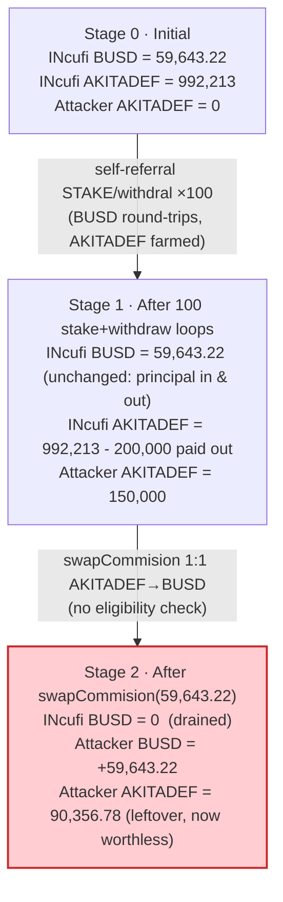
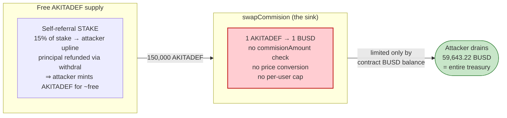

# INcufi (AkitaDefender) Exploit — Self-Referral Commission Farming + Un-collateralized 1:1 `swapCommision`

> **Reproduction:** the PoC compiles & runs in an isolated Foundry project at
> [this project folder](.) (the umbrella DeFiHackLabs repo contains many
> unrelated PoCs that do not whole-compile, so this one was extracted).
> Full verbose trace (the giant repeated `listMyoID()` order arrays were elided for readability):
> [output.txt](output.txt).
> Verified vulnerable source: [INcufi.sol](sources/INcufi_80df77/INcufi.sol).

---

## Key info

| | |
|---|---|
| **Loss** | ~**$59,643** — **59,643.218325 BUSD** (the staking contract's *entire* BUSD balance, drained to the wei) |
| **Vulnerable contract** | `INcufi` staking — [`0x80df77b2Ae5828FF499A735ee823D6CD7Cf95f5a`](https://bscscan.com/address/0x80df77b2Ae5828FF499A735ee823D6CD7Cf95f5a#code) |
| **Commission token** | `AkitaDefender` (AKITADEF) — [`0x3213573C46eb905bA17F0Bb650E10C2352552e8a`](https://bscscan.com/address/0x3213573C46eb905bA17F0Bb650E10C2352552e8a#code) |
| **Principal / payout token** | BSC-USD (BUSD, the `0x55d3…` "USDT") — `0x55d398326f99059fF775485246999027B3197955` |
| **Attacker EOA** | [`0xb6911dee6a5b1c65ad1ac11a99aec09c2cf83c0e`](https://bscscan.com/address/0xb6911dee6a5b1c65ad1ac11a99aec09c2cf83c0e) |
| **Attack contract** | [`0x4237d006471b38af0e1691c00d96193a8ff5709f`](https://bscscan.com/address/0x4237d006471b38af0e1691c00d96193a8ff5709f) |
| **Attack tx** | [`0x556419e0a6ee8e6de6b3679605f9f62ad013007419a1b55c9f56590a824bfb52`](https://app.blocksec.com/explorer/tx/bsc/0x556419e0a6ee8e6de6b3679605f9f62ad013007419a1b55c9f56590a824bfb52) |
| **Chain / block / date** | BSC / 39,729,927 / **June 18, 2024** (block ts 1718743550 UTC) |
| **Compiler** | Solidity `^0.8.0` (pragma) |
| **Bug class** | Broken accounting — un-collateralized 1:1 redemption of a freely-farmable commission token for the principal pool, plus self-referral commission farming |

---

## TL;DR

`INcufi` is a referral-staking program. You stake BUSD; the contract pays your *upline*
(sponsor / 2nd-level sponsor / country head) commissions denominated in a separate token,
`AKITADEF`; and at maturity you get your BUSD principal back. The fatal pair of bugs:

1. **`swapCommision(amount)` redeems AKITADEF for BUSD 1:1 with no eligibility check**
   ([INcufi.sol:388-395](sources/INcufi_80df77/INcufi.sol#L388-L395)).
   It simply pulls `amount` AKITADEF from the caller and sends back `swapamount = amount` BUSD
   from the contract's BUSD pool. It never checks `commisionAmount[msg.sender]`, never checks
   that the AKITADEF was *earned* rather than bought/farmed, and applies no price conversion —
   1 AKITADEF buys 1 BUSD.

2. **`STAKE` pays commissions on *every* stake, and the staker controls who the upline is**
   ([INcufi.sol:201-222](sources/INcufi_80df77/INcufi.sol#L201-L222)). Because `register()` lets
   anyone pick their own referrer, an attacker registers a chain of attacker-owned contracts and
   makes itself its own upline. Every stake then routes `Firstlevel`(10%) + `Secondlevel`(5%) of
   the staked BUSD back to the attacker — paid in AKITADEF.

3. **With `day = 0` the stake is risk-free**: `enddate = startdate`, so `withdral()`'s
   `enddate < block.timestamp` check passes one second later and refunds the full BUSD principal
   ([INcufi.sol:229-240](sources/INcufi_80df77/INcufi.sol#L229-L240)).

So the attacker spins a 100-iteration loop: stake 10,000 BUSD → harvest 1,500 AKITADEF of
"commission" from its own upline contracts → immediately withdraw the 10,000 BUSD back. Net
BUSD cost per loop ≈ 0; net AKITADEF gained per loop = 1,500. After 100 loops it holds
**150,000 AKITADEF**, which it then redeems via `swapCommision` for BUSD — capped only by the
contract's BUSD balance. The contract held exactly **59,643.218325 BUSD**, so the attacker
redeemed precisely that, emptying the pool to the wei. Profit = **+59,643.218325 BUSD**.

---

## Background — what INcufi does

`INcufi` ([source](sources/INcufi_80df77/INcufi.sol)) is a multi-level-marketing (MLM) staking
program on BSC with three token roles wired in the constructor
([INcufi.sol:117-132](sources/INcufi_80df77/INcufi.sol#L117-L132)):

| Role in code | Token | Address | Purpose |
|---|---|---|---|
| `contractToken` | BSC-USD ("USDT"/BUSD) | `0x55d3…7955` | The asset you stake and get refunded; the payout token for `swap`/`swapCommision`. |
| `CommissionContractToken` | `AkitaDefender` (AKITADEF) | `0x3213…2e8a` | Referral commissions are paid in this token. |
| `NativeContractToken` | (a third token) | `0xF011…5f6b` | Used by the unrelated `swap()` path. |

On-chain parameters at the fork block (read with `cast`):

| Parameter | Value | Meaning |
|---|---|---|
| `Firstlevel` | **10** | 10% of each stake → direct sponsor (in AKITADEF) |
| `Secondlevel` | **5** | 5% of each stake → 2nd-level sponsor (in AKITADEF) |
| `HeadPercent` | **5** | 5% of each stake → country head (in AKITADEF) |
| `Price` | 31299 | price used by the (other) `swap()` path |
| `setdecimal` | 1e9 | decimal scalar for `swap()` |
| `owner` | `0xb79c…3B14` | |
| **Contract BUSD balance** | **59,643.218325 BUSD** | ← the prize |
| Contract AKITADEF balance | 992,213.3275 AKITADEF | pool that funds commission payouts |

The whole game is that last BUSD figure: `swapCommision` will pay it out 1:1 for AKITADEF that
the attacker can mint at will via self-referral.

---

## The vulnerable code

### 1. `swapCommision` — 1:1 redemption, no eligibility check

```solidity
function swapCommision (uint amount) public {
     require( isRegistered(msg.sender) == true,"not registred");
      CommissionContractToken.transferFrom(msg.sender, address(this), amount); // pull AKITADEF
      uint swapamount = (amount);                                              // ⚠️ 1:1, no conversion
      contractToken.transfer(msg.sender,swapamount);                          // ⚠️ pay out BUSD
}
```
[INcufi.sol:388-395](sources/INcufi_80df77/INcufi.sol#L388-L395)

Note what is *missing*:
- No check that `amount <= commisionAmount[msg.sender]` (the contract *does* maintain a
  `commisionAmount` ledger at [:219-221](sources/INcufi_80df77/INcufi.sol#L219-L221), but
  `swapCommision` never reads it).
- No price/exchange-rate conversion — contrast with the sibling `swap()` which at least applies
  `swapamount = amount*Price/setdecimal` ([:374-386](sources/INcufi_80df77/INcufi.sol#L374-L386)).
- No per-user redemption cap (again, contrast `swap()`'s `maxswap` limit at [:377-379](sources/INcufi_80df77/INcufi.sol#L377-L379)).

So *any* registered address holding AKITADEF can withdraw an equal amount of BUSD from the
protocol's treasury, forever, until the BUSD runs out.

### 2. `STAKE` — commissions on every stake, attacker-chosen upline

```solidity
function STAKE (uint amout ,uint day,uint countryid) public {
   require( isRegistered(msg.sender) == true);
   contractToken.transferFrom(msg.sender, address(this), amout);   // pull staked BUSD
   uint APy = ApyLock[day];
   address head = countryhead[countryid];
   address sponser = user[msg.sender].sponsore;                    // attacker-controlled
   uint end = block.timestamp+(day*86400);                         // day=0 ⇒ end = now
   address secondSponser = user[msg.sender].secondSsponsore;       // attacker-controlled
   uint one = (amout*Firstlevel)/(100);                            // 10%
   uint two = (amout*Secondlevel)/(100);                           // 5%
   uint he  = (amout*HeadPercent)/(100);                           // 5%
    CommissionContractToken.transfer(sponser,one);                 // ⚠️ AKITADEF → attacker upline
    CommissionContractToken.transfer(secondSponser,two);           // ⚠️ AKITADEF → attacker upline
    CommissionContractToken.transfer(head,he);                     // → country head (not attacker)
   SId.increment();
   uint newID = SId.current();
   OrdereMap[newID] = order(newID,amout,APy,day,block.timestamp,end,false,msg.sender,0,Price,setdecimal,0);
   ...
}
```
[INcufi.sol:201-222](sources/INcufi_80df77/INcufi.sol#L201-L222)

### 3. `register` — anyone picks their own referrer

```solidity
function register(address referrer)  public {
   require(msg.sender != referrer && !isRegistered(msg.sender), "Invalid registration");
   require(isRegistered(referrer)==true,"Reffral not registred");
   address sencod = user[referrer].sponsore;
   user[msg.sender] = User(msg.sender,referrer,sencod, ... ,block.timestamp,true);
   ...
}
```
[INcufi.sol:192-200](sources/INcufi_80df77/INcufi.sol#L192-L200)

The only constraint is the referrer must already be registered. The attacker just registers its
own helper contracts first, then registers itself pointing at them — giving it full control of
both `sponsore` and `secondSsponsore`.

### 4. `withdral` — `day = 0` ⇒ instant, full refund

```solidity
function withdral(uint id) public{
    require (OrdereMap[id].complet == false,"already complet");
    require (OrdereMap[id].USer== msg.sender,"not your order");
    require (OrdereMap[id].enddate< block.timestamp,"not your order"); // day=0 ⇒ enddate=startdate
    contractToken.transfer(msg.sender,OrdereMap[id].amount);           // full principal back
    OrdereMap[id].complet = true;
    ...
}
```
[INcufi.sol:229-240](sources/INcufi_80df77/INcufi.sol#L229-L240)

With `day = 0`, `enddate == startdate`. After a single `vm.warp(+100)`, `enddate < block.timestamp`
holds, so the principal is returned in full. The "stake" is a no-op loan to the protocol that the
attacker reclaims immediately — but the commission was already paid.

---

## Root cause — why it was possible

The protocol treats AKITADEF as if it were *scarce, earned reward equity* and lets it be redeemed
1:1 for the *real* asset (BUSD), while simultaneously letting an attacker **mint AKITADEF for free**
by farming its own referral commissions. Concretely, four independent design failures compose:

1. **Self-dealing referrals.** `register()` lets the staker choose its own upline, and there is no
   sybil / identity check. The attacker is its own sponsor and 2nd-level sponsor, so 15% of every
   stake (10% + 5%) flows back to attacker-controlled addresses.
2. **Commissions are unconditional and risk-free.** `STAKE` pays the upline immediately and
   irrevocably; `withdral` with `day = 0` returns the principal in the next second. The attacker
   never actually locks capital, yet the protocol pays as if real value were staked. (The
   commission AKITADEF is drawn from the contract's own 992k AKITADEF balance, i.e., real protocol
   inventory.)
3. **`swapCommision` has no collateralization or eligibility logic.** It is a 1:1 AKITADEF→BUSD
   sink with no `commisionAmount` check, no price conversion, and no cap. Whatever AKITADEF you
   bring, you walk out with the same number of BUSD — limited only by the contract's BUSD balance.
4. **No invariant tying AKITADEF emission to BUSD backing.** The contract emits commission AKITADEF
   proportional to *gross stake volume* but backs redemption with a fixed BUSD treasury. Because
   stake volume is free to inflate (self-referral + instant withdrawal), the AKITADEF "claim" on
   BUSD is unbounded relative to the BUSD that backs it.

> In one sentence: **the attacker manufactures an arbitrary amount of a token that the protocol
> blindly honors 1:1 for its principal pool.** The 1:1, check-free `swapCommision` is the terminal
> mechanism; self-referral commission farming is the free supply of the redeemable token.

---

## Preconditions

- The attacker (and its upline contracts) must be `register()`-ed. Registration requires a
  pre-registered referrer; the attacker bootstraps this by registering its own helper contracts
  against an already-registered seed (`Referer = 0xcFa2…7afF` / `0xEB1D…4E68` in the helpers).
- Working capital in BUSD to fund the staking loop. Each iteration stakes 10,000 BUSD and gets it
  back the same call sequence, so the *peak* outlay is one stake (10,000 BUSD); the PoC simply
  `deal`s 50,000 BUSD as headroom. It is effectively flash-loanable (capital is recovered intra-
  attack via `withdral`).
- The contract must hold BUSD to drain (it held 59,643.218325 BUSD), and AKITADEF to pay
  commissions with (it held 992,213 AKITADEF). Both were true at the fork block.

---

## Attack walkthrough (with on-chain numbers from the trace)

All figures are taken from the verbose trace in [output.txt](output.txt).
The attacker's upline graph is: `Exploit` (attacker) → sponsor `Moneys` (gets `Firstlevel` 10%)
→ 2nd-level `Money` (gets `Secondlevel` 5%); the `head` 5% goes to a fixed external address
`0xAa47…D5DE` the attacker does **not** control.

| # | Step | What happens | Numbers |
|---|------|--------------|---------|
| 0 | **Bootstrap referrers** ([INcufi_exp.sol:67-72](test/INcufi_exp.sol#L67-L72)) | Deploy `Money` + `Moneys` via CREATE2; each `register()`s; `Exploit` registers `Moneys` as its sponsor. | upline = Moneys (10%), Money (5%) |
| 1 | **`STAKE(10_000e18, 0, 1)`** ([:78](test/INcufi_exp.sol#L78)) | Pull 10,000 BUSD; pay AKITADEF: 1,000 → Moneys, 500 → Money, 500 → head `0xAa47…`. | +1,000 + 500 = **1,500 AKITADEF** to attacker's contracts |
| 2 | **`warp(+100)` then `withdral(id)`** ([:79-82](test/INcufi_exp.sol#L79-L82),[:95](test/INcufi_exp.sol#L95)) | `enddate(=startdate) < now` ⇒ refund full 10,000 BUSD. | BUSD net for the loop ≈ 0 |
| 3 | **Harvest** ([:96-101](test/INcufi_exp.sol#L96-L101)) | `transferFrom(Money→attacker, 500)` + `transferFrom(Moneys→attacker, 1000)` (the helpers pre-approved the attacker in their constructors). | +1,500 AKITADEF to attacker EOA-contract |
| 4 | **Loop steps 1-3 × 100** ([:77-84](test/INcufi_exp.sol#L77-L84)) | 100 stake/withdraw/harvest cycles. | **150,000 AKITADEF** accumulated |
| 5 | **`swapCommision(59_643.218325e18)`** ([:88-89](test/INcufi_exp.sol#L88-L89)) | Pull 59,643.218325 AKITADEF from attacker; send back **59,643.218325 BUSD** (1:1) — the contract's *entire* BUSD balance. | **+59,643.218325 BUSD** |

Why exactly `59,643.218325`? That is the contract's full BUSD balance at the fork block
(verified: `balanceOf(INcufi) = 59643218325000000000000` wei). The attacker sized the redemption to
empty the treasury without reverting on insufficient balance, leaving 90,356.78 AKITADEF unredeemed
(150,000 − 59,643.218 = 90,356.782, matching the trace's final
`Attacker Ncufi after exploit: 90356.781675`).

### Profit accounting (BUSD)

| | Amount (BUSD) |
|---|---:|
| Attacker BUSD before | 50,000.000000 |
| Attacker BUSD after | 109,643.218325 |
| **Net profit** | **+59,643.218325** |

The principal staked in each loop is fully recovered by `withdral`, so the only net flow is the
`swapCommision` payout. The profit equals the protocol's entire BUSD balance — the attacker walked
off with the whole treasury. (The attacker also keeps 90,356.78 leftover AKITADEF, worthless once
the BUSD backing is gone.)

---

## Diagrams

### Sequence of the attack

```mermaid
sequenceDiagram
    autonumber
    actor A as "Attacker (Exploit)"
    participant N as "INcufi staking"
    participant K as "AKITADEF token"
    participant U as "Upline contracts<br/>(Money 5% / Moneys 10%)"
    participant B as "BUSD"

    Note over A,U: Bootstrap — register attacker-owned upline
    A->>N: deploy Money, Moneys (CREATE2) and register() each
    A->>N: register(Moneys)  (attacker's sponsor = Moneys)

    rect rgb(255,243,224)
    Note over A,B: Loop ×100 — farm commission, recover principal
    loop 100 iterations
        A->>N: STAKE(10,000 BUSD, day=0, country=1)
        N->>B: transferFrom(attacker → N, 10,000)
        N->>K: transfer(Moneys, 1,000)  // Firstlevel 10%
        N->>K: transfer(Money, 500)     // Secondlevel 5%
        N->>K: transfer(head 0xAa47, 500) // HeadPercent 5% (lost)
        A->>N: warp(+100); withdral(id)
        N->>B: transfer(attacker, 10,000)  // full refund (day=0)
        A->>U: transferFrom(Money,Moneys → attacker, 1,500 AKITADEF)
    end
    Note over A: holds 150,000 AKITADEF, BUSD net ≈ 0
    end

    rect rgb(255,235,238)
    Note over A,B: Cash out — 1:1 with no eligibility check
    A->>N: swapCommision(59,643.218325 AKITADEF)
    N->>K: transferFrom(attacker → N, 59,643.218325)
    N->>B: transfer(attacker, 59,643.218325 BUSD)  // ⚠️ 1:1, drains treasury
    end

    Note over A: Net +59,643.218325 BUSD (entire pool)
```

### Treasury / state evolution



### Why the redemption is theft: claims vs. backing



---

## Why each magic number

- **`STAKE(10_000 ether, 0, 1)`** — amount 10,000 BUSD is arbitrary working capital; `day = 0`
  makes the stake instantly withdrawable (`enddate = startdate`); `countryid = 1` selects a
  configured country head (the 5% `head` cut is collateral damage, not part of the attacker's take).
- **100 iterations** — chosen so the harvested AKITADEF (100 × 1,500 = 150,000) comfortably exceeds
  the contract's drainable BUSD (59,643.22). Any count ≥ 40 would have sufficed; 100 gives margin.
- **`swapCommision(59_643.218325 ether)`** — exactly the contract's BUSD balance at the fork block,
  so the single redemption empties the treasury without reverting on insufficient BUSD.
- **1,000 / 500 / 500 AKITADEF per stake** — `Firstlevel`(10%) / `Secondlevel`(5%) / `HeadPercent`(5%)
  of the 10,000 BUSD stake; only the first two (1,500) go to attacker-controlled addresses.

---

## Remediation

1. **Make `swapCommision` collateralization-aware.** At minimum require
   `amount <= commisionAmount[msg.sender]` and decrement that ledger on redemption, so only
   *legitimately earned, unredeemed* commission can be cashed out. Better: pay commissions and
   honor redemptions from a segregated, explicitly funded budget — never the staking principal pool.
2. **Apply a real exchange rate and a per-user cap**, as the sibling `swap()` already does
   (`swapamount = amount*Price/setdecimal` and a `maxswap` limit). A check-free 1:1 sink against the
   principal pool is a treasury-drain primitive.
3. **Prevent self-referral / sybil farming.** Disallow circular or attacker-controlled uplines
   (e.g., require uplines to be EOAs with prior on-chain history, or gate commission accrual behind
   a genuine, non-refundable lock period). Pay referral commissions only on stakes that actually
   *remain* locked, not on instantly-withdrawn ones.
4. **Don't pay commissions on `day = 0` / instantly-withdrawable stakes.** Tie commission accrual to
   the order's realized lock duration; vest or claw back commissions if the principal is withdrawn
   early. As written, `STAKE` pays upfront and `withdral` refunds with no commission reversal.
5. **Enforce a global solvency invariant.** The protocol must guarantee that the total redeemable
   value of outstanding AKITADEF commission claims never exceeds the BUSD set aside to back them.

---

## How to reproduce

The PoC was extracted into a standalone Foundry project (the umbrella DeFiHackLabs repo has many
unrelated PoCs that fail to compile under a whole-project `forge build`):

```bash
_shared/run_poc.sh 2024-06-INcufi_exp -vvvvv
```

- RPC: a **BSC archive** endpoint is required (fork block 39,729,927). `foundry.toml` uses
  `https://bsc-mainnet.public.blastapi.io`, which serves historical state at that block; the
  default `bnb.api.onfinality.io/public` rate-limits (HTTP 429) and was swapped out.
- Note: `forge test -vvvvv` produces a very large trace because `listMyoID()` returns the entire
  (growing) orders array on every loop iteration; `-vvvv` (or eliding the order arrays) is more
  practical. The saved [output.txt](output.txt) has those arrays elided.
- Result: `[PASS] testExploit()` with the attacker's BUSD rising from 50,000 to 109,643.218325.

Expected tail:

```
Ran 1 test for test/INcufi_exp.sol:Exploit
[PASS] testExploit() (gas: 188144226)
Logs:
  [End] Attacker BUSD before exploit: 50000.000000000000000000
  [End] Attacker Ncufi after exploit: 90356.781675000000000000
  [End] Attacker BUSD after exploit: 109643.218325000000000000
```

---

*Reference: BlockSec explorer — https://app.blocksec.com/explorer/tx/bsc/0x556419e0a6ee8e6de6b3679605f9f62ad013007419a1b55c9f56590a824bfb52 (INcufi / AkitaDefender, BSC, ~$59.6K).*
