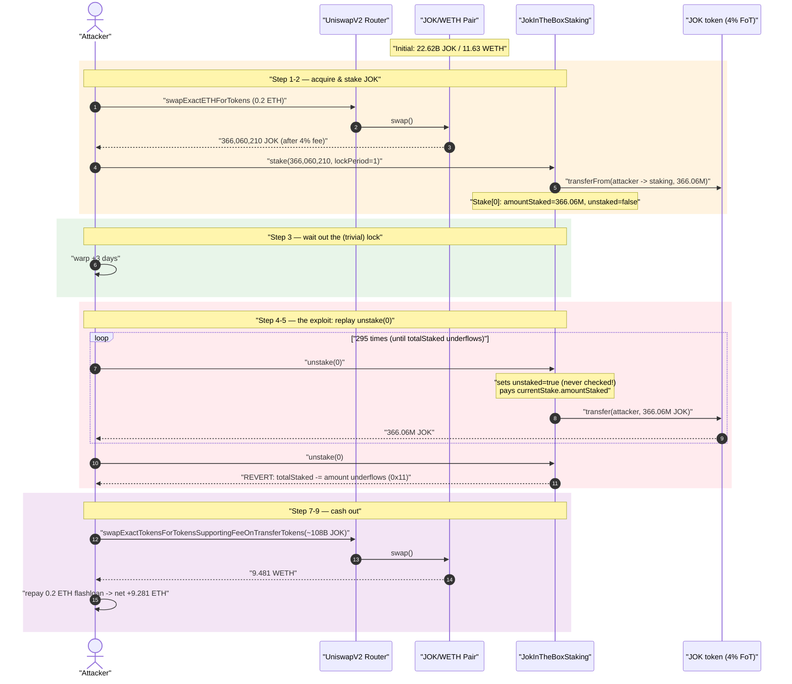
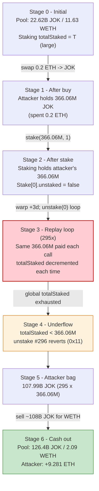
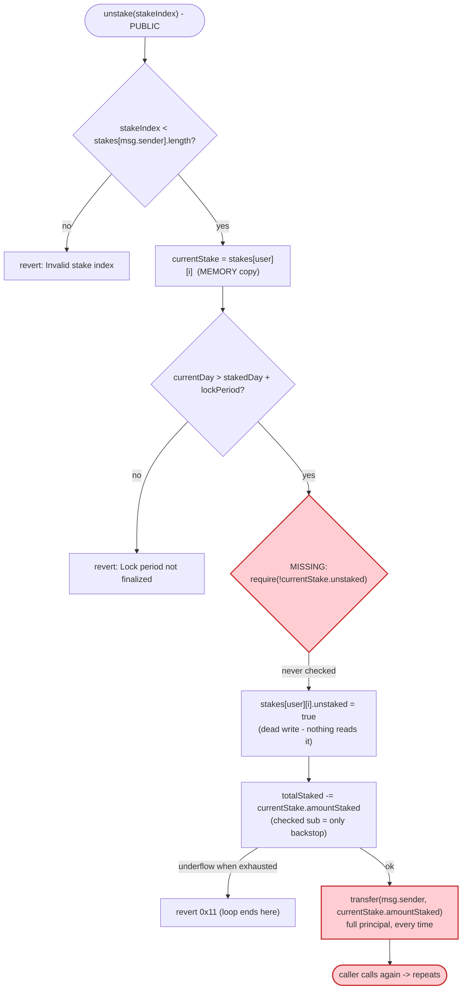

# JokInTheBox Staking Exploit — Missing `unstaked` Guard ⇒ Infinite Re-Unstake Drain

> **Vulnerability classes:** vuln/logic/missing-check · vuln/logic/incorrect-state-transition

> One stake can be `unstake`d hundreds of times. The staking contract never checks whether a stake was already withdrawn, so the attacker keeps pulling the same staked balance out of the pool until its accounting underflows — then dumps the loot for ETH.

> **Reproduction:** the PoC compiles & runs in an isolated Foundry project at
> [this project folder](.) (the umbrella DeFiHackLabs repo contains many unrelated
> PoCs that do not whole-compile under `forge test`, so this one was extracted).
> Full verbose trace: [output.txt](output.txt).
> Verified vulnerable source: [`JokInTheBoxStaking (1).sol`](<sources/JokInTheBoxStaking_A6447f/JokInTheBoxStaking (1).sol>).

---

## Key info

| | |
|---|---|
| **Loss** | **~9.28 ETH** of profit to the attacker (≈ $33–34k at the time); the JOK/WETH Uniswap-V2 pool's WETH side was drained from ~11.6 to ~2.1 WETH |
| **Vulnerable contract** | `JokInTheBoxStaking` — [`0xA6447f6156EFfD23EC3b57d5edD978349E4e192d`](https://etherscan.io/address/0xA6447f6156EFfD23EC3b57d5edD978349E4e192d#code) |
| **Token / victim pool** | `Jok` token [`0xA728Aa2De568766E2Fa4544Ec7A77f79c0bf9F97`](https://etherscan.io/address/0xA728Aa2De568766E2Fa4544Ec7A77f79c0bf9F97#code) · JOK/WETH UniV2 pair `0xaA1d422A231278C99Fb6b432509653b16F6f0397` |
| **Attacker EOA** | [`0xfcd4acbc55df53fbc4c9d275e3495b490635f113`](https://etherscan.io/address/0xfcd4acbc55df53fbc4c9d275e3495b490635f113) |
| **Attacker contract** | `0x9d3425d45df30183fda059c586543dcdeb5993e6` |
| **Attack tx** | [`0xe8277ef6ba8611bd12dc5a6e7ca4b984423bc0b3828159f83b466fdcf4fe054f`](https://etherscan.io/tx/0xe8277ef6ba8611bd12dc5a6e7ca4b984423bc0b3828159f83b466fdcf4fe054f) |
| **Chain / block / date** | Ethereum mainnet / fork block **20,054,628** / June 2024 |
| **Compiler** | Staking: Solidity v0.8.25, optimizer **off** (runs 200). JOK token: v0.8.9, optimizer 1/10000 |
| **Bug class** | Missing state guard / replay — a stake can be unstaked unlimited times (no `unstaked` check) |

---

## TL;DR

`JokInTheBoxStaking.unstake(stakeIndex)` is supposed to return a stake's tokens exactly once. It
sets a per-stake `unstaked = true` flag ([`JokInTheBoxStaking (1).sol:424`](<sources/JokInTheBoxStaking_A6447f/JokInTheBoxStaking (1).sol#L424>))
**but never checks that flag before paying out.** It also reads the stake into a `memory` copy and
always transfers `currentStake.amountStaked` — a value that is never zeroed.

So a single stake of `N` JOK can be unstaked over and over, each call transferring `N` JOK back to
the caller. The only thing that eventually stops the attacker is an *unrelated* counter: each call
also does `totalStaked -= currentStake.amountStaked` ([:427](<sources/JokInTheBoxStaking_A6447f/JokInTheBoxStaking (1).sol#L427>)),
which is a Solidity-0.8 checked subtraction. Once cumulative pretend-withdrawals exceed the global
`totalStaked`, that line underflows and reverts — which is exactly the `catch` the PoC's
`while(true)` loop waits for.

The attacker:

1. Buys a small bag of JOK with 0.2 ETH from the Uniswap pool.
2. `stake()`s the entire bag once (lock period `1` = no real lock, just `> 1 day`).
3. Warps 3 days forward so the lock-period check passes.
4. Calls `unstake(0)` in a loop until it reverts — **295 successful withdrawals**, each pulling the
   same 366,060,210 JOK out of the staking contract.
5. Sells the accumulated **~107.99 billion JOK** back into the pool for WETH and walks away with
   **9.28 ETH** profit (after repaying the 0.2 ETH it started with).

---

## Background — what the protocol does

`JokInTheBoxStaking` ([source](<sources/JokInTheBoxStaking_A6447f/JokInTheBoxStaking (1).sol>)) lets
users stake the `JOK` ERC-20 for a chosen lock period and later claim rewards (distributed off-chain
via a signed `withdraw()`) plus their principal back via `unstake()`. Relevant state:

- `mapping(address => Stake[]) public stakes;` — an append-only array of a user's stakes
  ([:244](<sources/JokInTheBoxStaking_A6447f/JokInTheBoxStaking (1).sol#L244>)).
- Each `Stake` carries `bool unstaked`, `uint256 amountStaked`, `uint256 lockPeriod`, `stakedDay`,
  `unstakedDay` ([:235-241](<sources/JokInTheBoxStaking_A6447f/JokInTheBoxStaking (1).sol#L235-L241>)).
- `uint256 public totalStaked;` — a single global accumulator of all staked principal
  ([:245](<sources/JokInTheBoxStaking_A6447f/JokInTheBoxStaking (1).sol#L245>)).
- `validLockPeriods[1]` is registered as a valid lock period with `bonus = 0`
  ([:317-320](<sources/JokInTheBoxStaking_A6447f/JokInTheBoxStaking (1).sol#L317-L320>)), so a lock
  period of `1` is accepted and only requires `currentDay > stakedDay + 1`.

`JOK` itself is a fee-on-transfer token (≈ **4%** tax — visible in the trace: the pool sends
381,312,718 JOK but the attacker receives only 366,060,210, with 15,252,508 skimmed to the token
contract). The fee is irrelevant to the staking bug but explains why the staked amount is slightly
less than the swap output.

---

## The vulnerable code

### `unstake()` — pays out without ever checking `unstaked`

```solidity
function unstake(uint256 stakeIndex) external {
    require(stakeIndex < stakes[msg.sender].length, "Invalid stake index!");
    Stake memory currentStake = stakes[msg.sender][stakeIndex];   // ← memory copy

    uint256 currentDay = getCurrentDay();

    require(currentDay > currentStake.stakedDay + currentStake.lockPeriod, "Lock period has not finalized!");
    stakes[msg.sender][stakeIndex].unstaked = true;               // ← flag set...
    stakes[msg.sender][stakeIndex].unstakedDay = currentDay;

    totalStaked -= currentStake.amountStaked;                     // ← only thing that can revert
    // Transfer back staked amount
    require(jokToken.transfer(msg.sender, currentStake.amountStaked), "Token transfer failed!");

    emit Unstake(msg.sender, currentStake.amountStaked, block.timestamp, currentStake.lockPeriod, stakeIndex);
}
```
[`JokInTheBoxStaking (1).sol:417-433`](<sources/JokInTheBoxStaking_A6447f/JokInTheBoxStaking (1).sol#L417-L433>)

There is **no `require(!currentStake.unstaked, ...)`** anywhere in the function. The `unstaked = true`
write at line 424 is dead protection — nothing reads it. And because the payout amount comes from the
*unchanged* `currentStake.amountStaked`, every repeated call transfers the full original principal
again.

### `stake()` — for contrast, the deposit side

```solidity
function stake(uint256 amount, uint256 lockPeriod) external {
    require(validLockPeriods[lockPeriod].isValid, "Invalid lock period!");
    uint256 currentDay = getCurrentDay();
    stakes[msg.sender].push(Stake({
            unstaked: false,
            amountStaked: amount,
            lockPeriod: lockPeriod,
            stakedDay: currentDay,
            unstakedDay: 0
    }));
    totalStaked += amount;
    jokToken.transferFrom(msg.sender, address(this), amount);
    emit NewStake(msg.sender, amount, block.timestamp, lockPeriod, stakes[msg.sender].length - 1);
}
```
[`JokInTheBoxStaking (1).sol:343-360`](<sources/JokInTheBoxStaking_A6447f/JokInTheBoxStaking (1).sol#L343-L360>)

One `stake()` deposits `N`, increments `totalStaked` by `N`, and records one entry with
`amountStaked = N`. The contract then holds at least `N` JOK (plus everyone else's stakes). That
shared pot is what the broken `unstake()` lets a single staker drain.

---

## Root cause — why it was possible

The withdrawal path is missing the single most important invariant of any "withdraw once" function:
**a stake that has been settled must not be settleable again.**

1. **No idempotency guard.** `unstake()` writes `unstaked = true` but never checks it. A correct
   implementation must `require(!stakes[msg.sender][stakeIndex].unstaked, "Already unstaked!")` at the
   top (or zero `amountStaked` on first withdrawal).
2. **Memory-copy + immutable payout.** Reading the stake into `Stake memory currentStake` means the
   payout amount (`currentStake.amountStaked`) is forever the original principal, even after the
   storage flag is flipped. The state write and the value read are decoupled, so the write has no
   effect on subsequent payouts.
3. **The only backstop is unrelated accounting.** The single thing that stops the loop is the checked
   subtraction `totalStaked -= currentStake.amountStaked` ([:427](<sources/JokInTheBoxStaking_A6447f/JokInTheBoxStaking (1).sol#L427>)).
   `totalStaked` is a *global* sum of everyone's stakes, so an attacker can withdraw their own stake
   `floor(totalStaked / amountStaked)` times before it underflows. With a large stake relative to the
   global total, the attacker effectively drains the contract's whole JOK balance. This is not a
   safety check — it is an accidental, sizeable allowance.
4. **No real lock.** `lockPeriod = 1` is registered as valid with zero bonus, and the check is merely
   `currentDay > stakedDay + lockPeriod`. A 3-day warp (or just waiting two days) satisfies it. The
   lock provides no protection against the replay.

In short: the contract trusted a flag it never read, and the per-call payout was sourced from data
that the flag was supposed to invalidate.

---

## Preconditions

- A valid lock period whose lock window has elapsed. `validLockPeriods[1]` (bonus 0) is registered,
  so staking with `lockPeriod = 1` and waiting `> 1 day` is enough. The PoC warps **+3 days**.
- The staking contract holds enough JOK (from its own `totalStaked` accounting) to satisfy the
  repeated transfers. The global `totalStaked` at the fork block was large relative to the attacker's
  single stake, allowing **295** repeats.
- A liquid JOK/WETH market to convert the drained JOK into ETH. The attacker self-funds the initial
  JOK purchase with **0.2 ETH** (modeled as a flash loan in the PoC; repaid at the end), so no real
  capital is at risk.

---

## Attack walkthrough (on-chain numbers from the trace)

All figures are taken directly from the events/calls in [output.txt](output.txt). The JOK/WETH UniV2
pair has `token0 = JOK`, `token1 = WETH`, so `reserve0 = JOK`, `reserve1 = WETH`.

| # | Step | Concrete numbers | Effect |
|---|------|------------------|--------|
| 0 | **Initial pool** (`getReserves`) | JOK 22,619,834,303 / WETH 11.629 | Honest pool. |
| 1 | **Buy JOK** — `swapExactETHForTokens` with **0.2 ETH** | pool out 381,312,718 JOK → attacker nets **366,060,210 JOK** (4% FoT skim = 15,252,508) | Attacker holds 366.06M JOK. |
| 2 | **`stake(366,060,210 JOK, 1)`** | one `Stake` recorded: `amountStaked = 366,060,210`; `totalStaked += amount` | The exploitable deposit. |
| 3 | **`vm.warp(+3 days)`** | `currentDay > stakedDay + 1` now true | Lock-period check satisfied. |
| 4 | **`unstake(0)` in a loop** | **295 successful calls**, each `Transfer` of **366,060,210 JOK** from staking → attacker | Same principal paid out 295×. |
| 5 | **296th `unstake(0)` reverts** | `panic: arithmetic underflow (0x11)` on `totalStaked -= amountStaked` | Loop `catch` breaks. |
| 6 | **Tally** | attacker JOK balance = **107,987,761,982** (= 295 × 366,060,210, to the wei) | ~108B JOK extracted. |
| 7 | **Sell all JOK** — `swapExactTokensForTokensSupportingFeeOnTransferTokens` | 103,668,251,503 JOK reach the pool (after FoT) → **9.481 WETH** out | Pool WETH crashes 11.6 → 2.1. |
| 8 | **Repay flash loan** — `transfer(0xdead, 0.2 ETH)` | — | Net leftover = profit. |
| 9 | **Profit** | WETH balance = **9.281 ETH** | Logged `weth profit =  9.281…`. |

The per-call payout (366,060,210.111013959647533876 JOK) is identical on every one of the 295
iterations — the hallmark of a value sourced from an immutable `memory` copy. 295 × that amount equals
the post-loop balance (107,987,761,982.749…) **to the wei**, confirming exactly 295 free withdrawals.

### Why exactly 295 iterations

`totalStaked` is the *global* sum of all stakers' principal. Each `unstake(0)` subtracts the
attacker's `amountStaked` from it. The loop survives while `totalStaked ≥ amountStaked`; the first
call for which `totalStaked < amountStaked` underflows the checked subtraction and reverts. So the
number of free withdrawals is `floor(totalStaked_at_warp / amountStaked) ≈ 295` — i.e. the attacker
got to spend the *entire protocol's* staked accounting on a single stake.

### Profit accounting

| Direction | Amount (ETH/WETH) |
|---|---:|
| Spent — buy JOK (flash-loaned) | 0.20 |
| Received — sell 103.67B JOK | 9.481 |
| Repay flash loan (to `0xdead`) | −0.20 |
| **Net profit** | **+9.281** |

---

## Diagrams

### Sequence of the attack



### Pool / staking state evolution



### The flaw inside `unstake()`



---

## Remediation

1. **Add the idempotency guard (the actual fix).** At the top of `unstake()`:
   ```solidity
   require(!stakes[msg.sender][stakeIndex].unstaked, "Already unstaked!");
   ```
   This alone closes the bug — the flag the contract already sets simply needs to be *checked*.
2. **Zero the payout source on settlement.** Belt-and-suspenders: set
   `stakes[msg.sender][stakeIndex].amountStaked = 0;` before transferring, so even a logic slip can't
   pay the same principal twice. Prefer storage-pointer access (`Stake storage s = stakes[...][i];`)
   over a `memory` copy so reads and writes refer to the same data.
3. **Account per-stake, not just globally.** Relying on `totalStaked` underflow as the only limiter is
   fragile and lets one user spend the whole protocol's accounting. Per-stake settlement state is the
   correct invariant.
4. **Make locks meaningful.** A `lockPeriod` of `1` (day) with `bonus = 0` provides no protection.
   Consider a minimum lock and clearer semantics so "no lock" stakes can't be created accidentally.
5. **Follow checks-effects-interactions and add tests** that attempt a double-unstake — a single unit
   test (`unstake` twice on the same index) would have caught this immediately.

---

## How to reproduce

The PoC was extracted into a standalone Foundry project (the umbrella DeFiHackLabs repo has many
unrelated PoCs that fail to compile under a whole-project `forge build`):

```bash
_shared/run_poc.sh 2024-06-JokInTheBox_exp -vvvvv
```

- RPC: an **Ethereum mainnet archive** endpoint is required (fork block 20,054,628). `foundry.toml`
  uses an Infura archive endpoint; any archive node serving historical state at that block works.
- Result: `[PASS] testExploit()` with `weth profit =  9.281108132962982031`.

Expected tail:

```
  weth profit = : 9.281108132962982031
[PASS] testExploit() (gas: ...)
Suite result: ok. 1 passed; 0 failed; 0 skipped
```

---

*Reference: DeFiHackLabs PoC `src/test/2024-06/JokInTheBox_exp.sol`. Attack tx
`0xe8277ef6ba8611bd12dc5a6e7ca4b984423bc0b3828159f83b466fdcf4fe054f` on Ethereum mainnet.*
