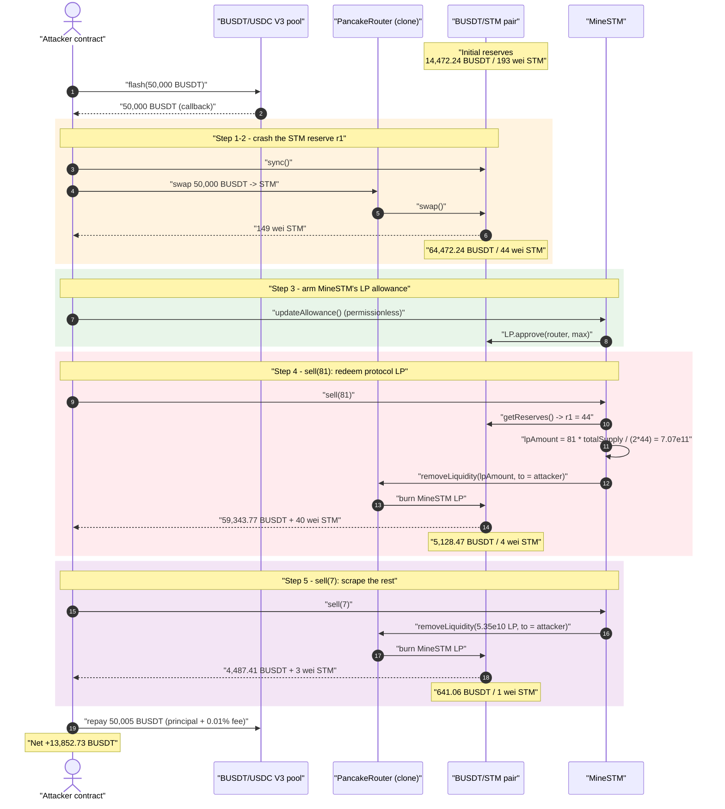
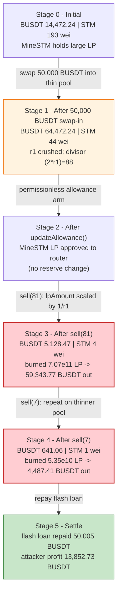
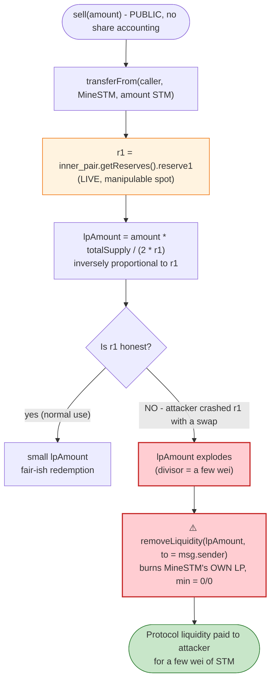

# MineSTM Exploit — `sell()` Redeems the Protocol's Own LP at an Attacker-Manipulated Price

> **Vulnerability classes:** vuln/oracle/price-manipulation · vuln/access-control/missing-auth

> One-liner: a permissionless `sell()` function lets anyone burn a few wei of STM to redeem a
> reserve-proportional slice of **MineSTM's own LP position**, and because the redemption uses the
> pool's live STM reserve as the denominator, the attacker first crashes that reserve with a swap and
> then withdraws ~64K BUSDT of MineSTM-owned liquidity for nothing.

> **Reproduction:** the PoC compiles & runs in an isolated Foundry project at
> [this project folder](.) (the umbrella DeFiHackLabs repo does not whole-compile, so this PoC was
> extracted). Full verbose trace: [output.txt](output.txt).
> Verified vulnerable source: [sources/MineSTM_b7D0A1/MineSTM.sol](sources/MineSTM_b7D0A1/MineSTM.sol).

---

## Key info

| | |
|---|---|
| **Loss** | ~$13.8K — **13,852.73 BUSDT** of MineSTM-owned pool liquidity |
| **Vulnerable contract** | `MineSTM` — [`0xb7D0A1aDaFA3e9e8D8e244C20B6277Bee17a09b6`](https://bscscan.com/address/0xb7D0A1aDaFA3e9e8D8e244C20B6277Bee17a09b6#code) |
| **Victim pool** | BUSDT/STM PancakeSwap-V2-style pair — `0x2E45AEf311706e12D48552d0DaA8D9b8fb764B1C` (UNVERIFIED) |
| **Token sold** | `STMERC20` (a.k.a. "EVE") — [`0xBd0DF7D2383B1aC64afeAfdd298E640EfD9864e0`](https://bscscan.com/address/0xBd0DF7D2383B1aC64afeAfdd298E640EfD9864e0#code) |
| **Router** | `PancakeRouter` clone — [`0x0ff0eBC65deEe10ba34fd81AfB6b95527be46702`](https://bscscan.com/address/0x0ff0eBC65deEe10ba34fd81AfB6b95527be46702#code) |
| **Flash-loan source** | BUSDT/USDC PancakeSwap-V3 pool — `0x92b7807bF19b7DDdf89b706143896d05228f3121` |
| **Attacker EOA** | [`0x40a82dfdbf01630ea87a0372cf95fa8636fcad89`](https://bscscan.com/address/0x40a82dfdbf01630ea87a0372cf95fa8636fcad89) |
| **Attacker contract** | [`0x88c17622d33b327268924e9f90a9e475a244e3ab`](https://bscscan.com/address/0x88c17622d33b327268924e9f90a9e475a244e3ab) |
| **Attack tx** | [`0x849ed7f687cc2ebd1f7c4bed0849893e829a74f512b7f4a18aea39a3ef4d83b1`](https://app.blocksec.com/explorer/tx/bsc/0x849ed7f687cc2ebd1f7c4bed0849893e829a74f512b7f4a18aea39a3ef4d83b1) |
| **Chain / block / date** | BSC / 39,383,150 / June 2024 |
| **Compiler** | Solidity v0.8.19, optimizer **800 runs** |
| **Bug class** | Broken accounting — protocol-owned LP redeemed at a caller-manipulable price; missing share/value relationship |

---

## TL;DR

`MineSTM` is a referral-tree "mining" / staking contract that accumulates a large LP position in the
BUSDT/STM PancakeSwap-V2 pair (it auto-adds liquidity every time a user invests). To let users exit, it
exposes a public `sell(uint256 amount)` function
([MineSTM.sol — `sell`](sources/MineSTM_b7D0A1/MineSTM.sol)):

```solidity
function sell(uint256 amount) external {
    eve_token_erc20.transferFrom(msg.sender, address(this), amount);   // pull `amount` STM from caller
    (, uint256 r1, ) = inner_pair.getReserves();                       // r1 = live STM reserve of the pool
    uint256 lpAmount = amount * inner_pair.totalSupply() / (2 * r1);    // ⚠️ LP to redeem, scaled by 1/r1
    uniswapV2Router.removeLiquidity(                                    // burns MineSTM-owned LP
        address(usdt_token_erc20), address(eve_token_erc20),
        lpAmount, 0, 0, msg.sender, block.timestamp                    // ⚠️ proceeds go to msg.sender
    );
}
```

The amount of LP it burns is `amount * totalSupply / (2 * r1)`, where `r1` is the pool's **current STM
reserve** and `totalSupply` is the **pool's LP total supply**. The LP that gets burned is **MineSTM's
own**, and the underlying BUSDT + STM is sent straight to `msg.sender` (the caller), with `0/0` minimums.

The denominator `r1` is **live, manipulable pool state**. So the attacker:

1. Flash-borrows 50,000 BUSDT and swaps it into the BUSDT/STM pool, **crashing the STM reserve `r1`**
   from `193` wei → `44` wei (STM is an ultra-thin, high-unit-value token).
2. Calls `mineSTM.updateAllowance()` (permissionless — it makes MineSTM approve the router to spend its
   LP), then `sell(81)`: with `r1 = 44` and `totalSupply ≈ 7.68e11`, the formula computes
   `lpAmount = 81 * 7.68e11 / 88 ≈ 7.07e11` LP — a huge fraction of MineSTM's LP — and `removeLiquidity`
   ships **59,343.77 BUSDT** to the attacker for **81 wei of STM**.
3. Calls `sell(7)` again (reserve now even thinner, `r1 = 4`) to mop up another **4,487.41 BUSDT**.
4. Repays the 50,005 BUSDT flash loan (0.01% fee) and keeps the rest.

Net profit: **13,852.73 BUSDT**. The entire loss is MineSTM's accumulated protocol-owned liquidity.

---

## Background — what MineSTM does

`MineSTM` ([source](sources/MineSTM_b7D0A1/MineSTM.sol)) is a BSC "DeFi mining" contract built around a
100-level referral tree (`User` struct, `_ctl`, `_rfp`, `clba`/`clr` level math). Users invest BUSDT
("USDT" on BSC) via `lpMint` / `nodeUserLpMint`; the contract splits the deposit across marketing /
technology / node funds and routes ~90% into the BUSDT/STM AMM pool, accumulating LP tokens that the
**contract itself** holds:

- `swapAndLiquify` / `addLiquidity` ([MineSTM.sol](sources/MineSTM_b7D0A1/MineSTM.sol)) call
  `uniswapV2Router.addLiquidity(USDT, EVE, …, address(this), …)` — every invest grows MineSTM's LP
  balance in the `inner_pair`.
- `getPrice()` prices STM ("EVE") off the same pool via `getAmountsOut`, and `_payoutToken` pays mining
  rewards in STM at that price.
- `sell(uint256)` is the user-exit path: it is supposed to let a holder turn STM back into the
  underlying pool assets, by redeeming a slice of the **contract's** LP.

`STMERC20` ([source](sources/STMERC20_Bd0DF7/STMERC20.sol)) is a vanilla fixed-supply ERC20 (no fees, no
rebases). It is significant only in that the pool holds an extraordinarily small raw STM reserve — at the
fork block the STM side of the pair was just **193 wei** while the BUSDT side held ~14,472 BUSDT, i.e. STM
trades at an enormous per-unit price. That thinness is what makes `r1` trivially crashable.

On-chain facts at the fork block (from the trace):

| Fact | Value |
|---|---|
| Pool BUSDT reserve (`reserve0`) | 14,472.24 BUSDT |
| Pool STM reserve (`reserve1`, = `r1`) | **193 wei** |
| Pool LP `totalSupply` | ~768.17e9 (`768,169,606,393`) |
| MineSTM LP balance (redeemable by `sell`) | enough to back ~64K BUSDT of withdrawals |
| Flash-loanable BUSDT (from BUSDT/USDC V3 pool) | ≥ 50,000 BUSDT, 0.01% fee |

The whole game is that `sell()`'s LP-redemption is scaled by `1 / r1`, and `r1` can be driven near-zero
with a single swap into a near-empty pool.

---

## The vulnerable code

### `sell()` — redeems protocol LP at a price the caller controls

```solidity
// sources/MineSTM_b7D0A1/MineSTM.sol
function sell(uint256 amount) external {
    eve_token_erc20.transferFrom(msg.sender, address(this), amount);
    (, uint256 r1, ) = inner_pair.getReserves();              // r1 = pool's current STM reserve
    uint256 lpAmount = amount * inner_pair.totalSupply() / (2 * r1);
    uniswapV2Router.removeLiquidity(
        address(usdt_token_erc20),
        address(eve_token_erc20),
        lpAmount,                                             // burned from MineSTM's own LP balance
        0, 0,                                                 // amountAMin = amountBMin = 0
        msg.sender,                                           // proceeds sent to the caller
        block.timestamp
    );
}
```

Three independent defects combine here:

1. **The redemption rate uses the live, manipulable reserve `r1` as a divisor.** `lpAmount` is inversely
   proportional to the STM reserve. An attacker who pushes `r1` toward zero (cheaply, because the pool is
   near-empty) makes the same `amount` of STM redeem an unbounded amount of LP. There is no oracle, no
   TWAP, no snapshot — `getReserves()` returns whatever the pool holds *right now*.

2. **The LP being redeemed belongs to the protocol, not the caller.** `removeLiquidity` burns LP held by
   `MineSTM` (it approved the router via `updateAllowance`), but it sends the BUSDT + STM proceeds to
   `msg.sender`. The caller pays only `amount` wei of STM into the contract — wildly less than the value
   of the LP they cause to be burned. There is no per-user share ledger tying a caller's redemption to
   liquidity *they* contributed.

3. **No slippage / value guard.** `removeLiquidity` is called with `amountAMin = amountBMin = 0`, so the
   contract accepts any output, and there is no check that the BUSDT value withdrawn is commensurate with
   the STM paid in. The formula `amount * totalSupply / (2*r1)` is a made-up heuristic with no relation to
   the actual constant-product value of the LP.

### `updateAllowance()` — permissionless approval of the protocol's LP

```solidity
// sources/MineSTM_b7D0A1/MineSTM.sol
function updateAllowance() public {
    usdt_token_erc20.approve(address(uniswapV2Router), type(uint256).max);
    eve_token_erc20.approve(address(uniswapV2Router), type(uint256).max);
    inner_pair.approve(address(uniswapV2Router), type(uint256).max);   // ⚠️ lets the router pull MineSTM's LP
}
```

`updateAllowance()` is `public` with no access control. The attacker calls it during the exploit to make
MineSTM grant the router an unlimited allowance over its **LP tokens**, which is exactly what
`removeLiquidity` needs in order to `transferFrom(MineSTM → pair)` and burn the protocol's liquidity.
(The constructor only ever calls `updateUSDTAndTokenAllowance`, which does *not* approve the LP token, so
this extra public function is what arms the redemption path.)

---

## Root cause — why it was possible

A liquidity-redemption function must convert a *share of ownership* into a *proportional share of the
pooled value*. The correct quantity to burn is determined by **how much LP the redeemer owns**, priced by
the **constant-product value of that LP** — not by a free-floating ratio against a spot reserve.

`MineSTM.sell()` instead defines the redemption as:

> `LP burned = (STM paid) × (pool LP total supply) / (2 × pool STM reserve)`

and pays out of the protocol's own pocket. Two things go wrong simultaneously:

- **The pricing denominator is attacker-controlled.** `2 * r1` shrinks to a handful of wei after a single
  swap into the thin pool, so `lpAmount` explodes. The factor `totalSupply / (2*r1)` is essentially
  "1 / (STM per LP)", evaluated at a manipulated spot — the textbook AMM-spot-as-oracle mistake, here used
  to size a withdrawal rather than a trade.
- **The payer and the payee are different parties.** The caller pays trivial STM into the contract; the
  *contract's* LP is burned and the proceeds go to the caller. With no share accounting, anyone can drain
  the protocol's accumulated liquidity by repeatedly "selling" dust.

In short: `sell()` is a permissionless withdrawal of protocol-owned liquidity, mispriced against a
flash-manipulable spot reserve, with zero slippage protection. Any of the three fixes (own-share
accounting, an oracle/invariant-based price, or a slippage guard) would have blocked it; all three are
missing.

---

## Preconditions

- The BUSDT/STM pool has a **tiny STM reserve** (193 wei here), so `r1` can be crashed cheaply with a
  modest BUSDT swap. (A fat pool would make the divisor manipulation far more expensive, though the
  own-LP-payout flaw would still exist.)
- `MineSTM` holds a meaningful **LP balance** to be drained — true here because the contract has been
  auto-adding liquidity on every user invest.
- Working capital in BUSDT to perform the reserve-crashing swap. The attacker used a **flash loan**
  (50,000 BUSDT from the BUSDT/USDC PancakeSwap-V3 pool) and repaid it in the same transaction, so no
  upfront capital was required.
- `updateAllowance()` is callable by anyone (it is) so the LP-token allowance can be armed mid-exploit.

---

## Attack walkthrough (with on-chain numbers from the trace)

The pair's `token0 = BUSDT` (`reserve0`), `token1 = STM` (`reserve1 = r1`). All figures are taken
directly from the `Sync` / `Swap` / `Burn` events and call returns in
[output.txt](output.txt).

| # | Step | Pool BUSDT (r0) | Pool STM (r1) | Effect |
|---|------|----------------:|--------------:|--------|
| 0 | **Flash loan** — borrow 50,000 BUSDT from BUSDT/USDC V3 pool ([output.txt L15](output.txt)) | 14,472.24 | 193 | Attacker funded; callback begins. |
| 1 | **`BUSDT_STM.sync()`** ([L29](output.txt)) — snap reserves to real balances | 14,472.24 | **193** | Establishes the thin starting reserve. |
| 2 | **Swap 50,000 BUSDT → STM** via `swapExactTokensForTokensSupportingFeeOnTransferTokens` ([L45](output.txt)) | **64,472.24** | **44** | STM reserve crushed 193→44; attacker receives only **149 wei** STM. |
| 3 | **`STM.approve(mineSTM, max)`** + **`mineSTM.updateAllowance()`** ([L79–L96](output.txt)) | 64,472.24 | 44 | Arms MineSTM's LP allowance to the router. |
| 4 | **`mineSTM.sell(81)`** ([L97](output.txt)): `r1=44`, `totalSupply=768,169,606,393` ⇒ `lpAmount = 81·ts/(2·44) = 707,065,205,884` LP → `removeLiquidity` burns MineSTM LP ([L108](output.txt)) | 5,128.47 | 4 | Burn returns **59,343.77 BUSDT** + 40 wei STM to attacker ([L123–L124](output.txt)). |
| 5 | **`mineSTM.sell(7)`** ([L148](output.txt)): `r1=4`, `totalSupply=61,104,400,509` ⇒ `lpAmount = 7·ts/(2·4) = 53,466,350,445` LP → second `removeLiquidity` ([L159](output.txt)) | 641.06 | 1 | Burn returns **4,487.41 BUSDT** + 3 wei STM ([L174–L175](output.txt)). |
| 6 | **Repay flash loan** — transfer 50,005 BUSDT back to V3 pool ([L199](output.txt)) | — | — | 50,000 principal + 0.01% (5 BUSDT) fee. |
| 7 | **Settle** — attacker BUSDT balance ([L217–L219](output.txt)) | — | — | **Profit logged: 13,852.73 BUSDT**. |

**Why `sell(81)` paid out ~59K BUSDT for 81 wei of STM:** the redemption formula is
`lpAmount = amount · totalSupply / (2·r1)`. With `r1` crushed to 44 wei, the divisor is just 88, so 81 wei
of STM maps to `81·768,169,606,393/88 ≈ 7.07e11` LP — a dominant slice of MineSTM's holdings. The
constant-product math of `removeLiquidity` then pays out the BUSDT-heavy reserve that the attacker's own
swap had just stuffed into the pool (64,472 BUSDT), plus MineSTM's pre-existing liquidity. The second
`sell(7)` repeats the trick on the now-even-thinner pool (`r1 = 4`) to scrape the remaining BUSDT.

### Profit accounting (BUSDT)

| Direction | Amount (BUSDT) |
|---|---:|
| Flash-borrowed (in) | 50,000.00 |
| Received — `sell(81)` redemption | 59,343.77 |
| Received — `sell(7)` redemption | 4,487.41 |
| **Total inflow** | **113,831.18** |
| Spent — swap into pool (BUSDT → STM) | 50,000.00 |
| Repaid — flash loan + fee | 50,005.00 |
| **Total outflow** | **100,005.00** |
| **Net profit** | **+13,852.73** |

The swap BUSDT (50,000) is recovered as part of the `removeLiquidity` payout (the attacker is effectively
withdrawing the BUSDT it just deposited *plus* MineSTM's own liquidity), so the realized profit equals the
protocol-owned liquidity drained: **13,852.73 BUSDT (~$13.8K)**.

---

## Diagrams

### Sequence of the attack



### Pool / state evolution



### The flaw inside `sell()`



---

## Why each magic number

- **50,000 BUSDT flash loan / swap:** large relative to the pool's ~14,472 BUSDT reserve, so the swap
  pushes the constant product hard and crushes the STM reserve from 193 → 44 wei. A bigger swap is not
  needed; the pool is already razor-thin on the STM side.
- **`sell(81)` then `sell(7)`:** these are STM-wei amounts tuned to the post-swap reserves. With
  `r1 = 44` the divisor is 88, so `amount = 81` redeems ~7.07e11 LP — close to the maximum MineSTM holds
  without reverting on `removeLiquidity`. After that burn the reserve drops to `r1 = 4` (divisor 8), and
  `amount = 7` redeems the remaining ~5.35e10 LP. The two-step split simply extracts more than a single
  `sell` could, because each burn further thins the pool and changes `totalSupply`.
- **Repay 50,005 BUSDT:** flash-loan principal (50,000) plus the 0.01% V3 flash fee (5 BUSDT), matching
  the `Flash(... paid0: 5e18)` event at [output.txt L212](output.txt).

---

## Remediation

1. **Tie redemption to the caller's own share, not a spot reserve.** A `sell`/withdraw function must
   redeem only liquidity the caller actually owns, tracked in a per-user ledger updated on deposit. Never
   compute the payout as a ratio against the live pool reserve.
2. **Never price a withdrawal off `getReserves()` spot.** If a price is unavoidable, use a manipulation-
   resistant source (TWAP / Chainlink) or the invariant-preserving `pair.burn()` that moves both reserves
   together. The factor `totalSupply / (2*r1)` is a manipulable spot oracle.
3. **Add real slippage / value guards.** Passing `amountAMin = amountBMin = 0` to `removeLiquidity`
   accepts any output. Require that the value withdrawn is commensurate with the value paid in, and revert
   otherwise.
4. **Do not pay the protocol's own LP out to arbitrary callers.** `removeLiquidity(..., msg.sender, ...)`
   sends MineSTM-owned liquidity to whoever calls `sell`. Proceeds from burning protocol LP must return to
   the protocol (or to the verified owner of that share), never to the caller by default.
5. **Restrict / harden allowance management.** `updateAllowance()` is public and grants the router an
   unlimited LP allowance — making the drain path trivially armable. Approve only what is needed, scoped to
   trusted internal flows, and gate state-changing approvals behind access control.
6. **Avoid deploying liquidity into ultra-thin pools.** The 193-wei STM reserve made `r1` crashable for a
   few thousand dollars. Reserve-driven math on a pool this thin is inherently unsafe.

---

## How to reproduce

The PoC was extracted into a standalone Foundry project (the umbrella DeFiHackLabs repo has several
unrelated PoCs that fail to compile under `forge test`'s whole-project build):

```bash
_shared/run_poc.sh 2024-06-MineSTM_exp -vvvvv
```

- RPC: a **BSC archive** endpoint is required (fork block 39,383,149). `foundry.toml` uses
  `https://bsc-mainnet.public.blastapi.io`, which serves historical state at that block; the default
  public OnFinality endpoint rate-limits (HTTP 429) and was swapped out.
- Result: `[PASS] testExploit()` with `Profit: : 13852.726680709398626414`.

Expected tail:

```
Ran 1 test for test/MineSTM_exp.sol:ContractTest
[PASS] testExploit() (gas: 331623)
Logs:
  Profit: : 13852.726680709398626414

Suite result: ok. 1 passed; 0 failed; 0 skipped; finished in 10.74s (10.06s CPU time)
```

---

*Reference: PoC header in [test/MineSTM_exp.sol](test/MineSTM_exp.sol) (DeFiHackLabs). Total lost ~$13.8K, BSC, June 2024.*
