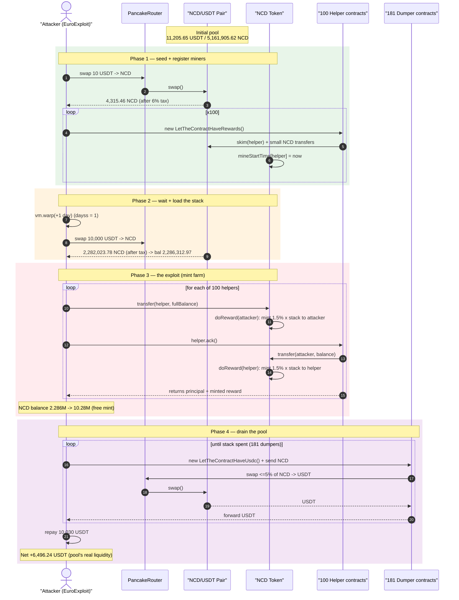
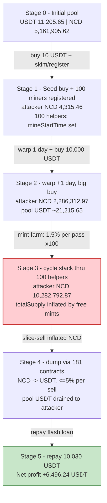
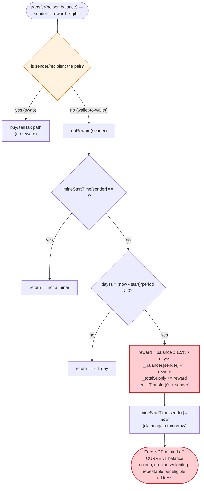

# NCD Exploit — Uncapped Self-Mint Staking Reward Farmed Across Disposable Contracts

> **Vulnerability classes:** vuln/logic/reward-calculation · vuln/arithmetic/overflow

> **Reproduction:** the PoC compiles & runs in an isolated Foundry project at
> [this project folder](.) (the umbrella DeFiHackLabs repo contains many unrelated
> PoCs that do not whole-compile, so this one was extracted).
> Full verbose trace: [output.txt](output.txt).
> Verified vulnerable source: [sources/NCD_960131/NCD.sol](sources/NCD_960131/NCD.sol).

---

## Key info

| | |
|---|---|
| **Loss** | ~$6,496 — **6,496.24 USDT (BSC-USD)** drained from the NCD/USDT PancakeSwap pair |
| **Vulnerable contract** | `NCD` token — [`0x9601313572eCd84B6B42DBC3e47bc54f8177558E`](https://bscscan.com/address/0x9601313572eCd84B6B42DBC3e47bc54f8177558E#code) |
| **Victim pool** | NCD/USDT pair — [`0x94Bb269518Ad17F1C10C85E600BDE481d4999bfF`](https://bscscan.com/address/0x94Bb269518Ad17F1C10C85E600BDE481d4999bfF) |
| **Attacker EOA** | [`0xd52f125085b70f7f52bd112500a9c334b7246984`](https://bscscan.com/address/0xd52f125085b70f7f52bd112500a9c334b7246984) |
| **Attacker contract** | [`0xfad2a0642a44a68606c2295e69d383700643be68`](https://bscscan.com/address/0xfad2a0642a44a68606c2295e69d383700643be68) |
| **Attack tx** | [`0xbfb9b3b8a0d3c589a02f06c516b5c7b7569739edd00f9836645080f2148aefc7`](https://bscscan.com/tx/0xbfb9b3b8a0d3c589a02f06c516b5c7b7569739edd00f9836645080f2148aefc7) |
| **Chain / block / date** | BSC / 39,253,639 / June 2–3, 2024 |
| **Compiler** | Solidity v0.8.6, optimizer **off** (200 runs configured, `optimizer=0`) |
| **Bug class** | Uncapped self-mint reward + permissionless reward eligibility (`balance × 1.5%/day` minted from thin air) |

The PoC test value (`6,496.24`) is the net USDT profit **after repaying the modeled
10,030 USDT flash loan**. The on-chain attacker netted the same scale of value.

---

## TL;DR

The `NCD` token has a built-in "mining" reward: any address whose `mineStartTime[addr]` is
set accrues **1.5% of its own balance per day**, and that reward is **freshly minted** to it on
the next ordinary transfer ([NCD.sol:533-546](sources/NCD_960131/NCD.sol#L533-L546)):

```solidity
uint256 reward = _balances[_sender].mul(15).div(1000).mul(dayss);
_balances[_sender] += reward;
emit Transfer(address(0), _sender, reward);   // ← mint
_totalSupply += reward;
```

There is **no cap, no snapshot, no requirement that the balance was held for the full period,
and no per-account reward ledger**. The reward is computed off the *current* balance at claim
time. So the attacker:

1. Buys NCD, then **registers ~100 throwaway helper contracts** as reward-eligible
   (`mineStartTime` gets set via the buy path / `skim`), each with a tiny balance.
2. Waits **one day** (`vm.warp(+1 days)`).
3. **Stuffs the entire NCD balance into each helper, claims, pulls it back, repeats** — every
   `ack()` call mints `1.5% × (whole stack)` into the helper, and the helper hands the whole stack
   (principal + freshly minted reward) back to the attacker. Cycling the same large balance through
   100 pre-registered contracts compounds a **1.5%-per-pass** mint ~100 times.
4. The attacker's NCD balance balloons from **2.286M NCD** (post-buy) to **10.28M NCD**.
5. **Dumps the inflated NCD into the pool** in many small `swapExactTokensForTokensSupportingFeeOnTransferTokens` slices (≤5% of holdings per swap, to dodge the `sellmaxrate` limit) and walks off with the pool's USDT.

Net result on the modeled flash-loan setup: **+6,496.24 USDT**.

---

## Background — what NCD does

`NCD` ([source](sources/NCD_960131/NCD.sol)) is a BEP20 "mining/deflation" token on BSC with a
fixed supply of **610,000,000 NCD** minted to five treasury wallets at deploy
([NCD.sol:378-399](sources/NCD_960131/NCD.sol#L378-L399)), plus three bolted-on mechanics:

- **Buy/sell taxes** — 3% to `walletInsurance`, 3% to `walletMarket` (sells only), 3% burned to
  `walletDead`, applied only on swaps against the pair (`_transfer`,
  [NCD.sol:549-598](sources/NCD_960131/NCD.sol#L549-L598)).
- **Sell throttle** — non-owner sells are capped at `sellmaxrate = 5%` of the seller's balance and
  to once per `rewardPeriod` (1 day) ([NCD.sol:570-578](sources/NCD_960131/NCD.sol#L570-L578)).
- **Mining reward** — `doReward()` mints `1.5% × balance` per elapsed day to any address whose
  `mineStartTime` has been set, every time that address is the `sender` of a *non-pair* transfer
  ([NCD.sol:533-546](sources/NCD_960131/NCD.sol#L533-L546)).

On-chain parameters at the fork block:

| Parameter | Value |
|---|---|
| `_totalSupply` | 610,000,000 NCD |
| reward rate | `15/1000` = **1.5% per `rewardPeriod`** (uncapped × days) |
| `rewardPeriod` | 86,400 s = **1 day** |
| `sellmaxrate` | 5 (max 5% of balance per sell) |
| `taxInsurance` / `taxMarket` / `taxDead` | 3% / 3% / 3% |
| NCD/USDT pool — USDT reserve | **11,205.65 USDT** ← the prize |
| NCD/USDT pool — NCD reserve | 5,161,905.62 NCD |

The whole game lives in two facts: **(a)** the reward is `1.5% of the *current* balance` (not a
time-weighted principal), and **(b)** eligibility (`mineStartTime != 0`) can be obtained for an
arbitrary number of fresh attacker-controlled contracts. Together they let the attacker mint a
fixed percentage of *whatever balance they choose to park*, as many times as they have eligible
contracts.

---

## The vulnerable code

### 1. The reward mints a % of the *current* balance, uncapped

```solidity
function doReward(address _sender) internal {
    if (mineStartTime[_sender] == 0) {
        return;
    }
    uint256 dayss = (block.timestamp.sub(mineStartTime[_sender])).div(rewardPeriod);
    if (dayss > 0) {
        uint256 reward = _balances[_sender].mul(15).div(1000).mul(dayss); // 1.5% × balance × days
        _balances[_sender] += reward;
        emit Transfer(address(0), _sender, reward);   // ⚠️ free mint
        _totalSupply += reward;                        // ⚠️ inflates supply
        mineStartTime[_sender] = block.timestamp;      // resets the clock — claim again next day
    }
}
```
[NCD.sol:533-546](sources/NCD_960131/NCD.sol#L533-L546)

There is no ledger of "how much was deposited and when". `_balances[_sender]` is read at claim
time, so a balance parked *immediately before* the claim earns the full day's reward as if it had
been held all day.

### 2. The reward fires on *every* ordinary (non-pair) transfer where the sender is eligible

```solidity
function _transfer(address sender, address recipient, uint256 amount) internal {
    ...
    if (takeFee)
    if (uniswapV2Pair == sender || uniswapV2Pair == recipient) {
        ...                       // buy/sell tax branch
    } else {
        // doBurn();
        doReward(sender);         // ⚠️ reward minted on plain wallet-to-wallet transfers
    }
    doTransfer(sender, recipient, amount);
}
```
[NCD.sol:549-598](sources/NCD_960131/NCD.sol#L549-L598)

So a helper contract that holds the attacker's whole stack and then `transfer`s it back to the
attacker mints `1.5% × stack` to *itself* first (it is the `sender`), then forwards the stack.
The helper's `ack()` does exactly this, twice
([NCD_exp.sol:30-35](test/NCD_exp.sol#L30-L35)):

```solidity
function ack() public {
    ncd_.transfer(msg.sender, ncd_.balanceOf(address(this)));   // mints 1.5%, then sends balance
    ncd_.transfer(msg.sender, ncd_.balanceOf(address(this)));   // sends the freshly-minted reward
}
```

### 3. Eligibility (`mineStartTime`) is trivially obtainable

`mineStartTime[recipient]` is set whenever an address **buys** from the pair
([NCD.sol:567-568](sources/NCD_960131/NCD.sol#L567-L568)):

```solidity
if (uniswapV2Pair == sender) {            // buy
    ...
    if (mineStartTime[recipient] == 0)
        mineStartTime[recipient] = block.timestamp;
}
```

The helper's `preStartTimeRewards()` arranges this by calling `pair.skim(helper)` (which routes
NCD out of the pair *to* the helper, i.e. a "buy"-shaped inflow) and by sending NCD into the pair,
ending with `require(ncd_.mineStartTime(address(this)) > 0)` — confirming the helper is now a
registered miner ([NCD_exp.sol:23-28](test/NCD_exp.sol#L23-L28)). The PoC registers **100** such
helpers in a loop.

---

## Root cause — why it was possible

The reward is **a fixed percentage of an attacker-chosen, instantaneous balance, mintable once per
day per eligible address, with eligibility granted to arbitrary contracts**. Four design errors
compose into a self-minting money printer:

1. **No principal/time accounting.** `doReward` rewards `balanceOf(now)`, not the balance that was
   actually staked for the period. Depositing the stack one block before claiming earns the full
   day's 1.5%. A correct staking design would snapshot deposits and reward only the *time-weighted*
   principal.
2. **Reward is freshly minted, not paid from a funded pot.** `_totalSupply += reward` dilutes every
   holder (and the pool) to pay the claimant. There is no reserve backing it, so each claim is pure
   inflation that the attacker converts to USDT.
3. **Eligibility is permissionless and cloneable.** Any address can become a miner just by
   interacting with the pair; the attacker spins up 100 fresh contracts and cycles the *same* large
   balance through all of them, multiplying a 1.5% mint into ~100 compounded mints in a single tx.
4. **The sell-side defenses are individually weak and individually bypassable.** The 5%-per-sell
   cap and once-per-day sell throttle apply *per address*; the attacker dodges them by minting a
   huge balance (so 5% is still large) and by spreading the dump across **181 freshly-created
   `LetTheContractHaveUsdc` contracts**, each selling ≤5% of a fresh allocation, so neither the cap
   nor the per-address daily throttle ever binds.

The 3% buy/sell/dead taxes — the only friction on exit — merely trim the proceeds; they cannot
offset value that was minted at zero cost.

---

## Preconditions

- The NCD token's reward is live (`rewardPeriod = 1 day`, reward rate `1.5%`), and the attacker can
  register `mineStartTime` for helper contracts (always true — it is granted by any pair interaction).
- At least **one `rewardPeriod` (1 day)** must elapse between registering a helper and claiming, so
  `dayss > 0`. The live attack waited a day; the PoC reproduces it with `vm.warp(block.timestamp + 1 days)`
  ([NCD_exp.sol:90](test/NCD_exp.sol#L90)).
- Working capital in USDT to (a) seed the initial NCD position and (b) hold during the dump. The PoC
  models 10,000 USDT of "flash loan" capital plus 10 USDT of seed, repays 10,030 USDT at the end,
  and keeps the rest as profit ([NCD_exp.sol:92-108](test/NCD_exp.sol#L92-L108)).

---

## Attack walkthrough (with on-chain numbers from the trace)

The pair's `token0 = USDT`, `token1 = NCD` → `reserve0 = USDT`, `reserve1 = NCD`. All figures are
read directly from the `getReserves`, `Swap`, `Sync` and `Transfer` events in
[output.txt](output.txt).

| # | Step | Attacker NCD balance | Effect |
|---|------|---------------------:|--------|
| 0 | **Seed buy** — swap 10 USDT → NCD; after 6% tax attacker receives 4,315.46 NCD ([output.txt L54-L92](output.txt)) | 4,315.46 | Establishes a starting NCD position. Pool: 11,215.65 USDT / 5,157,314.70 NCD. |
| 1 | Send 5% of NCD to the pair, then **register 100 helper contracts** via `preStartTimeRewards()` (each does `pair.skim` + small NCD transfers; sets `mineStartTime`) ([output.txt L131-…](output.txt)) | ~ | 100 contracts now reward-eligible (`mineStartTime = 1717309917`). |
| 2 | **`vm.warp(+1 day)`** → `dayss = 1` for every helper ([output.txt L4070](output.txt)) | — | Reward clock now yields 1 full day for all helpers. |
| 3 | **Big buy** — swap 10,000 USDT → NCD; after 6% tax attacker receives 2,282,023.78 NCD ([output.txt L4079-L4128](output.txt)) | 2,286,312.97 | Pool reserves: ~21,215.65 USDT / 2,729,629.83 NCD. Loads the stack to be cycled. |
| 4 | **Cycle the whole stack through 100 helpers.** For each helper: `transfer(helper, fullBalance)` (mints 1.5% to attacker via `doReward`), then `helper.ack()` mints another 1.5% to the helper and returns everything ([output.txt L4131-…](output.txt)) | grows 2.286M → **10.28M** | Each pass mints `1.5% × stack`; 100 passes compound it ~4.5×. Verified mint examples: `34,294.69 NCD` minted on a `2,286,312.97` balance = exactly 1.5%. |
| 5 | Enter the dump loop holding **10,282,792.87 NCD** ([output.txt L7031-L7039](output.txt)) | 10,282,792.87 | Ready to sell. |
| 6 | **Drain** — spin up 181 `LetTheContractHaveUsdc` contracts; each swaps ≤5% of its NCD allocation → USDT and forwards USDT back, looping until the stack is spent ([output.txt L7039-…, L21927-L22352](output.txt)) | → ~0 | Pool USDT progressively pulled to the attacker; per-address 5%/day sell limits never bind. |
| 7 | **Repay** 10,030 USDT "flash loan" to `0xdead`, keep the rest ([NCD_exp.sol:108](test/NCD_exp.sol#L108)) | — | **Net profit = 6,496.24 USDT.** |

### Why cycling through 100 contracts compounds the mint

`doReward` mints `1.5% × _balances[sender]` *and resets the clock*, then `ack()` hands the entire
(now-larger) balance back. Each helper sees the **full** current stack, so each pass mints 1.5% of
the *running total*, not of the original deposit. With one pass that is +1.5%; with 100 passes the
balance grows by `(1.015)^k`-style compounding (plus the extra mint on the attacker's own outbound
transfer each pass), taking 2.286M NCD → 10.28M NCD — roughly a **4.5× inflation** funded entirely
by `_totalSupply += reward`.

### Profit accounting (USDT)

| Direction | Amount (USDT) |
|---|---:|
| Seed capital in | 10.00 |
| Modeled flash loan in | 10,000.00 |
| **Total deployed** | **10,010.00** |
| USDT pulled out of the pool by the dump loop | ≈ 16,526 (gross, pre-repay) |
| Flash-loan repayment to `0xdead` | −10,030.00 |
| **Net profit (PoC `profit usdc_ balance`)** | **+6,496.24** |

The profit is the pool's real USDT liquidity, captured by selling NCD that was minted for free.

---

## Diagrams

### Sequence of the attack



### Pool / balance state evolution



### The flaw inside `doReward`



---

## Why each magic number

- **100 helper contracts (`preStartTimeRewards` loop):** each is a separate reward-eligible address;
  cycling the full stack through all of them compounds the 1.5%-per-pass mint into a ~4.5× balance
  increase in one transaction.
- **`vm.warp(+1 days)`:** the minimum `dayss > 0` so `doReward` actually mints. One day is enough —
  the reward is per-day but applied to the *full current balance*, so a single day on a huge cycled
  balance is all that is needed.
- **`* 5 / 100` (transfer 5% of balance to the pair, sell ≤5% per dumper):** mirrors the token's own
  `sellmaxrate = 5%` cap; selling exactly the maximum allowed slice per fresh contract maximizes
  throughput while never tripping the limit.
- **181 `LetTheContractHaveUsdc` dumpers (`while balance > 1000 ether`):** each fresh contract has no
  prior `lastSellTime`, so the once-per-day per-address sell throttle never applies; spreading the
  10.28M-NCD dump across many addresses defeats both the 5% cap and the daily throttle.
- **10,000 USDT "flash loan" + 10,030 repay:** models borrowed working capital; the 30 USDT spread is
  a nominal fee. Profit is computed after repayment.

---

## Remediation

1. **Do not reward the *current* balance — reward time-weighted, snapshotted principal.** Record the
   amount and timestamp at deposit and only accrue on principal that was actually held for the full
   period. A balance parked one block before a claim must earn nothing.
2. **Never mint rewards from thin air.** `_totalSupply += reward` dilutes every holder and the pool.
   Pay rewards from a pre-funded, capped emissions pot; when the pot is empty, rewards stop. This
   bounds the maximum value any actor can extract.
3. **Cap and rate-limit the reward.** Even a funded reward should cap the per-account, per-period
   payout and ignore balances acquired within the current period (anti just-in-time-deposit).
4. **Make reward eligibility meaningful, not a free side-effect of any pair interaction.** Granting
   `mineStartTime` on every buy/`skim` lets an attacker register unlimited disposable contracts.
   Require an explicit, non-cloneable stake (e.g. locked deposits) and treat contract addresses /
   freshly-created accounts as ineligible, or apply a minimum holding age.
5. **Apply sell defenses globally, not per address.** The 5%-per-sell cap and daily throttle are
   trivially bypassed by sharding the dump across fresh contracts. Track limits against the
   beneficial owner, or cap total sell volume against the pool over a window.
6. **Audit any path where a transfer mints supply.** A plain wallet-to-wallet `transfer` should never
   change `_totalSupply`. The `doReward(sender)` call inside `_transfer` is the structural defect.

---

## How to reproduce

The PoC was extracted into a standalone Foundry project (the umbrella DeFiHackLabs repo has many
unrelated PoCs that fail to whole-compile under `forge test`):

```bash
_shared/run_poc.sh 2024-06-NCD_exp -vvvvv
```

- RPC: a **BSC archive** endpoint is required (fork block 39,253,639). `foundry.toml` uses
  `https://bsc-mainnet.public.blastapi.io`, which serves historical state at that block; pruning
  public RPCs fail with `header not found` / rate-limit (`429`).
- Result: `[PASS] testExploit()` with `profit usdc_ balance = : 6496.24…`.

Expected tail:

```
Ran 1 test for test/NCD_exp.sol:EuroExploit
[PASS] testExploit() (gas: 397315685)
  ack before usdc_ balance = : 10.000000000000000000
  profit usdc_ balance = : 6496.244225989003656911
Suite result: ok. 1 passed; 0 failed; 0 skipped
```

---

*Reference: SlowMist analysis — https://x.com/SlowMist_Team/status/1797821034319765604 (NCD, BSC, ~$6.4K).*
