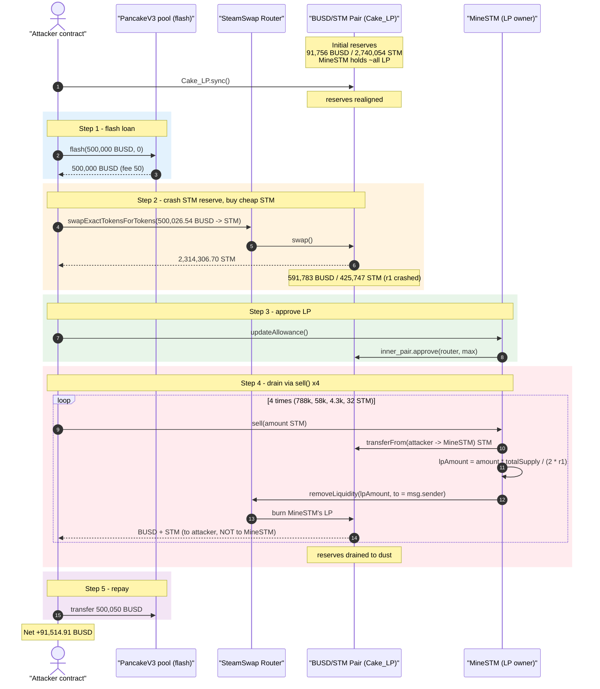
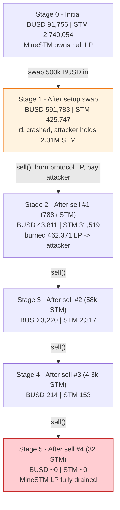
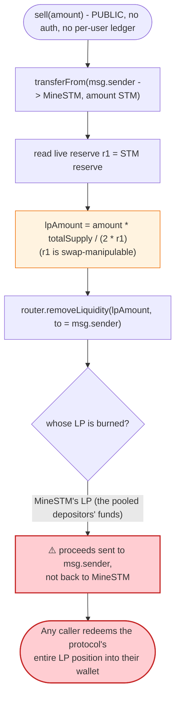

# SteamSwap (MineSTM) Exploit — `sell()` Redeems the Protocol's Own LP To Any Caller

> **Vulnerability classes:** vuln/oracle/price-manipulation · vuln/access-control/missing-auth

> **Reproduction:** the PoC compiles & runs in an isolated Foundry project at
> [this project folder](.) (the umbrella DeFiHackLabs repo
> contains many unrelated PoCs that do not whole-compile, so this one was extracted).
> Full verbose trace: [output.txt](output.txt).
> Verified vulnerable source: [sources/MineSTM_b7D0A1/MineSTM.sol](sources/MineSTM_b7D0A1/MineSTM.sol).

---

## Key info

| | |
|---|---|
| **Loss** | ~$91.5k — **91,514.91 BUSD** (USDT, `0x55d3…`) net profit drained from MineSTM's pool position |
| **Vulnerable contract** | `MineSTM` — [`0xb7D0A1aDaFA3e9e8D8e244C20B6277Bee17a09b6`](https://bscscan.com/address/0xb7D0A1aDaFA3e9e8D8e244C20B6277Bee17a09b6#code) |
| **Victim pool** | SteamSwap BUSD/STM pair (`Cake_LP`) — `0x2E45AEf311706e12D48552d0DaA8D9b8fb764B1C` |
| **STM (EVE) token** | [`0xBd0DF7D2383B1aC64afeAfdd298E640EfD9864e0`](https://bscscan.com/address/0xBd0DF7D2383B1aC64afeAfdd298E640EfD9864e0#code) |
| **SteamSwap router** | `0x0ff0eBC65deEe10ba34fd81AfB6b95527be46702` |
| **Attacker EOA** | `0xb2d546547168f61debf0a780210b5591e4dd39a8` |
| **Attacker contract** | `0xa4fd1beac3b5fb78a8ec074338152100b87437a9` |
| **Attack tx** | [`0x40f3bdd0a3a8d0476ae6aa2875dc2ec60b80812e2a394b67a88260df57c65522`](https://bscscan.com/tx/0x40f3bdd0a3a8d0476ae6aa2875dc2ec60b80812e2a394b67a88260df57c65522) |
| **Chain / block / date** | BSC / 39,381,373 / June 2024 |
| **Compiler** | Solidity v0.8.19, optimizer **800 runs** |
| **Bug class** | Broken accounting — protocol redeems LP it owns and sends the proceeds to an arbitrary caller |

---

## TL;DR

`MineSTM` is the staking/mining core of "SteamSwap". Users deposit USDT via `lpMint()`; the
contract converts that USDT into BUSD/STM liquidity and **holds the resulting LP tokens itself**
(it is the LP owner of record in the BUSD/STM pair). To let a user exit, the contract exposes:

```solidity
function sell(uint256 amount) external {
    eve_token_erc20.transferFrom(msg.sender, address(this), amount);          // pull STM from caller
    (, uint256 r1, ) = inner_pair.getReserves();
    uint256 lpAmount = amount * inner_pair.totalSupply() / (2 * r1);          // how much LP to burn
    uniswapV2Router.removeLiquidity(usdt, stm, lpAmount, 0, 0, msg.sender, block.timestamp); // ⚠️ to msg.sender
}
```
([MineSTM.sol:633-638](sources/MineSTM_b7D0A1/MineSTM.sol#L633-L638))

Two fatal flaws compose here:

1. **The LP being burned belongs to the protocol, not the caller.** `removeLiquidity` spends
   `MineSTM`'s own LP balance (the pooled liquidity of *all* depositors) and hands the redeemed
   BUSD + STM to **`msg.sender`** — an arbitrary address. There is no per-user LP ledger, no
   ownership check, and the caller only had to supply some STM tokens (which they get most of back).
2. **The amount of LP to burn is priced off the live, manipulable pool reserve `r1`.** Because
   `lpAmount = amount · totalSupply / (2·r1)`, an attacker who first **crashes the STM reserve `r1`**
   (by swapping a large amount of BUSD into the pair) makes each unit of deposited STM redeem a
   far larger slice of the protocol's LP — letting a relatively small STM input burn essentially
   the entire LP position.

The attacker takes a 500,000 BUSD PancakeSwap-V3 flash loan, dumps it into the BUSD/STM pair to both
acquire cheap STM **and** depress `r1`, then calls `sell()` four times to burn 100% of MineSTM's LP
and walk away with the underlying BUSD. After repaying the flash loan they net **+91,514.91 BUSD**.

---

## Background — what MineSTM does

`MineSTM` ([source](sources/MineSTM_b7D0A1/MineSTM.sol)) is an MLM-style yield/mining contract built
on top of a PancakeSwap-V2-style BUSD/STM pair (`inner_pair`) and the project's own router fork
(`uniswapV2Router = 0x0ff0…6702`). The relevant lifecycle:

- **Deposit (`lpMint`)** — a user sends USDT; the contract skims fund fees, then either swaps half
  USDT→STM and adds liquidity, or adds liquidity directly (`swapAndLiquify` / `addLiquidity`,
  [MineSTM.sol:355-371](sources/MineSTM_b7D0A1/MineSTM.sol#L355-L371)). The LP tokens minted by these
  `addLiquidity` calls are received by **`address(this)` — MineSTM** (`to = address(this)`). So the
  protocol contract is the holder of essentially all of the pair's LP supply.
- **Allowance bootstrap (`updateAllowance`)** — a **public, unauthenticated** helper that approves the
  router to spend MineSTM's USDT, STM, **and its LP tokens** (`inner_pair.approve(router, max)`)
  ([MineSTM.sol:389-393](sources/MineSTM_b7D0A1/MineSTM.sol#L389-L393)). This is what makes the LP
  spendable by the router during `sell()`.
- **Exit (`sell`)** — intended to let a depositor redeem STM back into underlying assets, but
  implemented as the broken function above.

Reserve facts at the fork block (read from the `Sync`/`getReserves` calls in the trace; `token0 = BUSD`,
`token1 = STM`):

| Parameter | Value |
|---|---|
| Pair LP `totalSupply` (after attacker's swap) | 499,338.33 LP |
| BUSD reserve `r0` *after attacker's setup swap* | 591,783.18 BUSD |
| STM reserve `r1` *after attacker's setup swap* | 425,747.85 STM |
| Net BUSD value of MineSTM's LP position | ≈ the entire ~591k BUSD side of the pool |
| Attacker's own starting BUSD | 26.54 BUSD |

---

## The vulnerable code

### 1. `sell()` — burns the protocol's LP, pays out to `msg.sender`

```solidity
function sell(uint256 amount) external {
    eve_token_erc20.transferFrom(msg.sender, address(this), amount);
    (, uint256 r1, ) = inner_pair.getReserves();
    uint256 lpAmount = amount*inner_pair.totalSupply()/(2*r1);
    uniswapV2Router.removeLiquidity(
        address(usdt_token_erc20), address(eve_token_erc20),
        lpAmount, 0, 0, msg.sender, block.timestamp);   // ⚠️ recipient = caller, LP = MineSTM's
}
```
([MineSTM.sol:633-638](sources/MineSTM_b7D0A1/MineSTM.sol#L633-L638))

`removeLiquidity` pulls `lpAmount` LP tokens **from MineSTM** (the LP owner that approved the router),
burns them in the pair, and sends the redeemed `amountA` (BUSD) + `amountB` (STM) **to
`msg.sender`**. The function does not track which caller contributed which LP; any address that owns
some STM can redeem the *protocol's* LP into its own pocket.

### 2. `updateAllowance()` — public, approves the LP for spending

```solidity
function updateAllowance() public {                       // ← no access control
    usdt_token_erc20.approve(address(uniswapV2Router), type(uint256).max);
    eve_token_erc20.approve(address(uniswapV2Router), type(uint256).max);
    inner_pair.approve(address(uniswapV2Router), type(uint256).max);   // ⚠️ LP approved to router
}
```
([MineSTM.sol:389-393](sources/MineSTM_b7D0A1/MineSTM.sol#L389-L393))

The attacker calls this first so the router is allowed to move MineSTM's LP during `sell()`.

### 3. `lpMint()` / `addLiquidity()` — protocol becomes the LP holder

```solidity
function addLiquidity(uint256 token0Amount, uint256 token1Amount) private {
    uniswapV2Router.addLiquidity(
        address(usdt_token_erc20), address(eve_token_erc20),
        token0Amount, token1Amount, 0, 0,
        address(this),                 // ← LP minted to MineSTM itself
        block.timestamp);
}
```
([MineSTM.sol:362-371](sources/MineSTM_b7D0A1/MineSTM.sol#L362-L371))

---

## Root cause — why it was possible

`sell()` conflates two things that must never be conflated in an AMM-backed vault:

> **"How much LP does this caller own"** versus **"how much LP does the contract hold."**

The function computes a redemption size from the *deposited STM amount and the pool reserves*, then
burns that much of the **contract's** LP and forwards the proceeds to the caller. Because the
contract holds the pooled liquidity of every depositor, *any* caller can drain *everyone's* liquidity
by repeatedly redeeming. There is no:

- per-user LP/balance accounting,
- check that `msg.sender` ever deposited,
- requirement that the proceeds go back to the contract,
- slippage / `amountMin` protection (`0, 0`),
- and the redemption multiplier `totalSupply/(2·r1)` is computed from the **instantaneous, swap-manipulable** reserve `r1`.

The reserve-dependence is what turns a logic bug into a *cheap* one. By front-running the `sell()`
calls with a large BUSD→STM swap, the attacker (a) buys STM at a crashed price and (b) shrinks `r1`,
so `lpAmount = amount · totalSupply / (2·r1)` blows up — a modest STM input now maps to a huge LP
burn. Four `sell()` calls with geometrically decreasing STM amounts burn the LP position down to dust.

The starting `Cake_LP.sync()` ([SteamSwap_exp.sol:51](test/SteamSwap_exp.sol#L51)) simply realigns the
pair's stored reserves with its actual token balances before the attack, so the subsequent math uses
clean, current numbers.

---

## Preconditions

- `MineSTM` holds the bulk of the BUSD/STM pair's LP (true — every `lpMint` adds liquidity to
  `address(this)`).
- The router has (or can be given) an allowance over MineSTM's LP. `updateAllowance()` is **public**,
  so the attacker grants it themselves inside the exploit
  ([SteamSwap_exp.sol:66](test/SteamSwap_exp.sol#L66)).
- Working capital in BUSD to crash the STM reserve. Peak outlay is the **500,000 BUSD** flash-loan
  draw; it is fully recovered + profit within the same transaction, hence **flash-loanable** (the PoC
  borrows it from the PancakeSwap-V3 BUSD pool via `flash()`).

---

## Attack walkthrough (with on-chain numbers from the trace)

`token0 = BUSD`, `token1 = STM`, so `reserve0 = BUSD`, `reserve1 = STM`. All figures are taken from
the `Sync`, `Swap`, `Burn`, and `removeLiquidity` traces in [output.txt](output.txt).

| # | Step | Pool BUSD (r0) | Pool STM (r1) | Effect |
|---|------|---------------:|--------------:|--------|
| 0 | **`Cake_LP.sync()`** — align reserves to real balances ([:51](test/SteamSwap_exp.sol#L51)) | 91,756.64 | 2,740,054.54 | Clean starting reserves. |
| 1 | **Flash loan** 500,000 BUSD from PancakeV3 pool (`flash`) ([:53](test/SteamSwap_exp.sol#L53)) | — | — | Attacker now holds 500,026.54 BUSD. |
| 2 | **Setup swap** — `swapExactTokensForTokens…FeeOnTransfer` 500,026.54 BUSD → 2,314,306.70 STM (recipient = attacker) | 591,783.18 | 425,747.85 | STM price crashed; `r1` shrunk; attacker holds 2.31M STM. |
| 3 | **`updateAllowance()`** — approve router over MineSTM's LP ([:66](test/SteamSwap_exp.sol#L66)) | 591,783.18 | 425,747.85 | LP now spendable by router. |
| 4 | **`sell(788,457.28 STM)`** → burns `lpAmount = 462,371.04` LP → attacker gets **547,971.96 BUSD + 394,228.64 STM** | 43,811.22 | 31,519.20 | LP position ~92% drained in one call. |
| 5 | **`sell(58,404.24 STM)`** → burns 34,249.71 LP → **40,590.52 BUSD + 29,202.12 STM** | 3,220.71 | 2,317.08 | |
| 6 | **`sell(4,326.24 STM)`** → burns 2,537.02 LP → **3,006.70 BUSD + 2,163.12 STM** | 214.00 | 153.96 | |
| 7 | **`sell(32.05 STM)`** → burns 18.79 LP → **22.27 BUSD + 16.02 STM** | ~tiny | ~tiny | LP position fully drained. |
| 8 | **Repay flash loan** — transfer 500,050 BUSD back to the PancakeV3 pool ([:74](test/SteamSwap_exp.sol#L74)) | — | — | 500k principal + 50 BUSD fee. |

The first `sell` LP math checks out exactly:
`lpAmount = 788457.28 · 499338.33 / (2 · 425747.85) = 462,371.04` LP — identical to the
`removeLiquidity(…, 462371036766512398783797, …)` argument in the trace
([output.txt:1678](output.txt)).

### Profit accounting (BUSD)

| Direction | Amount (BUSD) |
|---|---:|
| Starting balance | 26.54 |
| Flash-loan borrow | +500,000.00 |
| Setup swap (out, into pool) | −500,026.54 |
| `sell` #1 BUSD received | +547,971.96 |
| `sell` #2 BUSD received | +40,590.52 |
| `sell` #3 BUSD received | +3,006.70 |
| `sell` #4 BUSD received | +22.27 |
| Flash-loan repay (principal + 50 fee) | −500,050.00 |
| **Final BUSD balance** | **91,541.45** |
| **Net profit (final − start)** | **+91,514.91** |

The attacker additionally keeps **≈ 425,610 STM** that came back out of the LP burns (worthless after
the pool was emptied, so profit is measured in BUSD). The closing balance of **91,541.45 BUSD** matches
the PoC's logged `Attacker After exploit USDT Balance` to the wei.

---

## Diagrams

### Sequence of the attack



### Pool / LP state evolution



### The flaw inside `sell()`



---

## Why each magic number

- **500,000 BUSD flash loan + 500,026.54 BUSD setup swap:** large enough to crash the STM reserve `r1`
  from 2,740,054 down to 425,747, both acquiring cheap STM and inflating the LP-burn multiplier
  `totalSupply/(2·r1)`. The swap input is the borrowed 500,000 plus the attacker's own 26.54 BUSD.
- **`sell` amounts 788,457 → 58,404 → 4,326 → 32 STM:** chosen so that each call's
  `lpAmount = amount·totalSupply/(2·r1)` consumes the remaining LP in decreasing tranches, draining the
  position to ~0 without ever requesting more LP than MineSTM holds (which would revert). The first
  call alone burns ~92% of the LP; the rest mop up the tail.
- **500,050 BUSD repayment:** the 500,000 principal plus the PancakeV3 flash fee of 50 BUSD (`paid0`
  in the `Flash` event, [output.txt](output.txt)).

---

## Remediation

1. **Track per-user contributions and only redeem what the caller owns.** `sell()` must look up an
   internal ledger of the caller's deposited principal / LP share and never burn more than that. The
   pooled LP of all depositors must not be redeemable by an arbitrary caller.
2. **Never send `removeLiquidity` proceeds to `msg.sender` blindly.** Redeem to the contract, then
   distribute to the caller only the amount they are entitled to per the ledger.
3. **Do not price redemptions off live, manipulable reserves.** `lpAmount = amount·totalSupply/(2·r1)`
   lets a flash-swap of the pool change the payout. Use the caller's recorded LP balance, or a
   TWAP/oracle, not the instantaneous spot reserve.
4. **Add slippage protection.** The `amountAMin`/`amountBMin` arguments to `removeLiquidity` are `0, 0`;
   set realistic minimums to make reserve manipulation unprofitable / revert.
5. **Restrict `updateAllowance()`.** It is `public` and grants the router an allowance over the
   protocol's LP and tokens; gate it to the owner/keeper, or remove the LP approval entirely and route
   all LP movement through internal, ledger-checked logic.

---

## How to reproduce

The PoC was extracted into a standalone Foundry project (the umbrella DeFiHackLabs repo has many
unrelated PoCs that fail to compile under `forge test`'s whole-project build):

```bash
_shared/run_poc.sh 2024-06-SteamSwap_exp -vvvvv
```

- RPC: a **BSC archive** endpoint is required (fork block 39,381,373 is well in the past).
  `foundry.toml` uses `https://bsc-mainnet.public.blastapi.io`, which serves historical state there;
  most public BSC RPCs prune it and fail with `header not found` / `missing trie node`.
- Result: `[PASS] testExploit()` with the attacker's BUSD balance rising from 26.54 to 91,541.45.

Expected tail:

```
Ran 1 test for test/SteamSwap_exp.sol:SteamSwap
[PASS] testExploit() (gas: 462161)
  Attacker Before exploit USDT Balance: 26.542161622221038197
  Attacker After exploit USDT Balance: 91541.452128431815634032
Suite result: ok. 1 passed; 0 failed; 0 skipped
```

---

*Reference: DeFiHackLabs — SteamSwap (MineSTM), BSC, ~$91k.*
