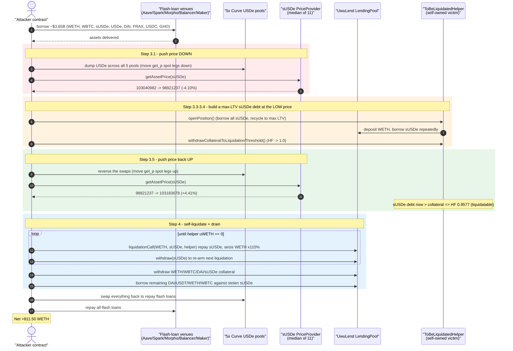
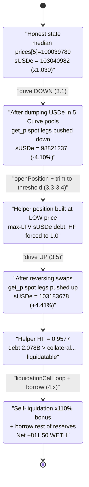

# UwuLend Exploit (#1) — sUSDe Oracle Manipulation via Curve Spot Prices in the Median

> **Reproduction:** the PoC compiles & runs in an isolated Foundry project at
> [this project folder](.) (the umbrella DeFiHackLabs repo contains many
> unrelated PoCs that do not compile together, so this one was extracted).
> Full verbose log: [output.txt](output.txt).
> Genuinely vulnerable source: [`sUSDePriceProviderBUniCatch`](sources/sUSDePriceProviderBUniCatch_d25295/contracts_price-getters_susde_sUSDePriceProviderBUniCatch.sol).

---

## Key info

| | |
|---|---|
| **Loss** | ~$19.3M total drained from UwuLend (this PoC nets **811.50 WETH**, the WETH-denominated residual after all flash-loan repayments). |
| **Vulnerable contract** | `sUSDePriceProviderBUniCatch` (sUSDe price feed) — [`0xd252953818bdf8507643c237877020398fa4b2e8`](https://etherscan.io/address/0xd252953818bdf8507643c237877020398fa4b2e8#code) |
| **Oracle entry point** | `AaveOracle` [`0xAC4A2aC76D639E10f2C05a41274c1aF85B772598`](https://etherscan.io/address/0xAC4A2aC76D639E10f2C05a41274c1aF85B772598#code) → `FallbackOracle` [`0x9Bc6333081266E55D88942e277FC809b485698b9`](https://etherscan.io/address/0x9Bc6333081266E55D88942e277FC809b485698b9#code) → price getter above |
| **Victim protocol / pool** | UwuLend `LendingPool` (Aave-V2 fork) — proxy [`0x2409aF0251DCB89EE3Dee572629291f9B087c668`](https://etherscan.io/address/0x2409aF0251DCB89EE3Dee572629291f9B087c668), impl `0x05bfa9157e92690b179033ca2f6dd1e86b25ea4d` |
| **Attacker EOA** | [`0x841ddf093f5188989fa1524e7b893de64b421f47`](https://etherscan.io/address/0x841ddf093f5188989fa1524e7b893de64b421f47) |
| **Attacker contract** | [`0xf19d66e82ffe8e203b30df9e81359f8a201517ad`](https://etherscan.io/address/0xf19d66e82ffe8e203b30df9e81359f8a201517ad) |
| **Attack tx** | `0x242a0fb4fde9de0dc2fd42e8db743cbc197ffa2bf6a036ba0bba303df296408b` |
| **Chain / block / date** | Ethereum mainnet / fork at block **20,061,318** / June 10, 2024 |
| **Compiler** | feed: Solidity v0.6.6; LendingPool: v0.6.12; PoC: ^0.8.10 (built with 0.8.34, `evm_version=cancun`) |
| **Bug class** | Price-oracle manipulation — instantaneous Curve spot prices (`get_p`) included in a manipulable median; flash-loan-funded self-liquidation |

---

## TL;DR

UwuLend prices `sUSDe` through a custom feed, `sUSDePriceProviderBUniCatch.getPrice()`. That feed
collects **11 candidate prices** of USDe-in-USD across five Curve pools plus one Uniswap-V3 TWAP,
sorts them, and returns the **median** scaled by `sUSDeScalingFactor / 1000`
([feed L47-L55](sources/sUSDePriceProviderBUniCatch_d25295/contracts_price-getters_susde_sUSDePriceProviderBUniCatch.sol#L47-L55)).

The fatal mistake: for each of the five Curve pools the feed pushes **both** the manipulation-resistant
EMA price (`price_oracle(0)`) **and** the raw, instantaneous marginal price (`get_p(0)`) into the
array ([L130-L172](sources/sUSDePriceProviderBUniCatch_d25295/contracts_price-getters_susde_sUSDePriceProviderBUniCatch.sol#L130-L172)).
That makes **6 of 11 entries** (5 Curve spot + 1 Uni TWAP) attacker-influenceable inside a single
transaction — enough to move the median.

The attacker flash-loans **>$3.6B** of assets, dumps USDe across the five Curve pools to push the
spot legs **down** (median sUSDe price `103040982 → 98821237`, **−4.1%**), opens a maximally-leveraged
sUSDe **debt** position with a self-owned "victim" contract, then reverses the swaps to push the price
back **up** (`98821237 → 103183678`, **+4.4%**), which instantly makes the self-owned position
under-water. The attacker then **liquidates its own position** repeatedly, collecting the 110%
liquidation bonus (plus the bad-debt overshoot) in real WETH/WBTC/DAI reserves, borrows the rest of
the protocol's liquidity against the stolen sUSDe collateral, repays every flash loan, and walks away
with **811.50 WETH** of net profit. UwuLend's total realized loss across this and the follow-up tx was
~$19.3M.

---

## Background — what UwuLend is

UwuLend is an **Aave-V2 fork** lending market (`LendingPool` at the proxy above). Users deposit
collateral, borrow against it, and any position whose health factor drops below 1 can be liquidated:
the liquidator repays up to 50% of the borrower's debt (`LIQUIDATION_CLOSE_FACTOR_PERCENT = 5000`,
[LendingPoolCollateralManager.sol:39](sources/LendingPool_05bfa9/contracts_protocol_lendingpool_LendingPoolCollateralManager.sol#L39))
and seizes the borrower's collateral worth `repaidDebt × liquidationBonus`, where the sUSDe→WETH
liquidation bonus is **110%** (`liquidationBonus = 11_000`, PoC constant matching the on-chain config).

Asset prices come from the Aave-V2 `AaveOracle`. For `sUSDe`, the per-asset Chainlink source is
**unset** (`getSourceOfAsset(sUSDe) == address(0)`), so `getAssetPrice` falls through to the
`_fallbackOracle` ([AaveOracle.sol:611-625](sources/AaveOracle_AC4A2a/AaveOracle.sol#L611-L625)):

```solidity
function getAssetPrice(address asset) public view override returns (uint256) {
  IChainlinkAggregator source = assetsSources[asset];
  if (asset == BASE_CURRENCY) { return BASE_CURRENCY_UNIT; }
  else if (address(source) == address(0)) {
    return _fallbackOracle.getAssetPrice(asset);   // ← sUSDe takes this branch
  } else { ... }
}
```

The `FallbackOracle` is a thin router that delegates each asset to a per-asset `IPriceGetter`
([FallbackOracle.sol:150-153](sources/FallbackOracle_9Bc633/FallbackOracle.sol#L150-L153)):

```solidity
function getAssetPrice(address asset) external view returns (uint256) {
  require(address(assetToPriceGetter[asset]) != address(0), '!exists');
  return assetToPriceGetter[asset].getPrice();
}
```

On-chain, `assetToPriceGetter[sUSDe] == 0xd252953818bdf8507643c237877020398fa4b2e8` — the
`sUSDePriceProviderBUniCatch` feed, the contract that actually computes the manipulable price.

---

## The vulnerable code

`sUSDePriceProviderBUniCatch.getPrice()` and the median assembly
([feed L47-L172](sources/sUSDePriceProviderBUniCatch_d25295/contracts_price-getters_susde_sUSDePriceProviderBUniCatch.sol#L47-L172)):

```solidity
uint256 public sUSDeScalingFactor = 1047;   // on-chain value at the block: 1030

function getPrice() external view override returns (uint256) {
  (uint256[] memory prices, bool uniFail) = _getPrices(true);   // sorted
  uint256 median = uniFail ? (prices[5] + prices[6]) / 2 : prices[5];   // ← MEDIAN of 11
  require(median > 0, 'Median is zero');
  return FullMath.mulDiv(median, sUSDeScalingFactor, 1e3);       // × 1.030 (sUSDe yield premium)
}

function _getPrices(bool sorted) internal view returns (uint256[] memory, bool uniFail) {
  uint256[] memory prices = new uint256[](11);
  (prices[0], prices[1]) = _getUSDeFraxEMAInUSD();      // [0]=EMA   [1]=SPOT
  (prices[2], prices[3]) = _getUSDeUsdcEMAInUSD();      // [2]=EMA   [3]=SPOT
  (prices[4], prices[5]) = _getUSDeDaiEMAInUSD();       // [4]=EMA   [5]=SPOT
  (prices[6], prices[7]) = _getCrvUsdUSDeEMAInUSD();    // [6]=EMA   [7]=SPOT
  (prices[8], prices[9]) = _getUSDeGhoEMAInUSD();       // [8]=EMA   [9]=SPOT
  try UNI_V3_TWAP_USDT_ORACLE.getPrice() returns (uint256 price) { prices[10] = price; }
  catch { uniFail = true; }
  if (sorted) { _bubbleSort(prices); }
  return (prices, uniFail);
}

function _getUSDeDaiEMAInUSD() internal view returns (uint256, uint256) {
  uint256 price = uwuOracle.getAssetPrice(DAI);
  return (
    FullMath.mulDiv(price, 1e18, DAI_POOL.price_oracle(0)),   // EMA  — manipulation-resistant
    FullMath.mulDiv(price, 1e18, DAI_POOL.get_p(0))           // SPOT — instantaneous & MANIPULABLE
  );
}
```

Every one of the five `_getUSDe…EMAInUSD()` helpers returns the same shape: `(EMA, spot)`, where the
**spot** leg is derived from the Curve pool's **`get_p(0)` instantaneous marginal price**. A single
large swap in any of those Curve pools moves `get_p(0)` immediately.

### Why the median is movable

The array is **11 entries**: 5 EMA (resistant), 5 Curve spot (manipulable), 1 Uniswap-V3 TWAP
(slow/manipulable over time). The reported median is the **6th-smallest** value, `prices[5]`.

Reading the live unsorted array at the fork block (`cast call getPrices(false)`), the candidate
USDe-in-USD prices were tightly clustered:

```
idx0 FRAX-EMA   100040441      idx1 FRAX-spot   100039789
idx2 USDC-EMA   100046135      idx3 USDC-spot    94320931   ← already a low outlier
idx4 DAI-EMA     99990562      idx5 DAI-spot     99990048
idx6 crvUSD-EMA 100178329      idx7 crvUSD-spot 100177689
idx8 GHO-EMA    100034828      idx9 GHO-spot    100034827
idx10 Uni-TWAP  100061838
```

Sorted, the median `prices[5] = 100039789`. Scale by 1.030 ⇒ `sUSDe ≈ 103040982` — exactly the
trace's "sUSDe price before". Because **6 of the 11 entries are influenceable in one transaction**,
pushing all five Curve spot legs (and the TWAP) downward drags enough of the lower half of the sorted
array down that the median shifts; reversing the swaps drags it back up past the original.

---

## Root cause — why it was possible

The oracle's defense was supposed to be "take a robust median across many independent venues, mostly
from EMA/`price_oracle` data." Two design errors defeated it:

1. **Spot prices were given equal weight to EMA prices in the median set.** For each Curve pool the
   feed inserts *both* `price_oracle(0)` (good) *and* `get_p(0)` (the instantaneous marginal price,
   which any swap moves). That alone makes 5 of 11 array slots single-transaction-manipulable. A
   median is only robust if the *majority* of inputs are robust — here a coordinated push on the five
   spot legs is enough to relocate the median, especially given the cluster is razor-thin (the honest
   spread was < 0.06%, so a ~4% nudge fully repositions the median).

2. **All five pools share the same manipulable asset (USDe).** The five Curve pools are USDe/FRAX,
   USDe/USDC, USDe/DAI, USDe/crvUSD, USDe/GHO — every spot leg is a function of USDe's marginal price
   in a USDe pool. One asset, USDe, dumped across all five pools, moves **all five** spot legs in the
   **same direction** at once. The "diversity" of five pools is illusory: they have a common,
   single-transaction-controllable factor.

A correct feed would have used **only** the EMA / TWAP legs (manipulation-resistant), or required the
spot and EMA legs to agree within a tight band (reverting on divergence), or excluded `get_p` entirely.
Note the contract name itself — `…BUniCatch` — suggests the Uniswap TWAP was meant as the safety
"catch," but it is only **1 of 11** votes and cannot override five colluding spot legs.

The manipulation is then **monetized via self-liquidation**, which the lending market happily allows:
the attacker is simultaneously the under-water borrower and the liquidator, so the 110% liquidation
bonus and the bad-debt overshoot are paid out of *other* depositors' reserves straight to the attacker.

---

## Preconditions

- The sUSDe price source in `AaveOracle` is unset, routing to the `FallbackOracle` →
  `sUSDePriceProviderBUniCatch`, whose median includes 5 manipulable Curve `get_p` spot legs.
- Deep enough Curve USDe liquidity to *both* swing and unwind the spot prices within one tx — satisfied
  by stacking flash loans worth **~$3.65B** across Aave V2, Aave V3, Spark, Morpho Blue, a Uniswap-V3
  flash, Balancer, and MakerDAO (see the flash-loan cascade in the PoC).
- A self-owned "victim" contract (`ToBeLiquidatedHelper`) that can be levered to exactly max-LTV in
  sUSDe debt while the price is artificially low, so a small upward price move tips it under water.
- WETH/WBTC/DAI/USDT reserves sitting in UwuLend's aTokens to be drained via liquidation + borrowing.

---

## Attack walkthrough (with on-chain numbers from the trace)

All figures below are taken directly from the console logs in [output.txt](output.txt).
sUSDe prices are reported by UwuLend's oracle in **1e8** units (USD).

| # | Step | Concrete numbers (from trace) |
|---|------|-------------------------------|
| 1 | **Approve all** spenders. | — |
| 2 | **Stack flash loans** (Aave V2 → Aave V3 → Spark → Morpho Blue ×3 → Uni-V3 FRAX/USDC flash → Balancer → MakerDAO). After unwinding into working balances, the attacker holds the assets below. | WETH 328,542.22 · WBTC 19,779.79 · sUSDE 301,738,880.02 · USDE 236,934,023.17 · DAI 600,786,052.16 · FRAX 60,000,000 · USDC 15,000,000 · GHO 4,627,557.48 — **flash-loan USD value ≈ $3,654,670,848.63** |
| 3.1 | **Drive sUSDe price DOWN.** Mint 8M crvUSD via the Curve crvUSD controller (10,000 WETH collateral), then dump USDe across all five Curve pools, collapsing the `get_p` spot legs. | sUSDe price `103040982 → 98821237` (**−4.0952%**) |
| 3.2 | Deposit WBTC + (DAI − 30M) + sUSDe into UwuLend; turn **off** sUSDe as collateral (so the helper's *debt* in sUSDe is what matters, not the attacker's sUSDe collateral). | — |
| 3.3 | Fund `ToBeLiquidatedHelper` with WETH and **open a max-LTV sUSDe debt** position. The helper repeatedly borrows the pool's entire sUSDe, deposits it back via the attacker, re-borrows, until WETH collateral is fully utilized at 85% LTV. | helper debt value **$1,990,206,277.51** · LTV **0.8500** == maxLtv · HF **1.0588** |
| 3.4 | **Withdraw helper collateral down to the liquidation threshold (90%)** so the position sits exactly at HF = 1. | LTV **0.9000** · HF **1.0000** |
| 3.5 | **Drive sUSDe price back UP** by reversing the five Curve swaps. The helper's sUSDe *debt* now values higher than its WETH collateral ⇒ instantly liquidatable. | sUSDe price `98821237 → 103183678` (**+4.4145%**) |
| 4 | Helper position is now under water. | totalCollateral **$2,211,340,308.35** · totalDebt **$2,078,063,480.35** · LTV **0.9397** · HF **0.957722** · bad-debt ratio **0.0336** |
| 4.1 | **Liquidate the self-owned helper repeatedly**: repay sUSDe debt, seize WETH at the 110% bonus. After each `liquidationCall`, withdraw the freed sUSDe back out of the pool and liquidate again, looping until the helper holds no more uWETH. | loops until `uWETH.balanceOf(helper) == 0` |
| 4.2 | **Withdraw all deposited collateral** (WETH, WBTC, DAI) and the seized sUSDe back to the attacker; repay residual WETH debt. | stolen **uSUSDE 65,202,095.78** worth **$67,277,920.56** |
| 4.3 | Re-deposit sUSDe and **borrow the rest of UwuLend's liquidity** (DAI, USDT, WETH, WBTC) against the stolen sUSDe collateral, via `BorrowHelper`. | drains uDAI/uUSDT/uWETH/uWBTC reserves |
| 4.4 | **Swap everything back** (USDe→crvUSD/DAI/FRAX/GHO/USDC via Curve; sUSDe→sDAI→DAI; DAI/USDC→WETH/WBTC via Uni-V3) and **repay every flash loan**. | — |
| 5 | **Profit.** | **attacker profit: 811.502535547655653417 WETH** |

### Profit / loss accounting

| Item | Value |
|---|---|
| Peak flash-loaned notional rotated through the attack | ≈ **$3.65B** (fully repaid intra-tx) |
| sUSDe collateral stolen from the protocol via self-liquidation | 65,202,095.78 uSUSDE ≈ **$67.28M** (at the inflated oracle price) used as borrowing power |
| **Net residual profit (this PoC run)** | **+811.50 WETH** |
| UwuLend realized loss (this tx + follow-up) | **~$19.3M** |

The WETH residual is what remains in the attacker contract after all flash loans, the crvUSD loan, and
all swaps are settled — i.e., the genuine extracted value denominated in WETH.

---

## Diagrams

### Sequence of the attack



### sUSDe oracle price evolution (median repositioning)



### The flaw inside `getPrice()` (manipulable vs robust votes)

```mermaid
flowchart TD
    Start(["getPrice()"]) --> Build["_getPrices(true): build 11 candidate prices"]
    Build --> EMA["5x EMA legs (price_oracle(0))<br/>idx 0,2,4,6,8 - ROBUST"]
    Build --> SPOT["5x SPOT legs (get_p(0))<br/>idx 1,3,5,7,9 - MANIPULABLE in 1 tx"]
    Build --> TWAP["1x Uni-V3 USDT TWAP<br/>idx 10 - slow"]
    EMA --> Sort["bubbleSort 11 values"]
    SPOT --> Sort
    TWAP --> Sort
    Sort --> Med{"median = prices[5]<br/>(6th smallest of 11)"}
    Med --> Scale["x sUSDeScalingFactor/1000 (1.030)"]
    Scale --> Out(["returned sUSDe price"])

    SPOT -. "dump USDe across all 5 pools<br/>moves 5 of 11 votes together" .-> Med

    style SPOT fill:#ffcdd2,stroke:#c62828,stroke-width:2px
    style Med fill:#fff3e0,stroke:#ef6c00
    style Out fill:#ffcdd2,stroke:#c62828
```



---

## Why each magic number

- **Flash-loan amounts (`159,053 WETH`, `1,480 WBTC`, `301.7M sUSDe`, …):** sized to (a) provide the
  USDe/crvUSD/DAI/FRAX/GHO inventory needed to move all five Curve `get_p` spot legs by ~4% and unwind
  them, and (b) supply the WETH/WBTC/DAI deposited as the attacker's own collateral so the helper can
  be levered to a multi-billion-dollar sUSDe debt.
- **`create_loan(10,000 WETH, 8,000,000 crvUSD, 6)`:** mints 8M crvUSD against WETH so the attacker has
  crvUSD to swap through the USDe/crvUSD pool both down and back up; repaid at step 4.4.
- **Two-phase price move (−4.0952% then +4.4145%):** the down-phase lets the helper take on more sUSDe
  debt per unit of WETH (cheap sUSDe ⇒ large debt notional); the up-phase revalues that debt above the
  collateral so the position is liquidatable. The asymmetry (slightly larger up-move) guarantees HF < 1.
- **`liquidationBonus = 11_000` (110%) and `LIQUIDATION_CLOSE_FACTOR = 50%`:** each `liquidationCall`
  seizes WETH worth 110% of the sUSDe debt repaid; looping (withdraw sUSDe → liquidate again) repeats
  the 10% skim until the helper's WETH is gone. Because the attacker owns both sides, the bonus is pure
  theft from other depositors.

---

## Remediation

1. **Remove instantaneous spot prices from the oracle.** Never feed `get_p(0)` (or any single-tx
   marginal price) into a price that gates lending/liquidation. Use only `price_oracle(0)` (Curve EMA)
   and/or sufficiently long TWAPs. A median is only robust when the *majority* of its inputs are
   manipulation-resistant — here 6 of 11 were not.
2. **Don't treat correlated venues as independent.** All five Curve pools share USDe as the variable
   leg, so they are one manipulable factor, not five. If multiple venues are used, weight by liquidity
   and require cross-venue agreement (revert on divergence beyond a tight band, e.g. > 0.5%).
3. **Sanity-check spot vs. EMA.** If a spot leg deviates from its own pool's EMA by more than a small
   threshold, discard it (or revert). This catches a pool being pushed around inside a single block.
4. **Use Chainlink (or a redundant robust feed) for sUSDe** and set the `AaveOracle` per-asset source
   so it does not silently fall through to a homemade fallback getter.
5. **Constrain self-/flash-liquidation economics.** While the deeper bug is the oracle, defenses such as
   liquidation health-factor buffers, oracle-update sequencing, and per-block price-deviation circuit
   breakers reduce the blast radius when an oracle is briefly wrong.

---

## How to reproduce

The PoC was extracted into a standalone Foundry project (the umbrella DeFiHackLabs repo has many
unrelated PoCs that fail to compile together under a single `forge test` build):

```bash
_shared/run_poc.sh 2024-06-UwuLend_First_exp -vvvvv
```

- RPC: an **Ethereum mainnet archive** endpoint is required (fork block 20,061,318). `foundry.toml`
  uses an Infura archive endpoint; the cascade of flash loans and Curve swaps takes ~1–2 min to fork
  and execute.
- Result: `[PASS] testExploit()` with `attacker profit: 811.502535547655653417`.

Expected tail:

```
Ran 1 test for test/UwuLend_First_exp.sol:UwuLend_First_exp
[PASS] testExploit() (gas: 23552818)
...
  4.4 swap assets to repay flashloan

  attacker profit: 811.502535547655653417
```

---

*References: PeckShield — https://x.com/peckshield/status/1800176089316163831 ; BlockSec explorer tx
`0x242a0fb4fde9de0dc2fd42e8db743cbc197ffa2bf6a036ba0bba303df296408b`. UwuLend total loss ~$19.3M.*
