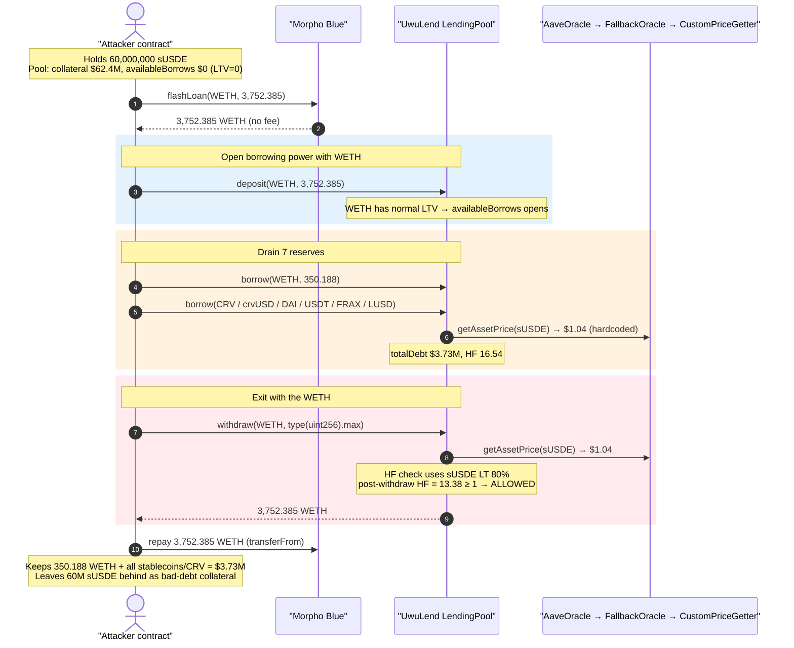
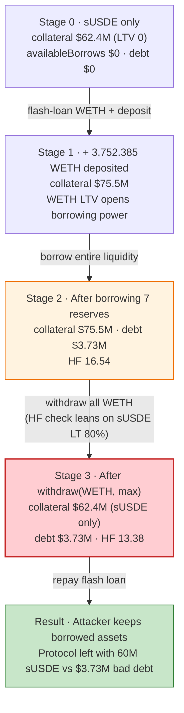
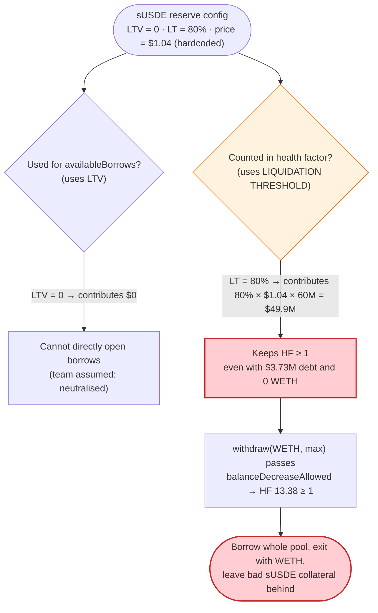

# UwuLend (2nd hack) — Hardcoded `$1.04` sUSDE Oracle + Live 80% Liquidation Threshold

> **Vulnerability classes:** vuln/oracle/wrong-feed · vuln/logic/wrong-condition

> **Reproduction:** the PoC compiles & runs in an isolated Foundry project at
> [this project folder](.) (the umbrella DeFiHackLabs repo contains many unrelated PoCs that do
> not whole-compile, so this one was extracted into its own project).
> Full verbose trace: [output.txt](output.txt).
> Verified vulnerable sources: [LendingPool](sources/LendingPool_05bfa9/contracts_protocol_lendingpool_LendingPool.sol),
> [FallbackOracle](sources/FallbackOracle_9Bc633/FallbackOracle.sol),
> [CustomPriceGetter](sources/CustomPriceGetter_f160ab/contracts_price-getters_CustomPriceGetter.sol).

---

## Key info

| | |
|---|---|
| **Loss** | ~$3.73M — drained across 7 reserves (350.19 WETH + crvUSD + DAI + USDT + FRAX + LUSD + CRV) |
| **Vulnerable contract** | UwuLend `LendingPool` proxy — [`0x2409aF0251DCB89EE3Dee572629291f9B087c668`](https://etherscan.io/address/0x2409aF0251DCB89EE3Dee572629291f9B087c668) (impl [`0x05bfa9157e92690b179033ca2f6dd1e86b25ea4d`](https://etherscan.io/address/0x05bfa9157e92690b179033ca2f6dd1e86b25ea4d#code)) |
| **Root-cause contract** | `CustomPriceGetter` (sUSDE price source) — [`0xf160abfb24fad81de393ce1b06145635cf264bb5`](https://etherscan.io/address/0xf160abfb24fad81de393ce1b06145635cf264bb5#code) returns a hardcoded `$1.04` |
| **Victim / pool** | UwuLend money-market reserves (uWETH, uCRV, ucrvUSD, uDAI, uUSDT, uFRAX, uLUSD) |
| **Collateral asset** | sUSDE `0x9D39A5DE30e57443BfF2A8307A4256c8797A3497` (LTV = 0, liquidation threshold = **80%**, **frozen**) |
| **Attacker EOA** | [`0x841ddf093f5188989fa1524e7b893de64b421f47`](https://etherscan.io/address/0x841ddf093f5188989fa1524e7b893de64b421f47) |
| **Attack contract** | [`0x0935c185494cc9abee8890d01e67ddcc00b66f8c`](https://etherscan.io/address/0x0935c185494cc9abee8890d01e67ddcc00b66f8c) |
| **Attack tx** | [`0x9235e0662e230bdfa94f56f4932fd09a95fea17e4b9b44a4f40a59449e216110`](https://app.blocksec.com/explorer/tx/eth/0x9235e0662e230bdfa94f56f4932fd09a95fea17e4b9b44a4f40a59449e216110) |
| **Chain / block / date** | Ethereum mainnet / 20,081,503 / June 13, 2024 |
| **Compiler** | LendingPool: Solidity 0.6.12 (Aave-v2 fork); CustomPriceGetter: Solidity 0.7.6 |
| **Bug class** | Oracle / collateral-parameter misconfiguration — incoherent risk parameters (LTV 0 but liquidation threshold 80%) on an asset priced by a hardcoded, owner-set value |

---

## TL;DR

This is the **second** UwuLend exploit, ~13 days after the [first one](https://app.blocksec.com/explorer/tx/eth/0xca1bbf3b320b8c1bf04603f8b51c30b3e75dae73e84c1bdac80b14cb9a8585a8)
($19.3M, sUSDE Curve-EMA oracle manipulation). After the first hack, UwuLend tried to "patch" sUSDE
pricing by:

1. **Freezing** the sUSDE reserve and setting its **LTV to 0** (so sUSDE cannot directly open new borrows
   — `availableBorrows` stays 0), and
2. Replacing the manipulable Curve EMA oracle with a `FallbackOracle` that routes sUSDE to a
   `CustomPriceGetter` returning a **hardcoded `104000000` ($1.04)**
   ([CustomPriceGetter.sol:18-20](sources/CustomPriceGetter_f160ab/contracts_price-getters_CustomPriceGetter.sol#L18-L20)).

But they **left the sUSDE liquidation threshold at 80%**. In Aave-v2 accounting, LTV gates *new
borrows* while the *liquidation threshold* gates *health factor* (and therefore withdrawals). By
leaving LT at 80%, sUSDE was still worth 80% of its $1.04-priced value **for keeping a position
healthy**, even though it could not be used to open a borrow.

The attacker exploits this split:

1. Receives **60,000,000 sUSDE** (pre-positioned), worth **$62.4M** at the hardcoded $1.04 — but with
   LTV = 0 this yields **$0 availableBorrows**.
2. Flash-loans **3,752.39 WETH** from Morpho Blue (fee-free) and deposits it as collateral. WETH has a
   normal LTV, so now `availableBorrows` opens up.
3. Borrows the **entire liquidity** of 7 reserves against the position (~$3.73M total).
4. **Withdraws all the WETH back** (`withdraw(WETH, type(uint256).max)`). The withdraw passes the
   health-factor check because the 60M sUSDE — still counted at **80% liquidation threshold × $1.04** —
   keeps the health factor at **13.38 > 1** even after every WETH is removed.
5. Repays the 3,752.39 WETH flash loan and walks off with the 350.19 borrowed WETH **plus** all the
   borrowed stablecoins/CRV. The 60M sUSDE collateral left behind is worth far less than $3.73M on the
   open market (sUSDE was de-facto un-redeemable through this market), so the protocol eats the loss.

Net result: the attacker converts effectively-worthless (frozen, LTV-0) sUSDE collateral into **$3.73M
of real, liquid assets**, using WETH only as a *transient* key that is recovered in the same
transaction.

---

## Background — what UwuLend is

UwuLend is an **Aave-v2 fork** money market on Ethereum. Users deposit assets to earn yield and receive
interest-bearing `uTokens` (aTokens), and borrow other assets against their collateral. Each reserve
has risk parameters packed into a configuration bitmask:

- **LTV** (loan-to-value) — caps how much can be **borrowed** against a unit of this collateral.
- **Liquidation threshold (LT)** — the collateral ratio below which a position becomes liquidatable;
  drives the **health factor** and gates **withdrawals**.
- **Active / frozen** flags, decimals, liquidation bonus, etc.

Collateral and debt are valued in USD by an `AaveOracle`
([source](sources/AaveOracle_AC4A2a/AaveOracle.sol)), which uses Chainlink for most assets and a
`FallbackOracle` for assets without a Chainlink feed. After the first hack, sUSDE was routed to the
fallback path.

On-chain risk parameters for sUSDE at the fork block (decoded from `getConfiguration`):

| Parameter | Value |
|---|---|
| LTV | **0%** ← cannot open new borrows |
| Liquidation threshold | **80%** ← still counts for health factor / withdrawals |
| Active | true |
| **Frozen** | **true** ← cannot deposit *new* sUSDE, but existing balances still count |
| Decimals | 18 |
| sUSDE price (via `CustomPriceGetter`) | **$1.04** (hardcoded `104000000`) |

That single inconsistency — **LTV 0 but LT 80%, on a hardcoded-price asset** — is the whole bug.

---

## The vulnerable code

### 1. sUSDE is priced by a hardcoded, owner-controlled constant

The `FallbackOracle` simply forwards to a per-asset `IPriceGetter`
([FallbackOracle.sol:150-153](sources/FallbackOracle_9Bc633/FallbackOracle.sol#L150-L153)):

```solidity
function getAssetPrice(address asset) external view returns (uint256) {
    require(address(assetToPriceGetter[asset]) != address(0), '!exists');
    return assetToPriceGetter[asset].getPrice();
}
```

For sUSDE, that getter is `CustomPriceGetter`
([CustomPriceGetter.sol:8-24](sources/CustomPriceGetter_f160ab/contracts_price-getters_CustomPriceGetter.sol#L8-L24)):

```solidity
contract CustomPriceGetter is IPriceGetter {
  uint256 private _price;        // set to 104000000 ($1.04, 8 decimals)
  address public owner;

  function getPrice() external view override returns (uint256 price) {
    return _price;               // ← fixed, no market input at all
  }
  function setPrice(uint256 newPrice) external onlyOwner { _price = newPrice; }
}
```

Verified live: `getPrice()` returns `104000000` ($1.04). So 60M sUSDE is valued at **$62.4M** by the
protocol, regardless of any real redemption/market value.

### 2. Collateral value uses **liquidation threshold**, not LTV, for the health factor

In `GenericLogic.calculateUserAccountData`, every reserve the user holds contributes
`price × balance / 10**decimals` to `totalCollateralInETH` whenever its **liquidation threshold ≠ 0**
([GenericLogic.sol:181-199](sources/LendingPool_05bfa9/contracts_protocol_libraries_logic_GenericLogic.sol#L181-L199)):

```solidity
(vars.ltv, vars.liquidationThreshold, , vars.decimals, ) = currentReserve.configuration.getParams();
vars.reserveUnitPrice = IPriceOracleGetter(oracle).getAssetPrice(vars.currentReserveAddress);

if (vars.liquidationThreshold != 0 && userConfig.isUsingAsCollateral(vars.i)) {   // ← LT, not LTV
    vars.compoundedLiquidityBalance = IERC20(currentReserve.aTokenAddress).balanceOf(user);
    uint256 liquidityBalanceETH =
        vars.reserveUnitPrice.mul(vars.compoundedLiquidityBalance).div(vars.tokenUnit);
    vars.totalCollateralInETH = vars.totalCollateralInETH.add(liquidityBalanceETH);
    ...
    vars.avgLiquidationThreshold =
        vars.avgLiquidationThreshold.add(liquidityBalanceETH.mul(vars.liquidationThreshold));
}
```

LTV is only consulted later, for `availableBorrows` and `validateBorrow`'s collateral-needed math
([GenericLogic.sol:196](sources/LendingPool_05bfa9/contracts_protocol_libraries_logic_GenericLogic.sol#L196),
[ValidationLogic.sol:176-178](sources/LendingPool_05bfa9/contracts_protocol_libraries_logic_ValidationLogic.sol#L176-L178)).
So with sUSDE LTV = 0, it adds **nothing** to borrowing power — but its 80% LT adds a huge amount to the
health factor.

### 3. Withdrawal only checks the health factor (LT-based)

`withdraw` ([LendingPool.sol:142-184](sources/LendingPool_05bfa9/contracts_protocol_lendingpool_LendingPool.sol#L142-L184))
calls `ValidationLogic.validateWithdraw`
([ValidationLogic.sol:60-89](sources/LendingPool_05bfa9/contracts_protocol_libraries_logic_ValidationLogic.sol#L60-L89)),
which delegates to `GenericLogic.balanceDecreaseAllowed`
([GenericLogic.sol:55-116](sources/LendingPool_05bfa9/contracts_protocol_libraries_logic_GenericLogic.sol#L55-L116)):

```solidity
vars.amountToDecreaseInETH =
    IPriceOracleGetter(oracle).getAssetPrice(asset).mul(amount).div(10**vars.decimals);
vars.collateralBalanceAfterDecrease = vars.totalCollateralInETH.sub(vars.amountToDecreaseInETH);
...
uint256 healthFactorAfterDecrease = calculateHealthFactorFromBalances(
    vars.collateralBalanceAfterDecrease, vars.totalDebtInETH, vars.liquidationThresholdAfterDecrease);
return healthFactorAfterDecrease >= GenericLogic.HEALTH_FACTOR_LIQUIDATION_THRESHOLD; // ≥ 1 ether
```

The check is "is the **post-withdraw health factor** ≥ 1?" — and after removing all WETH the remaining
60M sUSDE (at 80% LT × $1.04 = ~$49.9M effective) still dwarfs the $3.73M debt → HF = **13.38**, so the
withdraw is allowed.

---

## Root cause — why it was possible

The bug is an **incoherent risk-parameter configuration** introduced *as the fix for the first hack*:

> sUSDE was set to **LTV = 0** (intending "this asset can no longer be used as collateral") **but its
> liquidation threshold was left at 80%**. In Aave-v2, LTV and LT are independent: LTV gates new borrows,
> LT gates the health factor and withdrawals. Setting LTV = 0 while keeping LT > 0 means the asset *still
> counts as collateral for health* but *not for borrowing power* — exactly the gap the attacker walked
> through.

Compounding it, sUSDE's price was an **owner-set hardcoded `$1.04`** with no market/redemption check, so
60M units were trusted at $62.4M unconditionally.

The composition that turns this into a clean drain:

1. **LTV 0 ≠ "no collateral".** The protocol team assumed LTV = 0 neutralised sUSDE. It did not — LT 80%
   kept it fully effective for keeping a position solvent.
2. **WETH as a transient "borrowing key".** A normal-LTV asset (WETH) is needed only to *open*
   borrowing power. Once the debt is taken, WETH can be withdrawn because the health-factor check leans
   on sUSDE's LT, not WETH's. WETH is flash-loaned, so it costs nothing.
3. **Borrow the whole pool, then leave bad collateral behind.** The attacker maximises the borrow
   (entire liquidity of 7 reserves), then exits with the WETH, leaving the protocol holding 60M sUSDE it
   priced at $62.4M but that is worth far less in practice — a textbook bad-debt seizure.
4. **No liquidation recourse.** The position's reported HF stays at 13.38 (priced by the same hardcoded
   $1.04), so it never appears liquidatable to keepers — the bad debt is invisible to the protocol's own
   risk view.

---

## Preconditions

- The attacker holds **60M sUSDE** (pre-acquired; in the PoC, transferred from the real attacker EOA via
  `vm.prank`). sUSDE was already deposited/owned such that it counts as the attacker's collateral.
- sUSDE configured with **LTV 0, liquidation threshold 80%, frozen, priced $1.04** (the post-first-hack
  state).
- A fee-free WETH flash-loan source large enough to cover the seven reserves' aggregate borrowing-power
  requirement — here **Morpho Blue**, which held **3,752.39 WETH** and charges no flash fee.
- The seven target reserves (WETH, CRV, crvUSD, DAI, USDT, FRAX, LUSD) have non-trivial available
  liquidity to borrow.

---

## Attack walkthrough (with on-chain numbers from the trace)

All amounts are taken directly from [output.txt](output.txt). USD figures use the protocol's own
8-decimal oracle units (sUSDE = $1.04, WETH = $3,496.14 at the block). `getUserAccountData` returns
USD values (8 decimals).

| # | Step | Detail / trace ref |
|---|------|--------------------|
| 0 | Attacker receives **60,000,000 sUSDE** | [output.txt L131-145](output.txt) — `totalCollateral = $62,400,000`, `availableBorrows = $0` (LTV 0), HF = ∞ (no debt) |
| 1 | `morphoBlue.flashLoan(WETH, 3,752.385 WETH)` (fee-free) | [output.txt L160-162](output.txt) — entire WETH balance of Morpho Blue |
| 2 | `deposit(WETH, 3,752.385)` as collateral | [LendingPool.sol:104](sources/LendingPool_05bfa9/contracts_protocol_lendingpool_LendingPool.sol#L104), trace [L180](output.txt) |
| 3 | `borrow(WETH, balanceOf(uWETH) − 3,752.385 = 350.188 WETH)` | [output.txt L264](output.txt) — drains uWETH to ~0 |
| 4 | `borrow(CRV, 73.65)` | [output.txt L369](output.txt) |
| 5 | `borrow(crvUSD, 210,873.48)` | [output.txt L506](output.txt) |
| 6 | `borrow(DAI, 1,282,635.02)` | [output.txt L685](output.txt) |
| 7 | `borrow(USDT, 943,394.06)` | [output.txt L882](output.txt) |
| 8 | `borrow(FRAX, 50,632.56)` | [output.txt L1097](output.txt) |
| 9 | `borrow(LUSD, 19,985.28)` | [output.txt L1330](output.txt) |
| 10 | **Before withdraw**: `totalCollateral = $75,518,865.64`, `totalDebt = $3,730,710.39`, HF = **16.54** | [output.txt L15-21](output.txt) |
| 11 | `withdraw(WETH, type(uint256).max)` → 3,752.385 WETH returned | [LendingPool.sol:142](sources/LendingPool_05bfa9/contracts_protocol_lendingpool_LendingPool.sol#L142), trace [L1765](output.txt) — **passes** the HF check |
| 12 | **After withdraw**: `totalCollateral = $62,400,000` (only sUSDE), `totalDebt = $3,730,710.39`, HF = **13.38** | [output.txt L23-29](output.txt) |
| 13 | Repay Morpho flash loan: `transferFrom(attacker → morpho, 3,752.385 WETH)` | [output.txt L2222-2223](output.txt) — exact principal, no fee |

After step 13 the attacker keeps the 350.188 WETH borrowed in step 3 plus all stablecoins/CRV, while the
60M sUSDE remains locked as (worthless-in-practice) collateral behind a $3.73M debt that will never be
profitably liquidated.

### The key health-factor arithmetic

- Collateral after WETH withdraw (sUSDE only): `60,000,000 × $1.04 = $62,400,000`
  (shown as `totalCollateral = 62,400,000.00000000`, 8 dec).
- Effective collateral for HF: `$62,400,000 × 80% (LT) = $49,920,000`.
- Debt: `$3,730,710.39`.
- Health factor: `$49,920,000 / $3,730,710 ≈ 13.38` → **≥ 1**, so the withdrawal is allowed.

Had the liquidation threshold been set to 0 alongside LTV = 0, the sUSDE would have contributed **nothing**
to collateral, the post-withdraw HF would have been 0, and the withdraw (and indeed the whole attack)
would have reverted with `VL_TRANSFER_NOT_ALLOWED`.

### Profit / loss accounting

| Asset | Amount stolen | ≈ USD |
|---|---:|---:|
| WETH | 350.188 | ~$1,224,306 |
| DAI | 1,282,635.02 | ~$1,282,635 |
| USDT | 943,394.06 | ~$943,394 |
| crvUSD | 210,873.48 | ~$210,873 |
| FRAX | 50,632.56 | ~$50,633 |
| LUSD | 19,985.28 | ~$19,985 |
| CRV | 73.65 | ~$22 |
| **Total** | | **~$3,731,848** |
| Protocol's own debt accounting | | **$3,730,710.39** |

The stolen total (~$3.73M) matches the protocol's reported `totalDebt`, confirming the attacker carried
off essentially the entire borrowable liquidity of those reserves. The flash loan (3,752.385 WETH) is
repaid in full and fee-free, so the WETH that funds the exploit nets to zero.

---

## Diagrams

### Sequence of the attack



### Collateral / debt state evolution



### Why LTV 0 + LT 80% is the flaw



---

## Remediation

1. **Set the liquidation threshold to 0 whenever LTV is set to 0.** The two parameters must move
   together when retiring an asset as collateral. With LT = 0, `GenericLogic.calculateUserAccountData`
   skips the asset entirely (`if (vars.liquidationThreshold != 0 …)`), and
   `balanceDecreaseAllowed` early-returns at
   [GenericLogic.sol:75-77](sources/LendingPool_05bfa9/contracts_protocol_libraries_logic_GenericLogic.sol#L75-L77),
   so sUSDE would no longer prop up the health factor. This single change breaks the attack.
2. **Add a configurator invariant: `liquidationThreshold == 0` ⟺ `ltv == 0`** (or at least
   `ltv <= liquidationThreshold` with both zero when disabling). A "disable collateral" admin action
   should atomically zero both, mark `usageAsCollateral=false` for existing holders, and ideally force
   re-evaluation of affected positions.
3. **Do not price collateral with a hardcoded, owner-set constant.** `CustomPriceGetter` returns a fixed
   `$1.04` with no market input, redemption rate, or staleness check. Use a real Chainlink/redemption-rate
   feed, and if a manual price must exist, bound it conservatively (well below redeemable value) and
   gate borrowing/withdrawals on it.
4. **Recognise that "frozen + LTV 0" is not the same as "removed".** Freezing only blocks *new* deposits
   and borrows of that asset; existing balances keep their full risk-parameter effect. To truly remove an
   asset's collateral power, zero the liquidation threshold and disable it as collateral for all users.
5. **Surface bad debt to liquidation.** Because the position is priced by the same hardcoded oracle, its
   reported HF (13.38) hides $3.73M of bad debt from keepers. Pricing collateral realistically would have
   made the position liquidatable and limited the loss.

---

## How to reproduce

The PoC was extracted into a standalone Foundry project (the umbrella DeFiHackLabs repo does not
whole-compile under `forge test`):

```bash
_shared/run_poc.sh 2024-06-UwuLend_Second_exp -vvvvv
```

- RPC: an **Ethereum mainnet archive** endpoint is required (fork block 20,081,503).
  `foundry.toml` uses an Infura archive endpoint; if it returns 401/429, swap the `/v3/<key>` for a
  different key.
- Result: `[PASS] testExploit()`. The trace prints the position before/after the withdraw and the final
  stolen balances.

Expected tail:

```
  after withdraw
  totalCollateral: 62400000.00000000
  totalDebt: 3730710.39177567
  healthFactor: 13.380829589465952173

  attacker DAI token balance: 1282635.020354129762638336
  attacker USDT token balance: 943394.056794
  ...
Ran 1 test suite ... 1 tests passed, 0 failed, 0 skipped
```

---

*Reference: this is UwuLend's second incident (June 13, 2024, ~$3.7M), following the larger June 10
sUSDE-oracle hack. The "fix" between the two — freezing sUSDE / zeroing its LTV while leaving an 80%
liquidation threshold and a hardcoded $1.04 price — is itself the vulnerability exploited here.*
