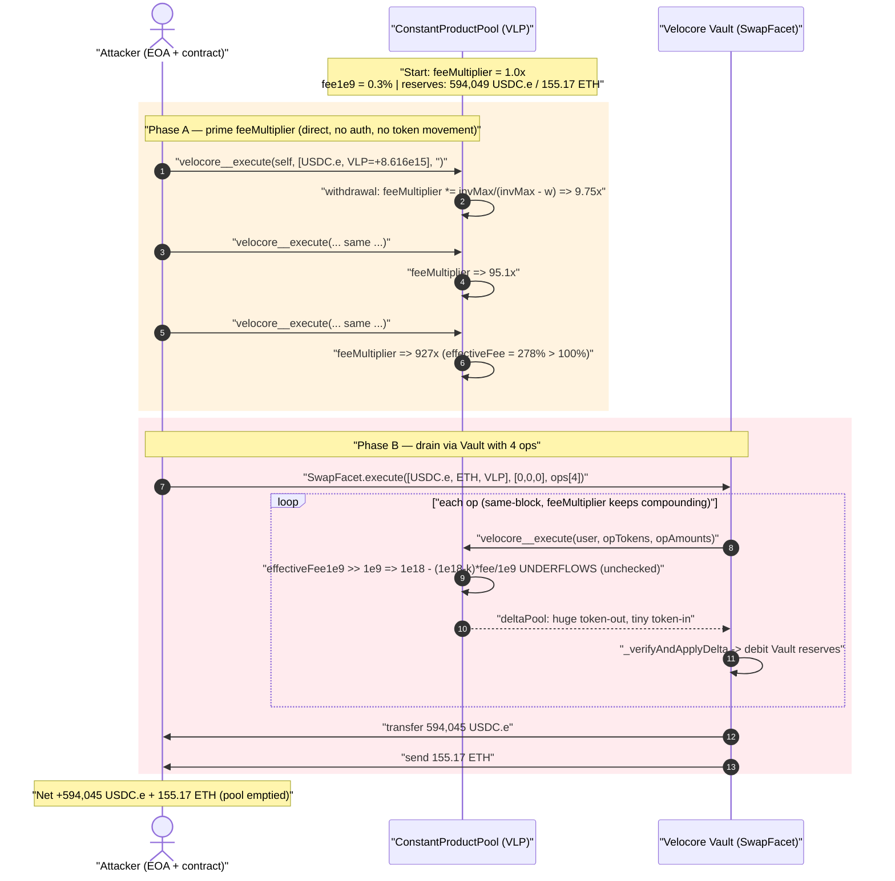
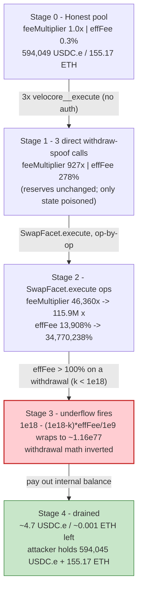
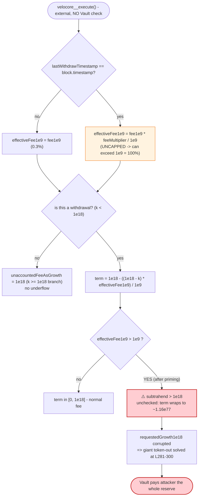

# Velocore V2 Exploit — `feeMultiplier` Overflow Turns a Withdrawal Into a Pool Drain

> **Vulnerability classes:** vuln/arithmetic/underflow · vuln/access-control/missing-auth

> **Reproduction:** the PoC compiles & runs in an isolated Foundry project at
> [this project folder](.) (the umbrella DeFiHackLabs repo does not whole-compile, so this
> PoC was extracted into a standalone project).
> Full verbose trace: [output.txt](output.txt).
> Vulnerable source (open-source Velocore V2): [ConstantProductPool.sol](sources/ConstantProductPool_velocore/ConstantProductPool.sol)
> and [ConstantProductLibrary.sol](sources/ConstantProductPool_velocore/ConstantProductLibrary.sol).
> Verified Vault facet: [src_SwapFacet.sol](sources/SwapFacet_2E98EF/src_SwapFacet.sol).
> Source provenance note: [SOURCE_NOTE.md](sources/ConstantProductPool_velocore/SOURCE_NOTE.md).

---

## Key info

| | |
|---|---|
| **Loss** | **$6.88M** total across all Velocore pools. This PoC reproduces the drain of the **USDC.e/ETH** pool: **594,045 USDC.e + 155.17 ETH** (≈ $1.14M from this single pool). |
| **Vulnerable contract** | `ConstantProductPool` (Velocore CPMM/weighted pool) — [`0xe2c67A9B15e9E7FF8A9Cb0dFb8feE5609923E5DB`](https://lineascan.build/address/0xe2c67A9B15e9E7FF8A9Cb0dFb8feE5609923E5DB) (USDC.e/ETH VLP, unverified on-chain) and the fallback math in `ConstantProductLibrary`. |
| **Victim** | All Velocore V2 CPMM pools on Linea; this PoC targets the USDC.e/ETH VLP and the Velocore Vault `0x1d0188c4B276A09366D05d6Be06aF61a73bC7535`. |
| **Vault SwapFacet impl** | [`0x2E98EF87F7F0d31987A0d94051b8Bc5D001152E8`](https://lineascan.build/address/0x2E98EF87F7F0d31987A0d94051b8Bc5D001152E8#code) (delegatecalled by the Vault). |
| **Attacker EOA** | [`0x8cdc37ed79c5ef116b9dc2a53cb86acaca3716bf`](https://lineascan.build/address/0x8cdc37ed79c5ef116b9dc2a53cb86acaca3716bf) |
| **Attacker contract** | [`0xb7f6354b2cfd3018b3261fbc63248a56a24ae91a`](https://lineascan.build/address/0xb7f6354b2cfd3018b3261fbc63248a56a24ae91a) |
| **Attack tx** | [`0xed11d5b013bf3296b1507da38b7bcb97845dd037d33d3d1b0c5e763889cdbed1`](https://lineascan.build/tx/0xed11d5b013bf3296b1507da38b7bcb97845dd037d33d3d1b0c5e763889cdbed1) |
| **Chain / block / date** | Linea / 5,079,177 (fork at 5,079,176) / June 2, 2024 |
| **Compiler** | Solidity ^0.8.19 |
| **Bug class** | Unchecked arithmetic underflow in fee math (fee allowed to exceed 100%) → withdrawal converted into a giant token-out; compounded by missing caller (Vault) access control on `velocore__execute`. |

---

## TL;DR

Velocore's weighted/constant-product pool charges an **escalating withdrawal fee** to discourage
sandwiching a single large exit across several smaller exits in the same block. Each withdrawal
multiplies a persistent `feeMultiplier` by `invariantMax / (invariantMax − withdrawn)`
([ConstantProductPool.sol:308](sources/ConstantProductPool_velocore/ConstantProductPool.sol#L308)).
The "effective fee" for the rest of that block is then
`effectiveFee1e9 = fee1e9 * feeMultiplier / 1e9`
([:171-176](sources/ConstantProductPool_velocore/ConstantProductPool.sol#L171-L176)).

**There is no cap on `feeMultiplier` and no cap on `effectiveFee1e9`.** With enough withdrawals
in one block, `effectiveFee1e9` blows past `1e9` (100%). The pool then computes an "unaccounted
fee as growth" term inside an `unchecked` block:

```solidity
uint256 unaccountedFeeAsGrowth1e18 = k >= 1e18
    ? 1e18
    : rpow(1e18 - ((1e18 - k) * effectiveFee1e9) / 1e9, ...);   // ⚠️ underflows when fee > 100%
```
([:261-266](sources/ConstantProductPool_velocore/ConstantProductPool.sol#L261-L266))

For a **withdrawal** `k < 1e18`, once `effectiveFee1e9 > 1e9`, the product
`((1e18 − k) * effectiveFee1e9) / 1e9` exceeds `1e18`, so `1e18 − (…)` goes **negative and wraps
to ~1.16e77** inside `unchecked`. That poisoned value flows into `requestedGrowth1e18`, and the
final solve at
[:281-300](sources/ConstantProductPool_velocore/ConstantProductPool.sol#L281-L300) computes an
enormous token-out for the attacker — the withdrawal math has been inverted.

Two factors make it trivially reachable:

1. **`velocore__execute` has no access control** — it never checks `msg.sender == vault`
   (compare base `Pool.sol`; the function is plain `external`). So the attacker calls it
   **directly** three times to pump `feeMultiplier` (these direct calls only mutate the local
   `feeMultiplier`/`lastWithdrawTimestamp`; no real tokens move).
2. **It is same-block stateful** — `effectiveFee1e9` only uses the inflated multiplier while
   `lastWithdrawTimestamp == block.timestamp`, so the whole attack is one transaction.

After priming, the attacker calls the Vault's `SwapFacet.execute` once with 4 operations on the
poisoned pool. The corrupted fee math lets a tiny LP/token "withdrawal" pull **the entire
USDC.e and ETH reserve** out of the Vault for that pool.

---

## Background — how a Velocore swap/withdraw works

Velocore V2 uses a **singleton Vault** (`0x1d01…7535`) that holds every pool's token balances in
its own storage. Pools are "satellites": they never custody tokens, they just compute deltas.

- A user calls `SwapFacet.execute(tokenRef, deposit, ops)`
  ([src_SwapFacet.sol:68-139](sources/SwapFacet_2E98EF/src_SwapFacet.sol#L68-L139)).
- For each op of type 0 ("swap"), the facet calls
  `ISwap(pool).velocore__execute(user, opTokens, opAmounts, data)`
  ([:217-218](sources/SwapFacet_2E98EF/src_SwapFacet.sol#L217-L218)), receives `(deltaGauge, deltaPool)`,
  and applies them to the Vault via
  `_verifyAndApplyDelta` ([:524-542](sources/SwapFacet_2E98EF/src_SwapFacet.sol#L524-L542)).
- The amount-type encoding in `tokenInformations` lets an op say "equals X", "at most", or
  **"consume all" / "everything"** ([:182-208](sources/SwapFacet_2E98EF/src_SwapFacet.sol#L182-L208)).
  The attacker uses the `0x7fff…ffff` sentinel (`type(int128).max`, the "unknown / solve-for-me"
  marker) for the amounts it wants the pool to compute.
- After `execute`, positive internal balances are transferred out to the caller
  ([:118-129](sources/SwapFacet_2E98EF/src_SwapFacet.sol#L118-L129)) — this is how the drained
  USDC.e and ETH reach the attacker.

The pool itself is a weighted-CPMM (Balancer-style) implementation with an integer-math fast path
in `ConstantProductPool` and a logarithmic fallback in `ConstantProductLibrary`. The LP token (VLP)
is the pool contract itself (an ERC-20). Burning/minting LP is done via `_simulateBurn`/`_simulateMint`.

On-chain parameters at the fork block (decoded from storage slot 6 of the pool — see the trace):

| Parameter | Value |
|---|---|
| `fee1e9` | `3_000_000` (= **0.3%**; `1e9` ≡ 100%) |
| `feeMultiplier` (start) | `1_000_128_097` (≈ 1.0×) |
| pool USDC.e reserve | **594,049.95 USDC.e** |
| pool ETH reserve | **155.17 ETH** |
| `lastWithdrawTimestamp` (start) | a previous block |

---

## The vulnerable code

### 1. Unbounded fee escalation, applied same-block

```solidity
uint256 effectiveFee1e9 = fee1e9;
if (lastWithdrawTimestamp == block.timestamp) {
    unchecked {
        effectiveFee1e9 = effectiveFee1e9 * feeMultiplier / 1e9;   // no upper bound
    }
}
```
([ConstantProductPool.sol:171-176](sources/ConstantProductPool_velocore/ConstantProductPool.sol#L171-L176))

### 2. `feeMultiplier` grows multiplicatively on every withdrawal — never capped

```solidity
if (iLp != type(uint256).max && r.u(iLp) > 0) {           // a withdrawal (LP burned)
    _simulateBurn(uint256(int256(r.u(iLp))));
    if (lastWithdrawTimestamp != block.timestamp) {
        feeMultiplier = 1e9;
        lastWithdrawTimestamp = uint32(block.timestamp);
    }
    feeMultiplier = (feeMultiplier * invariantMax
                     / (invariantMax - uint256(int256(r.u(iLp))))).toUint128();   // ⚠️ compounding, uncapped
}
```
([:302-308](sources/ConstantProductPool_velocore/ConstantProductPool.sol#L302-L308))

### 3. The underflow — a withdrawal becomes a deposit

```solidity
unchecked {
    uint256 unaccountedFeeAsGrowth1e18 = k >= 1e18
        ? 1e18
        : rpow(1e18 - ((1e18 - k) * effectiveFee1e9) / 1e9,            // ⚠️ underflows if eff > 100%
               _sumWeight - sumUnknownWeight - sumKnownWeight, 1e18);
    requestedGrowth1e18 = (requestedGrowth1e18 * unaccountedFeeAsGrowth1e18) / 1e18;
}
```
([:261-266](sources/ConstantProductPool_velocore/ConstantProductPool.sol#L261-L266))

The same flawed pattern is repeated in the logarithmic fallback in
[ConstantProductLibrary.sol:35-37](sources/ConstantProductPool_velocore/ConstantProductLibrary.sol#L35-L37)
and its `notifyWithdraw` callback path
([:128-134](sources/ConstantProductPool_velocore/ConstantProductLibrary.sol#L128-L134)).

### 4. No caller check on `velocore__execute`

```solidity
function velocore__execute(address, Token[] calldata tokens, int128[] memory r, bytes calldata data)
    external                       // ⚠️ no onlyVault / authenticate modifier
    returns (int128[] memory, int128[] memory)
{ ... }
```
([:164-167](sources/ConstantProductPool_velocore/ConstantProductPool.sol#L164-L167))

Anyone can call it directly. The direct calls don't move Vault tokens (the Vault only applies
deltas when *it* calls the pool from `SwapFacet`), but they freely mutate `feeMultiplier` and
`lastWithdrawTimestamp` — the exact state the underflow depends on.

---

## Root cause — why it was possible

The whole bug is "**a fee that is allowed to exceed 100% in arithmetic that assumes it never
does**", made cheaply reachable by a missing access-control check.

1. **Unbounded `feeMultiplier`.** The anti-sandwich fee is supposed to make *withdrawing in
   chunks* cost the same as withdrawing all at once. But it compounds with no ceiling
   ([:308](sources/ConstantProductPool_velocore/ConstantProductPool.sol#L308)), so a handful of
   self-directed "withdrawals" in one block drives it to billions×.
2. **`effectiveFee1e9` is never clamped to `≤ 1e9`.** `effectiveFee1e9 = fee1e9 * feeMultiplier / 1e9`
   ([:174](sources/ConstantProductPool_velocore/ConstantProductPool.sol#L174)) can exceed 100%.
3. **The fee is consumed inside `unchecked`.** `1e18 - ((1e18 - k) * effectiveFee1e9) / 1e9`
   ([:264](sources/ConstantProductPool_velocore/ConstantProductPool.sol#L264)) silently wraps when
   the subtrahend exceeds `1e18`. A withdrawal (`k < 1e18`) with `effectiveFee1e9 > 1e9` always
   triggers it. Instead of "fee eats most of the exit", the result becomes a near-`2^256` growth
   factor — the sign of the operation flips.
4. **No `msg.sender == vault` check** ([:164](sources/ConstantProductPool_velocore/ConstantProductPool.sol#L164))
   lets the attacker pump `feeMultiplier` for free before the real swap. (Velocore's own
   post-mortem notes the attack would have been possible without this flaw too, but it made it far
   easier.)

---

## Preconditions

- A Velocore CPMM pool with nonzero `fee1e9` and real reserves (USDC.e/ETH VLP here).
- Ability to call `velocore__execute` directly (permissionless) and `SwapFacet.execute`
  (permissionless) — both true.
- Everything in **one block** so `lastWithdrawTimestamp == block.timestamp` keeps the inflated
  `feeMultiplier` live. The real attacker used a flash loan for the LP tokens / working capital;
  the PoC simply replays the same calldata on a fork, so no flash loan is needed in the test.

---

## Attack walkthrough (with on-chain numbers from the trace)

All figures are decoded directly from [output.txt](output.txt) — storage slot 6 of the pool packs
`feeMultiplier | lastWithdrawTimestamp | fee1e9 | decayRate`, and `fee1e9 = 3_000_000` (0.3%).

### Phase A — prime `feeMultiplier` with 3 direct `velocore__execute` calls

The attacker calls `velocore__execute(self, [USDC.e, VLP], [type(int128).max-ish, 8616292632827688], "")`
**three times** ([Velocore_exp.sol:82-86](test/Velocore_exp.sol#L82-L86)). `amounts[1] = 8.616e15`
is a positive LP amount → treated as a **withdrawal** → `feeMultiplier` compounds each time. No
tokens leave the Vault (these are direct calls; the LP `Transfer(…, address(0), 8.616e15)` events
are the local `_simulateBurn`).

| Call | `feeMultiplier` after | `effectiveFee1e9 = 0.3% × mult` |
|---|---:|---:|
| (start) | 1_000_128_097 (1.0×) | 0.3% |
| #1 | 9_751_217_521 (9.75×) | 2.9% |
| #2 | 95_086_243_144 (95.1×) | 28.5% |
| #3 | 927_206_640_178 (927×) | **278%** ← already > 100% |

### Phase B — drain via `SwapFacet.execute` with 4 ops

The attacker then calls `SwapFacet.execute([USDC.e, ETH, VLP], [0,0,0], ops)`
([Velocore_exp.sol:108-146](test/Velocore_exp.sol#L108-L146)). Each op is another tiny withdrawal
on the same poisoned pool; `feeMultiplier` keeps compounding **inside** the call, so each op's
withdrawal math underflows harder than the last and pulls more out:

| Op | `feeMultiplier` after op | `effectiveFee1e9` | Token-out applied to Vault (from `Swap` events) |
|---|---:|---:|---|
| op0 | 46_360_332_002_032 (46,360×) | 13,908% | −582,168,950,177 USDC.e-units; +9.41e15 VLP; −152.06 ETH |
| op1 | 2_318_016_587_420_379 (2.3M×) | 695,405% | −11,643,379,004 USDC.e; +1.88e14 VLP; −3.04 ETH |
| op2 | 115_900_795_717_219_113 (115.9M×) | 34,770,238% | −232,867,580 USDC.e; +3.76e12 VLP; −0.06 ETH |
| op3 | — | — | net-out the LP and finalize |

(Negative numbers are tokens leaving the Vault toward the attacker's internal balance.) After the
ops, `SwapFacet.execute` pays out the accumulated internal balance:

- `USDC.e.transfer(attacker, 594,045,206,761)` → **594,045.21 USDC.e**
  ([output.txt:92-99](output.txt))
- native `receive{value: 155,165,503,281,178,836,250}()` → **155.1655 ETH**
  ([output.txt:106](output.txt))
- a junk `VLP.transfer(attacker, 2.61e31)` — worthless LP of the now-broken pool.

### Profit / loss accounting

| Asset | Pool reserve before | Attacker received | Pool reserve after |
|---|---:|---:|---:|
| USDC.e | 594,049.95 | **594,045.21** | ~4.7 (dust) |
| ETH | 155.17 | **155.1655** | ~0.001 (dust) |
| Capital spent | 0 (PoC) / flash-loaned (live) | — | — |

**Net for this pool:** the attacker walked off with essentially the entire USDC.e + ETH reserve
(≈ $1.14M at the time). Repeating across all Velocore pools produced the **$6.88M** total loss.
The PoC's final log line: `USDC_e profit after attack: $ 594045`.

---

## Diagrams

### Sequence of the attack



### Pool / fee-state evolution



### The flaw inside the fee math



---

## Remediation

1. **Clamp the effective fee to ≤ 100%.** Immediately after computing
   `effectiveFee1e9 = fee1e9 * feeMultiplier / 1e9`, do
   `if (effectiveFee1e9 > 1e9) effectiveFee1e9 = 1e9;`. This alone removes the underflow
   ([ConstantProductPool.sol:174](sources/ConstantProductPool_velocore/ConstantProductPool.sol#L174),
   [ConstantProductLibrary.sol:36](sources/ConstantProductPool_velocore/ConstantProductLibrary.sol#L36)).
2. **Bound `feeMultiplier`.** Cap the compounding factor
   ([:308](sources/ConstantProductPool_velocore/ConstantProductPool.sol#L308)) so a block of
   withdrawals can never push the fee above a sane maximum.
3. **Remove the `unchecked` around the fee subtraction.** `1e18 - ((1e18 - k) * effectiveFee1e9) / 1e9`
   ([:264](sources/ConstantProductPool_velocore/ConstantProductPool.sol#L264)) must revert on
   underflow, not wrap. The gas saved by `unchecked` is not worth a sign flip on a value-bearing
   computation. (This is the fix Velocore shipped.)
4. **Add caller access control to `velocore__execute`.** Require `msg.sender == address(vault)`
   ([:164](sources/ConstantProductPool_velocore/ConstantProductPool.sol#L164)) so external callers
   cannot mutate `feeMultiplier`/`lastWithdrawTimestamp` outside a real Vault-mediated swap.
5. **Invariant-test the fee growth function.** Property tests should assert that for any
   `feeMultiplier` and any `k`, `unaccountedFeeAsGrowth1e18 ≤ 1e18` for a withdrawal and that no
   sequence of same-block withdrawals can ever produce a net positive token-out for the caller.

---

## How to reproduce

The PoC was extracted into a standalone Foundry project (the umbrella DeFiHackLabs repo does not
whole-compile under `forge test`):

```bash
_shared/run_poc.sh 2024-06-Velocore_exp -vvvvv
```

- RPC: a **Linea archive** endpoint is required (fork block 5,079,176). `foundry.toml` uses an
  Infura Linea archive endpoint; if it returns 401/429, rotate the `/v3/<key>` to another key.
- Result: `[PASS] testExploit()` with `USDC_e profit after attack: $ 594045` (plus 155.17 ETH
  received via `receive()`).

Expected tail:

```
Ran 1 test for test/Velocore_exp.sol:ContractTest
[PASS] testExploit() (gas: 382806)
Logs:
  ---------------------------------------------------
  USDC_e profit after attack: $ 594045
  ---------------------------------------------------

Suite result: ok. 1 passed; 0 failed; 0 skipped
```

---

*References:*
- *Velocore Incident Post-Mortem — https://velocorexyz.medium.com/velocore-incident-post-mortem-6197020ec3e9*
- *Beosin analysis — https://x.com/BeosinAlert/status/1797247874528645333*
- *Rekt — https://rekt.news/velocore-rekt*
