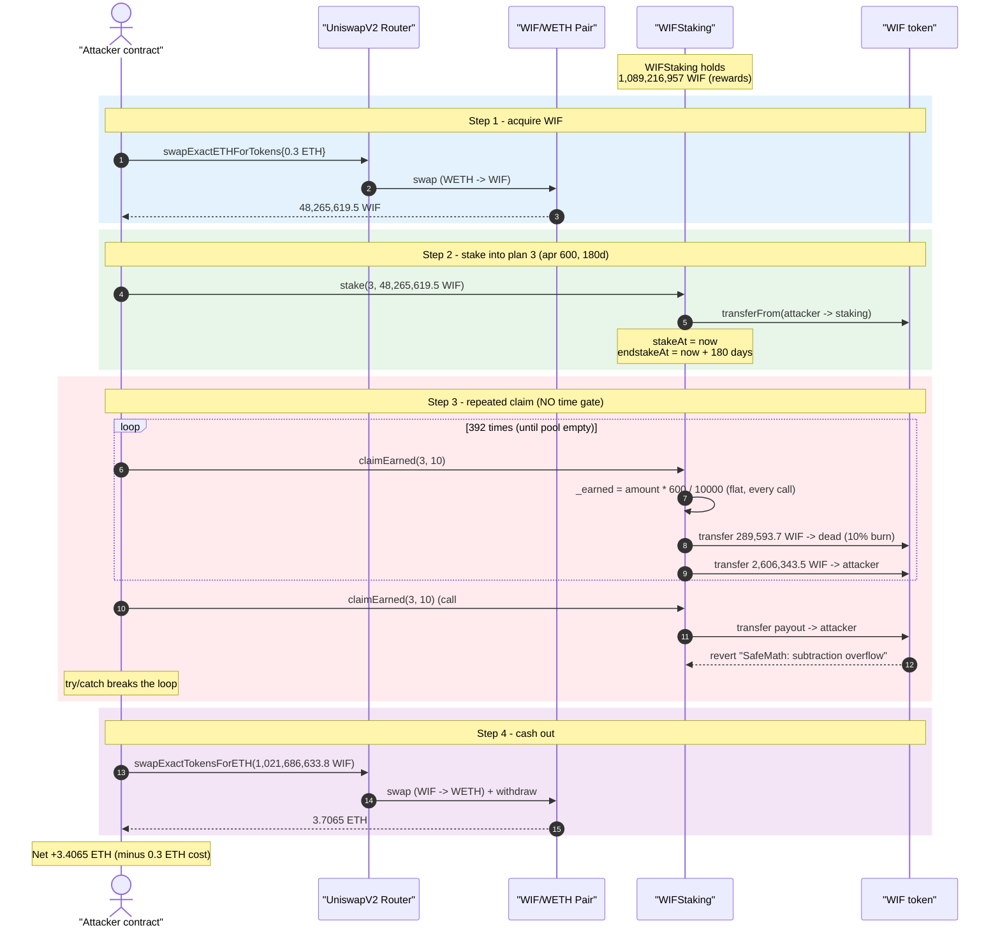
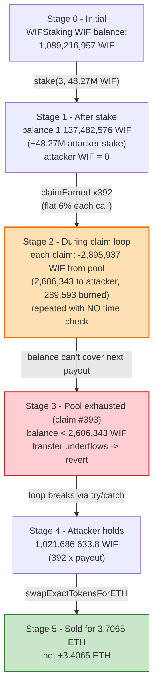
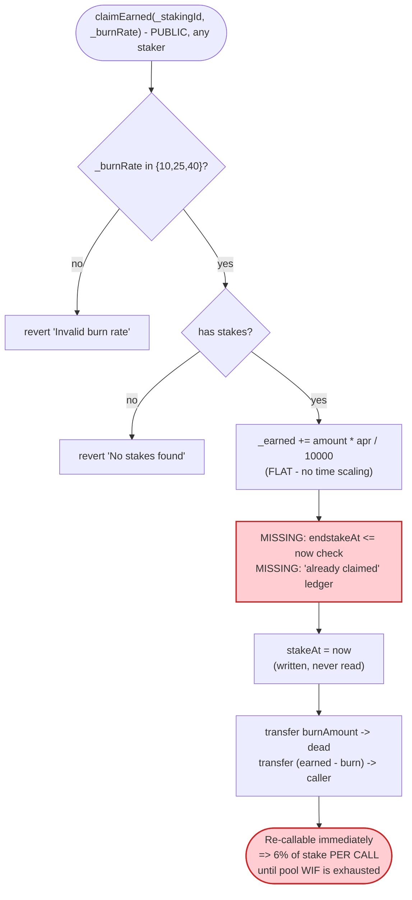
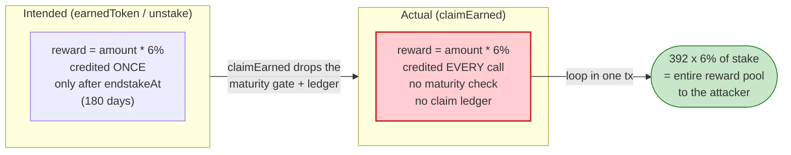

# WIFCOIN (WIFStaking) Exploit — Time-Ungated `claimEarned()` Reward Loop Drains the Staking Pool

> **Vulnerability classes:** vuln/logic/reward-calculation · vuln/logic/missing-check

> **Reproduction:** the PoC compiles & runs in an isolated Foundry project at
> [this project folder](.) (the umbrella DeFiHackLabs repo
> contains many unrelated PoCs that do not whole-compile, so this one was extracted).
> Full verbose trace: [output.txt](output.txt).
> Verified vulnerable source: [contracts_WIFStaking.sol](sources/WIFStaking_A1cE40/contracts_WIFStaking.sol).

---

## Key info

| | |
|---|---|
| **Loss** | **~3.41 ETH** profit to the attacker; the entire WIF balance of the staking contract (~1.137 billion WIF, ~1.09e18 base units pre-stake) was drained |
| **Vulnerable contract** | `WIFStaking` — [`0xA1cE40702E15d0417a6c74D0bAB96772F36F4E99`](https://etherscan.io/address/0xA1cE40702E15d0417a6c74D0bAB96772F36F4E99#code) |
| **Reward / staking token** | `WIF` (9 decimals) — [`0xBFae33128ecF041856378b57adf0449181FFFDE7`](https://etherscan.io/address/0xBFae33128ecF041856378b57adf0449181FFFDE7#code) |
| **Victim pool (cash-out)** | WIF/WETH UniswapV2 pair — `0x64571ea88C809abeeA5DdbEb7427eF37F87946D0` |
| **Attacker EOA** | [`0x394ba273315240510b61ca22ba152e3478a45892`](https://etherscan.io/address/0x394ba273315240510b61ca22ba152e3478a45892) |
| **Attacker contract** | [`0x93d4f6f84d242c7959f8d1f1917ddbc9fb925ada`](https://etherscan.io/address/0x93d4f6f84d242c7959f8d1f1917ddbc9fb925ada) |
| **Attack tx** | [`0xda8f6a4bed7e5689a343d111632d37480c0316f1d20b732803c4bd482823e284`](https://etherscan.io/tx/0xda8f6a4bed7e5689a343d111632d37480c0316f1d20b732803c4bd482823e284) (TX1), [`0x58424115c6576b19cfb78b0b7ff00e0c13daa06d259f2a67210c112731519e09`](https://etherscan.io/tx/0x58424115c6576b19cfb78b0b7ff00e0c13daa06d259f2a67210c112731519e09) (TX2) |
| **Chain / block / date** | Ethereum mainnet / 20,103,189 / **2024-06-16** (~08:34 UTC) |
| **Compiler** | Solidity v0.8.16, optimizer **1000 runs** |
| **Bug class** | Missing time/lock gating on reward accrual + repeated claim → reward-pool drain |

---

## TL;DR

`WIFStaking.claimEarned()` pays out staking rewards computed as a **fixed fraction of the staked
principal** (`amount × apr / 10000`) but **never checks elapsed time and never enforces the lock
period**. Every other function that pays rewards (`earnedToken`, `unstake`) gates the reward behind
`endstakeAt <= block.timestamp`; `claimEarned` does not
([contracts_WIFStaking.sol:999-1031](sources/WIFStaking_A1cE40/contracts_WIFStaking.sol#L999-L1031)).
It merely resets `stakeAt = block.timestamp` after paying — a value the function never reads.

Because the payout per call is constant and independent of time, the attacker can call `claimEarned`
in a **tight loop in a single transaction**, harvesting `apr%` of the stake on *every iteration*
until the contract runs out of WIF. With plan 3 (`apr = 600`, i.e. 6%) the attacker earned 6% of
its stake **per call** instead of 6% over the 180-day lock.

The full attack:

1. **Buy** 48.27M WIF with 0.3 ETH on Uniswap V2.
2. **Stake** all of it into plan 3 (`stake(3, 48.27M WIF)`), the highest-APR pool.
3. **Loop `claimEarned(3, 10)`** until it reverts — each successful call mints the attacker
   2,606,343.5 WIF (after a 10% burn). **392 successful claims → 1,021,686,633.8 WIF.**
4. The 393rd call reverts (`SafeMath: subtraction overflow` — the contract's WIF balance can no
   longer cover the transfer); the `try/catch` breaks the loop.
5. **Sell** all 1.021B WIF back into the WIF/WETH pair → 3.706 ETH.

Net profit = **3.706 − 0.3 = 3.4065 ETH**. The staked 48.27M WIF is abandoned in the contract, but
that is irrelevant — the attacker walked off with ~21× the entire pre-existing reward pool.

---

## Background — what WIFStaking does

`WIFStaking` ([source](sources/WIFStaking_A1cE40/contracts_WIFStaking.sol)) is a single-token
staking contract: users deposit WIF, lock it for a fixed duration, and earn WIF rewards proportional
to APR. Four plans are configured in the constructor
([:865-882](sources/WIFStaking_A1cE40/contracts_WIFStaking.sol#L865-L882)):

| Plan | `apr` (bps/10000) | `stakeDuration` |
|---|---|---|
| 0 | 50 (0.5%) | 15 days |
| 1 | 100 (1%) | 30 days |
| 2 | 300 (3%) | 90 days |
| 3 | **600 (6%)** | 180 days |

A stake is recorded as a `Staking{ amount, stakeAt, endstakeAt }` struct
([:825-829](sources/WIFStaking_A1cE40/contracts_WIFStaking.sol#L825-L829)). On `stake`, the contract
sets `stakeAt = now` and `endstakeAt = now + plan.stakeDuration`
([:907-908](sources/WIFStaking_A1cE40/contracts_WIFStaking.sol#L907-L908)).

The intended reward model is: after the lock matures, the user can `unstake` (returning principal +
`amount × apr / 10000`, with a burn tax) or `claimEarned` (returning just the reward portion). The
APR figure is evidently meant to be the **total** reward earned over the **whole lock duration** —
e.g. 6% earned over 180 days for plan 3.

On-chain facts at the fork block (block 20,103,189), read from the trace:

| Parameter | Value |
|---|---|
| WIF token decimals | **9** |
| WIFStaking WIF balance (before attacker's stake) | 1,089,216,957 WIF (1.089216957e18 base units) |
| WIF/WETH pair reserves (before attack) | 1,379,840,409 WIF / 8.2517 WETH |
| plan 3 `apr` | 600 (6%) |
| plan 3 `stakeDuration` | 180 days |

That first fact — the staking contract held **>1 billion WIF of rewards** that anyone could mint
6%-per-call against — is the entire prize.

---

## The vulnerable code

### 1. `claimEarned` — no time gate, no maturity check

```solidity
function claimEarned(uint256 _stakingId, uint256 _burnRate) public override {
    require(_burnRate == 10 || _burnRate == 25 || _burnRate == 40, "Invalid burn rate");

    uint256 _earned = 0;
    Plan storage plan = plans[_stakingId];

    require(stakes[_stakingId][msg.sender].length > 0, "No stakes found");

    for (uint256 i = 0; i < stakes[_stakingId][msg.sender].length; i++) {
        Staking storage _staking = stakes[_stakingId][msg.sender][i];
        _earned = _earned.add(
            _staking
                .amount
                .mul(plan.apr)
                .div(10000)          // ⚠️ FULL apr% of principal — no time scaling
        );
        // ... bookkeeping ...
        _staking.stakeAt = block.timestamp;   // ⚠️ written but never read
    }

    require(_earned > 0, "There is no amount to claim");

    uint256 burnAmount = _earned.mul(_burnRate).div(100);
    IERC20(stakingToken).transfer(BURN_ADDRESS, burnAmount);
    IERC20(stakingToken).transfer(msg.sender, _earned.sub(burnAmount));
}
```
[contracts_WIFStaking.sol:999-1031](sources/WIFStaking_A1cE40/contracts_WIFStaking.sol#L999-L1031)

There is **no** `block.timestamp` comparison anywhere in the reward computation. `_earned` is the
flat `amount × apr / 10000` on *every* invocation. The function does set
`_staking.stakeAt = block.timestamp`, but `stakeAt` is never consulted by `claimEarned` (or by the
`_earned` formula), so resetting it accomplishes nothing — the next call yields the identical reward.

### 2. Compare: `earnedToken` and `unstake` DO gate on maturity

`earnedToken` only credits a stake once it has matured:

```solidity
function earnedToken(uint256 _stakingId, address account) public override view returns (uint256) {
    uint256 _earned = 0;
    Plan storage plan = plans[_stakingId];
    for (uint256 i = 0; i < stakes[_stakingId][account].length; i++) {
        Staking storage _staking = stakes[_stakingId][account][i];
        if (_staking.endstakeAt <= block.timestamp) {     // ✅ maturity gate
            _earned = _earned.add(_staking.amount.mul(plan.apr).div(10000));
        }
    }
    return _earned;
}
```
[contracts_WIFStaking.sol:930-946](sources/WIFStaking_A1cE40/contracts_WIFStaking.sol#L930-L946)

`unstake` applies the same `block.timestamp >= _staking.endstakeAt` gate before crediting reward
([:964](sources/WIFStaking_A1cE40/contracts_WIFStaking.sol#L964)). The maturity check that exists in
both of these reward paths is simply **absent** from `claimEarned`.

---

## Root cause — why it was possible

The reward formula `amount × apr / 10000` is meant to be claimed **once, after the lock matures**, as
the total return for the whole staking period. Three design flaws combine into a critical drain:

1. **No maturity gate in `claimEarned`.** Unlike `earnedToken`/`unstake`, `claimEarned` never checks
   `endstakeAt <= block.timestamp`. A freshly created stake (locked for 180 days) can claim its full
   180-day reward immediately.
2. **The payout is a *flat fraction of principal*, not a *time-prorated accrual*, and `claimEarned`
   keeps no claimed/last-claim accounting that would prevent re-claiming.** The function writes
   `stakeAt = now` after paying, but never reads `stakeAt` (nor any "rewards already paid" ledger)
   when computing the next reward. So each call re-pays the *entire* `apr%` from scratch. There is no
   "elapsed time × rate" math and no decrement of an entitlement — the reward is idempotently
   re-mintable.
3. **The reward is paid out of a shared, pre-funded WIF balance with no per-user cap.** The contract
   simply `transfer`s WIF from its own balance on every claim; the only thing that ever stops the
   loop is the contract running out of tokens (which then reverts via SafeMath underflow inside the
   WIF token's `transfer`).

Put together: the attacker stakes a small amount, then calls `claimEarned` repeatedly **in one
transaction**. Each iteration mints `principal × 6%`, so after `N` iterations the attacker has
extracted `N × 6%` of its stake — bounded only by the contract's reward balance, not by time. With
the contract holding ~1.09 billion WIF and a per-claim payout of ~2.6M WIF, the loop runs **392
times** and empties the pool.

The 10% burn tax (`_burnRate = 10`) is the only friction, and it merely shaves 10% off each
payout — it does not stop, slow, or cap the repeated minting.

---

## Preconditions

- A funded staking contract: `WIFStaking` held ~1.089e18 WIF base units (1,089,216,957 WIF) of
  rewards. The drain is bounded by this balance.
- The ability to acquire and stake any nonzero amount of WIF (the attacker bought 48.27M WIF with
  0.3 ETH). Larger stake → fewer loop iterations needed, but the same total drain.
- `claimEarned` is permissionless for any staker; the only argument constraint is
  `_burnRate ∈ {10, 25, 40}` ([:1000](sources/WIFStaking_A1cE40/contracts_WIFStaking.sol#L1000)),
  for which the attacker uses the cheapest (10%).
- No flash loan is required — the working capital is just 0.3 ETH, fully recovered intra-transaction.

---

## Attack walkthrough (with on-chain numbers from the trace)

The WIF/WETH pair has `token0 = WIF`, `token1 = WETH`. All figures are taken directly from the
`Swap`/`Sync`/`Transfer` events in [output.txt](output.txt). WIF has **9 decimals**.

| # | Step | Detail | Result |
|---|------|--------|--------|
| 0 | **Initial** | WIFStaking holds 1,089,216,957 WIF; pair = 1,379,840,409 WIF / 8.2517 WETH | Honest state |
| 1 | **Buy WIF** | `swapExactETHForTokens{0.3 ETH}` (WETH→WIF) | Attacker receives **48,265,619.5 WIF** (48265619511955219 base) |
| 2 | **Stake** | `stake(3, 48,265,619.5 WIF)` into plan 3 (apr 600, 180d) | Stake recorded; contract WIF balance → 1,137,482,576 WIF |
| 3 | **Claim loop** | `while(true){ try claimEarned(3,10) {} catch {break;} }` | Each call: burn 289,593.7 WIF → dead, pay **2,606,343.5 WIF** → attacker |
| 3a | … iteration 1…392 | 392 successful claims | Attacker WIF balance = 392 × 2,606,343.5 = **1,021,686,633.8 WIF** (exact) |
| 3b | iteration 393 | burn leg succeeds, **payout leg reverts** `SafeMath: subtraction overflow` (contract WIF exhausted) | Whole call reverts → `catch` → loop breaks |
| 4 | **Sell WIF** | `swapExactTokensForETH(1,021,686,633.8 WIF → WETH)` against the pair | Attacker receives **3.7065 WETH**, unwrapped to ETH |
| 5 | **Net** | minus the 0.3 ETH spent in step 1 | **+3.4065 ETH profit** |

**Per-claim arithmetic (matches the trace exactly):**

```
_earned   = staked × apr / 10000 = 48,265,619,511,955,219 × 600 / 10000 = 2,895,937,170,717,313 base units
burnAmt   = _earned × 10 / 100   =                                          289,593,717,071,731     → dead
payout    = _earned − burnAmt    =                                        2,606,343,453,645,582     → attacker
```

The loop terminates when the contract's WIF balance can no longer fund the next `payout` transfer:
the WIF token's `transfer` uses SafeMath and the sender-balance subtraction underflows
(`SafeMath: subtraction overflow`), reverting that whole `claimEarned` call. 392 claims fit in the
1,137,482,576 WIF the contract held after the stake (`1,137,482,576 / 2,895,937 ≈ 392.8`).

### Profit accounting (ETH)

| Direction | Amount (ETH) |
|---|---:|
| Spent — buy 48.27M WIF | −0.3000 |
| Received — sell 1.021B WIF | +3.7065 |
| **Net profit** | **+3.4065** |

The attacker turned 0.3 ETH into 3.71 ETH by minting ~21× the staking contract's entire reward
balance from a single stake, all in one transaction.

---

## Diagrams

### Sequence of the attack



### Staking-pool state evolution



### The flaw inside `claimEarned`



### Why it drains: intended vs. actual reward accrual



---

## Remediation

1. **Add the maturity gate to `claimEarned`.** Mirror `earnedToken`/`unstake`: only credit a stake
   when `_staking.endstakeAt <= block.timestamp`. A locked stake should not be claimable at all.
2. **Make rewards time-prorated, not a flat fraction.** Compute reward from elapsed time since the
   last claim, e.g.
   `reward = amount × apr × (block.timestamp − lastClaimAt) / (stakeDuration × 10000)`, and persist
   `lastClaimAt` (and read it). The current code writes `stakeAt = now` but never uses it, so the
   intent of "advance the accrual clock" is silently broken.
3. **Track claimed entitlement per stake.** Maintain a `claimed`/`rewardDebt` accumulator per stake
   so that the total reward ever paid for a stake can never exceed its earned entitlement, regardless
   of how many times `claimEarned` is called.
4. **Cap rewards by accounting, not by running out of tokens.** Relying on the WIF token's SafeMath
   underflow as the "stop" condition means the contract pays out 100% of its reserves to the first
   attacker; rewards must be bounded by a per-user, time-based entitlement computed in the contract.
5. **Add reentrancy/`nonReentrant` consistency.** `stake`/`unstake`/`emergencyWithdraw` use
   `nonReentrant`, but `claimEarned` does not
   ([:999](sources/WIFStaking_A1cE40/contracts_WIFStaking.sol#L999)); add it for defense in depth,
   though the core bug here is the missing time gate, not reentrancy.

---

## How to reproduce

The PoC was extracted into a standalone Foundry project (the umbrella DeFiHackLabs repo has many
unrelated PoCs that fail to compile under `forge test`'s whole-project build):

```bash
_shared/run_poc.sh 2024-06-WIFCOIN_ETH_exp -vvvvv
```

- RPC: an **Ethereum mainnet archive** endpoint is required (the fork block 20,103,189 is from
  2024-06-16). `foundry.toml` is pre-configured with an Infura archive endpoint.
- Result: `[PASS] testExploit()` with the attacker's ETH balance going from 0 to ~3.4065 ETH.

Expected tail:

```
  Attacker Before exploit ETH Balance: 0.000000000000000000
  Attacker After exploit ETH Balance: 3.406481322653100565

Suite result: ok. 1 passed; 0 failed; 0 skipped
Ran 1 test suite: 1 tests passed, 0 failed, 0 skipped (1 total tests)
```

---

*Reference: ChainAegis disclosure — https://x.com/ChainAegis/status/1802550962977964139 (WIFCOIN / WIFStaking, Ethereum, ~3.4 ETH).*
