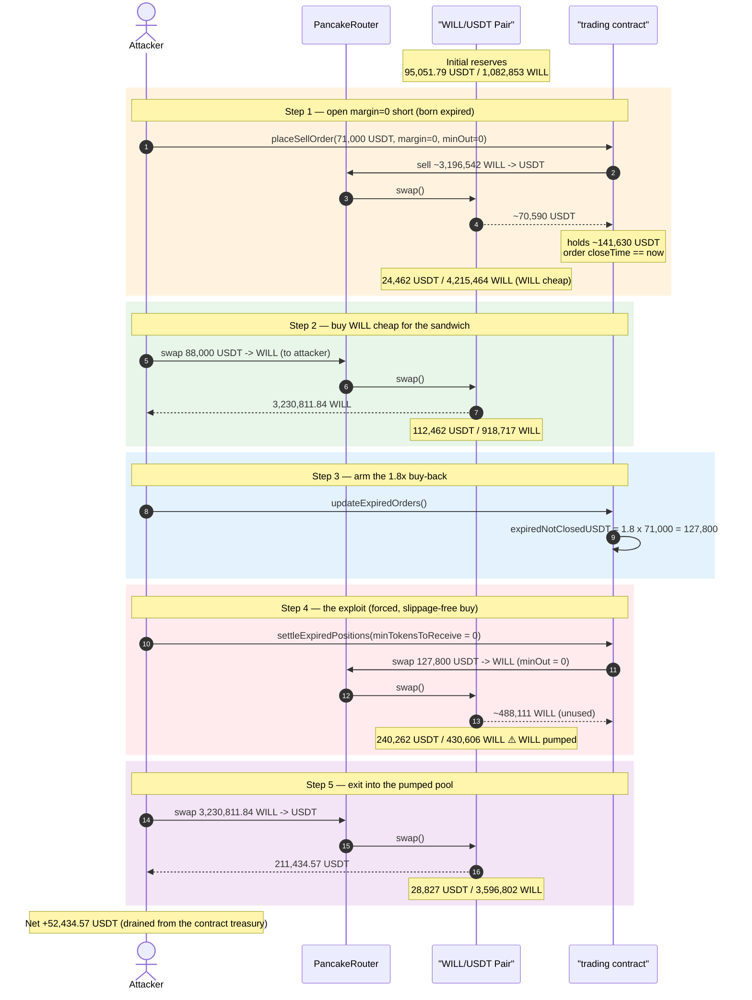
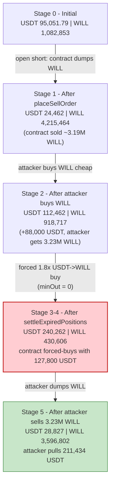
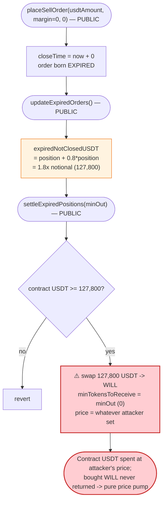

# WILL "Trading" Exploit — Over-Sized, Slippage-Free `settleExpiredPositions()` Buy-Back Sandwich

> **Vulnerability classes:** vuln/defi/slippage · vuln/defi/sandwich-attack

> One-line: A short-selling protocol force-buys **1.8×** the short notional back from PancakeSwap with **zero slippage protection** and the **contract's own USDT**, so an attacker sandwiches that forced buy to drain the contract's treasury.

> **Reproduction:** the PoC compiles & runs in an isolated Foundry project at
> [this project folder](.) (the umbrella DeFiHackLabs repo does not whole-compile under `forge test`,
> so this PoC was extracted). Full verbose trace: [output.txt](output.txt).
> Verified vulnerable source: [trading.sol](sources/trading_566777/trading.sol).

---

## Key info

| | |
|---|---|
| **Loss** | ~**52,434 USDT** (~$52,777) drained from the `trading` contract's USDT balance |
| **Vulnerable contract** | `trading` — [`0x566777eD780dbbe17c130AE97b9FbC0A3Ab829DF`](https://bscscan.com/address/0x566777eD780dbbe17c130AE97b9FbC0A3Ab829DF#code) |
| **Victim pool** | WILL/USDT PancakePair — [`0x1aaA8e1Fd2f4137bbf83bD40D08746ce2862ed55`](https://bscscan.com/address/0x1aaA8e1Fd2f4137bbf83bD40D08746ce2862ed55) |
| **Tokens** | WILL [`0xe38593e7F4f2411E0C0aB74589A7209681ab4B1d`](https://bscscan.com/address/0xe38593e7F4f2411E0C0aB74589A7209681ab4B1d) (fee-on-transfer), USDT `0x55d398326f99059fF775485246999027B3197955` |
| **Attacker EOA** | [`0xb6911dee6a5b1c65ad1ac11a99aec09c2cf83c0e`](https://bscscan.com/address/0xb6911dee6a5b1c65ad1ac11a99aec09c2cf83c0e) |
| **Attacker contract** | [`0x63b4de190c35f900bb7adf1a13d66fb1f0d624a1`](https://bscscan.com/address/0x63b4de190c35f900bb7adf1a13d66fb1f0d624a1#code) |
| **Attack txs** | TX1 [`0xc12ccc3b…cbde4d`](https://app.blocksec.com/explorer/tx/bsc/0xc12ccc3bdaf3f0ec1efa09d089a0c1dbad05519e1eb0fa6475ffcc6317cbde4d) · TX2 [`0xefe58a14…9415e9`](https://app.blocksec.com/explorer/tx/bsc/0xefe58a14fc0022872262678b358aaae64a26fe2389d09093eb14752ea99415e9) |
| **Chain / block / date** | BSC / fork at 39,979,796 / June 2024 |
| **Compiler** | `trading`: Solidity v0.8.24, optimizer 200 runs · WILL: 0.6.12 |
| **Bug class** | Manipulable AMM settlement: over-sized buy-back + missing slippage guard, sandwiched |

---

## TL;DR

`trading` is a leverage "short-selling" protocol on BSC. A user opens a short with
[`placeSellOrder(usdtAmount, margin, minUsdtReceived)`](sources/trading_566777/trading.sol#L265):
the contract pulls `usdtAmount` USDT, then **sells the equivalent amount of WILL into the pool** to
realize the short. When the position expires it is closed by selling USDT for WILL again
([`settleExpiredPositions`](sources/trading_566777/trading.sol#L529)).

Two design flaws compose into a treasury drain:

1. **The expiry buy-back is sized at 1.8× the short notional.**
   [`updateExpiredOrders()`](sources/trading_566777/trading.sol#L506) computes
   `expiredNotClosedUSDT = totalPosition + 0.8 * totalPosition` ([:512-513](sources/trading_566777/trading.sol#L512-L513)),
   i.e. **180% of the short**, and `settleExpiredPositions` spends that entire amount of the *contract's
   own* USDT to buy WILL on PancakeSwap.

2. **That buy-back has no slippage protection** — the PoC calls
   `settleExpiredPositions(0)` so `minTokensToReceive = 0`
   ([:542-548](sources/trading_566777/trading.sol#L542-L548)), and the buy executes at whatever price
   the attacker has set the pool to.

The attacker:

1. **Opens a self-short** with `margin = 0`, which makes the order **instantly expired**
   (`closeTime = block.timestamp`, [:303-304](sources/trading_566777/trading.sol#L303-L304)). This
   also makes the contract dump ~3.19M WILL into the pool, leaving the contract holding ~141,630 USDT.
2. **Buys WILL cheaply** for itself (88,000 USDT → 3.23M WILL) right after that dump, while WILL is
   depressed.
3. **Triggers the expiry settlement** (`updateExpiredOrders()` → `settleExpiredPositions(0)`), which
   forces the contract to spend **127,800 USDT** (1.8 × 71,000) buying WILL back into the pool with no
   slippage cap — pumping the WILL price.
4. **Sells the 3.23M WILL it bought in step 2** into the now-pumped pool for 211,434 USDT.

Net result: the attacker walks away with **+52,434 USDT**, pulled out of the `trading` contract's USDT
balance via the PancakeSwap pool.

---

## Background — what `trading` does

[`trading`](sources/trading_566777/trading.sol) is a synthetic short-selling + staking contract that
operates against a single WILL/USDT PancakeSwap pool:

- **Open a short** — [`placeSellOrder`](sources/trading_566777/trading.sol#L265): pull `usdtAmount`
  (+ optional `margin`) USDT from the user, compute how much WILL must be sold to realize `usdtAmount`
  of proceeds, and **sell that WILL into the pool**. The position records the WILL it "owes".
- **Close a short** — [`closeShortPosition`](sources/trading_566777/trading.sol#L406) (for live
  orders) or the expiry path [`updateExpiredOrders`](sources/trading_566777/trading.sol#L506) +
  [`settleExpiredPositions`](sources/trading_566777/trading.sol#L529): buy WILL back from the pool to
  cover the short, then settle PnL.
- **Stake / interest** — `stake`/`unstake`/interest accounting (not used by the exploit).

The contract keeps a pool of USDT (from open shorts, margins, and staking) that it uses to buy WILL
back at settlement. **That USDT pool is the prize.**

WILL itself ([source](sources/WILL_e38593/WILL.sol)) is a 18,000,000-supply, fee-on-transfer token: a
~2% cut of every transfer is routed to a "dapp" address `0x719a516a…`, which is why pool amounts in/out
don't net exactly in the trace.

---

## The vulnerable code

### 1. `margin = 0` ⇒ the order is born already expired

```solidity
// placeSellOrder, trading.sol:303-304
uint256 secondsExtended = margin.mul(1e10).div(usdtAmount.mul(INTEREST_PER_USDT_PER_SECOND));
uint256 closeTime = block.timestamp + secondsExtended;
```

With `margin = 0`, `secondsExtended = 0`, so `closeTime == block.timestamp`. The position is
**immediately eligible for expiry settlement** in the same block — no waiting, no real margin posted.
([trading.sol:265-321](sources/trading_566777/trading.sol#L265-L321))

### 2. The expiry buy-back is over-sized (1.8× the notional)

```solidity
// updateExpiredOrders, trading.sol:506-526
for (...) {
    if (activeOrders[orderId] && sellOrders[orderId].closeTime < block.timestamp) {
        uint256 totalPosition = sellOrders[orderId].usdtShorted;          // 71,000
        uint256 additionalFunds = totalPosition.mul(80).div(100);         // 0.8 × 71,000 = 56,800
        total += totalPosition + additionalFunds;                          // 1.8 × 71,000 = 127,800
        ...
    }
}
expiredNotClosedUSDT = total;                                              // 127,800 USDT
```

The protocol decides to spend **180% of the short notional** to "buy back" the position — far more than
the ~71,000 USDT the order actually contributed and more than the ~70,590 USDT the contract realized by
selling WILL when the order was opened. ([trading.sol:506-526](sources/trading_566777/trading.sol#L506-L526))

### 3. The settlement swap has no slippage protection

```solidity
// settleExpiredPositions, trading.sol:529-552
function settleExpiredPositions(uint256 minTokensToReceive) public nonReentrant {
    require(expiredNotClosedUSDT > 0, "No funds to settle positions");
    uint256 usdtAvailable = IERC20(USDT).balanceOf(address(this));
    require(usdtAvailable >= expiredNotClosedUSDT, "Insufficient USDT available");
    ...
    IERC20(USDT).approve(address(pancakeSwapRouter), expiredNotClosedUSDT);
    pancakeSwapRouter.swapExactTokensForTokensSupportingFeeOnTransferTokens(
        expiredNotClosedUSDT,
        minTokensToReceive,          // ⚠️ caller passes 0 — buy at ANY price
        path,                        // USDT -> WILL
        address(this),
        block.timestamp + 300
    );
    expiredNotClosedUSDT = 0;
}
```

`settleExpiredPositions` is **permissionless**, takes the slippage bound (`minTokensToReceive`) **from
the caller**, and dumps the entire 1.8× amount into the pool at the attacker's chosen price. The bought
WILL is never returned to anyone — it just sits in the contract; the swap's only effect is to **pump the
pool's WILL price using the contract's USDT**. ([trading.sol:529-552](sources/trading_566777/trading.sol#L529-L552))

---

## Root cause — why it was possible

The settlement logic treats the AMM as a trusted price source and lets an attacker control every input
to the value-moving swap:

1. **Over-sized notional.** Buying back **1.8×** the short (instead of the WILL quantity actually owed)
   means the contract systematically spends more USDT into the pool than the short ever brought in. This
   is a built-in, repeatable leak even without manipulation.
2. **No slippage guard + caller-supplied bound.** The forced USDT→WILL buy uses
   `minTokensToReceive = 0`, so it executes at whatever price the attacker has shaped the pool into.
   There is no on-chain reference price (TWAP/oracle) — the spot pool is trusted blindly.
3. **Instant, self-serviceable expiry.** `margin = 0` produces `closeTime = block.timestamp`, so an
   attacker can open and settle a short in the **same transaction**, removing any waiting or
   honest-keeper requirement.
4. **Single shared pool, single block.** Open (sell WILL), reposition (buy WILL cheap), and settle (force
   the contract to buy WILL) all hit the same pool atomically, so the attacker captures the price impact
   of the protocol's own buy-back.

In short: the protocol pays **180% of the position** to buy an asset at a **price the attacker sets**,
out of **its own treasury** — a textbook sandwich where the "victim swap" is the protocol's settlement.

---

## Preconditions

- A WILL/USDT PancakeSwap pool exists and the `trading` contract holds enough USDT to satisfy
  `usdtAvailable >= expiredNotClosedUSDT` at settlement (here ~141,630 USDT ≥ 127,800). The opening
  short itself tops up the contract's USDT to clear this check.
- Ability to open a `margin = 0` short (anyone) and working capital in USDT to (a) seed the short and
  (b) buy WILL for the sandwich. Peak outlay was 71,000 + 88,000 = 159,000 USDT; the PoC `deal`s
  180,000 USDT as headroom. Fully recovered intra-sequence, hence flash-loanable.
- `settleExpiredPositions` / `updateExpiredOrders` are permissionless, so no privileged actor is needed.

---

## Attack walkthrough (with on-chain numbers from the trace)

Pool ordering: `token0 = USDT`, `token1 = WILL`. All reserves below are read from `getReserves()` /
`Sync` events in [output.txt](output.txt). WILL's ~2% transfer fee accounts for the small
non-conservation of WILL amounts.

| # | Step (trace) | Pool USDT | Pool WILL | Attacker USDT | Effect |
|---|--------------|----------:|----------:|--------------:|--------|
| 0 | **Initial** ([getReserves](output.txt#L1629)) | 95,051.79 | 1,082,853.05 | 180,000.00 | Honest pool. |
| 1 | **`placeSellOrder(71000, 0, 0)`** — contract pulls 71,000 USDT, sells ~3,196,542 WILL → gets ~70,590 USDT; order born expired ([Sync](output.txt#L1665)) | 24,462.00 | 4,215,464.32 | 109,000.00 | Contract now holds ~141,630 USDT; WILL price crashed. |
| 2 | **Attacker buys WILL** — swap 88,000 USDT → 3,230,811.84 WILL ([Sync](output.txt#L1724)) | 112,462.00 | 918,717.55 | 21,000.00 | Attacker stacks 3.23M WILL while WILL is cheap. |
| 3 | **`updateExpiredOrders()`** — sets `expiredNotClosedUSDT = 1.8 × 71,000 = 127,800` ([storage](output.txt#L1736)) | 112,462.00 | 918,717.55 | 21,000.00 | Buy-back target armed. |
| 4 | **`settleExpiredPositions(0)`** — contract spends 127,800 USDT → buys ~488,111 WILL, `minOut = 0` ([Sync](output.txt#L1776)) | 240,262.00 | 430,606.56 | 21,000.00 | Contract's USDT pumps WILL price hard. |
| 5 | **Attacker sells 3,230,811.84 WILL** → 211,434.57 USDT ([Sync](output.txt#L1824)) | 28,827.43 | 3,596,802.16 | **232,434.57** | Attacker exits into the pumped pool. |

End-of-test balances ([log](output.txt#L1834)): start 180,000 USDT → end **232,434.57 USDT**.

### Profit accounting (USDT)

| Direction | Amount |
|---|---:|
| Spent — open short (`placeSellOrder`) | 71,000.00 |
| Spent — buy WILL for sandwich | 88,000.00 |
| **Total spent** | **159,000.00** |
| Received — sell 3.23M WILL after settle | 211,434.57 |
| **Total received** | **211,434.57** |
| **Net profit** | **+52,434.57** |

The ~52,434 USDT profit is exactly the value the contract bled out: at settlement it spent 127,800 USDT
buying WILL it does not need, and the attacker captured the resulting price move. (The PoC condenses the
real two-transaction attack — TX1/TX2 in the header — into a single sequence; the mechanism is
identical.)

---

## Diagrams

### Sequence of the attack



### Pool reserve evolution



### The flaw inside the expiry settlement path



---

## Remediation

1. **Buy back the WILL actually owed, not 1.8× the USDT notional.** The settlement should re-acquire
   `order.tokenAmount` WILL (the quantity the contract sold when opening), priced at execution time —
   not an arbitrary `1.8 × usdtShorted` of USDT. The `+0.8×` "additional funds" term
   ([:512-513](sources/trading_566777/trading.sol#L512-L513)) is an unbacked outflow.
2. **Enforce real slippage protection.** Never let the caller pass `minTokensToReceive = 0`. Compute a
   minimum-out from a manipulation-resistant reference (Chainlink/TWAP) and revert if the spot quote
   deviates beyond a tight band. Do not trust the instantaneous pool price the caller can move.
3. **Don't make positions instantly expirable.** Reject `margin == 0` (or any params that yield
   `closeTime == openTime`), and require a minimum holding period so open-and-settle cannot occur in the
   same block/transaction.
4. **Gate or rate-limit settlement.** Restrict `settleExpiredPositions` (and the buy-back size per call)
   to a trusted keeper, or batch it so a single attacker-chosen call cannot move the whole treasury
   through the pool atomically.
5. **Use protocol-owned price, not spot AMM, for PnL.** Both `placeSellOrder` sizing and settlement read
   the live pool; an oracle/TWAP for sizing and settlement value would remove the sandwich entirely.

---

## How to reproduce

```bash
_shared/run_poc.sh 2024-06-Will_exp -vvvvv
```

- RPC: a **BSC archive** endpoint is required (fork block 39,979,796). `foundry.toml` uses
  `https://bsc-mainnet.public.blastapi.io`, which serves historical state at that block; most public BSC
  RPCs prune it and fail with `header not found` / `missing trie node`.
- Result: `[PASS] testExploit()`.

Expected tail:

```
[Begin] Attacker USDT before exploit: 180000.000000000000000000
[End] Attacker USDT after exploit: 232434.568033898910189735
[PASS] testExploit() (gas: ...)
Suite result: ok. 1 passed; 0 failed; 0 skipped
```

Net profit ≈ **52,434.57 USDT** (≈ $52,777 as reported in the PoC header).

---

*Reference: DeFiHackLabs — `src/test/2024-06/Will_exp.sol`. SlowMist/BlockSec incident, WILL "trading", BSC, ~$52.7K.*
