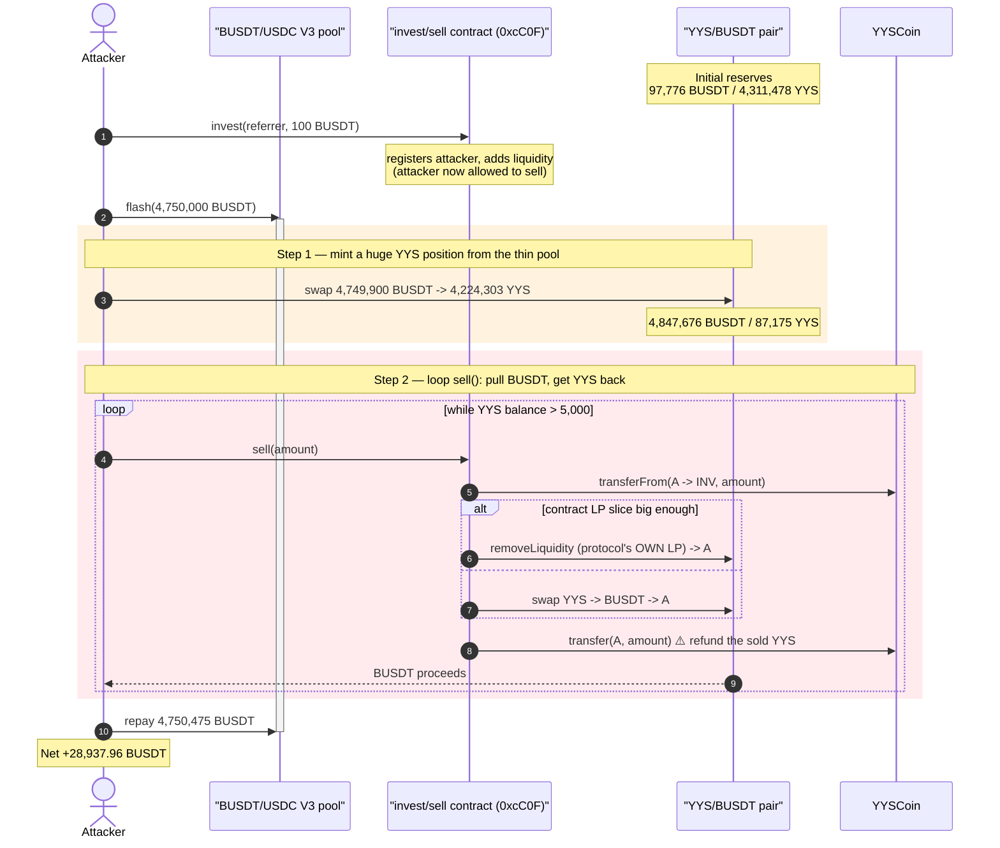
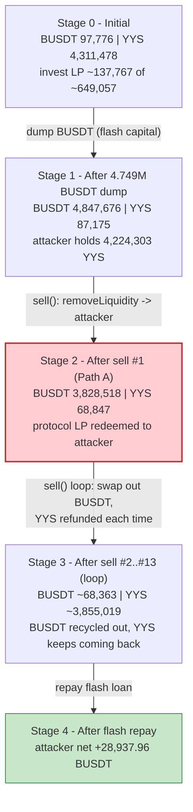
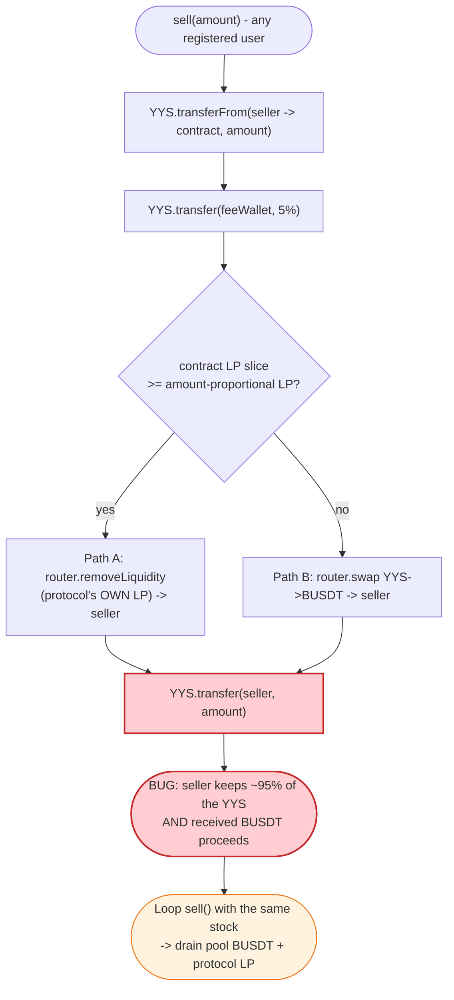

# YYS / YYSCoin Exploit — `sell()` Returns the Tokens It "Sold" (Double-Payout Drain)

> **Reproduction:** the PoC compiles & runs in an isolated Foundry project at
> [this project folder](.) (the umbrella DeFiHackLabs repo contains many
> unrelated PoCs that do not whole-compile, so this one was extracted).
> Full verbose trace: [output.txt](output.txt).
> The vulnerable `invest`/`sell` contract is **unverified** on BscScan; its logic
> is reconstructed from the on-chain execution trace. The interacting token
> source is verified: [YYSCoin.sol](sources/YYSCoin_E814Cc/YYSCoin.sol).

---

## Key info

| | |
|---|---|
| **Loss** | ~$28.9K — **28,937.96 BUSD-T** net, drained from the YYS/BUSD-T PancakeSwap pair and the project's own LP position |
| **Vulnerable contract** | "invest/sell" reward contract — [`0xcC0F0f41f4c4c17493517dd6c6d9DD1aDb134Fc9`](https://bscscan.com/address/0xcC0F0f41f4c4c17493517dd6c6d9DD1aDb134Fc9) (**unverified**) |
| **Interacting token** | `YYSCoin` (YYS) — [`0xE814Cc2B4DbFe652C04f2E008ced18875c76F510`](https://bscscan.com/address/0xE814Cc2B4DbFe652C04f2E008ced18875c76F510#code) |
| **Victim pool** | YYS/BUSD-T pair — [`0x4200A9B80B1e84cF94ad8Fc28f66195BC3c37F3F`](https://bscscan.com/address/0x4200A9B80B1e84cF94ad8Fc28f66195BC3c37F3F#code) |
| **Flash-loan source** | BUSD-T/USDC PancakeSwap V3 pool — `0x92b7807bF19b7DDdf89b706143896d05228f3121` |
| **Attacker EOA** | [`0x101723def8695f5bb8d5d4aa70869c10b5ff6340`](https://bscscan.com/address/0x101723def8695f5bb8d5d4aa70869c10b5ff6340) |
| **Attacker contracts** | `0x832e6540da54d07cb0dfea8957be690c8eb2c6a0`, `0x4192abd1466b49be9d1e99918aee99e0dbd65289` |
| **Attack tx** | `0x397a09af6494c0bfcd89e010f5dd65d90f3ee1cf1ff813ce5b0c1d42a1c8dec9` |
| **Chain / block / date** | BSC / 39,436,701 / June 8, 2024 |
| **Compiler** | YYSCoin: Solidity v0.8.17, optimizer 1 run; Pair: v0.5.16 |
| **Bug class** | Broken sell accounting — the "sell" routine refunds the seller the very tokens they sold, on top of paying out the proceeds |

---

## TL;DR

The YYS project runs a custom MLM/reward contract (the "invest" contract at
`0xcC0F…`, **unverified**) that offers a `sell(uint256 amount)` helper so users
can liquidate their YYS for BUSD-T. The intended behavior is the ordinary
exchange: *take YYS, give BUSD-T, keep the YYS.*

The trace shows the implementation is broken in two compounding ways:

1. **It returns the YYS it just took.** At the end of every `sell()` call the
   contract transfers the *same* YYS amount (minus a 5% fee) **back to the
   seller** — visible as a final
   `YYS.transfer(seller, soldAmount)` in each `sell` sub-trace
   (e.g. [output.txt:1917](output.txt)). So the seller is paid out **and** keeps
   (almost) all of their tokens, letting them call `sell()` again with the same
   stock in a loop.
2. **It pays out by redeeming the protocol's *own* liquidity.** For a large
   first sale the contract calls `Router.removeLiquidity(...)` on the
   YYS/BUSD-T pair using **the invest contract's own LP balance** and sends the
   withdrawn BUSD-T+YYS **directly to the seller**
   ([output.txt:1822](output.txt)). Subsequent sales route through a plain
   YYS→BUSD-T swap whose proceeds also go to the seller.

Combining the two, the attacker:

1. Flash-loans **4,750,000 BUSD-T** from a PancakeSwap V3 pool.
2. Dumps **4,749,900 BUSD-T** into the thin YYS/BUSD-T pair (pre-dump reserve was
   only ~97,776 BUSD-T), receiving **4,224,303 YYS**.
3. Calls `sell()` in a `while` loop. Each iteration pulls BUSD-T out of the pool
   (and, on the first iteration, out of the project's LP position) **and hands
   the YYS back**, so the attacker keeps re-selling the same coins.
4. Repays the flash loan (4,750,475 BUSD-T) and walks away with the surplus.

Net: the attacker extracted **4,779,313 BUSD-T** from the pool/LP while only
putting in **4,749,900**, netting **+28,937.96 BUSD-T** after the flash fee.

---

## Background — what the system does

`YYSCoin` ([YYSCoin.sol](sources/YYSCoin_E814Cc/YYSCoin.sol)) is a standard
ERC20 plus a transfer hook tied to two PancakeSwap pairs and an external reward
contract `ddd` (the invest contract):

- **`usdtPair`** ([YYSCoin.sol:169](sources/YYSCoin_E814Cc/YYSCoin.sol#L169)) —
  the public PancakeSwap-factory pair (the victim pool `0x4200A9…`). Transfers
  to/from it take a fee (1% on buys via `pair==to`, up to 30% on sells via
  `pair==from`, [YYSCoin.sol:225-248](sources/YYSCoin_E814Cc/YYSCoin.sol#L225-L248)).
- **`innerPair`** ([YYSCoin.sol:177](sources/YYSCoin_E814Cc/YYSCoin.sol#L177)) —
  a second pair on a custom inner router `0x8228A4…`, gated so that only
  "registered" users (those with `userRewardInfo(to).qq > 0`) can receive YYS
  from it ([YYSCoin.sol:210-216](sources/YYSCoin_E814Cc/YYSCoin.sol#L210-L216)).
- **invest contract `0xcC0F…`** — the unverified MLM/reward contract. It exposes
  `invest(referrer, amount)` (binds an upline, takes BUSD-T, swaps part to YYS,
  and **adds liquidity** to the YYS/BUSD-T pair, accumulating LP tokens in the
  invest contract) and `sell(amount)` (the broken liquidation helper). YYSCoin
  reads its `userRewardInfo()` to decide who is allowed to receive YYS from the
  inner pair.

The on-chain state at the fork block, read from the trace:

| Parameter | Value (from trace) |
|---|---|
| YYS/BUSD-T pair token0 | BUSD-T (`0x55d3…`) |
| YYS/BUSD-T pair token1 | YYS (`0xE814…`) |
| Pair reserve0 (BUSD-T) before attack | **97,776 BUSD-T** ([output.txt:1759](output.txt)) |
| Pair reserve1 (YYS) before attack | 4,311,478 YYS |
| invest-contract LP balance | ~137,767 LP ([output.txt:1820](output.txt)) |
| Pair LP totalSupply | ~649,057 LP ([output.txt:1816](output.txt)) |
| Flash-loan size | 4,750,000 BUSD-T |

The decisive fact: the BUSD-T side of the victim pool was **tiny (~97.8K)**, and
the invest contract held a **large LP position (~21% of the pool)** whose
underlying value it would happily ship to any seller.

---

## The vulnerable code

The invest contract `0xcC0F…` is **unverified**, so the snippets below are the
relevant verified YYSCoin source plus the reconstructed `sell()` shape derived
directly from the execution trace.

### 1. `sell()` — reconstructed from the trace

Reading [output.txt:1803-1862](output.txt) (first call) and
[output.txt:1870-1922](output.txt) (subsequent calls), each `sell(amount)`
performs the following sequence:

```solidity
// RECONSTRUCTED from the trace — the contract is unverified
function sell(uint256 amount) external {
    YYS.transferFrom(msg.sender, address(this), amount);        // pull YYS in
    YYS.transfer(feeWallet /*0xb381…*/, amount * 5 / 100);      // 5% YYS fee

    uint256 lp        = pair.balanceOf(address(this));          // contract's OWN LP
    uint256 lpForSell = pair.totalSupply() * amount / reserveYYS; // LP slice ∝ sold amount
    if (lpForSell <= lp) {
        // PATH A — redeem the PROTOCOL'S liquidity, pay it to the SELLER
        router.removeLiquidity(BUSDT, YYS, lpForSell, 0, 0, msg.sender, deadline);
    } else {
        // PATH B — swap YYS→BUSDT, proceeds to the SELLER
        router.swapExactTokensForTokens(amount, 0, [YYS, BUSDT], msg.sender, deadline);
    }

    YYS.transfer(msg.sender, amount);   // ⚠️ BUG: return the YYS that was "sold"
}
```

The final line is the smoking gun and is unambiguous in the trace — after the
swap that already paid BUSD-T to the seller, the contract executes a separate
`YYS.transfer(seller, amount)`:

```text
// output.txt:1912 — swap pays BUSDT to seller
emit Swap(... amount1In: 1,996,922 YYS, amount0Out: 3,700,613 BUSDT, to: ContractTest)
// output.txt:1917 — then the SAME YYS is handed back to the seller
[23574] YYS::transfer(ContractTest, 1,996,922,361,931,512,697,506,262 /*1.996e24*/)
```

### 2. YYSCoin lets the swap/LP path through

YYSCoin's `_transfer` only enforces the inner-pair gate and applies fees on the
`usdtPair` ([YYSCoin.sol:197-251](sources/YYSCoin_E814Cc/YYSCoin.sol#L197-L251)).
The invest contract is whitelisted on the inner router (`ownerShips(…) == true`,
[output.txt:1898](output.txt)), so none of its movements are blocked. Nothing in
the token contract constrains how much value the invest contract is willing to
pay out per unit of YYS "sold".

---

## Root cause — why it was possible

The bug is **entirely inside the unverified invest contract's `sell()`**: it does
not actually consume the seller's tokens. Two design errors compose into a
critical drain:

1. **Tokens are refunded after the sale.** The closing
   `YYS.transfer(msg.sender, amount)` returns the (near-) full amount the user
   just "sold". A correct `sell()` would keep the YYS (it was supposed to be
   exchanged for BUSD-T). Because the YYS comes back, the seller's inventory is
   essentially unchanged after each call, so they can loop `sell()` indefinitely
   — the PoC's `while (YYS.balanceOf(this) > 5000 ether)` loop
   ([YYS_exp.sol:68-75](test/YYS_exp.sol#L68-L75)) does exactly this.

2. **Payouts come from protocol-owned value.** Path A's `removeLiquidity` burns
   the **invest contract's own LP** and ships the underlying BUSD-T+YYS to the
   caller; Path B swaps against the public pool. In both cases the seller
   receives real BUSD-T while surrendering nothing permanently. The protocol is
   effectively giving away its LP-backed reserves to anyone who calls `sell()`.

3. **No solvency/accounting check.** `sell()` never verifies that the BUSD-T it
   pays out corresponds to YYS actually retained, nor that the cumulative payout
   stays within the user's deposited principal. There is no per-user balance
   debit that survives the call.

The flash loan and the initial dump are not the vulnerability — they are just
**capital amplifiers**. They let the attacker (a) cheaply mint a huge YYS
position from the thin pool and (b) make Path A/Path B payouts large in absolute
terms. The drain itself is fully attributable to `sell()` returning what it took.

---

## Preconditions

- **A bound/registered position.** YYSCoin's inner-pair gate and the invest
  contract require the seller to be "registered". The PoC satisfies this by
  calling `invest(Anotheraddress, 100 ether)` first
  ([YYS_exp.sol:39-41](test/YYS_exp.sol#L39-L41)); the comment notes *"Any
  address that has been bound before can be used."* — registration is cheap and
  permissionless.
- **The invest contract holds LP / the pool holds BUSD-T.** Path A pays from the
  contract's LP balance; Path B pays from the pool. Both held value at the fork
  block.
- **Working capital in BUSD-T** to dump into the thin pool and mint a large YYS
  position. It is fully recovered intra-transaction, hence **flash-loanable** —
  the PoC borrows 4,750,000 BUSD-T from the BUSD-T/USDC V3 pool
  ([YYS_exp.sol:45](test/YYS_exp.sol#L45)) and repays it at the end of the
  callback ([YYS_exp.sol:76](test/YYS_exp.sol#L76)).

---

## Attack walkthrough (with on-chain numbers from the trace)

In the YYS/BUSD-T pair `token0 = BUSD-T`, `token1 = YYS`, so `reserve0 = BUSD-T`
and `reserve1 = YYS`. All reserve figures are taken from the `Sync` events in
[output.txt](output.txt).

| # | Step | Pool BUSD-T | Pool YYS | Notes |
|---|------|-----------:|---------:|-------|
| 0 | **`invest(Anotheraddress, 100)`** — register, pay fees, swap 45 BUSD-T→YYS, add liquidity | 97,776 | 4,311,478 | Binds the attacker so they may trade the inner pair / call `sell`. ([output.txt:1605](output.txt)) |
| 1 | **Flash-borrow 4,750,000 BUSD-T** from V3 BUSD-T/USDC pool | 97,776 | 4,311,478 | `pancakeV3FlashCallback` begins. ([output.txt:1740](output.txt)) |
| 2 | **Dump 4,749,900 BUSD-T → 4,224,303 YYS** into the thin pair | **4,847,676** | 87,175 | Attacker now holds 4,224,303 YYS; pool BUSD-T inflated ~50×. ([output.txt:1789](output.txt)) |
| 3 | **`sell(38,584)`** → Path A `removeLiquidity` of the invest contract's LP, paid to attacker | 3,828,518 | 68,847 | Attacker gets **1,019,157 BUSD-T + 18,327 YYS** from the protocol's LP — *and the 38,584 YYS comes back*. ([output.txt:1822](output.txt)) |
| 4 | **`sell(4,204,047)`** → Path B swap YYS→BUSD-T, then YYS refunded | 127,905 | 2,065,770 | Attacker gets **3,700,613 BUSD-T** and **1,996,922 YYS back**. ([output.txt:1870](output.txt)) |
| 5 | **`sell(1,996,922)`** → swap + refund | 87,725 | 3,014,308 | +40,180 BUSD-T; 948,538 YYS back. |
| 6 | **`sell(948,538)`** → swap + refund | 76,342 | 3,464,863 | +11,382 BUSD-T. |
| 7 | **`sell(450,555)`** → swap + refund | 71,912 | 3,678,877 | +4,430 BUSD-T. |
| 8 | **`sell(214,013)`** → swap + refund | 69,983 | 3,780,534 | +1,928 BUSD-T. |
| 9 | **`sell(101,656)`** → swap + refund | 69,102 | 3,828,821 | +880 BUSD-T. |
| 10 | **`sell(48,286)`** → swap + refund | 68,692 | 3,851,757 | +410 BUSD-T. |
| 11 | **`sell(22,936)`** → swap + refund | 68,499 | 3,862,652 | +193 BUSD-T. |
| 12 | **`sell(10,894)`** → Path A `removeLiquidity` again | 68,407 | 3,857,477 | +91 BUSD-T (small LP slice). ([output.txt:2353](output.txt)) |
| 13 | **`sell(5,174)`** → final small sale | 68,363 | 3,855,019 | +43 BUSD-T; loop exits (YYS balance < 5,000). ([output.txt:2418](output.txt)) |
| 14 | **Repay flash loan** 4,750,475 BUSD-T | — | — | 4.75M + 0.01% fee. ([output.txt:1747](output.txt) is the loan-out; repay at callback end) |

Each `sell` ends with the YYS hand-back, which is why the seller's YYS balance
*grows* after step 3 (LP removal added YYS) and then only erodes ~5% per loop
afterwards — the loop simply recycles the same large position until it falls
below the 5,000-ether cutoff.

### Profit accounting (BUSD-T)

| Direction | Amount (BUSD-T) |
|---|---:|
| Out — dumped into pool (step 2) | 4,749,900.00 |
| Out — flash-loan fee | 475.00 |
| **Total outflow** | **4,750,375.00** |
| In — `sell` #1 (Path A LP removal) | 1,019,157.77 |
| In — `sell` #2 (swap) | 3,700,613.23 |
| In — `sell` #3–#11 (swaps) | 59,498.21 |
| In — `sell` #12–#13 (LP + swap) | 135.36 |
| **Total inflow (all sells)** | **4,779,312.96** |
| Starting balance (`deal`) | 100.00 |
| **Net profit (recorded)** | **+28,937.96** |

The recorded `After Profit: 28937.96` ([output.txt:1564](output.txt)) equals
`4,779,312.96 − 4,749,900 − 475 + 100` to the wei — the surplus the attacker
pulled out of the pool/LP over what they injected, after repaying the flash loan.

---

## Diagrams

### Sequence of the attack



### Pool / position state evolution



### The flaw inside `sell()`



---

## Remediation

1. **Do not refund sold tokens.** The closing `YYS.transfer(msg.sender, amount)`
   must be removed entirely — a "sell" must *consume* the asset it exchanges. If
   only part of the amount is meant to be sold, sell exactly that part and keep
   the rest debited; never hand the full sold amount back.
2. **Never pay out from protocol-owned liquidity to arbitrary callers.** Path A's
   `removeLiquidity(...)` of the contract's own LP, with the proceeds sent to
   `msg.sender`, gives away protocol value per unit of YYS "sold". Route user
   sells through a normal swap of the user's own tokens only; manage protocol LP
   exclusively under admin/keeper control.
3. **Track and enforce per-user accounting.** Maintain a persistent balance/credit
   ledger that is debited on `sell()` and cannot be replenished within the same
   call. Reject sells that exceed the user's accounted principal/yield.
4. **Add a solvency invariant.** Assert that the BUSD-T paid out per call is
   covered by YYS actually retained (and not later returned), and bound the total
   value a single transaction can extract.
5. **Make the routine reentrancy-/loop-safe.** Even with the above, a public
   helper that interacts with an AMM should be `nonReentrant` and should not be
   profitably callable in a tight loop within one transaction.

---

## How to reproduce

The PoC was extracted into a standalone Foundry project (the umbrella
DeFiHackLabs repo has many unrelated PoCs that fail to compile under `forge
test`'s whole-project build):

```bash
_shared/run_poc.sh 2024-06-YYS_exp -vvvvv
```

- RPC: a **BSC archive** endpoint is required (the fork block 39,436,701 is old).
  `foundry.toml` uses `https://bsc-mainnet.public.blastapi.io`, which serves
  historical state at that block; most public BSC RPCs prune it and fail with
  `header not found` / `missing trie node`.
- Result: `[PASS] testExploit()` with `After Profit: 28937.95…`.

Expected tail:

```
  After Profit: : 28937.959823595053725574
[PASS] testExploit() (gas: 1617465)
Suite result: ok. 1 passed; 0 failed; 0 skipped; finished in 43.51s

Ran 1 test suite: 1 tests passed, 0 failed, 0 skipped (1 total tests)
```

---

*References: PoC header in [test/YYS_exp.sol](test/YYS_exp.sol); BlockSec
explorer tx `0x397a09af6494c0bfcd89e010f5dd65d90f3ee1cf1ff813ce5b0c1d42a1c8dec9`.
The invest/sell contract `0xcC0F…` is unverified; its logic is reconstructed
from the verbose execution trace in [output.txt](output.txt).*
