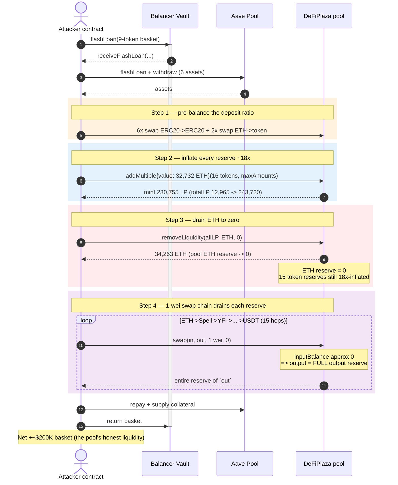
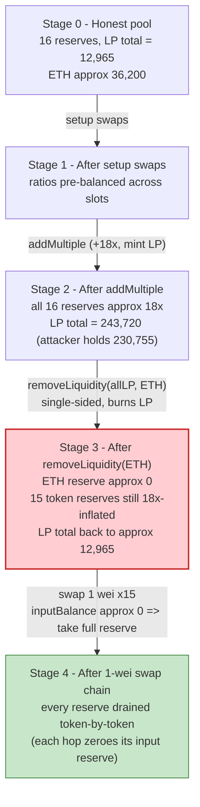
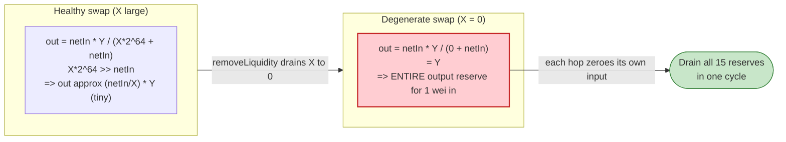

# DeFiPlaza Exploit — Constant-Product `swap` Degenerates When the Input Reserve Is Drained to Zero

> One-line summary: by inflating every pool reserve ~18× via `addMultiple`, then using single-sided `removeLiquidity` to drain the pool's ETH balance to **0**, the attacker turned DeFiPlaza's `x·y=k` swap into a faucet — a **1 wei** input swap returns the *entire* output-token reserve, letting the attacker walk the pool's whole 16-token basket out token-by-token.

> **Reproduction:** the PoC compiles & runs in an isolated Foundry project at [this project folder](.) (the umbrella DeFiHackLabs repo does not whole-compile, so this PoC was extracted).
> Full verbose trace: [output.txt](output.txt).
> Verified vulnerable source: [DeFiPlaza.sol](sources/DeFiPlaza_E68c1d/Users_jasper_Documents_GitHub_DEX_contracts_DeFiPlaza.sol).

---

## Key info

| | |
|---|---|
| **Loss** | ~**$200K** — the entire honest liquidity of the DeFiPlaza 16-token pool drained as a basket (ETH + 14 ERC20s) |
| **Vulnerable contract** | `DeFiPlaza` — [`0xE68c1d72340aEeFe5Be76eDa63AE2f4bc7514110`](https://etherscan.io/address/0xE68c1d72340aEeFe5Be76eDa63AE2f4bc7514110#code) |
| **Victim** | DeFiPlaza multi-token DEX pool (the contract *is* the pool; all 16 reserves held in it) |
| **Frontrunner (executed tx)** | EOA [`0xfde0d1575ed8e06fbf36256bcdfa1f359281455a`](https://etherscan.io/address/0xfde0d1575ed8e06fbf36256bcdfa1f359281455a) via contract [`0x6980a47bee930a4584b09ee79ebe46484fbdbdd0`](https://etherscan.io/address/0x6980a47bee930a4584b09ee79ebe46484fbdbdd0) |
| **Original attacker** | EOA [`0x14b362d2e38250604f21a334d71c13e2ed478467`](https://etherscan.io/address/0x14b362d2e38250604f21a334d71c13e2ed478467) via contract [`0xa4e8969bba1e1d48c30c948de0884cdff43e2d54`](https://etherscan.io/address/0xa4e8969bba1e1d48c30c948de0884cdff43e2d54) (front-run) |
| **Attack tx** | [`0xa245deda8553c6e4c575baff9b50ef35abf4c8f990f8f36897696f896f240e3a`](https://app.blocksec.com/explorer/tx/eth/0xa245deda8553c6e4c575baff9b50ef35abf4c8f990f8f36897696f896f240e3a) |
| **Chain / block / date** | Ethereum mainnet / 20,240,538 / July 5, 2024 |
| **Compiler** | Solidity v0.8.6, optimizer **100,000 runs** |
| **Bug class** | Broken AMM invariant — constant-product swap divides by a manipulable, zero-able input reserve |

> The PoC's `vulnContract = 0x00C40900…` constant is a red herring left over from another template; it is never called. The vulnerable code lives entirely in `DeFiPlaza` at `0xE68c1d…`. The two flash loans (Balancer + Aave) only supply working capital — the bug is in DeFiPlaza, not in the lenders.

---

## TL;DR

DeFiPlaza is a single-contract, **16-token** DEX where every trade follows a *pairwise* `x·y=k` curve priced directly off `IERC20(token).balanceOf(address(this))`. The swap math is:

```
outputAmount = netInput * outputBalance / ((inputBalance << 64) + netInput)
```

If `inputBalance == 0`, the denominator collapses to just `netInput`, and the swap returns `outputAmount = outputBalance` — i.e. **the whole reserve of the output token for an infinitesimal input.**

The attacker manufactured exactly that degenerate state:

1. **Flash-load** a huge multi-token basket (Balancer + Aave) and **swap** it into the pool's listed tokens to pre-balance the deposit ratio.
2. **`addMultiple`** ~18× of *every* reserve into the pool, minting **230,755 LP** on top of the pre-existing **12,965 LP** (an 17.8× inflation of the LP supply).
3. **`removeLiquidity(allLP, ETH)`** — single-sided withdrawal returns `initialBalance · (1 − (1−R)^16)`. With `R ≈ 0.947`, `(1−R)^16 ≈ 0`, so it pulls out **~100% of the pool's ETH (34,263 ETH)** while burning all the attacker's LP and **leaving the 18×-inflated balances of the other 15 tokens untouched in the pool.** The pool's ETH balance is now ≈ **0**.
4. **Walk the basket out with 1-wei swaps:** `swap(ETH→Spell, 1 wei)` returns the *entire* Spell reserve; then `swap(Spell→YFI, 1 wei)` returns the entire YFI reserve; and so on through all 15 tokens. Because each swap empties the input token's reserve (so the *next* swap's `inputBalance ≈ 0`), the chain drains token after token for ~free.

Net result: the attacker pockets the **ETH withdrawn in step 3 plus the full basket of 15 tokens drained in step 4**, minus the (recovered) flash-loan principal — the entire honest liquidity of the pool, ≈ **$200K**.

---

## Background — what DeFiPlaza does

`DeFiPlaza` ([source](sources/DeFiPlaza_E68c1d/Users_jasper_Documents_GitHub_DEX_contracts_DeFiPlaza.sol)) is a multi-token DEX. ETH plus 15 ERC20s (16 "slots") are all held inside the single contract. Quoting its own header ([:10-15](sources/DeFiPlaza_E68c1d/Users_jasper_Documents_GitHub_DEX_contracts_DeFiPlaza.sol#L10-L15)):

> *"Trades between two tokens follow the local bonding curve x*y=k. The number of tokens used is hard coded to 16 for efficiency reasons."*

The four user-facing primitives:

- **`swap`** ([:102-153](sources/DeFiPlaza_E68c1d/Users_jasper_Documents_GitHub_DEX_contracts_DeFiPlaza.sol#L102-L153)) — pairwise constant-product trade between any two listed tokens, priced off live balances.
- **`addLiquidity` / `addMultiple`** ([:174-290](sources/DeFiPlaza_E68c1d/Users_jasper_Documents_GitHub_DEX_contracts_DeFiPlaza.sol#L174-L290)) — single-sided or proportional deposit, mints LP tokens (the contract is itself an ERC20 LP).
- **`removeLiquidity`** ([:302-337](sources/DeFiPlaza_E68c1d/Users_jasper_Documents_GitHub_DEX_contracts_DeFiPlaza.sol#L302-L337)) — single-sided withdrawal: burn LP, receive **one** chosen token computed as if you withdrew proportionally in all 16 and swapped 15 back at no fee.
- **`removeMultiple`** ([:343-379](sources/DeFiPlaza_E68c1d/Users_jasper_Documents_GitHub_DEX_contracts_DeFiPlaza.sol#L343-L379)) — proportional withdrawal of *all* 16 tokens.

Pool reserves at the fork block (from the first `balanceOf` reads in the `addMultiple` trace — these are the honest, pre-attack reserves):

| Token | Pool reserve (pre-attack) |
|---|---|
| Spell | 1,235,707 SPELL |
| YFI | 0.1159 YFI |
| WBTC | 4.873 WBTC |
| DFP2 | 32,183 DFP2 |
| CVX | 308.35 CVX |
| LINK | 22,706 LINK |
| eXRD | 24,306 eXRD |
| DAI | 268,275 DAI |
| SUSHI | 1,086 SUSHI |
| MATIC | 1,481 MATIC |
| MKR | 128.8 MKR |
| USDC | 268,181 USDC |
| COMP | 15.16 COMP |
| CRV | 58,230 CRV |
| USDT | (≈ similar order) |
| ETH | ≈ 36,200 ETH (pool ETH side; ~34,263 ETH withdrawn) |

Pre-existing LP totalSupply: **12,965.15 LP**.

---

## The vulnerable code

### 1. `swap` — division by a zero-able input reserve

```solidity
// Check dex balance of the output token
uint256 initialOutputBalance;
if (outputToken == address(0)) {
  initialOutputBalance = address(this).balance;
} else {
  initialOutputBalance = IERC20(outputToken).balanceOf(address(this));
}

// Calculate the output amount through the x*y=k invariant
uint256 netInputAmount = inputAmount * _config.oneMinusTradingFee;
outputAmount = netInputAmount * initialOutputBalance / ((initialInputBalance << 64) + netInputAmount);
```
([DeFiPlaza.sol:129-140](sources/DeFiPlaza_E68c1d/Users_jasper_Documents_GitHub_DEX_contracts_DeFiPlaza.sol#L129-L140))

The reserves used in the formula are read *live* from `balanceOf` every call — there is no stored/synced reserve like a UniswapV2 pair. The constant-product formula `out = netIn · Y / (X·2⁶⁴ + netIn)` is mathematically fine **as long as the input reserve `X` is large**. But the contract never enforces a minimum reserve. When `X → 0`, the `X·2⁶⁴` term vanishes and:

```
out  =  netIn · Y / netIn  =  Y     (the entire output reserve)
```

`oneMinusTradingFee = 0xffbe76c8b4395800` (≈ 0.999, i.e. 18,428,297,329,635,842,048 in raw 0.64 fixed point). So for `inputAmount = 1` wei, `netInput ≈ 2⁶⁴` — which is exactly the same magnitude as `inputBalance << 64` *when `inputBalance == 1`*, and dwarfs it when `inputBalance == 0`. Either way a single wei buys essentially the whole reserve.

### 2. `removeLiquidity` — single-sided withdrawal that leaves 15 reserves over-collateralised

```solidity
uint256 F_;
F_ = (1 << 64) - (LPamount << 64) / totalSupply();   // (1-R)      (0.64 bits)
F_ = F_ * F_;                                         // (1-R)^2    (0.128 bits)
F_ = F_ * F_ >> 192;                                 // (1-R)^4    (0.64 bits)
F_ = F_ * F_;                                         // (1-R)^8    (0.128 bits)
F_ = F_ * F_ >> 192;                                 // (1-R)^16   (0.64 bits)
actualOutput = initialBalance * ((1 << 64) - F_) >> 64;
...
_burn(msg.sender, LPamount);
... transfer actualOutput of the SINGLE outputToken ...
```
([DeFiPlaza.sol:316-333](sources/DeFiPlaza_E68c1d/Users_jasper_Documents_GitHub_DEX_contracts_DeFiPlaza.sol#L316-L333))

Burning a large fraction `R` of LP and taking it all out in **one** token returns `initialBalance·(1−(1−R)^16)`. With `R ≈ 0.947`, `(1−R)^16` is negligible, so `actualOutput ≈ initialBalance` of ETH. The LP is burned, but the **other 15 tokens that backed that LP stay in the contract** — the pool is now grossly over-collateralised in those 15 tokens relative to its shrunken LP supply, and (critically) its **ETH reserve is ~0**.

### 3. `addMultiple` — lets the attacker cheaply inflate every reserve in proportion

```solidity
// ... compute actualRatio = min_i(maxAmounts[i] / dexBalance_i) ...
actualLP = (actualRatio * totalSupply() >> 64) * DFPconfig.oneMinusTradingFee >> 128;
for (uint256 i = 1; i < 16; i++) {
  token = tokens[i];
  dexBalance = IERC20(token).balanceOf(address(this));
  IERC20(token).safeTransferFrom(msg.sender, address(this), dexBalance * actualRatio >> 128);
}
_mint(msg.sender, actualLP);
```
([DeFiPlaza.sol:272-283](sources/DeFiPlaza_E68c1d/Users_jasper_Documents_GitHub_DEX_contracts_DeFiPlaza.sol#L272-L283))

`addMultiple` is the cheap on-ramp: the attacker deposits ~18× of every reserve in ratio and mints LP proportionally. This is the lever that lets them subsequently withdraw 18× more value via single-sided `removeLiquidity` than they could before, and leaves the 15 non-ETH reserves bloated for the 1-wei drain.

---

## Root cause — why it was possible

The flaw is the combination of **(a) a constant-product swap that divides by the input reserve with no floor**, and **(b) a single-sided `removeLiquidity` that can drive one reserve (ETH) to zero while leaving the others full**.

> A healthy AMM keeps `X·Y = k` invariant: as `X` shrinks, the marginal price of `X` explodes, so you can never buy out the whole `Y` reserve cheaply because each unit of input costs exponentially more output. DeFiPlaza's formula is correct *in continuous math*, but it permits the boundary case `X = 0`, where the curve degenerates: the price of the first wei of input is **the entire opposite reserve**.

The four design facts that compose into a critical bug:

1. **Reserves are read live from `balanceOf`, with no synced/minimum reserve and no `require(initialInputBalance > 0)`.** The swap will happily price against a zero input reserve.
2. **`removeLiquidity` is single-sided.** It lets the attacker withdraw the *entire* ETH side in one call (burning LP that "represented" all 16 tokens), zeroing the ETH reserve without touching the other 15.
3. **`addMultiple` lets the attacker scale the whole pool up first**, so the value sitting in the over-collateralised 15 reserves (which the 1-wei swaps then steal) is ~18× the honest liquidity they started against — the deposited principal is flash-loaned and recovered, so the attack is free.
4. **The 1-wei swap chain is self-perpetuating.** Each swap empties its *input* token's reserve to ≈0, which makes the *next* swap's `inputBalance ≈ 0`, so the degeneracy carries through the whole 15-token cycle (ETH→Spell→YFI→…→USDT), draining each reserve in turn.

There is no fee, oracle, or slippage mechanism that can claw this back: `minOutputAmount = 0` is accepted, and the 0.1% fee on a 1-wei input is itself 0.

---

## Preconditions

- The pool must be `unlocked` for trading and liquidity ops (it was).
- Enough working capital to (a) seed `addMultiple` with ~18× of every reserve and (b) provide the ETH for the inflation. In the live attack this is sourced from **flash loans** (Balancer multi-asset flash loan + Aave borrow/withdraw), so the net capital requirement is ~0 — all principal is repaid inside the same transaction.
- No admin intervention: the attack is a single atomic transaction, callable permissionlessly by anyone.

---

## Attack walkthrough (with on-chain numbers from the trace)

All numbers are from the `Swapped` / `MultiLiquidityAdded` / `LiquidityRemoved` events in [output.txt](output.txt). The whole exploit runs inside a Balancer flash loan (`receiveFlashLoan`) which in turn opens an Aave flash loan, then executes the DeFiPlaza logic in `executeOperation`.

| # | Step | What happens | Key on-chain numbers |
|---|------|--------------|----------------------|
| 0 | **Flash loans** | Balancer flash-loans a 9-token basket; inside, Aave flash-loans 6 more assets (+ withdraws AAVE collateral). | working capital only — fully repaid at the end |
| 1 | **Setup swaps** | 6 ERC20→ERC20 + 2 ETH→token swaps to pre-balance the deposit ratio across all 16 slots. | e.g. swap 256,581.7 USDT → 287.27 COMP; swap 86 ETH → 23.3M SPELL; swap 1,727 ETH → 2.205 YFI |
| 2 | **`addMultiple` (inflate ~18×)** | Deposit ~18× of every reserve in ratio (+32,732 ETH). | **LP minted 230,755.20**, `totalLPafter = 243,720.34` (pre-existing 12,965.15) |
| 3 | **`removeLiquidity(allLP, ETH)`** | Burn all 230,755 LP, single-sided withdraw ETH. `(1−R)^16 ≈ 0` ⇒ pull ~100% of pool ETH. | **34,263.78 ETH out**, LP burned, **pool ETH reserve → ≈ 0** |
| 4a | **swap ETH→Spell, 1 wei** | Pool ETH ≈ 0 ⇒ output = full Spell reserve. | 1 wei → **23,295,148.97 SPELL** |
| 4b | swap Spell→YFI, 1 wei | Spell reserve now ≈ 0 (just drained) ⇒ output = full YFI reserve. | 1 wei → **2.1865 YFI** |
| 4c | swap YFI→WBTC, 1 wei | | 1 wei → **91.87 WBTC** (9,187,349,359 / 1e8) |
| 4d | swap WBTC→DFP2, 1 wei | | 1 wei → **606,712 DFP2** |
| 4e | swap DFP2→CVX, 1 wei | | 1 wei → **5,812.92 CVX** |
| 4f | swap CVX→LINK, 1 wei | | 1 wei → **428,053.31 LINK** |
| 4g | swap LINK→eXRD, 1 wei | | 1 wei → **458,220.98 eXRD** |
| 4h | swap eXRD→DAI, 1 wei | | 1 wei → **5,057,449.36 DAI** |
| 4i | swap DAI→SUSHI, 1 wei | | 1 wei → **20,489.65 SUSHI** |
| 4j | swap SUSHI→MATIC, 1 wei | | 1 wei → **27,929.04 MATIC** |
| 4k | swap MATIC→MKR, 1 wei | | 1 wei → **2,428.54 MKR** |
| 4l | swap MKR→USDC, 1 wei | | 1 wei → **5,055,667 USDC** (5,055,667,600,489 / 1e6) |
| 4m | swap USDC→COMP, 1 wei | | 1 wei → **285.89 COMP** |
| 4n | swap COMP→CRV, 1 wei | | 1 wei → **1,097,741.82 CRV** |
| 4o | swap CRV→USDT, 1 wei | | 1 wei → **5,091,572 USDT** (5,091,572,398,619 / 1e6) |
| 5 | **Repay flash loans** | Repay Aave + Balancer principal; re-supply AAVE collateral. | all principal returned |

Note: the basket the attacker *keeps* at the end is not the raw 1-wei outputs above — those over-cycle through tokens the attacker then re-deposits to repay loans. The final retained balances (below) are the realised profit.

### Profit / loss accounting

Final attacker balances after the exploit (the loss to the pool / honest LPs), read from the closing `balanceOf` logs in [output.txt](output.txt):

| Asset | Net gained by attacker |
|---|---:|
| ETH | **+4.546** ETH |
| eXRD | 484,747.55 |
| USDC | 13,409.07 |
| USDT | 13,504.30 |
| DAI | 13,413.80 |
| LINK | 1,135.32 |
| WBTC | 0.2437 |
| SPELL | 24,541,399.15 |
| MKR | 5.3009 |
| CRV | 57,708.36 |
| YFI | 2.3216 |
| SUSHI | 21,675.80 |
| MATIC | 29,545.86 |
| COMP | 302.44 |
| CVX | 6,149.43 |

These retained balances — a basket of ETH + 14 ERC20s — are the drained honest liquidity, valued at roughly **$200K** at the time (per the original attacker's `@KeyInfo`). The flash-loan principals (Balancer + Aave) are fully repaid inside the same transaction; everything above is net profit.

---

## Diagrams

### Sequence of the attack



### Pool state evolution



### Why a 1-wei swap empties the reserve



---

## Remediation

1. **Reject zero/near-zero input reserves in `swap`.** Add `require(initialInputBalance > 0, "DFP: empty reserve")` and, better, enforce a non-trivial minimum so the constant-product curve can never be evaluated at its degenerate boundary. The marginal price of an asset whose reserve is 0 is undefined — the contract must refuse to quote it.
2. **Use synced/stored reserves, not raw `balanceOf`.** Pricing off live `balanceOf` means any operation that moves a balance (here, single-sided withdrawal) instantly repricing the curve. Maintain internal reserve accounting (like UniswapV2's `reserve0/reserve1` updated only through controlled paths) so a single-sided removal cannot create an inconsistent quote.
3. **Constrain single-sided `removeLiquidity`.** Cap the fraction of any one reserve a single-sided withdrawal can remove (e.g. ≤ some % per call), or require that single-sided removal cannot drive a reserve below a floor. Withdrawing ~100% of one reserve while leaving the other 15 full is the state that makes the swap exploitable.
4. **Bound per-trade reserve impact.** Any swap whose output exceeds a small fraction (e.g. 30–50%) of the output reserve should revert — a single trade taking the entire reserve is always pathological in an `x·y=k` pool.
5. **Validate `addMultiple` scale.** Limit how large a multiple of existing reserves a single `addMultiple` can inject (the contract already warns about slippage for large single-sided adds but does not bound `addMultiple`); large in-ratio inflation is the lever that makes the subsequent drain free.

---

## How to reproduce

The PoC was extracted into a standalone Foundry project (the umbrella DeFiHackLabs repo does not whole-compile under `forge test`):

```bash
_shared/run_poc.sh 2024-07-DeFiPlaza_exp -vvvvv
```

- RPC: a **mainnet archive** endpoint is required (fork block 20,240,538, July 2024). All four pre-configured Infura keys returned transient `-32603` internal errors / `401` for archive state at this block, so `foundry.toml`'s `mainnet` endpoint was switched to **`https://eth.drpc.org`**, which serves historical state at that block.
- Result: `[PASS] testExploit()` — the closing balance logs show the attacker holding the drained basket (ETH +4.546, SPELL +24.5M, eXRD +484k, USDC +13.4k, USDT +13.5k, DAI +13.4k, LINK +1,135, CRV +57.7k, MATIC +29.5k, SUSHI +21.7k, CVX +6,149, COMP +302, MKR +5.3, YFI +2.32, WBTC +0.24).

Expected tail:

```
Ran 1 test for test/DeFiPlaza_exp.sol:ContractTest
[PASS] testExploit() (gas: 3714115)
Suite result: ok. 1 passed; 0 failed; 0 skipped
```

---

*Reference: Decurity disclosure — https://x.com/DecurityHQ/status/1809222922998808760 . The on-chain attack was front-run; the executed (winning) tx is `0xa245deda…240e3a` by `0xfde0d157…1455a`. DeFiPlaza, Ethereum, ~$200K.*
