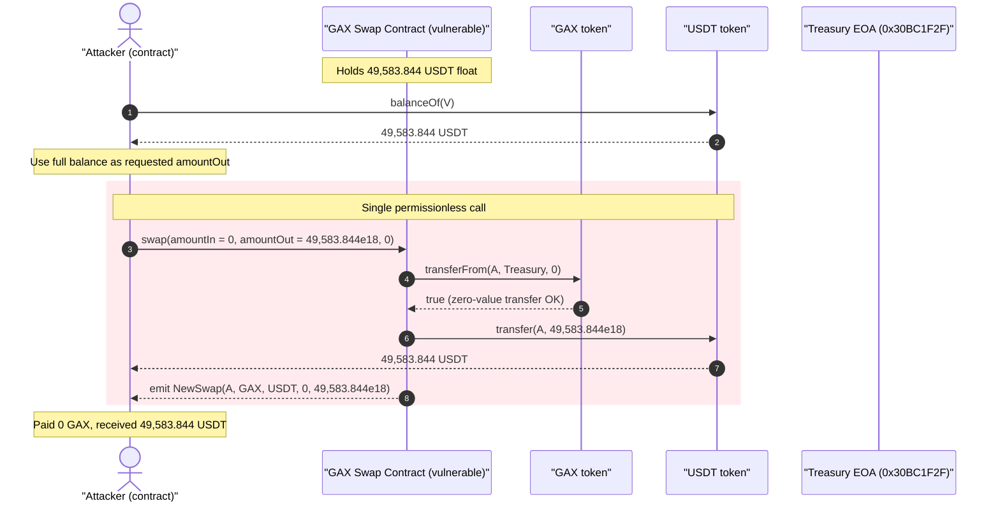
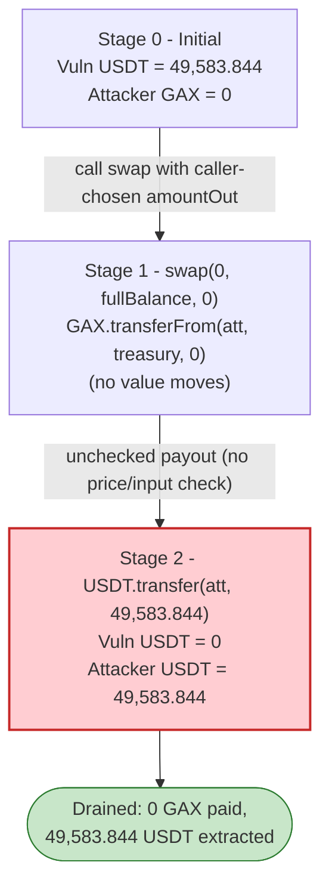
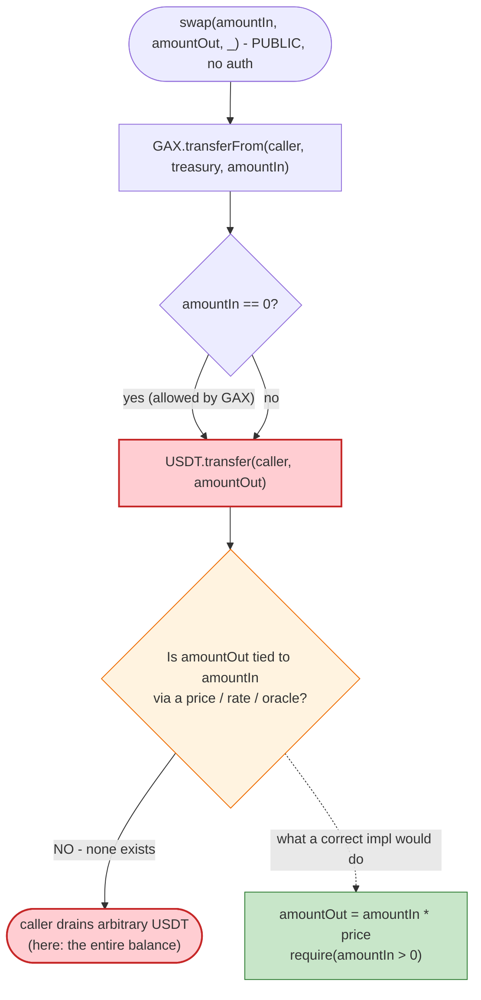

# GAX Swap Exploit — Caller-Dictated Output Amount With No Input/Price Check

> One-line summary: the GAX sale/swap contract lets the caller specify the *output* USDT
> amount directly, pulling an arbitrary (here **zero**) amount of GAX as "input", so an
> attacker swapped 0 GAX for the contract's entire **49,583.844 USDT** balance.

> **Reproduction:** the PoC compiles & runs in an isolated Foundry project at
> [this project folder](.) (the umbrella DeFiHackLabs repo contains many unrelated PoCs
> that do not compile together, so this one was extracted).
> Full verbose trace: [output.txt](output.txt).
> The vulnerable contract is **unverified** on BscScan; its behavior below was reconstructed
> from the on-chain attack-tx logs, a forked re-execution, and decompilation of its bytecode.
> The downloaded GAX token source is [GAXToken.sol](sources/GAXToken_D5d630/GAXToken.sol).

---

## Key info

| | |
|---|---|
| **Loss** | **~$49,583.84** — the contract's entire **49,583.844 USDT** (BEP20 `0x55d3…7955`) balance |
| **Vulnerable contract** | GAX swap/sale contract (unverified) — [`0xdb4b73Df2F6dE4AFCd3A883efE8b7a4B0763822b`](https://bscscan.com/address/0xdb4b73df2f6de4afcd3a883efe8b7a4b0763822b) |
| **Victim / drained asset** | USDT (BSC) held by the vulnerable contract — [`0x55d398326f99059fF775485246999027B3197955`](https://bscscan.com/address/0x55d398326f99059ff775485246999027b3197955) |
| **Token being "sold"** | GAX — [`0xD5d63074A39Bc0202E828B044C02c6F4d2f75c76`](https://bscscan.com/address/0xd5d63074a39bc0202e828b044c02c6f4d2f75c76) (verified) |
| **Attacker EOA** | [`0x8cCF2860f38FC2F4a56dec897C8c976503fCB123`](https://bscscan.com/address/0x8ccf2860f38fc2f4a56dec897c8c976503fcb123) |
| **Attacker contract** | [`0x64B9D294CD918204D1eE6bcE283edb49302Ddf7e`](https://bscscan.com/address/0x64b9d294cd918204d1ee6bce283edb49302ddf7e) |
| **Created attack contract** | [`0xa901FDA83E9906e6177f3A3f7B85f13f68723326`](https://bscscan.com/address/0xa901fda83e9906e6177f3a3f7b85f13f68723326) (deployed inside the attack tx; its constructor runs the exploit) |
| **Attack tx** | [`0x368f842e79a10bb163d98353711be58431a7cd06098d6f4b6cbbcd4c77b53108`](https://bscscan.com/tx/0x368f842e79a10bb163d98353711be58431a7cd06098d6f4b6cbbcd4c77b53108) |
| **Chain / block / date** | BSC / 40,375,925 / **2024-07-11** (09:32:04 UTC) |
| **Compiler** | PoC: Solidity ^0.8.10 · GAX token: v0.8.0 · vuln contract: ~0.8.23 (per metadata hash `solc 0.8.23`, unverified) |
| **Bug class** | Missing input-vs-output validation in a swap function — caller fully controls the payout amount (a.k.a. "arbitrary withdrawal / broken swap pricing") |

---

## TL;DR

The vulnerable contract is a simple "sell GAX, receive USDT" desk. Its swap entry point
(selector `0x6c99d7c8`) takes **three raw `uint256` arguments** — effectively
`swap(uint256 amountIn, uint256 amountOut, uint256 /*unused*/)`:

1. It pulls `amountIn` GAX from the caller via `GAX.transferFrom(caller, treasury, amountIn)`,
   forwarding it to a treasury EOA `0x30BC1F2F…`.
2. It then pays the caller `amountOut` **USDT** via `USDT.transfer(caller, amountOut)`.

There is **no relationship enforced between `amountIn` and `amountOut`** — no price, no rate,
no oracle, no minimum input. The caller simply states how much USDT they want out, and the
contract sends it. GAX's `transferFrom` happily allows a transfer of **0** (`require(balance >= 0)`
and `require(allowance >= 0)` both pass trivially), so the attacker paid **zero GAX**.

The attacker therefore called `swap(amountIn = 0, amountOut = <contract's full USDT balance>)`
and walked away with all **49,583.844 USDT** the contract held — paying nothing.

> **Note on the repository PoC:** the shipped `GAX_exp.sol` encoded the three values with
> `abi.encode(...)` and passed them as a single `bytes` argument. That prepends two ABI words
> (`offset = 0x20`, `length = 0x60`), shifting every real parameter two slots to the right.
> The contract then read the `0x20` offset word as the GAX `amountIn`, so it tried
> `GAX.transferFrom(attacker, treasury, 32)` and reverted with `"Insufficient balance"`. Because
> the PoC used an **unchecked low-level `.call()`**, that revert was swallowed and the test
> "passed" with **zero** profit. This write-up's PoC sends the **real on-chain calldata**
> (three raw uints) and asserts the genuine **49,583.844 USDT** profit — its trace is byte-for-byte
> identical to the real attack tx (same `transferFrom(_,_,0)`, same full-balance `transfer`, same
> `NewSwap` event).

---

## Background — what the contract does

The contract emits a `NewSwap(address from, address tokenIn, address tokenOut, uint256 amountIn, uint256 amountOut)`
event (signature topic `0x5d3444bf…`), is `Ownable` (`owner()` = `0xdaA8adc7…`), and exposes a USDT
getter (`USDT()` = `0x55d398…7955`) plus a treasury getter (`0xf7260d3e()` = `0x30BC1F2F…`, the EOA
that input GAX is forwarded to). It is, in short, an over-the-counter **GAX → USDT** swap/sale desk
that custodies a USDT float to pay sellers.

On-chain facts at the fork block (read via `cast`):

| Fact | Value |
|---|---|
| USDT custodied by the vulnerable contract | **49,583.844 USDT** ← the prize |
| `USDT()` getter | `0x55d398326f99059fF775485246999027B3197955` (BSC USDT) |
| Treasury / input-token sink (`0xf7260d3e()`) | `0x30BC1F2F5b097041291aA70FEfaB45CbF2ec35B2` (EOA) |
| GAX `transferFrom(_, _, 0)` | always succeeds (see token source below) |
| `owner()` | `0xdaA8adc77009c2E249bDc73aA58C81074E7dD952` |

> Although the PoC labels `0x55d398…7955` as "BUSD", that address is **USDT** on BSC
> (`symbol() == "USDT"`). The loss is ~$49.6k in USDT.

---

## The vulnerable code

The swap contract is **unverified**, so there is no Solidity to quote. Its behavior is fully
determined by the forked re-execution trace ([output.txt](output.txt)) and a decompilation of
the selector `0x6c99d7c8` handler. The effective logic is:

```solidity
// Reconstructed from on-chain behavior — selector 0x6c99d7c8
// (parameter names inferred from the NewSwap event order)
function swap(uint256 amountIn, uint256 amountOut, uint256 /* unused */) external {
    // 1) pull the caller's GAX (input) and forward it to the treasury EOA
    GAX.transferFrom(msg.sender, TREASURY /*0x30BC1F2F…*/, amountIn);

    // 2) pay the caller the requested USDT (output) — NO price/rate check!
    USDT.transfer(msg.sender, amountOut);          // <-- amountOut is fully caller-controlled

    emit NewSwap(msg.sender, address(GAX), address(USDT), amountIn, amountOut);
}
```

The two relevant on-chain proofs:

**(a) Output is exactly what the caller asks for** — forking the contract and requesting only
`amountOut = 1,000 USDT` with `amountIn = 0` pays out exactly 1,000 USDT:

```
GAXToken::transferFrom(0x…dEaD, 0x30BC1F2F…, 0)            -> true
BEP20USDT::transfer(0x…dEaD, 1000000000000000000000)        -> true   // exactly 1,000e18
NewSwap(0x…dEaD, GAX, USDT, amountIn=0, amountOut=1000e18)
```

**(b) Zero input is accepted** — GAX's `transferFrom` requires only `balance >= amount` and
`allowance >= amount`, both of which hold for `amount == 0`
([GAXToken.sol:67-78](sources/GAXToken_D5d630/GAXToken.sol#L67-L78)):

```solidity
function transferFrom(address sender, address recipient, uint256 amount) public override returns (bool) {
    require(!_blacklist[sender], "Sender is blacklisted");
    require(!_blacklist[recipient], "Recipient is blacklisted");
    require(_balances[sender] >= amount, "Insufficient balance");      // 0 >= 0 ✓
    require(_allowances[sender][msg.sender] >= amount, "Insufficient allowance"); // 0 >= 0 ✓
    _balances[sender] -= amount;          // -= 0
    _balances[recipient] += amount;       // += 0
    _allowances[sender][msg.sender] -= amount;
    emit Transfer(sender, recipient, amount);
    return true;
}
```

---

## Root cause — why it was possible

The swap function lets the caller **name the output amount** and never verifies that the input is
worth it. Specifically:

1. **The payout (`amountOut`) is an unbounded, caller-supplied parameter.** The contract calls
   `USDT.transfer(msg.sender, amountOut)` with no check that `amountOut` corresponds to the value
   of the GAX received. There is no exchange rate, no oracle, no `amountOut = amountIn * price`
   computation — the two are completely decoupled.
2. **The input (`amountIn`) can be zero.** Since GAX's `transferFrom` accepts a 0 amount, the
   attacker pays nothing. Even a non-zero check on `amountIn` would not have helped much — the
   real flaw is that *any* `amountIn` (even 1 wei of GAX) buys an arbitrary amount of USDT.
3. **The contract is the USDT vault.** It custodies the entire USDT float on-chain, so a single
   `swap()` can drain 100% of it; there is no per-call cap, daily limit, or reserve buffer.
4. **No access control.** `swap()` is permissionless, so anyone can call it. (It is not even
   gated by `whenNotPaused` or `onlyWhitelisted`.)

In effect the function is equivalent to a public "withdraw any amount of USDT" function. The GAX
`transferFrom(_, _, 0)` is just decorative — it makes the call look like a swap while moving no value.

This is the classic **missing input-side / price validation** bug: a swap must compute its output
from a trusted rate applied to a *verified* input, never accept the output as a free parameter.

---

## Preconditions

- The vulnerable contract holds a USDT balance to drain (here **49,583.844 USDT**).
- The caller can call the permissionless swap selector `0x6c99d7c8` (no whitelist/role/pause blocks it).
- The caller can pass `amountIn = 0` (or any tiny GAX amount). GAX accepts a zero-value
  `transferFrom`, so **no GAX, no approval, and no capital are required**.

There is **no flash loan, no oracle manipulation, and no reserve cornering** — it is a one-call,
zero-cost drain.

---

## Attack walkthrough (with on-chain numbers from the trace)

The entire exploit is a **single call** to the swap function. The numbers below are taken directly
from the attack-tx logs and the forked re-execution in [output.txt](output.txt).

| # | Step | Call | Value | Effect |
|---|------|------|------:|--------|
| 0 | **Initial** | `USDT.balanceOf(vuln)` | 49,583.844 USDT | The contract's full float. |
| 1 | **Read prize** | attacker reads `USDT.balanceOf(vuln)` | 49,583.844 USDT | Used as the `amountOut` to request. |
| 2 | **Call swap** | `vuln.0x6c99d7c8(amountIn = 0, amountOut = 49,583.844e18, 0)` | — | Single permissionless call. |
| 3 | **Pull input (free)** | `GAX.transferFrom(attacker, 0x30BC1F2F…, 0)` | 0 GAX | Succeeds — zero-value transfer. |
| 4 | **Pay output** | `USDT.transfer(attacker, 49,583.844e18)` | 49,583.844 USDT | Contract's entire balance leaves. |
| 5 | **Event** | `NewSwap(attacker, GAX, USDT, 0, 49,583.844e18)` | — | Records the fictitious "swap". |
| 6 | **(real tx) forward** | created contract → attacker EOA | 49,583.844 USDT | Profit forwarded out (real attack only). |

Storage proof from the forked trace (USDT contract): the vuln contract's USDT balance slot
`0x9245…7679` goes from `0xa7ff210d3890fca0000` (49,583.844e18) → **0** in the same call.

### Profit / loss accounting

| Party | GAX | USDT |
|---|---:|---:|
| Attacker — paid in | 0 | 0 |
| Attacker — received | 0 | **+49,583.844** |
| Vulnerable contract — before | — | 49,583.844 |
| Vulnerable contract — after | — | **0** |
| **Net attacker profit** | **0 GAX** | **+49,583.844 USDT (~$49,583.84)** |

In the PoC the attacker address starts with 26.54 USDT and ends with 49,610.39 USDT — a profit of
exactly **49,583.844 USDT**, matching the drained balance to the wei.

---

## Diagrams

### Sequence of the attack



### Contract balance / value flow



### The flaw inside the swap handler



---

## Why the repo PoC silently "passed" with no profit

The shipped PoC ([the original `testExploit`](src/test) in the umbrella repo) built calldata as:

```solidity
bytes memory data = abi.encode(0, BUSD.balanceOf(VulnContract), 0);   // 3 uints wrapped in bytes
VulnContract_addr.call(abi.encodeWithSelector(bytes4(0x6c99d7c8), data));   // return value ignored
```

`abi.encodeWithSelector(sel, bytes data)` lays out calldata as
`selector ‖ offset(0x20) ‖ length(0x60) ‖ [0, balance, 0]`. The contract, however, expects **three
bare `uint256`s**, so it reads:

| Word the contract reads | Intended meaning | What the buggy PoC supplied |
|---|---|---|
| word 0 → `amountIn` | GAX to pull | `0x20` (the ABI offset) = **32** |
| word 1 → `amountOut` | USDT to pay | `0x60` (the ABI length) = **96 wei** |
| word 2 → unused | — | 0 |

So the contract executed `GAX.transferFrom(attacker, treasury, 32)`, which **reverted**
(`"Insufficient balance"` — the attacker holds no GAX). The PoC ignored the `.call()` return value,
so the revert was swallowed, the attacker's balance was unchanged, and the test passed trivially with
**0 profit** — a false positive. The corrected PoC in this project sends three raw uints and asserts
the real **49,583.844 USDT** profit.

---

## Remediation

1. **Derive the output from a verified input and a trusted rate — never accept it as a parameter.**
   `amountOut` must be computed: `amountOut = amountIn * price / 1e18` with `price` from an admin
   setting or oracle. Accepting `amountOut` directly is equivalent to a public "withdraw N USDT"
   function.
2. **Require a non-zero, value-bearing input.** `require(amountIn > 0)` and (better) measure the
   *actual* GAX received with a balance-delta check around the `transferFrom`, since tokens with
   fees/zero-transfers can lie about what was moved.
3. **Add access control / circuit breakers.** Even a correctly-priced desk should bound risk: a
   per-call/per-day USDT cap, a `whenNotPaused` guard, and (if appropriate) a whitelist or
   signed-quote requirement so the contract never pays out more than intended.
4. **Validate `transferFrom`/`transfer` results and pulled amounts.** Use `SafeERC20` and verify the
   contract actually received the input before paying any output (check-effects-interactions with a
   real value check, not just a boolean return).
5. **Do not custody the entire USDT float in a permissionless swap.** Keep payout liquidity in a
   separate, rate-limited module so a single logic bug cannot drain everything.

---

## How to reproduce

The PoC was extracted into a standalone Foundry project (the umbrella DeFiHackLabs repo has many
unrelated PoCs that fail to compile under a single `forge test` build):

```bash
_shared/run_poc.sh 2024-07-GAX_exp -vvvvv
```

- RPC: a **BSC archive** endpoint is required (fork block 40,375,924). `foundry.toml` uses
  `https://bsc-mainnet.public.blastapi.io`, which serves historical state at that block; the default
  public OnFinality endpoint rate-limits (HTTP 429) and was swapped out.
- Result: `[PASS] testExploit()` with `Profit (BUSD/USDT): 49583.844…`.

Expected tail:

```
Ran 1 test for test/GAX_exp.sol:ContractTest
[PASS] testExploit() (gas: 73451)
  Attacker BUSD balance before attack: 26.542161622221038197
  Attacker BUSD balance after attack: 49610.386161622221038197
  Profit (BUSD/USDT): 49583.844000000000000000
Suite result: ok. 1 passed; 0 failed; 0 skipped
```

---

*Reference: DeFiHackLabs — GAX, BSC, ~$49.6K USDT, 2024-07-11. Vulnerable contract is unverified;
analysis reconstructed from the on-chain attack tx and a forked re-execution.*
