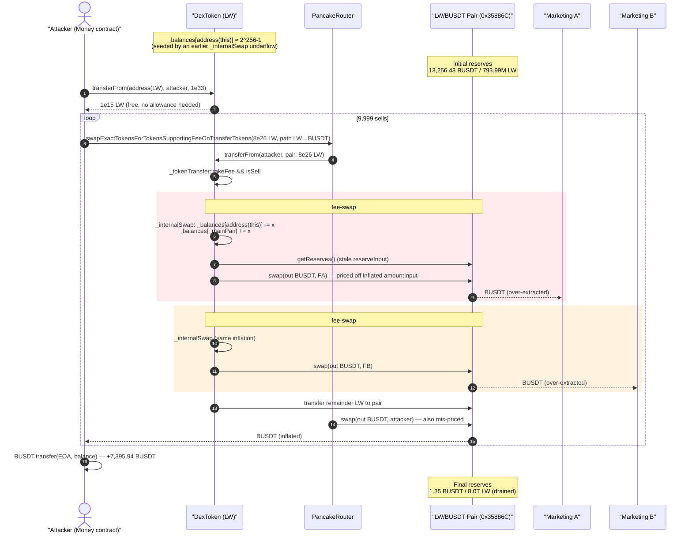
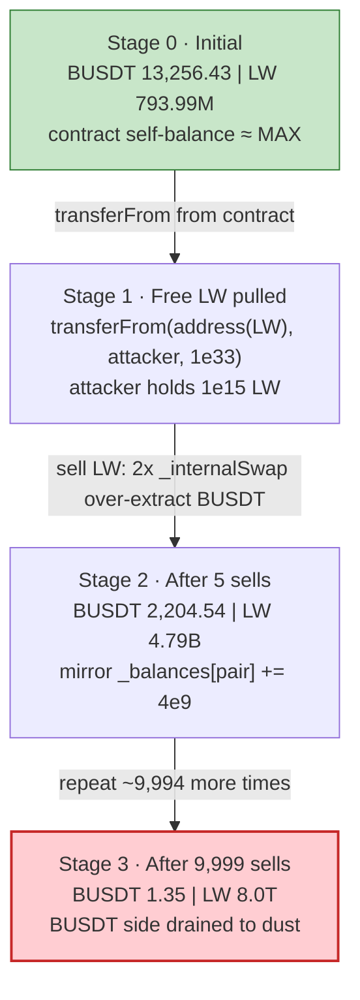
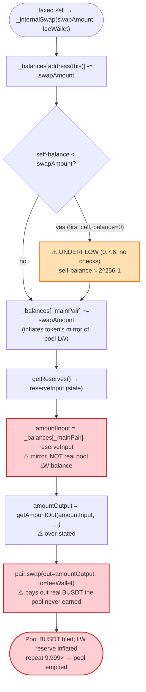

# LinkingTheWorld (LW) Exploit — `_internalSwap` Underflow Mints Infinite Self-Balance & Drains the Fee Pool

> **Reproduction:** the PoC compiles & runs in an isolated Foundry project at
> [this project folder](.) (the umbrella DeFiHackLabs repo contains many unrelated
> PoCs that do not compile together, so this one was extracted).
> Result summary trace: [output.txt](output.txt).
> Full single-swap `-vvvvv` trace (the 9,999-iteration loop produces a multi-GB
> trace, so a representative one-swap trace is captured instead):
> [trace_single_swap.txt](trace_single_swap.txt).
> Verified vulnerable source: [contracts_LW.sol](sources/DexToken_ABC6e5/contracts_LW.sol).

---

## Key info

| | |
|---|---|
| **Loss** | ~**7,395.94 BUSDT** (≈ $7.4K) drained from the LW/BUSDT PancakeSwap pool |
| **Vulnerable contract** | `DexToken` ("LinkingTheWorld" / `LW`) — [`0xABC6e5a63689b8542dbDC4b4f39a7e00d4AC30c8`](https://bscscan.com/address/0xABC6e5a63689b8542dbDC4b4f39a7e00d4AC30c8#code) |
| **Victim pool** | LW/BUSDT PancakeSwap V2 pair — `0x35886C6D74ACed4Ed0fbe0b851806278384D9A76` (the token's real `_mainPair`) |
| **Attacker EOA** | [`0x56b2d55457b31fb4b78ebddd6718ea2667804a06`](https://bscscan.com/address/0x56b2d55457b31fb4b78ebddd6718ea2667804a06) |
| **Attacker contract** | [`0xfe7e9c76affdba7b7442adaca9c7c059ec3092fc`](https://bscscan.com/address/0xfe7e9c76affdba7b7442adaca9c7c059ec3092fc) (deployed `Money` at `0x0496824589CD3758119F74560E4Fa970e6dff104`) |
| **Attack tx** | [`0x96a955304fed48a8fbfb1396ec7658e7dc42b7c140298b80ce4206df34f40e8d`](https://app.blocksec.com/explorer/tx/bsc/0x96a955304fed48a8fbfb1396ec7658e7dc42b7c140298b80ce4206df34f40e8d) |
| **Chain / block / date** | BSC / 40,287,544 / 2024-07-08 07:31 UTC |
| **Compiler** | Solidity **v0.7.6** (`+commit.7338295f`), optimizer **off**, 200 runs |
| **Bug class** | Unchecked-arithmetic underflow (pre-0.8) → infinite internal balance; AMM fee-swap that prices off the contract's *own* `_balances` mapping instead of real pool reserves |

---

## TL;DR

`DexToken` is a fee-on-transfer ("tax") token. On every taxed sell it converts part of the seller's
tokens into the pool's quote asset (BUSDT) by calling `pair.swap()` directly inside
`_internalSwap()` ([contracts_LW.sol:372-401](sources/DexToken_ABC6e5/contracts_LW.sol#L372-L401)).

Two design flaws compose into a critical bug:

1. **The token holds essentially `type(uint256).max` of itself.** `_internalSwap` does
   `_balances[address(this)] -= swapAmount` ([:374](sources/DexToken_ABC6e5/contracts_LW.sol#L374))
   on a 0.7.6 contract with **no overflow checks**. The contract's own balance starts at 0, so the
   *first* fee-swap underflows it to ≈ `~uint256(0)`. From then on the contract owns a near-infinite
   balance of `LW`. That balance is directly spendable through the standard `transferFrom`, with no
   allowance needed when the contract is the `sender`.

2. **The fee-swap prices the swap from the contract's own `_balances[_mainPair]`, not the pool's real
   reserves.** `_internalSwap` computes
   `amountInput = _balances[_mainPair] - reserveInput`
   ([:384](sources/DexToken_ABC6e5/contracts_LW.sol#L384)) and feeds it to PancakeSwap's
   `getAmountOut`. `_balances[_mainPair]` is the token contract's internal mirror of the pair's `LW`
   balance, which the contract keeps *inflating* (`_balances[_mainPair] += swapAmount`,
   [:375](sources/DexToken_ABC6e5/contracts_LW.sol#L375)) while the pair's *synced* `reserveInput`
   lags behind. The result is an over-stated `amountInput` → an over-stated BUSDT `amountOutput` →
   `pair.swap()` hands out real BUSDT that the pool never actually earned.

The attacker simply:

1. Pulls a colossal `LW` balance out of the contract via `LW.transferFrom(address(LW), attacker, 1e33)`
   — possible because the contract's self-balance is ≈ `MAX`.
2. **Sells `LW` into the LW/BUSDT pool 9,999 times** with
   `swapExactTokensForTokensSupportingFeeOnTransferTokens`. Each taxed sell fires `_internalSwap`
   twice (to the two marketing wallets), each call extracting mispriced BUSDT from the pool, and
   the seller's own router output is itself inflated by the broken accounting.
3. Forwards the accumulated BUSDT to the EOA.

The LW/BUSDT pool's BUSDT reserve is bled from **13,256.43 → 1.35 BUSDT** (drained to dust), while
its `LW` reserve balloons from **793.99M → 8.0 trillion**. The attacker walks away with **7,395.94
BUSDT** (and the two marketing wallets accidentally pocket the rest of the drained ~13,255 BUSDT).

---

## Background — what LinkingTheWorld / DexToken does

`DexToken` ([source](sources/DexToken_ABC6e5/contracts_LW.sol)) is a configurable BSC "tax token"
factory product (the comments are Chinese: 营销税 = marketing fee, 回流 = liquidity reflux, 销毁 = burn,
绑定 = referral binding). On the fork block the live parameters are:

| Parameter | Value | Meaning |
|---|---|---|
| `totalSupply` | 2,100,000,000 LW | 2.1B supply |
| `currency` | BUSDT (`0x55d3…7955`) | the pool's quote asset |
| `_mainPair` | `0x35886C…9A76` | the real LW/BUSDT PancakeSwap pair |
| `_sellFundFee` | 800 bps (8%) | marketing fee on sells |
| `_bondFundFee` | 1000 bps (10%) | referral fee (folded into marketing if no referrer) |
| `_sellLPFee` | 1500 bps (15%) | "liquidity" fee on sells |
| `_sellBurnFee` | 0 | no burn |
| `LPFeeAccountA` | `0x5aDc…D3ee` | marketing wallet A (gets `_internalSwap` #1) |
| `LPFeeAccountB` | `0x42D9…2caA` | marketing wallet B (gets `_internalSwap` #2) |
| `_feeWhiteList[address(this)]` | `true` | the token contract is fee-exempt |

When a non-whitelisted address **sells** LW (transfers LW *to* the pair), `_tokenTransfer` deducts the
8%+10% and 15% fees and, for each non-zero fee bucket, calls `_internalSwap()` to convert the fee LW
into BUSDT and forward it to the marketing wallets. That `_internalSwap` is where everything breaks.

> Note: the PoC source hard-codes a `Pair = 0x88fF4f…DE84` variable, but that pair is empty and never
> used — all swaps are routed through PancakeRouter, which resolves the path `LW → BUSDT` to the token's
> real `_mainPair` `0x35886C…9A76`. The trace confirms every `swap()` targets `0x35886C…9A76`.

---

## The vulnerable code

### 1. `transferFrom` lets `sender == address(this)` spend with no allowance

```solidity
function transferFrom(address sender, address recipient, uint256 amount) public override returns (bool) {
    _transfer(sender, recipient, amount);
    if (_allowances[sender][msg.sender] != MAX) {          // ← only decrements allowance if != MAX
        _allowances[sender][msg.sender] = _allowances[sender][msg.sender] - amount;
    }
    return true;
}
```

[contracts_LW.sol:240-252](sources/DexToken_ABC6e5/contracts_LW.sol#L240-L252). The attack calls
`LW.transferFrom(address(LW), attacker, 1e33)`. `_transfer` only checks `_balances[from] >= amount`
([:262](sources/DexToken_ABC6e5/contracts_LW.sol#L262)); the contract's self-balance is ≈ `MAX`, so it
passes and ships `1e33` LW to the attacker. (The allowance line is irrelevant — `address(this)` never
needed to approve anyone, and `_allowances[address(this)][...]` underflowing is harmless here.)

### 2. `_internalSwap` — the underflow + the mis-priced swap

```solidity
function _internalSwap(uint swapAmount, address account) private {
    // 完成转账
    _balances[address(this)] -= swapAmount;          // ⚠️ (1) UNDERFLOWS on first call (0 - x ≈ MAX)
    _balances[_mainPair]    += swapAmount;            // ⚠️ (2) inflates the token's mirror of pool LW

    (address token0, ) = PancakeLibrary.sortTokens(address(this), currency);
    (uint reserve0, uint reserve1, ) = IPancakePair(_mainPair).getReserves();
    (uint reserveInput, uint reserveOutput) = address(this) == token0
        ? (reserve0, reserve1)
        : (reserve1, reserve0);
    uint amountInput  = _balances[_mainPair] - reserveInput;  // ⚠️ (3) uses INTERNAL mirror, not real reserve
    uint amountOutput = PancakeLibrary.getAmountOut(amountInput, reserveInput, reserveOutput);
    (uint amount0Out, uint amount1Out) = address(this) == token0
        ? (uint(0), amountOutput)
        : (amountOutput, uint(0));
    IPancakePair(_mainPair).swap(amount0Out, amount1Out, account, new bytes(0)); // ⚠️ (4) pays out real BUSDT
}
```

[contracts_LW.sol:372-401](sources/DexToken_ABC6e5/contracts_LW.sol#L372-L401).

The contract is compiled with `pragma solidity ^0.7.6`
([:2](sources/DexToken_ABC6e5/contracts_LW.sol#L2)) — **pre-0.8, no built-in over/underflow checks**,
and `_internalSwap` uses raw `-`/`+` (not the `SafeMath` library that ships in
[PancakeLibrary.sol](sources/DexToken_ABC6e5/contracts_lib_PancakeLibrary.sol#L3-L15)). Line 374's
`_balances[address(this)] -= swapAmount` therefore wraps around the moment `swapAmount >
_balances[address(this)]`, which is true on the very first taxed sell because the contract holds 0 LW.

### 3. The fee dispatch that drives the two `_internalSwap` calls

```solidity
if ((takeFee && isSell) || isTransfer) {
    uint sellFundAmount = (tAmount * _sellFundFee) / BASE;   // 8%
    uint bondFundAmount = (tAmount * _bondFundFee) / BASE;   // 10%
    if (_bonding[tx.origin] != address(0)) { ... } else {
        sellFundAmount += bondFundAmount;                    // no referrer ⇒ 18% to marketing A
    }
    if (sellFundAmount > 0 && LPFeeAccountA != address(0)) {
        feeAmount += sellFundAmount;
        _internalSwap(sellFundAmount, LPFeeAccountA);         // ⚠️ call #1
    }
    uint sellLPAmount = (tAmount * _sellLPFee) / BASE;       // 15%
    if (sellLPAmount > 0 && LPFeeAccountB != address(0)) {
        feeAmount += sellLPAmount;
        _internalSwap(sellLPAmount, LPFeeAccountB);           // ⚠️ call #2
    }
    ...
}
```

[contracts_LW.sol:301-326](sources/DexToken_ABC6e5/contracts_LW.sol#L301-L326).

---

## Root cause — why it was possible

The bug is the combination of an **unchecked underflow** and an **AMM swap priced from the token's own
bookkeeping instead of the pool's reserves**:

1. **Unchecked underflow seeds an infinite self-balance.** Under Solidity 0.7.6, `_balances[address(this)] -= swapAmount`
   with a zero starting balance wraps to ≈ `2²⁵⁶−1`. After that, the contract "owns" essentially all
   the LW that can ever exist, and `transferFrom(address(this), …)` lets anyone pull it out (the
   `sender==address(this)` path needs no allowance).

2. **`_internalSwap` calls `pair.swap()` using a self-maintained `_balances[_mainPair]` mirror.** A
   correct fee-swap would (a) actually move LW into the pair, (b) read the pair's *real* token balance,
   or (c) route through the router which `skim`/`sync`s. Instead it computes
   `amountInput = _balances[_mainPair] - reserveInput`, where `_balances[_mainPair]` is incremented on
   every `_internalSwap` ([:375](sources/DexToken_ABC6e5/contracts_LW.sol#L375)) but the pair's
   `reserveInput` (from `getReserves()`) only updates lazily. The mirror drifts above the real reserve,
   so `amountInput` — and therefore the BUSDT paid out by `pair.swap()` — is systematically inflated.

3. **Repetition amplifies it.** Each of the 9,999 sells pushes more LW (the post-fee remainder) into
   the pair *and* runs two `_internalSwap` calls that each over-extract BUSDT. The pool's `LW` side
   grows without bound while its BUSDT side is steadily drained, and because `getAmountOut` is computed
   from the manipulated `amountInput`, the attacker's own router output is inflated too. The pool is
   bled to ~1 BUSDT.

In short: a tax token tried to be its own mini-router, did the arithmetic in an unchecked pre-0.8
context against a self-kept balance mirror, and that mirror — seeded by an underflow to `MAX` — let
the pool be priced and drained on the contract's terms rather than the pool's.

---

## Preconditions

- The token is deployed with non-zero sell fees and at least one marketing wallet set (so
  `_internalSwap` actually runs on sells). Here `_sellFundFee`+`_bondFundFee`=18% and `_sellLPFee`=15%.
- A live LW/BUSDT PancakeSwap pool with real BUSDT liquidity (here 13,256 BUSDT). This is the prize.
- The contract is pre-0.8 (`^0.7.6`) so `_balances[address(this)] -= swapAmount` underflows instead of
  reverting. No `SafeMath` is applied in `_internalSwap`.
- **No capital required.** The attacker pulls free LW from the contract via `transferFrom`, so the
  attack is self-funded; the only cost is gas for 9,999 swaps (gas used in the PoC: ~860M).

---

## Attack walkthrough (with on-chain numbers from the trace)

Pair `0x35886C…9A76`: `token0 = BUSDT (0x55d3…7955)`, `token1 = LW`, so **`reserve0 = BUSDT`,
`reserve1 = LW`**. All figures are read directly from the PoC run / `Sync` events
([trace_single_swap.txt](trace_single_swap.txt), [output.txt](output.txt)).

| # | Step | Pool BUSDT (reserve0) | Pool LW (reserve1) | Effect |
|---|------|----------------------:|-------------------:|--------|
| 0 | **Initial** | 13,256.43 | 793,993,204.46 | Honest pool. Contract's own LW balance ≈ `MAX`. |
| 1 | `transferFrom(address(LW), attacker, 1e33)` | 13,256.43 | 793,993,204.46 | Attacker now holds 1e15 LW for free (pulled from the contract's `MAX` self-balance). |
| 2 | **Sell #1** (`swap 8e26 LW → BUSDT`) — fires 2× `_internalSwap` (→ marketing A & B) then sends remainder to pair | ~9,887 | ~1,594M | Marketing A gets 2,030.8 BUSDT, Marketing B gets 1,270.4 BUSDT, attacker gets 3,342.0 BUSDT — all from over-stated `amountInput`. |
| … | **Sells #2 … #9,999** (each: 2× `_internalSwap` + attacker router output) | monotonically ↓ | monotonically ↑ | Each sell pushes the post-fee LW remainder into the pair (`reserve1` grows) and over-extracts BUSDT (`reserve0` shrinks). |
| N | **Final** (after 9,999 sells) | **1.35** | **7,999,993,993,204.46** | Pool BUSDT drained to dust; LW reserve inflated ~10,000×. |

After 5 sells the trend is already unmistakable (measured directly):

| Checkpoint | Pool BUSDT | `_balances[_mainPair]` (LW mirror) | Attacker BUSDT | Marketing A BUSDT | Marketing B BUSDT |
|---|---:|---:|---:|---:|---:|
| Before sells | 13,256.43 | 793,993,204.46 | 26.54 | 0.80 | 1.50 |
| After 5 sells | 2,204.54 | 4,793,993,204.46 | 5,987.53 | 3,061.84 | 2,031.37 |

The LW mirror climbs by exactly `5 × 8e8 = 4e9` (the per-sell LW that flows into the pair), confirming
the `_balances[_mainPair] += swapAmount` inflation that drives the mis-priced output.

### Profit / loss accounting (BUSDT)

| Party | Before | After | Δ (gained) |
|---|---:|---:|---:|
| **Attacker EOA** (PoC `address(this)`) | 0.00 | **7,395.94** | **+7,395.94** |
| Marketing wallet A (`0x5aDc…D3ee`) | 0.80 | 3,486.39 | +3,485.59 |
| Marketing wallet B (`0x42D9…2caA`) | 1.50 | 2,375.06 | +2,373.56 |
| **LW/BUSDT pool** (`0x35886C…9A76`) | 13,256.43 | **1.35** | **−13,255.08** |

The pool's entire ~13,255 BUSDT of liquidity is drained: ~7,396 to the attacker and the remainder
spilling into the two marketing wallets as an accidental side-effect of routing fees through the broken
`_internalSwap`. The PoC asserts the attacker's net: **7,395.94 BUSDT** (≈ the reported ~$7K loss).

---

## Diagrams

### Sequence of the attack



### Pool state evolution



### The flaw inside `_internalSwap`



---

## Remediation

1. **Upgrade past Solidity 0.8 (or apply `SafeMath`) for every balance arithmetic.** Checked
   arithmetic would have made `_balances[address(this)] -= swapAmount` revert instead of minting an
   infinite self-balance. This single change defuses the "free LW from the contract" primitive.
2. **Never price a fee-swap from the token's own `_balances` mirror.** `_internalSwap` must base
   `amountInput` on the pair's *actual* token balance change (e.g., move the fee LW into the pair and
   read `IERC20(LW).balanceOf(pair)` before/after) or, far simpler, route the conversion through the
   PancakeRouter (`swapExactTokensForTokensSupportingFeeOnTransferTokens`) which handles reserves and
   `sync` correctly. Using a self-maintained mirror that drifts from the real reserve is the core flaw.
3. **Reconcile the mirror with the pool, or drop it entirely.** If an internal balance mirror is kept,
   it must be `sync`'d with the pair on every interaction so it can never exceed the real reserve;
   otherwise `amountInput = mirror - reserveInput` is meaningless and exploitable.
4. **Disallow `transferFrom` where `sender == address(this)` without an explicit, scoped allowance.**
   The contract should never be a freely-spendable source of its own balance.
5. **Add a guard/reentrancy lock and per-tx fee-swap caps** so a single transaction cannot loop the
   fee-swap thousands of times and move the pool by more than a small percentage.

---

## How to reproduce

The PoC was extracted into a standalone Foundry project (the umbrella DeFiHackLabs repo has many
unrelated PoCs that fail to build together under `forge test`):

```bash
_shared/run_poc.sh 2024-07-LW_exp --mt testExploit -vvvvv
```

- RPC: a **BSC archive** endpoint is required (fork block 40,287,544). `foundry.toml` uses
  `https://bsc-mainnet.public.blastapi.io`, which serves historical state at that block. Public BSC RPCs
  that prune (or rate-limit, e.g. OnFinality `429`) fail to instantiate the fork.
- The test runs ~88 s because it performs the original **9,999-swap loop**. Using `-vvvvv` on that loop
  produces a multi-GB trace; for inspection use `-vv` (logs only) or see the captured one-swap trace in
  [trace_single_swap.txt](trace_single_swap.txt).
- Result: `[PASS] testExploit()` with attacker BUSDT `0 → 7,395.94`.

Expected tail (from [output.txt](output.txt)):

```
Ran 1 test for test/LW_exp.sol:Exploit
[PASS] testExploit() (gas: 860065122)
Logs:
  [Begin] Attacker BUSDT before exploit: 0.000000000000000000
  [End] Attacker BUSDT after exploit: 7395.941776647394103942
Suite result: ok. 1 passed; 0 failed; 0 skipped; finished in 87.59s
```

---

*Reference: SlowMist Hacked / DeFiHackLabs — LinkingTheWorld (LW), BSC, ~$7K. PoC tx
`0x96a955304fed48a8fbfb1396ec7658e7dc42b7c140298b80ce4206df34f40e8d`.*
