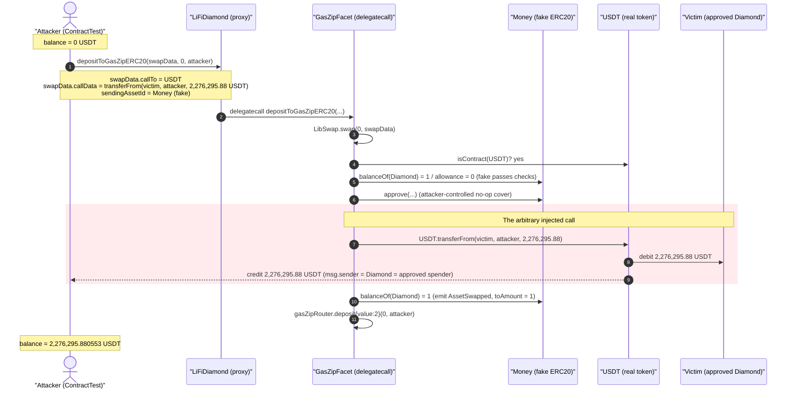
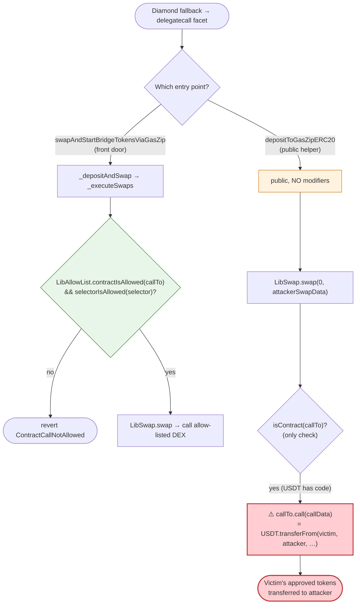
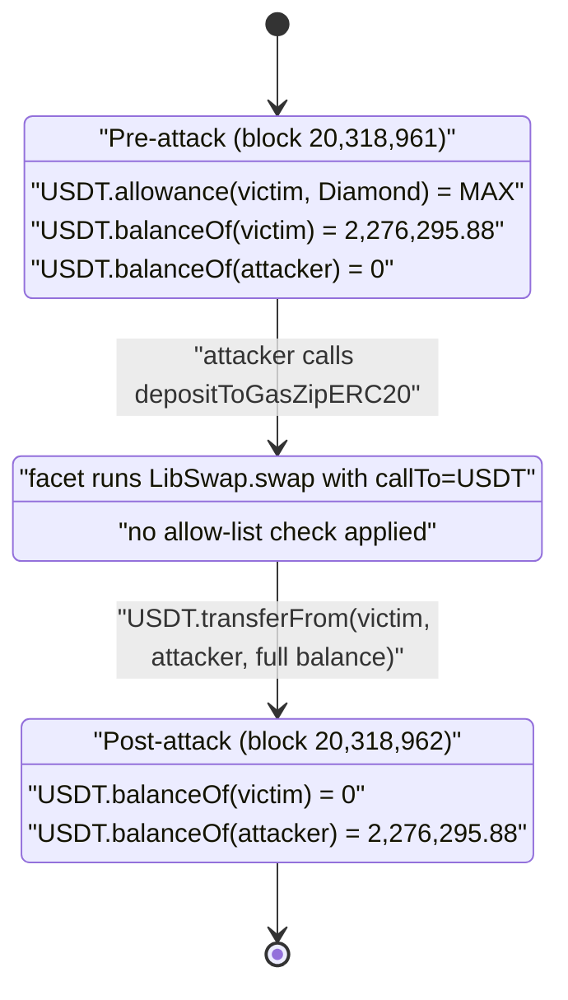

# LI.FI Protocol Exploit — Arbitrary External Call via Unvalidated `depositToGasZipERC20`

> **Reproduction:** the PoC compiles & runs in an isolated Foundry project at
> [this project folder](.) (the umbrella DeFiHackLabs repo contains many unrelated
> PoCs that fail to whole-compile, so this one was extracted).
> Full verbose trace: [output.txt](output.txt).
> Verified vulnerable source: [GasZipFacet.sol](sources/GasZipFacet_f28A35/src_Facets_GasZipFacet.sol)
> and [LibSwap.sol](sources/GasZipFacet_f28A35/src_Libraries_LibSwap.sol).

---

## Key info

| | |
|---|---|
| **Loss (whole incident)** | ~$10M across many approved wallets / multiple tokens |
| **Loss (this PoC, one victim)** | **2,276,295.880553 USDT** (~$2.28M) drained from a single approver |
| **Vulnerable contract** | `GasZipFacet` (LI.FI Diamond facet) — [`0xf28A352377663cA134bd27B582b1a9A4dad7e534`](https://etherscan.io/address/0xf28A352377663cA134bd27B582b1a9A4dad7e534#code) |
| **Entry proxy** | `LiFiDiamond` — [`0x1231DEB6f5749EF6cE6943a275A1D3E7486F4EaE`](https://etherscan.io/address/0x1231DEB6f5749EF6cE6943a275A1D3E7486F4EaE#code) |
| **Victim (this PoC)** | `0xABE45eA636df7Ac90Fb7D8d8C74a081b169F92eF` (held a max USDT approval to the Diamond) |
| **Attacker EOA** | [`0x8b3cb6bf982798fba233bca56749e22eec42dcf3`](https://etherscan.io/address/0x8b3cb6bf982798fba233bca56749e22eec42dcf3) |
| **Attack contract** | [`0x986aca5f2ca6b120f4361c519d7a49c5ac50c240`](https://etherscan.io/address/0x986aca5f2ca6b120f4361c519d7a49c5ac50c240) |
| **Attack tx** | [`0xd82fe84e63b1aa52e1ce540582ee0895ba4a71ec5e7a632a3faa1aff3e763873`](https://app.blocksec.com/explorer/tx/eth/0xd82fe84e63b1aa52e1ce540582ee0895ba4a71ec5e7a632a3faa1aff3e763873) |
| **Chain / fork block / date** | Ethereum mainnet / 20,318,962 / July 16, 2024 |
| **Compiler** | Solidity v0.8.17 (`+commit.8df45f5f`), optimizer 1,000,000 runs |
| **Bug class** | Arbitrary external call (unvalidated `callTo`/`callData`) → approval drain |

---

## TL;DR

LI.FI's `GasZipFacet.depositToGasZipERC20()` is a **`public`, unguarded** function that
forwards a fully attacker-controlled `LibSwap.SwapData` straight into
`LibSwap.swap()` ([GasZipFacet.sol:115-135](sources/GasZipFacet_f28A35/src_Facets_GasZipFacet.sol#L115-L135)).
Inside `LibSwap.swap()` the protocol performs

```solidity
(bool success, bytes memory res) = _swap.callTo.call{value: nativeValue}(_swap.callData);
```

with **no allow-list check** on `callTo`, `approveTo`, or the function selector
([LibSwap.sol:30-66](sources/GasZipFacet_f28A35/src_Libraries_LibSwap.sol#L30-L66)).
The only guard is `isContract(callTo)` — i.e. "the target has bytecode."

Every *other* swap entry point in the same codebase routes `callTo` through
`LibAllowList.contractIsAllowed(...)` + `selectorIsAllowed(...)` before executing the call
([SwapperV2.sol:242-249](sources/GasZipFacet_f28A35/src_Helpers_SwapperV2.sol#L242-L249)).
`depositToGasZipERC20` was wired to call `LibSwap.swap()` **directly, skipping that gate**.

Because the LiFiDiamond holds **infinite ERC-20 approvals** from countless users (it is a
canonical bridge/aggregator router), the attacker simply sets:

- `callTo = USDT`
- `callData = transferFrom(victim, attacker, victimBalance)`

and the Diamond — which *is* the spender on the victim's `approve` — executes the transfer,
moving the victim's entire USDT balance to the attacker. In this PoC the victim is
`0xABE45e…92eF`, who had a `type(uint256).max` USDT allowance to the Diamond and a balance of
**2,276,295.880553 USDT**, all of which is drained in one call. The live incident repeated this
across many approved wallets and tokens for ~$10M total.

---

## Background — what LI.FI / the GasZip facet does

LI.FI is a cross-chain bridge & DEX aggregator built on the **EIP-2535 Diamond** pattern. Users
grant the single Diamond address (`0x1231DEB6…F4EaE`) ERC-20 approvals; the Diamond's facets then
pull tokens and route them through whitelisted DEXes / bridges on the user's behalf. The trust
model rests entirely on the Diamond only ever calling **allow-listed** DEX contracts with
**allow-listed** selectors — so that a `transferFrom` of *your* tokens can only flow into a real
swap, never an arbitrary destination.

`GasZipFacet` ([source](sources/GasZipFacet_f28A35/src_Facets_GasZipFacet.sol)) is a small facet
added to let users swap an ERC-20 into native gas and deposit it into the gas.zip protocol. It
exposes three relevant functions:

- `startBridgeTokensViaGasZip` / `swapAndStartBridgeTokensViaGasZip` — the "front-door" flows.
  These carry the full stack of modifiers (`nonReentrant`, `validateBridgeData`, source-swap
  guards) and route swaps through `_depositAndSwap` → `_executeSwaps`, which **do** enforce the
  allow-list ([GasZipFacet.sol:46-108](sources/GasZipFacet_f28A35/src_Facets_GasZipFacet.sol#L46-L108)).
- `depositToGasZipERC20` — a helper "protocol step" meant to be chained as a `LibSwap.SwapData`
  inside a larger route. **This one has no modifiers and calls `LibSwap.swap` directly**
  ([GasZipFacet.sol:115-135](sources/GasZipFacet_f28A35/src_Facets_GasZipFacet.sol#L115-L135)).

The facet is reached through the Diamond's `fallback`, which `delegatecall`s the facet code into
the Diamond's storage/context — so when `LibSwap.swap` does `callTo.call(...)`, **`msg.sender` of
that call is the Diamond itself**, which is exactly the address users approved.

---

## The vulnerable code

### 1. The unguarded public entry point

[`GasZipFacet.sol:115-135`](sources/GasZipFacet_f28A35/src_Facets_GasZipFacet.sol#L115-L135):

```solidity
function depositToGasZipERC20(
    LibSwap.SwapData calldata _swapData,
    uint256 _destinationChains,
    address _recipient
) public {                                    // ← public, NO access control, NO nonReentrant,
                                              //   NO validateBridgeData, NO allow-list check
    uint256 currentNativeBalance = address(this).balance;

    // execute the swapData that swaps the ERC20 token into native
    LibSwap.swap(0, _swapData);               // ← attacker-controlled SwapData → arbitrary call

    uint256 swapOutputAmount = address(this).balance - currentNativeBalance;
    gasZipRouter.deposit{ value: swapOutputAmount }(_destinationChains, _recipient);
}
```

### 2. The arbitrary low-level call with no allow-list

[`LibSwap.sol:30-66`](sources/GasZipFacet_f28A35/src_Libraries_LibSwap.sol#L30-L66):

```solidity
function swap(bytes32 transactionId, SwapData calldata _swap) internal {
    if (!LibAsset.isContract(_swap.callTo)) revert InvalidContract();   // ← ONLY guard: "has code"
    uint256 fromAmount = _swap.fromAmount;
    if (fromAmount == 0) revert NoSwapFromZeroBalance();
    ...
    // solhint-disable-next-line avoid-low-level-calls
    (bool success, bytes memory res) = _swap.callTo.call{          // ⚠️ attacker-chosen target
        value: nativeValue
    }(_swap.callData);                                             // ⚠️ attacker-chosen calldata
    if (!success) {
        LibUtil.revertWith(res);
    }
    ...
}
```

### 3. What every *other* swap path does — and this one skips

[`SwapperV2.sol:242-251`](sources/GasZipFacet_f28A35/src_Helpers_SwapperV2.sol#L242-L251):

```solidity
if (
    !((LibAsset.isNativeAsset(currentSwap.sendingAssetId) ||
        LibAllowList.contractIsAllowed(currentSwap.approveTo)) &&
        LibAllowList.contractIsAllowed(currentSwap.callTo) &&        // ← whitelist on target
        LibAllowList.selectorIsAllowed(
            bytes4(currentSwap.callData[:4])                         // ← whitelist on selector
        ))
) revert ContractCallNotAllowed();

LibSwap.swap(_transactionId, currentSwap);                          // only reached if allowed
```

`depositToGasZipERC20` never runs this `ContractCallNotAllowed` check — it jumps straight to
`LibSwap.swap`.

---

## Root cause — why it was possible

The LI.FI Diamond holds open ERC-20 allowances from a huge number of users. Its entire safety
argument is: **"the only thing the Diamond will ever do with your tokens is call an allow-listed
DEX with an allow-listed selector."** That invariant is enforced in `SwapperV2._executeSwaps`
(`LibAllowList.contractIsAllowed` + `selectorIsAllowed`).

`GasZipFacet.depositToGasZipERC20` breaks the invariant in the most direct way possible:

1. **It is `public` with no modifiers.** No `onlyOwner`/keeper, no `nonReentrant`, no
   `validateBridgeData`. Anyone can call it directly through the Diamond's fallback.
2. **It calls `LibSwap.swap` directly, bypassing the allow-list.** `LibSwap.swap` itself contains
   *no* allow-list logic — that logic lives only in `SwapperV2`. So routing through `LibSwap.swap`
   without the `SwapperV2` wrapper means there is *zero* validation of `callTo`/`callData`.
3. **The only check is `isContract(callTo)`** ([LibAsset.sol:169-175](sources/GasZipFacet_f28A35/src_Libraries_LibAsset.sol#L169-L175)),
   which any real token (e.g. USDT) trivially satisfies.
4. **The Diamond `delegatecall`s the facet**, so the arbitrary `call` is issued with the
   Diamond as `msg.sender` — i.e. the exact address users approved.

Composing these: an attacker crafts a `SwapData` whose `callTo` is a token (USDT) and whose
`callData` is `transferFrom(victim, attacker, amount)`. The Diamond dutifully executes it, and
because the victim approved the Diamond, the transfer succeeds. The "swap" is a pure token theft.

A secondary detail makes the PoC self-consistent: `LibSwap.swap` reads
`fromAmount`/`sendingAssetId` and, for the non-native branch, calls
`LibAsset.maxApproveERC20(sendingAssetId, approveTo, fromAmount)` and a balance check before the
call. The attacker sidesteps these by using a **fake `sendingAssetId`** — a tiny attacker-deployed
`Money` contract whose `balanceOf` returns `1`, `allowance` returns `0`, and `approve` returns
`true`. That makes the pre-call accounting (`fromAmount = 1`, balance ≥ 1) pass while the *real*
value is moved by the injected USDT `transferFrom`.

---

## Preconditions

- A victim with a **non-zero ERC-20 allowance to the LiFiDiamond** and a non-zero balance of that
  token. Confirmed on-chain at the pre-attack block 20,318,961:
  - `USDT.allowance(victim, Diamond) = type(uint256).max` (infinite approval)
  - `USDT.balanceOf(victim) = 2,276,295.880553 USDT` (fully drained)
- The `GasZipFacet` is registered in the Diamond's selector → facet map for
  `depositToGasZipERC20(...)` (it was, this facet had just been added).
- No capital required from the attacker: this is a pure approval drain, not a market/flash-loan
  attack. The attack pays trivial dust (`{value:1}`) to satisfy bookkeeping paths.

---

## Step-by-step attack walkthrough (with on-chain numbers from the trace)

All figures are taken directly from [output.txt](output.txt). The PoC's `ContractTest`
(the attack contract) deploys two helper contracts, `Money` (a fake ERC-20 used as the
`sendingAssetId`/`receivingAssetId`) and `Help` (a tiny ether-forwarder), then calls the Diamond.

| # | Action | Contract / line | Concrete values |
|---|--------|-----------------|-----------------|
| 0 | Attacker starts with **0 USDT** | [trace L6](output.txt) | `[Begin] Attacker USDT before exploit: 0.000000` |
| 1 | Call Diamond `depositToGasZipERC20(swapData, 0, attacker)` via fallback | [trace L33-34](output.txt) | `callTo = USDT`, `sendingAssetId = receivingAssetId = Money`, `fromAmount = 1`, `callData = 0x23b872dd…` |
| 2 | Diamond `delegatecall`s `GasZipFacet.depositToGasZipERC20` | [trace L34](output.txt) | facet `0xf28A35…` runs in Diamond context |
| 3 | `LibSwap.swap`: `isContract(USDT)` ✓; reads fake `Money.balanceOf(Diamond)=1`, `allowance=0` | [trace L35-40](output.txt) | passes the "has code / balance ≥ 1" gates |
| 4 | `maxApproveERC20(Money, approveTo, 1)` → `Money.approve(...)` (attacker-controlled) | [trace L41-59](output.txt) | `Money.approve` deploys `Help` and forwards `{value:1}` to the Diamond — a no-op cover step |
| 5 | **The injected call:** `USDT.transferFrom(victim, attacker, 2_276_295_880_553)` | [trace L81-86](output.txt) | `emit Transfer(victim → attacker, 2,276,295.880553 USDT)` |
| 6 | Facet finishes: `Money.balanceOf(Diamond)=1` again, emits `AssetSwapped`, `gasZipRouter.deposit{value:2}(0, attacker)` | [trace L87-92](output.txt) | the "swap" reports `toAmount = 1`; 2 wei deposited to gas.zip as cover |
| 7 | Attacker ends with the victim's full balance | [trace L95-99](output.txt) | `[End] Attacker USDT after exploit: 2,276,295.880553` |

The decisive line is step 5: the Diamond, acting as the approved spender, executes
`transferFrom(victim, attacker, …)` purely because the attacker supplied that calldata.

### Profit / loss accounting (this PoC)

| Party | Before | After | Δ |
|---|---:|---:|---:|
| Attacker USDT | 0.000000 | 2,276,295.880553 | **+2,276,295.880553** |
| Victim `0xABE45e…92eF` USDT | 2,276,295.880553 | 0 | **−2,276,295.880553** |
| Attacker capital spent | — | — | ~3 wei native (dust cover) |

Net attacker profit ≈ **$2.28M** from this single victim. The real-world incident chained the same
call against many approved wallets/tokens for **~$10M** total.

---

## Diagrams

### Sequence of the attack



### Why the call is unguarded — control flow vs. the safe path



### State evolution (victim approval → drain)



---

## Remediation

1. **Enforce the allow-list on every path that reaches `LibSwap.swap`.** The check that lives in
   `SwapperV2._executeSwaps` (`LibAllowList.contractIsAllowed(callTo)` + `selectorIsAllowed`) must
   gate `depositToGasZipERC20` too. The cleanest fix is to make `depositToGasZipERC20` route its
   swap through `_depositAndSwap`/`_executeSwaps` instead of calling `LibSwap.swap` directly — this
   is exactly what LI.FI's hotfix did.
2. **Bake the allow-list into `LibSwap.swap` itself.** Since `LibSwap.swap` is the single chokepoint
   that performs the arbitrary `callTo.call`, the validation belongs there (or in a wrapper that all
   callers are forced to use), so no future facet can re-introduce the same gap by calling it
   directly.
3. **Restrict who can invoke `depositToGasZipERC20`.** As a defense-in-depth measure, mark it
   `external` and add the standard facet modifiers (`nonReentrant`, validation) rather than leaving
   it bare `public`.
4. **Never let user-supplied `callTo`/`callData` reach a token's `transferFrom`.** Reject calldata
   whose selector is `transferFrom`/`transfer`/`approve` against any asset the Diamond is approved
   for, and require `callTo == sendingAssetId` only for known token-handling primitives.
5. **Minimize standing approvals.** Users and integrations should grant exact-amount, per-route
   approvals (or use permit-style pull) rather than infinite approvals to an aggregator Diamond, so
   a single facet bug cannot drain an entire balance.

---

## How to reproduce

The PoC was extracted into a standalone Foundry project (the umbrella DeFiHackLabs repo has many
unrelated PoCs that fail to compile under a single `forge test` build):

```bash
_shared/run_poc.sh 2024-07-Lifiprotocol_exp -vvvvv
```

- RPC: an **Ethereum mainnet archive** endpoint is required (fork block 20,318,962). `foundry.toml`
  uses `https://eth.drpc.org`, which serves historical state at that block. The Infura archive
  endpoints intermittently returned `-32603 Internal error` for the Aave account read at this block;
  drpc was used as the working fallback.
- Result: `[PASS] testExpolit()` with the attacker's USDT going `0 → 2,276,295.880553`.

Expected tail ([output.txt](output.txt)):

```
Logs:
  [Begin] Attacker USDT before exploit: 0.000000
  [End] Attacker USDT after exploit: 2276295.880553

Ran 1 test for test/Lifiprotocol_exp.sol:ContractTest
[PASS] testExpolit() (gas: 5913114)
Suite result: ok. 1 passed; 0 failed; 0 skipped
```

---

*References: blocksec explorer tx
`0xd82fe84e63b1aa52e1ce540582ee0895ba4a71ec5e7a632a3faa1aff3e763873`;
@danielvf thread https://x.com/danielvf/status/1505689981385334784;
LI.FI July 2024 incident (~$10M).*
