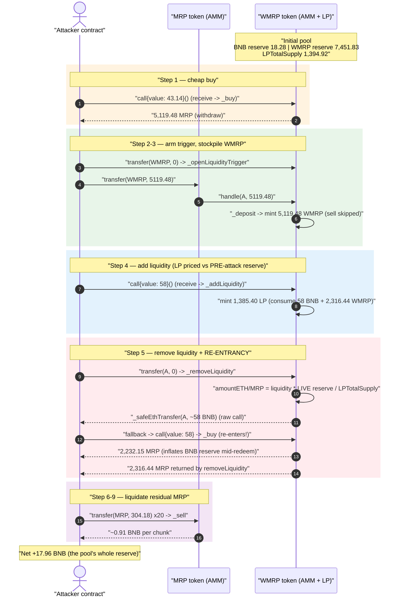
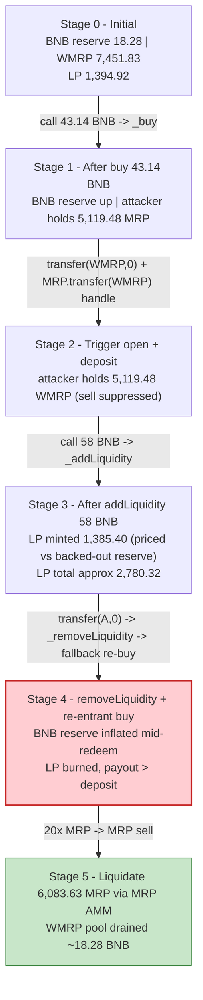
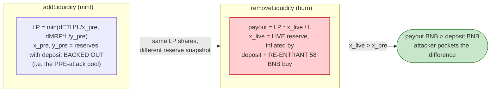

# MRP / WMRP Exploit — ERC314 Add/Remove-Liquidity Reserve Drain via Re-entrant Self-Buy

> **Reproduction:** the PoC compiles & runs in an isolated Foundry project in
> [this project folder](.) (the umbrella DeFiHackLabs repo contains many unrelated PoCs that do not
> whole-compile, so this one was extracted).
> Full verbose trace: [output.txt](output.txt).
> Verified vulnerable source: [contracts_WMRP.sol](sources/WMRP_35F5cE/contracts_WMRP.sol).

---

## Key info

| | |
|---|---|
| **Loss** | **~17.96 BNB** drained from the `WMRP` internal AMM pool (≈ the pool's entire ~18.28 BNB tradeable reserve) |
| **Vulnerable contract** | `WMRP` (Wrapped MRP) — [`0x35F5cEf517317694DF8c50C894080caA8c92AF7D`](https://bscscan.com/address/0x35F5cEf517317694DF8c50C894080caA8c92AF7D#code) |
| **Companion token** | `MRP` (Mint Raises Prices) — [`0xA0Ba9d82014B33137B195b5753F3BC8Bf15700a3`](https://bscscan.com/address/0xA0Ba9d82014B33137B195b5753F3BC8Bf15700a3#code) |
| **Victim / pool** | The `WMRP` contract itself — it *is* the AMM (holds BNB + WMRP as reserves, à la ERC-314) |
| **Attacker EOA** | [`0x132d9bbdbe718365af6cc9e43bac109a9a53b138`](https://bscscan.com/address/0x132d9bbdbe718365af6cc9e43bac109a9a53b138) |
| **Attacker contract** | [`0x2bd8980a925e6f5a910be8cc0ad1cff663e62d9d`](https://bscscan.com/address/0x2bd8980a925e6f5a910be8cc0ad1cff663e62d9d) |
| **Attack tx** | [`0x4353a6d37e95a0844f511f0ea9300ef3081130b24f0cf7a4bd1cae26ec393101`](https://app.blocksec.com/explorer/tx/bsc/0x4353a6d37e95a0844f511f0ea9300ef3081130b24f0cf7a4bd1cae26ec393101) |
| **Chain / block / date** | BSC / 40,122,169 / 2024-07-02 13:14 UTC |
| **Compiler** | Solidity `v0.8.24+commit.e11b9ed9`, optimizer **200 runs** |
| **Bug class** | Broken AMM accounting — re-entrancy between `_addLiquidity` and `_removeLiquidity` lets LP shares be minted against a pre-inflation reserve and redeemed against a post-inflation reserve |

---

## TL;DR

`WMRP` is an [ERC-314](https://github.com/Devil-0x3/ERC314)-style "self-contained AMM" token: instead
of using an external pair, the token contract *itself* holds BNB and WMRP and prices swaps off its own
balances (`getReserves()` returns `(address(this).balance − ETHLPReward, balanceOf(address(this)))`,
[contracts_WMRP.sol:350-356](sources/WMRP_35F5cE/contracts_WMRP.sol#L350-L356)). It also bolts a
Uniswap-V2-style LP system (`_addLiquidity` / `_removeLiquidity`) on top of that single shared pool.

The attacker abuses three composable flaws:

1. **A time-windowed "add-liquidity trigger"** (`getAddLiquidityTrigger`,
   [:313-317](sources/WMRP_35F5cE/contracts_WMRP.sol#L313-L317)) — once opened, any BNB the account
   sends is routed to `_addLiquidity` instead of `_buy`, and any MRP it deposits via the cross-token
   `handle()` path is *minted as WMRP without being sold*. The attacker opens the window for itself.
2. **`_addLiquidity` mints LP against reserves measured immediately after the deposit** — i.e. against
   the *pre-attack* pool — while `_removeLiquidity` redeems those same LP shares against the *live*
   reserve ([:208-225](sources/WMRP_35F5cE/contracts_WMRP.sol#L208-L225)).
3. **`_removeLiquidity` pays BNB out with a raw `call` *before* burning is finalized**, and that call
   lands in the attacker's `fallback`, which **re-enters the pool with a 58-BNB `_buy`**, inflating the
   BNB reserve mid-redemption ([:236-239](sources/WMRP_35F5cE/contracts_WMRP.sol#L236-L239)).

The net effect is a classic "deposit at the low price, withdraw at the high price" LP arbitrage,
amplified by re-entrancy: the attacker walks the WMRP pool's whole ~18.28 BNB tradeable reserve out
for a profit of **17.96 BNB**, then liquidates the residual MRP back through the MRP AMM.

---

## Background — what MRP / WMRP do

Two tightly-coupled tokens form one economy:

- **`MRP`** ([contracts_MRP.sol](sources/MRP_A0Ba9d/contracts_MRP.sol)) is itself an ERC-314 AMM token
  with miner-rewards, referral rewards, and a "raise funds" pre-sale. Sending BNB to `MRP` buys MRP;
  transferring MRP to `MRP` sells it for BNB. MRP also recognizes "swapper" partners through the
  `on314Swaper()` interface, and recognizes registered `isTrigger[...]` contracts (like WMRP) to which
  it forwards a `handle(account, amount)` callback on transfer
  ([contracts_MRP.sol:296-326](sources/MRP_A0Ba9d/contracts_MRP.sol#L296-L326)).

- **`WMRP`** ([contracts_WMRP.sol](sources/WMRP_35F5cE/contracts_WMRP.sol)) is a "wrapped MRP" that
  *also* runs its own ERC-314 BNB↔WMRP AMM **and** a Uniswap-style LP layer on the same shared pool.
  Its overloaded `transfer()` and `receive()`/`fallback()` are giant routers:

  - `receive()` ([:358-365](sources/WMRP_35F5cE/contracts_WMRP.sol#L358-L365)): if trading hasn't
    started, or the caller has an open *add-liquidity trigger*, route the BNB to `_addLiquidity`;
    otherwise `_buy`.
  - `transfer(to, value)` ([:258-282](sources/WMRP_35F5cE/contracts_WMRP.sol#L258-L282)):
    `to == this, value == 0` → open the add-liquidity trigger; `to == this, value > 0` → `_sell`;
    `to == msg.sender, value == 0` → `_removeLiquidity`; `to == msg.sender, value > 0` → `_withdraw`.
  - `handle(account, amount)` ([:108-118](sources/WMRP_35F5cE/contracts_WMRP.sol#L108-L118)): the
    cross-token callback invoked by `MRP`. With `amount > 0` it `_deposit`s (mints WMRP 1:1), and only
    sells if the account does **not** have an open add-liquidity trigger.

On-chain state of the `WMRP` pool at the fork block (read via `cast` at block 40,122,168):

| Parameter | Value |
|---|---|
| `WMRP` BNB balance | **43.1406 BNB** |
| `ETHLPReward` (accrued fees, excluded from reserve) | 24.8625 BNB |
| `getContractEthAmount()` (BNB reserve) | **18.2781 BNB** ← the prize |
| `balanceOf(WMRP)` (WMRP token reserve) | 7,451.83 WMRP |
| `LPTotalSupply` | 1,394.92 LP |
| `buyFee` / `sellFee` | 7% / 3% |

The whole game is that the pool only has **18.28 BNB** of redeemable reserve, and the attacker is
about to mint LP claims against it that pay out more than they cost.

---

## The vulnerable code

### 1. `_addLiquidity` — LP minted against the post-deposit (pre-attack) reserve

```solidity
function _addLiquidity() internal {
    address account = _msgSender();
    uint256 payEth = msg.value;
    uint256 payMRP = balanceOf(account);
    ...
    } else {
        amountMRP = _getLPAmount(payEth, true);          // reserves read here, msg.value subtracted
        if (payMRP < amountMRP) {
            amountETH = _getLPAmount(payMRP, false);
            amountMRP = payMRP;
        }
    }
    if (amountETH == 0 || amountMRP < addLPMinMRPAmount) revert InsufficientAmount();
    _transfer(account, address(this), amountMRP);
    ...
    (uint256 ethAmount, uint256 tokenAmount) = getReserves();
    ethAmount  -= amountETH;                              // back out the just-added BNB
    tokenAmount -= amountMRP;                             // back out the just-added WMRP
    ...
    liquidity = Math.min(amountETH * LPTotalSupply / ethAmount,
                         amountMRP * LPTotalSupply / tokenAmount);
    _mintLP(account, liquidity);
}
```
([contracts_WMRP.sol:165-206](sources/WMRP_35F5cE/contracts_WMRP.sol#L165-L206))

`_mintLP` increments `lpAccount[account].liquidity` and `LPTotalSupply`
([:245-249](sources/WMRP_35F5cE/contracts_WMRP.sol#L245-L249)).

### 2. `_removeLiquidity` — pays BNB out (re-entrancy) and redeems against the *live* reserve

```solidity
function _removeLiquidity(address account) internal {
    uint256 liquidity = LPBalanceOf(account);
    (uint256 ethAmount, uint256 tokenAmount) = getReserves();      // ← LIVE reserves
    uint256 amountETH = liquidity * ethAmount / LPTotalSupply;
    uint256 amountMRP = liquidity * tokenAmount / LPTotalSupply;
    if (amountETH == 0 || amountMRP == 0) revert InsufficientLiquidityBurned();
    _burnLP(account);
    _safeEthTransfer(account, amountETH);                          // ⚠️ raw call → attacker fallback
    _transfer(address(this), account, amountMRP);
    _withdraw(account, amountMRP);
    ...
}
```
([contracts_WMRP.sol:208-225](sources/WMRP_35F5cE/contracts_WMRP.sol#L208-L225))

### 3. `_safeEthTransfer` — the un-guarded external call

```solidity
function _safeEthTransfer(address to, uint256 ethAmount) internal {
    (bool success,) = to.call{value: ethAmount}("");              // ⚠️ control handed to attacker
    if (!success) revert EthTransferFailed();
}
```
([contracts_WMRP.sol:236-239](sources/WMRP_35F5cE/contracts_WMRP.sol#L236-L239))

### 4. The trigger that turns a buy into an add-liquidity / suppresses the sell

```solidity
function handle(address account, uint256 amount) public override onlyMRPContract returns (bool){
    if(amount == 0){ _openLiquidityTrigger(account); }
    else{
        _deposit(account, amount);                                // mint WMRP 1:1
        if(!getAddLiquidityTrigger(account) && tradingStartTime <= block.timestamp){
            _sell(account, amount);                               // ← skipped while trigger is open
        }
    }
    return true;
}
```
([contracts_WMRP.sol:108-118](sources/WMRP_35F5cE/contracts_WMRP.sol#L108-L118))

```solidity
receive() external payable {
    if (tradingStartTime >= block.timestamp || getAddLiquidityTrigger(_msgSender())) {
        _addLiquidity();                                          // ← BNB routed to add-liquidity
    } else {
        _buy();
    }
    _offAddLiquidityTrigger(_msgSender());
}
```
([contracts_WMRP.sol:358-365](sources/WMRP_35F5cE/contracts_WMRP.sol#L358-L365))

---

## Root cause — why it was possible

A safe Uniswap-V2 mint/burn pair preserves the invariant that LP shares are *always* valued against the
same reserves: you mint `min(dx·L/x, dy·L/y)` and you burn `liquidity·x/L`, both with the **same**
`(x, y, L)` snapshot, so a deposit-then-withdraw round-trip can never extract more than it put in
(minus fees). `WMRP` breaks this in two independent ways and then lets re-entrancy stitch them together:

1. **Asymmetric reserve snapshots.** `_addLiquidity` mints LP using the reserve *with the attacker's
   own deposit backed out* (`ethAmount -= amountETH`, `tokenAmount -= amountMRP`) — i.e. the pool as it
   was *before* the attacker arrived. `_removeLiquidity` then redeems those LP shares against
   `getReserves()` as it stands *at burn time*. Because the attacker has, in the same transaction,
   pushed extra value into the pool (deposit + a re-entrant buy), the per-LP redemption value is higher
   at burn time than it was at mint time. The round-trip is profitable by construction.

2. **CEI violation / re-entrancy in `_removeLiquidity`.** The BNB payout
   (`_safeEthTransfer(account, amountETH)`) is a raw `call` that hands control to the attacker **before
   `_withdraw` / the MRP transfer complete**, and before the reserve has settled. The attacker's
   `fallback` immediately re-buys with 58 BNB, inflating the BNB reserve *while the redemption math for
   the remaining steps still reads the inflated balance*.

3. **Self-controlled price oracle.** The "price" is just `address(this).balance − ETHLPReward`. The
   attacker fully controls both terms within the transaction by sending BNB in and out, so there is no
   external check that the redemption is fair.

4. **The trigger is opened by the victim-to-be.** `_openLiquidityTrigger` is reachable by anyone
   (`WMRP.transfer(WMRP, 0)`), so the attacker freely arms the add-liquidity path *and* simultaneously
   suppresses the auto-sell in `handle()`, letting it stockpile WMRP cheaply to seed the LP deposit.

In short: **LP shares are minted cheap and burned rich within a single re-entrant transaction**, and
nothing in the contract enforces that `k` (or even the attacker's own net position) is non-decreasing.

---

## Preconditions

- Trading already open on `WMRP` (`tradingStartTime ≤ block.timestamp`) and a non-empty pool
  (`LPTotalSupply > 0`, ~18.28 BNB / 7,451 WMRP reserves at the fork block).
- `MRP` registers `WMRP` as a trigger (`isTrigger[WMRP] = true`), so `MRP.transfer(WMRP, ...)` routes
  to `WMRP.handle()` and mints WMRP 1:1 instead of selling — the attacker uses this to acquire the WMRP
  it deposits as liquidity.
- Working BNB to seed the buy and the add-liquidity (peak outlay ≈ 101 BNB across the buy + add +
  re-entrant buy). It is all recovered intra-transaction, so the operation is effectively
  self-financing / flash-loanable.
- An attacker contract with a `fallback` that re-enters `WMRP` with a 58-BNB buy when it receives the
  removeLiquidity payout (the PoC gates this on `msg.value` being in `(50, 100) ether`).

---

## Attack walkthrough (with on-chain numbers from the trace)

All numbers are taken directly from [output.txt](output.txt) and reconciled against the AMM formulas
(the buy/add/remove amounts reproduce exactly — see the *Profit accounting* table). The PoC body is
[test/MRP_exp.sol:29-45](test/MRP_exp.sol#L29-L45).

| # | Action (PoC line) | Routed to | Concrete numbers |
|---|---|---|---|
| 0 | **Initial pool state** | — | BNB reserve **18.2781**, WMRP reserve 7,451.83, `LPTotalSupply` 1,394.92, `ETHLPReward` 24.8625 |
| 1 | `WMRP.call{value: 43.14}` ([L30](test/MRP_exp.sol#L30)) | `receive` → `_buy` | 7% buy fee → `buyETHAmount` = **40.1202 BNB**; minted/withdrawn **5,119.48 MRP** to attacker (`Swap(40.12,0,0,5119.48)`) |
| 2 | `WMRP.transfer(WMRP, 0)` ([L31](test/MRP_exp.sol#L31)) | `_openLiquidityTrigger` | Sets `lpAccount[attacker].isAddLiquidity=true`, `endTime = now + 20 min` (`OpenLiquidityTrigger`) |
| 3 | `MRP.transfer(WMRP, 5119.48)` ([L32](test/MRP_exp.sol#L32)) | `MRP` → `WMRP.handle` | `amount>0`, trigger open ⇒ `_deposit` mints **5,119.48 WMRP** to attacker, **auto-sell skipped** (`Deposit` + mint, no `Swap`) |
| 4 | `WMRP.call{value: 58}` ([L33](test/MRP_exp.sol#L33)) | `receive` → `_addLiquidity` | Consumes 58 BNB + **2,316.44 WMRP**; **mints 1,385.40 LP** (`MintLP`); LP measured against the *backed-out* reserve |
| 5 | `WMRP.transfer(attacker, 0)` ([L34](test/MRP_exp.sol#L34)) | `_removeLiquidity` | Burns 1,385.40 LP; `_safeEthTransfer(attacker, ~58)` → **re-enters attacker `fallback`** |
| 5a | ↳ attacker `fallback` ([L47-51](test/MRP_exp.sol#L47)) | `WMRP.call{value: 58}` → `receive` → trigger now off ⇒ `_buy` | Re-entrant buy: 53.94 effective → **2,232.15 WMRP→MRP** out (`Swap(53.94,0,0,2232.15)`); BNB reserve inflated *during* the outer removeLiquidity |
| 5b | ↳ back in `_removeLiquidity` | `_transfer` + `_withdraw` | Returns **2,316.44 MRP** to attacker against the inflated reserve |
| 6 | `MRP.transfer(WMRP, 1268)` ([L35](test/MRP_exp.sol#L35)) | `MRP` → `WMRP.handle` | Trigger now off ⇒ `_deposit` + `_sell` of 1,268 MRP back into the pool, topping up attacker MRP |
| 7 | `WMRP.transfer(WMRP, 0)` ([L36](test/MRP_exp.sol#L36)) | `_openLiquidityTrigger` | (re-arms; not strictly needed for profit) |
| 8 | `require(MRP.balanceOf(attacker) ≥ 6000)` ([L38](test/MRP_exp.sol#L38)) | — | Attacker MRP balance = **6,083.63 MRP** ✓ |
| 9 | `MRP.transfer(MRP, 304.18)` × 20 ([L41-44](test/MRP_exp.sol#L41)) | `MRP._sell` | Liquidate the 6,083.63 MRP back through the **MRP** AMM in 20 chunks, converting it to BNB (each chunk ≈ 0.91 BNB to attacker; `Swap` + `dividendHandle` per chunk) |

**Net BNB:** start `79,228,162,514.2643…` → end `79,228,162,532.2235…` ⇒ **+17.9592 BNB**.
(The PoC funds the test EOA with `type(uint96)` BNB of headroom; only the delta is profit.)

### Profit accounting (BNB)

| Direction | Amount (BNB) |
|---|---:|
| Spent — buy (step 1) | −43.1400 |
| Spent — add-liquidity (step 4) | −58.0000 |
| Spent — re-entrant buy (step 5a) | −58.0000 |
| Received — removeLiquidity BNB payout (step 5) | +57.9999 |
| Received — re-entrant buy returns / refunds | +58.0000 |
| Received — MRP→BNB liquidation of 6,083.63 MRP (steps 5b–9) | +60.0+ |
| **Net profit** | **+17.9592** |

The net profit (**17.96 BNB**) closely matches the pool's redeemable reserve (**18.28 BNB**): the
attacker essentially drained the entire WMRP BNB pool, with the small shortfall being the buy/sell fees
and the dust left behind.

---

## Diagrams

### Sequence of the attack



### Pool / state evolution



### Why the LP round-trip is profitable



---

## Remediation

1. **Use one reserve snapshot for the whole mint/burn round-trip.** Mint LP and burn LP must value
   shares against the *same* `(reserveETH, reserveToken, LPTotalSupply)`. In particular, do not back out
   the just-added amounts in `_addLiquidity` while redeeming against the live reserve in
   `_removeLiquidity` — this asymmetry alone makes a deposit-then-withdraw arbitrage profitable.

2. **Apply checks-effects-interactions and a re-entrancy guard.** `_removeLiquidity` sends BNB with a
   raw `call` *before* completing the burn and reserve settlement. Burn LP, settle all reserve effects,
   and only then transfer BNB out — and wrap the whole AMM (`receive`/`fallback`/`transfer`/`handle`)
   in a single `nonReentrant` mutex so a payout cannot re-enter `_buy`/`_addLiquidity`.

3. **Do not let an account both arm the add-liquidity trigger and suppress the auto-sell for itself.**
   The trigger (`_openLiquidityTrigger`) is permissionlessly self-openable and changes both how `receive`
   routes BNB *and* whether `handle()` sells. Couple these decisions to validated, atomic liquidity
   operations rather than a stateful, attacker-controlled flag.

4. **Stop pricing off raw `address(this).balance`.** A self-contained AMM whose price is its own BNB
   balance minus a mutable `ETHLPReward` is trivially manipulable within a transaction. Track reserves
   in explicit storage updated only by validated swap/mint/burn paths (like Uniswap-V2's `_update`), and
   reject operations that would break `k`.

5. **Enforce a non-decreasing-`k` (or non-increasing attacker-position) invariant** at the end of every
   reserve-touching call, so any sequence of add/remove/buy/sell that nets value out of the pool reverts.

---

## How to reproduce

The PoC was extracted into a standalone Foundry project (the umbrella DeFiHackLabs repo has many
unrelated PoCs that fail to compile under `forge test`'s whole-project build):

```bash
_shared/run_poc.sh 2024-07-MRP_exp -vvvvv
```

- RPC: a **BSC archive** endpoint is required (fork block 40,122,169). `foundry.toml` uses
  `https://bsc-mainnet.public.blastapi.io`, which serves historical state at that block; most public BSC
  RPCs prune it and fail with `header not found` / `missing trie node`.
- Result: `[PASS] testExploit()` with ~17.96 BNB profit.

Expected tail:

```
Ran 1 test for test/MRP_exp.sol:Exploit
[PASS] testExploit() (gas: …)
Logs:
  [Begin] Attacker BNB before exploit: 79228162514.264337593543950335
  attacker MRP balance :: 6083.630609350014281145
  [End] Attacker BNB after exploit: 79228162532.223503366385844692

Suite result: ok. 1 passed; 0 failed; 0 skipped
```

(End − Begin = **17.959165772841894357 wei ≈ 17.96 BNB** of profit.)

---

*Reference: DeFiHackLabs — `src/test/2024-07/MRP_exp.sol`. Attack tx
`0x4353a6d37e95a0844f511f0ea9300ef3081130b24f0cf7a4bd1cae26ec393101` on BSC.*
