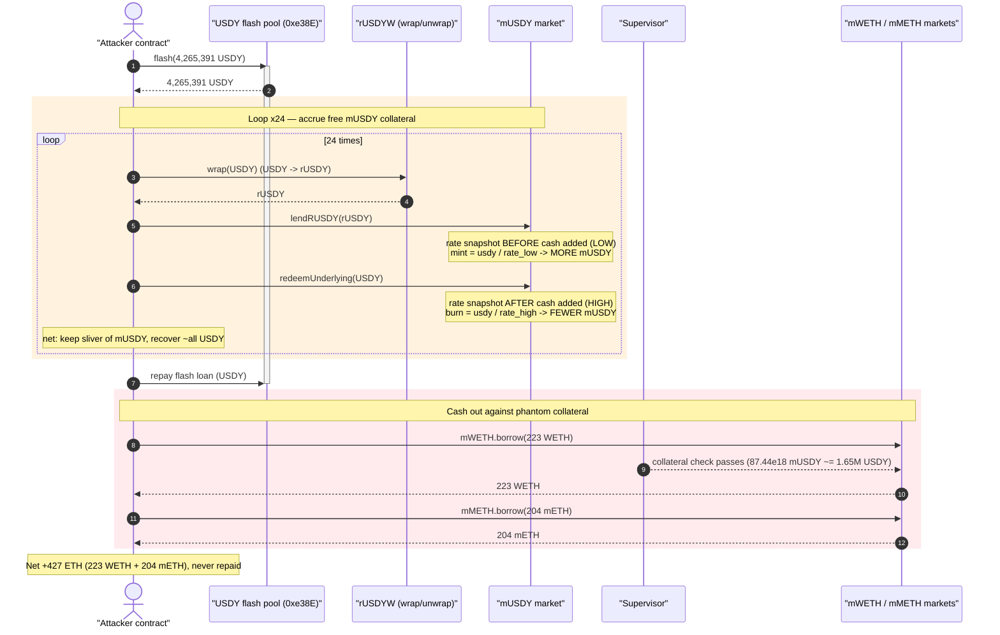
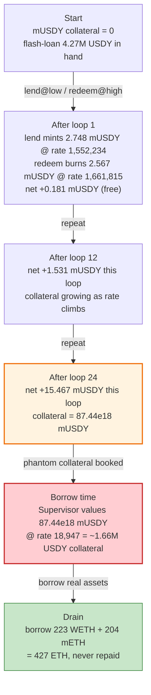
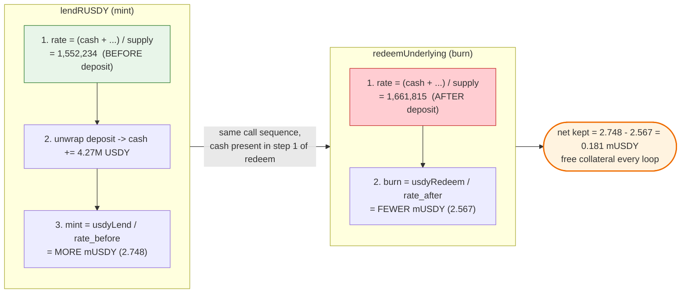

# Minterest (Mantle) Exploit — Stale Exchange-Rate in `lendRUSDY` Inflates mUSDY Collateral

> **Vulnerability classes:** vuln/oracle/stale-price · vuln/logic/incorrect-order-of-operations

> **Reproduction:** the PoC compiles & runs in an isolated Foundry project at
> [this project folder](.) (the umbrella DeFiHackLabs repo does not whole-compile, so this
> PoC was extracted and run on its own).
> Full verbose trace: [output.txt](output.txt).
> Verified vulnerable sources:
> [MUSDYToken.sol](sources/MUSDYToken_Mantle_4B3513/contracts_multichain_manthle_MUSDYToken.sol),
> [MToken.sol](sources/MUSDYToken_Mantle_4B3513/contracts_MToken.sol),
> [rUSDYW.sol](sources/rUSDYW_907D83/contracts_usdy_rusdyw_rUSDYW.sol).

---

## Key info

| | |
|---|---|
| **Loss** | **~427 ETH** — 223 WETH + 204 mETH (~$1.36M at the fork-block WETH price of $3,193) drained from the Minterest mWETH / mMETH markets |
| **Vulnerable contract** | Minterest `mUSDY` market — proxy [`0x5edBD8808F48Ffc9e6D4c0D6845e0A0B4711FD5c`](https://mantlescan.info/address/0x5edBD8808F48Ffc9e6D4c0D6845e0A0B4711FD5c), impl `MUSDYToken` [`0x4B351368459ccC0024197D24Ab7ba278E4c6f510`](https://mantlescan.info/address/0x4B351368459ccC0024197D24Ab7ba278E4c6f510#code) |
| **Victim markets** | mWETH [`0xfa1444aC7917d6B96Cac8307E97ED9c862E387Be`](https://mantlescan.info/address/0xfa1444aC7917d6B96Cac8307E97ED9c862E387Be), mMETH [`0x5aA322875a7c089c1dB8aE67b6fC5AbD11cf653d`](https://mantlescan.info/address/0x5aA322875a7c089c1dB8aE67b6fC5AbD11cf653d) |
| **Flash-loan source** | USDY pool `0xe38E3a804eF845e36F277D86Fb2b24b8C32B3340` (ERC-3156-style `flash()`) |
| **Attacker EOA** | [`0x618f768af6291705eb13e0b2e96600b3851911d1`](https://mantlescan.info/address/0x618f768af6291705eb13e0b2e96600b3851911d1) |
| **Attack contract** | [`0x5fdac50aa48e3e86299a04ad18a68750b2074d2d`](https://mantlescan.info/address/0x5fdac50aa48e3e86299a04ad18a68750b2074d2d) |
| **Attack tx** | [`0xb3c4c313a8d3e2843c9e6e313b199d7339211cdc70c2eca9f4d88b1e155fd6bd`](https://app.blocksec.com/explorer/tx/mantle/0xb3c4c313a8d3e2843c9e6e313b199d7339211cdc70c2eca9f4d88b1e155fd6bd) |
| **Chain / block / date** | Mantle / 66,416,576 / July 2024 |
| **Compiler** | Solidity 0.8.17 (Minterest) / 0.8.16 (rUSDYW) |
| **Bug class** | Stale/asymmetric exchange-rate accounting in a Compound-fork lend/redeem pair; self-deposit moves the rate within the same call |

---

## TL;DR

Minterest deployed a special market, `mUSDY`, that lets users supply collateral denominated in Ondo's
rebasing **rUSDY** token while the market accounts internally in the underlying **USDY**. The supply
entry point, `lendRUSDY()`, snapshots the market exchange rate **before** it pulls the deposit in, but
the matching exit, `redeemUnderlying()`, recomputes the exchange rate **after** the deposit's cash is
already sitting in the market.

Because the deposit (≈ 4.27M USDY per loop, sourced from a flash loan) is huge relative to the market's
existing cash, it materially moves the market's exchange rate. So within one `lend → redeem` round-trip:

- `lendRUSDY` mints mUSDY at the **lower** pre-deposit rate ⇒ **more** collateral tokens minted.
- `redeemUnderlying` burns mUSDY at the **higher** post-deposit rate ⇒ **fewer** collateral tokens burned to pull the same USDY back out.

Net effect: every loop the attacker pulls ~all of their USDY back **and keeps a sliver of mUSDY
collateral for free**. Repeated **24 times**, this inflated the attacker's mUSDY balance to
`87.44e18` (raw), which the Minterest `Supervisor` valued as enormous collateral. The attacker then
simply **borrowed 223 WETH + 204 mETH (≈ 427 ETH)** against that phantom collateral and walked away.

The rUSDY `wrap`/`unwrap` detour (USDY → rUSDY → market → USDY) is the wrapper that makes
`lendRUSDY`/`redeemUnderlying` usable with a flash loan denominated in USDY; the *exploitable defect*
is the stale-rate asymmetry inside the Minterest market, not in Ondo's token.

---

## Background — what the protocol does

**Minterest** is a Compound-v2-style money market (markets are `MToken`s; each tracks
`totalTokenSupply`, `accountTokens[user]`, `totalBorrows`, and an `exchangeRate` derived from them).
On Mantle, Minterest added an **rUSDY-aware market** (`MUSDYToken`) so users could supply Ondo
collateral:

- **`MToken`** ([MToken.sol](sources/MUSDYToken_Mantle_4B3513/contracts_MToken.sol)) — the generic
  Compound-fork market. `exchangeRate = (cash + totalBorrows − protocolInterest) / totalTokenSupply`
  ([MToken.sol:252-266](sources/MUSDYToken_Mantle_4B3513/contracts_MToken.sol#L252-L266)), where
  `cash = underlying.balanceOf(this)` ([MToken.sol:278-280](sources/MUSDYToken_Mantle_4B3513/contracts_MToken.sol#L278-L280)).
- **`MUSDYTokenV1` / `MUSDYToken`** — adds rUSDY entry points. `unwrapTokens` converts the deposited
  rUSDY back to USDY *inside the market* and measures the **actual** USDY balance delta
  ([MUSDYTokenV1.sol:97-109](sources/MUSDYToken_Mantle_4B3513/contracts_multichain_manthle_MUSDYTokenV1.sol#L97-L109)).
- **`rUSDYW`** ([rUSDYW.sol](sources/rUSDYW_907D83/contracts_usdy_rusdyw_rUSDYW.sol)) — Ondo's
  rebasing rUSDY wrapper. `wrap(USDY)` mints rUSDY; `unwrap(rUSDY)` returns USDY. The conversion is
  oracle-priced via `RWADynamicOracle.getPrice()` (≈ `1.0488952e18` at the fork block), so 1 USDY ≈
  1.0489 rUSDY ([rUSDYW.sol:383-394](sources/rUSDYW_907D83/contracts_usdy_rusdyw_rUSDYW.sol#L383-L394)).

The mWETH / mMETH markets hold the real liquidity the attacker ultimately stole.

---

## The vulnerable code

### 1. `lendRUSDY` snapshots the rate *before* adding the deposit's cash

The deployed override on `MUSDYToken`:

```solidity
// MUSDYToken.sol:26-47
function lendRUSDY(uint256 _rUsdyLendAmount) external override {
    accrueInterest();
    supervisor.beforeLend(this, msg.sender);
    require(accrualBlockNumber == getBlockNumber(), ErrorCodes.MARKET_NOT_FRESH);

    // Order of actions here is crucial
    // 1. Calculate exchange rate based on parammeters before user's action
    uint256 exchangeRateMantissa = exchangeRateStoredInternal();          // ⚠️ rate snapshot BEFORE cash arrives
    // 2. Transfer USDY tokens from sender to the market contract (changes market's total cash)
    uint256 usdyLendAmount = unwrapTokens(_rUsdyLendAmount, msg.sender);  // ← market USDY cash jumps by ~4.27M
    // 3. Calculate amount of MTokens to mint
    uint256 lendTokens = (usdyLendAmount * EXP_SCALE) / exchangeRateMantissa;  // ← divided by the LOW pre-deposit rate

    totalTokenSupply += lendTokens;
    accountTokens[msg.sender] += lendTokens;
    ...
}
```

[MUSDYToken.sol:26-47](sources/MUSDYToken_Mantle_4B3513/contracts_multichain_manthle_MUSDYToken.sol#L26-L47)

### 2. `redeemUnderlying` recomputes the rate *after* the deposit's cash is present

```solidity
// MToken.sol:391-394
function redeemUnderlying(uint256 redeemAmount) external {
    accrueInterest();
    redeemFresh(msg.sender, 0, redeemAmount, true, false);
}

// MToken.sol:406-431 (redeemFresh)
uint256 exchangeRateMantissa = exchangeRateStoredInternal();             // ⚠️ rate snapshot AFTER cash already added
...
redeemTokens = (redeemAmount * EXP_SCALE) / exchangeRateMantissa;        // ← divided by the HIGH post-deposit rate
```

[MToken.sol:406-432](sources/MUSDYToken_Mantle_4B3513/contracts_MToken.sol#L406-L432)

Both functions use the same formula `tokens = amount * 1e18 / exchangeRate`, but they evaluate
`exchangeRate` at two different points in the cash lifecycle. Because
`exchangeRate = (cash + …) / totalTokenSupply`, a large deposit **raises** the rate. So:

- mint uses **rate_before** (lower) → mints **more** tokens,
- burn uses **rate_after** (higher) → burns **fewer** tokens,

for the same underlying value. The difference is pure, free collateral.

### 3. The rUSDY conversion that makes it flash-loanable

```solidity
// rUSDYW.sol:429-436
function wrap(uint256 _USDYAmount) external whenNotPaused {
    uint256 usdySharesAmount = _USDYAmount * BPS_DENOMINATOR;       // BPS_DENOMINATOR = 10_000
    _mintShares(msg.sender, usdySharesAmount);
    usdy.transferFrom(msg.sender, address(this), _USDYAmount);
    emit Transfer(address(0), msg.sender, getRUSDYByShares(usdySharesAmount));  // = _USDYAmount * price / 1e18
    ...
}
// getRUSDYByShares: shares * price / (1e18 * 10_000)
// getSharesByRUSDY: rUSDY * 1e18 * 10_000 / price
```

[rUSDYW.sol:383-453](sources/rUSDYW_907D83/contracts_usdy_rusdyw_rUSDYW.sol#L383-L453)

The wrap/unwrap round-trip is itself ~value-neutral (`U → U·price/1e18 rUSDY → back to U`). Its only
role in the exploit is to convert the flash-loaned USDY into the rUSDY that `lendRUSDY` consumes and
to convert the redeemed USDY back so the flash loan can be repaid.

---

## Root cause — why it was possible

A Compound-fork market’s exchange rate is a function of its own cash:
`exchangeRate = (cash + totalBorrows − protocolInterest) / totalTokenSupply`. The market is only safe
if **mint and redeem evaluate that rate at the same logical instant** — either both before the
caller’s cash movement or both after. Minterest’s rUSDY override broke that symmetry:

> `lendRUSDY` deliberately snapshots `exchangeRateStoredInternal()` **before** `unwrapTokens` adds the
> deposit to `cash` (the inline comment even says *"Order of actions here is crucial … 1. Calculate
> exchange rate based on parameters before user's action"*). But the generic `redeemFresh` it pairs
> with snapshots the rate **after** that cash is already counted. The attacker’s deposit is large
> enough to move the rate between those two points, so a single `lend → redeem` cycle is net-positive
> in collateral tokens.

The four ingredients that compose into a critical bug:

1. **Asymmetric rate timing.** Mint at pre-deposit rate, redeem at post-deposit rate (the core defect).
2. **Self-funded rate manipulation.** `cash = underlying.balanceOf(this)` is moved by the *caller’s own*
   deposit — no other party is needed to shift the rate. A flash loan supplies the size.
3. **`redeemUnderlying` lets you pull cash back out without un-minting all collateral.** Because it
   redeems by *underlying amount*, it burns only the (smaller) post-rate token count, leaving the
   residual collateral behind.
4. **Inflated collateral is borrowable.** The Minterest `Supervisor` values `accountTokens × exchangeRate`
   as collateral with no sanity check that real backing exists, so the phantom mUSDY directly unlocks
   borrows in *other* markets (mWETH, mMETH).

---

## Preconditions

- A large USDY flash loan (the pool `0xe38E…3340` lent ≈ 4.27M USDY per the trace) to make each
  deposit dwarf the market’s standing cash, maximizing the per-loop rate shift.
- The `mUSDY` market must be enabled as collateral for the attacker
  (`Proxy.enableAsCollateral([mUSDY])`, [Minterest_exp.sol:77](test/Minterest_exp.sol#L77)).
- The attacker (or any address) must be whitelisted — `Supervisor.beforeLend` checks
  `isWhitelisted(msg.sender)`, which returned `true` for the attacker
  ([output.txt:171-174](output.txt#L171)).
- Sufficient liquidity in the target borrow markets (mWETH held ≈ 223.6 WETH, mMETH held ≥ 204 mETH).

---

## Attack walkthrough (with on-chain numbers from the trace)

The attacker contract is driven via a fallback that decodes selector `0x847d282d` and runs a 24-iteration
loop ([Minterest_exp.sol:96-106](test/Minterest_exp.sol#L96-L106)). The bootstrap USDY is delivered as
an ERC-3156-style `flash()` of `4,265,391 USDY` from pool `0xe38E…3340`
([output.txt:54](output.txt#L54)).

### Per-loop mechanics (iteration 1, exact trace values)

| Step | Call | Value | Source |
|---|---|---:|---|
| a | `rUSDYW.wrap(USDY)` — wrap USDY → rUSDY | in `4,265,037.7567 USDY` → out `4,473,577.6306 rUSDY` | [output.txt:124](output.txt#L124), [142](output.txt#L142) |
| b | `mUSDY.lendRUSDY(rUSDY)` — unwrap inside market, mint collateral | unwrapped `4,265,037.7567 USDY`; **minted `2.7477e18` mUSDY** at rate `1,552,234` | [output.txt:155](output.txt#L155), [318](output.txt#L318) |
| c | `mUSDY.redeemUnderlying(USDY)` — pull USDY back | redeemed `4,265,817.7920 USDY`; **burned only `2.5670e18` mUSDY** at rate `1,661,815` | [output.txt:356](output.txt#L356), [453](output.txt#L453) |
| d | net | **+`0.1807e18` mUSDY collateral kept for free**; +`780.0 USDY` cash | computed |

The two exchange rates differ precisely because step (b) injected the deposit before (c) read the rate:

```
exchangeRate at lend   (pre-deposit)  = 1,552,234 USDY / mUSDY
exchangeRate at redeem (post-deposit) = 1,661,815 USDY / mUSDY   → fewer tokens burned
```

### Collateral accrual across 24 loops

Each loop the net mUSDY kept grows (the rate climbs as cash and minted supply accumulate), from
`0.18e18` (iter 1) to `15.47e18` (iter 24):

| Iteration | mUSDY minted (lend) | mUSDY burned (redeem) | net mUSDY kept |
|---:|---:|---:|---:|
| 1 | 2.7477e18 | 2.5670e18 | 0.1807e18 |
| 12 | 23.5273e18 | 21.9965e18 | 1.5308e18 |
| 24 | 240.6081e18 | 225.1411e18 | 15.4670e18 |
| **Final accumulated collateral** | | | **`87.4405e18`** ([output.txt:8756](output.txt#L8756)) |

At the borrow, the `Supervisor` saw the attacker holding `87.4405e18` mUSDY valued at exchange rate
`18,947` USDY/mUSDY ⇒ a phantom collateral value of **≈ 1,656,762 USDY**, despite the attacker’s real
net USDY contribution being negligible (each loop returned ~all the USDY).

### Cashing out

With the inflated mUSDY collateral booked, the attacker borrowed directly from the real markets
([Minterest_exp.sol:82-83](test/Minterest_exp.sol#L82-L83)):

| Borrow | Amount | Trace |
|---|---:|---|
| `mWETH.borrow(223 ether)` | **223 WETH** | [output.txt:8712](output.txt#L8712), [8726](output.txt#L8726) |
| `mMETH.borrow(204 ether)` | **204 mETH** | [output.txt:9084-9087](output.txt#L9084) |

Final balances logged by the PoC ([output.txt:6-8](output.txt#L6)):

```
[End] Attacker WETH balance after exploit: 223.000000000000000000
[End] Attacker mETH balance after exploit: 204.000000000000000000
[End] Attacker musdy balance after exploit: 874404819949.54532689   (87.4405e18 raw)
```

### Profit / loss accounting

| Item | Amount | Note |
|---|---:|---|
| Flash-loaned USDY (bootstrap) | 4,265,391 USDY | repaid via the per-loop redeems / final transfer |
| **WETH borrowed (never repaid)** | **223 WETH** | stolen from mWETH market |
| **mETH borrowed (never repaid)** | **204 mETH** | stolen from mMETH market |
| **Total loss** | **≈ 427 ETH (~$1.36M @ $3,193/WETH)** | matches PoC header `~427 ETH` |

The borrowed assets are pure profit: the “collateral” backing them was conjured by the rate
asymmetry, so the attacker never repays and the protocol eats the 427 ETH of real liquidity.

---

## Diagrams

### Sequence of the attack



### mUSDY collateral evolution



### Why one loop is net-positive: the rate-timing asymmetry



---

## Remediation

1. **Snapshot the exchange rate at the same point for lend and redeem.** The Minterest `lendRUSDY`
   override deliberately reads `exchangeRateStoredInternal()` *before* `unwrapTokens` adds the cash,
   while `redeemFresh` reads it *after*. Use the standard `lendFresh` flow (which transfers in cash
   first, then reads the rate — [MToken.sol:334-363](sources/MUSDYToken_Mantle_4B3513/contracts_MToken.sol#L334-L363))
   so both sides evaluate the rate with the deposit consistently counted (or not). Mixing the two is
   the bug.
2. **Never let `cash = balanceOf(this)` be moved by the same call that prices against it.** Either
   measure the deposit delta and compute mint tokens against the *pre-deposit* state for **both** mint
   and redeem, or use a cash variable that is updated atomically and read identically everywhere. A
   round-trip `lend(x); redeem(x)` must be a strict no-op (or net-negative after fees).
3. **Add a round-trip invariant / dust guard.** Assert that `lend` immediately followed by `redeem` of
   the same underlying amount cannot increase `accountTokens[user]`. Reject deposits/redeems whose
   token count differs from the inverse operation by more than rounding dust.
4. **Sanity-check collateral against real backing.** The `Supervisor` should not value collateral that
   exceeds the underlying actually held for that market segment; cross-check `totalTokenSupply ×
   exchangeRate ≈ cash + totalBorrows` and revert on large divergences.
5. **Cap per-transaction collateral growth.** A single transaction that grows a user's collateral by
   orders of magnitude (here 0 → 87.44e18 mUSDY) without commensurate net cash inflow should be
   impossible; rate-limit or revert on anomalous intra-block collateral mints.

---

## How to reproduce

The PoC was extracted into a standalone Foundry project (the umbrella DeFiHackLabs repo does not
whole-compile under `forge test`):

```bash
_shared/run_poc.sh 2024-07-Minterest_exp -vvvvv
```

- **RPC:** a **Mantle archive** endpoint is required for fork block 66,416,576. The bundled
  blastapi mantle endpoint has been retired (returns HTTP 403 "Blast API is no longer available"),
  and the public `mantle.drpc.org` load-balancer intermittently 500s on archive storage reads. This
  project’s `foundry.toml` therefore uses the official **`https://rpc.mantle.xyz`**, which serves
  historical state at that block reliably.
- Result: `[PASS] testExpolit()`.

Expected tail:

```
Ran 1 test for test/Minterest_exp.sol:Exploit
[PASS] testExpolit() (gas: 6661707)
Logs:
  [End] Attacker musdy balance after exploit: 874404819949.54532689
  [End] Attacker WETH balance after exploit: 223.000000000000000000
  [End] Attacker mETH balance after exploit: 204.000000000000000000
Suite result: ok. 1 passed; 0 failed; 0 skipped
```

---

*Reference: DeFiHackLabs — Minterest (Mantle), July 2024, ~427 ETH.*
