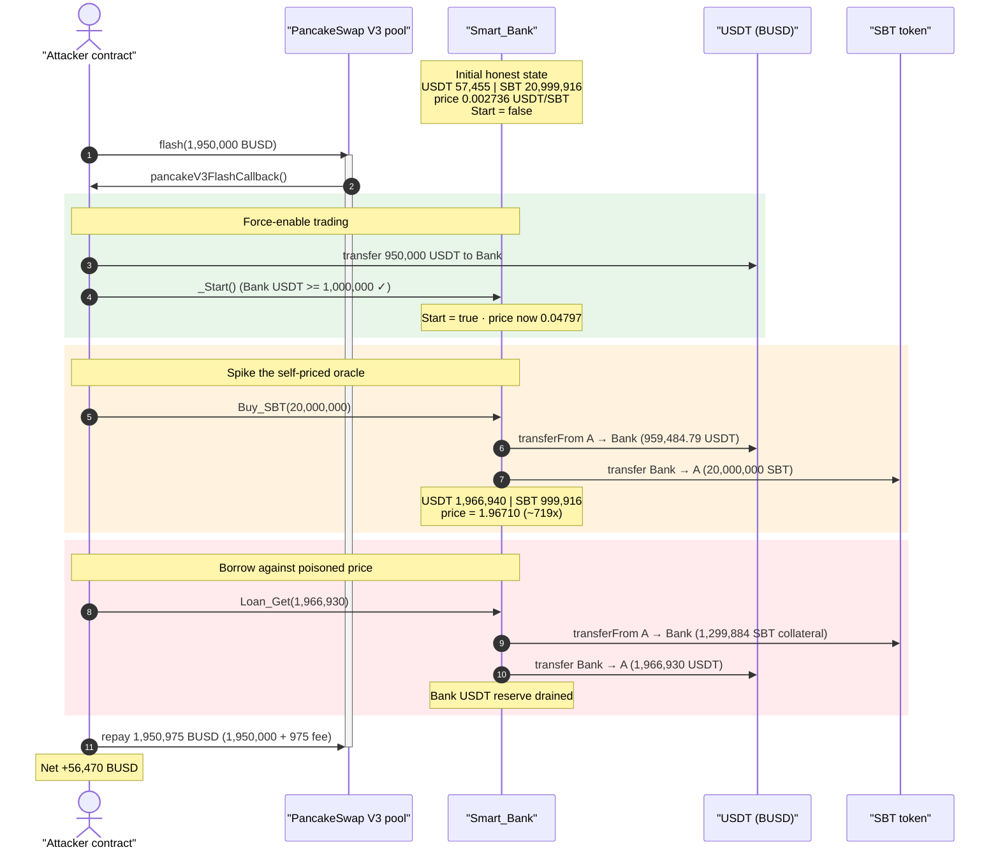
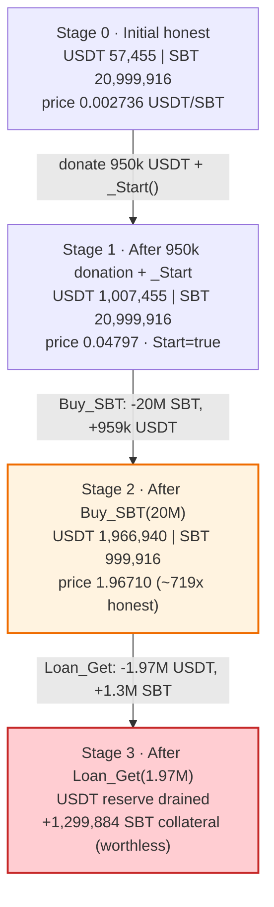
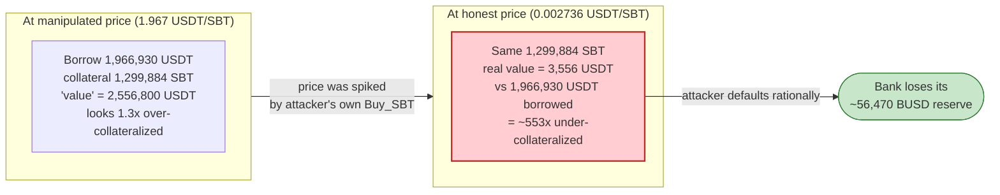

# SmartBank (SBT) Exploit — Self-Referential Spot-Price Oracle Manipulation

> **Vulnerability classes:** vuln/oracle/spot-price · vuln/oracle/price-manipulation

> One-line summary: SmartBank prices its own SBT token from the *instantaneous* ratio of its own USDT and SBT balances, so a single flash-loan-funded buy spikes the price ~700x and lets the attacker borrow ~1.97M USDT against collateral worth ~$3.5K — netting **~56,470 BUSD** with no real repayment.

> **Reproduction:** the PoC compiles & runs in this isolated Foundry project ([this folder](.)). Full verbose trace: [output.txt](output.txt). Verified vulnerable source: [Smart_Bank.sol](sources/Smart_Bank_2b45DD/Smart_Bank.sol).

---

## Key info

| | |
|---|---|
| **Loss** | **~56,470 BUSD** (the SmartBank's entire USDT/BUSD reserve) |
| **Vulnerable contract** | `Smart_Bank` — [`0x2b45DD1d909c01aAd96fa6b67108D691B432f351`](https://bscscan.com/address/0x2b45DD1d909c01aAd96fa6b67108D691B432f351#code) |
| **Priced token** | `Smart_Bank_Token (SBT)` — [`0x94441698165fB7e132e207800B3eA57E34c93a72`](https://bscscan.com/address/0x94441698165fB7e132e207800B3eA57E34c93a72#code) |
| **Flash-loan source** | PancakeSwap V3 BUSD pool — `0x36696169C63e42cd08ce11f5deeBbCeBae652050` (only the funding pool; not the bug) |
| **Attacker EOA** | [`0x3026c464d3bd6ef0ced0d49e80f171b58176ce32`](https://bscscan.com/address/0x3026c464d3bd6ef0ced0d49e80f171b58176ce32) |
| **Attacker contract** | [`0x88f9e1799465655f0dd206093dbd08922a1d9e28`](https://bscscan.com/address/0x88f9e1799465655f0dd206093dbd08922a1d9e28) |
| **Attack tx** | [`0x9a8c4c4edb7a76ecfa935780124c409f83a08d15c560bb67302182f8969be20d`](https://app.blocksec.com/explorer/tx/bsc/0x9a8c4c4edb7a76ecfa935780124c409f83a08d15c560bb67302182f8969be20d) |
| **Chain / block / date** | BSC / 40,378,159 (fork = 40,378,160 − 1) / **2024-07-11** |
| **Compiler** | Solidity v0.8.18, optimizer 200 runs |
| **Bug class** | Internal spot-price oracle manipulation → catastrophic under-collateralized loan |

Note: BUSD and USDT labels refer to the same token in this PoC — the address `0x55d398...` is BSC-USD (USDT), which the PoC calls `BUSD`. SmartBank internally calls it `USDT`. They are one asset throughout.

---

## TL;DR

`Smart_Bank` runs a tiny in-house "DeFi bank": you can buy/sell its `SBT` token and take USDT loans against SBT collateral. Every price it uses is computed live from **its own balances**:

```solidity
function SBT_Price() private view returns(uint256) {
    return ((Smart_Bank_USDT_Balance()*10**18) / (Smart_Bank__SBT_Balance()));
}
```
([Smart_Bank.sol:263](sources/Smart_Bank_2b45DD/Smart_Bank.sol#L263))

This is a constant-product spot price taken from a pool **the attacker can move at will** in the same transaction. The attack:

1. Flash-loan 1,950,000 BUSD from a PancakeSwap V3 pool.
2. Donate 950,000 USDT to the bank and call `_Start()` to enable trading (it only checks the bank holds ≥ 1,000,000 USDT).
3. `Buy_SBT(20,000,000)` — buy 20M SBT at the *cheap* honest price (~0.048 USDT/SBT). This single trade drains the bank's SBT (21.0M → 1.0M) and inflates its USDT (1.01M → 1.97M), so the next `SBT_Price()` reading **jumps ~700x** to ~1.967 USDT/SBT.
4. `Loan_Get(1,966,930)` — borrow **1,966,930 USDT**. The collateral the bank demands is `(USDT/SBT_Price)*1.3 = 1,299,884 SBT`, which at the *manipulated* price looks adequate but is worth only ~$3,556 at honest prices. The attacker holds plenty of SBT from step 3, so it posts the collateral and walks away with the USDT.
5. Repay the flash loan (1,950,000 + 975 fee).

Net: the attacker keeps **~56,470 BUSD** (the bank's real USDT reserve) plus 18.7M now-worthless SBT, while the bank is left holding overvalued SBT collateral. The loan is never meaningfully repaid because `Loan_Get` allows one borrow per address and the position is grossly under-collateralized at real prices.

---

## Background — what SmartBank does

`Smart_Bank` ([source](sources/Smart_Bank_2b45DD/Smart_Bank.sol)) is a single-contract "bank" for its own `SBT` token, with these user-facing primitives:

- **Buy / Sell** SBT for USDT (`Buy_SBT` / `Sell_SBT`) at an internally-computed price.
- **Loans** — `Loan_Get(USDT_)` lets a user borrow `USDT_` USDT by locking SBT collateral; `Loan_Pay()` repays later with interest.
- **Staking, swaps, lottery, airdrops, governance** — a grab-bag of extra features irrelevant to this exploit.

Trading is gated behind `_Start()`, which is **permissionless** and only requires that the bank's USDT balance is at least 1,000,000:

```solidity
function _Start() external {
    require(Smart_Bank_USDT_Balance() >= 1000000, "After 1000000 Tethers");
    Start = true; Time_365 = block.timestamp;
}
```
([Smart_Bank.sol:279](sources/Smart_Bank_2b45DD/Smart_Bank.sol#L279))

All pricing flows through one private helper, `SBT_Price()`, which reads the bank's *current* USDT and SBT balances (each integer-truncated by `/1e18`):

```solidity
function Smart_Bank_USDT_Balance() public view returns(uint256){ return USDT.balanceOf(address(this)) / 10**18; }
function Smart_Bank__SBT_Balance()  public view returns(uint256){ return SBT.balanceOf(address(this))  / 10**18; }
function SBT_Price() private view returns(uint256){ return ((Smart_Bank_USDT_Balance()*10**18) / (Smart_Bank__SBT_Balance())); }
```
([Smart_Bank.sol:273-274, 263](sources/Smart_Bank_2b45DD/Smart_Bank.sol#L273-L274))

On-chain state at the fork block:

| Parameter | Value |
|---|---|
| Bank USDT (BUSD) balance | ≈ **57,455 USDT** (the eventual prize) |
| Bank SBT balance | ≈ **20,999,916 SBT** |
| Honest SBT price | `57,455 / 20,999,916` ≈ **0.002736 USDT/SBT** |
| `Start` (trading) | initially **false** (attacker force-enables it) |
| SBT total supply / cap | 21,000,000 SBT (plain capped ERC20) |

The SBT token itself ([Smart_Bank_Token.sol](sources/Smart_Bank_Token_944416/Smart_Bank_Token.sol)) is an unremarkable capped ERC20 — the bug is entirely in the bank's pricing logic, not the token.

---

## The vulnerable code

### 1. Price = bank's own instantaneous balance ratio

```solidity
function SBT_Price() private view returns(uint256) {
    return ((Smart_Bank_USDT_Balance()*10**18) / (Smart_Bank__SBT_Balance()));
}
```
([Smart_Bank.sol:263](sources/Smart_Bank_2b45DD/Smart_Bank.sol#L263))

This is a spot AMM price computed from balances the caller can manipulate within a single transaction via `Buy_SBT`/`Sell_SBT`. There is no TWAP, no external oracle, no time-weighting, and no re-entrancy / same-block guard across buy → loan.

### 2. Buying SBT moves both balances → moves the price

```solidity
function Buy_SBT(uint256 _SBT_) external{ require(Start == true, "After Start"); Buy_Token(_SBT_); }
function Buy_Token(uint256 X) private{
    USDT.safeTransferFrom(_msgSender(), address(this), (X) * SBT_Price()); // USDT in
    SBT.safeTransfer(_msgSender(), X * 10 **18 );                           // SBT out
    S3 += (X * 10 **16);
}
```
([Smart_Bank.sol:86-89](sources/Smart_Bank_2b45DD/Smart_Bank.sol#L86-L89))

A buy *removes SBT from the bank* and *adds USDT to the bank*. Both effects push `SBT_Price() = USDT_bal / SBT_bal` **upward**. A large buy moves it dramatically.

### 3. Loan amount and collateral both derive from the same poisoned price

```solidity
function Loan_Get(uint256 USDT_) external{
    require(Start == true, "After Start");
    require(USDT_ >= 100 ," More Than 100 USDT ");
    require(S9[_msgSender()].id == 0 , "Just 1 Time");
    require(Lock == false, " Processing "); Lock = true ;
    uint256 S8 = ((((USDT_ * 10 **18 ) / SBT_Price()) * 130) / 100 );   // collateral in SBT
    if (T1[_msgSender()].id == 0) {
        require(SBT.balanceOf(_msgSender()) > S8,"Your SBT Balanace Is Not Enough");
        SBT.safeTransferFrom( _msgSender(), address(this),(S8 * 10**18));  // pull collateral
    } else { ... }
    S4++;
    USDT.safeTransfer(_msgSender(), (USDT_ * 10 **18 ));                  // ⚠️ hand over USDT_ USDT
    ...
}
```
([Smart_Bank.sol:95-116](sources/Smart_Bank_2b45DD/Smart_Bank.sol#L95-L116))

The bank pays out `USDT_` USDT and requires `S8 = (USDT_ / price) * 1.3` SBT as collateral. Because `price` is the *inflated* number from step 2, the collateral required (`1,299,884 SBT`) is small relative to what those SBT are actually worth — and it is *exactly what the attacker already has*. There is no check that the SBT collateral has any external market value; SBT only has the value the bank itself assigns to it via the manipulable `SBT_Price()`.

---

## Root cause — why it was possible

The bank uses a **self-referential spot-price oracle** for both the buy price and the loan-to-collateral ratio. That is the entire vulnerability:

> `SBT_Price()` reads `USDT.balanceOf(bank)/SBT.balanceOf(bank)` *at the moment of the call*. Anyone can change both of those balances in the same transaction with `Buy_SBT`, so the price is fully attacker-controlled.

Four design decisions compose into a critical bug:

1. **Spot price, no time-weighting.** `SBT_Price()` is the instantaneous ratio. A single `Buy_SBT` in the same transaction shifts it ~700x. A TWAP or external oracle would have made the manipulation prohibitively expensive.
2. **The same poisoned price sets both legs of the loan.** Loan payout uses `USDT_` directly while collateral uses `USDT_/price`. Inflating `price` *shrinks* the collateral requirement, so the attacker borrows more USDT per SBT locked. The mechanism that should protect the bank (over-collateralization, the `* 130 / 100` factor) is denominated in the very price the attacker controls.
3. **Permissionless `_Start()`.** Trading was off, but `_Start()` only checks the bank holds ≥ 1,000,000 USDT. The attacker simply *donates* 950,000 flash-loaned USDT to clear that gate, then enables trading itself.
4. **Collateral has no independent valuation.** SBT is only worth what the bank says it is worth (via `SBT_Price()`). The attacker buys 20M SBT cheaply, posts 1.3M of it as "valuable" collateral, and the bank can never recover real value from it because SBT has no genuine market depth.

The loan is effectively never repaid: `Loan_Get` allows one position per address (`require(S9[...].id == 0, "Just 1 Time")`) and the position is ~553x under-collateralized at honest prices, so default is rational. The bank's USDT is simply gone.

---

## Preconditions

- The bank holds enough USDT that draining it is worthwhile (here ≈57K USDT of real reserve, plus the attacker's own donated 950K that funds the price spike).
- Trading can be enabled: `_Start()` requires ≥ 1,000,000 USDT in the bank — satisfied by donating flash-loaned USDT.
- Working capital in USDT/BUSD to (a) clear the `_Start()` threshold and (b) execute a buy large enough to move the price. The peak outlay is ~1,909,485 USDT (950,000 donation + 959,485 buy), fully recovered intra-transaction — hence **flash-loanable**. The PoC sources it from a PancakeSwap V3 `flash()`.
- A first-time borrower address (`S9[caller].id == 0`) — trivially satisfied.

---

## Attack walkthrough (with on-chain numbers from the trace)

All figures are taken directly from [output.txt](output.txt) (the `pancakeV3FlashCallback` body, lines ~1620-1703). USDT = BUSD = `0x55d398...`.

| # | Step | Bank USDT bal | Bank SBT bal | `SBT_Price()` | Effect |
|---|------|--------------:|-------------:|--------------:|--------|
| 0 | **Initial (honest)** | 57,455 | 20,999,916 | 0.002736 | Honest bank state. |
| 1 | Flash-loan **1,950,000 BUSD** from PCS V3 pool ([:1609](output.txt)) | — | — | — | Attacker funded. |
| 2 | `transfer` **950,000 USDT** to bank ([:1626](output.txt)) | 1,007,455 | 20,999,916 | — | Pre-loads the `_Start` gate. |
| 3 | `_Start()` ([:1637](output.txt)) — bank USDT ≥ 1,000,000 ✓ | 1,007,455 | 20,999,916 | **0.04797** | Trading enabled. Price already up ~17.5x from the donation. |
| 4 | `Buy_SBT(20,000,000)` ([:1644](output.txt)) — pays **959,484.79 USDT**, receives **20,000,000 SBT** | 1,966,940 | 999,916 | **1.96710** | ⚠️ Price spikes to ~1.967 (**~719x** honest). Bank SBT drained 95%. |
| 5 | `Loan_Get(1,966,930)` ([:1666](output.txt)) — posts collateral **1,299,884 SBT**, borrows **1,966,930 USDT** | ≈10 | 2,299,800 | — | ⚠️ Under-collateralized ~553x at honest prices. |
| 6 | Repay flash loan **1,950,975 BUSD** (1,950,000 + 975 fee) ([:1697](output.txt)) | — | — | — | Loan source made whole. |

### How the numbers line up (verified against the trace)

- **Buy cost:** `Buy_Token(X)` charges `X * SBT_Price()`. With `X = 20,000,000` and the integer price `0.04797423951600568` (1e18-scaled `47974239516005683`), cost = `959,484,790,320,113,660,000,000` wei = **959,484.79 USDT** — exact match to the trace `transferFrom` at [:1649](output.txt).
- **Loan collateral:** `S8 = (USDT_*1e18 / price) * 130 / 100`. With `USDT_ = 1,966,930` and the post-buy price `1.967104` (1e18-scaled `1967104236755887494`), `S8 = 1,299,884`. Collateral pulled = `S8 * 1e18` = `1,299,884` SBT — exact match at [:1673](output.txt).
- **Loan payout:** `USDT_ * 1e18` = `1,966,930` USDT — exact match at [:1681](output.txt).

### Profit / loss accounting (BUSD / USDT)

| Direction | Amount (BUSD) |
|---|---:|
| Seed (deal) | +1.00 |
| Flash-loan in | +1,950,000.00 |
| Donate to bank (for `_Start`) | −950,000.00 |
| `Buy_SBT` cost | −959,484.79 |
| `Loan_Get` payout (received) | +1,966,930.00 |
| Flash-loan repayment (incl. 975 fee) | −1,950,975.00 |
| **Final attacker BUSD balance** | **56,471.21** |
| **Net profit (excl. 1 BUSD seed)** | **≈ 56,470.21** |

Trace confirms the final balance: `Attacker BUSD balance after attack: 56471.209679886340000000` ([:1715](output.txt)).

The attacker also walks away holding `20,000,000 − 1,299,884 = 18,700,116` SBT, but that SBT is essentially worthless once the bank is drained — the real prize is the ~56.5K BUSD that constituted the bank's genuine USDT reserve.

---

## Diagrams

### Sequence of the attack



### Pool/state evolution



### Why the loan is theft: collateral value, manipulated vs. honest



---

## Why each magic number

- **`flash(1,950,000)`** — enough BUSD to both (a) donate 950,000 to clear `_Start`'s 1,000,000-USDT gate and (b) fund the 959,485-USDT buy that spikes the price, with margin for the 975 fee.
- **`transfer 950,000`** — brings the bank's USDT balance from ~57K to ~1.007M so `_Start()`'s `>= 1000000` check passes. This donation also pre-inflates the price ~17.5x.
- **`Buy_SBT(20,000,000)`** — buys ~95% of the bank's SBT inventory, which is what swings `SBT_Price()` from ~0.048 up to ~1.967 (the higher the price, the smaller the collateral the next loan demands per USDT borrowed).
- **`Loan_Get(1,966,930)`** — sized to borrow essentially the bank's entire (now donation-inflated) USDT balance while keeping the collateral requirement (`1,299,884 SBT`) below the 18.7M SBT the attacker holds.

---

## Remediation

1. **Do not price assets from your own instantaneous balances.** Replace `SBT_Price()` with an external, manipulation-resistant oracle (Chainlink) or a TWAP that cannot be moved within a single transaction. A self-referential spot price is trivially gameable by the same actor who can call `Buy_SBT`.
2. **Decouple loan payout from the manipulable price, and value collateral independently.** The collateral requirement and the loan payout must not both derive from one caller-controllable number. Collateral must be valued against a price source the borrower cannot move, and ideally against the asset's *external* market value, not the protocol's internal quote.
3. **Gate trading enablement properly.** `_Start()` must not be a permissionless function whose only condition is a balance the attacker can donate. Use owner/role control or a one-way latch that cannot be flipped by transient, donated balances.
4. **Block same-transaction price moves.** Add a per-block / re-entrancy-style guard so a buy that changes the price cannot be immediately followed by a loan that reads the new price in the same transaction (e.g., enforce that loans use a price snapshotted before any same-block trades).
5. **Bound single-operation balance impact.** Reject any buy/sell that moves the implied price by more than a small percentage; a single trade swinging the price ~700x should be impossible.

---

## How to reproduce

The PoC was extracted into a standalone Foundry project (the umbrella DeFiHackLabs repo has several unrelated PoCs that fail to compile under `forge test`'s whole-project build):

```bash
_shared/run_poc.sh 2024-07-SBT_exp -vvvvv
```

- RPC: a **BSC archive** endpoint is required (fork block 40,378,159, ~July 2024). `foundry.toml` uses `https://bsc-mainnet.public.blastapi.io`, which serves historical state at that block; most public BSC RPCs prune it and fail with `header not found` / `missing trie node`.
- Result: `[PASS] testExploit()`.

Expected tail:

```
  Attacker BUSD balance before attack: 1.000000000000000000
  Attacker BUSD balance after attack: 56471.209679886340000000

Suite result: ok. 1 passed; 0 failed; 0 skipped
Ran 1 test suite ...: 1 tests passed, 0 failed, 0 skipped (1 total tests)
```

---

*PoC source: [test/SBT_exp.sol](test/SBT_exp.sol). Reference: DeFiHackLabs — SmartBank (SBT), BSC, ~$56K, 2024-07.*
