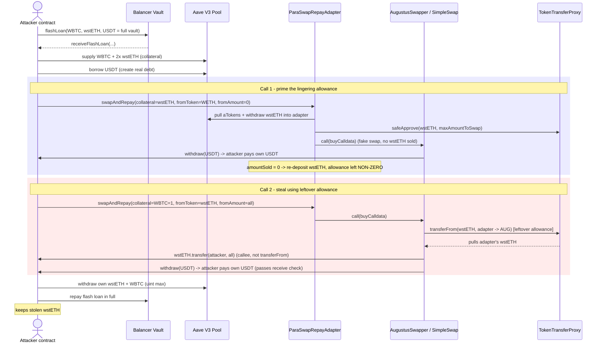
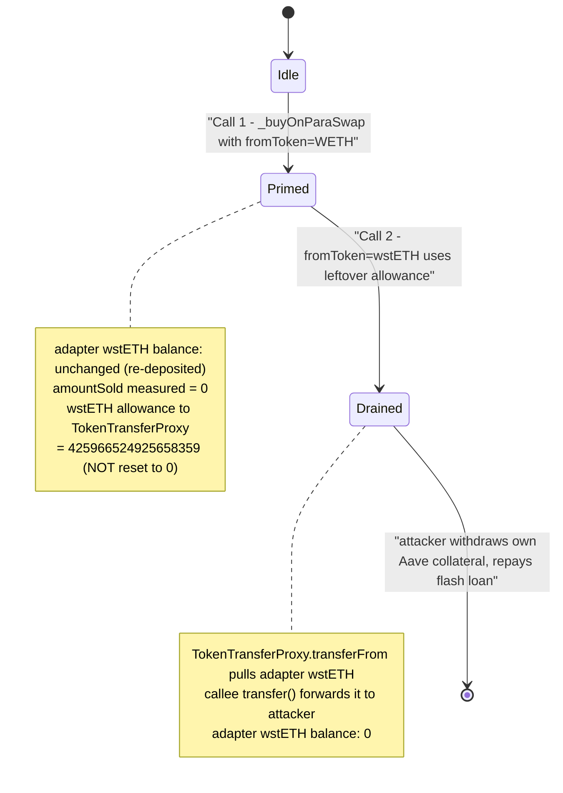

# AAVE ParaSwap Repay Adapter — Lingering Allowance + Arbitrary-Call Collateral Drain

> **Reproduction:** the PoC compiles & runs in an isolated Foundry project at
> [this project folder](.) (the main DeFiHackLabs repo contains many unrelated PoCs that do not
> whole-compile, so this one was extracted).
> Full verbose trace: [output.txt](output.txt).
> Verified vulnerable source: [BaseParaSwapBuyAdapter.sol](sources/ParaSwapRepayAdapter_02e7B8/aave_periphery-v3_contracts_adapters_paraswap_BaseParaSwapBuyAdapter.sol).

---

## Key info

| | |
|---|---|
| **Loss** | ~$56,000 across all tokens left in the adapter. PoC steals only the wstETH leg: **0.425966524925658359 wstETH** (≈$1.24k at the fork) — the same routine drains every token the adapter holds |
| **Vulnerable contract** | `ParaSwapRepayAdapter` (Aave V3 periphery) — [`0x02e7B8511831B1b02d9018215a0f8f500Ea5c6B3`](https://etherscan.io/address/0x02e7b8511831b1b02d9018215a0f8f500ea5c6b3#code) |
| **Victim** | The adapter itself — it held leftover user/dust balances of wstETH, USDT, WBTC, etc. |
| **Abused swapper** | ParaSwap `AugustusSwapper` [`0xDEF171Fe48CF0115B1d80b88dc8eAB59176FEe57`](https://etherscan.io/address/0xDEF171Fe48CF0115B1d80b88dc8eAB59176FEe57#code) → `SimpleSwap` router [`0x66C1c25d7D2bd4A32Ed33501E202B275030f402C`](https://etherscan.io/address/0x66C1c25d7D2bd4A32Ed33501E202B275030f402C#code) |
| **Attacker EOA** | [`0x6ea83f23795f55434c38ba67fcc428aec0c296dc`](https://etherscan.io/address/0x6ea83f23795f55434c38ba67fcc428aec0c296dc) |
| **Attacker contract** | [`0x5e2FFf7bBc7c634992170fF18240b8f10c4D48C6`](https://etherscan.io/address/0x5e2FFf7bBc7c634992170fF18240b8f10c4D48C6) (deployed `0x78B0168a18eF61D7460FAbb4795e5f1A9226583E`) |
| **Attack tx** | [`0xc27c3ec61c61309c9af35af062a834e0d6914f9352113617400577c0f2b0e9de`](https://etherscan.io/tx/0xc27c3ec61c61309c9af35af062a834e0d6914f9352113617400577c0f2b0e9de) |
| **Chain / block / date** | Ethereum mainnet / fork at **20,624,703** / August 2024 |
| **Compiler** | adapter: Solidity v0.8.10; PoC harness: `^0.8.0` |
| **Bug class** | Stale ERC20 approval + unchecked arbitrary external call inside a "swap" that lets an attacker substitute a fake counterparty for the real one |
| **Post-mortem** | [SolidityScan](https://blog.solidityscan.com/aave-repay-adapter-hack-analysis-aafd234e15b9) |

---

## TL;DR

`ParaSwapRepayAdapter` is a *helper* contract that lets an Aave user "repay debt with collateral":
it pulls the user's aTokens, withdraws the underlying collateral, sells it on ParaSwap for the debt
asset, and repays. The selling step lives in
[`BaseParaSwapBuyAdapter._buyOnParaSwap`](sources/ParaSwapRepayAdapter_02e7B8/aave_periphery-v3_contracts_adapters_paraswap_BaseParaSwapBuyAdapter.sol#L42-L110).

That function has two compounding flaws:

1. **It grants the ParaSwap `TokenTransferProxy` an approval for the collateral and never resets it
   to 0 after the swap** ([:76-78](sources/ParaSwapRepayAdapter_02e7B8/aave_periphery-v3_contracts_adapters_paraswap_BaseParaSwapBuyAdapter.sol#L76-L78)).
   Approve-to-zero is done *before* the swap, never *after*.
2. **It blindly executes attacker-supplied calldata** via `address(augustus).call(buyCalldata)`
   ([:94](sources/ParaSwapRepayAdapter_02e7B8/aave_periphery-v3_contracts_adapters_paraswap_BaseParaSwapBuyAdapter.sol#L94)),
   and validates the swap only by **balance deltas of the adapter itself**
   ([:103-107](sources/ParaSwapRepayAdapter_02e7B8/aave_periphery-v3_contracts_adapters_paraswap_BaseParaSwapBuyAdapter.sol#L103-L107)).

ParaSwap's `SimpleSwap` router lets the caller pass arbitrary `callees` + `exchangeData` and runs
them with a raw `call`
([performCalls/externalCall](sources/SimpleSwap_66C1c2/contracts_routers_SimpleSwap.sol#L228-L361)).
The only guards are "don't call the TokenTransferProxy" and "no `transferFrom` selector in
exchangeData" — both trivially bypassable.

So the attacker calls `swapAndRepay` **twice**:

- **Call 1 (prime the allowance).** Collateral = wstETH. The crafted "swap" sets `fromToken = WETH`
  (not the real collateral) with `fromAmount = 0`, and the callee is the attacker's own
  `withdraw()` which simply hands ParaSwap the attacker's own USDT to satisfy the
  `amountReceived >= amountToReceive` check. **No wstETH is actually sold**, so the adapter measures
  `amountSold = 0`, re-deposits the full collateral, and — crucially — leaves a **non-zero wstETH
  allowance to the TokenTransferProxy hanging**.
- **Call 2 (steal).** Collateral = WBTC (amount 1, just to enter the function). Now the crafted swap
  sets `fromToken = wstETH`, `fromAmount = 425966524925658359`. ParaSwap's TokenTransferProxy uses
  the **leftover allowance from Call 1** to pull all that wstETH *out of the adapter* into Augustus,
  then the attacker's first callee runs `wstETH.transfer(attacker, …)` (a `transfer`, not the
  banned `transferFrom`), forwarding the stolen wstETH to the attacker. A second callee
  (`withdraw(USDT, debt)`) pays the trivial `toAmount` to pass the receive check.

The adapter ends with **0 wstETH** and the attacker walks away with all of it. Repeating with each
token the adapter held (USDT, WBTC, …) yields the full ~$56k.

---

## Background — what the adapter does

The Aave V3 ParaSwap Repay Adapter is periphery glue, not a vault. A user who wants to repay an Aave
debt using their deposited collateral (instead of fresh debt-asset funds) calls
[`swapAndRepay`](sources/ParaSwapRepayAdapter_02e7B8/aave_periphery-v3_contracts_adapters_paraswap_ParaSwapRepayAdapter.sol#L96-L139):

1. Compute the debt to repay (`getDebtRepayAmount`).
2. **Pull the user's aTokens and withdraw the underlying collateral into the adapter**
   (`_pullATokenAndWithdraw`).
3. **Sell that collateral for the debt asset on ParaSwap** (`_buyOnParaSwap`).
4. Re-deposit any unsold collateral remainder back to the user's Aave position.
5. Repay the user's debt.

Because step 2 *temporarily* moves the collateral into the adapter and step 3 routes it through an
external aggregator with caller-supplied calldata, the adapter must be extremely careful about
(a) how much it trusts the swap calldata and (b) the residual approvals it leaves behind. It is not.

The adapter routinely accumulates **dust / leftover balances** of many tokens from rounding,
partial swaps, and direct transfers. Those leftover balances are exactly what gets drained.

---

## The vulnerable code

### 1. Lingering approval to the TokenTransferProxy

[`BaseParaSwapBuyAdapter._buyOnParaSwap`](sources/ParaSwapRepayAdapter_02e7B8/aave_periphery-v3_contracts_adapters_paraswap_BaseParaSwapBuyAdapter.sol#L72-L107):

```solidity
uint256 balanceBeforeAssetFrom = assetToSwapFrom.balanceOf(address(this));   // L72
require(balanceBeforeAssetFrom >= maxAmountToSwap, 'INSUFFICIENT_BALANCE_BEFORE_SWAP');
uint256 balanceBeforeAssetTo = assetToSwapTo.balanceOf(address(this));

address tokenTransferProxy = augustus.getTokenTransferProxy();              // L76
assetToSwapFrom.safeApprove(tokenTransferProxy, 0);                         // L77  reset BEFORE
assetToSwapFrom.safeApprove(tokenTransferProxy, maxAmountToSwap);           // L78  approve maxAmountToSwap
...
(bool success, ) = address(augustus).call(buyCalldata);                     // L94  ARBITRARY CALL
...
uint256 balanceAfterAssetFrom = assetToSwapFrom.balanceOf(address(this));   // L103
amountSold = balanceBeforeAssetFrom - balanceAfterAssetFrom;                // L104
require(amountSold <= maxAmountToSwap, 'WRONG_BALANCE_AFTER_SWAP');          // L105
uint256 amountReceived = assetToSwapTo.balanceOf(address(this)).sub(balanceBeforeAssetTo);
require(amountReceived >= amountToReceive, 'INSUFFICIENT_AMOUNT_RECEIVED');  // L107
```

The approve-to-zero (`L77`) happens *before* the call. **There is no `safeApprove(tokenTransferProxy, 0)`
after `L94`.** If the swap consumes 0 of the approval (because the attacker routed the swap through a
*different* `fromToken`), the entire `maxAmountToSwap` allowance survives the call and persists across
transactions for whatever collateral was passed.

### 2. Validation is by self-balance-delta only

`amountSold` (`L104`) and `amountReceived` (`L106`) are computed purely from the adapter's *own*
balances. The adapter never asserts that the swap actually consumed the collateral it approved, nor
that the received `toToken` came from a genuine market trade. An attacker who feeds in their own
`toToken` (via a callee) trivially satisfies `amountReceived >= amountToReceive`, and an attacker who
does not touch `assetToSwapFrom` gets `amountSold = 0`.

### 3. ParaSwap SimpleSwap runs arbitrary attacker calldata

[`SimpleSwap.performCalls`](sources/SimpleSwap_66C1c2/contracts_routers_SimpleSwap.sol#L228-L257):

```solidity
for (uint256 i = 0; i < callees.length; i++) {
    require(callees[i] != address(tokenTransferProxy), "Can not call TokenTransferProxy Contract"); // L235
    if (callees[i] == augustusRFQ) { ... } else {
        ...
        require(bytes4(selector) != IERC20.transferFrom.selector, "transferFrom not allowed for externalCall"); // L245
    }
    bool result = externalCall(callees[i], values[i], ...); // L248  raw assembly call()
    require(result, "External call failed");
}
```

The only two filters are: (1) can't call the TokenTransferProxy, and (2) no `transferFrom` selector
in the per-call data. A plain `transfer(address,uint256)` against the `fromToken` is **allowed**, and
calling the attacker's own contract is **allowed**. That is all the attacker needs.

### Root cause

The adapter trusts ParaSwap to "spend the approved collateral and return the bought asset," but
ParaSwap's generic router does no such guarantee — it just runs whatever calldata it is handed. The
adapter:

- leaves a **standing collateral allowance** to ParaSwap's pull proxy, and
- only checks **its own balance deltas**, which an attacker fully controls by choosing a different
  `fromToken` and self-funding the `toToken`.

Combine the two across two calls: Call 1 plants a wstETH allowance while "selling" nothing; Call 2
uses that allowance to have ParaSwap pull the adapter's wstETH and `transfer` it to the attacker.
The two flaws are individually annoying and jointly catastrophic.

---

## Preconditions

1. The adapter holds a non-zero balance of the target token (leftover/dust). At the fork it held
   **0.4259 wstETH, 5,195.215318 USDT, 0.00036857 WBTC**.
2. ParaSwap `AugustusSwapper` is a valid Augustus per
   [`AUGUSTUS_REGISTRY.isValidAugustus`](sources/ParaSwapRepayAdapter_02e7B8/aave_periphery-v3_contracts_adapters_paraswap_BaseParaSwapBuyAdapter.sol#L55)
   (it is — registry returns `true`).
3. Attacker can create a real Aave debt position to satisfy `getDebtRepayAmount`
   ([:202-225](sources/ParaSwapRepayAdapter_02e7B8/aave_periphery-v3_contracts_adapters_paraswap_ParaSwapRepayAdapter.sol#L202-L225))
   — solved here with a Balancer flash loan to supply collateral and borrow USDT.
4. No special privilege; `swapAndRepay` is permissionless.

---

## Step-by-step attack walkthrough

All numbers are ground-truth from [output.txt](output.txt).

| # | Action | Concrete on-chain value |
|---|--------|-------------------------|
| 1 | Read adapter balances | wstETH `425966524925658359`, USDT `5195215318`, WBTC `36857` |
| 2 | Balancer flash loan of the entire vault of WBTC/wstETH/USDT | WBTC `2927281132`, wstETH `16336972267453390147143`, USDT `3501240142017` |
| 3 | Supply flashed WBTC as collateral; enable as collateral | `pool.supply(WBTC, 2927281132)` |
| 4 | Supply `2×` adapter's wstETH balance to Aave | `851933049851316718` wstETH supplied |
| 5 | Compute USDT to borrow via Aave oracle | price wstETH `291662772556`, price USDT `100009000`; borrow base `1614956164`, padded `finalBorrowAmount = 1776451780` |
| 6 | Borrow USDT (variable) to create a real debt | `pool.borrow(USDT, 1776451780, 2)` |
| 7 | **Call 1 — prime allowance.** `swapAndRepay(collateral=wstETH, debt=USDT, collateralAmount=425966524925658359, debtRepay=1614956164)` with crafted swap `fromToken=WETH, fromAmount=0`, callee = attacker `withdraw(USDT, 1614956164)` | adapter pulls & withdraws the attacker's wstETH aTokens, then `_buyOnParaSwap` runs the fake swap. wstETH sold = **0** → adapter re-deposits `425966524925658359` wstETH; **wstETH→TokenTransferProxy allowance left at `425966524925658359`** |
| 8 | Read attacker USDT debt + adapter's wstETH | debt `161495617`; adapter wstETH `425966524925658359` |
| 9 | **Call 2 — steal.** `swapAndRepay(collateral=WBTC, debt=USDT, collateralAmount=1, debtRepay=161495617)` with crafted swap `fromToken=wstETH, fromAmount=425966524925658359`, callees `[wstETH.transfer(attacker, 425966524925658359), attacker.withdraw(USDT, 161495617)]` | ParaSwap TokenTransferProxy `transferFrom(wstETH, adapter, Augustus, 425966524925658359)` using the **leftover allowance**, then `wstETH.transfer(attacker, 425966524925658359)`; attacker `withdraw` repays its own `161495617` USDT to pass the receive check |
| 10 | Verify adapter drained | `WstETH in PARASWAP_REPAY_ADAPTER at the moment: 0` |
| 11 | Withdraw attacker's own supplied wstETH & WBTC from Aave (`type(uint).max`) | recovers supplied wstETH `851…` and WBTC `2927281132` |
| 12 | Repay Balancer flash loan in full | WBTC `2927281132`, wstETH `16336972267453390147143`, USDT `3501240142017` (Balancer premium 0) |
| 13 | Net | Attacker keeps the stolen **`425966524925658359` wstETH** |

---

## Profit / loss accounting

| Party | Token | Before | After | Delta |
|-------|-------|--------|-------|-------|
| Adapter (`0x02e7…6B3`) | wstETH | 425966524925658359 | 0 | **−0.425966524925658359 wstETH** |
| Attacker (`0x7FA9…1496` in PoC) | wstETH | 0 | 425966524925658359 | **+0.425966524925658359 wstETH** |
| Balancer vault | all 3 tokens | flashed out | repaid in full (premium 0) | 0 |
| Attacker's own Aave position | net | created & unwound | unwound | ~0 (debt repaid via own funds, collateral withdrawn) |

PoC log: `Attacker After exploit wstETH Balance: 0.425966524925658359`.
The same two-call routine, repeated per token, drained the adapter's USDT and WBTC too — the
real-world total reported is **~$56,000**.

---

## Attack sequence diagram



## Allowance / balance state evolution



---

## Remediation

1. **Reset the approval to zero *after* the external call**, not only before. In
   [`_buyOnParaSwap`](sources/ParaSwapRepayAdapter_02e7B8/aave_periphery-v3_contracts_adapters_paraswap_BaseParaSwapBuyAdapter.sol#L94),
   immediately after `address(augustus).call(buyCalldata)` add
   `assetToSwapFrom.safeApprove(tokenTransferProxy, 0);` so no standing allowance can survive a
   transaction. This single line breaks Call 2.
2. **Assert the collateral was actually consumed.** The adapter should require
   `amountSold == maxAmountToSwap` (or `>= some floor`) for a "sell entire collateral" semantic,
   rather than accepting `amountSold = 0`. A swap that sold none of the asset it approved should
   revert, not silently re-deposit and leave dangling approvals.
3. **Do not value-check by self-balance only.** Pin the `fromToken` of the decoded ParaSwap calldata
   to the actual `assetToSwapFrom`, and reject calldata whose `fromToken` differs from the collateral
   the adapter is approving. Better: avoid generic arbitrary-call aggregators in a contract that holds
   approvable balances, or hold zero residual balances (sweep dust to the user every call).
4. ParaSwap's `SimpleSwap.performCalls` allowing arbitrary `transfer`/external calls is the enabling
   primitive; integrators must treat Augustus calldata as fully attacker-controlled and never grant
   it persistent allowances on assets the integrator itself holds.

The Aave-side fix shipped is essentially #1 + #2: never leave a residual approval, and require the
sold amount to match the approved amount.

---

## How to reproduce

```bash
_shared/run_poc.sh 2024-08-AAVE_Repay_Adapter -vvvvv
```

Expected tail:

```
  WSTETH in PARASWAP_REPAY_ADAPTER at the moment: 0
  Attacker After exploit wstETH Balance: 0.425966524925658359
Suite result: ok. 1 passed; 0 failed; 0 skipped
Ran 1 test suite: 1 tests passed, 0 failed, 0 skipped (1 total tests)
```

Forks Ethereum mainnet at block `20,624,703` (configured `mainnet` RPC in
[foundry.toml](foundry.toml)); a fork can take 1-2 minutes.
